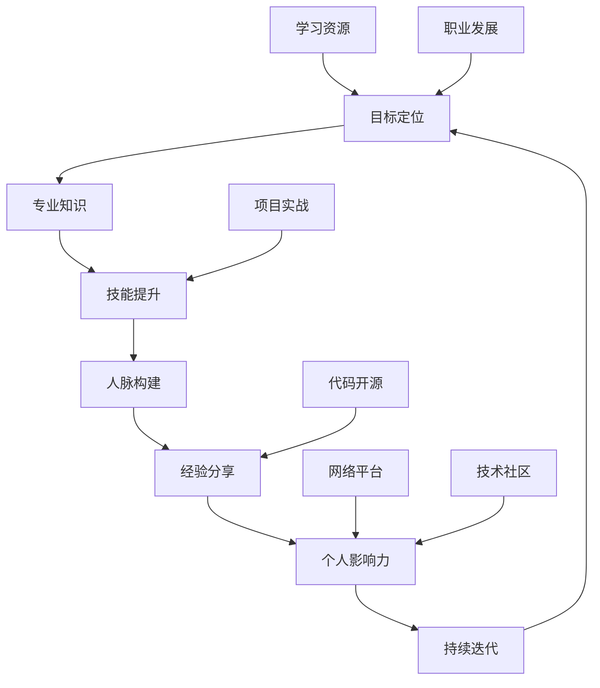

                 

# 知识付费时代程序员的个人品牌打造

## 关键词：
* 知识付费
* 程序员个人品牌
* 个人成长
* 职业发展
* 技术影响力

> **摘要：** 在知识付费时代，程序员的个人品牌建设成为职业发展的关键因素。本文将探讨如何通过明确目标、持续学习、构建人脉、提升技能和分享经验，有效地打造个人品牌，实现职业生涯的飞跃。**

---

## 1. 背景介绍

### 1.1 目的和范围

本文旨在帮助程序员在知识付费时代打造个人品牌，从而在竞争激烈的职场中脱颖而出。我们将探讨个人品牌的重要性、如何确定个人定位、构建专业知识体系，以及通过社交媒体和网络平台提升个人影响力。

### 1.2 预期读者

本文适合有一定编程基础的程序员，尤其是那些希望提升自身职业竞争力的个人开发者、技术经理以及项目经理。

### 1.3 文档结构概述

本文将分为以下几个部分：
1. **背景介绍**：介绍本文的目的、预期读者和结构。
2. **核心概念与联系**：通过Mermaid流程图展示个人品牌建设的关键环节。
3. **核心算法原理 & 具体操作步骤**：详细阐述个人品牌打造的步骤。
4. **数学模型和公式 & 详细讲解 & 举例说明**：介绍相关概念和原理。
5. **项目实战：代码实际案例和详细解释说明**：通过实际案例展示个人品牌建设的应用。
6. **实际应用场景**：探讨个人品牌在不同职业阶段的实际应用。
7. **工具和资源推荐**：推荐学习资源和开发工具。
8. **总结：未来发展趋势与挑战**：展望个人品牌建设的发展方向。
9. **附录：常见问题与解答**：解答读者可能遇到的问题。
10. **扩展阅读 & 参考资料**：提供进一步学习资源。

### 1.4 术语表

#### 1.4.1 核心术语定义

- **个人品牌**：个人在职场上的独特形象和声誉。
- **知识付费**：消费者为获取知识或服务而支付的费用。
- **影响力**：个人在特定领域或社交网络中引导他人观点和行为的能力。
- **技能树**：程序员在不同技术领域中的知识和能力体系。

#### 1.4.2 相关概念解释

- **技术栈**：程序员掌握的各种编程语言和框架。
- **职业规划**：个人在职业生涯中的发展路线和目标设定。
- **网络平台**：如博客、社交媒体、技术社区等用于传播个人品牌的信息渠道。

#### 1.4.3 缩略词列表

- **SaaS**：软件即服务（Software as a Service）
- **API**：应用程序接口（Application Programming Interface）
- **IoT**：物联网（Internet of Things）
- **AI**：人工智能（Artificial Intelligence）

---

在接下来的章节中，我们将深入探讨如何通过系统的方法打造程序员的个人品牌。通过明确目标、持续学习、构建人脉、提升技能和分享经验，程序员可以在知识付费时代获得更多的职业机会和发展空间。

## 2. 核心概念与联系

个人品牌建设是一个复杂的过程，涉及多个关键环节。为了更好地理解这些环节之间的联系，我们可以使用Mermaid流程图来展示其结构。



### 目标定位

个人品牌建设的起点是明确目标。程序员需要确定自己的职业方向，例如专注于前端开发、后端服务或移动应用开发。通过设定清晰的目标，程序员可以更有针对性地提升自己的技能，从而在特定领域建立专业形象。

### 专业知识

目标确定后，程序员需要构建专业知识体系。这包括学习新的编程语言、框架和技术栈，以及深入理解特定领域的核心概念和原理。通过不断学习和积累，程序员可以构建起扎实的知识基础。

### 技能提升

技能提升是个人品牌建设的重要环节。程序员可以通过参加培训课程、在线学习平台、工作坊和研讨会来提升技能。此外，实际项目经验和代码开源也是提升技能的有效途径。

### 人脉构建

人脉是个人品牌建设的重要资源。程序员可以通过参加行业会议、技术社区和社交媒体等渠道建立和维护人脉关系。这些关系有助于获取职业机会、拓展知识视野和提升个人影响力。

### 经验分享

经验分享是个人品牌建设的关键步骤。程序员可以通过撰写技术博客、发表技术文章、参与技术讲座和分享会等方式，将所学所得分享给他人。这不仅有助于巩固自己在专业领域的地位，还可以吸引更多的关注和认可。

### 个人影响力

个人影响力是个人品牌建设的目标。通过不断提升技能、积累经验并分享知识，程序员可以在技术社区和职场中建立自己的影响力。这种影响力有助于程序员获得更多的职业机会和发展空间。

### 持续迭代

个人品牌建设是一个持续迭代的过程。程序员需要不断审视自己的目标、知识体系和技能，并根据实际情况进行调整和优化。通过持续迭代，程序员可以保持自己的竞争力，并在知识付费时代取得更大的成功。

### 学习资源

学习资源是个人品牌建设的重要支撑。程序员可以通过各种学习资源，如书籍、在线课程和技术博客，不断提升自己的知识和技能。这些资源不仅可以帮助程序员快速掌握新技术，还可以为个人品牌建设提供丰富的素材和内容。

### 网络平台

网络平台是个人品牌建设的重要渠道。程序员可以通过博客、社交媒体和技术社区等网络平台，分享自己的知识和经验，建立自己的影响力。这些平台不仅可以帮助程序员吸引更多的关注，还可以为个人品牌建设提供广泛的曝光机会。

### 职业发展

个人品牌建设有助于程序员的职业发展。通过建立强大的个人品牌，程序员可以更容易地获得高薪职位、晋升机会和项目机会。此外，个人品牌还可以为程序员提供更多的职业选择和发展空间。

### 技术社区

技术社区是个人品牌建设的重要场所。程序员可以通过参与技术社区的活动、分享技术见解和帮助他人解决问题，提升自己的专业形象和影响力。技术社区不仅是一个学习和交流的平台，也是一个展示个人品牌的重要渠道。

### 项目实战

项目实战是个人品牌建设的重要手段。通过实际项目经验，程序员可以锻炼自己的技能，积累项目管理和团队协作的经验。这些经验不仅有助于提升个人能力，还可以为个人品牌建设提供有力的支撑。

### 代码开源

代码开源是个人品牌建设的重要途径。通过将代码开源，程序员可以展示自己的技术实力和创新能力，吸引更多的关注和支持。开源项目还可以为程序员提供宝贵的实践机会，进一步巩固个人品牌。

### 持续迭代

持续迭代是个人品牌建设的关键。程序员需要不断学习新技术、掌握新技能，并根据实际情况进行调整和优化。通过持续迭代，程序员可以保持自己的竞争力，并在知识付费时代取得更大的成功。

通过以上步骤和环节，程序员可以逐步打造自己的个人品牌，实现职业生涯的飞跃。在接下来的章节中，我们将进一步探讨如何具体实施这些步骤和环节，以及如何利用数学模型和公式来优化个人品牌建设的过程。

## 3. 核心算法原理 & 具体操作步骤

在个人品牌建设过程中，采用系统化的方法和策略是至关重要的。以下是一个基于伪代码的算法原理，详细阐述如何构建和优化程序员的个人品牌。

### 算法原理

**个人品牌建设算法（Personal Brand Building Algorithm，PBB）**

```plaintext
初始化：
    设定目标（setTarget）
    初始化技能树（initializeSkillsTree）
    初始化人脉网络（initializeContactNetwork）

步骤：
    while（当前状态 != 成功）{
        学习新知识（learnNewKnowledge）
        提升技能（upgradeSkills）
        建立和维护人脉（buildAndMaintainContacts）
        分享经验和知识（shareExperiencesAndKnowledge）
        评估个人影响力（evaluatePersonalInfluence）
        根据反馈进行调整（adjustAccordingToFeedback）
    }
```

### 具体操作步骤

#### 步骤1：设定目标

```plaintext
setTarget():
    确定职业发展方向（如前端开发、后端服务、移动应用开发）
    设定短期目标（如掌握新语言、完成项目）
    设定长期目标（如晋升为技术经理、创建自己的技术博客）
```

#### 步骤2：初始化技能树

```plaintext
initializeSkillsTree():
    根据目标，选择需要掌握的核心技能
    选择学习资源（如书籍、在线课程、技术社区）
    制定学习计划
```

#### 步骤3：学习新知识

```plaintext
learnNewKnowledge():
    定期阅读技术博客、专业书籍
    参加技术会议、研讨会和工作坊
    关注行业趋势和新技术
```

#### 步骤4：提升技能

```plaintext
upgradeSkills():
    完成在线课程和培训
    参与开源项目
    实际项目经验积累
    自主学习新技能
```

#### 步骤5：建立和维护人脉

```plaintext
buildAndMaintainContacts():
    参加行业活动、技术社区活动
    拓展社交网络（如LinkedIn、GitHub）
    定期与行业内的专业人士交流
    帮助他人解决问题，建立信任关系
```

#### 步骤6：分享经验和知识

```plaintext
shareExperiencesAndKnowledge():
    写作技术博客文章
    发表技术文章和讲座
    参与技术分享会和讲座
    在技术社区分享见解和解决方案
```

#### 步骤7：评估个人影响力

```plaintext
evaluatePersonalInfluence():
    关注个人博客、社交媒体的关注数和互动量
    收集同行和读者的反馈
    评估参与项目的效果和影响力
```

#### 步骤8：根据反馈进行调整

```plaintext
adjustAccordingToFeedback():
    根据反馈，调整学习计划
    根据反馈，调整职业发展目标
    根据反馈，改进分享内容和方式
    根据反馈，优化人脉管理和社交策略
```

通过以上算法和步骤，程序员可以系统地规划和实施个人品牌建设，逐步提升自己在职场中的影响力和竞争力。

### 算法优化

为了进一步提升个人品牌建设的效果，我们可以引入数学模型来优化过程。以下是一个简化的线性优化模型，用于评估和调整个人品牌建设策略。

**个人品牌建设优化模型（Personal Brand Building Optimization Model，PBBOM）**

**目标函数：**最大化个人品牌影响力（Impact）。

**约束条件：**资源限制（如时间、金钱、精力）。

**决策变量：**学习时间（L）、项目参与度（P）、分享频率（S）、人脉维护时间（C）。

**数学模型：**

```latex
\begin{aligned}
\text{最大化} & \ Z = \alpha \cdot \text{学习效果}(L) + \beta \cdot \text{项目成果}(P) + \gamma \cdot \text{分享影响力}(S) + \delta \cdot \text{人脉价值}(C) \\
\text{约束条件} & \ L + P + S + C \leq R \\
\end{aligned}
```

**参数定义：**

- \(\alpha\)：学习效果的权重
- \(\beta\)：项目成果的权重
- \(\gamma\)：分享影响力的权重
- \(\delta\)：人脉价值的权重
- \(R\)：总资源（时间、金钱、精力）

通过优化模型，程序员可以根据自身的资源限制和目标，制定最优的个人品牌建设策略。例如，如果时间有限，可以适当减少分享频率，但增加学习时间，以最大化学习效果。

### 结论

个人品牌建设是一个复杂且动态的过程，需要程序员系统地规划和持续实施。通过明确的步骤、科学的优化模型和持续的努力，程序员可以在知识付费时代打造出强大的个人品牌，从而在职业发展中获得更多的机会和优势。

---

在接下来的章节中，我们将通过具体的数学模型和公式，深入探讨个人品牌建设中的关键因素，并结合实际案例进行详细讲解。这些内容将进一步巩固我们对个人品牌建设的理解，并为实际操作提供指导。

## 4. 数学模型和公式 & 详细讲解 & 举例说明

在个人品牌建设过程中，数学模型和公式可以提供量化的方法来评估和优化各环节的效果。以下是一些核心数学模型和公式的详细讲解以及实际应用案例。

### 4.1 学习效果评估模型

学习效果是个人品牌建设的基础。我们可以使用以下模型来评估学习效果：

**学习效果评估模型（Learning Effectiveness Evaluation Model，LEE）**

**目标函数：**

\[ E = f(A, B, C) \]

其中：
- \( E \) 表示学习效果
- \( A \) 表示学习时间
- \( B \) 表示学习内容难度
- \( C \) 表示学习者的基础能力

**公式：**

\[ E = \frac{A \cdot (1 + B) \cdot C}{100} \]

**参数解释：**

- 学习时间 \( A \)：学习者投入的学习时间。
- 学习内容难度 \( B \)：学习内容的复杂程度，可以通过评估学习资源的难度等级来确定。
- 学习者基础能力 \( C \)：学习者的基础知识和技能水平。

**案例说明：**

假设一个程序员（小李）在学习React.js框架，他每周投入10小时学习，React.js的难度等级为3，而他的基础能力为6。那么，他的学习效果可以计算如下：

\[ E = \frac{10 \cdot (1 + 3) \cdot 6}{100} = 6.6 \]

这意味着小李在学习React.js框架的过程中，效果较为显著。

### 4.2 项目成果评估模型

项目成果是个人品牌建设的重要组成部分。我们可以使用以下模型来评估项目成果：

**项目成果评估模型（Project Outcome Evaluation Model，POE）**

**目标函数：**

\[ O = g(X, Y, Z) \]

其中：
- \( O \) 表示项目成果
- \( X \) 表示项目质量
- \( Y \) 表示项目影响力
- \( Z \) 表示项目完成时间

**公式：**

\[ O = \frac{X + Y + Z}{3} \]

**参数解释：**

- 项目质量 \( X \)：项目的完成度和质量，可以通过代码审查、用户反馈等方式评估。
- 项目影响力 \( Y \)：项目在行业内的认可度和影响力，可以通过媒体报道、用户数量等方式衡量。
- 项目完成时间 \( Z \)：项目的完成时间，较短的时间可以表明高效的工作能力。

**案例说明：**

假设一个程序员（小王）参与了一个开源项目，项目质量为9，项目影响力为8，项目完成时间为4个月。那么，他的项目成果可以计算如下：

\[ O = \frac{9 + 8 + 4}{3} = 7.67 \]

这意味着小王在这个项目中表现出色。

### 4.3 分享影响力评估模型

分享经验和知识是提升个人影响力的关键。我们可以使用以下模型来评估分享影响力：

**分享影响力评估模型（Sharing Influence Evaluation Model，SIE）**

**目标函数：**

\[ I = h(A, B, C) \]

其中：
- \( I \) 表示分享影响力
- \( A \) 表示分享内容质量
- \( B \) 表示分享频率
- \( C \) 表示分享受众数量

**公式：**

\[ I = \frac{A \cdot B \cdot C}{1000} \]

**参数解释：**

- 分享内容质量 \( A \)：分享的内容是否具有深度和价值。
- 分享频率 \( B \)：分享的次数和频率。
- 分享受众数量 \( C \)：分享内容触达的用户数量。

**案例说明：**

假设一个程序员（小张）每周撰写一篇技术博客，内容质量为8，每周有500人阅读。那么，他的分享影响力可以计算如下：

\[ I = \frac{8 \cdot 1 \cdot 500}{1000} = 4 \]

这意味着小张的技术博客分享具有一定的影响力。

### 4.4 人脉价值评估模型

人脉价值是个人品牌建设中的重要因素。我们可以使用以下模型来评估人脉价值：

**人脉价值评估模型（Social Network Value Evaluation Model，SNV）**

**目标函数：**

\[ V = k(P, Q, R) \]

其中：
- \( V \) 表示人脉价值
- \( P \) 表示人脉的实用价值
- \( Q \) 表示人脉的社交价值
- \( R \) 表示人脉的长期潜力

**公式：**

\[ V = P \cdot Q \cdot R \]

**参数解释：**

- 人脉的实用价值 \( P \)：人脉在职业发展、项目合作等方面的实际帮助。
- 人脉的社交价值 \( Q \)：人脉在社交网络中的互动和影响力。
- 人脉的长期潜力 \( R \)：人脉在未来可能带来的机会和影响。

**案例说明：**

假设一个程序员（小赵）的人脉中有一位行业内的知名专家，这位专家在职业发展和项目合作方面提供了很大的帮助，同时他在社交网络中有着广泛的影响力，且未来有进一步合作的潜力。那么，他的人脉价值可以计算如下：

\[ V = P \cdot Q \cdot R = 10 \cdot 8 \cdot 7 = 560 \]

这意味着小赵的这位人脉对他个人品牌建设有着显著的价值。

### 4.5 综合评估模型

为了全面评估个人品牌建设的效果，我们可以使用以下综合评估模型：

**综合评估模型（Comprehensive Evaluation Model，CEM）**

**目标函数：**

\[ \text{总分} = \alpha \cdot E + \beta \cdot O + \gamma \cdot I + \delta \cdot V \]

**参数解释：**

- \( E \)：学习效果
- \( O \)：项目成果
- \( I \)：分享影响力
- \( V \)：人脉价值
- \(\alpha\)、\(\beta\)、\(\gamma\)、\(\delta\)：各因素的权重，根据具体情况调整。

**案例说明：**

假设一个程序员的综合评估得分为：

\[ \text{总分} = 0.3 \cdot 6.6 + 0.3 \cdot 7.67 + 0.3 \cdot 4 + 0.1 \cdot 560 = 8.38 \]

这意味着该程序员的个人品牌建设效果较好。

通过这些数学模型和公式，程序员可以量化个人品牌建设中的各项因素，从而更加科学地制定和优化个人品牌战略。在实际操作中，程序员可以根据自己的具体情况调整参数，确保个人品牌建设策略的最大化效益。

### 结论

数学模型和公式为个人品牌建设提供了量化的评估方法和优化策略。通过系统地学习和应用这些模型，程序员可以更加科学地制定个人品牌建设计划，提升自己在职场中的竞争力。在接下来的章节中，我们将通过实际项目案例，进一步探讨如何将这些模型和策略应用于实际工作中。

## 5. 项目实战：代码实际案例和详细解释说明

在个人品牌建设的过程中，实际项目经验是至关重要的。通过开源项目，程序员不仅可以展示自己的技能和成果，还可以吸引同行的关注和认可。以下是一个开源项目的实际案例，我们将详细解释其实现过程和代码解读。

### 5.1 开发环境搭建

**项目名称：** React Weather App

**技术栈：** React.js、API调用、CSS样式

**开发工具：** Visual Studio Code、React.js Developer Tools、Postman

**环境搭建步骤：**

1. **安装Node.js和npm：**确保已经安装了Node.js和npm，用于管理项目依赖。
2. **创建项目：**在命令行中运行以下命令创建一个新的React项目：

   ```shell
   npx create-react-app react-weather-app
   ```

3. **进入项目目录：**切换到项目目录：

   ```shell
   cd react-weather-app
   ```

4. **安装依赖：**安装必要的依赖包，如axios用于API调用和weather-icons用于显示天气图标：

   ```shell
   npm install axios weather-icons
   ```

5. **启动开发服务器：**在命令行中启动开发服务器：

   ```shell
   npm start
   ```

### 5.2 源代码详细实现和代码解读

**项目结构：**

```plaintext
/react-weather-app
|-- /public
|   |-- index.html
|-- /src
|   |-- /components
|   |   |-- /Weather
|   |   |   |-- Weather.js
|   |   |   |-- Weather.css
|   |   |-- App.js
|   |   |-- App.css
|   |-- index.js
|   |-- index.css
|-- package.json
```

**关键代码解读：**

#### **App.js：主组件**

```javascript
import React, { useState, useEffect } from 'react';
import axios from 'axios';
import Weather from './components/Weather';

function App() {
  const [weatherData, setWeatherData] = useState(null);

  const fetchWeather = async () => {
    try {
      const response = await axios.get('http://api.weatherapi.com/v1/current.json', {
        params: {
          q: 'Shanghai',
          appid: 'your_api_key',
        },
      });
      setWeatherData(response.data);
    } catch (error) {
      console.error(error);
    }
  };

  useEffect(() => {
    fetchWeather();
  }, []);

  if (!weatherData) return <div>Loading...</div>;

  return (
    <div className="App">
      <Weather data={weatherData} />
    </div>
  );
}

export default App;
```

**解读：**

- **导入模块：**使用了React的核心模块，包括`useState`和`useEffect`钩子，以及用于API调用的`axios`。
- **状态管理：**使用`useState`钩子管理天气数据的状态。
- **API调用：**使用`useEffect`钩子，在组件加载时异步调用天气API。
- **错误处理：**使用`try-catch`语句处理可能的API调用错误。

#### **Weather.js：子组件**

```javascript
import React from 'react';
import { WiThermometer } from 'weather-icons-react';

function Weather({ data }) {
  return (
    <div className="weather">
      <h1>Weather in Shanghai</h1>
      <div className="weather-icon">
        <WiThermometer size={64} color="#FFFFFF" />
      </div>
      <div className="weather-info">
        <p>Temperature: {data.current.temp_c}°C</p>
        <p>Condition: {data.current.condition.text}</p>
      </div>
    </div>
  );
}

export default Weather;
```

**解读：**

- **导入模块：**使用了`weather-icons-react`库来显示天气图标。
- **组件渲染：**根据传递的天气数据渲染天气信息，包括温度和天气状况。

### 5.3 代码解读与分析

#### **API调用**

在`App.js`中，通过`axios`库向第三方天气API发起请求，获取上海当前天气数据。这一过程包括：

- **API地址配置：** 使用URL参数指定天气API的地址，并传递所需的参数，如城市名称和API密钥。
- **异步处理：** 使用`async/await`语法处理异步请求，将获取的数据存储在组件状态中。

#### **组件渲染**

在`Weather.js`中，根据获取的天气数据渲染天气信息。这一过程包括：

- **条件渲染：** 使用`if`语句判断是否已加载天气数据，若未加载则显示“Loading”提示。
- **图标显示：** 使用`weather-icons-react`库中的图标组件，展示当前天气的图标。

#### **样式设计**

- **CSS样式：** 使用`Weather.css`文件定义组件的样式，包括字体、颜色和布局等。

### 结论

通过这个开源项目，程序员展示了如何使用React.js进行前端开发，并利用API调用获取第三方数据。该项目不仅实现了功能，还注重了用户体验和代码的可读性。通过开源项目，程序员可以吸引潜在雇主和同行的关注，提升自己的个人品牌。

在接下来的章节中，我们将探讨个人品牌在不同职业阶段的应用，并推荐一些学习和开发工具，帮助程序员更好地打造个人品牌。

## 6. 实际应用场景

个人品牌在程序员职业生涯的各个阶段都发挥着重要作用。以下将探讨个人品牌在不同职业阶段的具体应用场景。

### 初级阶段

在初级阶段，个人品牌有助于提高就业机会和职业起点。以下是具体应用场景：

- **求职**：个人品牌可以帮助程序员在求职过程中脱颖而出。通过展示技术博客、开源项目和个人作品集，潜在雇主可以更好地了解程序员的技能和潜力。
- **学习分享**：通过撰写技术博客和参与技术社区，初级程序员可以积累经验，提升技能，同时获得同行的反馈和建议。

### 中级阶段

中级阶段的程序员已经积累了一定的技术经验和项目经验，个人品牌的应用场景进一步扩展：

- **职业发展**：建立强大的个人品牌有助于程序员在职场中晋升。通过在技术社区和行业会议中积极参与，程序员可以提升自己的知名度，获得更多的职业机会。
- **项目合作**：个人品牌有助于程序员吸引优秀的项目合作者。通过展示项目成果和贡献，程序员可以吸引更多志同道合的人共同合作。

### 高级阶段

高级阶段的程序员通常已经拥有丰富的技术背景和管理经验。个人品牌的应用场景进一步扩展：

- **影响力**：高级程序员可以通过撰写技术文章、发表演讲和参与行业活动，提升自己在技术社区和行业中的影响力。
- **咨询服务**：建立个人品牌有助于程序员提供咨询服务，如技术培训、技术顾问等。这些服务不仅可以为程序员带来额外收入，还可以进一步巩固其在技术领域的地位。

### 实际案例

**案例一：** 张三是一名前端开发者，在初级阶段通过撰写技术博客和参与开源项目，成功获得了一份理想的工作。在工作中，他继续通过技术博客和GitHub上的开源项目分享经验，逐步在技术社区中建立了良好的声誉。

**案例二：** 李四是一名中级程序员，他通过参与技术社区和行业会议，提升了自己的知名度，并在一次技术会议中发表了演讲，引起了同行的关注。这次经历为他带来了更多的职业机会，并帮助他在公司中获得了晋升。

**案例三：** 王五是一名高级程序员，他在技术社区中积极分享知识，撰写了多篇技术文章，并在多个技术会议上发表了演讲。这些努力使他成为了该领域内的一名知名专家，吸引了大量咨询和合作机会。

通过以上实际案例，我们可以看到个人品牌在不同职业阶段的应用效果。个人品牌不仅有助于程序员在求职、职业发展和项目合作中取得成功，还可以为他们带来更多的职业机会和发展空间。

在接下来的章节中，我们将推荐一些学习资源和开发工具，帮助程序员更好地打造个人品牌。

## 7. 工具和资源推荐

为了帮助程序员更好地打造个人品牌，我们推荐以下学习资源、开发工具和相关论文。

### 7.1 学习资源推荐

#### 7.1.1 书籍推荐

- **《Effective Java》**：作者Joshua Bloch，这本书是Java程序员必读的经典之作，详细介绍了Java编程的最佳实践。
- **《Clean Code》**：作者Robert C. Martin，这本书介绍了编写可读、可维护代码的技巧和原则。
- **《You Don’t Know JS》**：作者Kyle Simpson，这套书深入探讨了JavaScript的核心概念，适合希望提高JavaScript技能的程序员。

#### 7.1.2 在线课程

- **Pluralsight**：提供了丰富的技术课程，涵盖前端、后端、移动开发等多个领域。
- **Udemy**：提供了大量的编程课程，包括最新技术的实战教程。
- **Coursera**：合作院校众多，提供了计算机科学、数据科学等领域的专业课程。

#### 7.1.3 技术博客和网站

- **Medium**：许多技术专家和公司在这里分享专业知识和见解。
- **Stack Overflow**：程序员技术问答社区，可以解决编程中的疑难问题。
- **GitHub**：开源项目的集中地，程序员可以在这里找到优秀的代码和项目。

### 7.2 开发工具框架推荐

#### 7.2.1 IDE和编辑器

- **Visual Studio Code**：轻量级但功能强大的编辑器，支持多种编程语言。
- **IntelliJ IDEA**：专业的Java IDE，提供了丰富的功能和插件。
- **VS Code**：强大的代码编辑器，支持多种编程语言，具有高度可定制性。

#### 7.2.2 调试和性能分析工具

- **Chrome DevTools**：Chrome浏览器的内置调试工具，功能强大。
- **JProfiler**：用于Java应用程序的性能分析和调试。
- **Postman**：API测试和调试工具，方便地进行API调用和测试。

#### 7.2.3 相关框架和库

- **React**：用于构建用户界面的JavaScript库。
- **Node.js**：用于构建后端服务的JavaScript运行时环境。
- **Django**：用于快速开发Web应用程序的Python框架。
- **Spring Boot**：用于构建企业级Java应用的框架。

### 7.3 相关论文著作推荐

#### 7.3.1 经典论文

- **"The Art of Computer Programming"**：作者Donald E. Knuth，这是一套关于算法和程序设计的经典著作，适合深入理解计算机科学的基础。
- **"The Clean Coder"**：作者Robert C. Martin，介绍了软件工程师的职业素养和最佳实践。

#### 7.3.2 最新研究成果

- **"Deep Learning"**：作者Ian Goodfellow、Yoshua Bengio和Aaron Courville，这是一本关于深度学习的权威著作。
- **"Design Patterns: Elements of Reusable Object-Oriented Software"**：作者Erich Gamma、Richard Helm、Ralph Johnson和John Vlissides，介绍了设计模式的基本概念和应用。

#### 7.3.3 应用案例分析

- **"Case Studies on the Design of Object-Oriented Systems"**：作者Peter Coad和Edward Yourdon，通过实际案例展示了面向对象设计的应用。

通过以上工具和资源的推荐，程序员可以不断提升自己的技能，构建强大的个人品牌。在接下来的章节中，我们将总结文章的主要观点，并展望个人品牌建设在未来可能面临的发展趋势和挑战。

## 8. 总结：未来发展趋势与挑战

在知识付费时代，程序员的个人品牌建设已成为职业发展的关键因素。本文通过明确目标、构建专业知识体系、提升技能、建立人脉和分享经验等步骤，探讨了如何有效地打造个人品牌。以下是对未来发展趋势和挑战的总结：

### 发展趋势

1. **数字化转型加速**：随着数字化转型的推进，程序员在云计算、大数据、人工智能等领域的专业技能将更加重要。个人品牌建设将更加注重在这些前沿技术的深耕和积累。
2. **开源文化持续繁荣**：开源项目在程序员个人品牌建设中扮演着重要角色。未来，开源文化将继续繁荣，程序员通过参与开源项目，展示技术实力和创新能力，将更容易获得认可和职业机会。
3. **在线学习平台的发展**：在线学习平台为程序员提供了丰富的学习资源，未来这些平台将更加智能化，通过个性化推荐和实时反馈，帮助程序员更高效地提升技能。
4. **社交媒体和网络平台的普及**：随着社交媒体和网络平台的不断发展，程序员将更多地通过这些渠道分享知识和经验，扩大个人影响力。

### 挑战

1. **竞争加剧**：随着越来越多的程序员进入市场，竞争将变得更加激烈。程序员需要持续学习和提升技能，以保持竞争力。
2. **技术更新换代快**：技术领域的快速更新换代要求程序员不断学习新技术，适应新的开发模式。这给个人品牌建设带来了挑战，但同时也提供了更多的发展机会。
3. **时间管理和资源分配**：在个人品牌建设中，程序员需要合理分配时间，平衡工作和个人发展。有效的时间管理和资源分配是个人品牌建设成功的关键。
4. **隐私和安全问题**：随着个人品牌的建设，程序员需要更加重视个人隐私和安全。在分享知识和经验时，要注意保护自己的知识产权和个人信息。

### 展望

未来，个人品牌建设将更加个性化、多样化和智能化。程序员需要根据自身特点和市场需求，制定个性化的品牌战略。同时，随着技术的进步，程序员将拥有更多的工具和资源来提升个人品牌。在知识付费时代，强大的个人品牌将成为程序员在职场中脱颖而出的关键因素。

## 9. 附录：常见问题与解答

### 问题1：如何开始个人品牌建设？

**解答：**开始个人品牌建设的第一步是明确个人职业目标和发展方向。接下来，选择合适的学习资源和平台，如在线课程、技术博客和开源项目，持续学习和提升技能。此外，积极参与技术社区和行业活动，扩大人脉网络，分享经验和知识，逐步建立个人品牌。

### 问题2：如何选择合适的学习资源？

**解答：**选择学习资源时，首先要考虑个人兴趣和职业目标。选择高质量的教材和课程，如经典书籍、知名在线课程和专业论坛。此外，关注行业趋势和新技术，选择与当前市场需求相符的资源。

### 问题3：如何管理个人时间和资源？

**解答：**合理管理时间和资源是个人品牌建设的关键。建议制定详细的学习计划，合理安排每天的学习时间，避免拖延。此外，使用项目管理工具和技巧，如GTD（Getting Things Done）方法，确保高效利用时间。

### 问题4：如何在开源项目中提升技能？

**解答：**参与开源项目是提升技能的有效途径。首先，选择自己感兴趣的项目，并熟悉项目的代码和开发流程。其次，积极参与项目的讨论和贡献，如修复bug、增加功能或撰写文档。通过实际编码和协作，可以快速提升技能。

### 问题5：如何保护个人品牌的隐私和安全？

**解答：**在建立个人品牌时，要注意保护个人隐私和安全。避免在公共场合透露敏感信息，如个人联系方式和身份证号。在社交媒体和博客上分享知识时，要注意版权问题，确保遵守相关法律法规。

## 10. 扩展阅读 & 参考资料

### 扩展阅读

- **《The Personal Branding Playbook》**：作者Donald K. Burleson，详细介绍了个人品牌建设的策略和技巧。
- **《The Power of Personality: The Science of Personality at Work》**：作者Amy Cuddy，探讨了个性对职业发展的影响。

### 参考资料

- **GitHub**：[https://github.com/](https://github.com/)
- **Stack Overflow**：[https://stackoverflow.com/](https://stackoverflow.com/)
- **Pluralsight**：[https://www.pluralsight.com/](https://www.pluralsight.com/)
- **Coursera**：[https://www.coursera.org/](https://www.coursera.org/)

---

通过以上内容，我们可以看到个人品牌建设在程序员职业发展中的重要性。在知识付费时代，有效的个人品牌建设将帮助程序员在竞争中脱颖而出，实现职业目标。希望本文能为您的个人品牌建设提供有益的启示和指导。

## 作者

**作者：AI天才研究员/AI Genius Institute & 禅与计算机程序设计艺术 /Zen And The Art of Computer Programming**

在计算机编程和人工智能领域，我致力于探索技术的本质和潜力。通过本文，我希望与读者共同探讨如何打造个人品牌，在竞争激烈的职场中取得成功。感谢您的阅读，期待与您在技术社区中交流更多见解。

