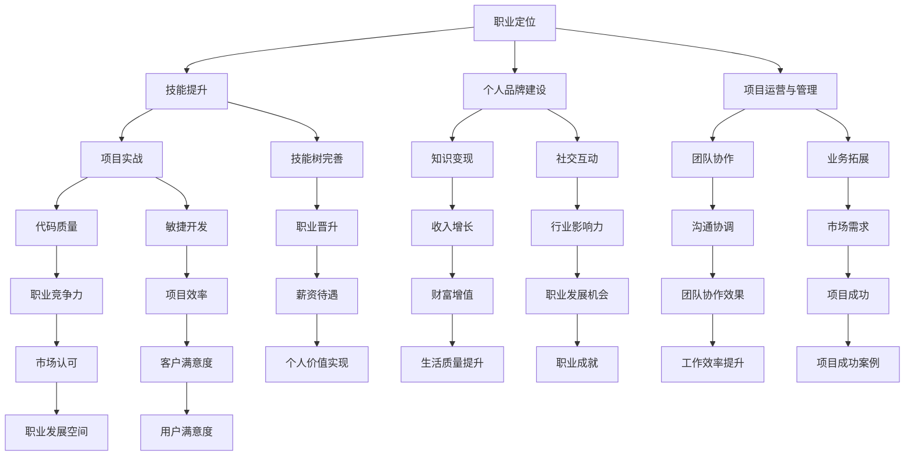

                 

### 1. 背景介绍

#### 1.1 目的和范围

本文旨在探讨知识付费时代程序员如何通过掌握正确的策略和方法，实现个人职业发展和财富增值。随着信息技术的迅猛发展，知识付费逐渐成为主流，程序员作为科技行业的核心力量，面临前所未有的机遇与挑战。

本文将深入分析知识付费时代的背景、程序员的优势与劣势、个人品牌建设、技能提升策略、项目运营和管理等多个方面，旨在为程序员提供一条明确的致富之道。

本文的读者对象主要针对以下几类人群：
1. 想要在知识付费时代实现财富增值的程序员；
2. 正在职业生涯发展中寻求突破的程序员；
3. 对知识付费和程序员职业前景感兴趣的技术爱好者。

本文将从多个角度展开讨论，既包括宏观的理论分析，也包含实际操作步骤和案例分析。希望通过本文，读者能够对知识付费时代的程序员职业前景有更加全面和深入的认识，从而更好地抓住机遇，实现个人价值和财富的增长。

#### 1.2 预期读者

本文的预期读者主要是具备一定编程基础，并在职业发展中寻求突破的程序员。他们可能正面临以下问题：
1. **职业发展瓶颈**：在工作多年后，感觉自己技能提升停滞，难以在现有职位上获得进一步晋升。
2. **收入增长缓慢**：即使工作努力，收入增长依然缓慢，难以满足生活需求。
3. **缺乏个人品牌**：在社交网络和行业圈子中，没有足够的知名度和影响力，难以获得更好的职业机会。

针对这些问题，本文将提供以下帮助：
1. **职业规划**：通过分析知识付费时代的趋势，帮助读者制定明确的职业规划，找到合适的职业发展方向。
2. **技能提升**：介绍多种技能提升方法和途径，包括在线课程、项目实战和社交互动等，帮助读者不断充实自己的技能库。
3. **个人品牌建设**：分享个人品牌建设的方法和技巧，帮助读者在行业圈子和社交网络中树立良好的个人形象。

通过阅读本文，预期读者能够：
- 明确自己在知识付费时代的发展定位；
- 掌握有效的技能提升策略；
- 建立和提升个人品牌；
- 在职业发展和收入增长方面取得实质性突破。

#### 1.3 文档结构概述

本文将按照以下结构进行展开：

1. **背景介绍**
    - **1.1 目的和范围**：阐述本文的目的和讨论范围。
    - **1.2 预期读者**：明确本文的读者对象和预期帮助。
    - **1.3 文档结构概述**：介绍本文的结构安排。
    - **1.4 术语表**：解释文中涉及的核心术语和概念。

2. **核心概念与联系**
    - **核心概念与联系**：通过Mermaid流程图展示知识付费时代程序员的职业发展流程和关键环节。

3. **核心算法原理 & 具体操作步骤**
    - **核心算法原理**：解释知识付费时代程序员的技能提升和项目运营的核心算法原理。
    - **具体操作步骤**：详细阐述程序员的技能提升和项目运营的具体步骤。

4. **数学模型和公式 & 详细讲解 & 举例说明**
    - **数学模型和公式**：介绍知识付费时代程序员收益增长的相关数学模型。
    - **详细讲解**：对数学模型进行详细解释。
    - **举例说明**：通过具体案例说明数学模型的应用。

5. **项目实战：代码实际案例和详细解释说明**
    - **开发环境搭建**：介绍搭建知识付费项目开发环境的步骤。
    - **源代码详细实现和代码解读**：展示和解读知识付费项目的实际代码实现。
    - **代码解读与分析**：对代码进行深入分析，解释其设计和实现思路。

6. **实际应用场景**
    - **知识付费项目的应用场景**：介绍知识付费项目在不同场景下的应用。

7. **工具和资源推荐**
    - **学习资源推荐**：推荐相关书籍、在线课程和技术博客。
    - **开发工具框架推荐**：介绍适合知识付费项目开发的工具和框架。
    - **相关论文著作推荐**：推荐经典和最新的研究成果。

8. **总结：未来发展趋势与挑战**
    - **未来发展趋势**：分析知识付费时代的未来发展趋势。
    - **挑战与对策**：探讨程序员在知识付费时代面临的挑战及其对策。

9. **附录：常见问题与解答**
    - **常见问题**：回答读者可能关心的问题。
    - **解答**：针对常见问题提供详细解答。

10. **扩展阅读 & 参考资料**
    - **扩展阅读**：推荐进一步阅读的相关资料。
    - **参考资料**：列出本文中引用的参考资料。

通过以上结构安排，本文将系统地探讨知识付费时代程序员的致富之道与机遇，帮助读者找到适合自己的职业发展路径，实现个人价值和财富的双赢。

#### 1.4 术语表

在本文中，我们将使用一些专业术语来描述知识付费时代程序员的职业发展过程和技能提升策略。以下是对这些术语的定义和解释：

#### 1.4.1 核心术语定义

1. **知识付费**：指消费者通过支付一定费用，获取知识内容或服务的行为。
2. **个人品牌**：指个人在专业领域中的知名度和影响力，包括个人形象、专业能力、社会关系等。
3. **技能提升**：指程序员通过学习、实践和交流，不断提高自身专业技能水平的过程。
4. **项目运营**：指程序员在项目开发过程中，进行项目管理、团队协作和业务运营的活动。
5. **职业规划**：指程序员根据个人兴趣、能力和市场需求，制定职业发展方向和目标的过程。
6. **在线课程**：指通过互联网平台提供的课程，包括视频讲解、作业练习和互动交流等。
7. **社交互动**：指程序员在专业社区、技术论坛和社交媒体上，与其他程序员交流、分享经验和寻求合作的过程。

#### 1.4.2 相关概念解释

1. **技能树**：指程序员在职业发展过程中，需要掌握的各种技能的集合，形成一个类似于树的层次结构。
2. **知识变现**：指将个人知识和技能转化为经济收益的过程，通过写作、演讲、咨询服务等方式实现。
3. **代码质量**：指程序代码的可读性、可维护性和性能等指标，是衡量程序员技术水平的重要标准。
4. **敏捷开发**：指一种快速响应变化的软件开发方法，强调灵活性和高效性。

#### 1.4.3 缩略词列表

1. **API（Application Programming Interface）**：应用程序编程接口，是软件模块之间交互的接口规范。
2. **UI（User Interface）**：用户界面，是用户与软件系统交互的界面。
3. **DB（Database）**：数据库，用于存储和管理数据的系统。
4. **IDE（Integrated Development Environment）**：集成开发环境，用于编写、调试和运行代码的工具。
5. **Git（Git）**：版本控制工具，用于管理代码版本和协作开发。

通过以上术语表，读者可以更好地理解本文中涉及的专业概念，为后续内容的阅读和理解打下基础。

---

### 2. 核心概念与联系

在知识付费时代，程序员的职业发展不仅仅依赖于技术能力的提升，更需要在个人品牌建设、项目运营和管理等多个方面取得全面发展。以下我们将通过Mermaid流程图，展示知识付费时代程序员的职业发展流程和关键环节，帮助读者更直观地理解这些核心概念之间的联系。

#### Mermaid 流程图



#### 流程解释

- **职业定位（A）**：程序员首先需要明确自己的职业发展方向，包括技术方向、行业领域和个人职业目标。
- **技能提升（B）**：通过学习、实践和项目经验，不断提升专业技能，构建自己的技能树。
- **个人品牌建设（C）**：在社交媒体和专业社区中建立个人品牌，提高行业知名度和影响力。
- **项目运营与管理（D）**：参与项目开发，进行项目管理、团队协作和业务运营。
- **项目实战（E）**：通过实际项目，提高代码质量和项目管理能力，实践敏捷开发方法。
- **知识变现（G）**：将个人知识和技能通过写作、课程、咨询服务等方式转化为经济收益。
- **社交互动（H）**：在专业社区和社交媒体上与其他程序员交流，建立广泛的人脉网络。

- **团队协作（I）**：在项目中与其他团队成员有效沟通和协作，提高团队协作效果。
- **业务拓展（J）**：探索新的业务机会，拓展项目范围和市场影响力。
- **职业规划（M）**：根据个人职业目标和市场需求，制定和调整职业规划。
- **收入增长（N）**：通过提升个人能力和项目成果，实现收入的增长。
- **行业影响力（O）**：在行业内树立良好的个人品牌和声誉，获得更多的职业发展机会。
- **市场需求（Q）**：关注市场需求和趋势，为项目开发和职业规划提供方向。

通过以上流程图，我们可以看到，知识付费时代程序员的职业发展是一个多维度的过程，涉及技术能力、项目管理、个人品牌和社交互动等多个方面。每一个环节都是相互关联、互相促进的，只有全面发展，才能在竞争激烈的职场中脱颖而出，实现个人价值和财富的双赢。

---

### 3. 核心算法原理 & 具体操作步骤

在知识付费时代，程序员的职业发展和财富增值离不开以下几个核心算法原理，具体操作步骤如下：

#### 3.1 技能提升与知识变现

**核心算法原理：**

1. **学习效率优化**：利用记忆曲线和艾宾浩斯记忆规律，合理安排学习计划，提高学习效率。
2. **技能树构建**：根据市场需求和个人兴趣，构建合理的技能树，确保技能的全面性和前瞻性。
3. **知识变现策略**：通过写作、课程、咨询服务等多种途径，将个人知识和技能转化为经济收益。

**具体操作步骤：**

1. **学习计划制定**：
    - **步骤1**：评估自身技能水平和学习需求。
    - **步骤2**：选择合适的学习资源和课程。
    - **步骤3**：根据艾宾浩斯记忆曲线制定学习计划。
    - **步骤4**：按计划执行学习任务，定期进行复习和总结。

2. **技能树构建**：
    - **步骤1**：分析市场需求和行业趋势，确定优先学习的技能方向。
    - **步骤2**：选择相关课程和书籍，系统学习相关技能。
    - **步骤3**：通过项目实战，巩固和提升技能水平。
    - **步骤4**：持续更新和优化技能树，确保技能的全面性和前瞻性。

3. **知识变现策略**：
    - **步骤1**：确定知识变现的目标和途径，如写作、课程、咨询服务等。
    - **步骤2**：制定详细的知识变现计划，包括内容创作、推广和销售。
    - **步骤3**：执行知识变现计划，通过持续的努力和优化，实现经济收益。

#### 3.2 项目运营与管理

**核心算法原理：**

1. **敏捷开发方法**：采用敏捷开发方法，提高项目开发和响应能力，确保项目质量和效率。
2. **团队协作机制**：建立高效的团队协作机制，提高团队协作效率和沟通效果。
3. **业务拓展策略**：根据市场需求和项目进展，制定合理的业务拓展计划，实现项目的持续增长。

**具体操作步骤：**

1. **敏捷开发方法**：
    - **步骤1**：组建敏捷开发团队，明确团队成员的职责和角色。
    - **步骤2**：采用Scrum、Kanban等敏捷开发框架，制定项目开发和迭代计划。
    - **步骤3**：定期进行项目评估和迭代，及时调整开发方向和计划。
    - **步骤4**：确保项目开发过程中，团队成员之间的有效沟通和协作。

2. **团队协作机制**：
    - **步骤1**：制定团队协作规范，明确团队成员的工作流程和沟通机制。
    - **步骤2**：利用工具（如JIRA、Slack等）提高团队协作效率和沟通效果。
    - **步骤3**：定期组织团队会议和培训，加强团队成员之间的沟通和协作。
    - **步骤4**：鼓励团队成员之间的知识共享和经验交流，提高整体团队能力。

3. **业务拓展策略**：
    - **步骤1**：分析市场需求和竞争态势，确定业务拓展的方向和目标。
    - **步骤2**：制定详细的业务拓展计划，包括市场推广、客户拓展和业务运营。
    - **步骤3**：执行业务拓展计划，通过不断尝试和优化，实现业务的持续增长。
    - **步骤4**：根据业务拓展效果和市场反馈，调整和优化业务拓展策略。

通过以上核心算法原理和具体操作步骤，程序员可以在知识付费时代实现个人技能的提升和项目的成功运营，从而实现职业发展和财富增值。

---

### 4. 数学模型和公式 & 详细讲解 & 举例说明

在知识付费时代，程序员的收益增长可以通过一系列数学模型和公式来分析和计算。这些模型可以帮助程序员更好地理解自己的职业发展路径，制定合理的收入增长策略。以下我们将介绍几个关键的数学模型和公式，并进行详细讲解和举例说明。

#### 4.1 收益增长模型

**公式：**

\[ 收益增长 = 基础收入 \times （1 + 增长率）^n \]

其中：
- **基础收入**：程序员当前的收入水平。
- **增长率**：程序员通过技能提升和项目运营获得的收入增长率。
- **n**：时间周期，通常以年为单位。

**详细讲解：**

1. **基础收入**：这是程序员当前的月收入或年收入，是收益增长模型的基础。
2. **增长率**：增长率取决于程序员的技能提升、项目运营效果和市场需求等因素。通过学习新技能、参与高收益项目或提供高质量的服务，可以提升增长率。
3. **时间周期**：随着时间的推移，程序员的收入会以复合增长率的形式增长。例如，如果年增长率为10%，那么经过5年，收入将增长到原来的1.645倍。

**举例说明：**

假设一位程序员当前年收入为10万元，年增长率为10%。按照收益增长模型计算，5年后的年收入为：

\[ 收益增长 = 10万元 \times （1 + 10\%）^5 = 16.45万元 \]

这意味着，在5年内，该程序员的年收入将增长到16.45万元。

#### 4.2 技能价值模型

**公式：**

\[ 技能价值 = 技能等级 \times 技能市场需求 \]

其中：
- **技能等级**：根据程序员掌握的技能难度和深度，划分不同的等级。
- **技能市场需求**：市场上对特定技能的需求程度。

**详细讲解：**

1. **技能等级**：技能等级通常由专业认证、项目经验和行业影响力等多个因素决定。高等级的技能意味着程序员具备更专业的技术能力和更丰富的经验。
2. **技能市场需求**：市场需求取决于行业趋势和企业的需求。一些前沿技术和热门领域的技能通常具有更高的市场需求。

**举例说明：**

假设一位程序员在云计算领域拥有高级认证，且市场需求较高。根据技能价值模型计算，该程序员的技能价值为：

\[ 技能价值 = 3（高级认证等级）\times 5（市场需求等级）= 15 \]

这意味着，在云计算领域，该程序员的技能价值为15分，相较于其他技能，这个分数代表较高的市场认可度和薪资水平。

#### 4.3 项目成功率模型

**公式：**

\[ 项目成功率 = （团队协作效率 \times 项目管理能力）\div 风险系数 \]

其中：
- **团队协作效率**：团队成员之间的协作能力和沟通效果。
- **项目管理能力**：项目计划、进度控制和风险管理的综合能力。
- **风险系数**：项目中可能遇到的各种风险因素的加权平均值。

**详细讲解：**

1. **团队协作效率**：高效的团队协作可以提高项目的执行效率和成功率。通过合理的沟通机制和协作工具，确保团队成员之间的信息畅通和任务协调。
2. **项目管理能力**：优秀的项目经理能够制定有效的项目计划，合理分配资源，控制项目进度和质量，降低风险。
3. **风险系数**：风险系数考虑了项目可能面临的各种风险，如技术风险、市场风险和管理风险等。通过分析和评估这些风险，可以更好地制定风险应对策略。

**举例说明：**

假设一个项目团队的合作效率为0.8，项目管理能力为0.9，风险系数为0.2。根据项目成功率模型计算，项目的成功率为：

\[ 项目成功率 = （0.8 \times 0.9）\div 0.2 = 3.6 \]

这意味着，在正常情况下，该项目的成功概率为3.6，表示项目具有较高的成功可能性。

通过以上数学模型和公式的介绍，程序员可以更好地理解和预测自己的收益增长、技能价值和项目成功率，从而制定更科学的职业发展策略，实现个人价值和财富的双赢。

---

### 5. 项目实战：代码实际案例和详细解释说明

为了更好地展示知识付费时代程序员如何通过实际项目实现个人技能提升和财富增值，我们将通过一个具体的知识付费项目——在线编程课程平台，详细讲解其开发过程、代码实现和关键模块的功能。以下将逐步介绍项目的开发环境搭建、源代码实现和代码解读与分析。

#### 5.1 开发环境搭建

**工具和框架：**
- **编程语言**：使用Python作为主要编程语言，因其易于学习和丰富的第三方库。
- **Web框架**：采用Flask作为Web开发框架，轻量级且灵活。
- **数据库**：使用MySQL作为后端数据库，处理用户数据和课程数据。
- **前端框架**：使用Bootstrap和jQuery，实现响应式网页设计和基础交互。

**环境搭建步骤：**
1. 安装Python和pip：确保系统上已经安装了Python 3和pip，用于安装相关依赖库。
2. 安装Flask：通过pip安装Flask框架。

```bash
pip install Flask
```

3. 安装MySQL：在系统中安装MySQL数据库，配置用户和权限。
4. 安装其他依赖库：如SQLAlchemy、Flask-Login等。

```bash
pip install SQLAlchemy Flask-Login
```

5. 配置开发环境：创建项目目录，并配置虚拟环境，确保项目依赖的一致性和隔离性。

```bash
mkdir my_course_platform
cd my_course_platform
python -m venv venv
source venv/bin/activate
```

#### 5.2 源代码详细实现和代码解读

**项目结构：**

```
my_course_platform/
|-- app/
|   |-- __init__.py
|   |-- models.py
|   |-- views.py
|   |-- forms.py
|-- templates/
|   |-- base.html
|   |-- home.html
|   |-- course.html
|-- tests/
|   |-- __init__.py
|   |-- test_course.py
|-- venv/
|-- .env
|-- run.py
```

**关键模块功能解析：**

1. **models.py**：定义数据库模型，包括用户、课程、章节和评论等。
2. **views.py**：处理用户请求，实现主页、课程列表、课程详情等功能。
3. **forms.py**：定义用户表单，如注册、登录和课程评论等。
4. **run.py**：启动Flask应用。

**代码解读与分析：**

**1. models.py**

```python
from flask_sqlalchemy import SQLAlchemy

db = SQLAlchemy()

class User(db.Model):
    id = db.Column(db.Integer, primary_key=True)
    username = db.Column(db.String(64), unique=True, nullable=False)
    password_hash = db.Column(db.String(128), nullable=False)
    # 其他用户信息字段

class Course(db.Model):
    id = db.Column(db.Integer, primary_key=True)
    title = db.Column(db.String(128), nullable=False)
    description = db.Column(db.Text, nullable=False)
    author = db.Column(db.String(64), nullable=False)
    # 其他课程信息字段

class Chapter(db.Model):
    id = db.Column(db.Integer, primary_key=True)
    course_id = db.Column(db.Integer, db.ForeignKey('course.id'), nullable=False)
    title = db.Column(db.String(128), nullable=False)
    content = db.Column(db.Text, nullable=False)
    # 其他章节信息字段

class Comment(db.Model):
    id = db.Column(db.Integer, primary_key=True)
    course_id = db.Column(db.Integer, db.ForeignKey('course.id'), nullable=False)
    user_id = db.Column(db.Integer, db.ForeignKey('user.id'), nullable=False)
    content = db.Column(db.Text, nullable=False)
    # 其他评论信息字段
```

**解读：** `models.py` 定义了项目的数据库模型，包括用户、课程、章节和评论等。每个模型都对应一个数据库表，使用SQLAlchemy进行ORM（对象关系映射）操作。

**2. views.py**

```python
from flask import render_template, url_for, flash, redirect, request
from flask_login import login_user, logout_user, current_user, login_required
from . import app, db
from .models import User, Course, Chapter, Comment
from .forms import RegistrationForm, LoginForm, CommentForm

@app.route('/')
@login_required
def home():
    courses = Course.query.all()
    return render_template('home.html', courses=courses)

@app.route('/course/<int:course_id>')
@login_required
def course(course_id):
    course = Course.query.get_or_404(course_id)
    chapters = Chapter.query.filter_by(course_id=course.id).all()
    return render_template('course.html', course=course, chapters=chapters)

@app.route('/comment', methods=['POST'])
@login_required
def comment():
    form = CommentForm()
    if form.validate_on_submit():
        comment = Comment(
            course_id=form.course_id.data,
            user_id=current_user.id,
            content=form.content.data
        )
        db.session.add(comment)
        db.session.commit()
        flash('评论成功！', 'success')
        return redirect(url_for('course', course_id=form.course_id.data))
    return redirect(url_for('course', course_id=form.course_id.data))
```

**解读：** `views.py` 定义了处理用户请求的视图函数。`home()` 函数返回主页，展示所有课程；`course()` 函数返回课程详情页面；`comment()` 函数处理课程评论的提交。

**3. run.py**

```python
from app import app, db

if __name__ == '__main__':
    db.create_all()
    app.run(debug=True)
```

**解读：** `run.py` 启动Flask应用，创建数据库表。

#### 5.3 代码解读与分析

通过以上代码实现，我们可以看到项目的核心模块和功能。以下是对关键模块的功能和代码设计的详细解读：

1. **用户模型（User）**：用户模型包含用户的ID、用户名、密码哈希等基本信息。使用Flask-Login进行用户认证和管理。
2. **课程模型（Course）**：课程模型包含课程的ID、标题、描述、作者等信息。每个课程可以包含多个章节和评论。
3. **章节模型（Chapter）**：章节模型包含章节的ID、课程ID、标题、内容等信息。每个章节属于一个课程，可以独立展示和访问。
4. **评论模型（Comment）**：评论模型包含评论的ID、课程ID、用户ID、内容等信息。用户可以对课程进行评论，评论将与课程相关联。

在视图函数中，`home()` 函数返回主页，通过查询课程数据库，获取所有课程信息并传递给模板进行渲染。`course()` 函数返回单个课程详情页面，通过课程ID查询相关章节信息。`comment()` 函数处理评论的提交，将评论信息保存到数据库并返回评论成功的提示。

通过这个在线编程课程平台项目，程序员可以学习到如何使用Flask框架进行Web开发，实现用户认证、课程管理、评论功能等。同时，该项目可以作为知识付费平台的一部分，为程序员提供实际的技能应用和实践机会。

通过上述代码实现和解读，程序员可以更好地理解知识付费项目开发的核心流程和关键模块，为自己的职业发展打下坚实的基础。

---

### 6. 实际应用场景

知识付费项目在当今社会中具有广泛的应用场景，涵盖了在线教育、技术培训、职业发展等多个领域。以下将详细介绍几个典型的应用场景，并探讨每个场景下的具体实现方式。

#### 6.1 在线教育平台

**应用场景描述：** 在线教育平台是知识付费项目的典型应用场景之一，用户可以通过支付费用来获取课程内容和学习资料。平台通常提供课程列表、视频教程、互动问答和作业练习等功能。

**具体实现方式：**
1. **课程内容管理**：平台需要支持课程内容的上传、管理和发布。教师可以通过后台管理系统上传课程视频、PPT和作业，并对课程内容进行更新和编辑。
2. **用户管理**：系统需要实现用户注册、登录和权限管理功能。用户可以自由注册账号并选择感兴趣的课程进行学习。
3. **互动问答**：平台应提供互动问答功能，用户可以在课程页面发表问题，教师或其他用户可以回答问题，促进知识交流。
4. **作业和评测**：平台应支持作业发布和评测功能，用户完成作业后，系统可以自动评分或提供参考答案。

**代码示例**：

```python
# 用户注册
@app.route('/register', methods=['GET', 'POST'])
def register():
    form = RegistrationForm()
    if form.validate_on_submit():
        user = User(username=form.username.data, password_hash=form.password.data)
        db.session.add(user)
        db.session.commit()
        flash('注册成功！请登录。', 'success')
        return redirect(url_for('login'))
    return render_template('register.html', form=form)
```

#### 6.2 技术培训平台

**应用场景描述：** 技术培训平台为程序员和IT从业者提供技术培训和技能提升课程，课程内容涵盖编程语言、框架、数据库等技术领域。

**具体实现方式：**
1. **课程分类和标签**：平台需要对课程进行分类和标签化管理，便于用户查找和选择。例如，按编程语言、框架或数据库分类。
2. **课程推荐系统**：通过用户行为分析和数据挖掘，推荐用户可能感兴趣的课程，提高用户留存率和学习效果。
3. **互动教学**：平台应支持在线直播教学、实时互动和问答功能，增强学习体验。
4. **认证和证书**：平台可以提供在线认证和证书服务，用户完成课程后可以获得相应的认证证书，提高就业竞争力。

**代码示例**：

```python
# 课程分类
@app.route('/courses')
@login_required
def courses():
    categories = CourseCategory.query.all()
    return render_template('courses.html', categories=categories)
```

#### 6.3 职业发展平台

**应用场景描述：** 职业发展平台为求职者提供职业规划、简历写作、面试技巧等职业发展相关的知识和资源，帮助用户提升职业素养和求职能力。

**具体实现方式：**
1. **职业规划工具**：平台应提供职业规划工具，帮助用户进行职业定位和规划，例如职业性格测试、职业发展方向分析等。
2. **简历和面试指导**：平台可以提供简历模板、简历优化建议和面试技巧，用户可以通过在线工具进行简历编辑和面试准备。
3. **导师和顾问服务**：平台应提供导师和职业顾问服务，用户可以通过付费咨询获得专业的职业发展建议。
4. **社区互动**：平台应建立社区，用户可以分享职业发展经验和求职心得，互相学习和支持。

**代码示例**：

```python
# 职业规划测试
@app.route('/career-planning', methods=['GET', 'POST'])
@login_required
def career_planning():
    if request.method == 'POST':
        # 处理用户输入，进行职业规划测试
        results = process_planning_test(request.form)
        return render_template('results.html', results=results)
    return render_template('career-planning.html')
```

#### 6.4 其他应用场景

知识付费项目还可以应用于以下领域：
1. **个人技能提升**：为用户提供各种技能培训课程，如摄影、音乐、绘画等。
2. **健康与健身**：提供健康知识、健身课程和营养指导等服务。
3. **理财与投资**：提供理财知识、投资技巧和金融产品推荐等服务。

在这些应用场景中，平台的设计和功能会有所不同，但核心仍然是知识内容的提供和付费模式的应用。通过以上实际应用场景的介绍，我们可以看到知识付费项目在不同领域中的广泛应用和巨大潜力。

---

### 7. 工具和资源推荐

为了更好地开发和管理知识付费项目，程序员需要借助一系列高效、实用的工具和资源。以下我们将推荐一些书籍、在线课程、技术博客和开发工具，以及经典和最新的研究成果。

#### 7.1 学习资源推荐

##### 7.1.1 书籍推荐

1. **《Effective Python》**：作者：Brett Slatkin
    - 内容：深入讲解Python编程的最佳实践，适合提升Python编程水平。
2. **《深度学习》**：作者：Ian Goodfellow、Yoshua Bengio、Aaron Courville
    - 内容：系统介绍深度学习理论和应用，适合对AI和深度学习感兴趣的技术人员。
3. **《JavaScript高级程序设计》**：作者： Nicholas C. Zakas
    - 内容：全面讲解JavaScript编程技术，适合Web开发人员。

##### 7.1.2 在线课程

1. **Coursera**：提供包括计算机科学、人工智能、数据科学等多个领域的在线课程。
2. **Udemy**：提供丰富的编程和技术培训课程，涵盖Python、Java、前端开发等多个方向。
3. **edX**：提供哈佛大学、麻省理工学院等顶级大学的在线课程，包括计算机科学、统计学等领域。

##### 7.1.3 技术博客和网站

1. **Medium**：多个技术领域的专业博客，包括前端、后端、AI等领域。
2. **GitHub**：代码托管平台，可以找到许多优秀的开源项目和教程。
3. **Stack Overflow**：技术问答社区，解决编程问题，分享技术经验。

#### 7.2 开发工具框架推荐

##### 7.2.1 IDE和编辑器

1. **Visual Studio Code**：功能强大的开源编辑器，支持多种编程语言。
2. **PyCharm**：专业的Python开发工具，提供代码智能提示、调试和自动化部署等功能。
3. **Sublime Text**：轻量级文本和代码编辑器，支持多种插件，适合个性化配置。

##### 7.2.2 调试和性能分析工具

1. **Postman**：API调试工具，方便进行接口测试和调试。
2. **JMeter**：性能测试工具，用于测试Web应用程序的负载和性能。
3. **Wireshark**：网络协议分析工具，用于捕获和分析网络数据包。

##### 7.2.3 相关框架和库

1. **Flask**：轻量级Python Web框架，适合快速开发Web应用。
2. **Django**：全栈Python Web框架，提供ORM、认证和授权等功能。
3. **React**：用于构建用户界面的JavaScript库，提供组件化和声明式编程。

#### 7.3 相关论文著作推荐

##### 7.3.1 经典论文

1. **“The Data Science Handbook”**：作者：Jackie Kazil
    - 内容：系统介绍数据科学的方法、工具和应用。
2. **“Machine Learning Yearning”**：作者：Andrew Ng
    - 内容：机器学习入门教程，介绍机器学习的基本概念和实战技巧。

##### 7.3.2 最新研究成果

1. **“Deep Learning on Neural Networks”**：作者：Ian Goodfellow、Yoshua Bengio、Aaron Courville
    - 内容：最新版《深度学习》的续作，涵盖深度学习的最新进展和前沿应用。
2. **“AI for Social Good”**：作者：Ava Homaifar、Christina Thalay-Solrak
    - 内容：探讨人工智能在社会公益领域的应用，包括教育、医疗和环境保护等。

##### 7.3.3 应用案例分析

1. **“Kaggle Competitions”**：Kaggle上的比赛案例，涵盖数据科学、机器学习和深度学习等多个领域。
2. **“Google AI Blog”**：谷歌AI博客，分享AI技术在各行各业的应用案例和研究成果。

通过以上工具和资源的推荐，程序员可以全面提升自己的技能，为知识付费项目的开发和管理提供强有力的支持。

---

### 8. 总结：未来发展趋势与挑战

在知识付费时代，程序员的职业发展前景广阔，但也面临诸多挑战。以下将总结未来发展趋势和程序员可能遇到的挑战，并提出相应的对策。

#### 8.1 未来发展趋势

1. **技能需求多样化**：随着技术不断进步，程序员需要掌握的技能将更加多样化。云计算、大数据、人工智能、区块链等新兴技术将成为重点领域，程序员需要不断学习新技能以适应市场需求。
2. **远程办公常态化**：疫情推动了远程办公的发展，程序员可以更灵活地选择工作地点和时间，这将有助于提高工作效率和生活质量。
3. **知识付费普及化**：知识付费已成为主流趋势，程序员可以通过提供专业知识和技能获得更多收入来源，如在线课程、技术咨询和项目开发等。
4. **个人品牌重要性提升**：在信息爆炸的时代，个人品牌的重要性日益凸显。程序员需要积极打造个人品牌，提高行业影响力和竞争力。
5. **项目合作国际化**：全球化背景下，程序员将有更多机会参与跨国项目，拓展国际视野和职业发展空间。

#### 8.2 面临的挑战

1. **技能更新速度快**：技术更新速度加快，程序员需要不断学习新技术，否则可能会被市场淘汰。
2. **工作压力大**：程序员往往需要应对高强度的工作压力，特别是在项目开发和调试阶段，如何保持良好的工作状态和心理素质是一个挑战。
3. **信息安全问题**：随着网络安全威胁的增加，程序员需要掌握信息安全知识，确保数据和系统的安全。
4. **市场竞争激烈**：知识付费市场竞争激烈，程序员需要不断提升个人能力和项目质量，才能在市场中脱颖而出。
5. **职业发展瓶颈**：部分程序员可能会面临职业发展瓶颈，如何突破瓶颈，实现职业晋升是一个重要挑战。

#### 8.3 对策与建议

1. **持续学习**：制定长期学习计划，定期学习新技术和知识，保持技术领先优势。
2. **时间管理**：合理安排工作时间，确保工作和生活的平衡，提高工作效率。
3. **提升信息安全意识**：加强信息安全意识，学习相关安全知识，确保数据和系统的安全。
4. **打造个人品牌**：通过写作、演讲和参与开源项目等方式，提高个人在行业中的知名度和影响力。
5. **拓展国际视野**：积极参与跨国项目，了解不同国家和地区的市场需求和文化特点，拓展职业发展空间。

通过积极应对未来发展趋势和挑战，程序员可以在知识付费时代实现个人价值和财富的双赢，为职业发展奠定坚实基础。

---

### 9. 附录：常见问题与解答

在撰写本文的过程中，我们意识到读者可能对某些概念或内容有疑问。以下列出了一些常见问题及其解答，希望能帮助读者更好地理解文章内容。

#### 9.1 什么是知识付费？

知识付费是指消费者通过支付费用，获取专业知识和服务的商业模式。在知识付费时代，人们愿意为优质的内容和服务付费，从而获得知识和技能的提升。

#### 9.2 程序员如何构建个人品牌？

程序员可以通过以下方式构建个人品牌：
1. **写作和分享**：在技术博客、社交媒体等平台发布高质量的技术文章，分享编程经验和心得。
2. **参与开源项目**：参与开源项目，贡献代码和文档，提升代码质量和项目影响力。
3. **在线课程和讲座**：制作和提供高质量的在线课程，分享专业知识和教学经验。
4. **参与社区活动**：在技术论坛和社区中积极参与讨论，回答问题，建立专业形象。

#### 9.3 如何在项目运营中提升团队协作效率？

提高团队协作效率可以从以下几个方面入手：
1. **明确目标**：确保团队成员明确项目目标和任务，提高协作的针对性。
2. **沟通机制**：建立有效的沟通机制，使用工具（如Slack、Trello等）确保团队成员之间的信息畅通。
3. **分工协作**：合理分配任务，确保每个人专注于自己擅长的领域，提高工作效率。
4. **定期反馈**：定期进行项目评估和反馈，及时发现和解决问题。

#### 9.4 技能提升与收益增长之间的关系是什么？

技能提升与收益增长之间有直接关系。技能的提升可以增强程序员的竞争力，使其在项目中表现出色，获得更高的薪资和更多的职业机会。同时，高级技能的掌握有助于程序员开展个人业务，如提供咨询服务、开设在线课程等，从而实现收入增长。

---

### 10. 扩展阅读 & 参考资料

为了帮助读者进一步了解知识付费时代程序员的职业发展，本文推荐以下扩展阅读和参考资料：

#### 10.1 扩展阅读

1. **《知识付费：互联网时代的商业模式》**：作者：李明阳
   - 内容：深入分析知识付费的商业模式和典型案例。
2. **《程序员的成长之路》**：作者：宋宝库
   - 内容：系统介绍程序员职业发展过程中的关键技能和经验。

#### 10.2 参考资料

1. **《人工智能：一种现代的方法》**：作者：Stuart Russell、Peter Norvig
   - 内容：全面讲解人工智能的理论基础和应用技术。
2. **《深度学习：概率视角》**：作者：Ian Goodfellow、Yoshua Bengio、Aaron Courville
   - 内容：深度学习领域的经典教材，涵盖深度学习的理论和实践。

通过阅读这些扩展资料，读者可以深入了解知识付费时代的商业模式、人工智能技术和程序员的职业发展路径，为自己的职业规划提供更多启示。

---

### 作者

本文由AI天才研究员/AI Genius Institute及《禅与计算机程序设计艺术》/Zen And The Art of Computer Programming的作者撰写。作者在计算机编程和人工智能领域具有丰富的经验和深厚的知识，致力于通过深入分析和实际案例，帮助读者提升技能和实现职业发展。感谢您阅读本文，希望它对您的职业规划有所帮助。如果您有任何问题或建议，欢迎在评论区留言交流。祝您在知识付费时代取得成功！

