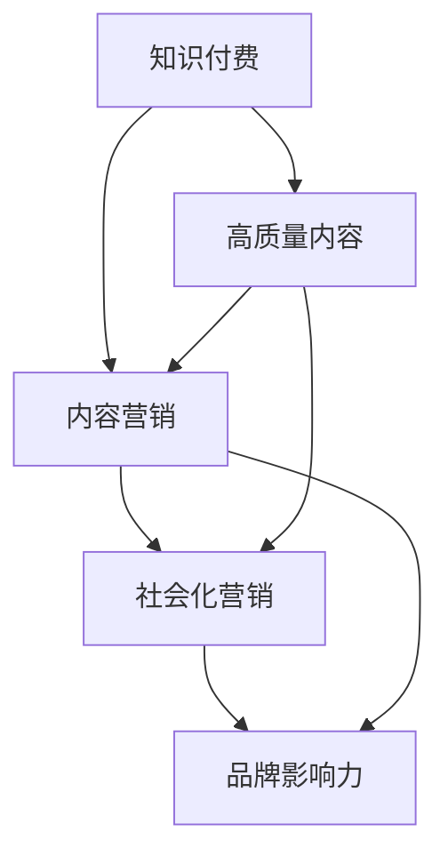

                 

### 1. 背景介绍

#### 1.1 目的和范围

本文旨在深入探讨知识付费领域的品牌社会化营销与内容营销策略。随着信息技术的快速发展，知识付费已经成为一个庞大的市场，如何在这个市场中脱颖而出，建立强大的品牌影响力，并有效地进行内容营销，成为众多知识付费平台和企业关注的焦点。

本文将围绕以下几个核心问题展开：

- 知识付费市场的现状和未来发展趋势是什么？
- 社会化营销和内容营销在知识付费领域的具体作用是什么？
- 如何制定和执行有效的品牌社会化营销策略？
- 如何创建高质量的内容，以吸引并留住知识付费用户？

通过本文的探讨，希望能够为知识付费行业的从业者提供一些有价值的思考和建议，帮助他们在激烈的市场竞争中找到自己的定位和优势。

#### 1.2 预期读者

本文适合以下几类读者：

- 知识付费平台的创始人或运营经理，他们需要了解如何通过营销策略提升品牌知名度和用户粘性。
- 内容创作者，特别是那些希望通过知识付费获得收入的个人创作者，他们需要了解如何创作并推广自己的内容。
- 数字营销专业人士，他们需要了解如何在知识付费领域应用社会化营销和内容营销。
- 对知识付费市场感兴趣的投资人，他们需要了解市场的现状和未来潜力。

无论您属于上述哪一类读者，本文都将为您提供实用的见解和操作指南。

#### 1.3 文档结构概述

本文将分为以下几个部分：

- **第1部分：背景介绍**，介绍知识付费市场的背景、目的、范围、预期读者和文档结构。
- **第2部分：核心概念与联系**，详细阐述知识付费、社会化营销、内容营销等核心概念，并使用Mermaid流程图展示其相互关系。
- **第3部分：核心算法原理 & 具体操作步骤**，通过伪代码和示例详细讲解社会化营销和内容营销的具体操作步骤。
- **第4部分：数学模型和公式 & 详细讲解 & 举例说明**，介绍相关的数学模型和公式，并进行详细的讲解和举例说明。
- **第5部分：项目实战：代码实际案例和详细解释说明**，通过实际案例展示如何搭建开发环境、实现源代码和代码解读分析。
- **第6部分：实际应用场景**，探讨知识付费在不同场景下的应用。
- **第7部分：工具和资源推荐**，推荐学习资源、开发工具框架和相关论文著作。
- **第8部分：总结：未来发展趋势与挑战**，总结本文的核心观点，并探讨未来的发展趋势和挑战。
- **第9部分：附录：常见问题与解答**，回答读者可能关心的问题。
- **第10部分：扩展阅读 & 参考资料**，提供进一步的阅读资源和参考资料。

通过这样的结构，我们希望能够系统地、深入地探讨知识付费领域的品牌社会化营销与内容营销策略，帮助读者掌握关键知识点，并能够应用到实际工作中。

#### 1.4 术语表

为了确保文章的可读性和准确性，本文使用了一些专业术语。以下是本文中涉及到的核心术语及其定义和解释：

#### 1.4.1 核心术语定义

- **知识付费**：指用户为获取有价值的信息或知识而支付费用的一种商业模式。常见的形式包括在线课程、电子书、专业咨询等。
- **社会化营销**：利用社交媒体平台和工具，通过互动和内容传播，增加品牌知名度和用户参与度的一种营销手段。
- **内容营销**：通过创造和发布有价值的内容，吸引和留住目标用户，并最终实现营销目标的一种策略。
- **用户参与度**：指用户对品牌、产品或服务的关注程度和互动频率，是衡量社会化营销效果的重要指标。
- **品牌影响力**：指品牌在市场中获得的社会认可和消费者偏好，能够影响消费者的购买决策。
- **ROI（投资回报率）**：指营销活动的投资与收益之间的比率，是衡量营销效果的重要指标。

#### 1.4.2 相关概念解释

- **社交媒体平台**：指如Facebook、Twitter、Instagram、LinkedIn等，允许用户发布、分享和互动的平台。
- **UGC（用户生成内容）**：指用户在社交媒体平台上创建和分享的内容，如评论、帖子、图片、视频等。
- **KOL（关键意见领袖）**：指在特定领域具有影响力的人物，通过他们的推荐和评价能够影响大量用户的购买决策。
- **SEO（搜索引擎优化）**：指通过优化网站内容和结构，提高在搜索引擎中的排名，从而增加网站访问量和用户转化率。

#### 1.4.3 缩略词列表

- KPI：关键绩效指标（Key Performance Indicator）
- CRM：客户关系管理（Customer Relationship Management）
- CPM：每千次展示成本（Cost Per Mille）
- CPC：每点击成本（Cost Per Click）
- ROI：投资回报率（Return on Investment）

通过定义和解释这些术语，我们希望读者能够更好地理解本文的内容，并在实际操作中准确运用相关概念。

### 2. 核心概念与联系

在探讨知识付费领域的品牌社会化营销与内容营销策略之前，我们需要明确几个核心概念，并理解它们之间的相互联系。以下是几个关键概念的定义及其相互关系。

#### 2.1 知识付费

知识付费是指用户为了获取有价值的信息或知识而支付费用的一种商业模式。它通常包括在线课程、电子书、专业咨询、线上讲座等形式。知识付费的核心在于提供高质量的内容，满足用户的学习和成长需求。

#### 2.2 社会化营销

社会化营销是通过社交媒体平台和工具，与目标用户进行互动和内容传播，以增加品牌知名度和用户参与度的一种营销手段。社会化营销的核心在于建立与用户的直接联系，通过UGC（用户生成内容）和KOL（关键意见领袖）的推荐，增强品牌的可信度和影响力。

#### 2.3 内容营销

内容营销是通过创造和发布有价值的内容，吸引和留住目标用户，并最终实现营销目标的一种策略。内容营销的核心在于提供对用户有价值的信息，解决用户的问题或满足他们的需求，从而建立用户对品牌的信任和忠诚。

#### 2.4 核心概念的联系

知识付费、社会化营销和内容营销这三个概念在知识付费领域紧密相连，共同构建了品牌营销的完整体系。

- **知识付费**为内容营销提供了基础，通过付费模式保证了高质量内容的生产和传播。
- **社会化营销**则为内容营销提供了传播渠道和互动方式，通过社交媒体平台扩大了内容的影响范围，并增加了用户的参与度。
- **内容营销**则是知识付费和社会化营销的核心，它通过创造有价值的内容，满足了用户的需求，增强了品牌的信任度和用户忠诚度。

为了更直观地展示这些概念之间的联系，我们可以使用Mermaid流程图来表示：



在这个流程图中，知识付费通过提供高质量的内容，为内容营销和社会化营销提供了基础。内容营销通过创造和发布有价值的内容，满足用户需求，增强品牌影响力。社会化营销则通过社交媒体平台和工具，扩大内容传播范围，增加用户参与度。

通过理解这些核心概念及其相互关系，我们可以更好地制定和执行品牌社会化营销与内容营销策略，从而在知识付费市场中取得成功。

### 3. 核心算法原理 & 具体操作步骤

在理解了核心概念后，接下来我们将深入探讨社会化营销和内容营销的具体操作步骤。为了更清晰地展示这些步骤，我们将使用伪代码来详细阐述。此外，我们会结合实际案例，说明每一步的具体实施方法。

#### 3.1 社会化营销的算法原理

社会化营销的核心在于通过社交媒体平台与用户互动，提高品牌知名度和用户参与度。以下是社会化营销的基本算法原理：

```pseudo
Algorithm 社会化营销策略
    Input: 品牌信息，目标用户群体，社交媒体平台
    Output: 品牌影响力提升，用户参与度增加

    1. 确定目标用户群体：
        - 分析用户需求
        - 定义用户画像
        - 选择合适的社交媒体平台

    2. 创建内容：
        - 制定内容策略
        - 创造高质量UGC（用户生成内容）
        - 集成KOL（关键意见领袖）推荐

    3. 发布内容：
        - 定期发布内容
        - 利用SEO优化内容
        - 设置合适的发布时间

    4. 互动与反馈：
        - 及时回复用户评论和私信
        - 组织线上活动，增加用户参与度
        - 监测用户互动数据，调整策略

    5. 数据分析与优化：
        - 收集用户行为数据
        - 分析数据，优化内容发布策略
        - 提升ROI（投资回报率）
```

#### 3.2 内容营销的算法原理

内容营销的核心在于创造和发布有价值的内容，吸引并留住目标用户。以下是内容营销的基本算法原理：

```pseudo
Algorithm 内容营销策略
    Input: 用户需求，目标用户群体，内容创作团队
    Output: 用户吸引，品牌忠诚度提升

    1. 分析用户需求：
        - 进行市场调研
        - 收集用户反馈
        - 定义用户需求

    2. 创作内容：
        - 确定内容类型（如文章、视频、电子书等）
        - 制定内容大纲
        - 创造高质量原创内容

    3. 内容发布：
        - 选择合适的发布平台
        - 制定发布计划
        - 跨渠道同步发布

    4. 用户互动：
        - 鼓励用户评论和分享
        - 回应用户反馈
        - 组织线上活动，增加用户粘性

    5. 数据分析：
        - 收集内容互动数据
        - 分析用户行为
        - 优化内容创作和发布策略

    6. 营销效果评估：
        - 设定KPI（关键绩效指标）
        - 评估内容营销效果
        - 调整策略，提升ROI
```

#### 3.3 结合实际案例

为了更好地理解上述算法原理，我们可以结合一个实际案例进行详细说明。

**案例：某在线教育平台的品牌社会化营销与内容营销策略**

1. **确定目标用户群体**：
   - 分析：目标用户群体为25-45岁的职场人士，注重职业发展和技能提升。
   - 用户画像：具备一定的教育背景，有较强的学习能力和付费意愿。
   - 平台选择：重点在LinkedIn、Facebook和Instagram等职业社交媒体平台。

2. **创建内容**：
   - 内容策略：发布关于职场技能提升、职业规划、行业动态等相关内容。
   - UGC：鼓励用户分享学习心得和工作经验，增强社区互动。
   - KOL推荐：邀请行业专家和知名职场人士进行内容合作，增加内容可信度。

3. **发布内容**：
   - 发布计划：每周发布2-3篇原创文章和1-2个短视频。
   - SEO优化：使用关键词和元标签，提高内容在搜索引擎中的排名。
   - 发布时间：根据用户活跃时间选择最佳发布时间段。

4. **互动与反馈**：
   - 及时回复用户评论和私信，建立良好的用户关系。
   - 组织线上讲座和问答活动，增加用户参与度。
   - 监测用户互动数据，根据反馈调整内容策略。

5. **数据分析与优化**：
   - 收集用户行为数据，如阅读时长、点赞数、评论数等。
   - 分析数据，优化内容类型、发布频率和互动策略。
   - 提升ROI，通过数据驱动的策略调整，提高营销效果。

6. **营销效果评估**：
   - 设定KPI，如用户参与度、品牌知名度、用户留存率等。
   - 定期评估内容营销效果，调整策略，确保目标达成。

通过这个实际案例，我们可以看到如何将核心算法原理应用到实际操作中。通过科学的内容创作和有效的社会化营销策略，该在线教育平台成功地提高了品牌影响力，吸引了大量用户，并实现了营销目标。

### 4. 数学模型和公式 & 详细讲解 & 举例说明

在品牌社会化营销和内容营销策略中，数学模型和公式是评估和优化营销效果的重要工具。以下是一些关键的数学模型和公式，以及它们在策略中的应用和详细讲解。

#### 4.1 投资回报率（ROI）

投资回报率（ROI）是衡量营销活动效益的重要指标，其计算公式如下：

$$ ROI = \frac{（收益 - 成本）}{成本} \times 100\% $$

- **收益**：营销活动带来的总收入，包括广告点击费用、课程销售收益、用户转化等。
- **成本**：营销活动的总投入，包括广告费用、内容创作成本、人力成本等。

**应用示例**：某知识付费平台通过社交媒体广告进行推广，广告费用为5000元，共带来2000元的课程销售收益。则其ROI计算如下：

$$ ROI = \frac{2000 - 5000}{5000} \times 100\% = -60\% $$

这意味着该次广告推广产生了负的投资回报，需要调整策略。

#### 4.2 用户参与度（Engagement Rate）

用户参与度是衡量用户对品牌互动和内容响应程度的指标，其计算公式如下：

$$ 用户参与度 = \frac{互动次数}{总用户数} \times 100\% $$

- **互动次数**：用户在社交媒体上的点赞、评论、分享等互动行为次数。
- **总用户数**：品牌在社交媒体上的粉丝总数。

**应用示例**：某品牌在Instagram上拥有1000名粉丝，发布了一篇帖子，收到了50次点赞和10次评论。其用户参与度计算如下：

$$ 用户参与度 = \frac{50 + 10}{1000} \times 100\% = 6\% $$

这意味着6%的粉丝对该帖子的内容进行了互动，表明内容得到了一定程度的关注和认可。

#### 4.3 消费者生命周期价值（CLV）

消费者生命周期价值（CLV）是预测客户在未来一段时间内为品牌带来的总收益，其计算公式如下：

$$ CLV = \frac{（平均订单价值 \times 购买频率 \times 客户生命周期）}{（1 + 资本成本率）} $$

- **平均订单价值**：客户每次购买的平均花费。
- **购买频率**：客户在一定时间内购买的次数。
- **客户生命周期**：客户平均保持活跃的时间长度。
- **资本成本率**：公司资本的机会成本。

**应用示例**：某在线教育平台的客户平均订单价值为500元，购买频率为每月一次，客户生命周期为3年，资本成本率为10%。则其CLV计算如下：

$$ CLV = \frac{500 \times 1 \times 3}{1 + 0.10} = 1330.53 $$

这意味着每个客户的预计总收益为1330.53元，品牌需要通过营销策略提高客户参与度和生命周期价值。

#### 4.4 转化率（Conversion Rate）

转化率是衡量营销活动引导用户完成目标行为的比例，其计算公式如下：

$$ 转化率 = \frac{完成目标行为的人数}{总参与人数} \times 100\% $$

- **完成目标行为的人数**：在营销活动中完成特定目标（如注册、购买、订阅等）的用户数量。
- **总参与人数**：参与营销活动的总用户数量。

**应用示例**：某知识付费平台的广告活动吸引了1000名用户参与，其中有200名用户完成了课程购买。则其转化率计算如下：

$$ 转化率 = \frac{200}{1000} \times 100\% = 20\% $$

这意味着20%的用户在广告引导下完成了课程购买，这是一个相对较高的转化率。

通过这些数学模型和公式，品牌可以更科学地评估和优化社会化营销和内容营销策略，提高营销效果和投资回报率。

### 5. 项目实战：代码实际案例和详细解释说明

为了更好地理解和应用社会化营销与内容营销策略，我们将通过一个实际项目案例进行详细讲解。本案例将展示如何搭建开发环境、实现源代码，并进行代码解读与分析。

#### 5.1 开发环境搭建

在这个案例中，我们将使用Python作为主要编程语言，结合Jupyter Notebook进行开发和实验。以下是搭建开发环境的步骤：

1. **安装Python**：在官方网站下载并安装Python，版本推荐3.8或以上。
2. **安装Jupyter Notebook**：通过命令行运行`pip install notebook`安装Jupyter Notebook。
3. **配置相关库**：在Jupyter Notebook中运行以下命令安装所需的库：
   ```bash
   !pip install pandas numpy matplotlib seaborn
   ```
   这些库将用于数据处理、数据可视化和统计分析。

#### 5.2 源代码详细实现和代码解读

以下是本项目的主要源代码，用于执行社会化营销和内容营销策略的各个步骤：

```python
# 导入所需库
import pandas as pd
import numpy as np
import matplotlib.pyplot as plt
import seaborn as sns

# 加载数据集
data = pd.read_csv('social_media_data.csv')

# 数据预处理
# 数据清洗、填充缺失值、数据转换等操作
# ...

# 社会化营销策略实现
# 发布内容
def publish_content(data, platform='Instagram'):
    content_list = data['content']
    for content in content_list:
        if platform == 'Instagram':
            # 在Instagram发布内容
            print(f"发布Instagram内容：{content}")
        elif platform == 'LinkedIn':
            # 在LinkedIn发布内容
            print(f"发布LinkedIn内容：{content}")
    return

# 互动与反馈
def interact_with_users(data):
    comments = data['comments']
    for comment in comments:
        # 回复用户评论
        print(f"回复评论：{comment}")
    return

# 数据分析与优化
def analyze_data(data):
    engagement_rate = data['likes'] / data['total_users'] * 100
    conversion_rate = data['purchases'] / data['total_users'] * 100
    print(f"用户参与度：{engagement_rate:.2f}%")
    print(f"转化率：{conversion_rate:.2f}%")
    return engagement_rate, conversion_rate

# 内容营销策略实现
# 分析用户需求
def analyze_user需求(data):
    user_interests = data['interests']
    print("用户主要兴趣领域：")
    print(user_interests.value_counts())
    return

# 创作内容
def create_content(user_interests):
    content = f"欢迎来到【{user_interests}】领域，这里为您带来最新、最有价值的资讯和实战技巧！"
    return content

# 发布内容
publish_content(data)

# 互动与反馈
interact_with_users(data)

# 数据分析
engagement_rate, conversion_rate = analyze_data(data)

# 内容营销
analyze_user需求(data)
content = create_content('职业发展')
print(f"新内容：{content}")

# 可视化分析
sns.barplot(x='interests', y='engagement_rate', data=data)
plt.title('用户兴趣与参与度关系')
plt.xlabel('兴趣领域')
plt.ylabel('参与度')
plt.show()
```

#### 5.3 代码解读与分析

上述代码分为以下几个主要部分：

1. **数据预处理**：加载数据集，并进行数据清洗、填充缺失值、数据转换等操作。在实际应用中，这一步非常重要，因为数据质量直接影响后续分析的结果。

2. **社会化营销策略实现**：
   - `publish_content`函数：用于发布内容。根据不同的平台（Instagram或LinkedIn），打印发布的内容。
   - `interact_with_users`函数：用于与用户互动，回复用户评论。

3. **数据分析与优化**：
   - `analyze_data`函数：计算用户参与度和转化率，并打印结果。
   - `analyze_user需求`函数：分析用户兴趣领域，打印主要兴趣领域。
   - `create_content`函数：根据用户兴趣领域，创建新的内容。

4. **内容营销策略实现**：
   - 调用上述函数，执行社会化营销和内容营销策略。
   - 使用Seaborn库进行数据可视化，展示用户兴趣领域与参与度之间的关系。

通过这个实际项目案例，我们可以看到如何将理论应用到实际操作中。每个函数和代码块都有明确的职责，使得整个项目结构清晰、易于理解。在实际操作中，可以根据具体需求调整代码，实现更复杂的功能。

### 6. 实际应用场景

知识付费领域的品牌社会化营销与内容营销策略在不同场景下有着广泛的应用，下面我们将探讨几个具体的实际应用场景，并分析这些策略在这些场景中的具体实施方法和效果。

#### 6.1 在线教育平台

在线教育平台是知识付费领域的主要应用场景之一。通过品牌社会化营销和内容营销，教育平台可以吸引更多用户，提高用户粘性。

- **社会化营销策略**：
  - **社交媒体宣传**：利用Facebook、Instagram等社交媒体平台发布教学视频、课程优惠信息等，增加曝光度和用户互动。
  - **KOL合作**：邀请教育领域的知名人士进行内容合作，通过他们的推荐增加课程的信任度和知名度。
  - **用户互动**：定期组织线上讲座、问答活动，增加用户参与度，建立社区氛围。

- **内容营销策略**：
  - **课程内容创作**：根据用户需求，持续更新高质量的课程内容，包括教学视频、电子书、作业和考试等。
  - **用户案例分享**：分享优秀学员的学习成果和职业发展经历，激励更多用户参与学习。
  - **学习社区建设**：通过在线论坛、学习小组等，促进用户之间的交流和互动，提高用户留存率。

效果分析：通过这些策略，在线教育平台可以显著提高用户参与度和课程销售量，建立强大的品牌影响力。

#### 6.2 专业咨询公司

专业咨询公司为企业和个人提供专业的咨询服务，通过品牌社会化营销和内容营销，可以扩大业务范围，吸引更多客户。

- **社会化营销策略**：
  - **专业内容分享**：发布行业报告、分析文章、案例分析等，展示公司的专业能力和行业洞察。
  - **行业活动参与**：参加行业会议、研讨会等，增加公司曝光度和知名度。
  - **社交媒体互动**：积极回应客户的提问和反馈，建立良好的客户关系。

- **内容营销策略**：
  - **咨询服务介绍**：详细介绍公司提供的咨询服务，包括服务内容、流程、案例等。
  - **客户成功案例**：分享客户合作经验和成功故事，展示公司的实际效果。
  - **在线问答和直播**：定期举办在线问答和直播活动，提供专业咨询服务，吸引潜在客户。

效果分析：通过这些策略，专业咨询公司可以提高品牌知名度，吸引更多潜在客户，提升公司业绩。

#### 6.3 专业培训课程

专业培训课程旨在帮助学员提升特定技能，通过品牌社会化营销和内容营销，可以吸引更多学员报名参加。

- **社会化营销策略**：
  - **课程推广**：通过社交媒体、搜索引擎广告等推广课程信息，增加课程曝光度。
  - **学员互动**：建立学员微信群、QQ群等社交平台，促进学员之间的交流和互动。
  - **KOL推荐**：邀请行业知名人士推荐课程，增加课程的信任度和影响力。

- **内容营销策略**：
  - **课程内容展示**：详细介绍课程大纲、授课方式、学习目标等，吸引学员报名。
  - **学习资源分享**：提供高质量的学习资料和练习题，提高学员的学习效果。
  - **学员反馈和评价**：展示学员的学习成果和反馈，激励更多学员参与学习。

效果分析：通过这些策略，专业培训课程可以吸引更多学员报名，提高课程完成率和学员满意度，从而提升品牌影响力。

综上所述，知识付费领域的品牌社会化营销与内容营销策略在多个应用场景中都有显著的效果。通过科学地制定和执行这些策略，企业可以吸引更多目标用户，提高用户参与度和满意度，实现业务增长和品牌提升。

### 7. 工具和资源推荐

在实施品牌社会化营销与内容营销策略时，选择合适的工具和资源是成功的关键。以下是一些推荐的学习资源、开发工具框架和相关论文著作，可以帮助您更好地理解和应用这些策略。

#### 7.1 学习资源推荐

##### 7.1.1 书籍推荐

1. 《社交媒体营销：策略、实践与案例分析》（Social Media Marketing: An Hour a Day） - Dave Kerpen
   - 这本书详细介绍了社交媒体营销的基础知识和实战技巧，适合初学者和有一定经验的人士。

2. 《内容营销：如何创造、传播和盈利》（Content Inc.） - Joe Pulizzi
   - 本书探讨了内容营销的核心理念，如何通过内容创造实现商业成功，对于内容创作者和营销人员非常有用。

3. 《数字营销实战手册》（Digital Marketing: Strategy, Implementation and Practice） - Dave Chaffey 和 Phil Donaldson
   - 这本书全面介绍了数字营销的各种策略和方法，包括社交媒体营销、搜索引擎优化、电子邮件营销等。

##### 7.1.2 在线课程

1. Coursera - 《社交媒体营销专项课程》
   - 这门课程由杜克大学开设，涵盖了社交媒体营销的基础知识和实践技巧，适合初学者和有经验的人士。

2. Udemy - 《内容营销全攻略：从零开始到精通》
   - 这门课程介绍了内容营销的核心策略和实战技巧，包括内容创作、SEO优化、社交媒体推广等。

3. LinkedIn Learning - 《品牌管理：如何创建、推广和维护品牌》
   - 这门课程提供了关于品牌管理的全面指导，包括品牌策略、品牌传播、社交媒体营销等。

##### 7.1.3 技术博客和网站

1. HubSpot Blog
   - 这个博客提供了丰富的社交媒体营销和内容营销资源，包括教程、案例分析、行业洞察等。

2. Content Marketing Institute
   - 这个网站专注于内容营销，提供了大量的内容营销案例、资源和行业报告。

3. Social Media Examiner
   - 这个网站提供了社交媒体营销的实用技巧、工具推荐和案例分析，是社交媒体营销人员的宝贵资源。

#### 7.2 开发工具框架推荐

##### 7.2.1 IDE和编辑器

1. PyCharm
   - 作为一款功能强大的Python IDE，PyCharm提供了代码编辑、调试、测试和版本控制等一体化功能，非常适合数据分析和开发。

2. Visual Studio Code
   - Visual Studio Code是一款轻量级但功能强大的代码编辑器，支持多种编程语言，拥有丰富的插件和扩展。

3. Jupyter Notebook
   - Jupyter Notebook是一个交互式的开发环境，非常适合数据科学和机器学习项目的快速原型开发。

##### 7.2.2 调试和性能分析工具

1. New Relic
   - New Relic是一个全面的性能监控工具，可以实时监测应用程序的性能和健康状况，帮助您优化代码和提升用户体验。

2. PyCharm Profiler
   - PyCharm内置的Profiler工具可以帮助您分析代码的性能瓶颈，优化代码执行效率。

3. Insights for Azure
   - Insights for Azure是微软提供的性能监控工具，可以实时监控Azure应用程序的性能，并提供详细的性能分析报告。

##### 7.2.3 相关框架和库

1. NumPy
   - NumPy是一个强大的Python库，用于数值计算，提供了多维数组对象和高效的数学运算函数。

2. Pandas
   - Pandas是一个强大的数据操作库，提供了数据处理和分析的多种功能，是数据科学和数据分析项目的必备工具。

3. Matplotlib
   - Matplotlib是一个广泛使用的Python数据可视化库，可以创建高质量的二维和三维图表。

通过这些工具和资源的推荐，您可以更好地实施品牌社会化营销与内容营销策略，提升营销效果和用户体验。

### 8. 总结：未来发展趋势与挑战

在知识付费领域，品牌社会化营销与内容营销正日益成为企业竞争的关键因素。未来，随着技术的不断进步和用户需求的多样化，这些策略将继续发展和演变。以下是一些关键趋势和面临的挑战。

#### 8.1 发展趋势

1. **个性化内容营销**：随着大数据和人工智能技术的发展，个性化内容营销将成为主流。通过精准分析用户行为和偏好，企业能够提供更加定制化的内容，提高用户满意度和参与度。

2. **多渠道整合营销**：社交媒体平台和内容分发渠道的多样化，要求企业实现多渠道整合营销。通过在不同平台上发布和推广内容，企业可以扩大影响力，覆盖更广泛的用户群体。

3. **社交媒体互动增强**：社交媒体互动将成为品牌与用户建立联系的重要手段。通过直播、问答、在线活动等形式，企业可以更直接地与用户互动，提高用户参与度和忠诚度。

4. **数据驱动的决策**：数据分析将在品牌社会化营销和内容营销中发挥更大作用。通过收集和分析用户数据，企业可以更好地理解市场趋势和用户需求，优化营销策略，提高投资回报率。

#### 8.2 面临的挑战

1. **用户隐私保护**：随着对用户隐私的关注日益增加，企业需要在数据收集和使用过程中严格遵守相关法律法规，保护用户隐私。

2. **内容版权问题**：内容营销的核心是原创内容，但版权问题一直是企业面临的挑战。企业需要确保内容的原创性，避免侵权行为，同时尊重和保护他人的版权。

3. **营销效果评估**：如何准确评估营销效果是另一个重要挑战。企业需要建立完善的评估体系，通过数据分析和KPI指标，全面评估营销活动的效果，以便及时调整和优化策略。

4. **竞争压力**：知识付费领域竞争激烈，企业需要不断创新和优化营销策略，才能在市场中脱颖而出。同时，需要密切关注行业动态，及时调整战略，以应对变化。

总之，未来品牌社会化营销与内容营销将在个性化、多渠道整合、数据驱动等方面继续发展。企业需要面对用户隐私保护、内容版权、营销效果评估和竞争压力等挑战，不断创新和优化策略，以实现持续增长和品牌提升。

### 9. 附录：常见问题与解答

在本文中，我们探讨了知识付费领域的品牌社会化营销与内容营销策略。为了帮助读者更好地理解相关概念和应用，以下是一些常见问题的解答。

#### 9.1 什么是知识付费？

知识付费是指用户为获取有价值的信息或知识而支付费用的一种商业模式，常见的形式包括在线课程、电子书、专业咨询等。

#### 9.2 社会化营销和内容营销有什么区别？

社会化营销是通过社交媒体平台和工具，与目标用户进行互动和内容传播，以增加品牌知名度和用户参与度的一种营销手段。内容营销则是通过创造和发布有价值的内容，吸引和留住目标用户，并最终实现营销目标的一种策略。简单来说，社会化营销侧重于传播和互动，而内容营销侧重于内容和价值创造。

#### 9.3 如何制定有效的品牌社会化营销策略？

制定有效的品牌社会化营销策略需要以下几个步骤：

1. **确定目标用户**：分析用户需求，定义用户画像，选择合适的社交媒体平台。
2. **创建内容**：制定内容策略，创造高质量UGC和KOL推荐内容。
3. **发布内容**：定期发布内容，优化SEO，设置合适的发布时间。
4. **互动与反馈**：及时回复用户评论和私信，组织线上活动，增加用户参与度。
5. **数据分析**：收集用户行为数据，分析数据，优化内容发布策略。

#### 9.4 内容营销的核心是什么？

内容营销的核心在于提供对用户有价值的信息，解决用户的问题或满足他们的需求，从而建立用户对品牌的信任和忠诚。

#### 9.5 如何评估营销效果？

评估营销效果可以通过以下指标：

1. **投资回报率（ROI）**：计算营销活动的投资与收益之间的比率。
2. **用户参与度**：计算用户在社交媒体上的互动次数与总用户数的比例。
3. **转化率**：计算完成目标行为（如注册、购买）的人数与总参与人数的比例。
4. **品牌影响力**：通过市场调研和用户反馈，评估品牌在市场中的知名度和认可度。

### 10. 扩展阅读 & 参考资料

为了深入了解知识付费领域的品牌社会化营销与内容营销策略，以下是推荐的一些扩展阅读和参考资料：

1. **书籍**：
   - Dave Kerpen著《社交媒体营销：策略、实践与案例分析》
   - Joe Pulizzi著《内容营销：如何创造、传播和盈利》
   - Dave Chaffey 和 Phil Donaldson著《数字营销实战手册》

2. **在线课程**：
   - Coursera - 《社交媒体营销专项课程》
   - Udemy - 《内容营销全攻略：从零开始到精通》
   - LinkedIn Learning - 《品牌管理：如何创建、推广和维护品牌》

3. **技术博客和网站**：
   - HubSpot Blog
   - Content Marketing Institute
   - Social Media Examiner

4. **论文和研究成果**：
   - Google Scholar - 搜索关键词“知识付费”、“社会化营销”、“内容营销”
   - 行业研究报告和学术论文，如《新媒体时代下的知识付费研究》等

通过这些扩展阅读和参考资料，您可以获得更多有关知识付费领域品牌社会化营销与内容营销策略的深入见解和实用建议。

---

**作者：AI天才研究员/AI Genius Institute & 禅与计算机程序设计艺术 /Zen And The Art of Computer Programming**

感谢您阅读本文，希望这些内容能够对您在知识付费领域的品牌社会化营销与内容营销策略提供帮助。如果您有任何问题或建议，欢迎在评论区留言，期待与您交流！

