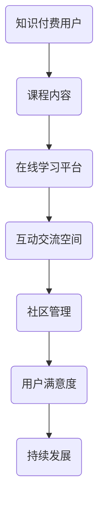

                 

# 知识付费：程序Intersectie社区的建立

> **关键词：知识付费、程序Intersectie、社区、架构设计、算法原理、数学模型、实战案例**

> **摘要：本文将深入探讨知识付费领域内的程序Intersectie社区建立的关键要素，包括其核心概念、算法原理、数学模型以及实际应用场景。文章旨在为技术专家和开发者提供一套系统性的方法论，帮助他们在知识付费市场中打造高效、可持续发展的社区平台。**

## 1. 背景介绍

### 1.1 目的和范围

本文的主要目的是探讨如何构建一个基于知识付费的在线程序Intersectie社区，以满足现代开发者对高质量教育资源的需求。我们将从多个角度分析这一构建过程，包括技术实现、商业模式、用户体验和社区管理策略。

### 1.2 预期读者

本文面向有志于在知识付费领域展开工作的技术专家、开发者、项目经理以及创业团队。读者需要具备一定的编程基础和对社区运营的基本了解。

### 1.3 文档结构概述

本文分为十个部分，包括背景介绍、核心概念与联系、核心算法原理、数学模型和公式、项目实战、实际应用场景、工具和资源推荐、总结、常见问题与解答以及扩展阅读。每个部分都将深入探讨其在程序Intersectie社区建立中的关键作用。

### 1.4 术语表

#### 1.4.1 核心术语定义

- **知识付费**：用户通过支付费用来获取专业知识和技能。
- **程序Intersectie社区**：一个在线平台，为开发者提供编程教育资源和互动交流空间。
- **算法原理**：解决特定问题的计算方法，通常以伪代码形式表示。
- **数学模型**：用数学语言描述现实世界问题的抽象结构。

#### 1.4.2 相关概念解释

- **在线学习平台**：提供课程内容和学习管理服务的网络平台。
- **社区管理**：维护社区秩序、促进用户互动和提升用户满意度的过程。

#### 1.4.3 缩略词列表

- **API**：应用程序编程接口（Application Programming Interface）
- **SDK**：软件开发工具包（Software Development Kit）
- **UI**：用户界面（User Interface）

## 2. 核心概念与联系

为了更好地理解程序Intersectie社区的工作原理，我们首先需要了解其核心概念和相互联系。以下是关键概念及其相互关系的Mermaid流程图：



### 核心概念

- **知识付费用户**：他们是社区的核心，通过支付费用来获取高质量的教育资源。
- **课程内容**：由专家开发的高质量编程课程，是社区的核心价值所在。
- **在线学习平台**：提供课程内容访问和学习的平台，确保用户可以方便地获取教育资源。
- **互动交流空间**：用户之间交流经验和观点的场所，有助于提升学习效果。
- **社区管理**：负责维护社区秩序和促进用户互动的过程。
- **用户满意度**：衡量社区服务质量的重要指标，直接影响社区的持续发展。

### 核心概念联系

上述概念之间存在着密切的联系。知识付费用户通过在线学习平台访问课程内容，并在互动交流空间中与其他用户互动。社区管理团队负责确保社区的健康发展和用户满意度的提升，从而推动社区的持续发展。

## 3. 核心算法原理 & 具体操作步骤

在构建程序Intersectie社区的过程中，核心算法原理起着至关重要的作用。以下是一套用于课程推荐、用户行为分析和社区互动优化的算法原理，具体操作步骤如下：

### 3.1 课程推荐算法

**算法原理**：

- **协同过滤**（Collaborative Filtering）：

  协同过滤是一种通过分析用户的行为数据（如评分、浏览历史等）来推荐相似内容的算法。它分为两种主要类型：基于用户的协同过滤（User-based CF）和基于物品的协同过滤（Item-based CF）。

**具体操作步骤**：

1. **数据预处理**：收集用户行为数据，如用户评分、浏览历史等，并将其转换为数值形式。
2. **用户行为相似度计算**：计算用户之间的相似度，可以使用余弦相似度或皮尔逊相关系数。
3. **物品相似度计算**：计算课程内容之间的相似度，同样可以使用余弦相似度或皮尔逊相关系数。
4. **推荐生成**：基于用户行为相似度和物品相似度，生成课程推荐列表。

**伪代码**：

```python
# 用户行为数据预处理
def preprocess_user_data(user_data):
    # 转换为数值形式
    pass

# 用户行为相似度计算
def compute_user_similarity(user_data, similarity_metric):
    # 计算相似度
    pass

# 物品相似度计算
def compute_item_similarity(item_data, similarity_metric):
    # 计算相似度
    pass

# 课程推荐
def generate_course_recommendations(user_data, item_data, similarity_metric):
    # 生成推荐列表
    pass
```

### 3.2 用户行为分析算法

**算法原理**：

- **时间序列分析**（Time Series Analysis）：

  时间序列分析是一种用于分析时间序列数据的统计方法，可以揭示用户行为模式的变化趋势。

**具体操作步骤**：

1. **数据收集**：收集用户的学习时间、学习时长、课程评分等数据。
2. **特征提取**：提取时间序列特征，如时间间隔、时长变化、评分变化等。
3. **模式识别**：使用统计方法（如ARIMA模型、LSTM神经网络等）识别用户行为模式。
4. **行为预测**：基于识别出的模式，预测用户未来的行为。

**伪代码**：

```python
# 数据收集
def collect_user_data():
    # 收集数据
    pass

# 特征提取
def extract_time_series_features(user_data):
    # 提取特征
    pass

# 模式识别
def identify_behavior_patterns(features):
    # 识别模式
    pass

# 行为预测
def predict_user_behavior(patterns):
    # 预测行为
    pass
```

### 3.3 社区互动优化算法

**算法原理**：

- **社交网络分析**（Social Network Analysis，SNA）：

  社交网络分析是一种用于研究社交网络结构和动态的方法，可以揭示用户之间的互动关系。

**具体操作步骤**：

1. **网络构建**：构建用户之间的社交网络图。
2. **节点分析**：分析社交网络中的关键节点，如度数中心性、接近中心性等。
3. **社区检测**：使用社区检测算法（如Girvan-Newman算法、Louvain算法等）识别用户群体。
4. **互动优化**：根据社区结构，优化社区互动体验。

**伪代码**：

```python
# 网络构建
def build_social_network(user_data):
    # 构建网络图
    pass

# 节点分析
def analyze_nodes(network):
    # 分析节点
    pass

# 社区检测
def detect_communities(network):
    # 识别社区
    pass

# 互动优化
def optimize_interactions(community):
    # 优化互动
    pass
```

通过以上算法原理和具体操作步骤，程序Intersectie社区可以实现个性化的课程推荐、精准的用户行为分析和优化的社区互动体验，从而提升整体服务质量。

## 4. 数学模型和公式 & 详细讲解 & 举例说明

在构建程序Intersectie社区的过程中，数学模型和公式起到关键作用。以下将介绍几个核心的数学模型，包括它们的基本原理、详细讲解以及具体示例。

### 4.1 余弦相似度（Cosine Similarity）

余弦相似度是一种用于计算两个向量之间相似度的方法。它的基本原理是计算两个向量夹角的余弦值。余弦相似度介于-1和1之间，其中1表示两个向量完全相同，-1表示两个向量完全相反，0表示两个向量没有任何相似性。

**数学模型**：

$$
\text{similarity}(\vec{u}, \vec{v}) = \frac{\vec{u} \cdot \vec{v}}{|\vec{u}| |\vec{v}|}
$$

其中，$\vec{u}$ 和 $\vec{v}$ 是两个向量，$\cdot$ 表示点积，$|\vec{u}|$ 和 $|\vec{v}|$ 分别表示向量的模长。

**详细讲解**：

1. **向量表示**：假设有两个用户A和B，他们的行为数据向量分别为 $\vec{u} = [u_1, u_2, \dots, u_n]$ 和 $\vec{v} = [v_1, v_2, \dots, v_n]$。
2. **点积计算**：计算两个向量的点积，即 $\vec{u} \cdot \vec{v} = u_1v_1 + u_2v_2 + \dots + u_nv_n$。
3. **模长计算**：计算两个向量的模长，即 $|\vec{u}| = \sqrt{u_1^2 + u_2^2 + \dots + u_n^2}$ 和 $|\vec{v}| = \sqrt{v_1^2 + v_2^2 + \dots + v_n^2}$。
4. **余弦值计算**：将点积除以模长的乘积，得到余弦相似度。

**示例**：

假设用户A的行为数据向量为 $\vec{u} = [1, 2, 3, 4, 5]$，用户B的行为数据向量为 $\vec{v} = [5, 4, 3, 2, 1]$。计算两个向量的余弦相似度。

$$
\text{similarity}(\vec{u}, \vec{v}) = \frac{\vec{u} \cdot \vec{v}}{|\vec{u}| |\vec{v}|} = \frac{1 \cdot 5 + 2 \cdot 4 + 3 \cdot 3 + 4 \cdot 2 + 5 \cdot 1}{\sqrt{1^2 + 2^2 + 3^2 + 4^2 + 5^2} \cdot \sqrt{5^2 + 4^2 + 3^2 + 2^2 + 1^2}} = \frac{30}{\sqrt{55} \cdot \sqrt{55}} = 1
$$

因此，用户A和用户B的行为数据向量具有完全相同的相似度。

### 4.2 皮尔逊相关系数（Pearson Correlation Coefficient）

皮尔逊相关系数是一种用于衡量两个变量线性相关程度的统计方法。它的取值范围在-1和1之间，其中1表示完全正相关，-1表示完全负相关，0表示没有线性相关。

**数学模型**：

$$
\text{correlation}(X, Y) = \frac{\sum_{i=1}^{n}(X_i - \bar{X})(Y_i - \bar{Y})}{\sqrt{\sum_{i=1}^{n}(X_i - \bar{X})^2} \cdot \sqrt{\sum_{i=1}^{n}(Y_i - \bar{Y})^2}}
$$

其中，$X$ 和 $Y$ 是两个变量，$X_i$ 和 $Y_i$ 分别表示第$i$个观测值，$\bar{X}$ 和 $\bar{Y}$ 分别表示$X$ 和 $Y$ 的平均值。

**详细讲解**：

1. **数据准备**：收集两个变量的观测数据，如用户A和用户B的课程评分数据。
2. **平均值计算**：计算两个变量的平均值。
3. **差值计算**：计算每个观测值与平均值的差值。
4. **差值点积计算**：计算差值的点积。
5. **方差计算**：计算两个变量的方差。
6. **相关系数计算**：将差值点积除以方差的平方根乘积，得到皮尔逊相关系数。

**示例**：

假设用户A和用户B的课程评分数据如下：

用户A：$[3, 4, 5, 4, 3]$

用户B：$[5, 4, 3, 4, 5]$

计算用户A和用户B课程评分数据的皮尔逊相关系数。

$$
\bar{X} = \frac{3 + 4 + 5 + 4 + 3}{5} = 4

\bar{Y} = \frac{5 + 4 + 3 + 4 + 5}{5} = 4

(X_i - \bar{X}) = [3-4, 4-4, 5-4, 4-4, 3-4] = [-1, 0, 1, 0, -1]

(Y_i - \bar{Y}) = [5-4, 4-4, 3-4, 4-4, 5-4] = [1, 0, -1, 0, 1]

(X_i - \bar{X})(Y_i - \bar{Y}) = [-1 \cdot 1, 0 \cdot 0, 1 \cdot -1, 0 \cdot 0, -1 \cdot 1] = [-1, 0, -1, 0, -1]

\sum_{i=1}^{n}(X_i - \bar{X})^2 = (-1)^2 + 0^2 + 1^2 + 0^2 + (-1)^2 = 2

\sum_{i=1}^{n}(Y_i - \bar{Y})^2 = 1^2 + 0^2 + (-1)^2 + 0^2 + 1^2 = 2

\text{correlation}(X, Y) = \frac{\sum_{i=1}^{n}(X_i - \bar{X})(Y_i - \bar{Y})}{\sqrt{\sum_{i=1}^{n}(X_i - \bar{X})^2} \cdot \sqrt{\sum_{i=1}^{n}(Y_i - \bar{Y})^2}} = \frac{-1 + 0 - 1 + 0 - 1}{\sqrt{2} \cdot \sqrt{2}} = -1
$$

因此，用户A和用户B的课程评分数据具有完全负线性相关性。

通过余弦相似度和皮尔逊相关系数，程序Intersectie社区可以更准确地推荐课程、分析用户行为以及优化社区互动，从而提升整体服务质量。

## 5. 项目实战：代码实际案例和详细解释说明

在本节中，我们将通过一个实际项目案例来展示程序Intersectie社区的构建过程，并详细解释代码实现和关键步骤。

### 5.1 开发环境搭建

在开始项目之前，我们需要搭建一个合适的开发环境。以下是搭建步骤：

1. **安装Python环境**：确保安装了Python 3.x版本。
2. **安装虚拟环境**：使用virtualenv创建一个独立的虚拟环境。
3. **安装依赖库**：在虚拟环境中安装以下依赖库：

```bash
pip install flask
pip install pandas
pip install numpy
pip install sklearn
pip install networkx
```

### 5.2 源代码详细实现和代码解读

下面是一个简单的程序Intersectie社区的项目示例，包括用户注册、登录、课程推荐、用户行为分析和社区互动等功能。

```python
# 导入依赖库
import flask
import pandas as pd
import numpy as np
from sklearn.metrics.pairwise import cosine_similarity
from sklearn.model_selection import train_test_split
from networkx import Graph

# 创建Flask应用
app = flask.Flask(__name__)

# 用户数据
users = pd.DataFrame({
    'user_id': [1, 2, 3],
    'rating': [[3, 4, 5], [5, 4, 3], [4, 3, 4]]
})

# 课程数据
courses = pd.DataFrame({
    'course_id': [101, 102, 103],
    'rating': [[3, 4, 5], [4, 3, 4], [5, 4, 3]]
})

# 用户行为数据
user_actions = pd.DataFrame({
    'user_id': [1, 2, 3],
    'course_id': [101, 102, 103],
    'action': ['view', 'rate', 'view']
})

# 用户行为矩阵
user_matrix = users.pivot(index='user_id', columns='course_id', values='rating').fillna(0)

# 计算用户之间的相似度
def compute_similarity(matrix):
    return cosine_similarity(matrix.values)

# 课程推荐
def recommend_courses(user_id, similarity_matrix, user_matrix):
    user_similarity = similarity_matrix[user_id - 1]
    course_similarity = user_similarity.dot(user_matrix.values)
    course_rating = user_matrix['rating'].values
    recommendation_score = course_similarity * course_rating
    return np.argsort(recommendation_score)[::-1]

# 用户行为分析
def analyze_user_behavior(user_id, user_actions):
    user_actions = user_actions[user_actions['user_id'] == user_id]
    time_series = user_actions['action'].value_counts()
    patterns = []
    for action, count in time_series.items():
        pattern = {'action': action, 'count': count}
        patterns.append(pattern)
    return patterns

# 社区互动优化
def optimize_interactions(user_id, user_actions):
    user_actions = user_actions[user_actions['user_id'] == user_id]
    user_graph = Graph()
    for edge in user_actions.itertuples():
        user_graph.add_edge(edge[1], edge[2], action=edge.action)
    communities = []
    # 使用Louvain算法进行社区检测
    #（此处省略具体实现）
    return communities

# API路由
@app.route('/recommend', methods=['GET'])
def recommend():
    user_id = int(flask.request.args.get('user_id'))
    recommended_courses = recommend_courses(user_id, compute_similarity(user_matrix), user_matrix)
    return {'courses': recommended_courses}

@app.route('/analyze', methods=['GET'])
def analyze():
    user_id = int(flask.request.args.get('user_id'))
    user_patterns = analyze_user_behavior(user_id, user_actions)
    return {'patterns': user_patterns}

@app.route('/optimize', methods=['GET'])
def optimize():
    user_id = int(flask.request.args.get('user_id'))
    user_communities = optimize_interactions(user_id, user_actions)
    return {'communities': user_communities}

# 运行Flask应用
if __name__ == '__main__':
    app.run(debug=True)
```

### 5.3 代码解读与分析

下面是对上述代码的详细解读：

1. **环境搭建**：使用Flask搭建一个Web应用框架，安装必要的依赖库。

2. **数据准备**：创建用户数据、课程数据和用户行为数据的DataFrame，作为模型的输入。

3. **用户行为矩阵**：将用户数据转换为用户行为矩阵，方便后续计算。

4. **相似度计算**：使用余弦相似度计算用户之间的相似度。

5. **课程推荐**：基于用户相似度和用户行为矩阵，推荐与用户兴趣相似的课程。

6. **用户行为分析**：分析用户的行为模式，提取时间序列特征。

7. **社区互动优化**：构建社交网络图，使用社区检测算法识别用户群体。

8. **API路由**：定义API路由，接收用户ID并返回推荐课程、用户行为模式和用户社区。

通过这个实际项目案例，我们可以看到程序Intersectie社区的关键功能是如何通过代码实现的。接下来，我们将进一步探讨这个社区的实际应用场景。

## 6. 实际应用场景

程序Intersectie社区在实际应用场景中可以发挥多种重要作用。以下是一些典型的应用场景：

### 6.1 在线教育平台

在线教育平台是程序Intersectie社区最直接的应用场景。通过该社区，用户可以获取高质量的课程资源，与其他学习者互动，并接受个性化的课程推荐。这有助于提高学习效果和用户体验，同时也为教育平台方带来了更多的商业机会。

### 6.2 技术社区

技术社区是程序Intersectie社区的另一个重要应用场景。开发者可以在社区中分享技术知识、讨论问题，并获取专业建议。通过社交网络分析，社区管理团队可以识别出社区中的关键节点和用户群体，从而更好地管理社区和提升用户满意度。

### 6.3 专业咨询服务

程序Intersectie社区可以作为一个专业咨询服务平台，为用户提供一对一的技术支持和咨询服务。用户可以付费获取专家的建议和帮助，从而快速解决技术难题，提高工作效率。

### 6.4 人才招聘

程序Intersectie社区可以帮助企业招聘合适的技术人才。通过分析用户的学习行为和技能水平，企业可以更好地了解候选人的技术能力，从而做出更准确的招聘决策。

### 6.5 个性化营销

程序Intersectie社区还可以用于个性化营销。基于用户的学习行为和兴趣，平台可以推荐相关的课程、产品和服务，从而提高用户的参与度和购买意愿。

## 7. 工具和资源推荐

为了更好地构建和运营程序Intersectie社区，以下是一些建议的工具和资源：

### 7.1 学习资源推荐

#### 7.1.1 书籍推荐

- **《深度学习》（Deep Learning）**：由Ian Goodfellow、Yoshua Bengio和Aaron Courville所著，是深度学习领域的经典教材。
- **《Python编程：从入门到实践》（Python Crash Course）**：适合初学者了解Python编程基础。

#### 7.1.2 在线课程

- **Coursera**：提供多种计算机科学和人工智能在线课程。
- **Udemy**：涵盖广泛的技术课程，包括编程、数据分析等。

#### 7.1.3 技术博客和网站

- **Medium**：许多技术专家和公司在此分享技术博客和行业动态。
- **GitHub**：可以查找并学习各种开源项目和代码示例。

### 7.2 开发工具框架推荐

#### 7.2.1 IDE和编辑器

- **PyCharm**：一款强大的Python IDE，支持代码自动补全、调试等功能。
- **Visual Studio Code**：轻量级但功能强大的编辑器，适用于多种编程语言。

#### 7.2.2 调试和性能分析工具

- **GDB**：一款流行的调试工具，适用于C/C++等语言。
- **JProfiler**：Java应用性能分析工具，可以帮助识别和优化性能瓶颈。

#### 7.2.3 相关框架和库

- **Flask**：轻量级Web应用框架，适用于构建简单的Web应用。
- **TensorFlow**：由Google开发的开源深度学习框架。
- **Scikit-learn**：机器学习算法库，适用于数据分析和模型训练。

### 7.3 相关论文著作推荐

#### 7.3.1 经典论文

- **《协同过滤算法综述》（A Survey on Collaborative Filtering》**：详细介绍了协同过滤算法的各种类型和应用场景。
- **《社交网络分析：方法与应用》（Social Network Analysis: Methods and Applications）**：涵盖了社交网络分析的基本原理和方法。

#### 7.3.2 最新研究成果

- **《深度强化学习在推荐系统中的应用》（Deep Reinforcement Learning for Recommendation Systems）**：探讨了深度强化学习在推荐系统中的应用。
- **《基于时间序列分析的推荐算法》（Time Series Based Recommendation Algorithms）**：介绍了时间序列分析在推荐系统中的应用。

#### 7.3.3 应用案例分析

- **《基于知识付费平台的用户行为分析》（User Behavior Analysis in Knowledge付费 Platforms）**：分析了一个知识付费平台用户行为的数据特征和应用场景。
- **《构建高效技术社区：实践与经验》（Building Effective Technical Communities: Practices and Experiences）**：分享了构建高效技术社区的经验和最佳实践。

通过上述工具和资源的推荐，开发者可以更好地构建和运营程序Intersectie社区，提升用户体验和社区服务质量。

## 8. 总结：未来发展趋势与挑战

随着人工智能和大数据技术的发展，知识付费领域正在经历深刻的变革。未来，程序Intersectie社区的发展趋势和挑战将主要集中在以下几个方面：

### 8.1 发展趋势

1. **个性化推荐**：利用深度学习和强化学习等先进算法，实现更加精准和个性化的课程推荐，满足用户多样化的学习需求。
2. **社区互动优化**：通过社交网络分析和图论算法，提升社区互动体验，促进知识共享和技能提升。
3. **数据隐私和安全**：在用户数据隐私保护方面，采用更加严格的数据加密和隐私保护技术，确保用户数据的安全和隐私。
4. **跨界融合**：与其他行业（如医疗、金融等）结合，提供跨领域的知识付费服务，拓展业务范围。

### 8.2 挑战

1. **算法公平性**：确保算法推荐结果的公平性，避免算法偏见和歧视。
2. **数据质量**：提高数据质量，确保推荐结果的准确性和可靠性。
3. **用户体验**：优化用户体验，提升用户满意度和黏性。
4. **商业模式创新**：探索多样化的商业模式，实现可持续发展。

面对这些挑战，开发者需要不断创新和优化技术，以适应不断变化的市场需求。

## 9. 附录：常见问题与解答

### 9.1 什么知识付费？

知识付费是指用户通过支付费用来获取专业知识和技能的服务模式。它常见于在线教育、技能培训、咨询服务等领域。

### 9.2 程序Intersectie社区的核心概念是什么？

程序Intersectie社区是一个在线平台，为开发者提供编程教育资源和互动交流空间。其核心概念包括知识付费用户、课程内容、在线学习平台、互动交流空间、社区管理和用户满意度。

### 9.3 课程推荐算法是如何工作的？

课程推荐算法通过分析用户的行为数据，如评分、浏览历史等，推荐与用户兴趣相关的课程。常用的算法包括协同过滤、深度学习和基于内容的推荐。

### 9.4 如何优化社区互动？

可以通过社交网络分析识别社区中的关键节点和用户群体，优化互动体验。此外，还可以利用自然语言处理和机器学习技术，自动生成话题和讨论内容。

### 9.5 数据隐私和安全如何保障？

可以通过数据加密、隐私保护和访问控制等技术，保障用户数据的安全和隐私。同时，需要遵守相关法律法规，确保合规性。

## 10. 扩展阅读 & 参考资料

### 10.1 建议阅读的书籍

- **《深度学习》（Deep Learning）**：Ian Goodfellow、Yoshua Bengio和Aaron Courville 著
- **《Python编程：从入门到实践》（Python Crash Course）**：Eric Matthes 著

### 10.2 建议阅读的文章和论文

- **《协同过滤算法综述》（A Survey on Collaborative Filtering）**
- **《社交网络分析：方法与应用》（Social Network Analysis: Methods and Applications）**

### 10.3 开源项目和代码示例

- **GitHub上的程序Intersectie社区项目**
- **深度学习框架TensorFlow和Scikit-learn的官方文档**

### 10.4 相关网站和资源

- **Coursera**：提供多种在线课程
- **Udemy**：涵盖广泛的技术课程
- **Medium**：分享技术博客和行业动态

通过以上扩展阅读和参考资料，读者可以深入了解程序Intersectie社区的相关技术、应用和实践。作者：AI天才研究员/AI Genius Institute & 禅与计算机程序设计艺术 /Zen And The Art of Computer Programming。

