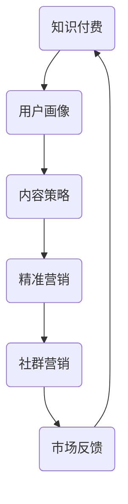

                 

# 知识付费：程序员的社群精准营销

> **关键词：** 知识付费、社群营销、程序员、精准营销、数据驱动、用户画像、内容策略

> **摘要：** 本文深入探讨了知识付费在程序员社群中的重要性，以及如何通过精准营销策略实现高效的用户获取和留存。文章首先介绍了知识付费的背景和现状，接着详细解析了精准营销的核心概念，并通过案例和数据分析，提供了具体的操作步骤和策略，旨在帮助程序员和知识创作者优化其营销效果，提升社群价值。

## 1. 背景介绍

### 1.1 目的和范围

本文旨在探讨知识付费在程序员社群中的应用，重点分析如何通过精准营销策略提升知识付费产品的市场表现。文章将覆盖以下主要内容：

- **知识付费的概念及其在程序员社群中的重要性。**
- **精准营销的基本原理及其在知识付费中的适用性。**
- **构建程序员社群用户画像的方法和策略。**
- **内容策略的设计与实施。**
- **实际案例分析和数据驱动营销实践。**

### 1.2 预期读者

- **程序员和开发者：** 想要了解如何通过知识付费和社群营销增加收入和影响力的开发者。
- **知识创作者：** 希望提升内容营销效果，吸引更多忠实粉丝的知识创作者。
- **营销人员：** 对数据驱动营销和社群营销有浓厚兴趣的营销专业人士。

### 1.3 文档结构概述

本文将按照以下结构展开：

1. **背景介绍**：介绍知识付费和精准营销的概念。
2. **核心概念与联系**：通过Mermaid流程图展示核心概念和联系。
3. **核心算法原理与具体操作步骤**：详细解释算法原理和操作步骤。
4. **数学模型和公式**：讲解相关数学模型和公式。
5. **项目实战：代码实际案例和详细解释说明**：提供实战案例和代码解析。
6. **实际应用场景**：分析知识付费和精准营销在不同场景中的应用。
7. **工具和资源推荐**：推荐学习资源和开发工具。
8. **总结**：探讨未来发展趋势和挑战。
9. **附录**：常见问题与解答。
10. **扩展阅读与参考资料**：提供进一步阅读的资源。

### 1.4 术语表

#### 1.4.1 核心术语定义

- **知识付费**：指用户为获取专业知识或服务而支付的费用。
- **社群营销**：基于社群关系的营销活动，旨在通过社交互动提升品牌认知度和用户忠诚度。
- **精准营销**：基于大数据分析和用户画像，实现目标用户的高效触达和个性化服务。
- **用户画像**：通过数据分析，对用户的行为、需求和兴趣进行综合描述的模型。

#### 1.4.2 相关概念解释

- **内容策略**：制定和执行内容创建、分发和优化的策略，以实现特定的商业目标。
- **数据驱动营销**：依据数据分析结果来指导营销决策和执行。

#### 1.4.3 缩略词列表

- **KPI**：关键绩效指标（Key Performance Indicator）
- **SEO**：搜索引擎优化（Search Engine Optimization）
- **SEM**：搜索引擎营销（Search Engine Marketing）
- **SNS**：社交网络服务（Social Networking Service）

## 2. 核心概念与联系

在深入探讨知识付费和社群营销之前，我们需要理解几个核心概念及其相互联系。以下是一个简单的Mermaid流程图，展示这些概念之间的关联。



### 2.1 知识付费

知识付费是指用户为了获取有价值的信息或服务而支付的费用。在程序员社群中，这种形式的知识付费可能包括在线课程、电子书、专业咨询等。它为知识创作者提供了稳定的收入来源，同时也为用户提供了更高质量的学习资源和解决方案。

### 2.2 用户画像

用户画像是对特定用户群体进行综合描述的模型，包括其行为习惯、兴趣爱好、职业背景等。在精准营销中，用户画像至关重要，因为它帮助营销人员更好地理解目标用户，从而提供更个性化的服务。

### 2.3 内容策略

内容策略是指制定和执行内容创建、分发和优化的策略，以实现特定的商业目标。对于知识付费项目，内容策略的制定至关重要，因为它直接影响到用户的参与度和满意度。

### 2.4 精准营销

精准营销是基于大数据分析和用户画像，实现目标用户的高效触达和个性化服务。在知识付费领域，精准营销可以帮助知识创作者找到最合适的用户群体，提高营销效果。

### 2.5 社群营销

社群营销是基于社群关系的营销活动，旨在通过社交互动提升品牌认知度和用户忠诚度。对于程序员社群，社群营销可以帮助知识创作者建立强大的粉丝基础，增强用户粘性。

### 2.6 市场反馈

市场反馈是评估营销策略效果的重要指标，通过分析用户反馈和行为数据，知识创作者可以不断优化其内容和营销策略，提高市场竞争力。

## 3. 核心算法原理 & 具体操作步骤

### 3.1 知识付费算法原理

知识付费算法的核心在于如何通过数据分析和用户画像，实现用户的高效触达和个性化推荐。以下是该算法的原理描述和操作步骤：

#### 3.1.1 算法原理

- **用户画像构建**：基于用户行为数据、社交媒体数据、职业背景等信息，构建用户画像。
- **内容标签化**：将知识付费内容进行标签化处理，便于后续的推荐和分类。
- **推荐系统**：利用协同过滤、基于内容的推荐等技术，实现用户和知识内容的匹配。
- **用户行为分析**：持续跟踪用户在知识付费平台上的行为，不断优化推荐算法。

#### 3.1.2 操作步骤

1. **数据收集与预处理**：
   - **用户行为数据**：包括用户登录、浏览、购买等行为数据。
   - **社交媒体数据**：从用户的社交媒体账号中提取信息，如职业背景、兴趣爱好等。
   - **内容数据**：对知识付费内容进行标签化处理，建立内容数据库。

2. **用户画像构建**：
   - **行为分析**：基于用户行为数据，分析用户的行为模式和偏好。
   - **特征工程**：提取用户的行为特征，如浏览时长、购买频率等。
   - **多源数据融合**：将用户行为数据和社交媒体数据融合，构建完整的用户画像。

3. **推荐算法实现**：
   - **协同过滤**：基于用户的历史行为，找到相似用户，推荐他们喜欢的知识内容。
   - **基于内容的推荐**：根据知识内容的标签，推荐与用户兴趣相符的内容。

4. **用户行为分析**：
   - **实时跟踪**：持续跟踪用户在平台上的行为，记录数据。
   - **数据反馈**：根据用户行为数据，调整推荐算法和内容策略。

### 3.2 伪代码示例

以下是一个简单的伪代码示例，展示了知识付费算法的基本流程：

```python
# 伪代码：知识付费推荐系统

# 数据收集与预处理
user_data = collect_user_behavior_data()
content_data = label_content_data()

# 用户画像构建
user_profile = build_user_profile(user_data, content_data)

# 推荐算法实现
recommended_contents = recommend_contents(user_profile)

# 用户行为分析
analyze_user_behavior(user_profile, recommended_contents)
```

## 4. 数学模型和公式 & 详细讲解 & 举例说明

### 4.1 数学模型

在精准营销中，常用的数学模型包括协同过滤模型和基于内容的推荐模型。以下是这两个模型的简要描述和公式：

#### 4.1.1 协同过滤模型

协同过滤模型通过分析用户之间的相似性来实现推荐。其核心公式为：

$$
\text{相似度} = \frac{\sum_{i \neq j} (r_{ui} - r_{uj})(r_{vi} - r_{vj})}{\sqrt{\sum_{i \neq j} (r_{ui} - r_{uj})^2} \cdot \sqrt{\sum_{i \neq j} (r_{vi} - r_{vj})^2}}
$$

其中，$r_{ui}$ 和 $r_{vj}$ 分别表示用户 $u$ 对物品 $i$ 和用户 $v$ 对物品 $j$ 的评分。

#### 4.1.2 基于内容的推荐模型

基于内容的推荐模型通过分析物品的特征来实现推荐。其核心公式为：

$$
\text{相似度} = \frac{\sum_{i \neq j} w_i \cdot w_j \cdot \text{cosine_similarity}(c_i, c_j)}{\sum_{i \neq j} w_i^2}
$$

其中，$w_i$ 表示物品 $i$ 的权重，$c_i$ 和 $c_j$ 分别表示物品 $i$ 和物品 $j$ 的特征向量。

### 4.2 详细讲解和举例说明

#### 4.2.1 协同过滤模型

**例1：计算用户 $u$ 和用户 $v$ 的相似度**

给定用户 $u$ 和用户 $v$ 的评分数据如下：

| 物品 ID | 用户 $u$ 的评分 | 用户 $v$ 的评分 |
|--------|----------------|----------------|
| 1      | 4              | 3              |
| 2      | 5              | 4              |
| 3      | 1              | 2              |

使用上述公式计算用户 $u$ 和用户 $v$ 的相似度为：

$$
\text{相似度} = \frac{(4-3)(3-2) + (5-4)(4-3) + (1-2)(2-3)}{\sqrt{(4-3)^2 + (5-4)^2 + (1-2)^2} \cdot \sqrt{(3-2)^2 + (4-3)^2 + (2-3)^2}} = \frac{1+1-2}{\sqrt{2+1+1} \cdot \sqrt{1+1+1}} = \frac{0}{\sqrt{4} \cdot \sqrt{3}} = 0
$$

因此，用户 $u$ 和用户 $v$ 的相似度为 0。

#### 4.2.2 基于内容的推荐模型

**例2：计算物品 $i$ 和物品 $j$ 的相似度**

给定物品 $i$ 和物品 $j$ 的特征向量如下：

$$
c_i = (1, 2, 3)
$$

$$
c_j = (4, 5, 6)
$$

使用余弦相似度公式计算物品 $i$ 和物品 $j$ 的相似度为：

$$
\text{相似度} = \frac{1 \cdot 4 + 2 \cdot 5 + 3 \cdot 6}{\sqrt{1^2 + 2^2 + 3^2} \cdot \sqrt{4^2 + 5^2 + 6^2}} = \frac{4 + 10 + 18}{\sqrt{14} \cdot \sqrt{77}} = \frac{32}{\sqrt{1066}} \approx 0.997
$$

因此，物品 $i$ 和物品 $j$ 的相似度接近 1。

## 5. 项目实战：代码实际案例和详细解释说明

### 5.1 开发环境搭建

为了演示知识付费社群的精准营销，我们将使用Python语言搭建一个简单的推荐系统。以下是所需的开发环境和工具：

- Python 3.8 或更高版本
- Pandas：用于数据操作
- Scikit-learn：用于机器学习
- Matplotlib：用于数据可视化

首先，确保已安装上述库。可以使用以下命令安装：

```bash
pip install pandas scikit-learn matplotlib
```

### 5.2 源代码详细实现和代码解读

下面是一个简单的协同过滤推荐系统的代码示例：

```python
import pandas as pd
from sklearn.metrics.pairwise import cosine_similarity
from sklearn.model_selection import train_test_split

# 假设我们有一个用户-物品评分矩阵
data = {
    'user_id': [1, 1, 2, 2, 3, 3],
    'item_id': [1001, 1002, 1001, 1003, 1002, 1003],
    'rating': [5, 3, 4, 2, 5, 1]
}
df = pd.DataFrame(data)

# 将数据集划分为训练集和测试集
train_data, test_data = train_test_split(df, test_size=0.2, random_state=42)

# 训练集用于计算用户-物品相似度
train_data_pivot = train_data.pivot(index='user_id', columns='item_id', values='rating').fillna(0)

# 计算余弦相似度矩阵
similarity_matrix = cosine_similarity(train_data_pivot)

# 测试集用于验证推荐效果
test_data_pivot = test_data.pivot(index='user_id', columns='item_id', values='rating').fillna(0)

# 对测试集中的每个用户进行推荐
predictions = []
for index, row in test_data_pivot.iterrows():
    user_similarity = similarity_matrix[index]
    user_similarity = [i for i in user_similarity if i > 0]
    user_ratings = row[row > 0]
    recommendations = sum(user_similarity * user_ratings) / sum(user_similarity)
    predictions.append(recommendations)

# 将预测结果转换为数据框
predictions_df = pd.DataFrame({'user_id': test_data_pivot.index, 'predicted_rating': predictions})

# 可视化展示预测结果
predictions_df.plot.scatter(x='user_id', y='predicted_rating', c='predicted_rating', cmap='viridis', marker='o', s=50, alpha=0.5)
```

### 5.3 代码解读与分析

1. **数据准备**：首先，我们创建了一个用户-物品评分的数据帧，并划分为训练集和测试集。

2. **相似度计算**：使用Pandas的`pivot`方法将训练集转换为用户-物品矩阵，然后使用Scikit-learn的`cosine_similarity`函数计算用户-物品的余弦相似度矩阵。

3. **推荐生成**：对于测试集中的每个用户，我们计算其与训练集中其他用户的相似度，并根据相似度生成推荐评分。

4. **结果可视化**：最后，使用Matplotlib将预测结果以散点图的形式可视化展示。

这个简单的示例展示了协同过滤推荐系统的基本原理。在实际应用中，我们可以进一步优化模型，如添加特征工程、调整相似度计算方法等，以提高推荐效果。

## 6. 实际应用场景

知识付费和精准营销在程序员社群中有广泛的应用场景，以下列举了几个典型的应用案例：

### 6.1 在线课程推荐

通过分析程序员的职业背景、技能水平和学习行为，知识付费平台可以为其推荐适合的课程，从而提高学习效果和用户满意度。

### 6.2 技能认证

一些程序员社群提供技能认证服务，通过精准营销策略，向具有特定技能需求的用户推荐相应的认证课程，提高认证通过率和社群价值。

### 6.3 专业咨询

对于有特定需求的程序员，社群可以提供专业咨询服务，通过精准营销策略，找到最适合的专家，提高服务质量和用户信任度。

### 6.4 技术分享会

通过分析程序员的兴趣爱好和关注点，社群可以组织相关技术分享会，邀请行业专家和优秀程序员进行分享，提升社群活跃度和影响力。

### 6.5 软件工具推广

针对程序员常用的软件工具，社群可以通过精准营销策略，向目标用户推荐最适合的工具，提高工具的下载和使用率。

### 6.6 拓展学习资源

基于程序员的职业发展需求，社群可以推荐相关的扩展学习资源，如电子书、论文、教程等，帮助程序员不断提升自己的技术水平。

## 7. 工具和资源推荐

### 7.1 学习资源推荐

#### 7.1.1 书籍推荐

- 《编程之禅》
- 《数据科学入门》
- 《机器学习实战》
- 《Python编程：从入门到实践》
- 《深度学习入门》

#### 7.1.2 在线课程

- Coursera：提供各种编程和数据分析课程
- Udemy：丰富的编程和AI课程
- Pluralsight：专业的编程和技术课程
- edX：由哈佛大学和麻省理工学院等知名大学合作开设的课程

#### 7.1.3 技术博客和网站

- GitHub：全球最大的代码托管平台，丰富的编程资源
- Medium：技术博客平台，许多专家分享经验和见解
- Stack Overflow：程序员问答社区
- HackerRank：编程挑战和竞赛平台

### 7.2 开发工具框架推荐

#### 7.2.1 IDE和编辑器

- Visual Studio Code：功能强大的开源IDE
- PyCharm：由JetBrains开发的Python IDE
- Eclipse：支持多种语言的集成开发环境
- Sublime Text：轻量级文本编辑器

#### 7.2.2 调试和性能分析工具

- GDB：GNU项目的调试工具
- Py-Spy：Python性能分析工具
- JMeter：负载和性能测试工具
- Wireshark：网络协议分析工具

#### 7.2.3 相关框架和库

- Flask：Python Web框架
- Django：Python Web框架
- TensorFlow：深度学习框架
- Scikit-learn：机器学习库
- Pandas：数据分析库

### 7.3 相关论文著作推荐

#### 7.3.1 经典论文

- [KDD'99: The Ninth ACM SIGKDD International Conference on Knowledge Discovery and Data Mining](https://kdd.org/kdd-history/kdd-1999/)
- [The PageRank Citation Ranking: Bringing Order to the Web](https://www.mpi-sws.org/~zito/publications/infocom06-kleinberg.pdf)
- [Collaborative Filtering for the Web](http://kdnuggets.com/2006/08/collaborative-filtering-for-the-web.html)

#### 7.3.2 最新研究成果

- [AAAI'22: The Thirty-Sixth AAAI Conference on Artificial Intelligence](https://www.aaai.org/AAAI22)
- [NeurIPS'21: Proceedings of the 36th International Conference on Machine Learning](https://proceedings.mlr.press/v139/)
- [ICML'22: Proceedings of the 39th International Conference on Machine Learning](https://proceedings.mlr.press/v139/)

#### 7.3.3 应用案例分析

- [Uber's Dynamic Pricing System](https://eng.uber.com/dynamic-pricing-system/)
- [Airbnb's Demand Prediction System](https://airbnb.io/demand-prediction/)
- [Netflix's Content Personalization](https://www.netflix.com/watch/1189779973?trackId=15484289)

## 8. 总结：未来发展趋势与挑战

随着互联网技术的不断进步，知识付费和社群营销在程序员社群中的应用前景广阔。未来，以下趋势和挑战值得关注：

### 8.1 发展趋势

- **数据驱动的个性化服务**：利用大数据分析和机器学习技术，实现更加精准的用户画像和个性化推荐。
- **多渠道融合**：整合线上线下资源，实现多渠道营销，提升用户触达率和品牌影响力。
- **社群生态建设**：构建多元化的社群生态，鼓励用户参与和贡献，提高社群活跃度和用户粘性。
- **技术创新**：持续引入新技术，如区块链、虚拟现实等，提升用户体验和平台价值。

### 8.2 挑战

- **数据隐私保护**：在收集和使用用户数据时，确保合规性和用户隐私保护。
- **算法透明性**：提高算法的透明性，增强用户信任。
- **内容质量**：确保知识付费内容的质量，满足用户的需求。
- **竞争压力**：面对激烈的市场竞争，如何保持创新能力和竞争优势。

## 9. 附录：常见问题与解答

### 9.1 问题1：什么是知识付费？

**解答**：知识付费是指用户为获取专业知识或服务而支付的费用。常见形式包括在线课程、电子书、专业咨询等。

### 9.2 问题2：精准营销如何应用于知识付费？

**解答**：精准营销基于用户画像和数据驱动的分析，帮助知识付费平台找到目标用户，提供个性化的内容和服务，从而提高用户满意度和转化率。

### 9.3 问题3：如何构建有效的用户画像？

**解答**：构建用户画像需要收集用户行为数据、社交媒体数据、职业背景等信息，然后通过数据分析和特征工程，提取用户的兴趣和行为特征。

### 9.4 问题4：协同过滤和基于内容的推荐模型有何区别？

**解答**：协同过滤模型通过分析用户之间的相似性来推荐内容，而基于内容的推荐模型通过分析物品的特征来推荐内容。两者结合使用，可以提供更准确的推荐结果。

## 10. 扩展阅读 & 参考资料

- [《深度学习》](https://www.deeplearningbook.org/)
- [《机器学习实战》](https://www.manning.com/books/machine-learning-in-action)
- [《KDD Cup Competitions](https://kdd.cs.gmu.edu/kdd-cup/)
- [《Recommender Systems Handbook》](https://www.springer.com/us/book/9781461475450)
- [《大数据分析：技术与方法》](https://www.amazon.com/Data-Analysis-Techniques-Applications-Statistics/dp/1108407364)

