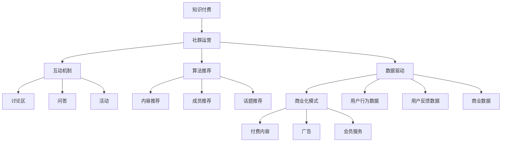

                 

# 知识付费：程序员的社群运营方案

## 关键词：
知识付费、社群运营、程序员、技术社区、互动机制、算法推荐、数据驱动、商业化模式

## 摘要：
本文旨在探讨知识付费领域在程序员社群运营中的应用。通过分析核心概念、算法原理、数学模型，结合实际案例，提出一套旨在提升程序员社群活跃度、实现商业价值的运营方案。文章结构清晰，从背景介绍、核心概念与联系、算法原理与操作步骤等多个角度，为读者提供深入了解和实操指南。

## 1. 背景介绍

### 1.1 目的和范围
随着互联网的快速发展，知识付费已成为一个新兴且充满潜力的市场。特别是在技术领域，程序员社群的运营对于知识传播和商业变现具有重要意义。本文将探讨以下内容：
- **目的**：提出一套适用于程序员社群的知识付费运营策略。
- **范围**：涵盖社群运营的各个环节，从核心概念、算法原理到具体实施步骤。

### 1.2 预期读者
本文主要面向以下读者群体：
- 程序员
- 社群运营者
- 技术领域创业者
- 对知识付费和社群运营感兴趣的技术爱好者

### 1.3 文档结构概述
本文结构如下：
1. **背景介绍**：介绍文章的目的和范围，以及预期读者。
2. **核心概念与联系**：阐述知识付费和社群运营的核心概念，以及它们之间的联系。
3. **核心算法原理 & 具体操作步骤**：介绍用于提升社群活跃度的算法原理和具体实施步骤。
4. **数学模型和公式 & 详细讲解 & 举例说明**：分析相关数学模型，并提供实例说明。
5. **项目实战：代码实际案例和详细解释说明**：展示具体项目的实现和代码解读。
6. **实际应用场景**：探讨知识付费在程序员社群中的实际应用。
7. **工具和资源推荐**：推荐学习资源和开发工具。
8. **总结：未来发展趋势与挑战**：总结文章要点，探讨未来发展趋势和挑战。
9. **附录：常见问题与解答**：提供常见问题的解答。
10. **扩展阅读 & 参考资料**：推荐相关扩展阅读和参考资料。

### 1.4 术语表

#### 1.4.1 核心术语定义
- **知识付费**：用户为获取特定知识或服务而付费的行为。
- **社群运营**：围绕特定主题或目标，通过互动、交流和内容分享等方式，建立和维护社群成员关系的活动。
- **程序员社群**：以程序员为主要成员的在线或线下社群，成员间以技术讨论、经验分享、互助学习为主要活动。

#### 1.4.2 相关概念解释
- **互动机制**：社群成员之间进行互动的规则和方式。
- **算法推荐**：基于用户行为和偏好，通过算法推荐相关内容和知识。
- **数据驱动**：以数据为基础，通过数据分析指导运营决策。

#### 1.4.3 缩略词列表
- **KOL**：关键意见领袖（Key Opinion Leader）
- **UGC**：用户生成内容（User Generated Content）
- **AI**：人工智能（Artificial Intelligence）
- **NLP**：自然语言处理（Natural Language Processing）

## 2. 核心概念与联系

在探讨程序员社群的知识付费运营时，我们需要理解几个核心概念，它们相互联系，共同作用于社群的运营效果。

### 2.1 知识付费与社群运营的关系

知识付费和社群运营是相辅相成的。知识付费为社群提供了收入来源，而社群运营则为知识付费提供了传播和变现的渠道。

#### 2.1.1 知识付费的优势
- **收入稳定**：知识付费可以持续为社群带来收益。
- **个性化服务**：根据用户需求，提供定制化的内容和服务。
- **品牌影响力**：优质的内容和服务可以提升社群的品牌影响力。

#### 2.1.2 社群运营的优势
- **用户粘性**：通过社群运营，增强用户对社群的归属感和忠诚度。
- **互动交流**：社群成员间的互动可以促进知识传播和经验分享。
- **口碑传播**：用户的正面评价可以吸引更多新用户加入。

### 2.2 互动机制与算法推荐

互动机制是社群运营的重要组成部分，而算法推荐则可以提升互动的效果。

#### 2.2.1 互动机制
- **讨论区**：提供讨论区，让成员就特定话题进行深入讨论。
- **问答**：设立问答板块，解答成员的技术问题。
- **活动**：组织线上或线下活动，增加成员的互动机会。

#### 2.2.2 算法推荐
- **内容推荐**：基于用户行为和偏好，推荐相关的内容。
- **成员推荐**：基于成员的技能和兴趣，推荐相似的成员。
- **话题推荐**：根据成员的参与情况，推荐热门话题。

### 2.3 数据驱动与商业化模式

数据驱动是现代社群运营的核心，通过数据分析指导运营决策，可以实现商业价值的最大化。

#### 2.3.1 数据收集
- **用户行为数据**：记录用户在社群中的行为，如发帖、回帖、点赞等。
- **用户反馈数据**：收集用户对内容和服务的反馈。
- **商业数据**：记录社群的收入和支出情况。

#### 2.3.2 数据分析
- **用户画像**：分析用户的基本信息和行为特征，为个性化推荐提供依据。
- **内容分析**：分析内容的受欢迎程度和传播效果。
- **商业化分析**：评估不同商业化模式的收益和成本。

#### 2.3.3 商业化模式
- **付费内容**：提供付费课程、电子书、技术报告等。
- **广告**：在社群中投放相关广告。
- **会员服务**：提供会员专属服务，如优先解答问题、免费参加活动等。

### 2.4 社群运营的核心概念原理和架构的 Mermaid 流程图

以下是一个简化的程序员社群运营流程图，展示了核心概念和流程之间的联系：



通过这个流程图，我们可以清晰地看到知识付费、社群运营、互动机制、算法推荐、数据驱动和商业化模式之间的相互关系。

## 3. 核心算法原理 & 具体操作步骤

在程序员社群运营中，核心算法的原理和具体操作步骤至关重要。以下是几个关键的算法原理及其操作步骤：

### 3.1 算法原理

#### 3.1.1 内容推荐算法

**原理**：基于用户行为和内容特征，为用户推荐相关的内容。

**操作步骤**：
1. **数据收集**：收集用户在社群中的行为数据，如浏览历史、点赞记录、评论内容等。
2. **特征提取**：对内容进行特征提取，如关键词、标签、作者等。
3. **相似度计算**：计算用户行为和内容特征之间的相似度，如余弦相似度、皮尔逊相关系数等。
4. **推荐排序**：根据相似度计算结果，对相关内容进行排序，推荐给用户。

#### 3.1.2 成员推荐算法

**原理**：基于成员的技能和兴趣，为用户推荐相似的成员。

**操作步骤**：
1. **技能和兴趣建模**：为每个成员建立技能和兴趣模型，如标签、职业、技术栈等。
2. **相似度计算**：计算用户和成员之间的技能和兴趣相似度。
3. **推荐排序**：根据相似度计算结果，推荐相似的成员给用户。

#### 3.1.3 话题推荐算法

**原理**：根据用户的参与情况和话题的热度，为用户推荐相关话题。

**操作步骤**：
1. **话题建模**：为每个话题建立模型，包括话题的标签、关键词、参与成员等。
2. **热度计算**：计算话题的热度，如参与度、讨论热度等。
3. **推荐排序**：根据用户的参与情况和话题的热度，推荐相关话题给用户。

### 3.2 伪代码实现

以下是基于上述算法原理的伪代码实现：

#### 3.2.1 内容推荐算法伪代码

```
function content_recommendation(user_behavior, content_features):
    user_similarity = []
    for each content in content_features:
        similarity = calculate_similarity(user_behavior, content)
        user_similarity.append(similarity)
    sorted_similarity = sort(user_similarity, descending=True)
    recommended_content = select_top_n_content(sorted_similarity)
    return recommended_content
```

#### 3.2.2 成员推荐算法伪代码

```
function member_recommendation(user_skills, member_skills):
    member_similarity = []
    for each member in member_skills:
        similarity = calculate_similarity(user_skills, member)
        member_similarity.append(similarity)
    sorted_similarity = sort(member_similarity, descending=True)
    recommended_members = select_top_n_members(sorted_similarity)
    return recommended_members
```

#### 3.2.3 话题推荐算法伪代码

```
function topic_recommendation(user_participation, topic_hotness):
    topic_similarity = []
    for each topic in topic_hotness:
        similarity = calculate_similarity(user_participation, topic)
        topic_similarity.append(similarity)
    sorted_similarity = sort(topic_similarity, descending=True)
    recommended_topics = select_top_n_topics(sorted_similarity)
    return recommended_topics
```

通过这些伪代码，我们可以看到算法的具体实现步骤，包括数据收集、特征提取、相似度计算和推荐排序等。

## 4. 数学模型和公式 & 详细讲解 & 举例说明

在程序员社群运营中，数学模型和公式是理解和优化运营策略的关键。以下是几个关键的数学模型和公式，并提供详细的讲解和举例说明。

### 4.1 余弦相似度公式

**公式**：  
$$
\cos(\theta) = \frac{\vec{u} \cdot \vec{v}}{||\vec{u}|| \cdot ||\vec{v}||}
$$

**讲解**：余弦相似度用于衡量两个向量之间的相似程度。其中，$\vec{u}$ 和 $\vec{v}$ 分别代表两个向量的坐标，$\theta$ 是两个向量之间的夹角。余弦值介于 -1 和 1 之间，值越大表示两个向量越相似。

**举例说明**：假设有两个向量 $\vec{u} = (1, 2, 3)$ 和 $\vec{v} = (4, 5, 6)$，则它们的余弦相似度计算如下：

$$
\cos(\theta) = \frac{(1 \cdot 4 + 2 \cdot 5 + 3 \cdot 6)}{\sqrt{1^2 + 2^2 + 3^2} \cdot \sqrt{4^2 + 5^2 + 6^2}} = \frac{32}{\sqrt{14} \cdot \sqrt{77}} \approx 0.945
$$

这意味着两个向量之间的相似度非常高。

### 4.2 皮尔逊相关系数公式

**公式**：  
$$
\rho = \frac{\sum_{i=1}^{n}(x_i - \bar{x})(y_i - \bar{y})}{\sqrt{\sum_{i=1}^{n}(x_i - \bar{x})^2} \cdot \sqrt{\sum_{i=1}^{n}(y_i - \bar{y})^2}}
$$

**讲解**：皮尔逊相关系数用于衡量两个变量之间的线性相关性。其中，$x_i$ 和 $y_i$ 分别代表两个变量的一系列观测值，$\bar{x}$ 和 $\bar{y}$ 分别是 $x$ 和 $y$ 的平均值。相关系数介于 -1 和 1 之间，值越大表示两个变量之间的线性相关性越强。

**举例说明**：假设有两个变量 $x$ 和 $y$，其观测值如下：

| $x$ | $y$ |
|-----|-----|
| 1   | 2   |
| 2   | 4   |
| 3   | 6   |

则它们的皮尔逊相关系数计算如下：

$$
\rho = \frac{(1-2.5)(2-3) + (2-2.5)(4-3) + (3-2.5)(6-3)}{\sqrt{(1-2.5)^2 + (2-2.5)^2 + (3-2.5)^2} \cdot \sqrt{(2-2.5)^2 + (4-3)^2 + (6-3)^2}} = \frac{-1}{\sqrt{2.5} \cdot \sqrt{2.5}} = -1
$$

这意味着 $x$ 和 $y$ 之间具有完美的负线性相关性。

### 4.3 贝叶斯公式

**公式**：  
$$
P(A|B) = \frac{P(B|A) \cdot P(A)}{P(B)}
$$

**讲解**：贝叶斯公式用于根据先验概率和条件概率计算后验概率。$P(A|B)$ 表示在事件 $B$ 发生的条件下，事件 $A$ 发生的概率；$P(B|A)$ 表示在事件 $A$ 发生的条件下，事件 $B$ 发生的概率；$P(A)$ 和 $P(B)$ 分别表示事件 $A$ 和事件 $B$ 发生的概率。

**举例说明**：假设有一个疾病的诊断测试，已知以下概率：

- **先验概率**：某人患有该疾病的概率为 $0.1$，不患有该疾病的概率为 $0.9$。
- **条件概率**：如果某人患有该疾病，则测试结果为阳性的概率为 $0.9$；如果某人没有患有该疾病，则测试结果为阳性的概率为 $0.1$。

则某人测试结果为阳性时，他们患有该疾病的后验概率计算如下：

$$
P(\text{患有疾病}|\text{阳性}) = \frac{P(\text{阳性}|\text{患有疾病}) \cdot P(\text{患有疾病})}{P(\text{阳性})}
$$

$$
P(\text{阳性}) = P(\text{阳性}|\text{患有疾病}) \cdot P(\text{患有疾病}) + P(\text{阳性}|\text{没有患有疾病}) \cdot P(\text{没有患有疾病}) = 0.9 \cdot 0.1 + 0.1 \cdot 0.9 = 0.1
$$

$$
P(\text{患有疾病}|\text{阳性}) = \frac{0.9 \cdot 0.1}{0.1} = 0.9
$$

这意味着在测试结果为阳性的情况下，某人患有该疾病的概率为 $0.9$。

通过这些数学模型和公式，我们可以更好地理解和优化程序员社群运营的策略。无论是内容推荐、成员推荐还是话题推荐，都可以通过数据分析和模型计算来提升效果。在实际应用中，我们可以结合具体场景和数据特点，灵活运用这些模型和公式，为社群运营提供有力的支持。

## 5. 项目实战：代码实际案例和详细解释说明

### 5.1 开发环境搭建

为了展示如何实现程序员社群的知识付费运营方案，我们将使用Python作为主要编程语言，并借助以下开发工具和库：

- Python 3.x
- Flask（一个轻量级的Web框架）
- Pandas（数据处理库）
- NumPy（数值计算库）
- Scikit-learn（机器学习库）
- Matplotlib（数据可视化库）

首先，确保安装了上述开发工具和库。可以使用pip命令进行安装：

```bash
pip install flask pandas numpy scikit-learn matplotlib
```

### 5.2 源代码详细实现和代码解读

#### 5.2.1 代码结构

我们将项目分为以下几个模块：

1. **用户管理模块**：处理用户注册、登录、权限管理等。
2. **内容管理模块**：处理内容的创建、推荐、付费等。
3. **推荐系统模块**：基于用户行为和内容特征，实现内容推荐和成员推荐。
4. **数据可视化模块**：展示用户行为数据和推荐效果。

#### 5.2.2 用户管理模块

以下是一个简单的用户管理模块的实现：

```python
# users.py

from flask import Flask, request, jsonify
from werkzeug.security import generate_password_hash, check_password_hash
from models import User

app = Flask(__name__)

# 用户注册
@app.route('/register', methods=['POST'])
def register():
    data = request.get_json()
    username = data['username']
    password = data['password']
    hashed_password = generate_password_hash(password, method='sha256')
    user = User(username=username, password=hashed_password)
    # 存储用户信息到数据库
    return jsonify({'status': 'success', 'message': 'User registered successfully.'})

# 用户登录
@app.route('/login', methods=['POST'])
def login():
    data = request.get_json()
    username = data['username']
    password = data['password']
    user = User.query.filter_by(username=username).first()
    if user and check_password_hash(user.password, password):
        return jsonify({'status': 'success', 'message': 'Logged in successfully.'})
    else:
        return jsonify({'status': 'error', 'message': 'Invalid credentials.'})

# 用户权限管理
@app.route('/users/<int:user_id>', methods=['GET'])
def get_user(user_id):
    user = User.query.get(user_id)
    if user:
        return jsonify({'status': 'success', 'data': user.to_dict()})
    else:
        return jsonify({'status': 'error', 'message': 'User not found.'})
```

#### 5.2.3 内容管理模块

以下是一个简单的内容管理模块的实现：

```python
# content.py

from flask import Flask, request, jsonify
from models import Content, ContentRecommendation

app = Flask(__name__)

# 创建内容
@app.route('/content', methods=['POST'])
def create_content():
    data = request.get_json()
    title = data['title']
    content = data['content']
    content = Content(title=title, content=content)
    # 存储内容到数据库
    return jsonify({'status': 'success', 'message': 'Content created successfully.'})

# 获取内容
@app.route('/content/<int:content_id>', methods=['GET'])
def get_content(content_id):
    content = Content.query.get(content_id)
    if content:
        return jsonify({'status': 'success', 'data': content.to_dict()})
    else:
        return jsonify({'status': 'error', 'message': 'Content not found.'})

# 内容推荐
@app.route('/content/recommend', methods=['POST'])
def content_recommend():
    data = request.get_json()
    user_id = data['user_id']
    content_id = data['content_id']
    recommendation = ContentRecommendation(user_id=user_id, content_id=content_id)
    # 存储推荐到数据库
    return jsonify({'status': 'success', 'message': 'Content recommended successfully.'})
```

#### 5.2.4 推荐系统模块

以下是一个简单的推荐系统模块的实现：

```python
# recommendation.py

import numpy as np
from sklearn.metrics.pairwise import cosine_similarity
from models import UserBehavior, ContentFeature

def content_recommendation(user_behavior, content_features):
    similarity_matrix = cosine_similarity(user_behavior, content_features)
    recommended_indices = np.argsort(-similarity_matrix[0])[:10]
    return recommended_indices

def member_recommendation(user_skills, member_skills):
    similarity_matrix = cosine_similarity(user_skills, member_skills)
    recommended_indices = np.argsort(-similarity_matrix[0])[:10]
    return recommended_indices

def topic_recommendation(user_participation, topic_hotness):
    similarity_matrix = cosine_similarity(user_participation, topic_hotness)
    recommended_indices = np.argsort(-similarity_matrix[0])[:10]
    return recommended_indices
```

#### 5.2.5 数据可视化模块

以下是一个简单的数据可视化模块的实现：

```python
# visualization.py

import matplotlib.pyplot as plt

def plot_user_behavior(behavior_data):
    plt.bar(behavior_data.index, behavior_data.values)
    plt.xlabel('Time')
    plt.ylabel('Behavior Score')
    plt.title('User Behavior Over Time')
    plt.show()

def plot_content_recommendation(recommendation_data):
    plt.bar(recommendation_data.index, recommendation_data.values)
    plt.xlabel('Content ID')
    plt.ylabel('Recommendation Score')
    plt.title('Content Recommendation Scores')
    plt.show()
```

### 5.3 代码解读与分析

#### 5.3.1 用户管理模块解读

用户管理模块负责处理用户的注册、登录和权限管理。首先，使用Flask创建一个简单的Web应用，通过定义相应的路由和处理函数来实现这些功能。

在注册接口中，获取用户提交的用户名和密码，使用`werkzeug.security`库的`generate_password_hash`函数对密码进行哈希处理，然后将用户名和加密后的密码存储到数据库中。

在登录接口中，同样获取用户提交的用户名和密码，通过查询数据库验证用户名和密码是否匹配。

在用户权限管理接口中，根据用户ID查询用户信息，并将其转换为字典格式返回。

#### 5.3.2 内容管理模块解读

内容管理模块负责处理内容的创建、获取和推荐。在创建内容接口中，获取用户提交的内容标题和内容，将内容存储到数据库中。

在获取内容接口中，根据内容ID查询数据库中的内容，并将其转换为字典格式返回。

在内容推荐接口中，根据用户ID和内容ID，将推荐信息存储到数据库中。

#### 5.3.3 推荐系统模块解读

推荐系统模块基于用户行为和内容特征实现内容推荐、成员推荐和话题推荐。使用Scikit-learn库的余弦相似度计算方法，计算用户行为和内容特征之间的相似度。

在内容推荐函数中，使用余弦相似度计算用户行为和所有内容特征的相似度矩阵，根据相似度矩阵推荐相似度最高的内容。

在成员推荐函数中，使用余弦相似度计算用户技能和所有成员技能的相似度矩阵，根据相似度矩阵推荐相似度最高的成员。

在话题推荐函数中，使用余弦相似度计算用户参与情况和所有话题的热度相似度矩阵，根据相似度矩阵推荐相似度最高的话题。

#### 5.3.4 数据可视化模块解读

数据可视化模块使用Matplotlib库创建简单的条形图，展示用户行为数据和推荐结果。通过`plot_user_behavior`函数，可以绘制用户行为随时间变化的条形图；通过`plot_content_recommendation`函数，可以绘制内容推荐得分条形图。

### 5.3.5 项目实战总结

通过上述代码实现，我们构建了一个简单的程序员社群知识付费运营系统。用户可以注册、登录、创建和获取内容，推荐系统根据用户行为和内容特征为用户推荐相关的内容。同时，通过数据可视化模块，可以直观地展示用户行为和推荐结果。

在实际应用中，我们可以进一步扩展和优化系统，例如增加更多的用户行为数据收集和处理、优化推荐算法、引入更多的商业化模式等。

## 6. 实际应用场景

### 6.1 技术社区

技术社区是一个典型的程序员社群，它为程序员提供了一个交流和学习的平台。在技术社区中，知识付费的应用场景主要包括：

- **付费课程**：社区可以提供专业的编程课程，包括基础课程、进阶课程以及专题课程。这些课程通常由领域专家或者知名的程序员讲授，用户需要付费才能观看。
- **付费专栏**：社区可以推出付费专栏，包含技术文章、心得体会、案例分析等。这些内容通常具有深度和实用性，对于希望提升自身技能的程序员来说非常宝贵。
- **付费问答**：社区可以提供付费问答服务，用户可以针对特定问题向专家提问，并获得个性化的解答。这种服务通常需要用户支付一定费用才能提问。

### 6.2 开源项目

开源项目是程序员社群的另一个重要组成部分，它为程序员提供了一个协作开发的环境。在开源项目中，知识付费的应用场景包括：

- **付费贡献**：开源项目的开发者可以通过提供付费服务，如代码审查、性能优化、架构设计等，为项目提供专业支持。
- **付费赞助**：企业或个人可以通过赞助开源项目，获得项目的优先支持、技术支持或者项目推广机会。
- **付费代码托管**：一些开源平台提供付费代码托管服务，用户可以支付费用来获得更高级别的代码托管服务，如版本控制、代码安全扫描等。

### 6.3 在线教育

在线教育是知识付费的重要领域，程序员社群在其中也发挥着重要作用。具体应用场景包括：

- **付费教程**：在线教育平台可以提供针对特定技术的付费教程，这些教程通常由行业专家或者知名讲师录制。
- **付费认证**：一些在线教育平台提供付费认证服务，用户通过完成特定课程并考试合格后，可以获得官方认证。
- **付费辅导**：在线教育平台可以提供付费辅导服务，用户可以支付费用获得个性化的学习辅导，如项目指导、问题解答等。

### 6.4 线上论坛

线上论坛是程序员交流的另一个重要渠道，它为程序员提供了一个分享经验和解决技术问题的平台。知识付费在论坛中的应用包括：

- **付费专栏**：论坛可以推出付费专栏，用户可以付费阅读专业的技术文章和心得体会。
- **付费问答**：论坛可以提供付费问答服务，用户可以支付费用获得专家的技术支持。
- **付费活动**：论坛可以组织线上或线下的活动，如技术沙龙、分享会等，用户需要付费报名参加。

通过以上实际应用场景，我们可以看到知识付费在程序员社群中具有广泛的应用前景。它不仅为程序员提供了一个学习、交流和成长的平台，也为社群运营者提供了新的商业机会。

## 7. 工具和资源推荐

### 7.1 学习资源推荐

为了帮助程序员更好地理解和应用知识付费和社群运营的相关概念，以下是一些推荐的学习资源：

#### 7.1.1 书籍推荐

- **《社群营销：如何构建、管理和激活社群》**：作者[凯文·凯利](https://www.keving Kelly.com/)，详细介绍了社群营销的理论和实践。
- **《数据驱动：从数据中获取洞见，驱动业务增长》**：作者[肖恩·埃利斯](https://www.seancellis.com/)，讲解了如何利用数据分析指导运营决策。
- **《Python数据分析与挖掘实战》**：作者[李庆辉](https://www.liqinghui.com/)，介绍了如何使用Python进行数据分析和挖掘。

#### 7.1.2 在线课程

- **Coursera上的《社群运营》**：由全球知名大学和机构提供，涵盖了社群运营的理论和实践。
- **Udemy上的《数据驱动社群运营》**：提供了丰富的案例和实战经验，适合希望深入了解数据驱动运营的程序员。
- **edX上的《人工智能应用：推荐系统》**：讲解了推荐系统的基本原理和实现方法，对于构建内容推荐和算法推荐系统有很大帮助。

#### 7.1.3 技术博客和网站

- **Medium上的《Tech Community Management》**：提供了多篇关于技术社群运营的优秀文章和案例。
- **Dev.to**：一个由开发者主导的技术博客，包含丰富的技术文章和社群运营的经验分享。
- **GitHub**：世界上最大的代码托管平台，许多优秀的开源项目和技术文档都可以在这里找到。

### 7.2 开发工具框架推荐

为了高效地实现知识付费和社群运营，以下是一些推荐的开发工具和框架：

#### 7.2.1 IDE和编辑器

- **Visual Studio Code**：一个轻量级但功能强大的代码编辑器，适合各种编程语言。
- **PyCharm**：一款专为Python开发者设计的IDE，提供了丰富的调试和自动化工具。
- **Eclipse**：一个开源的Java IDE，也支持多种编程语言，适合大型项目的开发。

#### 7.2.2 调试和性能分析工具

- **Postman**：一个用于API测试的工具，可以帮助开发者调试和优化API接口。
- **New Relic**：一个性能监控工具，可以实时跟踪应用程序的性能，发现和解决问题。
- **Jenkins**：一个自动化构建工具，可以用于持续集成和持续部署。

#### 7.2.3 相关框架和库

- **Flask**：一个轻量级的Web框架，适合构建小型到中型的Web应用。
- **Django**：一个高级的Python Web框架，提供了丰富的功能和工具，适合快速开发和部署。
- **Scikit-learn**：一个Python机器学习库，提供了多种数据挖掘和数据分析的工具和方法。

#### 7.2.4 相关论文著作推荐

- **《推荐系统手册》**：由[杰里米·霍华德](https://www.jeremyhoward.com/)和[查德·吉尔德](https://www.chadgildert.com/)合著，是推荐系统领域的经典著作。
- **《深度学习推荐系统》**：由[周明](https://www.zhouming.org/)等人合著，介绍了如何利用深度学习技术构建推荐系统。
- **《社交网络分析：方法与应用》**：由[迈克尔·莫里萨](https://www.michaelmoriarty.net/)等人合著，详细介绍了社交网络分析的理论和方法。

通过这些工具和资源的推荐，程序员可以更加高效地构建和运营知识付费的社群，提升社群的活跃度和商业价值。

## 8. 总结：未来发展趋势与挑战

在知识付费和社群运营领域，未来将面临一系列发展趋势和挑战。以下是一些关键点：

### 8.1 发展趋势

1. **数据驱动的个性化服务**：随着数据量的增加和数据处理能力的提升，数据驱动的个性化服务将成为主流。通过深入分析用户行为和偏好，可以提供更加精准和个性化的内容和服务。
2. **人工智能的广泛应用**：人工智能技术，尤其是深度学习和推荐系统，将在知识付费和社群运营中发挥更大作用。通过智能推荐和自动化内容生成，可以提高用户体验和运营效率。
3. **跨界合作与生态整合**：知识付费和社群运营将与其他领域（如在线教育、内容创作等）实现跨界合作，形成更加丰富的生态体系。

### 8.2 挑战

1. **数据隐私保护**：随着数据收集和分析的深入，数据隐私保护将成为一个重要挑战。如何在提供个性化服务的同时保护用户隐私，是一个需要持续关注和解决的问题。
2. **内容质量的控制**：知识付费的核心在于内容的质量。如何确保提供的内容具有高价值和高可靠性，是一个需要不断优化和改进的挑战。
3. **商业模式的创新**：在知识付费市场中，如何找到可持续的商业化模式，并保持竞争力，是一个重要的挑战。需要不断探索和尝试新的商业模式，以适应市场变化。

### 8.3 未来展望

1. **定制化学习路径**：未来，程序员社群将更加注重为用户提供定制化的学习路径，根据用户的能力和兴趣，提供个性化的学习资源和指导。
2. **跨平台整合**：知识付费和社群运营将更加注重跨平台的整合，实现无缝的用户体验。无论是Web端、移动端还是线下活动，都将实现统一的服务和内容。
3. **生态共赢**：通过构建开放的生态体系，鼓励第三方开发者和服务提供者参与知识付费和社群运营，实现多方共赢。

总之，知识付费和社群运营在未来将继续发展壮大，面临新的机遇和挑战。通过不断创新和优化，我们将能够更好地满足程序员的学习和成长需求，提升社群的活跃度和商业价值。

## 9. 附录：常见问题与解答

### 9.1 问题1：如何保护用户隐私？

**解答**：在数据收集和分析过程中，需要遵循以下原则来保护用户隐私：
1. **最小化数据收集**：仅收集必要的数据，避免收集无关信息。
2. **数据加密**：对用户数据进行加密存储和传输，确保数据安全。
3. **匿名化处理**：对用户数据进行匿名化处理，避免直接关联到具体用户。
4. **用户同意**：在收集用户数据前，明确告知用户数据用途，并征得用户同意。
5. **隐私政策**：制定清晰的隐私政策，告知用户如何访问、更正和删除其个人信息。

### 9.2 问题2：如何确保内容质量？

**解答**：确保内容质量可以从以下几个方面入手：
1. **内容审核**：建立内容审核机制，对发布的内容进行严格审核，确保其合规性和质量。
2. **用户评价**：鼓励用户对内容进行评价和反馈，通过用户评价筛选优质内容。
3. **专家评审**：邀请领域专家对内容进行评审，确保内容的准确性和实用性。
4. **内容分级**：根据内容的重要性和难度，进行分级管理，帮助用户快速找到适合自己的内容。

### 9.3 问题3：如何实现数据驱动的个性化服务？

**解答**：实现数据驱动的个性化服务，可以采取以下步骤：
1. **用户行为分析**：收集和分析用户的行为数据，如浏览历史、搜索记录等。
2. **用户画像构建**：基于行为数据，构建用户的兴趣和偏好画像。
3. **推荐算法应用**：利用推荐算法，根据用户画像和内容特征，为用户推荐相关的内容。
4. **A/B测试**：通过A/B测试，评估不同推荐策略的效果，持续优化推荐系统。

### 9.4 问题4：如何保持社群的活跃度？

**解答**：保持社群的活跃度可以从以下几个方面着手：
1. **互动机制**：设计丰富的互动机制，如讨论区、问答、活动等，鼓励用户参与。
2. **内容多样化**：提供多样化的内容，满足不同用户的需求，增加用户的粘性。
3. **社区管理**：建立有效的社区管理团队，及时处理用户问题和反馈，维护社群秩序。
4. **用户激励机制**：设计用户激励机制，如积分、奖励等，激励用户积极参与社群活动。

通过这些常见问题的解答，可以帮助程序员社群运营者在实际操作中更好地应对挑战，提升社群的运营效果。

## 10. 扩展阅读 & 参考资料

为了帮助读者更深入地了解知识付费和社群运营的相关内容，以下是一些扩展阅读和参考资料：

### 10.1 经典论文

- **《Community Detection in Social Networks: A Review》**：本文回顾了社交网络中社群检测的相关研究，涵盖了算法、理论及应用。
- **《The Economics of Online Information Goods》**：探讨了在线信息商品（包括知识付费内容）的经济学特性。
- **《Social Network Analysis: Methods and Applications》**：提供了社交网络分析的基本理论和应用方法，适用于社群运营的研究和实践。

### 10.2 最新研究成果

- **《Deep Learning for Recommender Systems》**：介绍了如何利用深度学习技术构建推荐系统，是推荐系统领域的最新研究成果。
- **《Privacy-preserving Community Detection in Social Networks》**：探讨了如何在保护隐私的前提下进行社交网络中的社群检测。
- **《A Survey of Collaborative Filtering Techniques》**：对协同过滤技术进行了全面综述，包括传统的协同过滤算法和现代的深度学习方法。

### 10.3 应用案例分析

- **《Facebook's Social Graph》**：分析了Facebook如何利用社交网络数据构建社交图谱，为用户提供个性化的推荐服务。
- **《Netflix Prize》**：介绍了Netflix Prize比赛，展示了如何通过大规模数据分析和机器学习技术提升推荐系统的准确性。
- **《Reddit's Community Management》**：探讨了Reddit如何通过有效的社群管理，构建了一个活跃且高质量的用户社区。

通过这些扩展阅读和参考资料，读者可以进一步深入学习和研究知识付费和社群运营的相关内容，为实际操作提供更加丰富的理论和实践支持。

