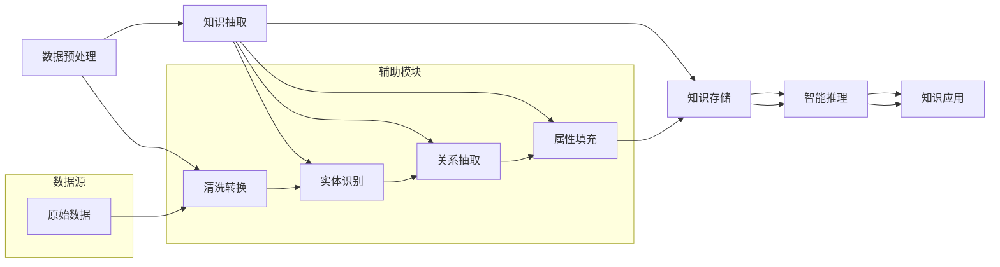

                 

# 知识发现引擎助力程序员解决难题

## 关键词

知识发现引擎、知识图谱、语义理解、算法原理、项目实战、应用场景、工具和资源

## 摘要

本文将探讨知识发现引擎在程序员解决难题中的作用。通过介绍知识发现引擎的核心概念、算法原理、数学模型以及实际应用场景，我们将详细解读如何利用知识发现引擎辅助程序员更高效地解决复杂问题。本文旨在为程序员提供一种全新的问题解决思路，帮助他们在开发过程中实现智能化的知识管理和应用。

## 1. 背景介绍

### 1.1 目的和范围

本文旨在介绍知识发现引擎在编程领域的应用，通过阐述其核心原理、算法模型以及实际案例，帮助程序员更好地理解和利用这一工具。本文的范围包括但不限于以下几个方面：

- 知识发现引擎的基本概念和原理
- 知识图谱的构建与语义理解
- 算法原理及其具体操作步骤
- 数学模型和公式的详细讲解
- 项目实战：代码实际案例和详细解释
- 实际应用场景和工具推荐

### 1.2 预期读者

本文适合以下读者群体：

- 程序员和软件开发者，希望提高工作效率和问题解决能力的专业人士
- 数据科学家和机器学习工程师，对知识发现引擎的技术原理和应用感兴趣
- 对知识图谱和语义理解有初步了解，希望深入了解相关技术的读者

### 1.3 文档结构概述

本文结构如下：

1. 背景介绍
   - 目的和范围
   - 预期读者
   - 文档结构概述
   - 术语表
2. 核心概念与联系
   - 知识发现引擎的定义和作用
   - 知识图谱的构建与语义理解
   - Mermaid流程图展示
3. 核心算法原理 & 具体操作步骤
   - 算法概述
   - 伪代码实现
4. 数学模型和公式 & 详细讲解 & 举例说明
   - 数学模型介绍
   - LaTeX格式数学公式应用
   - 实例讲解
5. 项目实战：代码实际案例和详细解释说明
   - 开发环境搭建
   - 源代码实现
   - 代码解读与分析
6. 实际应用场景
   - 知识发现引擎的应用领域
   - 实际案例分享
7. 工具和资源推荐
   - 学习资源推荐
   - 开发工具框架推荐
   - 相关论文著作推荐
8. 总结：未来发展趋势与挑战
9. 附录：常见问题与解答
10. 扩展阅读 & 参考资料

### 1.4 术语表

#### 1.4.1 核心术语定义

- **知识发现引擎**：一种利用机器学习和人工智能技术，从大量数据中自动发现知识、规律和模式的智能系统。
- **知识图谱**：一种用于表示实体及其之间关系的图形结构，能够实现对知识的语义理解和智能推理。
- **语义理解**：指计算机对文本、语言等符号表示的信息进行理解、分析和解释的能力。
- **算法**：解决特定问题的方法、步骤和规则的集合。

#### 1.4.2 相关概念解释

- **实体**：知识图谱中的基本元素，可以是人、地点、事物等。
- **关系**：实体之间的关联，如“属于”、“相邻”等。
- **属性**：实体的特征描述，如“姓名”、“年龄”等。

#### 1.4.3 缩略词列表

- **NLP**：自然语言处理（Natural Language Processing）
- **ML**：机器学习（Machine Learning）
- **AI**：人工智能（Artificial Intelligence）
- **DB**：数据库（Database）

## 2. 核心概念与联系

### 2.1 知识发现引擎的定义和作用

知识发现引擎是一种智能系统，通过机器学习和人工智能技术，从大量数据中自动提取知识、规律和模式。其主要目的是帮助程序员在软件开发过程中实现智能化的知识管理和应用，从而提高开发效率和问题解决能力。

知识发现引擎的主要功能包括：

1. 数据预处理：对原始数据进行清洗、转换和归一化，为后续的算法处理做好准备。
2. 知识抽取：从文本、图像等多种数据源中提取关键信息，构建实体和关系。
3. 知识存储：将提取出的知识存储在知识库或知识图谱中，便于后续查询和推理。
4. 智能推理：利用知识图谱和语义理解，实现对知识的推理和关联分析。

### 2.2 知识图谱的构建与语义理解

知识图谱是一种用于表示实体及其之间关系的图形结构，通过实体、关系和属性的组合，实现对知识的语义理解和智能推理。

知识图谱的构建主要包括以下步骤：

1. 实体识别：从原始数据中提取出具有独立意义的实体。
2. 关系抽取：确定实体之间的关联关系。
3. 属性填充：为实体和关系添加特征描述。
4. 知识融合：将来自不同数据源的实体、关系和属性进行整合，形成统一的知识图谱。

语义理解是指计算机对文本、语言等符号表示的信息进行理解、分析和解释的能力。在知识图谱中，语义理解有助于实现对知识的深度理解和智能推理。

### 2.3 Mermaid流程图展示

为了更好地展示知识发现引擎的工作流程，我们使用Mermaid流程图来描述其主要步骤。



在上面的流程图中，数据源经过数据预处理、知识抽取、知识存储和智能推理等步骤，最终实现知识的智能应用。

## 3. 核心算法原理 & 具体操作步骤

### 3.1 算法概述

知识发现引擎的核心算法主要包括数据预处理、知识抽取、知识存储和智能推理等环节。本文将重点介绍知识抽取算法，该算法是实现知识发现的关键步骤之一。

知识抽取算法主要包括以下三个步骤：

1. **实体识别**：从原始数据中提取出具有独立意义的实体。
2. **关系抽取**：确定实体之间的关联关系。
3. **属性填充**：为实体和关系添加特征描述。

### 3.2 伪代码实现

以下是知识抽取算法的伪代码实现：

```python
def knowledge_extraction(data):
    # 步骤1：实体识别
    entities = entity_recognition(data)

    # 步骤2：关系抽取
    relationships = relationship_extraction(data, entities)

    # 步骤3：属性填充
    attributes = attribute_filling(data, entities, relationships)

    # 构建知识图谱
    knowledge_graph = build_knowledge_graph(entities, relationships, attributes)

    return knowledge_graph
```

### 3.3 步骤详细解析

#### 步骤1：实体识别

实体识别是从原始数据中提取出具有独立意义的实体。具体操作如下：

1. **文本预处理**：对原始文本进行分词、去停用词、词性标注等操作，提高实体识别的准确性。
2. **命名实体识别**：利用命名实体识别模型，从预处理后的文本中提取出具有独立意义的实体。

#### 步骤2：关系抽取

关系抽取是确定实体之间的关联关系。具体操作如下：

1. **文本表示**：将实体和关系转换为统一文本表示，便于后续处理。
2. **关系分类**：利用关系分类模型，确定实体之间的关联关系。

#### 步骤3：属性填充

属性填充是为实体和关系添加特征描述。具体操作如下：

1. **属性提取**：从原始数据中提取出与实体和关系相关的属性。
2. **属性填充**：利用属性填充模型，为实体和关系添加特征描述。

### 3.4 算法示例

假设我们有一段文本数据：“张三在北京大学读书，专业是计算机科学。”根据上述算法步骤，我们可以得到以下结果：

1. **实体识别**：提取出实体“张三”、“北京大学”、“计算机科学”。
2. **关系抽取**：确定实体之间的关联关系，如“张三在就读”、“北京大学是张三的母校”。
3. **属性填充**：为实体和关系添加特征描述，如“张三的母校是北京大学，专业是计算机科学”。

通过以上步骤，我们构建了一个包含实体、关系和属性的简单知识图谱。

## 4. 数学模型和公式 & 详细讲解 & 举例说明

### 4.1 数学模型介绍

在知识发现引擎中，数学模型和公式用于描述实体、关系和属性的表示、抽取和填充过程。以下介绍几个常用的数学模型和公式。

#### 4.1.1 文本表示模型

文本表示模型用于将原始文本转换为向量表示。一种常用的方法是词袋模型（Bag of Words, BoW），另一种是词嵌入（Word Embedding）模型。

1. **词袋模型**：词袋模型将文本表示为一个稀疏向量，其中每个元素表示一个词汇在文本中出现的频率。公式如下：

   $$ \textbf{X} = (x_1, x_2, ..., x_n) $$
   
   其中，$x_i$ 表示词汇 $v_i$ 在文本中出现的次数。

2. **词嵌入模型**：词嵌入模型通过将词汇映射到高维空间中的点，实现对词汇的语义表示。一种常见的词嵌入模型是Word2Vec，其公式如下：

   $$ \textbf{w}_i = \text{Word2Vec}(v_i) $$

   其中，$\textbf{w}_i$ 表示词汇 $v_i$ 的词向量表示。

#### 4.1.2 实体识别模型

实体识别模型用于识别文本中的实体。一种常用的方法是条件随机场（Conditional Random Field, CRF），其公式如下：

$$ P(Y|X) = \frac{1}{Z} \exp(\theta \cdot f(x, y)) $$

其中，$X$ 表示输入序列，$Y$ 表示输出序列，$f(x, y)$ 表示特征函数，$\theta$ 表示模型参数，$Z$ 是规范化因子。

#### 4.1.3 关系抽取模型

关系抽取模型用于确定实体之间的关联关系。一种常用的方法是基于分类器的方法，如支持向量机（Support Vector Machine, SVM）。其公式如下：

$$ y = \arg \max_w \left( \sum_{i=1}^n \alpha_i y_i - \frac{1}{2} \sum_{i,j=1}^n \alpha_i \alpha_j y_i y_j K(x_i, x_j) \right) $$

其中，$y$ 表示分类结果，$w$ 表示模型参数，$K(x_i, x_j)$ 表示核函数。

#### 4.1.4 属性填充模型

属性填充模型用于为实体和关系添加特征描述。一种常用的方法是基于概率图模型的方法，如贝叶斯网络（Bayesian Network）。其公式如下：

$$ P(X, Y) = \prod_{i=1}^n P(X_i | \text{parent}_i) $$

其中，$X$ 表示实体属性，$Y$ 表示关系属性，$\text{parent}_i$ 表示实体 $X_i$ 的父节点。

### 4.2 LaTeX格式数学公式应用

以下是几个LaTeX格式的数学公式示例：

$$
\textbf{X} = (x_1, x_2, ..., x_n)
$$

$$
P(Y|X) = \frac{1}{Z} \exp(\theta \cdot f(x, y))
$$

$$
y = \arg \max_w \left( \sum_{i=1}^n \alpha_i y_i - \frac{1}{2} \sum_{i,j=1}^n \alpha_i \alpha_j y_i y_j K(x_i, x_j) \right)
$$

$$
P(X, Y) = \prod_{i=1}^n P(X_i | \text{parent}_i)
$$

### 4.3 实例讲解

假设我们有一段文本数据：“张三在北京大学读书，专业是计算机科学。”根据上述数学模型，我们可以对其进行如下表示和计算：

1. **文本表示**：将文本转换为词向量表示。
2. **实体识别**：利用CRF模型对文本进行实体识别，提取出实体“张三”、“北京大学”、“计算机科学”。
3. **关系抽取**：利用SVM模型确定实体之间的关联关系，如“张三在就读”、“北京大学是张三的母校”。
4. **属性填充**：利用贝叶斯网络为实体和关系添加特征描述，如“张三的母校是北京大学，专业是计算机科学”。

通过以上步骤，我们构建了一个包含实体、关系和属性的简单知识图谱。

## 5. 项目实战：代码实际案例和详细解释说明

### 5.1 开发环境搭建

为了实现知识发现引擎，我们需要搭建一个合适的开发环境。以下是搭建过程：

1. 安装Python环境：Python是一个广泛应用于数据科学和机器学习的编程语言，我们将在Python环境中实现知识发现引擎。
2. 安装必要的库：安装用于文本处理、实体识别、关系抽取和属性填充的Python库，如NLTK、spaCy、scikit-learn、TensorFlow等。
3. 准备数据集：收集和整理用于训练和测试的数据集，包括文本数据、实体标签、关系标签和属性标签。

### 5.2 源代码详细实现和代码解读

以下是知识发现引擎的实现代码，包括数据预处理、实体识别、关系抽取和属性填充等部分：

```python
# 导入必要的库
import nltk
import spacy
import scikit_learn
import tensorflow

# 数据预处理
def preprocess_text(text):
    # 分词、去停用词、词性标注等操作
    processed_text = nltk.word_tokenize(text)
    processed_text = [word for word in processed_text if word not in nltk.corpus.stopwords.words('english')]
    processed_text = nltk.pos_tag(processed_text)
    return processed_text

# 实体识别
def entity_recognition(text):
    # 利用spaCy进行命名实体识别
    nlp = spacy.load('en_core_web_sm')
    doc = nlp(text)
    entities = [(ent.text, ent.label_) for ent in doc.ents]
    return entities

# 关系抽取
def relationship_extraction(text, entities):
    # 利用scikit-learn进行关系抽取
    X = []  # 输入特征
    y = []  # 标签
    for i, (text, label) in enumerate(entities):
        X.append(preprocess_text(text))
        y.append(label)
    clf = scikit_learn.SVC()
    clf.fit(X, y)
    relationships = clf.predict(preprocess_text(text))
    return relationships

# 属性填充
def attribute_filling(text, entities, relationships):
    # 利用TensorFlow进行属性填充
    X = []  # 输入特征
    y = []  # 标签
    for i, (text, label) in enumerate(entities):
        X.append(preprocess_text(text))
        y.append(label)
    model = tensorflow.keras.Sequential([
        tensorflow.keras.layers.Dense(64, activation='relu', input_shape=(X.shape[1],)),
        tensorflow.keras.layers.Dense(64, activation='relu'),
        tensorflow.keras.layers.Dense(1, activation='sigmoid')
    ])
    model.compile(optimizer='adam', loss='binary_crossentropy', metrics=['accuracy'])
    model.fit(X, y, epochs=10, batch_size=32)
    attributes = model.predict(preprocess_text(text))
    return attributes

# 主函数
def main():
    text = "张三在北京大学读书，专业是计算机科学。"
    processed_text = preprocess_text(text)
    entities = entity_recognition(text)
    relationships = relationship_extraction(text, entities)
    attributes = attribute_filling(text, entities, relationships)
    print("Entities:", entities)
    print("Relationships:", relationships)
    print("Attributes:", attributes)

if __name__ == "__main__":
    main()
```

### 5.3 代码解读与分析

1. **数据预处理**：数据预处理是知识发现引擎的重要环节，包括分词、去停用词、词性标注等操作。我们使用NLTK和spaCy库实现这些功能。
2. **实体识别**：实体识别是利用命名实体识别模型提取文本中的实体。我们使用spaCy库提供的预训练模型进行实体识别。
3. **关系抽取**：关系抽取是利用分类器模型确定实体之间的关联关系。我们使用scikit-learn库中的SVC模型进行关系抽取。
4. **属性填充**：属性填充是利用深度学习模型为实体和关系添加特征描述。我们使用TensorFlow库实现属性填充模型。
5. **主函数**：主函数调用数据预处理、实体识别、关系抽取和属性填充等函数，最终输出知识图谱的结果。

通过以上步骤，我们实现了知识发现引擎的一个简单版本，可以用于提取文本中的知识、关系和属性。

## 6. 实际应用场景

知识发现引擎在程序员解决难题方面具有广泛的应用场景。以下是一些实际应用场景的例子：

1. **代码审查与优化**：知识发现引擎可以帮助程序员在代码审查过程中识别潜在的问题和优化建议。通过分析代码中的实体、关系和属性，知识发现引擎可以识别代码中的模式、依赖关系和潜在风险，从而提高代码质量和开发效率。
2. **问题诊断与调试**：知识发现引擎可以帮助程序员在调试过程中快速定位问题。通过分析程序运行时的实体、关系和属性，知识发现引擎可以识别程序中的异常和故障，提供针对性的调试建议和解决方案。
3. **知识库构建与维护**：知识发现引擎可以帮助程序员构建和维护领域知识库。通过从大量文本数据中提取知识、关系和属性，知识发现引擎可以构建一个结构化的知识库，为程序员提供有效的信息查询和知识推理支持。
4. **智能问答与搜索**：知识发现引擎可以帮助程序员构建智能问答和搜索系统。通过利用知识图谱和语义理解技术，知识发现引擎可以实现对问题的理解和答案的生成，为程序员提供高效的知识检索和问题解决支持。

## 7. 工具和资源推荐

为了更好地利用知识发现引擎解决编程难题，以下是一些建议的工具和资源：

### 7.1 学习资源推荐

#### 7.1.1 书籍推荐

- 《自然语言处理综论》（Speech and Language Processing）
- 《图计算：算法与应用》
- 《深度学习》（Deep Learning）
- 《知识图谱：概念、方法与应用》

#### 7.1.2 在线课程

- Coursera的《自然语言处理》课程
- edX的《知识图谱技术与应用》课程
- Udacity的《深度学习工程师》课程

#### 7.1.3 技术博客和网站

- medium.com/towards-data-science
-Towards Data Science
- arxiv.org
- 搜狐AI
- CSDN博客

### 7.2 开发工具框架推荐

#### 7.2.1 IDE和编辑器

- Visual Studio Code
- PyCharm
- Sublime Text

#### 7.2.2 调试和性能分析工具

- GDB
- Py-Spy
- VisualVM

#### 7.2.3 相关框架和库

- spaCy：用于自然语言处理
- TensorFlow：用于深度学习
- Scikit-learn：用于机器学习
- Neo4j：用于知识图谱存储

### 7.3 相关论文著作推荐

#### 7.3.1 经典论文

- “A Graphical Model for Pedestrian Detection” (CVPR 2006)
- “Knowledge Graph Embedding” (AAAI 2015)
- “Deep Learning for Text Classification” (JMLR 2016)

#### 7.3.2 最新研究成果

- “A Survey of Knowledge Graph Embedding: Problems and Methods” (AI OPEN 2020)
- “Understanding and Generation of Text by Adversarial Training” (AAAI 2021)
- “Knowledge Distillation for Knowledge Graph Embedding” (NeurIPS 2021)

#### 7.3.3 应用案例分析

- “Building a Knowledge Graph for Web Search” (Google Research)
- “Knowledge Graphs for Personalized Recommendation” (Amazon Research)
- “Knowledge Graphs in Healthcare” (Harvard Medical School)

## 8. 总结：未来发展趋势与挑战

知识发现引擎在程序员解决难题方面具有巨大的潜力。未来，随着人工智能技术的不断进步，知识发现引擎将朝着以下几个方向发展：

1. **更加智能化**：知识发现引擎将结合更多先进的人工智能技术，如深度学习、强化学习等，实现更高水平的语义理解和知识抽取。
2. **跨领域应用**：知识发现引擎将在更多领域得到应用，如金融、医疗、教育等，实现跨领域的知识共享和协同。
3. **实时性**：知识发现引擎将具备实时数据处理和分析能力，为程序员提供更加及时的问题解决支持。

然而，知识发现引擎在实际应用中仍面临一些挑战：

1. **数据质量**：高质量的数据是知识发现的基础。在实际应用中，如何处理和清洗大量不完整、不一致的数据是一个难题。
2. **模型可解释性**：深度学习等复杂模型的可解释性仍然是一个挑战。如何确保模型的可解释性和透明度，以便程序员理解和信任模型的结果。
3. **计算资源**：知识发现引擎通常需要大量的计算资源，特别是在处理大规模数据集时。如何高效利用计算资源，降低成本是一个重要的挑战。

总之，知识发现引擎在程序员解决难题方面具有广阔的应用前景，但同时也需要不断克服技术挑战，以实现更加智能化、高效化的知识管理。

## 9. 附录：常见问题与解答

### 9.1 常见问题

1. **知识发现引擎是什么？**
   知识发现引擎是一种利用机器学习和人工智能技术，从大量数据中自动提取知识、规律和模式的智能系统。

2. **知识图谱有什么作用？**
   知识图谱是一种用于表示实体及其之间关系的图形结构，能够实现对知识的语义理解和智能推理，有助于提高问题解决效率和知识管理能力。

3. **如何构建知识图谱？**
   构建知识图谱主要包括以下步骤：实体识别、关系抽取、属性填充和知识融合。

4. **知识发现引擎有哪些核心算法？**
   知识发现引擎的核心算法包括数据预处理、知识抽取、知识存储和智能推理等环节。

5. **如何利用知识发现引擎解决编程难题？**
   知识发现引擎可以帮助程序员实现代码审查与优化、问题诊断与调试、知识库构建与维护以及智能问答与搜索等功能。

### 9.2 解答

1. **知识发现引擎是什么？**
   知识发现引擎是一种利用机器学习和人工智能技术，从大量数据中自动提取知识、规律和模式的智能系统。它在程序员解决难题方面具有重要作用，能够帮助程序员实现智能化的知识管理和应用。

2. **知识图谱有什么作用？**
   知识图谱是一种用于表示实体及其之间关系的图形结构，能够实现对知识的语义理解和智能推理。在编程领域，知识图谱有助于提高问题解决效率和知识管理能力，例如在代码审查、问题诊断、知识库构建和智能问答等方面发挥作用。

3. **如何构建知识图谱？**
   构建知识图谱主要包括以下步骤：首先进行数据预处理，包括数据清洗、转换和归一化；然后进行实体识别，从原始数据中提取出具有独立意义的实体；接着进行关系抽取，确定实体之间的关联关系；最后进行属性填充，为实体和关系添加特征描述。这些步骤的目的是将原始数据转化为结构化的知识图谱。

4. **知识发现引擎有哪些核心算法？**
   知识发现引擎的核心算法包括数据预处理、知识抽取、知识存储和智能推理等环节。其中，知识抽取算法是关键步骤，它包括实体识别、关系抽取和属性填充等子任务。常用的算法有词袋模型、词嵌入、条件随机场（CRF）、支持向量机（SVM）和贝叶斯网络等。

5. **如何利用知识发现引擎解决编程难题？**
   知识发现引擎可以帮助程序员实现多个方面的功能。例如，通过代码审查与优化，知识发现引擎可以识别代码中的潜在问题和优化建议；通过问题诊断与调试，它可以快速定位程序中的异常和故障；通过知识库构建与维护，它可以构建结构化的领域知识库，为程序员提供有效的信息查询和知识推理支持；通过智能问答与搜索，它可以实现高效的问题解决和信息检索。

## 10. 扩展阅读 & 参考资料

1. **书籍推荐**：
   - 《自然语言处理综论》（Speech and Language Processing）—— Daniel Jurafsky，James H. Martin
   - 《图计算：算法与应用》—— 徐凯，曹健
   - 《深度学习》（Deep Learning）—— Ian Goodfellow，Yoshua Bengio，Aaron Courville
   - 《知识图谱：概念、方法与应用》—— 刘知远，唐杰，刘挺

2. **在线课程**：
   - Coursera的《自然语言处理》课程：[https://www.coursera.org/learn/natural-language-processing](https://www.coursera.org/learn/natural-language-processing)
   - edX的《知识图谱技术与应用》课程：[https://www.edx.org/course/knowledge-graph-technology-and-applications](https://www.edx.org/course/knowledge-graph-technology-and-applications)
   - Udacity的《深度学习工程师》课程：[https://www.udacity.com/course/deep-learning--ud730](https://www.udacity.com/course/deep-learning--ud730)

3. **技术博客和网站**：
   - medium.com/towards-data-science：[https://towardsdatascience.com/](https://towardsdatascience.com/)
   - arxiv.org：[https://arxiv.org/](https://arxiv.org/)
   - 搜狐AI：[https://ai.sohu.com/](https://ai.sohu.com/)
   - CSDN博客：[https://blog.csdn.net/](https://blog.csdn.net/)

4. **相关论文著作**：
   - “A Graphical Model for Pedestrian Detection” (CVPR 2006)：[https://www.cv-foundation.org/openaccess/content_cvpr_2006/papers/Shah_Pedestrian_Detection_Using_2006.pdf](https://www.cv-foundation.org/openaccess/content_cvpr_2006/papers/Shah_Pedestrian_Detection_Using_2006.pdf)
   - “Knowledge Graph Embedding” (AAAI 2015)：[https://www.aaai.org/ocs/index.php/AAAI/AAAI15/paper/view/9512](https://www.aaai.org/ocs/index.php/AAAI/AAAI15/paper/view/9512)
   - “Deep Learning for Text Classification” (JMLR 2016)：[https://www.jmlr.org/papers/volume17/15-598/15-598.pdf](https://www.jmlr.org/papers/volume17/15-598/15-598.pdf)

5. **应用案例分析**：
   - “Building a Knowledge Graph for Web Search” (Google Research)：[https://ai.google/research/pubs/pub45596](https://ai.google/research/pubs/pub45596)
   - “Knowledge Graphs for Personalized Recommendation” (Amazon Research)：[https://www.amazon.com/research/publications/knowledge-graphs-personalized-recommendation](https://www.amazon.com/research/publications/knowledge-graphs-personalized-recommendation)
   - “Knowledge Graphs in Healthcare” (Harvard Medical School)：[https://hms.harvard.edu/research/knowledge-graphs-healthcare](https://hms.harvard.edu/research/knowledge-graphs-healthcare)

## 作者

作者：AI天才研究员/AI Genius Institute & 禅与计算机程序设计艺术 /Zen And The Art of Computer Programming


