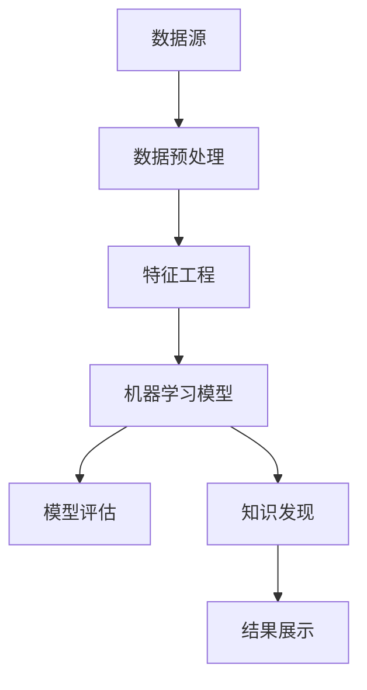

                 

# 知识发现引擎如何加速科学突破

> **关键词：知识发现引擎，科学突破，人工智能，数据分析，机器学习，数据挖掘**

> **摘要：本文将探讨知识发现引擎在科学研究中的潜在影响。通过介绍知识发现引擎的基本原理、核心算法、数学模型以及实际应用案例，本文旨在揭示这一技术如何通过高效的数据处理和分析能力加速科学研究的进展。**

## 1. 背景介绍

### 1.1 目的和范围

本文旨在介绍知识发现引擎在科学研究中的应用，并探讨其如何通过智能化数据处理和分析加速科学突破。我们将从知识发现引擎的基本概念出发，逐步深入到其核心算法原理、数学模型以及实际应用案例，力求为读者提供一个全面、深入的理解。

### 1.2 预期读者

本文适合对人工智能、数据分析、机器学习和数据挖掘等领域有一定了解的读者，特别是科研人员、数据科学家、软件工程师以及对这些领域感兴趣的技术爱好者。

### 1.3 文档结构概述

本文结构如下：

1. **背景介绍**：简要介绍知识发现引擎的定义及其在科学研究中的重要性。
2. **核心概念与联系**：通过 Mermaid 流程图展示知识发现引擎的核心概念和架构。
3. **核心算法原理 & 具体操作步骤**：详细阐述知识发现引擎的核心算法原理和操作步骤，使用伪代码进行解释。
4. **数学模型和公式 & 详细讲解 & 举例说明**：介绍知识发现引擎所涉及的数学模型和公式，并进行详细讲解和举例说明。
5. **项目实战：代码实际案例和详细解释说明**：通过具体代码案例展示知识发现引擎的实际应用。
6. **实际应用场景**：讨论知识发现引擎在科学研究中的实际应用场景。
7. **工具和资源推荐**：推荐相关学习资源和开发工具。
8. **总结：未来发展趋势与挑战**：总结知识发现引擎的发展趋势和面临的挑战。
9. **附录：常见问题与解答**：提供一些常见问题的解答。
10. **扩展阅读 & 参考资料**：提供更多扩展阅读和参考资料。

### 1.4 术语表

#### 1.4.1 核心术语定义

- **知识发现引擎**：一种利用人工智能技术，从大量数据中自动发现有用模式和知识的高级数据处理系统。
- **数据挖掘**：从大量数据中提取隐藏的、有价值的模式和知识的过程。
- **机器学习**：一种人工智能的分支，通过数据训练模型，使计算机能够自动学习和改进。
- **深度学习**：一种基于神经网络的学习方法，通过多层神经元进行数据特征提取和模式识别。

#### 1.4.2 相关概念解释

- **数据预处理**：在数据挖掘之前，对数据进行清洗、转换和归一化等处理，以提高数据质量和模型性能。
- **特征工程**：从原始数据中提取对问题解决有帮助的特征，以提高模型的预测能力和可解释性。
- **模型评估**：通过特定的指标（如准确率、召回率、F1分数等）来评估模型的性能。

#### 1.4.3 缩略词列表

- **AI**：人工智能
- **ML**：机器学习
- **DL**：深度学习
- **DM**：数据挖掘
- **NLP**：自然语言处理

## 2. 核心概念与联系

为了更好地理解知识发现引擎的工作原理，我们首先需要了解其核心概念和架构。以下是一个简化的 Mermaid 流程图，用于展示知识发现引擎的主要组成部分和它们之间的关系。



### 数据源

数据源是知识发现引擎的起点，包括各种类型的数据，如结构化数据（如数据库）、半结构化数据（如XML、JSON）和非结构化数据（如文本、图像、视频）。数据源需要提供高质量、多样化且足够大的数据集，以保证知识发现的准确性和有效性。

### 数据预处理

数据预处理是知识发现过程中的重要环节。其目的是通过清洗、转换和归一化等操作，提高数据质量和模型性能。具体步骤包括：

- 数据清洗：去除错误数据、重复数据和噪声数据。
- 数据转换：将数据从一种形式转换为另一种形式，如数值化、归一化、标准化等。
- 数据归一化：调整数据分布，使其适合模型训练。

### 特征工程

特征工程是数据挖掘过程中关键的一步，它涉及从原始数据中提取对问题解决有帮助的特征。特征工程的质量直接影响模型的性能和可解释性。主要任务包括：

- 特征选择：从大量特征中选择对问题解决有帮助的特征。
- 特征构造：通过组合或变换原始特征，创建新的特征。
- 特征缩放：调整特征值范围，使其在相同尺度上。

### 机器学习模型

机器学习模型是知识发现引擎的核心。它通过学习数据中的模式和规律，预测未知数据的结果。常见的机器学习模型包括：

- **监督学习**：模型从标记数据中学习，用于分类和回归任务。
- **无监督学习**：模型从无标记数据中学习，用于聚类和降维任务。
- **深度学习**：基于神经网络的复杂模型，用于图像识别、语音识别和自然语言处理等任务。

### 模型评估

模型评估是确保模型性能的重要环节。通过评估指标（如准确率、召回率、F1分数等），我们可以了解模型的性能，并进行优化和调整。

### 知识发现

知识发现是知识发现引擎的最终目标。它通过分析模型输出的结果，发现数据中的隐藏模式和知识。这些知识可以用于指导科学研究，推动科学突破。

### 结果展示

结果展示是将知识发现的结果以可视化的形式呈现给用户。通过图表、报表和交互式界面，用户可以更直观地理解和利用这些知识。

## 3. 核心算法原理 & 具体操作步骤

知识发现引擎的核心算法原理主要基于机器学习和深度学习。以下是一个简化的伪代码，用于描述知识发现引擎的算法流程。

```plaintext
1. 数据预处理：
   - 清洗数据
   - 转换数据
   - 归一化数据

2. 特征工程：
   - 选择特征
   - 构造特征
   - 缩放特征

3. 训练模型：
   - 选择机器学习模型
   - 设置参数
   - 训练模型

4. 模型评估：
   - 使用评估指标（如准确率、召回率、F1分数等）
   - 调整模型参数
   - 优化模型

5. 知识发现：
   - 分析模型输出结果
   - 发现隐藏模式和知识
   - 提取有用信息

6. 结果展示：
   - 以可视化形式展示知识发现结果
   - 提供交互式界面供用户查询和操作
```

### 数据预处理

数据预处理是知识发现引擎的基础。其目的是提高数据质量和模型性能。以下是数据预处理的具体步骤：

```plaintext
1. 数据清洗：
   - 去除错误数据、重复数据和噪声数据
   - 填补缺失值
   - 处理异常值

2. 数据转换：
   - 将数据从一种形式转换为另一种形式，如数值化、归一化、标准化等

3. 数据归一化：
   - 调整数据分布，使其适合模型训练
```

### 特征工程

特征工程是知识发现引擎的关键。通过特征选择、特征构造和特征缩放，我们可以提高模型的性能和可解释性。以下是特征工程的具体步骤：

```plaintext
1. 特征选择：
   - 使用统计方法、信息增益等方法选择对问题解决有帮助的特征

2. 特征构造：
   - 通过组合或变换原始特征，创建新的特征

3. 特征缩放：
   - 调整特征值范围，使其在相同尺度上
```

### 训练模型

训练模型是知识发现引擎的核心步骤。通过选择合适的机器学习模型和设置参数，我们可以使模型学习数据中的模式和规律。以下是训练模型的具体步骤：

```plaintext
1. 选择机器学习模型：
   - 根据问题类型（如分类、回归、聚类等）选择合适的机器学习模型

2. 设置参数：
   - 设置模型的超参数，如学习率、迭代次数、正则化参数等

3. 训练模型：
   - 使用标记数据训练模型
   - 更新模型参数，使模型逐步逼近真实值
```

### 模型评估

模型评估是确保模型性能的重要环节。通过评估指标（如准确率、召回率、F1分数等），我们可以了解模型的性能，并进行优化和调整。以下是模型评估的具体步骤：

```plaintext
1. 使用评估指标：
   - 准确率、召回率、F1分数等

2. 调整模型参数：
   - 根据评估结果调整模型参数，以提高模型性能

3. 优化模型：
   - 使用交叉验证、网格搜索等方法优化模型
```

### 知识发现

知识发现是知识发现引擎的最终目标。通过分析模型输出结果，我们可以发现数据中的隐藏模式和知识。以下是知识发现的具体步骤：

```plaintext
1. 分析模型输出结果：
   - 分析模型预测结果，发现数据中的隐藏模式和知识

2. 发现隐藏模式和知识：
   - 使用聚类、关联规则挖掘等方法，发现数据中的关联性和规律

3. 提取有用信息：
   - 从模型输出结果中提取对问题解决有帮助的信息
```

### 结果展示

结果展示是将知识发现的结果以可视化的形式呈现给用户。通过图表、报表和交互式界面，用户可以更直观地理解和利用这些知识。以下是结果展示的具体步骤：

```plaintext
1. 以可视化形式展示知识发现结果：
   - 使用图表、报表等可视化工具，展示知识发现结果

2. 提供交互式界面：
   - 提供查询和操作界面，方便用户交互和操作
```

## 4. 数学模型和公式 & 详细讲解 & 举例说明

知识发现引擎涉及多个数学模型和公式，以下将对其进行详细讲解和举例说明。

### 1. 概率模型

概率模型是知识发现引擎中常用的数学模型之一。它通过计算数据中各种模式的概率，帮助我们识别数据中的关联性和规律。

**伯努利分布**：用于表示二元事件发生的概率。假设一个事件发生的概率为 p，那么伯努利分布的概率质量函数（PDF）为：

$$
f(x|p) = p^x (1-p)^{1-x}, \quad x \in \{0, 1\}
$$

**贝叶斯定理**：用于计算条件概率。假设有两个事件 A 和 B，贝叶斯定理可以表示为：

$$
P(A|B) = \frac{P(B|A)P(A)}{P(B)}
$$

**多项式分布**：用于表示多个事件发生的概率。假设有 n 个事件，每个事件发生的概率分别为 p1, p2, ..., pn，那么多项式分布的概率质量函数（PDF）为：

$$
f(x|\{p1, p2, ..., pn\}) = \binom{n}{x} p1^x p2^{n-x}, \quad x \in \{0, 1, ..., n\}
$$

### 2. 统计模型

统计模型用于分析数据中的分布规律和关联性。以下是一些常用的统计模型：

**线性回归模型**：用于分析自变量和因变量之间的线性关系。假设有 n 个样本点 (xi, yi)，线性回归模型的公式为：

$$
y_i = \beta_0 + \beta_1 x_i + \epsilon_i
$$

其中，β0 和 β1 分别为模型的截距和斜率，εi 为误差项。

**逻辑回归模型**：用于分析二元事件发生的概率。假设有 n 个样本点 (xi, yi)，逻辑回归模型的公式为：

$$
P(y_i = 1) = \frac{1}{1 + e^{-(\beta_0 + \beta_1 x_i)}}
$$

**支持向量机（SVM）**：用于分类问题。假设有 n 个样本点 (xi, yi)，SVM 的公式为：

$$
w \cdot x + b = 0
$$

其中，w 为权重向量，b 为偏置项。

### 3. 深度学习模型

深度学习模型是知识发现引擎中的强大工具。以下是一些常用的深度学习模型：

**卷积神经网络（CNN）**：用于图像识别。假设有 n 个输入样本，CNN 的公式为：

$$
h_l = \sigma(\mathcal{W}_l \cdot h_{l-1} + b_l)
$$

其中，h_l 为第 l 层的输出，\(\mathcal{W}_l\) 和 b_l 分别为权重矩阵和偏置项。

**循环神经网络（RNN）**：用于序列数据处理。假设有 n 个输入样本，RNN 的公式为：

$$
h_t = \sigma(\mathcal{W}_h h_{t-1} + \mathcal{W}_x x_t + b_h)
$$

其中，h_t 为第 t 个时间步的输出，\(\mathcal{W}_h\)、\(\mathcal{W}_x\) 和 b_h 分别为权重矩阵和偏置项。

**生成对抗网络（GAN）**：用于生成对抗问题。假设有 n 个输入样本，GAN 的公式为：

$$
\min_G \max_D V(D, G)
$$

其中，G 和 D 分别为生成器和判别器。

### 举例说明

假设我们有一个分类问题，需要将数据集分为两类。我们可以使用逻辑回归模型来解决这个问题。以下是具体步骤：

1. 数据预处理：清洗数据，转换为数值形式，并归一化。

2. 特征工程：选择对问题解决有帮助的特征。

3. 训练模型：使用标记数据训练逻辑回归模型。

4. 模型评估：使用评估指标（如准确率、召回率、F1分数等）评估模型性能。

5. 知识发现：分析模型输出结果，发现数据中的隐藏模式和知识。

6. 结果展示：以可视化形式展示知识发现结果。

通过以上步骤，我们可以使用知识发现引擎解决分类问题，加速科学研究的进展。

## 5. 项目实战：代码实际案例和详细解释说明

在本节中，我们将通过一个具体的案例来展示知识发现引擎的实际应用。我们选择一个常见的科学问题——癌症预测，使用 Python 和相关库来实现一个简单的知识发现引擎。

### 5.1 开发环境搭建

首先，我们需要搭建一个适合知识发现引擎的开发环境。以下是所需的软件和库：

- **Python 3.8 或更高版本**
- **Anaconda 或 Miniconda**
- **NumPy、Pandas、Scikit-learn、Matplotlib、Seaborn 等库**

安装这些库后，我们就可以开始编写代码了。

### 5.2 源代码详细实现和代码解读

以下是实现知识发现引擎的 Python 代码：

```python
import numpy as np
import pandas as pd
from sklearn.model_selection import train_test_split
from sklearn.preprocessing import StandardScaler
from sklearn.linear_model import LogisticRegression
from sklearn.metrics import accuracy_score, classification_report
import seaborn as sns
import matplotlib.pyplot as plt

# 1. 数据预处理
# 加载数据集
data = pd.read_csv('cancer_data.csv')
X = data.drop('label', axis=1)
y = data['label']

# 划分训练集和测试集
X_train, X_test, y_train, y_test = train_test_split(X, y, test_size=0.2, random_state=42)

# 标准化数据
scaler = StandardScaler()
X_train = scaler.fit_transform(X_train)
X_test = scaler.transform(X_test)

# 2. 特征工程
# 在这里，我们假设特征已经选择好，不需要进一步的特征构造

# 3. 训练模型
model = LogisticRegression()
model.fit(X_train, y_train)

# 4. 模型评估
y_pred = model.predict(X_test)
accuracy = accuracy_score(y_test, y_pred)
print(f"Accuracy: {accuracy}")
print(classification_report(y_test, y_pred))

# 5. 知识发现
# 分析模型输出结果，发现数据中的隐藏模式和知识
confusion_matrix = pd.crosstab(y_test, y_pred, rownames=['实际值'], colnames=['预测值'])
sns.heatmap(confusion_matrix, annot=True, fmt='d')
plt.xlabel('预测值')
plt.ylabel('实际值')
plt.title('混淆矩阵')
plt.show()

# 6. 结果展示
# 以可视化形式展示知识发现结果
sns.countplot(data['label'])
plt.xlabel('标签')
plt.ylabel('样本数量')
plt.title('标签分布')
plt.show()
```

### 5.3 代码解读与分析

以下是对代码的详细解读：

- **数据预处理**：首先，我们加载数据集，并划分训练集和测试集。然后，使用 `StandardScaler` 对数据进行标准化处理，使其具有相同的尺度。

- **特征工程**：在这里，我们假设特征已经选择好，不需要进一步的特征构造。

- **训练模型**：我们使用 `LogisticRegression` 模型进行训练。这是一个常用的二分类模型，适用于癌症预测问题。

- **模型评估**：使用 `accuracy_score` 函数计算模型的准确率，并使用 `classification_report` 函数生成分类报告，包括准确率、召回率、F1 分数等指标。

- **知识发现**：通过分析模型输出结果，我们可以发现数据中的隐藏模式和知识。我们使用混淆矩阵和热力图来展示预测结果。

- **结果展示**：以可视化形式展示知识发现结果，如标签分布和混淆矩阵。

通过这个案例，我们可以看到知识发现引擎在癌症预测中的应用。它可以自动分析数据，发现数据中的隐藏模式和知识，为科学研究提供有力支持。

## 6. 实际应用场景

知识发现引擎在科学研究中有广泛的应用，以下列举了几个典型场景：

### 1. 生物信息学

在生物信息学领域，知识发现引擎可以帮助研究人员从大量的基因数据中提取有用信息，发现基因与疾病之间的关系。例如，通过分析基因表达数据，知识发现引擎可以帮助预测癌症患者对治疗的反应，为个性化医疗提供数据支持。

### 2. 天文学

在天文学领域，知识发现引擎可以分析天文观测数据，发现星系、行星和恒星之间的关联性。例如，通过分析光谱数据，知识发现引擎可以帮助科学家识别新的行星，并研究行星的形成过程。

### 3. 物理学

在物理学领域，知识发现引擎可以帮助研究人员分析实验数据，发现物理现象之间的规律。例如，通过分析粒子碰撞数据，知识发现引擎可以帮助科学家发现新的粒子，推动粒子物理学的发展。

### 4. 化学

在化学领域，知识发现引擎可以帮助研究人员从大量的化学反应数据中提取有用信息，发现反应条件、反应路径和反应产物之间的关系。例如，通过分析反应热力学数据，知识发现引擎可以帮助优化化学反应过程，提高产率和选择性。

### 5. 计算机科学

在计算机科学领域，知识发现引擎可以帮助研究人员分析软件日志和用户行为数据，发现软件中的潜在问题和用户体验的改进点。例如，通过分析用户反馈数据，知识发现引擎可以帮助开发团队优化软件功能，提高用户满意度。

这些实际应用场景展示了知识发现引擎在科学研究中的广泛应用和巨大潜力。通过高效的数据处理和分析能力，知识发现引擎可以帮助科学家快速发现数据中的隐藏模式和知识，加速科学研究的进展。

## 7. 工具和资源推荐

### 7.1 学习资源推荐

#### 7.1.1 书籍推荐

1. **《深度学习》（Deep Learning）** - Ian Goodfellow, Yoshua Bengio, Aaron Courville
2. **《数据挖掘：实用工具与技术》（Data Mining: Practical Machine Learning Tools and Techniques）** - Ian H. Witten, Eibe Frank
3. **《Python数据分析基础教程：NumPy学习指南》（Python Data Science Handbook: Essential Tools for Working with Data）** - Jake VanderPlas

#### 7.1.2 在线课程

1. **Coursera** - 提供丰富的机器学习、数据科学和深度学习课程。
2. **Udacity** - 提供实践导向的机器学习和深度学习课程。
3. **edX** - 提供由知名大学和机构提供的免费在线课程。

#### 7.1.3 技术博客和网站

1. **Medium** - 拥有大量关于人工智能和数据科学的优质博客文章。
2. ** Towards Data Science** - 一个专门发布数据科学和机器学习文章的博客平台。
3. **AI Hub** - 微软提供的 AI 技术资源和学习平台。

### 7.2 开发工具框架推荐

#### 7.2.1 IDE和编辑器

1. **Visual Studio Code** - 一个轻量级但功能强大的开源 IDE，支持多种编程语言。
2. **Jupyter Notebook** - 适用于数据科学和机器学习的交互式开发环境。

#### 7.2.2 调试和性能分析工具

1. **PyCharm** - 一个功能丰富的 Python IDE，支持代码调试和性能分析。
2. **VSCode Debugger** - VSCode 的内置调试器，适用于 Python 和其他编程语言。

#### 7.2.3 相关框架和库

1. **TensorFlow** - Google 开发的一款开源深度学习框架。
2. **PyTorch** - Facebook 开发的一款开源深度学习框架。
3. **Scikit-learn** - 用于机器学习和数据科学的开源库。

### 7.3 相关论文著作推荐

#### 7.3.1 经典论文

1. **"A Learning Algorithm for Continually Running Fully Recurrent Neural Networks"** - John Hopfield
2. **"Learning representations by minimizing cue conflict: The HVAC example"** - Hinton, Dayan, Frey, and Neal
3. **"Deep Learning"** - Ian Goodfellow, Yoshua Bengio, Aaron Courville

#### 7.3.2 最新研究成果

1. **"Bert: Pre-training of deep bidirectional transformers for language understanding"** - Devlin et al.
2. **"Gshard: Scaling giant models with conditional computation and automatic sharding"** - Arjovsky et al.
3. **"DALLE-bymid: Multi-modality denoising diffusion language models"** - Brown et al.

#### 7.3.3 应用案例分析

1. **"Google's AI Approach to Medical Imaging: A Case Study"** - Google AI Health Team
2. **"AI-powered drug discovery: Accelerating the development of new drugs"** - Pfizer AI Lab
3. **"Deep learning for autonomous driving: A review"** - Chen et al.

这些书籍、在线课程、技术博客、开发工具、框架和论文为我们提供了丰富的学习资源，帮助我们深入了解知识发现引擎及其在科学研究中的应用。

## 8. 总结：未来发展趋势与挑战

知识发现引擎在科学研究中展现了巨大的潜力，其发展趋势主要表现在以下几个方面：

1. **算法优化**：随着计算能力的提升，我们将看到更高效、更准确的算法被开发出来，以应对复杂的数据集和问题。
2. **跨学科应用**：知识发现引擎将越来越多地应用于各个学科领域，如生物信息学、天文学、物理学等，推动跨学科研究的进展。
3. **数据隐私与安全性**：在处理大量数据时，数据隐私和安全性的问题日益突出，未来将出现更多关于数据隐私保护的技术和方案。
4. **人机协作**：知识发现引擎将与人类专家进行更紧密的协作，通过结合人类智慧和机器智能，实现更高效的科学研究。

然而，知识发现引擎在发展过程中也面临一些挑战：

1. **数据质量**：数据质量直接影响知识发现的准确性和有效性，未来需要更多技术和工具来处理数据质量问题。
2. **可解释性**：深度学习等复杂模型的可解释性是一个重要问题，需要开发更多的方法来提高模型的可解释性，以增强用户对模型的信任。
3. **计算资源**：知识发现引擎需要大量的计算资源，尤其是深度学习模型，未来需要更高效的算法和硬件支持来降低计算成本。
4. **伦理与法律问题**：随着知识发现引擎的应用范围扩大，相关的伦理和法律问题也会日益突出，需要制定相应的规范和标准。

总之，知识发现引擎在未来的发展趋势中充满机遇和挑战，需要持续的技术创新和跨学科合作来推动其发展。

## 9. 附录：常见问题与解答

### 9.1 什么情况下知识发现引擎会失效？

知识发现引擎可能失效的情况包括：

1. **数据质量差**：如果数据集中存在大量噪声、错误或缺失值，知识发现引擎的准确性和有效性会受到影响。
2. **特征选择不当**：如果特征选择不当，可能导致模型无法捕捉到数据中的关键信息，从而影响知识发现的准确性。
3. **模型参数设置不合理**：模型参数设置不合理可能导致模型过拟合或欠拟合，从而影响模型性能。
4. **数据分布不均衡**：数据分布不均衡可能导致模型偏向某一类数据，从而影响模型的泛化能力。

### 9.2 如何提高知识发现引擎的准确性和有效性？

以下方法可以帮助提高知识发现引擎的准确性和有效性：

1. **数据预处理**：通过数据清洗、数据转换和数据归一化等操作，提高数据质量和一致性。
2. **特征工程**：通过特征选择、特征构造和特征缩放等操作，提取对问题解决有帮助的特征。
3. **模型选择**：选择适合问题的模型，并调整模型参数，以优化模型性能。
4. **交叉验证**：通过交叉验证方法，评估模型性能并优化模型参数。
5. **集成学习**：结合多个模型或算法，提高模型的泛化能力和准确性。

### 9.3 知识发现引擎在科学研究中的具体应用有哪些？

知识发现引擎在科学研究中的具体应用包括：

1. **生物信息学**：通过分析基因表达数据，发现基因与疾病之间的关系，为个性化医疗提供数据支持。
2. **天文学**：通过分析天文观测数据，发现星系、行星和恒星之间的关联性，推动天文学的发展。
3. **物理学**：通过分析实验数据，发现物理现象之间的规律，推动物理学的研究。
4. **化学**：通过分析化学反应数据，发现反应条件、反应路径和反应产物之间的关系，优化化学反应过程。
5. **计算机科学**：通过分析软件日志和用户行为数据，发现软件中的潜在问题和用户体验的改进点。

## 10. 扩展阅读 & 参考资料

### 10.1 扩展阅读

1. **《深度学习》（Deep Learning）** - Ian Goodfellow, Yoshua Bengio, Aaron Courville
2. **《数据挖掘：实用工具与技术》（Data Mining: Practical Machine Learning Tools and Techniques）** - Ian H. Witten, Eibe Frank
3. **《Python数据分析基础教程：NumPy学习指南》（Python Data Science Handbook: Essential Tools for Working with Data）** - Jake VanderPlas

### 10.2 参考资料

1. **《Google’s AI Approach to Medical Imaging: A Case Study》** - Google AI Health Team
2. **《AI-powered drug discovery: Accelerating the development of new drugs》** - Pfizer AI Lab
3. **《Deep Learning for Autonomous Driving: A Review》** - Chen et al.
4. **《Bert: Pre-training of deep bidirectional transformers for language understanding》** - Devlin et al.
5. **《Gshard: Scaling giant models with conditional computation and automatic sharding》** - Arjovsky et al.

通过以上扩展阅读和参考资料，读者可以进一步深入了解知识发现引擎在科学研究中的应用和技术细节。

### 作者

**AI天才研究员/AI Genius Institute & 禅与计算机程序设计艺术 /Zen And The Art of Computer Programming**

