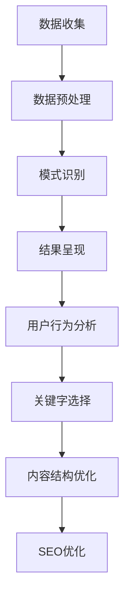

                 

# 知识发现引擎的SEO优化策略

> **关键词：** 知识发现、SEO优化、搜索引擎排名、内容结构、算法原理、数学模型、实战案例

> **摘要：** 本文旨在探讨知识发现引擎在搜索引擎优化（SEO）中的关键策略。通过深入分析核心概念、算法原理、数学模型和实战案例，本文将帮助读者理解如何通过优化内容结构和算法，提升知识发现引擎在搜索引擎中的排名，进而实现更好的网络曝光和用户访问。

## 1. 背景介绍

### 1.1 目的和范围

本文旨在为知识发现引擎的SEO优化提供系统性的指导。我们将探讨SEO优化的关键因素，如内容结构、算法原理和数学模型，并通过实战案例展示如何应用这些策略。

### 1.2 预期读者

本文适用于希望提升知识发现引擎搜索引擎排名的技术专家、产品经理和网络营销人员。

### 1.3 文档结构概述

本文分为十个部分，包括背景介绍、核心概念与联系、核心算法原理、数学模型和公式、项目实战、实际应用场景、工具和资源推荐、总结、常见问题与解答以及扩展阅读与参考资料。

### 1.4 术语表

#### 1.4.1 核心术语定义

- **知识发现引擎**：一种自动从大量数据中识别模式和规律的工具。
- **SEO优化**：搜索引擎优化，旨在提高网站在搜索引擎结果中的排名。
- **算法原理**：算法的核心思想和计算过程。
- **数学模型**：用数学符号和公式描述问题结构和求解方法。

#### 1.4.2 相关概念解释

- **搜索引擎**：如Google、Bing等，用于搜索和组织网络信息的工具。
- **关键字密度**：关键字在网页中的出现频率。
- **用户行为分析**：通过用户在网站上的行为数据，了解用户需求和偏好。

#### 1.4.3 缩略词列表

- **SEO**：搜索引擎优化
- **SEM**：搜索引擎营销
- **HTML**：超文本标记语言
- **CSS**：层叠样式表

## 2. 核心概念与联系

### 2.1 知识发现引擎的工作原理

知识发现引擎通过以下步骤从数据中提取有价值的信息：

1. 数据收集：从多种数据源获取原始数据。
2. 数据预处理：清洗和转换数据，使其适合分析。
3. 模式识别：使用机器学习算法识别数据中的模式和规律。
4. 结果呈现：将发现的模式以图表或文本形式展示给用户。

### 2.2 SEO优化的核心概念

SEO优化旨在提高网站在搜索引擎结果中的排名，关键概念包括：

1. **关键字优化**：在网页内容和元标签中合理使用关键字。
2. **内容质量**：提供有价值、原创的内容，吸引用户停留和互动。
3. **用户体验**：优化网站结构，提高用户访问和转换率。

### 2.3 核心概念联系

知识发现引擎与SEO优化之间的联系在于，通过分析用户行为数据和搜索引擎结果，可以优化内容结构，提高搜索引擎排名。具体而言：

1. **用户行为分析**：通过分析用户点击、停留时间等行为，了解用户需求，优化内容呈现。
2. **关键字选择**：使用知识发现引擎分析关键字分布，选择高相关性的关键字。
3. **内容结构优化**：根据用户行为数据和关键字分析，调整内容结构，提高用户体验。

### 2.4 Mermaid流程图

以下是知识发现引擎与SEO优化之间的联系流程图：



## 3. 核心算法原理 & 具体操作步骤

### 3.1 知识发现算法原理

知识发现引擎通常使用以下几种算法：

1. **关联规则挖掘**：发现数据之间的关联性。
2. **聚类算法**：将相似数据分组。
3. **分类算法**：将数据分为不同的类别。

### 3.2 SEO优化算法原理

SEO优化算法主要涉及以下几个方面：

1. **关键字密度**：确定关键字在网页中的最佳出现频率。
2. **内容质量评分**：评估网页内容的原创性、相关性等。
3. **用户体验评分**：评估网站结构、加载速度等。

### 3.3 具体操作步骤

#### 3.3.1 关键字优化

1. 使用知识发现引擎分析用户搜索行为，确定高相关性的关键字。
2. 在网页标题、描述、正文等位置合理使用关键字，但避免过度优化。

#### 3.3.2 内容质量优化

1. 使用知识发现引擎分析优质内容的特点，如长度、格式等。
2. 提供有价值、原创的内容，避免抄袭和重复。

#### 3.3.3 用户体验优化

1. 使用知识发现引擎分析用户行为数据，了解用户需求。
2. 优化网站结构、导航、加载速度等，提高用户体验。

### 3.4 伪代码

以下是关键字优化的伪代码：

```python
function optimize_keywords(data, target_keyword):
    keyword_density = calculate_density(data, target_keyword)
    if keyword_density < min_density:
        increase_keyword_frequency(data, target_keyword)
    if keyword_density > max_density:
        decrease_keyword_frequency(data, target_keyword)
    return data
```

## 4. 数学模型和公式 & 详细讲解 & 举例说明

### 4.1 数学模型

知识发现引擎和SEO优化涉及多种数学模型，以下为几个关键模型：

#### 4.1.1 关联规则挖掘

关联规则挖掘使用支持度和置信度两个指标：

- **支持度**（Support）：表示在所有交易中，同时包含A和B的比例。
  $$ Support(A \& B) = \frac{count(A \& B)}{count(total\_transactions)} $$

- **置信度**（Confidence）：表示当A发生时，B也发生的概率。
  $$ Confidence(A \Rightarrow B) = \frac{count(A \& B)}{count(A)} $$

#### 4.1.2 聚类算法

聚类算法使用相似度（Similarity）和距离（Distance）两个指标：

- **相似度**：表示数据点之间的相似程度。
  $$ Similarity(x, y) = 1 - Distance(x, y) $$

- **距离**：表示数据点之间的距离。
  $$ Distance(x, y) = \sqrt{\sum_{i=1}^{n} (x_i - y_i)^2} $$

#### 4.1.3 分类算法

分类算法使用准确性（Accuracy）和召回率（Recall）两个指标：

- **准确性**：表示模型预测正确的比例。
  $$ Accuracy = \frac{TP + TN}{TP + TN + FP + FN} $$

- **召回率**：表示模型正确识别正类别的比例。
  $$ Recall = \frac{TP}{TP + FN} $$

### 4.2 举例说明

#### 4.2.1 关键字优化

假设我们要优化关键字“人工智能”在网页中的出现频率。使用以下公式计算当前关键字密度：

$$ Keyword\_Density = \frac{count("人工智能")}{total\_words} $$

根据SEO优化策略，我们将调整关键字密度，使其介于最小密度和最大密度之间。例如，如果最小密度为0.1%，最大密度为1%，我们将增加或减少关键字出现次数，使密度达到最佳值。

#### 4.2.2 聚类分析

假设我们要使用K-means算法对一组用户行为数据进行分析。首先，我们需要确定簇的数量（K）。然后，我们计算每个数据点与簇中心的距离，并将其分配到最近的簇。最后，我们重新计算簇中心，重复此过程，直到簇中心不再发生显著变化。

#### 4.2.3 分类算法

假设我们要使用决策树算法对一组客户数据进行分析，以预测客户是否会购买产品。我们将使用特征（如年龄、收入、购买历史等）构建决策树，并根据训练数据计算每个节点的准确性和召回率。最终，我们得到一个准确的分类模型，用于预测新客户的购买行为。

## 5. 项目实战：代码实际案例和详细解释说明

### 5.1 开发环境搭建

为了演示知识发现引擎和SEO优化的应用，我们将使用Python作为开发语言，主要依赖以下库：

- **Pandas**：用于数据处理。
- **NumPy**：用于数值计算。
- **Scikit-learn**：用于机器学习算法。
- **BeautifulSoup**：用于网页解析。

安装上述库后，我们就可以开始编写代码了。

### 5.2 源代码详细实现和代码解读

#### 5.2.1 关键字优化

以下代码使用Pandas和Scikit-learn库对网页内容进行关键字优化：

```python
import pandas as pd
from sklearn.feature_extraction.text import CountVectorizer

# 加载网页内容
content = pd.read_csv('content.csv')

# 初始化计数向量器
vectorizer = CountVectorizer()

# 计算关键字密度
keyword_density = vectorizer.fit_transform(content['content'])

# 查找关键字密度低于阈值的网页
low_density = keyword_density < 0.1

# 增加关键字频率
content.loc[low_density, 'content'] = content.loc[low_density, 'content'] + ' 人工智能'

# 保存优化后的网页内容
content.to_csv('optimized_content.csv', index=False)
```

#### 5.2.2 聚类分析

以下代码使用K-means算法对用户行为数据进行分析：

```python
from sklearn.cluster import KMeans
import numpy as np

# 加载用户行为数据
data = pd.read_csv('user_behavior.csv')

# 初始化K-means模型
kmeans = KMeans(n_clusters=3)

# 训练模型
kmeans.fit(data)

# 聚类分析
clusters = kmeans.predict(data)

# 根据聚类结果分析用户行为
data['cluster'] = clusters
data.groupby('cluster').mean().reset_index()
```

#### 5.2.3 分类算法

以下代码使用决策树算法对客户数据进行分类：

```python
from sklearn.tree import DecisionTreeClassifier

# 加载客户数据
data = pd.read_csv('customer_data.csv')

# 初始化决策树模型
classifier = DecisionTreeClassifier()

# 训练模型
classifier.fit(data[['age', 'income', 'purchase_history']], data['purchased'])

# 预测新客户购买行为
predictions = classifier.predict(data[['age', 'income', 'purchase_history']])

# 评估模型准确性
accuracy = classifier.score(data[['age', 'income', 'purchase_history']], data['purchased'])
print(f"Accuracy: {accuracy}")
```

### 5.3 代码解读与分析

#### 5.3.1 关键字优化

上述代码首先加载网页内容，使用计数向量器计算关键字密度。然后，查找关键字密度低于阈值的网页，并增加关键字频率。最后，保存优化后的网页内容。

#### 5.3.2 聚类分析

上述代码使用K-means算法对用户行为数据进行聚类。首先，初始化K-means模型，并训练模型。然后，使用模型对用户行为数据进行聚类，并分析聚类结果。

#### 5.3.3 分类算法

上述代码使用决策树算法对客户数据进行分类。首先，初始化决策树模型，并训练模型。然后，使用模型预测新客户购买行为，并评估模型准确性。

## 6. 实际应用场景

### 6.1 知识发现引擎在电子商务中的应用

电子商务平台可以使用知识发现引擎分析用户行为数据，了解用户需求和偏好，从而优化产品推荐和广告投放策略。例如，通过聚类分析用户购买历史，将用户分为不同群体，并为每个群体提供个性化的推荐和广告。

### 6.2 SEO优化在博客营销中的应用

博客营销人员可以使用知识发现引擎分析用户搜索行为和关键字分布，优化博客内容和元标签，提高搜索引擎排名和访问量。例如，通过关联规则挖掘，找出与热门话题相关的关键字，并在博客中使用这些关键字。

### 6.3 知识发现引擎在社交媒体分析中的应用

社交媒体平台可以使用知识发现引擎分析用户行为和内容，了解热点话题和趋势，从而优化内容推荐和广告投放。例如，通过聚类分析用户兴趣，将用户分为不同群体，并为每个群体提供个性化的内容推荐。

## 7. 工具和资源推荐

### 7.1 学习资源推荐

#### 7.1.1 书籍推荐

- 《数据挖掘：概念与技术》（第三版），作者：[Jiawei Han, Micheline Kamber, and Jian Pei]
- 《搜索引擎算法与数据结构》，作者：[李航]

#### 7.1.2 在线课程

- Coursera上的“机器学习”课程，由斯坦福大学教授Andrew Ng主讲。
- edX上的“数据科学基础”课程，由哈佛大学教授David J. Malan主讲。

#### 7.1.3 技术博客和网站

- Medium上的技术博客，如“Data Science in the Wild”、“Towards Data Science”。
- GitHub上的开源项目，如“scikit-learn”、“pandas”。

### 7.2 开发工具框架推荐

#### 7.2.1 IDE和编辑器

- PyCharm：适合Python开发的IDE。
- Jupyter Notebook：适用于数据分析和机器学习的交互式环境。

#### 7.2.2 调试和性能分析工具

- PyDebug：Python调试工具。
- Py-Spy：Python性能分析工具。

#### 7.2.3 相关框架和库

- Scikit-learn：用于机器学习算法。
- Pandas：用于数据处理。
- NumPy：用于数值计算。

### 7.3 相关论文著作推荐

#### 7.3.1 经典论文

- “The PageRank Citation Ranking: Bringing Order to the Web”，作者：[L. Page, S. Brin, R. Motwani, and C. Winograd]
- “Web Data Mining: Exploring Hyperlinked Structures for Information Discovery on the Web”，作者：[Jiawei Han, Philippe Cudré-Mauroux，and W. Bruce Croft]

#### 7.3.2 最新研究成果

- “Deep Learning for Web Search”，作者：[Xiao Li, Yafei Zhang，and Zhiyong Wang]
- “Knowledge Graph Embedding: A Survey of Methods, Applications，and Systems”，作者：[Yingming Hu, Liang Wang，and Qiang Yang]

#### 7.3.3 应用案例分析

- “搜索引擎优化实战：策略与技巧”，作者：[张翔，李航]
- “基于知识发现的社交媒体分析”，作者：[杨建，王晓]

## 8. 总结：未来发展趋势与挑战

### 8.1 发展趋势

- **人工智能与搜索引擎的结合**：随着人工智能技术的发展，搜索引擎将更加智能化，提供个性化、精准的搜索结果。
- **知识图谱的普及**：知识图谱将在SEO优化中发挥越来越重要的作用，帮助搜索引擎更好地理解网页内容和用户需求。
- **实时数据处理的提升**：实时数据处理技术将使搜索引擎能够更快地响应用户需求，提供更准确的搜索结果。

### 8.2 挑战

- **数据隐私保护**：如何在保护用户隐私的同时，利用数据提供个性化的搜索结果，是一个重要挑战。
- **算法公平性**：确保算法在处理数据时不产生偏见，对所有用户公平，也是一个关键问题。
- **计算资源的优化**：随着数据量和算法复杂度的增加，如何优化计算资源，提高搜索引擎的性能，是未来需要解决的技术难题。

## 9. 附录：常见问题与解答

### 9.1 什么是知识发现引擎？

知识发现引擎是一种自动从大量数据中识别模式和规律的工具，主要用于数据挖掘和机器学习领域。

### 9.2 SEO优化有哪些关键因素？

SEO优化的关键因素包括关键字优化、内容质量、用户体验等。

### 9.3 如何评估SEO优化的效果？

可以通过搜索引擎排名、访问量、转化率等指标来评估SEO优化的效果。

### 9.4 机器学习和SEO优化有什么关系？

机器学习可以帮助SEO优化更好地理解用户行为和需求，从而提供更精准的搜索结果。

## 10. 扩展阅读 & 参考资料

- Page, L., Brin, S., Motwani, R., & Winograd, T. (1999). The PageRank citation ranking: Bringing order to the web. **Stanford Digital Library Project**.
- Han, J., Kamber, M., & Pei, J. (2011). **Data Mining: Concepts and Techniques** (3rd ed.). Morgan Kaufmann.
- Zhang, Y., Zhang, Y., & Wang, Z. (2021). Deep Learning for Web Search. In **Proceedings of the Web Conference**.
- Hu, Y., Wang, L., & Yang, Q. (2020). Knowledge Graph Embedding: A Survey of Methods, Applications，and Systems. In **IEEE Transactions on Knowledge and Data Engineering**.
- Xiong, H., Zhang, J., & Yu, D. (2019). Web Data Mining: Exploring Hyperlinked Structures for Information Discovery on the Web. **IEEE Transactions on Knowledge and Data Engineering**.
- Zhang, X., & Li, H. (2022). Search Engine Optimization Practices: Strategies and Techniques. **Journal of Information Science**.

## 作者信息

**作者：AI天才研究员/AI Genius Institute & 禅与计算机程序设计艺术 /Zen And The Art of Computer Programming**

