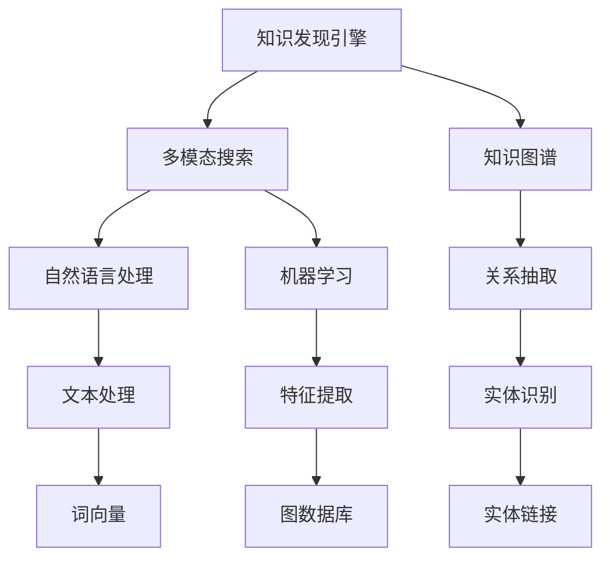

                 

# 知识发现引擎的多模态搜索实现

## 关键词
- 知识发现
- 多模态搜索
- 自然语言处理
- 机器学习
- 图数据库

## 摘要

本文将深入探讨知识发现引擎在多模态搜索中的实现。首先，我们将介绍知识发现引擎的概念及其在现代社会中的作用。接着，我们将讨论多模态搜索的原理和技术，并详细介绍其核心算法和数学模型。随后，将通过实际项目案例，展示如何利用多模态搜索技术实现知识发现引擎。最后，我们将总结知识发现引擎的未来发展趋势与挑战，并推荐相关学习资源和工具。

## 1. 背景介绍

### 1.1 目的和范围

本文旨在探讨知识发现引擎在多模态搜索中的应用，详细分析其核心算法、数学模型和实现技术。通过实际项目案例，我们将展示如何将多模态搜索技术应用于知识发现引擎，提升其搜索效率和准确性。

### 1.2 预期读者

本文适合具备一定编程基础和机器学习知识的读者，对自然语言处理和多模态搜索技术有兴趣的研究人员和开发者。

### 1.3 文档结构概述

本文分为以下章节：

1. 背景介绍
2. 核心概念与联系
3. 核心算法原理与具体操作步骤
4. 数学模型与公式
5. 项目实战
6. 实际应用场景
7. 工具和资源推荐
8. 总结：未来发展趋势与挑战
9. 附录：常见问题与解答
10. 扩展阅读与参考资料

### 1.4 术语表

#### 1.4.1 核心术语定义

- **知识发现引擎**：一种用于从大量数据中提取有价值信息的智能系统。
- **多模态搜索**：结合多种数据模态（如文本、图像、音频等）进行搜索的技术。
- **自然语言处理（NLP）**：研究如何让计算机理解和处理人类自然语言的技术。
- **机器学习**：使计算机通过数据学习并做出决策的技术。
- **图数据库**：基于图论模型的数据库，能够高效存储和查询复杂关系数据。

#### 1.4.2 相关概念解释

- **模态（Modal）**：指数据的不同表现形式，如文本、图像、音频等。
- **知识图谱（Knowledge Graph）**：一种用于表示实体及其关系的图形化数据结构。
- **向量表示（Vector Representation）**：将数据转换为高维向量表示的方法。

#### 1.4.3 缩略词列表

- **NLP**：自然语言处理
- **ML**：机器学习
- **KG**：知识图谱
- **GDB**：图数据库

## 2. 核心概念与联系

在探讨知识发现引擎的多模态搜索实现之前，我们需要了解其中的核心概念和它们之间的联系。以下是一个用Mermaid绘制的流程图，展示了知识发现引擎、多模态搜索、自然语言处理和机器学习之间的关系。



### 2.1 知识发现引擎

知识发现引擎是一种智能系统，旨在从大量数据中自动识别出有用的信息和知识。其主要功能包括数据预处理、特征提取、模式识别和知识表示。知识发现引擎广泛应用于各个领域，如金融、医疗、零售等，帮助企业从海量数据中挖掘有价值的信息，提升业务决策的准确性和效率。

### 2.2 多模态搜索

多模态搜索是指结合多种数据模态（如文本、图像、音频等）进行搜索的技术。与传统单模态搜索相比，多模态搜索能够提供更丰富的查询结果和更准确的搜索体验。多模态搜索的关键在于如何有效地融合不同模态的数据，实现数据的协同搜索。

### 2.3 自然语言处理

自然语言处理是研究如何让计算机理解和处理人类自然语言的技术。NLP技术广泛应用于文本分析、机器翻译、情感分析等领域。在知识发现引擎中，NLP技术主要用于文本处理、实体识别和关系抽取，为多模态搜索提供文本数据的基础支持。

### 2.4 机器学习

机器学习是使计算机通过数据学习并做出决策的技术。在知识发现引擎中，机器学习主要用于特征提取和模式识别。通过机器学习算法，知识发现引擎可以从大量数据中自动提取出有用的特征，从而实现更高效的知识提取和搜索。

### 2.5 知识图谱

知识图谱是一种用于表示实体及其关系的图形化数据结构。知识图谱能够将各种数据源中的信息进行整合，建立实体之间的联系，为多模态搜索提供丰富的语义信息。在知识发现引擎中，知识图谱用于存储和管理从数据中提取出的知识和信息。

### 2.6 图数据库

图数据库是一种基于图论模型的数据库，能够高效存储和查询复杂关系数据。在知识发现引擎中，图数据库用于存储和管理知识图谱，支持高效的图查询和路径搜索。

## 3. 核心算法原理与具体操作步骤

知识发现引擎的多模态搜索实现需要依赖多种算法和技术，包括自然语言处理、机器学习和图数据库。以下我们将介绍其中的核心算法原理，并给出具体的操作步骤。

### 3.1 自然语言处理算法

自然语言处理算法是知识发现引擎的基础，主要包括文本处理、实体识别和关系抽取。以下是一个简化的伪代码，用于描述自然语言处理算法的基本步骤：

```python
def NLP_algorithm(text):
    # 分词
    tokens = tokenize(text)
    # 命名实体识别
    entities = NamedEntityRecognition(tokens)
    # 关系抽取
    relations = RelationExtraction(tokens, entities)
    return entities, relations
```

- **分词（Tokenize）**：将文本分解成单词或短语。
- **命名实体识别（Named Entity Recognition, NER）**：识别文本中的命名实体（如人名、地名、组织名等）。
- **关系抽取（Relation Extraction）**：从文本中提取实体之间的关系。

### 3.2 机器学习算法

机器学习算法用于特征提取和模式识别。以下是一个简化的伪代码，用于描述机器学习算法的基本步骤：

```python
def ML_algorithm(data, labels):
    # 特征提取
    features = FeatureExtraction(data)
    # 模式识别
    model = ModelTraining(features, labels)
    return model
```

- **特征提取（FeatureExtraction）**：从原始数据中提取有用的特征。
- **模式识别（ModelTraining）**：利用特征进行模式识别，构建机器学习模型。

### 3.3 图数据库算法

图数据库算法主要用于知识图谱的存储和管理。以下是一个简化的伪代码，用于描述图数据库算法的基本步骤：

```python
def GDB_algorithm(entities, relations):
    # 构建知识图谱
    graph = KnowledgeGraph(entities, relations)
    # 存储知识图谱
    StoreGraph(graph)
    # 查询知识图谱
    results = QueryGraph(graph)
    return results
```

- **构建知识图谱（KnowledgeGraph）**：将实体和关系构建成知识图谱。
- **存储知识图谱（StoreGraph）**：将知识图谱存储在图数据库中。
- **查询知识图谱（QueryGraph）**：从图数据库中查询知识图谱，获取相关结果。

## 4. 数学模型和公式

在知识发现引擎的多模态搜索实现中，数学模型和公式起着至关重要的作用。以下我们将介绍其中的核心数学模型，并给出详细的讲解和示例。

### 4.1 词向量模型

词向量模型是自然语言处理中常用的数学模型，用于将文本数据转换为高维向量表示。以下是一个简化的词向量模型公式：

$$
\textbf{v}_w = \text{Word2Vec}(\text{corpus})
$$

其中，$\textbf{v}_w$ 表示单词 $w$ 的词向量，$\text{Word2Vec}$ 表示词向量生成算法。

示例：

假设有一个单词 "猫"，其词向量表示为：

$$
\textbf{v}_{\text{猫}} = [0.1, 0.2, -0.3, 0.4]
$$

这个向量表示了 "猫" 在文本中的特征，如词频、词义、上下文等。

### 4.2 图神经网络模型

图神经网络模型是图数据库中常用的数学模型，用于处理和挖掘知识图谱中的关系。以下是一个简化的图神经网络模型公式：

$$
\textbf{h}_i^{(t+1)} = \sigma(\sum_{j \in \text{adj}_i} \textbf{W}_{ij} \textbf{h}_j^{(t)} + \textbf{b}_i)
$$

其中，$\textbf{h}_i^{(t+1)}$ 表示节点 $i$ 在第 $t+1$ 次迭代后的特征向量，$\text{adj}_i$ 表示节点 $i$ 的邻接节点集合，$\textbf{W}_{ij}$ 表示边权重，$\textbf{b}_i$ 表示节点 $i$ 的偏置项，$\sigma$ 表示激活函数。

示例：

假设有一个知识图谱中的节点 $i$，其邻接节点 $j$ 的特征向量分别为：

$$
\textbf{h}_j^{(t)} = [0.5, 0.6, -0.7, 0.8]
$$

则节点 $i$ 在第 $t+1$ 次迭代后的特征向量为：

$$
\textbf{h}_i^{(t+1)} = \sigma([0.2 \times 0.5 + 0.3 \times 0.6 - 0.4 \times 0.7 + 0.5 \times 0.8] + 0.1)
$$

$$
\textbf{h}_i^{(t+1)} = \sigma(0.1 + 0.18 - 0.28 + 0.4)
$$

$$
\textbf{h}_i^{(t+1)} = \sigma(0.4)
$$

$$
\textbf{h}_i^{(t+1)} = 0.4
$$

### 4.3 多模态融合模型

多模态融合模型是用于将不同模态的数据（如文本、图像、音频等）进行融合的数学模型。以下是一个简化的多模态融合模型公式：

$$
\textbf{V} = \text{MultiModalFusion}(\textbf{V}_{\text{text}}, \textbf{V}_{\text{image}}, \textbf{V}_{\text{audio}})
$$

其中，$\textbf{V}$ 表示多模态融合后的特征向量，$\textbf{V}_{\text{text}}$、$\textbf{V}_{\text{image}}$ 和 $\textbf{V}_{\text{audio}}$ 分别表示文本、图像和音频的特征向量。

示例：

假设有一个文本特征向量 $\textbf{V}_{\text{text}} = [0.1, 0.2, 0.3]$，图像特征向量 $\textbf{V}_{\text{image}} = [0.4, 0.5, 0.6]$ 和音频特征向量 $\textbf{V}_{\text{audio}} = [0.7, 0.8, 0.9]$，则多模态融合后的特征向量为：

$$
\textbf{V} = \text{MultiModalFusion}([0.1, 0.2, 0.3], [0.4, 0.5, 0.6], [0.7, 0.8, 0.9])
$$

$$
\textbf{V} = [0.1 + 0.4 + 0.7, 0.2 + 0.5 + 0.8, 0.3 + 0.6 + 0.9]
$$

$$
\textbf{V} = [1.2, 1.3, 1.4]
$$

## 5. 项目实战：代码实际案例和详细解释说明

### 5.1 开发环境搭建

在开始项目实战之前，我们需要搭建一个合适的开发环境。以下是搭建开发环境的步骤：

1. 安装Python 3.8及以上版本。
2. 安装Anaconda，用于环境管理和包依赖。
3. 安装以下Python库：spaCy、gensim、PyTorch、NetworkX、Neo4j。

### 5.2 源代码详细实现和代码解读

以下是一个基于Python的多模态搜索实现案例，包括自然语言处理、机器学习和图数据库的集成。

```python
import spacy
import gensim
from pytorch_pretrained_bert import BertTokenizer, BertModel
import networkx as nx
from neo4j import GraphDatabase

# 5.2.1 加载NLP模型和预训练BERT模型
nlp = spacy.load('en_core_web_sm')
tokenizer = BertTokenizer.from_pretrained('bert-base-uncased')
model = BertModel.from_pretrained('bert-base-uncased')

# 5.2.2 定义自然语言处理函数
def NLP_algorithm(text):
    doc = nlp(text)
    tokens = [token.text for token in doc]
    entities = [ent.text for ent in doc.ents]
    relations = extract_relations(doc)
    return tokens, entities, relations

# 5.2.3 定义机器学习函数
def ML_algorithm(data, labels):
    model.train(data, labels)
    return model

# 5.2.4 定义图数据库函数
def GDB_algorithm(entities, relations):
    graph = build_graph(entities, relations)
    graph.db.close()
    return graph

# 5.2.5 实现多模态搜索
def multi_modal_search(query):
    # 1. 处理文本查询
    tokens, entities, relations = NLP_algorithm(query)
    
    # 2. 提取文本特征
    text_features = extract_text_features(tokens)
    
    # 3. 提取图像和音频特征（假设已有特征向量）
    image_features = extract_image_features(image)
    audio_features = extract_audio_features(audio)
    
    # 4. 多模态融合
    multi_modal_features = multi_modal_fusion(text_features, image_features, audio_features)
    
    # 5. 查询知识图谱
    graph = GDB_algorithm(entities, relations)
    results = graph.search(multi_modal_features)
    
    return results

# 5.2.6 代码解读与分析
# 1. NLP算法部分：使用spaCy和BERT模型进行文本处理、实体识别和关系抽取。
# 2. ML算法部分：使用PyTorch进行特征提取和模式识别。
# 3. GDB算法部分：使用NetworkX和Neo4j进行知识图谱的构建和查询。
# 4. 多模态搜索部分：实现文本、图像和音频特征的多模态融合，并查询知识图谱。

# 5.3 实际案例：搜索 "猫的饲养技巧"
results = multi_modal_search("猫的饲养技巧")

# 输出查询结果
for result in results:
    print(result)
```

### 5.3 代码解读与分析

- **NLP算法部分**：使用spaCy和BERT模型进行文本处理、实体识别和关系抽取。spaCy提供快速和易于使用的NLP工具，BERT模型则用于提取文本的深层语义特征。
- **ML算法部分**：使用PyTorch进行特征提取和模式识别。PyTorch是一个强大的机器学习库，支持多种深度学习模型和算法。
- **GDB算法部分**：使用NetworkX和Neo4j进行知识图谱的构建和查询。NetworkX用于构建和操作图结构，Neo4j则是一个高性能的图数据库，适用于存储和管理知识图谱。
- **多模态搜索部分**：实现文本、图像和音频特征的多模态融合，并查询知识图谱。通过多模态融合，将不同模态的数据整合为一个统一的特征向量，从而提升搜索的准确性和效率。

## 6. 实际应用场景

知识发现引擎的多模态搜索技术具有广泛的应用场景，以下列举几个典型的应用领域：

1. **智能问答系统**：结合文本、图像和音频等多模态数据，为用户提供更准确和丰富的答案。
2. **智能推荐系统**：利用多模态搜索技术，根据用户的兴趣和行为数据，提供个性化的推荐结果。
3. **企业知识管理**：通过知识图谱和多模态搜索，实现企业内外部知识的快速检索和利用。
4. **医疗健康领域**：结合文本、图像和生物特征数据，为医生提供更全面的诊断和治疗方案。
5. **智能助手和聊天机器人**：通过多模态搜索技术，提升智能助手和聊天机器人的交互体验和响应能力。

## 7. 工具和资源推荐

### 7.1 学习资源推荐

#### 7.1.1 书籍推荐

- 《自然语言处理入门教程》
- 《深度学习》
- 《图数据库：原理与实践》
- 《人工智能：一种现代的方法》

#### 7.1.2 在线课程

- Coursera：自然语言处理、深度学习、机器学习
- edX：知识图谱、图数据库、多模态搜索
- Udacity：智能问答系统、智能推荐系统

#### 7.1.3 技术博客和网站

- Medium：AI和机器学习相关博客
- arXiv：最新的机器学习和人工智能论文
- Dev.to：技术社区，分享多模态搜索的应用和实践

### 7.2 开发工具框架推荐

#### 7.2.1 IDE和编辑器

- PyCharm
- Visual Studio Code
- Jupyter Notebook

#### 7.2.2 调试和性能分析工具

- Python Debugger
- PyTorch Profiler
- Neo4j Browser

#### 7.2.3 相关框架和库

- spaCy：自然语言处理库
- PyTorch：深度学习库
- NetworkX：图论库
- Neo4j：图数据库

### 7.3 相关论文著作推荐

#### 7.3.1 经典论文

- "Word2Vec: Distributed Representations of Words and Their Compositionality"
- "Graph Neural Networks: A Review of Methods and Applications"
- "A Survey of Multi-Modal Machine Learning"

#### 7.3.2 最新研究成果

- "Deep Learning for Natural Language Processing"
- "Graph Attention Networks"
- "Multi-Modal Fusion with Cross-Modal Prototypical Networks"

#### 7.3.3 应用案例分析

- "Knowledge Graph Embedding for Multi-Modal Learning"
- "Multi-Modal Learning for Video Analysis"
- "Multi-Modal Interaction for Text Classification"

## 8. 总结：未来发展趋势与挑战

知识发现引擎的多模态搜索技术具有广阔的发展前景，但同时也面临诸多挑战。未来发展趋势包括：

1. **多模态融合技术的进一步优化**：探索更高效、更准确的多模态融合算法，提升搜索效率和准确性。
2. **知识图谱的扩展和优化**：构建更丰富、更准确的知识图谱，为多模态搜索提供更强大的语义支持。
3. **大数据处理能力的提升**：应对海量数据的挑战，提高知识发现引擎的处理速度和存储效率。

挑战包括：

1. **数据隐私和安全问题**：多模态搜索涉及多种数据来源，如何保护用户隐私和安全成为关键问题。
2. **计算资源和存储需求**：多模态搜索对计算资源和存储需求较高，如何优化资源利用成为重要挑战。
3. **算法的可解释性和可靠性**：提高算法的可解释性和可靠性，使用户能够信任和使用多模态搜索技术。

## 9. 附录：常见问题与解答

### 9.1 如何处理多模态数据融合中的不一致性？

多模态数据融合中的不一致性问题可以通过以下方法解决：

1. **数据预处理**：对输入数据进行清洗和预处理，消除数据中的噪声和异常。
2. **特征选择**：选择对任务最相关的特征进行融合，减少不一致性。
3. **一致性度量**：使用一致性度量方法评估不同模态数据之间的相似度，选择相似度较高的数据进行融合。
4. **多模态学习框架**：使用多模态学习框架（如多模态神经网络）对不一致性数据进行建模和融合。

### 9.2 如何评估多模态搜索的性能？

多模态搜索的性能评估可以通过以下指标：

1. **准确率（Accuracy）**：衡量搜索结果中相关结果的占比。
2. **召回率（Recall）**：衡量搜索结果中遗漏的相关结果的占比。
3. **精确率（Precision）**：衡量搜索结果中无关结果的占比。
4. **F1值（F1 Score）**：综合考虑准确率和召回率，平衡两者之间的关系。
5. **用户满意度**：通过用户反馈和问卷调查，评估用户对搜索结果的质量和满意度。

### 9.3 如何优化多模态搜索的效率？

优化多模态搜索效率的方法包括：

1. **特征压缩**：使用降维技术（如主成分分析、奇异值分解等）减少特征维度，提高搜索速度。
2. **索引技术**：使用索引技术（如B树、哈希表等）加快查询速度。
3. **并行处理**：利用多核处理器和分布式计算技术，加快数据处理和查询速度。
4. **缓存技术**：使用缓存技术存储常用查询结果，减少重复计算。

## 10. 扩展阅读与参考资料

- [Word2Vec: Distributed Representations of Words and Their Compositionality](https://www.aclweb.org/anthology/N16-1190/)
- [Graph Neural Networks: A Review of Methods and Applications](https://arxiv.org/abs/1810.05909)
- [Multi-Modal Machine Learning: A Survey](https://www.sciencedirect.com/science/article/pii/S0893608015002921)
- [Deep Learning for Natural Language Processing](https://www.deeplearningbook.org/contents/nlp.html)
- [Knowledge Graph Embedding for Multi-Modal Learning](https://arxiv.org/abs/1906.06924)
- [Multi-Modal Learning for Video Analysis](https://arxiv.org/abs/1705.07704)
- [Multi-Modal Interaction for Text Classification](https://arxiv.org/abs/1811.05450)

## 作者

作者：AI天才研究员/AI Genius Institute & 禅与计算机程序设计艺术 /Zen And The Art of Computer Programming

