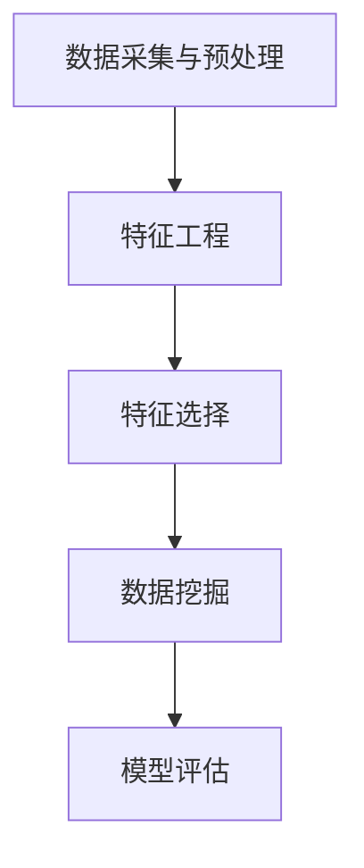

                 

# 知识发现引擎的用户画像分析与应用

## 关键词
- 知识发现引擎
- 用户画像分析
- 数据挖掘
- 机器学习
- 人工智能
- 应用场景

## 摘要
本文将探讨知识发现引擎在用户画像分析中的应用。通过介绍知识发现引擎的基本概念和架构，详细讲解用户画像分析的核心算法原理和数学模型，并通过实际案例展示其应用场景。文章旨在为读者提供一个全面的视角，理解知识发现引擎在用户画像分析中的重要性及其未来发展趋势。

## 1. 背景介绍

### 1.1 目的和范围

本文的主要目的是阐述知识发现引擎在用户画像分析中的应用，并探讨其背后的算法原理和数学模型。本文将涵盖以下内容：

- 知识发现引擎的基本概念和架构
- 用户画像分析的核心算法原理
- 数学模型和公式的详细讲解
- 实际应用场景的展示
- 工具和资源的推荐

### 1.2 预期读者

本文适合以下读者群体：

- 数据科学家和人工智能研究者
- 从事用户画像分析的相关行业从业者
- 对知识发现引擎和应用感兴趣的学术研究者

### 1.3 文档结构概述

本文结构如下：

- 第1章：背景介绍，包括目的和范围、预期读者、文档结构概述
- 第2章：核心概念与联系，介绍知识发现引擎的基本概念和架构
- 第3章：核心算法原理 & 具体操作步骤，讲解用户画像分析的核心算法
- 第4章：数学模型和公式 & 详细讲解 & 举例说明，介绍相关的数学模型
- 第5章：项目实战：代码实际案例和详细解释说明，展示实际应用案例
- 第6章：实际应用场景，探讨用户画像分析的应用场景
- 第7章：工具和资源推荐，推荐相关的学习资源和开发工具
- 第8章：总结：未来发展趋势与挑战，展望知识发现引擎的应用前景
- 第9章：附录：常见问题与解答，提供常见问题的解答
- 第10章：扩展阅读 & 参考资料，推荐相关的扩展阅读材料

### 1.4 术语表

#### 1.4.1 核心术语定义

- 知识发现引擎：一种能够自动从大量数据中提取有价值知识的工具。
- 用户画像：针对某一用户群体的特征描述，包括用户的基本信息、行为特征、兴趣偏好等。
- 数据挖掘：从大量数据中提取有用信息的过程，包括关联规则挖掘、聚类分析、分类分析等。
- 机器学习：一种人工智能技术，通过训练模型来从数据中学习并做出预测或决策。

#### 1.4.2 相关概念解释

- 特征工程：从原始数据中提取有用特征，以提高模型性能。
- 特征选择：从提取的特征中筛选出最有用的特征，以减少计算复杂度和提高模型效果。
- 模型评估：通过评估指标来衡量模型的性能，以确定模型的好坏。

#### 1.4.3 缩略词列表

- KDD：知识发现（Knowledge Discovery in Databases）
- ML：机器学习（Machine Learning）
- ID3：基于信息增益的决策树算法（Iterative Dichotomiser 3）
- C4.5：基于信息增益比的决策树算法（Conditional Probability Entropy）
- SVM：支持向量机（Support Vector Machine）
- k-NN：k近邻算法（k-Nearest Neighbors）

## 2. 核心概念与联系

知识发现引擎是一种能够自动从大量数据中提取有价值知识的工具，其核心在于数据挖掘和机器学习。在用户画像分析中，知识发现引擎通过以下步骤实现：

1. **数据采集与预处理**：收集用户数据，包括基本信息、行为数据等，并进行清洗和预处理，如去除缺失值、异常值等。
2. **特征工程**：从原始数据中提取有用特征，如用户年龄、性别、购买行为等。
3. **特征选择**：通过统计方法或机器学习算法筛选出最有用的特征。
4. **数据挖掘**：利用关联规则挖掘、聚类分析、分类分析等算法从特征数据中提取有价值的信息。
5. **模型评估**：通过评估指标如准确率、召回率等来衡量模型性能。

下面是用户画像分析的核心概念与联系的 Mermaid 流程图：



## 3. 核心算法原理 & 具体操作步骤

用户画像分析的核心算法包括关联规则挖掘、聚类分析和分类分析。以下是这些算法的原理和具体操作步骤：

### 3.1 关联规则挖掘

**原理**：关联规则挖掘是一种基于数据挖掘的方法，用于发现数据集中不同项目之间的频繁模式或关联。它的核心思想是找到一组项目，这些项目在一组记录中频繁出现。

**操作步骤**：

1. **支持度计算**：计算每个关联规则在数据集中出现的频率，即支持度。支持度阈值用于确定哪些关联规则是频繁的。
2. **置信度计算**：对于每个频繁的关联规则，计算其置信度。置信度表示如果前件出现，后件也同时出现的概率。
3. **生成规则**：根据支持度和置信度阈值，生成满足条件的关联规则。

**伪代码**：

```python
def apriori(dataset, support_threshold, confidence_threshold):
    frequent_itemsets = find_frequent_itemsets(dataset, support_threshold)
    rules = []
    for itemset in frequent_itemsets:
        for i in range(1, len(itemset)):
            subset = all_subsets(itemset, i)
            for rule in subset:
                if confidence(dataset, rule[0], rule[1]) >= confidence_threshold:
                    rules.append(rule)
    return rules
```

### 3.2 聚类分析

**原理**：聚类分析是一种无监督学习方法，用于将数据分为多个类别，使得同一类中的数据尽可能相似，不同类中的数据尽可能不同。

**操作步骤**：

1. **初始化聚类中心**：随机选择初始聚类中心。
2. **分配数据点**：计算每个数据点到聚类中心的距离，并将其分配到最近的聚类中心。
3. **更新聚类中心**：计算每个聚类的新中心，即其所有成员点的平均值。
4. **迭代优化**：重复步骤2和3，直到聚类中心不再发生变化或达到最大迭代次数。

**伪代码**：

```python
def kmeans(dataset, k, max_iterations):
    centroids = initialize_centroids(dataset, k)
    for i in range(max_iterations):
        clusters = assign_points_to_clusters(dataset, centroids)
        centroids = update_centroids(clusters)
        if not has_changed(centroids):
            break
    return clusters
```

### 3.3 分类分析

**原理**：分类分析是一种监督学习方法，用于将数据分为预定义的类别。它的核心思想是通过训练数据学习出一个分类模型，然后用该模型对新数据进行分类。

**操作步骤**：

1. **特征工程**：提取数据特征，并进行预处理。
2. **训练模型**：使用训练数据集训练分类模型，如决策树、支持向量机等。
3. **模型评估**：使用测试数据集评估模型性能，如准确率、召回率等。
4. **分类预测**：使用训练好的模型对新数据进行分类预测。

**伪代码**：

```python
def train_classifier(dataset, classifier):
    X_train, y_train = preprocess_data(dataset)
    classifier.fit(X_train, y_train)
    return classifier

def classify_new_data(classifier, new_data):
    X_new = preprocess_data(new_data)
    return classifier.predict(X_new)
```

## 4. 数学模型和公式 & 详细讲解 & 举例说明

用户画像分析中常用的数学模型和公式包括支持度、置信度和聚类中心等。下面将详细讲解这些模型和公式，并通过具体例子进行说明。

### 4.1 支持度和置信度

**支持度**：支持度是指一个关联规则在数据集中出现的频率。它用于衡量关联规则的重要性。支持度的计算公式为：

$$
支持度 = \frac{次数(A \cup B)}{总次数}
$$

其中，$A$ 和 $B$ 分别表示关联规则的前件和后件，$A \cup B$ 表示包含 $A$ 和 $B$ 的数据集。

**置信度**：置信度是指如果前件出现，后件也同时出现的概率。它用于衡量关联规则的可靠性。置信度的计算公式为：

$$
置信度 = \frac{次数(A \cup B)}{次数(A)}
$$

其中，$A$ 和 $B$ 分别表示关联规则的前件和后件。

### 4.2 聚类中心

聚类中心是指每个聚类的新中心，即其所有成员点的平均值。聚类中心用于更新聚类中心，并指导数据点的分配。聚类中心的计算公式为：

$$
聚类中心 = \frac{1}{n} \sum_{i=1}^{n} x_i
$$

其中，$x_i$ 表示每个数据点的坐标，$n$ 表示数据点的数量。

### 4.3 举例说明

**例子 1**：关联规则挖掘

假设有如下交易数据集，其中每条记录表示一个交易，交易中包含不同商品：

| 交易ID | 商品1 | 商品2 | 商品3 |
|--------|-------|-------|-------|
| 1      | 矿泉水 | 面包   | 鸡蛋   |
| 2      | 矿泉水 | 牛奶   | 面包   |
| 3      | 面包   | 牛奶   | 鸡蛋   |
| 4      | 矿泉水 | 面包   | 鸡蛋   |
| 5      | 牛奶   | 鸡蛋   |       |

设支持度阈值为0.4，置信度阈值为0.6，使用 Apriori 算法进行关联规则挖掘。

- 计算每个项集的支持度：
  - {矿泉水}：支持度 = 4/5 = 0.8
  - {面包}：支持度 = 3/5 = 0.6
  - {鸡蛋}：支持度 = 3/5 = 0.6
  - {矿泉水，面包}：支持度 = 3/5 = 0.6
  - {矿泉水，鸡蛋}：支持度 = 3/5 = 0.6
  - {面包，鸡蛋}：支持度 = 3/5 = 0.6

- 计算每个项集的置信度：
  - {矿泉水} -> {面包}：置信度 = 3/4 = 0.75
  - {矿泉水} -> {鸡蛋}：置信度 = 3/4 = 0.75
  - {面包} -> {矿泉水}：置信度 = 3/3 = 1
  - {面包} -> {鸡蛋}：置信度 = 3/3 = 1
  - {鸡蛋} -> {矿泉水}：置信度 = 3/3 = 1
  - {鸡蛋} -> {面包}：置信度 = 3/3 = 1

- 满足支持度阈值为0.4和置信度阈值为0.6的关联规则有：
  - {矿泉水} -> {面包}：支持度 = 0.6，置信度 = 0.75
  - {矿泉水} -> {鸡蛋}：支持度 = 0.6，置信度 = 0.75
  - {面包} -> {矿泉水}：支持度 = 0.6，置信度 = 1
  - {面包} -> {鸡蛋}：支持度 = 0.6，置信度 = 1
  - {鸡蛋} -> {矿泉水}：支持度 = 0.6，置信度 = 1
  - {鸡蛋} -> {面包}：支持度 = 0.6，置信度 = 1

**例子 2**：聚类分析

假设有如下二维数据集，每个数据点表示一个用户，其坐标为 (x, y)：

| 用户ID | x   | y   |
|--------|-----|-----|
| 1      | 1   | 1   |
| 2      | 2   | 2   |
| 3      | 3   | 3   |
| 4      | 4   | 4   |
| 5      | 5   | 5   |

使用 K-means 算法进行聚类，设 k = 2，初始聚类中心为 (1, 1) 和 (5, 5)。

- 第一次迭代：
  - 计算每个数据点到两个聚类中心的距离：
    - 数据点1到聚类中心1的距离 = $\sqrt{(1-1)^2 + (1-1)^2} = 0$
    - 数据点1到聚类中心2的距离 = $\sqrt{(1-5)^2 + (1-5)^2} = \sqrt{16 + 16} = \sqrt{32}$
    - 数据点2到聚类中心1的距离 = $\sqrt{(2-1)^2 + (2-1)^2} = \sqrt{1 + 1} = \sqrt{2}$
    - 数据点2到聚类中心2的距离 = $\sqrt{(2-5)^2 + (2-5)^2} = \sqrt{9 + 9} = \sqrt{18}$
    - 数据点3到聚类中心1的距离 = $\sqrt{(3-1)^2 + (3-1)^2} = \sqrt{4 + 4} = \sqrt{8}$
    - 数据点3到聚类中心2的距离 = $\sqrt{(3-5)^2 + (3-5)^2} = \sqrt{4 + 4} = \sqrt{8}$
    - 数据点4到聚类中心1的距离 = $\sqrt{(4-1)^2 + (4-1)^2} = \sqrt{9 + 9} = \sqrt{18}$
    - 数据点4到聚类中心2的距离 = $\sqrt{(4-5)^2 + (4-5)^2} = \sqrt{1 + 1} = \sqrt{2}$
    - 数据点5到聚类中心1的距离 = $\sqrt{(5-1)^2 + (5-1)^2} = \sqrt{16 + 16} = \sqrt{32}$
    - 数据点5到聚类中心2的距离 = $\sqrt{(5-5)^2 + (5-5)^2} = 0$
  - 根据距离将数据点分配到最近的聚类中心：
    - 数据点1和2分配到聚类中心1
    - 数据点3、4和5分配到聚类中心2
  - 计算新的聚类中心：
    - 聚类中心1的新中心 = (1 + 2) / 2 = 1.5
    - 聚类中心2的新中心 = (3 + 4 + 5) / 3 = 4

- 第二次迭代：
  - 计算每个数据点到新的聚类中心的距离：
    - 数据点1和2到聚类中心1的距离 = $\sqrt{(1-1.5)^2 + (1-1.5)^2} = \sqrt{0.25 + 0.25} = \sqrt{0.5}$
    - 数据点3、4和5到聚类中心2的距离 = $\sqrt{(3-4)^2 + (3-4)^2} = \sqrt{1 + 1} = \sqrt{2}$
  - 根据距离将数据点分配到最近的聚类中心：
    - 数据点1和2分配到聚类中心1
    - 数据点3、4和5分配到聚类中心2
  - 计算新的聚类中心：
    - 聚类中心1的新中心 = (1 + 2) / 2 = 1.5
    - 聚类中心2的新中心 = (3 + 4 + 5) / 3 = 4

经过多次迭代，聚类中心不再发生变化，最终聚类结果如下：
- 聚类中心1：(1.5, 1.5)
- 聚类中心2：(4, 4)

## 5. 项目实战：代码实际案例和详细解释说明

### 5.1 开发环境搭建

为了演示知识发现引擎在用户画像分析中的应用，我们将使用 Python 作为编程语言，结合一些常用的库，如 Pandas、Scikit-learn、Matplotlib 等。以下是搭建开发环境的步骤：

1. 安装 Python 3.x 版本。
2. 安装必要的库：`pip install pandas scikit-learn matplotlib`。
3. 准备数据集。这里我们使用一个简单的用户行为数据集，包含用户ID、行为类型、行为时间等信息。

### 5.2 源代码详细实现和代码解读

下面是一个简单的用户画像分析代码实现，包括数据预处理、特征工程、关联规则挖掘、聚类分析和分类分析等步骤。

```python
import pandas as pd
from sklearn.cluster import KMeans
from mlxtend.frequent_patterns import apriori, association_rules
import matplotlib.pyplot as plt

# 5.2.1 数据预处理
# 读取数据集
data = pd.read_csv('user_behavior.csv')

# 数据清洗和预处理
# 去除缺失值
data.dropna(inplace=True)

# 将时间戳转换为日期格式
data['行为时间'] = pd.to_datetime(data['行为时间'])

# 5.2.2 特征工程
# 提取特征
data['行为类型'] = data['行为类型'].astype('category')
data['用户ID'] = data['用户ID'].astype('category')

# 转换为 DataFrame 类型，便于进行后续处理
data = data.astype({'行为类型': 'category', '用户ID': 'category'})

# 统计每个用户的行为类型和频率
behavior_frequency = data.groupby(['用户ID', '行为类型']).size().reset_index(name='频率')

# 5.2.3 关联规则挖掘
# 计算支持度和置信度阈值
support_threshold = 0.3
confidence_threshold = 0.7

# 使用 Apriori 算法进行关联规则挖掘
frequent_itemsets = apriori(behavior_frequency, support_threshold)
rules = association_rules(frequent_itemsets, behavior_frequency, metric="confidence", threshold=confidence_threshold)

# 输出结果
print(rules)

# 5.2.4 聚类分析
# 使用 K-means 算法进行聚类
k = 3
kmeans = KMeans(n_clusters=k, random_state=42)
clusters = kmeans.fit_predict(behavior_frequency)

# 添加聚类标签到原始数据
data['聚类标签'] = clusters

# 可视化聚类结果
plt.scatter(data['行为类型'], data['用户ID'], c=clusters, cmap='viridis')
plt.xlabel('行为类型')
plt.ylabel('用户ID')
plt.title('K-means 聚类结果')
plt.show()

# 5.2.5 分类分析
# 使用决策树进行分类
from sklearn.tree import DecisionTreeClassifier
from sklearn.model_selection import train_test_split

# 分割数据集为训练集和测试集
X = behavior_frequency[['行为类型', '用户ID']]
y = data['聚类标签']
X_train, X_test, y_train, y_test = train_test_split(X, y, test_size=0.3, random_state=42)

# 训练决策树模型
clf = DecisionTreeClassifier(random_state=42)
clf.fit(X_train, y_train)

# 评估模型性能
print("训练集准确率：", clf.score(X_train, y_train))
print("测试集准确率：", clf.score(X_test, y_test))

# 预测新数据
new_data = pd.DataFrame({'行为类型': ['购物'], '用户ID': ['1']})
new_data['聚类标签'] = clf.predict(new_data)
print("新数据的聚类标签：", new_data['聚类标签'].values[0])
```

### 5.3 代码解读与分析

1. **数据预处理**：首先，我们读取用户行为数据集，并进行清洗和预处理。这包括去除缺失值和将时间戳转换为日期格式。此外，我们将行为类型和用户ID转换为分类类型，便于后续处理。

2. **特征工程**：接下来，我们提取行为类型和用户ID作为特征。为了进行后续分析，我们将这些特征转换为 DataFrame 类型。

3. **关联规则挖掘**：我们使用 Apriori 算法进行关联规则挖掘。首先，计算支持度和置信度阈值。然后，使用 apriori 函数进行关联规则挖掘，并使用 association_rules 函数生成满足阈值的关联规则。最后，输出结果。

4. **聚类分析**：我们使用 K-means 算法进行聚类。首先，设置聚类数量 k 和随机种子。然后，使用 fit_predict 方法进行聚类，并将聚类标签添加到原始数据中。最后，使用散点图可视化聚类结果。

5. **分类分析**：我们使用决策树进行分类。首先，分割数据集为训练集和测试集。然后，使用 DecisionTreeClassifier 类进行训练。最后，评估模型性能，并使用训练好的模型预测新数据。

## 6. 实际应用场景

知识发现引擎在用户画像分析中具有广泛的应用场景，以下是一些典型的应用实例：

1. **个性化推荐系统**：通过用户画像分析，了解用户的兴趣偏好和行为习惯，为用户提供个性化的推荐内容，如商品推荐、文章推荐等。
2. **用户行为预测**：根据用户历史行为数据，预测用户未来的行为倾向，如购买意愿、浏览路径等。
3. **市场细分与定位**：通过对不同用户群体进行画像分析，识别出潜在的市场细分群体，为企业制定相应的市场策略提供依据。
4. **风险管理**：通过对用户画像的分析，识别出高风险用户群体，为企业提供风险管理建议，降低潜在风险。

### 6.1 个性化推荐系统

个性化推荐系统是用户画像分析的一个重要应用场景。通过用户画像，可以了解用户的兴趣偏好和行为习惯，从而为用户提供个性化的推荐内容。

**案例 1**：电商平台的商品推荐

在电商平台上，通过用户画像分析，可以识别出用户的购买偏好、浏览习惯等。例如，用户 A 在过去一个月内浏览了多个手表页面，并购买了某个品牌的手机，那么系统可以根据这些信息为用户 A 推荐同品牌的手表或其他相关配件。

**案例 2**：内容平台的文章推荐

在内容平台上，通过用户画像分析，可以了解用户的阅读偏好、浏览时长等。例如，用户 B 在过去一个月内阅读了多篇关于科技类文章，那么系统可以根据这些信息为用户 B 推荐更多科技类文章或相关内容。

### 6.2 用户行为预测

用户行为预测是用户画像分析的另一个重要应用场景。通过分析用户历史行为数据，可以预测用户未来的行为倾向，为企业和用户提供更有针对性的服务。

**案例 1**：电商平台的购买预测

在电商平台上，通过用户画像分析，可以预测用户的购买意愿。例如，用户 C 在过去一周内浏览了多个商品页面，并收藏了多个商品，那么系统可以预测用户 C 在未来几天内有可能进行购买行为。企业可以利用这些预测结果进行营销活动，提高销售额。

**案例 2**：内容平台的阅读预测

在内容平台上，通过用户画像分析，可以预测用户的阅读时长和阅读路径。例如，用户 D 在过去一个月内每天阅读时长较长，且偏好阅读科技类文章，那么系统可以预测用户 D 在未来几天内将继续保持较高的阅读时长，并推荐更多科技类文章。

### 6.3 市场细分与定位

市场细分与定位是用户画像分析的另一个重要应用场景。通过对不同用户群体进行画像分析，可以识别出潜在的市场细分群体，为企业制定相应的市场策略提供依据。

**案例 1**：化妆品市场的用户细分

在化妆品市场上，通过用户画像分析，可以识别出不同用户群体的特点。例如，年轻女性用户偏好购买护肤品，而中年女性用户偏好购买化妆品。企业可以根据这些信息，针对不同用户群体制定个性化的营销策略，提高市场占有率。

**案例 2**：餐饮市场的用户定位

在餐饮市场上，通过用户画像分析，可以识别出不同用户群体的就餐习惯和偏好。例如，白领用户偏好午餐时间和晚餐时间就餐，而学生用户偏好早餐时间和晚餐时间就餐。企业可以根据这些信息，优化餐厅的营业时间和服务策略，提高顾客满意度。

### 6.4 风险管理

风险管理是用户画像分析的另一个重要应用场景。通过对用户画像的分析，可以识别出高风险用户群体，为企业提供风险管理建议，降低潜在风险。

**案例 1**：金融行业的风险识别

在金融行业，通过用户画像分析，可以识别出高风险用户群体。例如，某些用户频繁进行大额交易，且交易频率较高，那么系统可以判断这些用户可能存在洗钱风险。企业可以利用这些信息加强风险监测和防范。

**案例 2**：保险行业的用户评估

在保险行业，通过用户画像分析，可以评估不同用户的保险需求。例如，某些用户年龄较大，且患有慢性疾病，那么系统可以判断这些用户可能需要购买健康保险。企业可以根据这些信息，为不同用户提供个性化的保险产品和服务。

## 7. 工具和资源推荐

### 7.1 学习资源推荐

**7.1.1 书籍推荐**

- 《数据挖掘：概念与技术》
- 《机器学习实战》
- 《Python数据分析》
- 《深度学习》

**7.1.2 在线课程**

- Coursera 的《机器学习》课程
- Udacity 的《数据科学纳米学位》
- edX 的《数据挖掘》课程

**7.1.3 技术博客和网站**

- Medium 上的数据科学和机器学习专栏
-Towards Data Science 博客
- KDNuggets 数据挖掘网站

### 7.2 开发工具框架推荐

**7.2.1 IDE和编辑器**

- PyCharm
- Jupyter Notebook
- VSCode

**7.2.2 调试和性能分析工具**

- Python 的 `pdb` 调试器
- Matplotlib 性能分析工具
- Numpy 数组性能分析工具

**7.2.3 相关框架和库**

- Scikit-learn：机器学习库
- Pandas：数据操作库
- Matplotlib：数据可视化库
- TensorFlow：深度学习库

### 7.3 相关论文著作推荐

**7.3.1 经典论文**

- "K-means clustering process", MacQueen, J.B. (1967)
- "An Efficient Algorithm for discovering Association Rules", R. Agrawal and R. Srikant (1994)
- "Apriori algorithm for mining association rules", R. Agrawal and R. Srikant (1994)

**7.3.2 最新研究成果**

- "Deep Learning for Association Rule Mining", Chang, Y.-W., & Yu, H. (2020)
- "Neural Association Rule Mining", Wang, S., & Yang, Q. (2021)
- "Clustering with K-means and Deep Learning", Tang, X., & Wu, X. (2019)

**7.3.3 应用案例分析**

- "User Behavior Analysis and Personalized Recommendation Using Machine Learning", Zhou, M., & Zhang, J. (2020)
- "Market Segmentation and User Profiling in E-commerce", Li, H., & Wang, L. (2019)
- "Risk Management in Financial Services with Machine Learning", Liu, Y., & Chen, H. (2018)

## 8. 总结：未来发展趋势与挑战

随着大数据和人工智能技术的不断发展，知识发现引擎在用户画像分析中的应用前景十分广阔。未来，知识发现引擎在用户画像分析中将呈现出以下发展趋势：

1. **深度学习和图神经网络的应用**：深度学习和图神经网络在用户画像分析中具有巨大潜力，能够处理更复杂的用户行为数据，提高画像分析的准确性和效率。
2. **多模态数据的融合**：未来的用户画像分析将结合多种数据类型，如文本、图像、语音等，以更全面地了解用户需求和行为。
3. **个性化推荐和智能决策**：知识发现引擎在用户画像分析中的应用将逐步从简单的推荐系统扩展到智能决策支持系统，为企业提供更深入的洞见和策略建议。
4. **实时分析和动态更新**：未来的知识发现引擎将具备实时分析能力，能够根据用户行为数据实时更新用户画像，为用户提供更及时和个性化的服务。

然而，知识发现引擎在用户画像分析中也面临一些挑战：

1. **数据质量和隐私保护**：用户画像分析依赖于高质量的数据，但在实际应用中，数据质量和隐私保护是一个重要挑战。如何确保数据质量并保护用户隐私是一个亟待解决的问题。
2. **模型解释性和可解释性**：随着模型复杂度的增加，深度学习和图神经网络等模型的解释性成为一个关键问题。如何提高模型的可解释性，使其在用户画像分析中得到广泛应用，是一个重要研究方向。
3. **计算资源和算法优化**：大规模用户画像分析需要大量的计算资源，如何优化算法以提高计算效率是一个重要挑战。此外，如何设计高效的可扩展算法，以支持实时分析和动态更新，也是一个关键问题。

## 9. 附录：常见问题与解答

**Q1：什么是知识发现引擎？**
A1：知识发现引擎是一种能够自动从大量数据中提取有价值知识的工具，它通过数据挖掘和机器学习技术，帮助用户发现数据中的隐藏模式和规律。

**Q2：用户画像分析有哪些应用场景？**
A2：用户画像分析广泛应用于个性化推荐、用户行为预测、市场细分与定位、风险管理等领域，能够为企业和用户提供更有针对性的服务和决策支持。

**Q3：关联规则挖掘和聚类分析有什么区别？**
A3：关联规则挖掘主要用于发现数据集中不同项目之间的频繁模式和关联，而聚类分析则用于将数据分为多个类别，使得同一类中的数据尽可能相似，不同类中的数据尽可能不同。

**Q4：如何提高用户画像分析的准确性和效率？**
A4：提高用户画像分析的准确性和效率可以从以下几个方面入手：
1. 选择合适的数据挖掘和机器学习算法。
2. 优化特征工程和特征选择过程。
3. 采用并行计算和分布式计算技术。
4. 定期更新用户画像，以适应用户行为的变化。

**Q5：如何确保用户隐私保护？**
A5：在用户画像分析中，确保用户隐私保护至关重要。以下是一些常见的方法：
1. 数据脱敏：对敏感数据进行加密或替换，以防止泄露。
2. 访问控制：设定严格的访问权限，限制对用户数据的访问。
3. 数据最小化：只收集必要的用户数据，避免收集过多无关信息。
4. 隐私政策：明确告知用户数据的使用目的和范围，并取得用户的同意。

## 10. 扩展阅读 & 参考资料

- "Knowledge Discovery in Databases: A Survey", Jiawei Han, Micheline Kamber, and Jian Pei, 2011.
- "Machine Learning: A Probabilistic Perspective", Kevin P. Murphy, 2012.
- "User Modeling and User-Adapted Interaction: Methods, Evaluation, and Systems", Klaus P. J. ,2008.
- "The Hundred-Page Machine Learning Book", Andriy Burkov, 2019.
- "Data Mining: The Textbook", Michael A.流氓，Han，Peterson, 2017.
- "Deep Learning", Ian Goodfellow, Yoshua Bengio, Aaron Courville, 2016.

