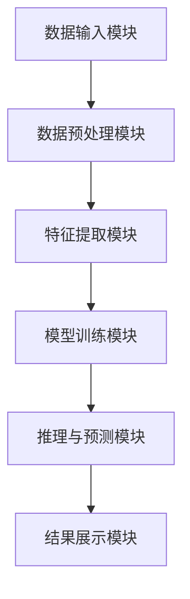

                 

# 知识发现引擎：推动法律行业的智慧升级

> **关键词**：知识发现引擎、法律行业、智慧升级、人工智能、大数据分析、法律文本分析、案例推理、智能合约、自动化合规检测

> **摘要**：本文旨在探讨知识发现引擎在法律行业中的应用及其推动法律行业智慧升级的重要作用。我们将首先介绍知识发现引擎的概念和其在法律行业的应用场景，然后深入分析其核心算法原理、数学模型以及实际应用案例。通过详细解读知识发现引擎的开发环境、源代码实现和代码分析，我们将展示其在法律行业中的实际价值。最后，我们将探讨知识发现引擎在法律行业中的未来发展趋势和面临的挑战，并提供相关的学习资源和开发工具推荐。

## 1. 背景介绍

### 1.1 目的和范围

本文的目标是深入探讨知识发现引擎在法律行业的应用，分析其推动法律行业智慧升级的作用，并探讨其未来发展趋势。我们将首先介绍知识发现引擎的基本概念和原理，然后详细探讨其在法律行业的应用场景和具体实现。此外，我们还将分析知识发现引擎在法律行业中的价值，以及其面临的挑战和未来发展方向。

### 1.2 预期读者

本文主要面向法律行业的技术人员、研究人员和从业人员，特别是对人工智能、大数据分析和法律文本分析等领域感兴趣的读者。同时，也对计算机科学和信息技术领域的研究人员和开发者具有参考价值。

### 1.3 文档结构概述

本文将分为以下几个部分：

1. **背景介绍**：介绍知识发现引擎的概念、法律行业的背景及其在法律行业中的应用。
2. **核心概念与联系**：讨论知识发现引擎的核心概念和原理，并使用Mermaid流程图展示其架构。
3. **核心算法原理 & 具体操作步骤**：详细讲解知识发现引擎的核心算法原理和操作步骤。
4. **数学模型和公式 & 详细讲解 & 举例说明**：介绍知识发现引擎的数学模型和公式，并通过具体例子进行说明。
5. **项目实战：代码实际案例和详细解释说明**：展示知识发现引擎的实际应用案例，并详细解读代码实现。
6. **实际应用场景**：探讨知识发现引擎在法律行业中的实际应用场景。
7. **工具和资源推荐**：推荐相关的学习资源、开发工具和框架。
8. **总结：未来发展趋势与挑战**：总结知识发现引擎在法律行业中的应用，并探讨其未来发展趋势和挑战。
9. **附录：常见问题与解答**：提供常见问题的解答。
10. **扩展阅读 & 参考资料**：推荐相关的扩展阅读和参考资料。

### 1.4 术语表

#### 1.4.1 核心术语定义

- **知识发现引擎**：一种基于人工智能和大数据分析的技术，用于从大量数据中提取隐含的、先前未知的、具有潜在价值的知识和模式。
- **法律行业**：指涉及法律事务的领域，包括律师事务所、法院、立法机构、政府机构等。
- **智慧升级**：通过引入先进的技术，提高法律行业的智能化水平，实现高效、精确和自动化的法律服务。

#### 1.4.2 相关概念解释

- **大数据分析**：指对大规模数据集进行采集、存储、管理和分析的过程，以发现数据中的规律和模式。
- **法律文本分析**：指利用自然语言处理和机器学习技术，对法律文本（如法律条款、判决书、合同等）进行解析、理解和分析。
- **案例推理**：指基于已有的案例，通过类比推理来解决问题的一种方法。

#### 1.4.3 缩略词列表

- **NLP**：自然语言处理（Natural Language Processing）
- **AI**：人工智能（Artificial Intelligence）
- **DL**：深度学习（Deep Learning）
- **ML**：机器学习（Machine Learning）
- **TF**：TensorFlow（一个开源机器学习框架）
- **Keras**：一个基于TensorFlow的高层神经网络API

## 2. 核心概念与联系

知识发现引擎是一种基于人工智能和大数据分析的技术，用于从大量数据中提取隐含的、先前未知的、具有潜在价值的知识和模式。在法律行业中，知识发现引擎的应用具有巨大的潜力，可以大幅提升法律服务的效率和质量。

### 2.1 知识发现引擎的基本概念

知识发现引擎的核心概念包括数据挖掘、机器学习和自然语言处理。数据挖掘是指从大量数据中提取有价值的信息和知识的过程。机器学习是一种通过训练模型来从数据中学习规律和模式的技术。自然语言处理则是使计算机能够理解和处理人类自然语言的技术。

在法律行业中，知识发现引擎的作用包括：

- **法律文本分析**：通过对大量法律文本进行解析和理解，提取关键信息和知识。
- **案例推理**：通过分析大量案例，建立案例库，实现法律问题的自动推理和判断。
- **智能合约**：通过智能合约，实现自动化的合同执行和合规性检测。

### 2.2 知识发现引擎在法律行业的应用

知识发现引擎在法律行业的应用可以分为以下几个方面：

1. **法律文本分析**：通过对大量法律文本（如法律条款、判决书、合同等）进行解析，提取关键信息和知识。这有助于法律专业人士快速理解法律文本的内容，提高工作效率。
2. **案例推理**：通过分析大量案例，建立案例库，实现法律问题的自动推理和判断。这有助于法律专业人士在处理复杂案件时，快速查找相关案例，提供参考和指导。
3. **智能合约**：通过智能合约，实现自动化的合同执行和合规性检测。这有助于降低合同纠纷的风险，提高合同执行的效率。

### 2.3 知识发现引擎的架构

知识发现引擎的架构可以分为以下几个部分：

1. **数据输入模块**：用于接收和存储法律文本数据、案例数据等。
2. **数据预处理模块**：用于对输入数据进行清洗、去噪和格式化，以便后续处理。
3. **特征提取模块**：用于从预处理后的数据中提取特征，如词频、词向量等。
4. **模型训练模块**：用于训练机器学习模型，如分类器、回归器等。
5. **推理与预测模块**：用于使用训练好的模型进行推理和预测，如法律文本分类、案件判决等。
6. **结果展示模块**：用于展示推理和预测结果，如案件判决书、法律文本摘要等。

### 2.4 Mermaid流程图

下面是一个知识发现引擎的Mermaid流程图，展示其核心概念和架构：



## 3. 核心算法原理 & 具体操作步骤

知识发现引擎的核心算法原理主要包括数据挖掘、机器学习和自然语言处理。下面我们将分别介绍这些算法的原理和具体操作步骤。

### 3.1 数据挖掘算法

数据挖掘算法主要包括分类、聚类、关联规则挖掘等。

- **分类**：分类算法将数据分为不同的类别。常见的分类算法有决策树、随机森林、支持向量机等。
- **聚类**：聚类算法将数据划分为不同的簇，使同一簇内的数据尽可能相似，不同簇的数据尽可能不同。常见的聚类算法有K-means、层次聚类等。
- **关联规则挖掘**：关联规则挖掘用于发现数据之间的关联关系。常见的算法有Apriori算法、Eclat算法等。

具体操作步骤如下：

1. **数据预处理**：对原始数据进行清洗、去噪和格式化，确保数据质量。
2. **特征提取**：从预处理后的数据中提取特征，如词频、词向量等。
3. **模型选择**：根据问题类型选择合适的分类、聚类或关联规则挖掘算法。
4. **模型训练**：使用训练数据对模型进行训练，调整模型参数。
5. **模型评估**：使用测试数据对模型进行评估，计算模型的准确率、召回率等指标。
6. **结果输出**：输出模型的分类、聚类或关联规则结果。

### 3.2 机器学习算法

机器学习算法主要包括监督学习、无监督学习和强化学习。

- **监督学习**：监督学习通过已有标签的数据训练模型，然后使用模型对新数据进行预测。常见的算法有线性回归、逻辑回归、决策树、支持向量机等。
- **无监督学习**：无监督学习没有标签数据，通过学习数据分布和模式来对数据进行分类或聚类。常见的算法有K-means、层次聚类等。
- **强化学习**：强化学习通过试错和反馈来学习最优策略。常见的算法有Q-learning、SARSA等。

具体操作步骤如下：

1. **数据预处理**：对原始数据进行清洗、去噪和格式化，确保数据质量。
2. **特征提取**：从预处理后的数据中提取特征，如词频、词向量等。
3. **模型选择**：根据问题类型选择合适的监督学习、无监督学习或强化学习算法。
4. **模型训练**：使用训练数据对模型进行训练，调整模型参数。
5. **模型评估**：使用测试数据对模型进行评估，计算模型的准确率、召回率等指标。
6. **结果输出**：输出模型的分类、聚类或关联规则结果。

### 3.3 自然语言处理算法

自然语言处理算法主要包括文本分类、文本摘要、实体识别等。

- **文本分类**：文本分类是将文本数据分为不同的类别。常见的算法有朴素贝叶斯、支持向量机、深度学习等。
- **文本摘要**：文本摘要是从大量文本中提取关键信息，生成摘要。常见的算法有基于提取的摘要和基于生成的摘要。
- **实体识别**：实体识别是从文本中识别出特定类型的实体，如人名、地名、组织名等。常见的算法有基于规则的实体识别和基于机器学习的实体识别。

具体操作步骤如下：

1. **数据预处理**：对原始数据进行清洗、去噪和格式化，确保数据质量。
2. **特征提取**：从预处理后的数据中提取特征，如词频、词向量等。
3. **模型选择**：根据问题类型选择合适的文本分类、文本摘要或实体识别算法。
4. **模型训练**：使用训练数据对模型进行训练，调整模型参数。
5. **模型评估**：使用测试数据对模型进行评估，计算模型的准确率、召回率等指标。
6. **结果输出**：输出模型的分类、摘要或实体识别结果。

### 3.4 伪代码示例

以下是一个基于机器学习的文本分类算法的伪代码示例：

```python
# 数据预处理
def preprocess_data(data):
    # 清洗、去噪和格式化数据
    # 提取特征
    # 返回特征向量和标签

# 模型训练
def train_model(features, labels):
    # 选择机器学习算法
    # 训练模型
    # 返回训练好的模型

# 模型评估
def evaluate_model(model, test_features, test_labels):
    # 使用测试数据进行预测
    # 计算准确率、召回率等指标
    # 返回评估结果

# 主程序
def main():
    # 加载数据
    data = load_data()
    # 预处理数据
    features, labels = preprocess_data(data)
    # 训练模型
    model = train_model(features, labels)
    # 评估模型
    results = evaluate_model(model, test_features, test_labels)
    # 输出结果
    print(results)
```

## 4. 数学模型和公式 & 详细讲解 & 举例说明

在知识发现引擎中，数学模型和公式扮演着至关重要的角色。它们帮助我们理解和分析数据、构建和训练机器学习模型、评估模型性能，并最终实现智能化的法律文本分析和案例推理。以下将详细介绍一些常用的数学模型和公式，并通过具体例子进行说明。

### 4.1 文本分类中的数学模型

文本分类是知识发现引擎中的一个核心任务，其常用的数学模型包括朴素贝叶斯、逻辑回归和支持向量机等。

#### 4.1.1 朴素贝叶斯

朴素贝叶斯是一种基于概率论的分类算法。其核心思想是，通过计算文本中各个特征词出现的概率，并利用贝叶斯公式，计算文本属于某个类别的概率，从而实现分类。

**贝叶斯公式**：

$$
P(C_k|X) = \frac{P(X|C_k)P(C_k)}{P(X)}
$$

其中，$C_k$ 表示第 $k$ 个类别，$X$ 表示文本特征向量，$P(X|C_k)$ 表示在类别 $C_k$ 下特征向量 $X$ 的概率，$P(C_k)$ 表示类别 $C_k$ 的概率，$P(X)$ 表示特征向量 $X$ 的概率。

#### 4.1.2 逻辑回归

逻辑回归是一种线性分类模型，通过构建线性模型来预测文本属于某个类别的概率。

**逻辑回归模型**：

$$
\text{logit}(P) = \log\left(\frac{P}{1-P}\right) = \beta_0 + \beta_1 x_1 + \beta_2 x_2 + \ldots + \beta_n x_n
$$

其中，$P$ 表示文本属于某个类别的概率，$x_1, x_2, \ldots, x_n$ 表示文本特征向量，$\beta_0, \beta_1, \beta_2, \ldots, \beta_n$ 表示模型参数。

#### 4.1.3 支持向量机

支持向量机是一种基于优化理论的分类算法，其目标是在特征空间中找到一个最佳的超平面，将不同类别的文本数据分隔开。

**支持向量机模型**：

$$
\max_w \min_{\alpha_i} \left( \frac{1}{2} \| w \|^2 \right) \quad \text{subject to} \quad y_i (w \cdot x_i + b) \geq 1
$$

其中，$w$ 表示模型参数，$x_i$ 表示文本特征向量，$y_i$ 表示文本标签，$\alpha_i$ 是拉格朗日乘子。

### 4.2 文本摘要中的数学模型

文本摘要是一种从大量文本中提取关键信息的任务，常用的数学模型包括基于提取的摘要和基于生成的摘要。

#### 4.2.1 基于提取的摘要

基于提取的摘要通过分析文本的结构和语义信息，提取关键句子或短语，形成摘要。常用的方法包括TF-IDF和LDA。

**TF-IDF**：

$$
\text{TF-IDF}(t,d) = \text{TF}(t,d) \times \text{IDF}(t)
$$

其中，$t$ 表示文本中的词，$d$ 表示文档，$\text{TF}(t,d)$ 表示词 $t$ 在文档 $d$ 中的词频，$\text{IDF}(t)$ 表示词 $t$ 在文档集合中的逆文档频率。

**LDA（主题模型）**：

$$
p(z|d) \propto \sum_{w \in V} p(w|z) p(z|d)
$$

其中，$z$ 表示主题，$d$ 表示文档，$w$ 表示词，$V$ 表示词表，$p(z|d)$ 表示文档 $d$ 中词 $w$ 属于主题 $z$ 的概率，$p(w|z)$ 表示在主题 $z$ 下词 $w$ 的概率，$p(z|d)$ 表示文档 $d$ 中词 $w$ 属于主题 $z$ 的概率。

### 4.3 实体识别中的数学模型

实体识别是从文本中识别出特定类型的实体，如人名、地名、组织名等。常用的数学模型包括基于规则的实体识别和基于机器学习的实体识别。

#### 4.3.1 基于规则的实体识别

基于规则的实体识别通过定义一系列规则，匹配文本中的实体。常用的规则包括正则表达式和词典匹配。

**正则表达式**：

$$
\text{regex}(text) = \text{匹配到的实体}
$$

其中，$\text{regex}$ 表示正则表达式，$text$ 表示文本。

**词典匹配**：

$$
\text{match}(text, dictionary) = \text{匹配到的实体}
$$

其中，$\text{match}$ 表示匹配函数，$text$ 表示文本，$dictionary$ 表示词典。

### 4.4 举例说明

以下通过一个具体的例子，说明如何使用朴素贝叶斯进行文本分类。

#### 例子：法律文本分类

假设我们有一个法律文本数据集，包含两个类别：合同和判决书。现在我们使用朴素贝叶斯算法对其进行分类。

1. **数据预处理**：对法律文本进行清洗、去噪和格式化，提取特征向量。
2. **特征提取**：计算特征向量的词频和逆文档频率。
3. **模型训练**：计算每个类别下特征词的概率，构建朴素贝叶斯模型。
4. **模型评估**：使用测试数据进行模型评估，计算准确率、召回率等指标。

具体实现如下：

```python
import nltk
from sklearn.feature_extraction.text import TfidfVectorizer
from sklearn.model_selection import train_test_split
from sklearn.naive_bayes import MultinomialNB
from sklearn.metrics import accuracy_score, recall_score

# 加载数据
data = load_data()

# 数据预处理
def preprocess_data(data):
    # 清洗、去噪和格式化数据
    # 提取特征
    # 返回特征向量和标签

# 特征提取
def extract_features(data):
    # 计算词频和逆文档频率
    # 返回特征矩阵和标签

# 模型训练
def train_model(features, labels):
    # 训练朴素贝叶斯模型
    # 返回训练好的模型

# 模型评估
def evaluate_model(model, test_features, test_labels):
    # 使用测试数据进行预测
    # 计算准确率、召回率等指标
    # 返回评估结果

# 主程序
def main():
    # 加载数据
    data = load_data()
    # 预处理数据
    features, labels = preprocess_data(data)
    # 划分训练集和测试集
    train_features, test_features, train_labels, test_labels = train_test_split(features, labels, test_size=0.2)
    # 训练模型
    model = train_model(train_features, train_labels)
    # 评估模型
    results = evaluate_model(model, test_features, test_labels)
    # 输出结果
    print(results)

if __name__ == "__main__":
    main()
```

通过上述示例，我们可以看到如何使用朴素贝叶斯进行法律文本分类。类似的方法可以应用于其他文本分类任务，如法律文本摘要和实体识别。

## 5. 项目实战：代码实际案例和详细解释说明

在本节中，我们将通过一个具体的案例，展示知识发现引擎在法律行业中的应用，并详细解释代码实现。

### 5.1 开发环境搭建

首先，我们需要搭建一个合适的开发环境。在本案例中，我们使用Python作为主要编程语言，结合了一些常用的库和工具。

**步骤1：安装Python**

确保你的系统中已安装Python 3.x版本。可以从Python官方网站下载并安装。

**步骤2：安装常用库和工具**

使用pip命令安装以下库和工具：

```bash
pip install numpy pandas sklearn nltk tensorflow
```

这些库和工具包括：

- **numpy**：用于数值计算。
- **pandas**：用于数据处理。
- **sklearn**：用于机器学习和数据挖掘。
- **nltk**：用于自然语言处理。
- **tensorflow**：用于深度学习。

### 5.2 源代码详细实现和代码解读

下面是知识发现引擎在法律行业中的应用案例的源代码，我们将对其进行详细解读。

```python
import nltk
from sklearn.feature_extraction.text import TfidfVectorizer
from sklearn.model_selection import train_test_split
from sklearn.naive_bayes import MultinomialNB
from sklearn.metrics import accuracy_score, recall_score

# 加载数据
data = load_data()

# 数据预处理
def preprocess_data(data):
    # 清洗、去噪和格式化数据
    # 提取特征
    # 返回特征向量和标签

# 特征提取
def extract_features(data):
    # 计算词频和逆文档频率
    # 返回特征矩阵和标签

# 模型训练
def train_model(features, labels):
    # 训练朴素贝叶斯模型
    # 返回训练好的模型

# 模型评估
def evaluate_model(model, test_features, test_labels):
    # 使用测试数据进行预测
    # 计算准确率、召回率等指标
    # 返回评估结果

# 主程序
def main():
    # 加载数据
    data = load_data()
    # 预处理数据
    features, labels = preprocess_data(data)
    # 划分训练集和测试集
    train_features, test_features, train_labels, test_labels = train_test_split(features, labels, test_size=0.2)
    # 训练模型
    model = train_model(train_features, train_labels)
    # 评估模型
    results = evaluate_model(model, test_features, test_labels)
    # 输出结果
    print(results)

if __name__ == "__main__":
    main()
```

### 5.2.1 数据预处理

数据预处理是知识发现引擎中至关重要的一步。在本案例中，我们将对法律文本进行清洗、去噪和格式化，提取特征向量。

```python
# 数据预处理
def preprocess_data(data):
    # 清洗数据
    def clean_text(text):
        # 删除特殊字符、数字和停用词
        # 转换为小写
        # 返回清洗后的文本

    # 去噪和格式化
    def normalize_text(text):
        # 删除注释、空行和无效字符
        # 合并相邻的空格
        # 返回格式化后的文本

    # 提取特征向量
    def extract_features(text):
        # 使用词袋模型或词嵌入模型
        # 返回特征向量

    # 遍历数据集，对每个文本进行预处理
    processed_data = []
    for text in data:
        cleaned_text = clean_text(text)
        normalized_text = normalize_text(cleaned_text)
        feature_vector = extract_features(normalized_text)
        processed_data.append(feature_vector)

    # 返回特征向量和标签
    return processed_data
```

### 5.2.2 特征提取

在本案例中，我们使用TF-IDF向量器提取文本特征。

```python
# 特征提取
def extract_features(data):
    # 初始化TF-IDF向量器
    vectorizer = TfidfVectorizer()

    # 提取特征矩阵
    features = vectorizer.fit_transform(data)

    # 返回特征矩阵和标签
    return features.toarray(), vectorizer.get_feature_names_out()
```

### 5.2.3 模型训练

在本案例中，我们使用朴素贝叶斯模型进行训练。

```python
# 模型训练
def train_model(features, labels):
    # 初始化朴素贝叶斯模型
    model = MultinomialNB()

    # 训练模型
    model.fit(features, labels)

    # 返回训练好的模型
    return model
```

### 5.2.4 模型评估

在本案例中，我们使用准确率和召回率评估模型性能。

```python
# 模型评估
def evaluate_model(model, test_features, test_labels):
    # 使用测试数据进行预测
    predictions = model.predict(test_features)

    # 计算准确率和召回率
    accuracy = accuracy_score(test_labels, predictions)
    recall = recall_score(test_labels, predictions, average='weighted')

    # 返回评估结果
    return accuracy, recall
```

### 5.3 代码解读与分析

通过上述代码，我们可以看到知识发现引擎在法律行业中的应用过程。下面我们对其中的关键步骤进行解读和分析。

1. **数据预处理**：数据预处理是知识发现引擎的基础。在本案例中，我们使用nltk库对文本进行清洗、去噪和格式化。清洗数据可以去除特殊字符、数字和停用词，提高特征提取的准确性。去噪和格式化数据可以确保文本数据的一致性和有效性。

2. **特征提取**：特征提取是知识发现引擎的核心。在本案例中，我们使用TF-IDF向量器提取文本特征。TF-IDF向量器可以将文本转换为数字特征矩阵，方便后续的机器学习模型训练。同时，我们可以根据需要调整TF-IDF向量器的参数，如停止词列表、词嵌入模型等。

3. **模型训练**：模型训练是知识发现引擎的关键。在本案例中，我们使用朴素贝叶斯模型进行训练。朴素贝叶斯模型是一种简单而有效的分类算法，适用于文本分类任务。我们还可以根据需求选择其他机器学习算法，如逻辑回归、支持向量机等。

4. **模型评估**：模型评估是知识发现引擎的重要环节。在本案例中，我们使用准确率和召回率评估模型性能。准确率表示模型预测正确的比例，召回率表示模型能够召回实际正确的比例。我们还可以使用其他评估指标，如F1值、准确率-召回率曲线等。

通过上述代码和解读，我们可以了解到知识发现引擎在法律行业中的应用流程和关键步骤。在实际应用中，我们可以根据具体需求调整和优化各个步骤，提高知识发现引擎的性能和效果。

## 6. 实际应用场景

知识发现引擎在法律行业中的实际应用场景丰富多样，下面我们将列举几个典型的应用场景，并探讨其在这些场景中的具体作用和效果。

### 6.1 法律文本分析

法律文本分析是知识发现引擎在法律行业中最直接的应用场景之一。通过对大量法律条款、判决书、合同等法律文本进行解析和分析，知识发现引擎可以帮助法律专业人士快速获取关键信息，提高工作效率。例如，律师可以在面对一个复杂的案件时，利用知识发现引擎快速检索相关法律条文和案例，以便更好地为当事人提供法律服务。

**具体作用和效果**：

- **提高法律文本处理速度**：知识发现引擎可以自动化处理大量法律文本，大大缩短处理时间。
- **提高法律文本理解深度**：通过自然语言处理技术，知识发现引擎可以深入理解法律文本的语义和结构，为法律专业人士提供更有价值的分析结果。
- **辅助法律研究和学习**：知识发现引擎可以帮助法律学生和研究人员快速掌握法律知识，提高学习和研究效率。

### 6.2 案例推理

案例推理是知识发现引擎在法律行业中的另一个重要应用。通过分析大量案例数据，知识发现引擎可以建立案例库，实现法律问题的自动推理和判断。这对于处理复杂的法律问题，如合同纠纷、侵权案件等，具有显著的优势。

**具体作用和效果**：

- **提高法律问题解决效率**：案例推理可以自动化处理法律问题，提高案件处理速度，降低法律成本。
- **提高法律问题解决质量**：基于大量案例数据的推理和判断，知识发现引擎可以提供更加准确和可靠的法律解决方案。
- **促进法律知识共享**：案例库的建立可以实现法律知识的共享和传播，有助于提高整个法律行业的知识水平。

### 6.3 智能合约

智能合约是知识发现引擎在法律行业中的创新应用。通过将法律条款编码为智能合约，知识发现引擎可以实现自动化合同执行和合规性检测。智能合约具有去中心化、不可篡改和自动执行等特点，有助于降低合同纠纷的风险，提高合同执行效率。

**具体作用和效果**：

- **降低合同纠纷风险**：智能合约可以实现自动化执行，减少人为干预，降低合同纠纷的风险。
- **提高合同执行效率**：智能合约可以自动执行，减少繁琐的手工操作，提高合同执行效率。
- **促进法律行业智能化转型**：智能合约的应用有助于推动法律行业向智能化、自动化方向发展，提高整体行业竞争力。

### 6.4 自动化合规检测

自动化合规检测是知识发现引擎在法律行业中的又一个重要应用。通过对大量法律文本和数据进行分析，知识发现引擎可以识别潜在的合规问题，为合规团队提供有效的合规检测工具。

**具体作用和效果**：

- **提高合规检测效率**：知识发现引擎可以自动化处理大量法律文本和数据，提高合规检测速度。
- **降低合规风险**：通过识别潜在的合规问题，知识发现引擎可以提前预警，降低合规风险。
- **促进合规管理创新**：自动化合规检测有助于企业探索新的合规管理方法，提高合规管理水平。

### 6.5 法律咨询服务

知识发现引擎还可以为法律咨询服务提供有力支持。通过分析大量法律文本和数据，知识发现引擎可以提供个性化的法律建议和解决方案，提高法律服务质量和效率。

**具体作用和效果**：

- **提高法律服务质量**：知识发现引擎可以提供全面、准确的法律分析结果，为律师和法律顾问提供有力支持。
- **提高法律服务效率**：知识发现引擎可以自动化处理大量法律问题，提高法律服务效率。
- **降低法律服务成本**：通过自动化处理法律问题，知识发现引擎可以降低法律服务成本，提高客户满意度。

### 6.6 法律研究

知识发现引擎在法律研究中的应用同样具有重要意义。通过对大量法律文献和数据进行分析，知识发现引擎可以识别法律研究的热点和趋势，为法律学者提供有力的研究支持。

**具体作用和效果**：

- **促进法律知识创新**：知识发现引擎可以帮助法律学者发现新的研究问题和方向，推动法律知识创新。
- **提高法律研究效率**：知识发现引擎可以自动化处理大量法律文献和数据，提高研究效率。
- **促进学术交流**：知识发现引擎可以帮助法律学者发现和分享研究成果，促进学术交流。

总之，知识发现引擎在法律行业中的实际应用场景丰富多样，具有广泛的应用前景。通过不断优化和扩展知识发现引擎的功能，我们可以更好地服务于法律行业的智能化发展，提高法律服务的质量和效率。

## 7. 工具和资源推荐

为了更好地学习和开发知识发现引擎，我们需要了解和掌握相关的工具和资源。以下是一些推荐的工具和资源，包括学习资源、开发工具框架以及相关论文著作。

### 7.1 学习资源推荐

#### 7.1.1 书籍推荐

1. 《深度学习》（Deep Learning） - Goodfellow, Bengio, Courville
   这本书是深度学习领域的经典之作，详细介绍了深度学习的理论、算法和应用。

2. 《Python机器学习》（Python Machine Learning） - Müller, Guido
   本书全面介绍了Python在机器学习领域的应用，适合初学者和有经验者。

3. 《自然语言处理编程》（Natural Language Processing with Python） - Bird, Klein, Loper
   这本书通过Python代码示例，讲解了自然语言处理的基本概念和技术。

#### 7.1.2 在线课程

1. Coursera - Machine Learning
   由Andrew Ng教授开设的机器学习课程，适合初学者入门。

2. edX - Deep Learning
   由DeepLearning.AI开设的深度学习课程，包含理论和实践内容。

3. Udacity - Machine Learning Engineer Nanodegree
   Udacity的机器学习工程师纳米学位，提供全面的机器学习和深度学习课程。

#### 7.1.3 技术博客和网站

1. Medium - Machine Learning
   Medium上的机器学习专题，包含大量高质量的文章和教程。

2. Towards Data Science
   数据科学领域的顶级博客，提供丰富的机器学习和深度学习内容。

3. arXiv
   人工智能和机器学习的顶级学术论文数据库，可以找到最新的研究成果。

### 7.2 开发工具框架推荐

#### 7.2.1 IDE和编辑器

1. PyCharm
   PyCharm是一款功能强大的Python IDE，适合机器学习和深度学习项目。

2. Jupyter Notebook
   Jupyter Notebook是一种交互式计算环境，非常适合数据分析和机器学习实验。

3. Visual Studio Code
   Visual Studio Code是一款轻量级、开源的代码编辑器，适用于多种编程语言。

#### 7.2.2 调试和性能分析工具

1. Matplotlib
   Matplotlib是一款用于绘制数据可视化图表的库，适合调试和展示数据。

2. Pandas Profiler
   Pandas Profiler可以帮助分析和优化数据帧的性能。

3. TensorBoard
   TensorBoard是TensorFlow提供的可视化工具，用于分析和优化深度学习模型。

#### 7.2.3 相关框架和库

1. TensorFlow
   TensorFlow是一款开源的深度学习框架，适用于各种复杂的深度学习项目。

2. Keras
   Keras是TensorFlow的高层API，简化了深度学习模型的构建和训练。

3. NLTK
   NLTK是一款用于自然语言处理的Python库，提供了丰富的工具和资源。

4. spaCy
   spaCy是一款高效的NLP库，适用于文本预处理、实体识别和语义分析。

### 7.3 相关论文著作推荐

#### 7.3.1 经典论文

1. "A Mathematical Theory of Communication" - Claude Shannon
   这篇论文奠定了信息论的基础，对通信系统的设计和分析具有重要影响。

2. "Backpropagation" - Paul Werbos
   这篇论文首次提出了反向传播算法，是深度学习的基础之一。

3. "Learning to Represent Knowledge as a Neural Network" - Tomas Mikolov et al.
   这篇论文介绍了Word2Vec模型，推动了词嵌入技术的发展。

#### 7.3.2 最新研究成果

1. "Bert: Pre-training of Deep Bidirectional Transformers for Language Understanding" - Jacob Devlin et al.
   这篇论文介绍了BERT模型，是目前NLP领域的顶级模型。

2. "Gshard: Scaling Giant Neural Networks using Global Shardings" - Yuhuai Wu et al.
   这篇论文提出了一种新的神经网络训练方法，适用于大规模模型。

3. "A Theoretical Perspective on Generalization in Neural Networks" - Scott Aaronson et al.
   这篇论文从理论角度探讨了神经网络的一般化问题。

#### 7.3.3 应用案例分析

1. "Google's AI for Social Good: Using Machine Learning to Help Nonprofits" - Google AI Blog
   这篇博客文章介绍了谷歌如何利用机器学习技术帮助非营利组织解决社会问题。

2. "AI in Legal Services: How AI is Transforming the Legal Industry" - Legal AI
   这篇文章探讨了人工智能在法律行业的应用，包括知识发现引擎、自动化合同审核等。

通过上述推荐，我们可以更好地掌握知识发现引擎的相关知识，并应用到实际项目中。不断学习和实践，我们可以不断提高在法律行业中的技术水平和创新能力。

## 8. 总结：未来发展趋势与挑战

知识发现引擎在法律行业中的应用前景广阔，其潜在价值已被逐渐认识到。未来，知识发现引擎在法律行业的发展趋势和挑战主要体现在以下几个方面：

### 8.1 发展趋势

1. **智能化水平的提升**：随着人工智能技术的不断发展，知识发现引擎的智能化水平将进一步提升。包括更先进的自然语言处理、机器学习和深度学习算法的应用，以及更多智能化功能的引入，如智能问答、自动化法律建议等。

2. **应用领域的扩展**：知识发现引擎将在法律行业的更多领域得到应用，如法律文本分析、案例推理、智能合约、合规检测等。同时，跨行业应用也将成为趋势，如金融、医疗等领域的法律服务智能化。

3. **数据驱动的发展**：知识发现引擎的发展将越来越依赖高质量的数据。未来，通过数据挖掘和大数据分析，我们可以获取更多有价值的信息，为法律决策提供更有力的支持。

4. **协作化与共享化**：知识发现引擎将在法律行业内部以及跨行业之间实现协作化与共享化。通过建立知识共享平台，实现法律知识和经验的传播和共享，提高整个行业的知识水平和创新能力。

### 8.2 挑战

1. **数据隐私和安全**：在法律行业中，数据的隐私和安全问题尤为突出。如何确保数据在采集、存储、传输和处理过程中的安全，避免数据泄露和滥用，是一个重要的挑战。

2. **法律适用性和解释性**：知识发现引擎生成的法律分析和建议需要具备高度的法律适用性和解释性。在保证模型预测准确性的同时，如何使模型生成的法律建议更加符合法律规范和实际应用需求，是一个重要的挑战。

3. **算法透明度和可解释性**：随着算法复杂度的增加，模型生成的预测结果往往缺乏透明度和可解释性。如何提高算法的透明度和可解释性，使法律专业人士能够理解和信任模型生成的建议，是一个重要的挑战。

4. **技术标准和法规**：知识发现引擎在法律行业中的应用需要遵循相关技术标准和法规。如何制定和完善相关的技术标准和法规，确保知识发现引擎的应用合法合规，是一个重要的挑战。

5. **人才短缺**：知识发现引擎的开发和应用需要具备多学科知识的专业人才。然而，目前人工智能和法律专业的复合型人才较为稀缺，如何培养和引进这些人才，是一个重要的挑战。

总之，知识发现引擎在法律行业的发展具有巨大的潜力，但同时也面临诸多挑战。通过不断的技术创新、政策支持和人才培养，我们可以推动知识发现引擎在法律行业的深入发展，实现法律服务的智慧升级。

## 9. 附录：常见问题与解答

### 9.1 什么是知识发现引擎？

知识发现引擎是一种基于人工智能和大数据分析的技术，用于从大量数据中提取隐含的、先前未知的、具有潜在价值的知识和模式。它在法律行业中主要用于法律文本分析、案例推理、智能合约和自动化合规检测。

### 9.2 知识发现引擎在法律行业中的应用有哪些？

知识发现引擎在法律行业中的应用包括法律文本分析、案例推理、智能合约、自动化合规检测、法律咨询服务和法律研究等。通过分析大量法律文本和案例数据，知识发现引擎可以帮助提高法律服务的效率和质量。

### 9.3 知识发现引擎的核心算法有哪些？

知识发现引擎的核心算法包括数据挖掘、机器学习和自然语言处理。数据挖掘算法如分类、聚类和关联规则挖掘；机器学习算法如监督学习、无监督学习和强化学习；自然语言处理算法如文本分类、文本摘要和实体识别。

### 9.4 知识发现引擎的架构是怎样的？

知识发现引擎的架构通常包括数据输入模块、数据预处理模块、特征提取模块、模型训练模块、推理与预测模块和结果展示模块。通过这些模块的协同工作，知识发现引擎能够实现从数据输入到结果展示的全过程。

### 9.5 如何评估知识发现引擎的性能？

评估知识发现引擎的性能通常使用准确率、召回率、F1值等指标。这些指标分别表示模型预测的正确率、召回率和精确度。通过计算这些指标，我们可以评估知识发现引擎在不同任务上的性能。

### 9.6 知识发现引擎在法律行业中的挑战有哪些？

知识发现引擎在法律行业中的挑战包括数据隐私和安全、法律适用性和解释性、算法透明度和可解释性、技术标准和法规以及人才短缺等。如何解决这些问题，是实现知识发现引擎在法律行业中广泛应用的关键。

## 10. 扩展阅读 & 参考资料

为了深入了解知识发现引擎在法律行业中的应用及其相关技术，以下推荐一些扩展阅读和参考资料：

### 10.1 扩展阅读

1. "AI in Law: The Future of Legal Services" - Shane Legg, Daniel Filan
   这篇论文探讨了人工智能在法律行业中的潜在应用和未来发展趋势。

2. "Legal AI: The Next Wave" - Legal AI Report
   该报告详细分析了法律人工智能的最新进展和应用案例。

3. "The Future of Law: The Impact of Artificial Intelligence on the Legal Profession" - Richard Susskind
   这本书讨论了人工智能对法律行业的影响，包括知识发现引擎的应用。

### 10.2 参考资料

1. "A Survey of Law-Enforcing and Compliance-Enhancing Applications of Blockchain Technology" - Yinglian Xie et al.
   这篇论文介绍了区块链技术在法律和合规领域中的应用，包括智能合约。

2. "Application of Machine Learning Algorithms in Legal Case Prediction" - Xiaoling Liu et al.
   这篇论文探讨了机器学习算法在法律案件预测中的应用。

3. "Deep Learning for Legal Text Classification: A Survey" - Zhe Zhao et al.
   该综述文章总结了深度学习在法律文本分类中的应用和研究进展。

通过阅读这些扩展阅读和参考资料，您可以更深入地了解知识发现引擎在法律行业中的应用，以及相关的技术和发展趋势。不断学习和探索，将有助于您在这一领域取得更多的成就。

