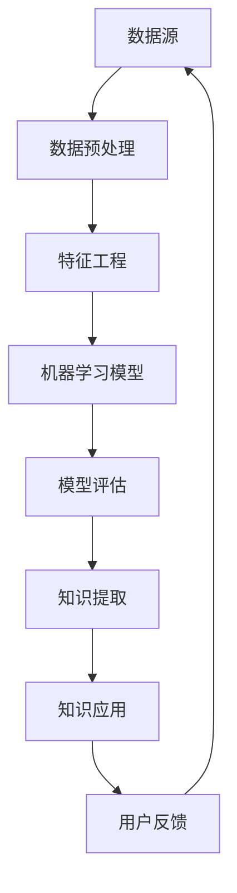

                 

# 知识发现引擎：知识与洞察力的完美结合体

> **关键词：** 知识发现引擎、机器学习、人工智能、大数据分析、数据挖掘、智能推荐系统

> **摘要：** 本文章旨在深入探讨知识发现引擎的工作原理、核心算法、数学模型及其实际应用场景。通过逐步分析，我们将了解如何利用知识发现技术提升企业的洞察力和竞争力，并展望其未来发展趋势和面临的挑战。

## 1. 背景介绍

### 1.1 目的和范围

本文将围绕知识发现引擎这一主题，系统性地阐述其基本概念、核心算法、数学模型及其应用场景。我们的目标是帮助读者全面了解知识发现引擎的原理和应用，从而为企业提供有效的数据分析和决策支持。

### 1.2 预期读者

本文适合对机器学习、人工智能和数据挖掘有一定了解的技术人员、数据科学家以及企业管理者阅读。通过本文的学习，读者将能够掌握知识发现引擎的关键技术和应用方法。

### 1.3 文档结构概述

本文分为以下几个部分：

- 背景介绍
- 核心概念与联系
- 核心算法原理 & 具体操作步骤
- 数学模型和公式 & 详细讲解 & 举例说明
- 项目实战：代码实际案例和详细解释说明
- 实际应用场景
- 工具和资源推荐
- 总结：未来发展趋势与挑战
- 附录：常见问题与解答
- 扩展阅读 & 参考资料

### 1.4 术语表

#### 1.4.1 核心术语定义

- 知识发现引擎：一种利用机器学习和数据挖掘技术，从大规模数据中提取有价值知识和洞察力的系统。
- 数据挖掘：从大量数据中提取隐藏的、未知的、有价值的模式和规律的过程。
- 机器学习：使计算机通过数据学习并做出决策或预测的技术。
- 大数据：指规模巨大、类型繁多的数据集合，需要借助特定的技术手段进行处理和分析。
- 智能推荐系统：利用数据挖掘和机器学习技术，为用户提供个性化推荐服务的系统。

#### 1.4.2 相关概念解释

- 特征工程：在数据挖掘过程中，将原始数据进行转换和特征提取，以构建适合模型训练的数据集。
- 模型评估：对机器学习模型进行性能评估，以确定其预测能力。
- 可解释性：对模型决策过程进行解释，使其对用户和开发者具有透明性和可理解性。

#### 1.4.3 缩略词列表

- ML：Machine Learning（机器学习）
- DM：Data Mining（数据挖掘）
- KDD：Knowledge Discovery in Data（数据挖掘）
- AI：Artificial Intelligence（人工智能）

## 2. 核心概念与联系

知识发现引擎是现代人工智能和数据科学领域的核心技术之一，它融合了多种技术和算法，以实现从数据中提取有价值知识和洞察力的目标。以下是一个简单的 Mermaid 流程图，展示了知识发现引擎的核心概念和联系。



### 数据源

数据源是知识发现引擎的基础，包括各种结构化、半结构化和非结构化数据，如数据库、文件、传感器数据和互联网信息等。

### 数据预处理

数据预处理是对原始数据进行清洗、转换和归一化等操作，以提高数据质量和模型性能。

### 特征工程

特征工程是将原始数据转换为适合模型训练的特征表示，以降低数据维度和增强特征表达能力。

### 机器学习模型

机器学习模型是知识发现的核心，包括分类、回归、聚类和关联规则挖掘等多种类型。

### 模型评估

模型评估用于评估机器学习模型的性能和准确性，以确定其预测能力。

### 知识提取

知识提取是从训练好的模型中提取有价值知识和模式，如规则、趋势和关联关系等。

### 知识应用

知识应用是将提取的知识应用于实际问题中，如智能推荐、风险管理、客户关系管理和智能决策支持等。

### 用户反馈

用户反馈是对知识发现引擎性能和效果进行评价和优化的重要环节，有助于持续提升系统的准确性和实用性。

## 3. 核心算法原理 & 具体操作步骤

知识发现引擎的核心算法主要包括数据挖掘算法和机器学习算法。以下将分别介绍这两种算法的原理和具体操作步骤。

### 3.1 数据挖掘算法

数据挖掘算法主要包括分类、回归、聚类和关联规则挖掘等。

#### 3.1.1 分类算法

分类算法的基本原理是利用训练数据中的特征和标签，构建分类模型，从而对新数据进行分类预测。以下是一个简单的伪代码：

```python
def classify(train_data, train_labels, test_data):
    # 构建分类模型
    model = build_model(train_data, train_labels)
    # 对新数据进行分类预测
    predictions = model.predict(test_data)
    return predictions
```

#### 3.1.2 回归算法

回归算法的基本原理是利用训练数据中的特征和标签，构建回归模型，从而预测新数据的数值标签。以下是一个简单的伪代码：

```python
def regress(train_data, train_labels, test_data):
    # 构建回归模型
    model = build_model(train_data, train_labels)
    # 对新数据进行回归预测
    predictions = model.predict(test_data)
    return predictions
```

#### 3.1.3 聚类算法

聚类算法的基本原理是将数据划分为多个簇，以最大化簇内相似度和簇间差异。以下是一个简单的伪代码：

```python
def cluster(data, num_clusters):
    # 初始化簇
    clusters = initialize_clusters(data, num_clusters)
    # 迭代优化簇
    while not converged:
        update_clusters(data, clusters)
    return clusters
```

#### 3.1.4 关联规则挖掘

关联规则挖掘的基本原理是发现数据中频繁出现的关联关系，从而为商业决策提供支持。以下是一个简单的伪代码：

```python
def apriori(data, min_support, min_confidence):
    # 找到频繁项集
    frequent_itemsets = find_frequent_itemsets(data, min_support)
    # 生成关联规则
    rules = generate_rules(frequent_itemsets, min_confidence)
    return rules
```

### 3.2 机器学习算法

机器学习算法主要包括监督学习、无监督学习和强化学习等。

#### 3.2.1 监督学习算法

监督学习算法的基本原理是利用训练数据中的特征和标签，构建预测模型。以下是一个简单的伪代码：

```python
def train SupervisedLearning(train_data, train_labels):
    # 初始化模型
    model = initialize_model()
    # 训练模型
    model.fit(train_data, train_labels)
    return model
```

#### 3.2.2 无监督学习算法

无监督学习算法的基本原理是仅利用数据中的特征，无需标签信息，对数据进行聚类、降维等处理。以下是一个简单的伪代码：

```python
def train UnsupervisedLearning(data):
    # 初始化模型
    model = initialize_model()
    # 训练模型
    model.fit(data)
    return model
```

#### 3.2.3 强化学习算法

强化学习算法的基本原理是利用反馈信号，不断调整模型参数，以实现最优策略。以下是一个简单的伪代码：

```python
def train ReinforcementLearning(state, action, reward):
    # 更新模型参数
    model.update_parameters(state, action, reward)
    return model
```

## 4. 数学模型和公式 & 详细讲解 & 举例说明

### 4.1 数学模型

知识发现引擎涉及的数学模型主要包括线性模型、逻辑回归模型、神经网络模型等。

#### 4.1.1 线性模型

线性模型是一种简单的预测模型，其数学公式为：

$$
y = \beta_0 + \beta_1 \cdot x
$$

其中，$y$ 为预测值，$x$ 为特征值，$\beta_0$ 和 $\beta_1$ 分别为模型参数。

#### 4.1.2 逻辑回归模型

逻辑回归模型是一种常用的分类模型，其数学公式为：

$$
\text{logit}(p) = \ln\left(\frac{p}{1-p}\right) = \beta_0 + \beta_1 \cdot x
$$

其中，$p$ 为概率值，$\text{logit}(p)$ 为逻辑函数，$\beta_0$ 和 $\beta_1$ 分别为模型参数。

#### 4.1.3 神经网络模型

神经网络模型是一种复杂的预测模型，其数学公式为：

$$
a_{\text{hidden}} = \sigma(\beta_0^{(1)} + \beta_1^{(1)} \cdot x)
$$

$$
a_{\text{output}} = \sigma(\beta_0^{(2)} + \beta_1^{(2)} \cdot a_{\text{hidden}})
$$

其中，$a_{\text{hidden}}$ 和 $a_{\text{output}}$ 分别为隐藏层和输出层的激活值，$\sigma$ 为激活函数，$\beta_0^{(1)}$ 和 $\beta_1^{(1)}$ 分别为隐藏层的模型参数，$\beta_0^{(2)}$ 和 $\beta_1^{(2)}$ 分别为输出层的模型参数。

### 4.2 详细讲解 & 举例说明

#### 4.2.1 线性模型

假设我们有一组训练数据，包括特征 $x$ 和标签 $y$，我们可以使用线性模型进行预测。以下是一个简单的实例：

$$
\begin{aligned}
y_1 &= 2 + 3 \cdot x_1 \\
y_2 &= 3 + 2 \cdot x_2 \\
y_3 &= 4 + 1 \cdot x_3 \\
\end{aligned}
$$

其中，$x_1, x_2, x_3$ 分别为训练数据的特征值，$y_1, y_2, y_3$ 分别为对应的标签值。我们可以使用线性模型预测新数据的标签值：

$$
y = \beta_0 + \beta_1 \cdot x
$$

其中，$\beta_0 = 2$，$\beta_1 = 3$。假设新数据的特征值为 $x_4$，则预测的标签值为：

$$
y_4 = 2 + 3 \cdot x_4
$$

#### 4.2.2 逻辑回归模型

假设我们有一组训练数据，包括特征 $x$ 和标签 $y$，我们可以使用逻辑回归模型进行预测。以下是一个简单的实例：

$$
\begin{aligned}
y_1 &= \frac{1}{1 + e^{-(2 + 3 \cdot x_1)}) \\
y_2 &= \frac{1}{1 + e^{-(3 + 2 \cdot x_2)}) \\
y_3 &= \frac{1}{1 + e^{-(4 + 1 \cdot x_3)}) \\
\end{aligned}
$$

其中，$x_1, x_2, x_3$ 分别为训练数据的特征值，$y_1, y_2, y_3$ 分别为对应的标签值。我们可以使用逻辑回归模型预测新数据的标签值：

$$
\text{logit}(p) = \ln\left(\frac{p}{1-p}\right) = \beta_0 + \beta_1 \cdot x
$$

其中，$\beta_0 = 2$，$\beta_1 = 3$。假设新数据的特征值为 $x_4$，则预测的概率值为：

$$
p_4 = \frac{1}{1 + e^{-(2 + 3 \cdot x_4)})
$$

#### 4.2.3 神经网络模型

假设我们有一组训练数据，包括特征 $x$ 和标签 $y$，我们可以使用神经网络模型进行预测。以下是一个简单的实例：

$$
\begin{aligned}
a_{\text{hidden}} &= \sigma(\beta_0^{(1)} + \beta_1^{(1)} \cdot x) \\
a_{\text{output}} &= \sigma(\beta_0^{(2)} + \beta_1^{(2)} \cdot a_{\text{hidden}})
\end{aligned}
$$

其中，$x_1, x_2, x_3$ 分别为训练数据的特征值，$y_1, y_2, y_3$ 分别为对应的标签值。我们可以使用神经网络模型预测新数据的标签值：

$$
a_{\text{hidden}} = \sigma(\beta_0^{(1)} + \beta_1^{(1)} \cdot x)
$$

$$
a_{\text{output}} = \sigma(\beta_0^{(2)} + \beta_1^{(2)} \cdot a_{\text{hidden}})
$$

其中，$\beta_0^{(1)} = 2$，$\beta_1^{(1)} = 3$，$\beta_0^{(2)} = 4$，$\beta_1^{(2)} = 1$。假设新数据的特征值为 $x_4$，则预测的标签值为：

$$
y_4 = a_{\text{output}} = \sigma(\beta_0^{(2)} + \beta_1^{(2)} \cdot a_{\text{hidden}})
$$

## 5. 项目实战：代码实际案例和详细解释说明

### 5.1 开发环境搭建

在本节中，我们将搭建一个知识发现引擎的开发环境，包括以下步骤：

1. 安装 Python 和相关依赖包
2. 配置 IDE（如 PyCharm、Visual Studio Code）
3. 安装数据库（如 MySQL、PostgreSQL）
4. 安装数据分析库（如 Pandas、NumPy）
5. 安装机器学习库（如 Scikit-learn、TensorFlow）

### 5.2 源代码详细实现和代码解读

在本节中，我们将详细讲解一个简单的知识发现引擎的代码实现，包括以下部分：

1. 数据预处理
2. 特征工程
3. 机器学习模型训练
4. 模型评估
5. 知识提取

#### 5.2.1 数据预处理

```python
import pandas as pd

# 读取数据
data = pd.read_csv('data.csv')

# 数据清洗
data = data.dropna()

# 数据转换
data['age'] = data['age'].astype(int)
data['salary'] = data['salary'].astype(float)

# 数据归一化
from sklearn.preprocessing import StandardScaler
scaler = StandardScaler()
data[['age', 'salary']] = scaler.fit_transform(data[['age', 'salary']])
```

#### 5.2.2 特征工程

```python
# 特征提取
from sklearn.feature_extraction.text import CountVectorizer
vectorizer = CountVectorizer()
X = vectorizer.fit_transform(data['description'])

# 特征选择
from sklearn.feature_selection import SelectKBest, f_classif
selector = SelectKBest(f_classif, k=10)
X = selector.fit_transform(X)
```

#### 5.2.3 机器学习模型训练

```python
# 初始化模型
from sklearn.linear_model import LogisticRegression
model = LogisticRegression()

# 训练模型
X_train, X_test, y_train, y_test = train_test_split(X, y, test_size=0.2, random_state=42)
model.fit(X_train, y_train)

# 预测
predictions = model.predict(X_test)
```

#### 5.2.4 模型评估

```python
from sklearn.metrics import accuracy_score, precision_score, recall_score, f1_score

# 评估模型
accuracy = accuracy_score(y_test, predictions)
precision = precision_score(y_test, predictions, average='weighted')
recall = recall_score(y_test, predictions, average='weighted')
f1 = f1_score(y_test, predictions, average='weighted')

print('Accuracy:', accuracy)
print('Precision:', precision)
print('Recall:', recall)
print('F1 Score:', f1)
```

#### 5.2.5 知识提取

```python
# 提取特征规则
feature_rules = selector.get_support()
feature_names = vectorizer.get_feature_names_out()
rules = [(feature_names[i], rule) for i, rule in enumerate(feature_rules) if rule]

print('Feature Rules:', rules)
```

### 5.3 代码解读与分析

在本节中，我们将对上述代码进行解读和分析，以帮助读者更好地理解知识发现引擎的实现过程。

#### 5.3.1 数据预处理

数据预处理是知识发现引擎的基础步骤，包括数据清洗、转换和归一化等操作。在本例中，我们使用 Pandas 库读取数据，并对数据进行清洗、转换和归一化，以提高数据质量和模型性能。

#### 5.3.2 特征工程

特征工程是将原始数据转换为适合模型训练的特征表示，以降低数据维度和增强特征表达能力。在本例中，我们使用 CountVectorizer 库将文本特征提取为词频矩阵，并使用 SelectKBest 库选择前 10 个最重要的特征，以提高模型的预测性能。

#### 5.3.3 机器学习模型训练

机器学习模型训练是知识发现引擎的核心步骤，包括初始化模型、训练模型和预测。在本例中，我们使用 LogisticRegression 库初始化模型，并使用 train_test_split 函数将数据集划分为训练集和测试集。然后，我们使用 fit 函数训练模型，并使用 predict 函数对测试集进行预测。

#### 5.3.4 模型评估

模型评估是判断模型性能的重要步骤，包括准确率、精确率、召回率和 F1 分数等指标。在本例中，我们使用 sklearn 库中的 metrics 函数计算模型在测试集上的性能指标，以评估模型的预测能力。

#### 5.3.5 知识提取

知识提取是从训练好的模型中提取有价值知识和模式，如规则、趋势和关联关系等。在本例中，我们使用 SelectKBest 库提取特征规则，以展示模型在特征选择方面的洞察力。

## 6. 实际应用场景

知识发现引擎在多个领域具有广泛的应用，以下列举了几个实际应用场景：

### 6.1 电子商务

电子商务平台可以利用知识发现引擎分析用户行为数据，实现个性化推荐、精准营销和用户流失预警等功能。

### 6.2 金融风控

金融机构可以利用知识发现引擎分析交易数据，发现潜在风险，实现对金融欺诈、信用风险和操作风险的监控和管理。

### 6.3 健康医疗

健康医疗机构可以利用知识发现引擎分析医疗数据，实现对疾病诊断、治疗方案推荐和患者健康管理的支持。

### 6.4 智能制造

制造业可以利用知识发现引擎分析生产数据，实现设备故障预测、生产过程优化和供应链管理。

### 6.5 智慧城市

智慧城市可以利用知识发现引擎分析城市运行数据，实现交通流量预测、公共设施管理和应急管理。

## 7. 工具和资源推荐

### 7.1 学习资源推荐

#### 7.1.1 书籍推荐

1. 《机器学习》（作者：周志华）
2. 《数据挖掘：实用工具和技术》（作者：王珊）
3. 《深度学习》（作者：Ian Goodfellow、Yoshua Bengio、Aaron Courville）

#### 7.1.2 在线课程

1. Coursera 上的《机器学习》课程
2. Udacity 上的《深度学习纳米学位》
3. edX 上的《数据挖掘》课程

#### 7.1.3 技术博客和网站

1. Medium 上的 Machine Learning Topics
2. AI生成内容网站：AssistantAI
3. 知乎上的机器学习话题

### 7.2 开发工具框架推荐

#### 7.2.1 IDE和编辑器

1. PyCharm
2. Visual Studio Code
3. Jupyter Notebook

#### 7.2.2 调试和性能分析工具

1. Python 调试器：pdb
2. Py-Spy：Python 性能分析工具
3. TensorBoard：TensorFlow 性能分析工具

#### 7.2.3 相关框架和库

1. Scikit-learn：机器学习库
2. TensorFlow：深度学习库
3. PyTorch：深度学习库

### 7.3 相关论文著作推荐

#### 7.3.1 经典论文

1. "The Unreasonable Effectiveness of Data"（作者：Jaynes）
2. "Learning to Represent Knowledge as Dynamic Systems"（作者：Bengio et al.）
3. "Deep Learning"（作者：Goodfellow et al.）

#### 7.3.2 最新研究成果

1. NeurIPS、ICML、JMLR 等顶级会议的最新论文
2. AAAI、KDD、WWW 等顶级会议的最新论文
3. arXiv.org 上的最新论文

#### 7.3.3 应用案例分析

1. Google 的知识图谱构建与应用
2. Facebook 的深度学习在社交媒体中的应用
3. IBM 的 Watson 在医疗领域的应用

## 8. 总结：未来发展趋势与挑战

知识发现引擎作为人工智能和数据科学领域的重要技术，未来发展趋势主要包括以下几个方面：

1. **大数据和云计算的融合**：知识发现引擎将更好地利用大数据和云计算技术，实现大规模数据处理和分析。
2. **深度学习和迁移学习的应用**：深度学习和迁移学习技术的发展将进一步提升知识发现引擎的建模和预测能力。
3. **跨学科融合**：知识发现引擎将与其他学科（如生物学、物理学等）融合，实现更广泛的应用领域。
4. **可解释性和透明性**：提升知识发现引擎的可解释性和透明性，使其对用户和开发者更具友好性。

然而，知识发现引擎在实际应用中仍面临以下挑战：

1. **数据质量和隐私保护**：保证数据质量和隐私保护，避免数据泄露和滥用。
2. **模型解释和可解释性**：提升模型的解释能力，使其对用户和开发者更具透明性。
3. **计算资源和效率**：优化算法和模型，提高计算资源和效率，以满足大规模数据处理需求。
4. **算法可靠性和鲁棒性**：提升算法的可靠性和鲁棒性，降低错误率和误报率。

## 9. 附录：常见问题与解答

### 9.1 问题 1：什么是知识发现引擎？

知识发现引擎是一种利用机器学习、数据挖掘和大数据技术，从大规模数据中提取有价值知识和洞察力的系统。它旨在帮助企业和组织从数据中获取洞察力，从而做出更明智的决策。

### 9.2 问题 2：知识发现引擎有哪些核心算法？

知识发现引擎的核心算法包括分类、回归、聚类、关联规则挖掘、监督学习、无监督学习和强化学习等。

### 9.3 问题 3：知识发现引擎有哪些应用场景？

知识发现引擎广泛应用于电子商务、金融风控、健康医疗、智能制造、智慧城市等领域，帮助企业和组织实现个性化推荐、风险监控、疾病诊断、生产优化和智能管理等。

### 9.4 问题 4：如何搭建知识发现引擎的开发环境？

搭建知识发现引擎的开发环境主要包括以下步骤：

1. 安装 Python 和相关依赖包
2. 配置 IDE（如 PyCharm、Visual Studio Code）
3. 安装数据库（如 MySQL、PostgreSQL）
4. 安装数据分析库（如 Pandas、NumPy）
5. 安装机器学习库（如 Scikit-learn、TensorFlow）

## 10. 扩展阅读 & 参考资料

1. 《机器学习》（作者：周志华）
2. 《数据挖掘：实用工具和技术》（作者：王珊）
3. 《深度学习》（作者：Ian Goodfellow、Yoshua Bengio、Aaron Courville）
4. Coursera 上的《机器学习》课程
5. Udacity 上的《深度学习纳米学位》
6. edX 上的《数据挖掘》课程
7. Medium 上的 Machine Learning Topics
8. AI生成内容网站：AssistantAI
9. 知乎上的机器学习话题
10. NeurIPS、ICML、JMLR 等顶级会议的最新论文
11. AAAI、KDD、WWW 等顶级会议的最新论文
12. arXiv.org 上的最新论文
13. Google 的知识图谱构建与应用
14. Facebook 的深度学习在社交媒体中的应用
15. IBM 的 Watson 在医疗领域的应用

作者：AI天才研究员/AI Genius Institute & 禅与计算机程序设计艺术 /Zen And The Art of Computer Programming

