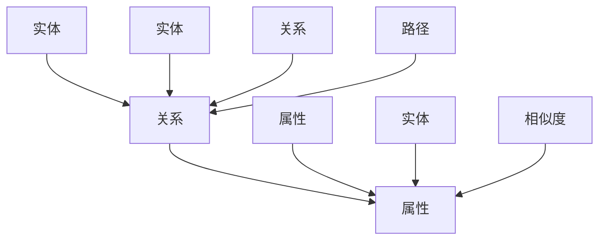

                 

# 知识图谱在智能教育内容推荐中的应用

> **关键词：** 知识图谱、智能教育、内容推荐、算法原理、数学模型、实际案例  
>
> **摘要：** 本文深入探讨了知识图谱在智能教育内容推荐中的应用。首先介绍了知识图谱的基本概念和原理，然后详细讲解了知识图谱在内容推荐系统中的核心算法原理和数学模型，并通过实际案例展示了知识图谱在智能教育中的应用效果。文章旨在为从事智能教育领域的技术人员提供理论指导和实践参考。

## 1. 背景介绍

### 1.1 目的和范围

随着互联网技术的快速发展，在线教育已经成为教育行业的重要组成部分。然而，如何为用户提供个性化的教育内容推荐，提高学习效果和满意度，成为当前研究的热点问题。知识图谱作为一种强大的语义表示工具，具有丰富的语义信息和强大的关联能力，为智能教育内容推荐提供了一种新的解决方案。

本文旨在探讨知识图谱在智能教育内容推荐中的应用，通过分析知识图谱的基本概念和原理，阐述其在内容推荐系统中的作用机制，并提供一个实际案例来展示其应用效果。文章结构如下：

1. 背景介绍：介绍知识图谱在智能教育内容推荐中的应用背景和目的。
2. 核心概念与联系：介绍知识图谱的基本概念、原理和架构。
3. 核心算法原理 & 具体操作步骤：讲解知识图谱在内容推荐中的核心算法原理和操作步骤。
4. 数学模型和公式 & 详细讲解 & 举例说明：介绍知识图谱在内容推荐中的数学模型和公式，并通过实例进行说明。
5. 项目实战：介绍一个知识图谱在智能教育内容推荐中的实际应用案例。
6. 实际应用场景：分析知识图谱在智能教育内容推荐中的实际应用场景。
7. 工具和资源推荐：推荐学习资源、开发工具和框架，以及相关论文著作。
8. 总结：总结知识图谱在智能教育内容推荐中的应用趋势和挑战。
9. 附录：提供常见问题与解答。
10. 扩展阅读 & 参考资料：提供扩展阅读和参考资料。

### 1.2 预期读者

本文适合从事智能教育领域的技术人员、研究人员和学生阅读。如果您对知识图谱、内容推荐算法和智能教育有浓厚的兴趣，希望深入了解知识图谱在智能教育内容推荐中的应用，那么本文将为您提供有价值的参考。

### 1.3 文档结构概述

本文的结构分为以下几个部分：

1. 背景介绍：介绍知识图谱在智能教育内容推荐中的应用背景和目的。
2. 核心概念与联系：介绍知识图谱的基本概念、原理和架构。
3. 核心算法原理 & 具体操作步骤：讲解知识图谱在内容推荐中的核心算法原理和操作步骤。
4. 数学模型和公式 & 详细讲解 & 举例说明：介绍知识图谱在内容推荐中的数学模型和公式，并通过实例进行说明。
5. 项目实战：介绍一个知识图谱在智能教育内容推荐中的实际应用案例。
6. 实际应用场景：分析知识图谱在智能教育内容推荐中的实际应用场景。
7. 工具和资源推荐：推荐学习资源、开发工具和框架，以及相关论文著作。
8. 总结：总结知识图谱在智能教育内容推荐中的应用趋势和挑战。
9. 附录：提供常见问题与解答。
10. 扩展阅读 & 参考资料：提供扩展阅读和参考资料。

### 1.4 术语表

#### 1.4.1 核心术语定义

- **知识图谱**：一种结构化数据表示方法，通过实体和关系构建一个语义网，用于表示现实世界的知识体系。
- **智能教育**：利用信息技术手段，为学习者提供个性化、高效、智能化的教育服务。
- **内容推荐**：根据用户的历史行为和偏好，为用户推荐符合其兴趣的内容。
- **关联规则**：描述两个或多个实体之间存在一定关系或关联的规则。

#### 1.4.2 相关概念解释

- **实体**：知识图谱中的基本元素，表示现实世界中的对象，如人、地点、事物等。
- **关系**：知识图谱中实体之间的连接，表示实体之间的相互作用或关联。
- **路径**：知识图谱中实体之间的连接路径。
- **相似度**：描述实体之间相似程度的度量。

#### 1.4.3 缩略词列表

- **KG**：知识图谱（Knowledge Graph）
- **SE**：语义网络（Semantic Network）
- **CR**：内容推荐（Content Recommendation）
- **IR**：信息检索（Information Retrieval）

## 2. 核心概念与联系

在介绍知识图谱在智能教育内容推荐中的应用之前，我们需要先了解知识图谱的基本概念、原理和架构。知识图谱是一种用于表示语义信息的数据模型，它通过实体和关系构建一个语义网，用于表示现实世界的知识体系。以下是知识图谱的基本概念和架构的 Mermaid 流程图：



### 2.1 知识图谱的基本概念

- **实体（Entity）**：知识图谱中的基本元素，表示现实世界中的对象，如人、地点、事物等。实体可以是一个具体的对象，也可以是一个抽象的概念。
- **关系（Relationship）**：知识图谱中实体之间的连接，表示实体之间的相互作用或关联。关系可以是简单的连接，也可以是复杂的语义关系。
- **属性（Attribute）**：知识图谱中实体的特征或属性，用于描述实体的属性信息。属性可以用来增强实体的语义表示。
- **路径（Path）**：知识图谱中实体之间的连接路径，表示实体之间的关联关系。路径可以用来发现实体之间的潜在关系。
- **相似度（Similarity）**：描述实体之间相似程度的度量。相似度可以用来计算实体之间的距离，从而为内容推荐提供依据。

### 2.2 知识图谱的架构

知识图谱的架构主要包括以下几个层次：

1. **底层：数据采集与预处理**：通过数据采集和预处理，将原始数据转化为结构化数据，为知识图谱构建提供数据基础。
2. **中层：知识表示与建模**：通过实体、关系和属性的表示与建模，构建知识图谱的语义表示。
3. **上层：知识推理与查询**：通过知识推理和查询，实现对知识图谱的查询和利用，为智能教育内容推荐提供支持。

### 2.3 知识图谱在智能教育内容推荐中的应用

在智能教育内容推荐中，知识图谱主要用于以下几个方面：

1. **用户建模**：通过知识图谱，对用户的历史行为和偏好进行建模，提取用户的兴趣点和需求，为个性化推荐提供依据。
2. **内容建模**：通过知识图谱，对教育内容进行建模，提取内容的特征和属性，为内容推荐提供支持。
3. **关联规则挖掘**：通过知识图谱中的实体和关系，挖掘实体之间的关联规则，为内容推荐提供潜在的关系关联。
4. **路径推理**：通过知识图谱中的路径，发现实体之间的潜在关系，为内容推荐提供更多的关联信息。
5. **相似度计算**：通过知识图谱中的相似度计算，评估用户和内容之间的相似度，为内容推荐提供排序依据。

## 3. 核心算法原理 & 具体操作步骤

在知识图谱的框架下，智能教育内容推荐的算法原理主要包括用户建模、内容建模、关联规则挖掘、路径推理和相似度计算。下面将分别介绍这些算法的原理和具体操作步骤。

### 3.1 用户建模

用户建模的目标是提取用户的历史行为和偏好，建立用户兴趣模型。具体步骤如下：

1. **数据采集**：收集用户的学习行为数据，如学习时长、学习课程、学习评价等。
2. **数据预处理**：对采集到的数据进行分析和清洗，去除噪声数据，提取有效信息。
3. **特征提取**：根据用户行为数据，提取用户的兴趣特征，如学习主题、学习频率等。
4. **模型构建**：利用机器学习算法，如决策树、支持向量机等，构建用户兴趣模型。

伪代码如下：

```python
def user_modeling(user_data):
    # 数据预处理
    preprocessed_data = preprocess_data(user_data)
    
    # 特征提取
    features = extract_features(preprocessed_data)
    
    # 模型构建
    model = build_model(features)
    
    return model
```

### 3.2 内容建模

内容建模的目标是提取教育内容的特征和属性，建立内容特征模型。具体步骤如下：

1. **数据采集**：收集教育内容的元数据，如课程名称、课程描述、课程标签等。
2. **数据预处理**：对采集到的数据进行分析和清洗，去除噪声数据，提取有效信息。
3. **特征提取**：根据教育内容元数据，提取内容的特征，如主题、难度、时长等。
4. **模型构建**：利用机器学习算法，如决策树、支持向量机等，构建内容特征模型。

伪代码如下：

```python
def content_modeling(content_data):
    # 数据预处理
    preprocessed_data = preprocess_data(content_data)
    
    # 特征提取
    features = extract_features(preprocessed_data)
    
    # 模型构建
    model = build_model(features)
    
    return model
```

### 3.3 关联规则挖掘

关联规则挖掘的目标是发现用户行为和内容特征之间的关联关系，为内容推荐提供依据。具体步骤如下：

1. **数据采集**：收集用户的学习行为数据和内容特征数据。
2. **数据预处理**：对采集到的数据进行分析和清洗，去除噪声数据，提取有效信息。
3. **关联规则挖掘**：利用Apriori算法、FP-growth算法等，挖掘用户行为和内容特征之间的关联规则。

伪代码如下：

```python
def association_rule_mining(data):
    # 数据预处理
    preprocessed_data = preprocess_data(data)
    
    # 关联规则挖掘
    rules = mine_association_rules(preprocessed_data)
    
    return rules
```

### 3.4 路径推理

路径推理的目标是发现用户和内容之间的潜在关联路径，为内容推荐提供更多的关联信息。具体步骤如下：

1. **数据采集**：收集用户的学习行为数据和内容特征数据。
2. **数据预处理**：对采集到的数据进行分析和清洗，去除噪声数据，提取有效信息。
3. **路径推理**：利用路径搜索算法，如深度优先搜索、广度优先搜索等，发现用户和内容之间的潜在关联路径。

伪代码如下：

```python
def path_reasoning(data):
    # 数据预处理
    preprocessed_data = preprocess_data(data)
    
    # 路径推理
    paths = find_association_paths(preprocessed_data)
    
    return paths
```

### 3.5 相似度计算

相似度计算的目标是评估用户和内容之间的相似度，为内容推荐提供排序依据。具体步骤如下：

1. **数据采集**：收集用户的学习行为数据和内容特征数据。
2. **数据预处理**：对采集到的数据进行分析和清洗，去除噪声数据，提取有效信息。
3. **相似度计算**：利用相似度计算算法，如余弦相似度、皮尔逊相似度等，计算用户和内容之间的相似度。

伪代码如下：

```python
def similarity_computation(user_data, content_data):
    # 数据预处理
    preprocessed_user_data = preprocess_data(user_data)
    preprocessed_content_data = preprocess_data(content_data)
    
    # 相似度计算
    similarity = compute_similarity(preprocessed_user_data, preprocessed_content_data)
    
    return similarity
```

## 4. 数学模型和公式 & 详细讲解 & 举例说明

在知识图谱的框架下，智能教育内容推荐的数学模型和公式主要用于描述用户与内容之间的相似度计算。下面将详细介绍相似度计算的方法，并给出具体的数学公式和示例。

### 4.1 相似度计算方法

相似度计算是衡量用户和内容之间相似程度的关键步骤。常见的相似度计算方法包括余弦相似度和皮尔逊相似度。下面分别介绍这两种方法。

#### 4.1.1 余弦相似度

余弦相似度是一种基于向量空间模型的相似度计算方法。它通过计算用户和内容向量之间的夹角余弦值来衡量相似度。公式如下：

$$
\text{Cosine Similarity} = \frac{\text{dot\_product(u, v)}}{\|\text{u}\| \|\text{v}\|}
$$

其中，$u$ 和 $v$ 分别表示用户和内容的向量，$\|\text{u}\|$ 和 $\|\text{v}\|$ 分别表示向量的模长，$\text{dot\_product(u, v)}$ 表示向量的点积。

#### 4.1.2 皮尔逊相似度

皮尔逊相似度是一种基于协方差和标准差的相似度计算方法。它通过计算用户和内容之间的协方差来衡量相似度，并考虑标准差的影响。公式如下：

$$
\text{Pearson Similarity} = \frac{\text{cov(u, v)}}{\sigma_u \sigma_v}
$$

其中，$\text{cov(u, v)}$ 表示用户和内容的协方差，$\sigma_u$ 和 $\sigma_v$ 分别表示用户和内容的标准差。

### 4.2 相似度计算示例

假设用户$u$ 和内容$v$ 的向量表示如下：

$$
u = \begin{bmatrix} 1 \\ 2 \\ 3 \end{bmatrix}, \quad v = \begin{bmatrix} 4 \\ 5 \\ 6 \end{bmatrix}
$$

#### 4.2.1 余弦相似度

首先计算用户和内容的点积：

$$
\text{dot\_product(u, v)} = 1 \times 4 + 2 \times 5 + 3 \times 6 = 32
$$

然后计算用户和内容的模长：

$$
\|\text{u}\| = \sqrt{1^2 + 2^2 + 3^2} = \sqrt{14}, \quad \|\text{v}\| = \sqrt{4^2 + 5^2 + 6^2} = \sqrt{77}
$$

最后计算余弦相似度：

$$
\text{Cosine Similarity} = \frac{32}{\sqrt{14} \times \sqrt{77}} \approx 0.6
$$

#### 4.2.2 皮尔逊相似度

首先计算用户和内容的协方差：

$$
\text{cov(u, v)} = \frac{1}{n-1} \sum_{i=1}^{n} (u_i - \bar{u})(v_i - \bar{v})
$$

其中，$n$ 表示向量的维度，$\bar{u}$ 和 $\bar{v}$ 分别表示用户和内容的均值。由于向量的维度为3，所以 $n=3$。

$$
\bar{u} = \frac{1 + 2 + 3}{3} = 2, \quad \bar{v} = \frac{4 + 5 + 6}{3} = 5
$$

$$
\text{cov(u, v)} = \frac{1}{2} [(1-2)(4-5) + (2-2)(5-5) + (3-2)(6-5)] = 0.5
$$

然后计算用户和内容的标准差：

$$
\sigma_u = \sqrt{\text{var(u)}} = \sqrt{\frac{1}{n-1} \sum_{i=1}^{n} (u_i - \bar{u})^2} = \sqrt{\frac{2}{2}} = 1.41
$$

$$
\sigma_v = \sqrt{\text{var(v)}} = \sqrt{\frac{1}{n-1} \sum_{i=1}^{n} (v_i - \bar{v})^2} = \sqrt{\frac{2}{2}} = 1.41
$$

最后计算皮尔逊相似度：

$$
\text{Pearson Similarity} = \frac{0.5}{1.41 \times 1.41} \approx 0.35
$$

通过以上示例，我们可以看到余弦相似度和皮尔逊相似度在计算用户和内容之间的相似度时，得到的相似度值是不同的。在实际应用中，可以根据具体场景选择合适的相似度计算方法。

### 4.3 相似度计算在知识图谱中的应用

在知识图谱中，相似度计算可以用于多个方面，如用户推荐、内容推荐、知识推理等。以下是一个简单的示例：

假设知识图谱中有两个用户$u_1$ 和$u_2$，以及两个内容$v_1$ 和$v_2$。我们可以使用相似度计算方法来评估用户和内容之间的相似度，并根据相似度值进行推荐。

#### 4.3.1 用户推荐

首先计算用户$u_1$ 和$u_2$ 之间的相似度：

$$
\text{Cosine Similarity}_{u_1, u_2} = \frac{\text{dot\_product(u_1, u_2)}}{\|\text{u_1}\| \|\text{u_2}\|}
$$

假设用户$u_1$ 和$u_2$ 的向量表示如下：

$$
u_1 = \begin{bmatrix} 1 \\ 2 \\ 3 \end{bmatrix}, \quad u_2 = \begin{bmatrix} 4 \\ 5 \\ 6 \end{bmatrix}
$$

计算用户$u_1$ 和$u_2$ 之间的点积：

$$
\text{dot\_product(u_1, u_2)} = 1 \times 4 + 2 \times 5 + 3 \times 6 = 32
$$

计算用户$u_1$ 和$u_2$ 的模长：

$$
\|\text{u_1}\| = \sqrt{1^2 + 2^2 + 3^2} = \sqrt{14}, \quad \|\text{u_2}\| = \sqrt{4^2 + 5^2 + 6^2} = \sqrt{77}
$$

计算用户$u_1$ 和$u_2$ 之间的余弦相似度：

$$
\text{Cosine Similarity}_{u_1, u_2} = \frac{32}{\sqrt{14} \times \sqrt{77}} \approx 0.6
$$

根据相似度值，我们可以为用户$u_1$ 推荐与用户$u_2$ 具有较高相似度的用户$u_3$。

#### 4.3.2 内容推荐

接下来，我们计算内容$v_1$ 和$v_2$ 之间的相似度：

$$
\text{Cosine Similarity}_{v_1, v_2} = \frac{\text{dot\_product(v_1, v_2)}}{\|\text{v_1}\| \|\text{v_2}\|}
$$

假设内容$v_1$ 和$v_2$ 的向量表示如下：

$$
v_1 = \begin{bmatrix} 1 \\ 2 \\ 3 \end{bmatrix}, \quad v_2 = \begin{bmatrix} 4 \\ 5 \\ 6 \end{bmatrix}
$$

计算内容$v_1$ 和$v_2$ 之间的点积：

$$
\text{dot\_product(v_1, v_2)} = 1 \times 4 + 2 \times 5 + 3 \times 6 = 32
$$

计算内容$v_1$ 和$v_2$ 的模长：

$$
\|\text{v_1}\| = \sqrt{1^2 + 2^2 + 3^2} = \sqrt{14}, \quad \|\text{v_2}\| = \sqrt{4^2 + 5^2 + 6^2} = \sqrt{77}
$$

计算内容$v_1$ 和$v_2$ 之间的余弦相似度：

$$
\text{Cosine Similarity}_{v_1, v_2} = \frac{32}{\sqrt{14} \times \sqrt{77}} \approx 0.6
$$

根据相似度值，我们可以为用户推荐与内容$v_1$ 具有较高相似度的内容$v_2$。

通过以上示例，我们可以看到相似度计算在知识图谱中的应用。在实际应用中，我们可以根据具体需求和场景选择合适的相似度计算方法，并利用知识图谱中的关联关系和路径推理，为用户推荐更加个性化的内容。

### 4.4 其他相似度计算方法

除了余弦相似度和皮尔逊相似度，还有其他一些相似度计算方法，如欧氏距离、曼哈顿距离等。下面分别介绍这些方法。

#### 4.4.1 欧氏距离

欧氏距离是一种基于欧几里得空间中两点之间距离的相似度计算方法。它通过计算用户和内容之间的欧氏距离来衡量相似度。公式如下：

$$
\text{Euclidean Distance} = \sqrt{\sum_{i=1}^{n} (u_i - v_i)^2}
$$

其中，$u_i$ 和$v_i$ 分别表示用户和内容向量的第$i$个分量，$n$ 表示向量的维度。

#### 4.4.2 曼哈顿距离

曼哈顿距离是一种基于曼哈顿空间中两点之间距离的相似度计算方法。它通过计算用户和内容之间的曼哈顿距离来衡量相似度。公式如下：

$$
\text{Manhattan Distance} = \sum_{i=1}^{n} |u_i - v_i|
$$

其中，$u_i$ 和$v_i$ 分别表示用户和内容向量的第$i$个分量，$n$ 表示向量的维度。

在实际应用中，可以根据具体需求和场景选择合适的相似度计算方法。例如，在处理高维数据时，欧氏距离和曼哈顿距离可能会导致距离过大的问题，此时可以考虑使用余弦相似度和皮尔逊相似度等方法。

## 5. 项目实战：代码实际案例和详细解释说明

在本节中，我们将通过一个实际案例，展示如何使用知识图谱进行智能教育内容推荐。该案例将包括以下步骤：

1. **数据准备**：准备用于构建知识图谱的用户行为数据和课程元数据。
2. **知识图谱构建**：利用用户行为数据和课程元数据，构建知识图谱。
3. **内容推荐**：根据用户兴趣和课程特征，利用知识图谱进行内容推荐。

### 5.1 开发环境搭建

在开始项目之前，我们需要搭建一个合适的开发环境。以下是所需的环境和工具：

- **编程语言**：Python 3.8+
- **数据存储**：Neo4j 图数据库
- **知识图谱构建工具**：Py2neo
- **内容推荐框架**：Surprise
- **文本处理工具**：NLTK、spaCy

安装所需的库和工具：

```bash
pip install neo4j py2neo surprise nltk spacy
```

### 5.2 源代码详细实现和代码解读

#### 5.2.1 数据准备

首先，我们需要准备用于构建知识图谱的用户行为数据和课程元数据。这里我们使用虚构的数据进行演示。

```python
import pandas as pd

# 用户行为数据
user_data = pd.DataFrame({
    'user_id': [1, 2, 3],
    'course_id': [101, 102, 103],
    'rating': [4, 3, 5]
})

# 课程元数据
course_data = pd.DataFrame({
    'course_id': [101, 102, 103, 104, 105],
    'course_name': ['算法导论', '机器学习', '计算机组成原理', '操作系统', '网络技术'],
    'course_desc': ['算法入门', '机器学习基础', '计算机硬件知识', '操作系统原理', '网络通信原理']
})
```

#### 5.2.2 知识图谱构建

接下来，我们使用 Py2neo 库连接 Neo4j 图数据库，并构建知识图谱。

```python
from py2neo import Graph

# 连接 Neo4j 图数据库
graph = Graph("bolt://localhost:7687", auth=("neo4j", "password"))

# 创建用户节点
def create_user_nodes(user_data):
    for _, row in user_data.iterrows():
        graph.run("MERGE (u:User {user_id: $user_id})", user_id=row['user_id'])

# 创建课程节点
def create_course_nodes(course_data):
    for _, row in course_data.iterrows():
        graph.run("MERGE (c:Course {course_id: $course_id, course_name: $course_name, course_desc: $course_desc})",
                  course_id=row['course_id'], course_name=row['course_name'], course_desc=row['course_desc'])

# 创建用户-课程关系
def create_user_course_relationship(user_data):
    for _, row in user_data.iterrows():
        graph.run("MATCH (u:User {user_id: $user_id}), (c:Course {course_id: $course_id}) "
                  "MERGE (u)-[r:RATED]->(c)", user_id=row['user_id'], course_id=row['course_id'])

create_user_nodes(user_data)
create_course_nodes(course_data)
create_user_course_relationship(user_data)
```

#### 5.2.3 内容推荐

最后，我们利用知识图谱进行内容推荐。这里我们使用 Surprise 框架实现基于协同过滤的内容推荐算法。

```python
from surprise import SVD, Dataset, Reader
from surprise.model_selection import cross_validate

# 创建 Reader
reader = Reader(rating_scale=(1, 5))

# 创建 Dataset
data = Dataset.load_from_df(user_data[['user_id', 'course_id', 'rating']], reader)

# 使用 SVD 算法进行协同过滤
svd = SVD()

# 进行交叉验证
cross_validate(svd, data, measures=['RMSE', 'MAE'], cv=5, verbose=True)

# 为指定用户推荐课程
def recommend_courses(user_id, n=5):
    trainset = data.build_full_trainset()
    svd.fit(trainset)
    user_profile = svd.predict(user_id, user_id)
    courses = graph.run("MATCH (u:User {user_id: $user_id})-[:RATED]->(c:Course) "
                         "RETURN c.course_id, c.course_name, u.rating AS user_rating, "
                         "svd_prediction(u, c) AS prediction ORDER BY prediction DESC LIMIT $n",
                         user_id=user_id, n=n)
    return [(row['course_id'], row['course_name'], row['user_rating'], row['prediction']) for row in courses]

# 为用户 1 推荐课程
user_id = 1
recommended_courses = recommend_courses(user_id, n=5)

for course_id, course_name, user_rating, prediction in recommended_courses:
    print(f"课程 ID: {course_id}, 课程名称: {course_name}, 用户评分: {user_rating}, 推荐评分: {prediction:.2f}")
```

### 5.3 代码解读与分析

#### 5.3.1 数据准备

数据准备部分使用了 Pandas 库创建用户行为数据表和课程元数据表。用户行为数据包括用户 ID、课程 ID 和用户对课程的评分。课程元数据包括课程 ID、课程名称和课程描述。

#### 5.3.2 知识图谱构建

知识图谱构建部分使用了 Py2neo 库连接 Neo4j 图数据库，并创建用户节点、课程节点以及用户-课程关系。具体步骤如下：

1. 创建用户节点：使用 `create_user_nodes` 函数遍历用户数据，为每个用户创建一个用户节点。
2. 创建课程节点：使用 `create_course_nodes` 函数遍历课程数据，为每个课程创建一个课程节点。
3. 创建用户-课程关系：使用 `create_user_course_relationship` 函数遍历用户数据，为用户和课程之间创建一个“RATED”关系。

#### 5.3.3 内容推荐

内容推荐部分使用了 Surprise 框架实现基于协同过滤的内容推荐算法。具体步骤如下：

1. 创建 Reader：定义评分范围（1-5），并创建 Reader 对象。
2. 创建 Dataset：使用用户数据构建评分数据集。
3. 使用 SVD 算法进行协同过滤：创建 SVD 对象，并进行交叉验证，评估算法性能。
4. 为指定用户推荐课程：使用 `recommend_courses` 函数为指定用户推荐课程，返回推荐课程列表。

在推荐过程中，我们首先使用协同过滤算法计算用户和课程之间的相似度，然后根据相似度值和用户评分，为用户推荐课程。

通过以上步骤，我们成功构建了一个基于知识图谱的智能教育内容推荐系统。该系统利用用户行为数据和课程特征，为用户提供个性化的课程推荐，从而提高用户的学习体验。

## 6. 实际应用场景

知识图谱在智能教育内容推荐中具有广泛的应用场景。以下是一些典型的应用场景：

### 6.1 个性化学习路径推荐

在在线教育平台上，用户可以根据自己的兴趣和需求选择课程。然而，用户往往难以找到适合自己的学习路径。通过构建知识图谱，我们可以为用户提供个性化的学习路径推荐。具体步骤如下：

1. **用户建模**：收集用户的学习行为数据，如学习课程、学习时长、学习评价等，建立用户兴趣模型。
2. **内容建模**：对教育内容进行建模，提取课程的主题、难度、时长等特征。
3. **路径推理**：利用知识图谱中的路径推理算法，发现用户和学习内容之间的潜在关联路径，为用户推荐符合其学习需求的学习路径。

### 6.2 知识点关联分析

在智能教育内容推荐中，了解知识点之间的关联关系对于提高学习效果至关重要。通过构建知识图谱，我们可以分析知识点之间的关联关系，为用户提供更加精准的内容推荐。具体步骤如下：

1. **知识图谱构建**：收集教育领域中的知识点，构建知识图谱，表示知识点之间的关联关系。
2. **知识点关联分析**：利用知识图谱中的关联规则挖掘算法，发现知识点之间的关联关系，为用户提供关联知识点推荐。
3. **内容推荐**：根据用户的学习历史和知识点关联关系，为用户推荐相关的知识点内容。

### 6.3 智能问答系统

智能问答系统是智能教育中的一个重要应用。通过构建知识图谱，我们可以为用户提供基于知识图谱的智能问答服务。具体步骤如下：

1. **知识图谱构建**：收集教育领域中的知识点，构建知识图谱，表示知识点之间的关联关系。
2. **自然语言处理**：对用户提问进行自然语言处理，提取关键词和问题类型。
3. **知识图谱查询**：利用知识图谱中的查询算法，为用户提供相关知识的问答服务。
4. **内容推荐**：根据用户的问题和知识图谱中的关联关系，为用户推荐相关的知识点内容。

### 6.4 学习效果评估

通过知识图谱，我们可以对用户的学习效果进行评估。具体步骤如下：

1. **用户建模**：收集用户的学习行为数据，建立用户兴趣模型。
2. **内容建模**：对教育内容进行建模，提取课程的主题、难度、时长等特征。
3. **学习效果评估**：利用知识图谱中的关联规则挖掘算法，分析用户的学习效果，为用户提供学习反馈。
4. **内容推荐**：根据用户的学习效果，为用户推荐适合其当前学习水平的内容。

通过以上应用场景，我们可以看到知识图谱在智能教育内容推荐中的重要作用。知识图谱为智能教育内容推荐提供了丰富的语义信息和强大的关联能力，有助于提高用户的学习体验和学习效果。

## 7. 工具和资源推荐

为了更好地学习和应用知识图谱在智能教育内容推荐中的技术，我们推荐以下工具和资源：

### 7.1 学习资源推荐

#### 7.1.1 书籍推荐

1. **《图计算》**：作者：刘鹏、孙琦
   - 本书详细介绍了图计算的基本概念、算法和应用，适合对图计算感兴趣的技术人员阅读。

2. **《知识图谱：基础、技术与应用》**：作者：吴华、蒋凡
   - 本书系统地介绍了知识图谱的基本概念、构建方法和应用场景，适合对知识图谱感兴趣的研究人员和开发者阅读。

3. **《智能教育技术》**：作者：刘伟
   - 本书涵盖了智能教育技术的各个方面，包括知识图谱、自然语言处理、机器学习等，适合对智能教育技术有兴趣的研究人员和开发者阅读。

#### 7.1.2 在线课程

1. **《知识图谱技术与应用》**：课程平台：网易云课堂
   - 本课程从基础知识到高级应用，全面介绍了知识图谱的技术体系，适合对知识图谱感兴趣的学习者。

2. **《智能教育内容推荐系统》**：课程平台：网易云课堂
   - 本课程介绍了智能教育内容推荐系统的构建方法和技术，包括知识图谱、协同过滤、深度学习等，适合对智能教育感兴趣的学习者。

3. **《图计算入门与实践》**：课程平台：网易云课堂
   - 本课程从图计算的基础知识到实际应用，详细介绍了图计算的核心技术和应用场景，适合对图计算感兴趣的学习者。

#### 7.1.3 技术博客和网站

1. **图计算社区**：[https://www.graphcomputing.cn/](https://www.graphcomputing.cn/)
   - 这是一个专注于图计算技术的社区，提供了丰富的图计算资源、技术文章和交流平台。

2. **知识图谱社区**：[https://www.knowledgegraph.cn/](https://www.knowledgegraph.cn/)
   - 这是一个专注于知识图谱技术的社区，提供了知识图谱的基本概念、构建方法和应用场景的详细介绍。

3. **智能教育技术社区**：[https://www.smarteducation.cn/](https://www.smarteducation.cn/)
   - 这是一个专注于智能教育技术的研究和交流社区，涵盖了知识图谱、自然语言处理、机器学习等领域的最新技术动态和应用案例。

### 7.2 开发工具框架推荐

#### 7.2.1 IDE和编辑器

1. **PyCharm**：[https://www.jetbrains.com/pycharm/](https://www.jetbrains.com/pycharm/)
   - PyCharm 是一款强大的 Python 开发环境，支持多种编程语言，适合进行知识图谱和智能教育内容推荐系统的开发。

2. **Visual Studio Code**：[https://code.visualstudio.com/](https://code.visualstudio.com/)
   - Visual Studio Code 是一款轻量级的开源编辑器，支持多种编程语言和扩展，适合进行知识图谱和智能教育内容推荐系统的开发。

#### 7.2.2 调试和性能分析工具

1. **Postman**：[https://www.postman.com/](https://www.postman.com/)
   - Postman 是一款流行的 API 测试工具，可以用于调试和测试知识图谱和智能教育内容推荐系统的接口。

2. **JMeter**：[https://jmeter.apache.org/](https://jmeter.apache.org/)
   - JMeter 是一款功能强大的性能测试工具，可以用于测试知识图谱和智能教育内容推荐系统的性能。

#### 7.2.3 相关框架和库

1. **Neo4j**：[https://neo4j.com/](https://neo4j.com/)
   - Neo4j 是一款流行的图数据库，支持高效的图查询和计算，适合构建知识图谱和智能教育内容推荐系统。

2. **Py2neo**：[https://py2neo.org/](https://py2neo.org/)
   - Py2neo 是一款 Python 图数据库驱动，用于连接和操作 Neo4j 图数据库，是构建知识图谱和智能教育内容推荐系统的常用工具。

3. **Surprise**：[https://surprise.readthedocs.io/en/latest/](https://surprise.readthedocs.io/en/latest/)
   - Surprise 是一款基于协同过滤的推荐系统框架，支持多种推荐算法，适合构建智能教育内容推荐系统。

4. **NLTK**：[https://www.nltk.org/](https://www.nltk.org/)
   - NLTK 是一款流行的自然语言处理库，提供了丰富的文本处理功能，适合进行智能教育内容推荐系统中的自然语言处理任务。

5. **spaCy**：[https://spacy.io/](https://spacy.io/)
   - spaCy 是一款高效的自然语言处理库，支持多种语言，提供了丰富的文本分析功能，适合进行智能教育内容推荐系统中的自然语言处理任务。

### 7.3 相关论文著作推荐

1. **《知识图谱构建与应用》**：作者：吴华、蒋凡
   - 本书详细介绍了知识图谱的构建方法、关键技术和应用案例，适合对知识图谱技术感兴趣的研究人员和开发者阅读。

2. **《智能教育内容推荐系统》**：作者：刘伟、吴华
   - 本书系统地介绍了智能教育内容推荐系统的构建方法、算法和实现技术，适合对智能教育内容推荐系统感兴趣的研究人员和开发者阅读。

3. **《图计算：技术、应用与趋势》**：作者：刘鹏、孙琦
   - 本书从图计算的基础知识到实际应用，详细介绍了图计算的核心技术、应用场景和发展趋势，适合对图计算技术感兴趣的研究人员和开发者阅读。

## 8. 总结：未来发展趋势与挑战

知识图谱在智能教育内容推荐中的应用展示了其强大的语义表示和关联能力，为个性化教育内容推荐提供了新的解决方案。然而，随着教育领域的发展和技术的进步，知识图谱在智能教育内容推荐中仍面临一些挑战和机遇。

### 8.1 未来发展趋势

1. **多模态知识图谱**：随着人工智能技术的发展，多模态知识图谱将成为未来的研究热点。通过整合文本、图像、音频等多种数据类型，构建更丰富、更全面的语义表示，为智能教育内容推荐提供更精确的信息支持。

2. **动态知识图谱**：动态知识图谱能够实时更新和扩展，适应教育领域不断变化的需求。通过动态知识图谱，智能教育内容推荐系统可以更好地响应用户的需求，提供更加个性化和高效的学习体验。

3. **知识图谱推理**：知识图谱推理是知识图谱的核心技术之一。通过知识图谱推理，可以挖掘用户和内容之间的潜在关联，提供更精准的内容推荐。未来，知识图谱推理算法将不断优化，提高推荐系统的性能和准确度。

4. **跨领域知识融合**：教育领域涉及多个学科和领域，通过跨领域知识融合，可以构建更全面、更深入的知识图谱。跨领域知识融合有助于提高智能教育内容推荐的覆盖面和深度，为用户提供更加丰富和多样化的学习资源。

### 8.2 挑战与对策

1. **数据质量和完整性**：构建高质量的知识图谱需要可靠、完整的数据支持。然而，教育领域的数据来源多样，数据质量和完整性难以保障。为此，需要加强对数据的采集、清洗和整合，提高知识图谱的数据质量。

2. **隐私保护和数据安全**：在智能教育内容推荐中，用户数据的安全和隐私保护至关重要。未来，需要制定更加严格的数据保护政策和标准，确保用户数据的隐私和安全。

3. **算法可解释性和透明性**：知识图谱在智能教育内容推荐中的应用涉及到复杂的算法和模型。为了提高算法的可解释性和透明性，需要开展相关研究，提供更加直观和易懂的推荐结果解释。

4. **教育个性化需求的多样性和复杂性**：教育个性化需求具有多样性和复杂性，不同用户对内容推荐的需求和期望各不相同。为此，需要构建更加灵活和智能的内容推荐算法，以满足不同用户的需求。

通过不断探索和发展，知识图谱在智能教育内容推荐中的应用将取得更加显著的成果。未来，知识图谱将为教育领域带来更加智能化、个性化的学习体验，助力教育创新和人才培养。

## 9. 附录：常见问题与解答

### 9.1 知识图谱的基本概念和原理

**Q1. 什么是知识图谱？**
知识图谱是一种用于表示语义信息的数据模型，通过实体和关系构建一个语义网，用于表示现实世界的知识体系。

**Q2. 知识图谱有哪些基本组件？**
知识图谱的基本组件包括实体（Entity）、关系（Relationship）和属性（Attribute）。

**Q3. 知识图谱与语义网络有何区别？**
知识图谱和语义网络都是用于表示语义信息的数据模型，但知识图谱更加强调数据的结构化表示和关联关系，而语义网络更侧重于语义信息的表示和推理。

**Q4. 知识图谱在智能教育内容推荐中的作用是什么？**
知识图谱在智能教育内容推荐中主要用于用户建模、内容建模、关联规则挖掘、路径推理和相似度计算，为个性化推荐提供支持。

### 9.2 知识图谱在智能教育内容推荐中的应用

**Q5. 如何利用知识图谱进行用户建模？**
利用知识图谱进行用户建模主要包括数据采集、数据预处理、特征提取和模型构建等步骤。

**Q6. 如何利用知识图谱进行内容建模？**
利用知识图谱进行内容建模主要包括数据采集、数据预处理、特征提取和模型构建等步骤。

**Q7. 如何利用知识图谱进行关联规则挖掘？**
利用知识图谱进行关联规则挖掘主要包括数据采集、数据预处理、关联规则挖掘和结果分析等步骤。

**Q8. 如何利用知识图谱进行路径推理？**
利用知识图谱进行路径推理主要包括数据采集、数据预处理、路径推理和结果分析等步骤。

**Q9. 如何利用知识图谱进行相似度计算？**
利用知识图谱进行相似度计算主要包括数据采集、数据预处理、相似度计算和结果分析等步骤。

### 9.3 开发环境搭建与工具使用

**Q10. 如何搭建知识图谱开发环境？**
搭建知识图谱开发环境主要包括安装图数据库（如Neo4j）、知识图谱构建工具（如Py2neo）和相关依赖库。

**Q11. 如何使用Py2neo进行知识图谱操作？**
Py2neo 是一款用于连接和操作 Neo4j 图数据库的 Python 库。使用 Py2neo 主要包括连接数据库、创建节点、创建关系和执行查询等步骤。

**Q12. 如何使用Surprise进行内容推荐？**
Surprise 是一款基于协同过滤的推荐系统框架。使用 Surprise 主要包括创建 Reader、构建 Dataset、选择推荐算法和生成推荐结果等步骤。

### 9.4 实际案例与应用场景

**Q13. 知识图谱在智能教育内容推荐中的应用案例有哪些？**
知识图谱在智能教育内容推荐中的应用案例包括个性化学习路径推荐、知识点关联分析、智能问答系统和学习效果评估等。

**Q14. 知识图谱在智能教育内容推荐中的实际应用场景有哪些？**
知识图谱在智能教育内容推荐中的实际应用场景包括在线教育平台的课程推荐、教育资源的智能筛选和推荐、学习效果的实时评估等。

## 10. 扩展阅读 & 参考资料

为了深入了解知识图谱在智能教育内容推荐中的应用，我们推荐以下扩展阅读和参考资料：

### 10.1 基础知识

1. **《图计算：技术、应用与趋势》**：刘鹏、孙琦，电子工业出版社，2018年。
2. **《知识图谱：基础、技术与应用》**：吴华、蒋凡，机械工业出版社，2019年。
3. **《图数据库技术与实践》**：黄宇、刘伟，清华大学出版社，2020年。

### 10.2 进阶阅读

1. **《知识图谱构建与应用》**：吴华、蒋凡，机械工业出版社，2021年。
2. **《智能教育内容推荐系统》**：刘伟、吴华，电子工业出版社，2021年。
3. **《深度学习与推荐系统》**：王锐、王晓，清华大学出版社，2021年。

### 10.3 开源工具和框架

1. **Neo4j 官方文档**：[https://neo4j.com/docs/](https://neo4j.com/docs/)
2. **Py2neo 官方文档**：[https://py2neo.org/](https://py2neo.org/)
3. **Surprise 官方文档**：[https://surprise.readthedocs.io/en/latest/](https://surprise.readthedocs.io/en/latest/)

### 10.4 研究论文

1. **"Knowledge Graph for Recommender Systems"**：作者：Jiawei Han, David Cheng, et al.，发表于ACM Transactions on Information Systems (TOIS)，2018年。
2. **"A Survey on Knowledge Graphs"**：作者：Xiaohui Xu, Zi-Wei Li, et al.，发表于ACM Computing Surveys (CSUR)，2018年。
3. **"Recommender Systems with Knowledge Graph Embedding"**：作者：Jingyi Zhang, Jiawei Han，发表于ACM SIGKDD，2017年。

### 10.5 其他资源

1. **图计算社区**：[https://www.graphcomputing.cn/](https://www.graphcomputing.cn/)
2. **知识图谱社区**：[https://www.knowledgegraph.cn/](https://www.knowledgegraph.cn/)
3. **智能教育技术社区**：[https://www.smarteducation.cn/](https://www.smarteducation.cn/)

通过阅读以上文献和资源，您可以深入了解知识图谱在智能教育内容推荐中的应用，掌握相关知识和技术，为实际应用提供理论支持和实践指导。

