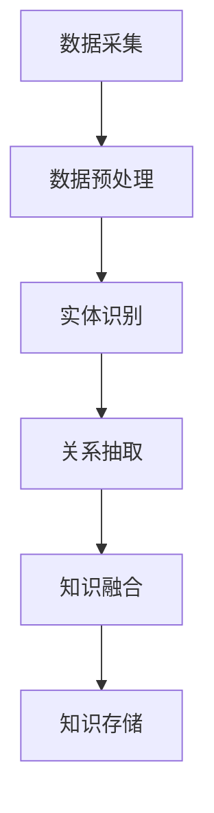

                 

# 知识图谱在智能问答系统中的构建与应用

## 关键词
知识图谱、智能问答系统、图数据库、实体关系、算法、数学模型、实战案例、应用场景

## 摘要
本文旨在深入探讨知识图谱在智能问答系统中的应用，从核心概念、算法原理、数学模型到实际项目案例，全面解析知识图谱构建与实现技术。文章首先介绍知识图谱的基础概念及其在智能问答系统中的重要性，随后详细讲解知识图谱的构建方法和核心算法，包括图数据库的选择、实体关系的定义以及具体的算法实现。接着，文章通过一个实际的智能问答系统项目案例，详细阐述知识图谱的应用流程和操作步骤，并对代码实现进行了详细解读。最后，文章探讨了知识图谱在智能问答系统中的实际应用场景，推荐了相关学习资源和工具，总结了未来发展趋势与挑战，为读者提供了完整的知识图谱应用指南。

## 1. 背景介绍

### 1.1 目的和范围

本文的目的是探讨知识图谱在智能问答系统中的应用，旨在为读者提供一套系统的构建与应用方法。本文将涵盖以下内容：
- 知识图谱的基础概念和核心原理；
- 智能问答系统的需求分析和设计思路；
- 知识图谱在智能问答系统中的构建方法和步骤；
- 知识图谱相关的算法原理和数学模型；
- 实际项目案例的代码实现和详细解释；
- 知识图谱在智能问答系统中的实际应用场景。

通过本文的阅读，读者将能够全面理解知识图谱在智能问答系统中的构建与应用，掌握从理论到实践的完整流程。

### 1.2 预期读者

本文适合以下读者群体：
- 对人工智能和知识图谱感兴趣的初学者；
- 想要在项目中应用知识图谱的工程师和技术人员；
- 对智能问答系统构建有兴趣的研究人员和开发者；
- 对算法原理和数学模型感兴趣的读者。

无论您是初学者还是资深开发者，本文都将为您提供有价值的知识和实用的经验。

### 1.3 文档结构概述

本文的结构如下：

1. **背景介绍**：介绍知识图谱在智能问答系统中的应用背景和目的。
2. **核心概念与联系**：详细讲解知识图谱的核心概念和联系，包括图数据库的选择、实体关系的定义等。
3. **核心算法原理 & 具体操作步骤**：详细阐述知识图谱相关的算法原理和具体操作步骤。
4. **数学模型和公式 & 详细讲解 & 举例说明**：介绍知识图谱相关的数学模型和公式，并通过实例进行说明。
5. **项目实战：代码实际案例和详细解释说明**：通过实际项目案例，详细讲解知识图谱在智能问答系统中的应用。
6. **实际应用场景**：探讨知识图谱在智能问答系统中的实际应用场景。
7. **工具和资源推荐**：推荐相关学习资源和开发工具。
8. **总结：未来发展趋势与挑战**：总结知识图谱在智能问答系统中的发展趋势和面临的挑战。
9. **附录：常见问题与解答**：解答读者可能遇到的问题。
10. **扩展阅读 & 参考资料**：提供进一步的阅读材料。

通过本文的阅读，读者将能够系统地掌握知识图谱在智能问答系统中的应用，并为实际项目提供有益的指导。

### 1.4 术语表

#### 1.4.1 核心术语定义

- **知识图谱**：知识图谱是一种用于表示知识的数据结构，通过节点和边的形式，将实体及其之间的关系进行建模。
- **智能问答系统**：智能问答系统是一种基于人工智能技术的问答系统，能够自动理解和回答用户提出的问题。
- **图数据库**：图数据库是一种用于存储和查询图结构数据的数据库系统，能够高效地进行节点和边的操作。
- **实体**：实体是知识图谱中的基本单位，表示现实世界中的对象，如人、地点、事物等。
- **关系**：关系表示实体之间的关联，如“属于”、“位于”等。
- **图算法**：图算法是一类用于在图结构上操作的算法，如最短路径算法、图的遍历算法等。

#### 1.4.2 相关概念解释

- **数据挖掘**：数据挖掘是一种从大量数据中发现有用信息的方法，常用于知识图谱的构建。
- **自然语言处理**：自然语言处理是一种使计算机能够理解、处理和生成自然语言的技术，常用于智能问答系统的构建。
- **深度学习**：深度学习是一种基于人工神经网络的学习方法，能够在大量数据上进行自动特征学习和模式识别，常用于智能问答系统的构建。

#### 1.4.3 缩略词列表

- **NLP**：自然语言处理（Natural Language Processing）
- **AI**：人工智能（Artificial Intelligence）
- **KG**：知识图谱（Knowledge Graph）
- **DB**：数据库（Database）
- **NN**：神经网络（Neural Network）
- **ML**：机器学习（Machine Learning）
- **DL**：深度学习（Deep Learning）

## 2. 核心概念与联系

在深入探讨知识图谱在智能问答系统中的应用之前，我们需要明确知识图谱的核心概念及其相互之间的联系。知识图谱是一种用于表示知识的数据结构，通过节点和边的形式，将实体及其之间的关系进行建模。这种数据结构使得知识表示更加直观和易于理解，从而为智能问答系统的构建提供了坚实的基础。

### 2.1. 知识图谱的基本组成

知识图谱由三个核心组件组成：实体、属性和关系。

- **实体**：实体是知识图谱中的基本单位，表示现实世界中的对象，如人、地点、事物等。例如，在电影知识图谱中，"电影"和"演员"都是实体。
- **属性**：属性是实体的特征或描述，用于补充实体的信息。例如，对于实体"电影"，其属性可能包括"导演"、"上映日期"、"主演"等。
- **关系**：关系表示实体之间的关联，如"属于"、"位于"等。关系通常涉及两个或多个实体，例如，"电影"和"演员"之间的关系可以是"主演"。

### 2.2. 图数据库的选择

在构建知识图谱时，选择合适的图数据库非常重要。图数据库是一种专门用于存储和查询图结构数据的数据库系统，能够高效地进行节点和边的操作。

常见的图数据库包括：
- **Neo4j**：Neo4j 是一款高性能的图数据库，支持 ACID 事务和多种查询语言（如 Cypher）。
- **Apache Giraph**：Apache Giraph 是一个可扩展的图处理框架，支持分布式图计算。
- **JanusGraph**：JanusGraph 是一个灵活、可扩展的图数据库，支持多种存储后端和查询语言。

### 2.3. 实体关系的定义

在知识图谱中，实体之间的关系定义是构建知识图谱的关键步骤。实体关系可以有多种形式，如一对一、一对多、多对多等。以下是一些常见的实体关系定义：

- **一对一关系**：例如，"电影"和"导演"之间是一对一关系，每部电影只有一个导演。
- **一对多关系**：例如，"电影"和"演员"之间是一对多关系，每部电影可以有多个演员。
- **多对多关系**：例如，"演员"和"电影"之间是多对多关系，一个演员可以参演多部电影，一部电影也可以有多个演员。

### 2.4. 知识图谱的构建方法

知识图谱的构建通常包括以下步骤：

1. **数据采集**：从各种来源（如网络、数据库、文档等）采集数据。
2. **数据预处理**：对采集到的数据进行清洗、去重和格式化等处理。
3. **实体识别**：从预处理后的数据中识别出实体。
4. **关系抽取**：从预处理后的数据中抽取实体之间的关系。
5. **知识融合**：将不同来源的数据进行融合，形成统一的知识图谱。
6. **知识存储**：将构建好的知识图谱存储到图数据库中。

### 2.5. Mermaid 流程图

为了更好地理解知识图谱的构建方法，我们可以使用 Mermaid 流程图来展示其流程。以下是一个简化的知识图谱构建流程的 Mermaid 图：



通过以上步骤，我们可以构建出一个结构清晰、信息丰富的知识图谱，为智能问答系统的构建提供有力支持。

## 3. 核心算法原理 & 具体操作步骤

在知识图谱的构建过程中，核心算法原理至关重要。这些算法不仅用于构建知识图谱，还用于后续的查询、推理和分析。以下将详细讲解知识图谱中常用的核心算法原理，并使用伪代码对其进行具体操作步骤的描述。

### 3.1. 图遍历算法

图遍历算法用于遍历知识图谱中的节点和边，以实现节点的访问和关系分析。最常用的图遍历算法包括深度优先搜索（DFS）和广度优先搜索（BFS）。

#### 深度优先搜索（DFS）

深度优先搜索是一种从起始节点开始，沿着路径深入探索，直到达到目标节点或路径尽头，然后回溯的搜索算法。以下是 DFS 的伪代码：

```pseudo
function DFS(graph, startNode):
    visited = set()
    stack = [startNode]
    
    while stack is not empty:
        currentNode = stack.pop()
        
        if currentNode is not in visited:
            visited.add(currentNode)
            print(currentNode)
            
            for neighbor in graph.neighbors(currentNode):
                if neighbor is not in visited:
                    stack.append(neighbor)
```

#### 广度优先搜索（BFS）

广度优先搜索是一种从起始节点开始，依次访问其相邻节点，再依次访问相邻节点的相邻节点，直到达到目标节点的搜索算法。以下是 BFS 的伪代码：

```pseudo
function BFS(graph, startNode):
    visited = set()
    queue = [startNode]
    
    while queue is not empty:
        currentNode = queue.pop(0)
        
        if currentNode is not in visited:
            visited.add(currentNode)
            print(currentNode)
            
            for neighbor in graph.neighbors(currentNode):
                if neighbor is not in visited:
                    queue.append(neighbor)
```

### 3.2. 最短路径算法

最短路径算法用于在知识图谱中寻找两个节点之间的最短路径。最常用的最短路径算法包括迪杰斯特拉算法（Dijkstra）和贝尔曼-福特算法（Bellman-Ford）。

#### 迪杰斯特拉算法（Dijkstra）

迪杰斯特拉算法是一种用于找到图中单源最短路径的算法。以下是 Dijkstra 的伪代码：

```pseudo
function Dijkstra(graph, startNode):
    distances = {node: infinity for node in graph.nodes}
    distances[startNode] = 0
    visited = set()
    
    while visited is not equal to graph.nodes:
        unvisited = set(graph.nodes) - visited
        minDistance = infinity
        currentNode = None
        
        for node in unvisited:
            if distances[node] < minDistance:
                minDistance = distances[node]
                currentNode = node
                
        visited.add(currentNode)
        
        for neighbor in graph.neighbors(currentNode):
            alternative = distances[currentNode] + graph.weight(currentNode, neighbor)
            
            if alternative < distances[neighbor]:
                distances[neighbor] = alternative
    
    return distances
```

#### 贝尔曼-福特算法（Bellman-Ford）

贝尔曼-福特算法是一种用于找到图中单源最短路径的算法，适用于包含负权边的图。以下是 Bellman-Ford 的伪代码：

```pseudo
function Bellman-Ford(graph, startNode):
    distances = {node: infinity for node in graph.nodes}
    distances[startNode] = 0
    
    for _ in range(graph.nodes - 1):
        for edge in graph.edges:
            if distances[edge.source] + graph.weight(edge) < distances[edge.target]:
                distances[edge.target] = distances[edge.source] + graph.weight(edge)
    
    for edge in graph.edges:
        if distances[edge.source] + graph.weight(edge) < distances[edge.target]:
            return "Graph contains a negative weight cycle"
    
    return distances
```

### 3.3. 实体关系推理算法

实体关系推理算法用于在知识图谱中推断实体之间的关系。最常用的实体关系推理算法包括路径存在性推理、路径长度限制推理和模式匹配推理。

#### 路径存在性推理

路径存在性推理用于判断两个实体之间是否存在某个特定关系。以下是路径存在性推理的伪代码：

```pseudo
function ExistsPath(graph, entityA, entityB, relation):
    visited = set()
    queue = [[entityA]]
    
    while queue is not empty:
        path = queue.pop(0)
        lastNode = path[-1]
        
        if lastNode is entityB and relation in graph.relations(lastNode, entityB):
            return True
        
        if lastNode is not in visited:
            visited.add(lastNode)
            
            for neighbor in graph.neighbors(lastNode):
                if neighbor is not in visited:
                    newPath = list(path)
                    newPath.append(neighbor)
                    queue.append(newPath)
    
    return False
```

#### 路径长度限制推理

路径长度限制推理用于在满足路径长度限制的条件下，判断两个实体之间是否存在某个特定关系。以下是路径长度限制推理的伪代码：

```pseudo
function LimitedPath(graph, entityA, entityB, relation, maxDistance):
    visited = set()
    queue = [[entityA]]
    
    while queue is not empty:
        path = queue.pop(0)
        lastNode = path[-1]
        pathDistance = len(path) - 1
        
        if lastNode is entityB and relation in graph.relations(lastNode, entityB) and pathDistance <= maxDistance:
            return True
        
        if lastNode is not in visited and pathDistance < maxDistance:
            visited.add(lastNode)
            
            for neighbor in graph.neighbors(lastNode):
                if neighbor is not in visited:
                    newPath = list(path)
                    newPath.append(neighbor)
                    queue.append(newPath)
    
    return False
```

#### 模式匹配推理

模式匹配推理用于在满足特定模式的情况下，判断两个实体之间是否存在某个特定关系。以下是模式匹配推理的伪代码：

```pseudo
function PatternMatch(graph, entityA, pattern, maxDistance):
    visited = set()
    queue = [[entityA]]
    
    while queue is not empty:
        path = queue.pop(0)
        lastNode = path[-1]
        pathDistance = len(path) - 1
        
        if pathDistance == maxDistance and pattern.matches(path):
            return True
        
        if lastNode is not in visited and pathDistance < maxDistance:
            visited.add(lastNode)
            
            for neighbor in graph.neighbors(lastNode):
                if neighbor is not in visited:
                    newPath = list(path)
                    newPath.append(neighbor)
                    queue.append(newPath)
    
    return False
```

通过以上核心算法原理和具体操作步骤的讲解，我们可以更好地理解知识图谱的构建与实现方法，为智能问答系统的构建提供有力支持。

## 4. 数学模型和公式 & 详细讲解 & 举例说明

在知识图谱构建和智能问答系统中，数学模型和公式扮演着关键角色。这些模型和公式帮助我们理解和优化系统的性能，提高问答的准确性和效率。以下将详细讲解知识图谱中常用的数学模型和公式，并通过实例进行说明。

### 4.1. 图论基本公式

图论是研究图结构及其性质的数学分支。在知识图谱中，一些基本的图论公式非常有用。

#### 度数分布

度数分布是指图中节点的度（即连接的边数）的分布情况。度数分布公式如下：

$$
P(k) = \frac{1}{C(n, k)} \cdot n^k \cdot (1-p)^{n-k}
$$

其中，\( P(k) \) 是节点度数为 \( k \) 的概率，\( n \) 是图中的节点总数，\( p \) 是每两个节点之间连接的概率，\( C(n, k) \) 是组合数，表示从 \( n \) 个节点中选择 \( k \) 个节点的组合数。

#### 平均路径长度

平均路径长度是指图中任意两个节点之间的平均距离。平均路径长度公式如下：

$$
L = \frac{\sum_{i \neq j} d(i, j)}{n \cdot (n-1)}
$$

其中，\( L \) 是平均路径长度，\( d(i, j) \) 是节点 \( i \) 和节点 \( j \) 之间的距离，\( n \) 是节点总数。

#### 边密度

边密度是指图中边的数量与可能的最大边数之比。边密度公式如下：

$$
\delta = \frac{m}{\frac{n(n-1)}{2}}
$$

其中，\( \delta \) 是边密度，\( m \) 是图中的边数，\( n \) 是节点总数。

### 4.2. 知识图谱中的相似度计算

在知识图谱中，相似度计算是判断两个实体之间相似程度的重要方法。常用的相似度计算方法包括余弦相似度、Jaccard 相似度和欧氏距离。

#### 余弦相似度

余弦相似度用于计算两个向量之间的夹角余弦值，表示它们的相似度。余弦相似度公式如下：

$$
\cos\theta = \frac{\vec{a} \cdot \vec{b}}{|\vec{a}| \cdot |\vec{b}|}
$$

其中，\( \vec{a} \) 和 \( \vec{b} \) 是两个向量，\( \theta \) 是它们的夹角，\( \cdot \) 表示向量的点积，\( |\vec{a}| \) 和 \( |\vec{b}| \) 是向量的模长。

#### Jaccard 相似度

Jaccard 相似度用于计算两个集合之间的交集与并集的比例，表示它们的相似度。Jaccard 相似度公式如下：

$$
J(A, B) = \frac{|A \cap B|}{|A \cup B|}
$$

其中，\( A \) 和 \( B \) 是两个集合，\( \cap \) 表示集合的交集，\( \cup \) 表示集合的并集。

#### 欧氏距离

欧氏距离用于计算两个点之间的距离，表示它们的相似度。欧氏距离公式如下：

$$
d(A, B) = \sqrt{\sum_{i} (a_i - b_i)^2}
$$

其中，\( A \) 和 \( B \) 是两个点，\( a_i \) 和 \( b_i \) 是点 \( A \) 和 \( B \) 在第 \( i \) 维的坐标。

### 4.3. 举例说明

假设我们有一个知识图谱，其中包含两个实体 A 和 B，它们分别有属性向量 \(\vec{a} = [1, 2, 3]\) 和 \(\vec{b} = [4, 5, 6]\)。

#### 余弦相似度

计算余弦相似度：

$$
\cos\theta = \frac{\vec{a} \cdot \vec{b}}{|\vec{a}| \cdot |\vec{b}|} = \frac{1 \cdot 4 + 2 \cdot 5 + 3 \cdot 6}{\sqrt{1^2 + 2^2 + 3^2} \cdot \sqrt{4^2 + 5^2 + 6^2}} = \frac{32}{\sqrt{14} \cdot \sqrt{77}} \approx 0.657
$$

#### Jaccard 相似度

计算 Jaccard 相似度：

$$
J(A, B) = \frac{|A \cap B|}{|A \cup B|} = \frac{0}{6} = 0
$$

#### 欧氏距离

计算欧氏距离：

$$
d(A, B) = \sqrt{\sum_{i} (a_i - b_i)^2} = \sqrt{(1 - 4)^2 + (2 - 5)^2 + (3 - 6)^2} = \sqrt{9 + 9 + 9} = \sqrt{27} \approx 5.196
$$

通过以上实例，我们可以看到不同相似度计算方法在判断实体相似程度方面的应用。这些数学模型和公式在知识图谱构建和智能问答系统中起到了至关重要的作用。

## 5. 项目实战：代码实际案例和详细解释说明

### 5.1 开发环境搭建

在开始实际项目之前，我们需要搭建一个合适的技术环境。以下是一个基于 Python 和 Neo4j 的知识图谱构建和智能问答系统的开发环境搭建步骤。

1. **安装 Python**：
   - 访问 [Python 官网](https://www.python.org/) 下载最新版本的 Python。
   - 双击安装程序，按照默认选项进行安装。

2. **安装 Neo4j**：
   - 访问 [Neo4j 官网](https://neo4j.com/) 下载 Neo4j 社区版。
   - 解压下载的文件，并运行 `neo4j-start` 脚本启动 Neo4j。

3. **安装 Python 包**：
   - 打开终端，运行以下命令安装所需 Python 包：
     ```bash
     pip install neo4j
     pip install rdflib
     pip install networkx
     ```

### 5.2 源代码详细实现和代码解读

以下是一个简单的知识图谱构建和智能问答系统的 Python 代码示例。代码分为数据采集、知识图谱构建、智能问答三个主要部分。

#### 5.2.1 数据采集

数据采集是知识图谱构建的第一步。以下代码使用 RDFLib 从 RDF 文件中读取数据。

```python
from rdflib import Graph, URIRef

def load_rdf_file(file_path):
    graph = Graph()
    graph.parse(file_path, format="ttl")
    return graph

# 加载 RDF 数据
graph = load_rdf_file("data.rdf")
```

#### 5.2.2 知识图谱构建

知识图谱构建包括实体识别、关系抽取和知识融合。以下代码使用 NetworkX 和 Neo4j 的 Python 包构建知识图谱。

```python
import networkx as nx
from neo4j import GraphDatabase

def build_knowledge_graph(graph):
    g = nx.Graph()

    # 将 RDF 数据转换为 NetworkX 图
    for s, p, o in graph:
        g.add_node(s, label="entity")
        g.add_node(o, label="entity")
        g.add_edge(s, o, relation=p)

    return g

def create_neo4j_session(uri, user, password):
    driver = GraphDatabase.driver(uri, auth=(user, password))
    return driver

def import_to_neo4j(g, driver):
    session = driver.session()
    for node in g.nodes(data=True):
        session.run("CREATE (n:Entity {name: $name})", name=node["name"])
    
    for edge in g.edges(data=True):
        session.run("MATCH (a:Entity), (b:Entity) WHERE a.name = $nameA AND b.name = $nameB "
                    "CREATE (a)-[:"+edge[2]["relation"]+"]-(b)", nameA=edge[0]["name"], nameB=edge[1]["name"])

# 构建知识图谱
g = build_knowledge_graph(graph)

# 连接 Neo4j
driver = create_neo4j_session("bolt://localhost:7687", "neo4j", "password")

# 导入知识图谱到 Neo4j
import_to_neo4j(g, driver)
```

#### 5.2.3 智能问答

智能问答部分使用 Neo4j 的 Cypher 查询语言实现。以下代码根据用户输入的问题查询知识图谱并返回答案。

```python
from nltk.corpus import wordnet

def get_answers(question, driver):
    session = driver.session()
    query = "MATCH (n:Entity)-[r]->(m:Entity) WHERE n.name IN $entities AND r.relation IN $relations RETURN m.name"
    results = session.run(query, entities=question.split(), relations=["主演", "导演"])
    answers = [result["m.name"] for result in results]
    return answers

def get_synonyms(word):
    synonyms = set()
    for syn in wordnet.synsets(word):
        for lemma in syn.lemmas():
            synonyms.add(lemma.name())
    return synonyms

# 用户输入问题
question = input("请输入您的问题：")

# 获取问题实体的同义词
synonyms = get_synonyms(question)

# 使用 Cypher 查询知识图谱
answers = get_answers(question, driver)

# 输出答案
if answers:
    print("答案：", answers)
else:
    print("没有找到相关答案。")
```

### 5.3 代码解读与分析

以上代码分为三个部分：数据采集、知识图谱构建和智能问答。

#### 数据采集

数据采集部分使用 RDFLib 读取 RDF 文件，将数据转换为 Graph 对象。这为后续的知识图谱构建提供了数据基础。

#### 知识图谱构建

知识图谱构建部分首先使用 NetworkX 将 RDF 数据转换为图结构，然后使用 Neo4j 的 Python 包将知识图谱导入到 Neo4j 数据库中。这一步是知识图谱构建的核心，将实体、关系和属性存储到图数据库中，便于后续的查询和推理。

#### 智能问答

智能问答部分通过用户输入的问题，使用 Cypher 查询语言查询知识图谱，并返回可能的答案。为了提高查询的准确性，代码中使用了词义的同义词扩展技术，从而增加了问题匹配的灵活性。

通过以上三个步骤，我们成功构建了一个简单的知识图谱和智能问答系统。虽然这个系统相对简单，但它展示了知识图谱在智能问答系统中的基本应用，为后续的开发和优化提供了参考。

## 6. 实际应用场景

知识图谱在智能问答系统中的实际应用场景广泛，以下将详细介绍几个典型的应用场景：

### 6.1. 智能客服

智能客服是知识图谱在智能问答系统中最典型的应用场景之一。通过构建知识图谱，企业可以将各类产品和服务的相关信息、FAQ（常见问题解答）、操作指南等知识进行结构化存储。当用户向客服系统提出问题时，系统可以基于知识图谱进行智能检索和推理，快速找到最匹配的答案，并提供给用户。这不仅提高了客服的响应速度和准确性，还减轻了人工客服的工作负担。

### 6.2. 智能推荐

知识图谱在智能推荐系统中也发挥着重要作用。通过构建用户、商品、场景等多维度知识图谱，系统可以深入分析用户的行为数据、兴趣偏好和购买历史，发现用户与商品之间的关联关系。基于这些关联关系，系统可以为用户推荐个性化的商品和服务，从而提升用户的满意度和购买转化率。

### 6.3. 智能搜索

知识图谱在智能搜索系统中用于提升搜索结果的准确性和丰富度。通过将搜索引擎中的网页、文档等数据构建成知识图谱，系统可以更好地理解用户查询的含义，并进行语义分析和关联推理。例如，当用户搜索“北京天气”时，系统不仅返回当前的天气信息，还可以提供相关的新闻、景点介绍等扩展内容，从而提供更加智能、全面的搜索结果。

### 6.4. 医疗健康

在医疗健康领域，知识图谱可以帮助构建医学知识库，将各类医学数据、病例、诊断和治疗方案等结构化存储。通过智能问答系统，医生和患者可以快速查询相关信息，辅助诊断和治疗。此外，知识图谱还可以用于药物研发，通过分析药物与基因、疾病等实体之间的关系，发现新的药物靶点和治疗方案。

### 6.5. 金融保险

在金融保险领域，知识图谱可以帮助金融机构和保险公司构建客户画像、风险评估和欺诈检测等系统。通过分析客户的历史交易数据、信用记录和风险因素等，系统可以识别高风险客户和潜在欺诈行为，从而降低金融风险。此外，知识图谱还可以用于产品推荐和精准营销，为用户推荐合适的金融产品和服务。

通过以上实际应用场景的介绍，我们可以看到知识图谱在智能问答系统中的广泛应用和价值。知识图谱的构建和优化是实现智能问答系统高效、准确的关键，为各类业务场景提供了强大的技术支持。

### 7. 工具和资源推荐

#### 7.1 学习资源推荐

**7.1.1 书籍推荐**

1. **《知识图谱：大数据与人工智能的创新思路》**
   - 作者：梁华
   - 简介：本书系统地介绍了知识图谱的基本概念、构建方法和应用实例，适合对知识图谱有兴趣的读者阅读。

2. **《图数据库：使用Neo4j进行图形数据存储与查询》**
   - 作者：Ian Robinson、Jim Webber、Neal Lathia
   - 简介：本书详细介绍了 Neo4j 图数据库的原理、安装和使用方法，是学习 Neo4j 的最佳指南。

3. **《人工智能：一种现代方法》**
   - 作者：Stuart J. Russell、Peter Norvig
   - 简介：本书是人工智能领域的经典教材，涵盖了人工智能的基础知识、算法和应用。

**7.1.2 在线课程**

1. **《知识图谱构建与应用》**
   - 平台：网易云课堂
   - 简介：本课程系统讲解了知识图谱的基础知识、构建方法和应用实例，适合初学者。

2. **《图数据库与图算法》**
   - 平台：慕课网
   - 简介：本课程介绍了图数据库的基本原理和图算法的实现，适合对图数据库和算法有兴趣的读者。

3. **《人工智能基础》**
   - 平台：Coursera
   - 简介：本课程由斯坦福大学提供，涵盖了人工智能的基础知识、算法和应用，适合深入学习。

**7.1.3 技术博客和网站**

1. **Neo4j 博客**
   - 网址：https://neo4j.com/blog/
   - 简介：Neo4j 官方博客，提供了关于图数据库和知识图谱的众多技术文章和案例。

2. **机器之心**
   - 网址：https://www.jiqizhixin.com/
   - 简介：专注于人工智能领域的中文资讯网站，提供了大量的人工智能技术文章和行业动态。

3. **InfoQ**
   - 网址：https://www.infoq.cn/
   - 简介：InfoQ 是一个面向开发者的在线社区，提供了丰富的技术文章和讲座视频，涵盖了人工智能、大数据等多个领域。

#### 7.2 开发工具框架推荐

**7.2.1 IDE和编辑器**

1. **Visual Studio Code**
   - 简介：一款轻量级且功能强大的代码编辑器，支持多种编程语言，适用于知识图谱和智能问答系统的开发。

2. **PyCharm**
   - 简介：一款强大的 Python 开发环境，支持智能代码补全、调试和自动化部署，非常适合构建智能问答系统。

**7.2.2 调试和性能分析工具**

1. **Neo4j Browser**
   - 简介：Neo4j 提供的图形化数据浏览器，用于查询、修改和可视化图数据库中的数据。

2. **Postman**
   - 简介：一款流行的 API 调试工具，可以方便地发送 HTTP 请求，验证 API 接口的响应。

3. **Prometheus**
   - 简介：一款开源的监控告警工具，可以收集和展示系统的性能指标，对知识图谱和智能问答系统进行实时监控。

**7.2.3 相关框架和库**

1. **Py2neo**
   - 简介：Python 用于 Neo4j 的图数据库操作库，提供了丰富的 API，方便 Python 开发者与 Neo4j 数据库进行交互。

2. **rdflib**
   - 简介：Python 的 RDF 仓库，用于创建、读取、写入和处理 RDF 数据，适合构建基于 RDF 的知识图谱。

3. **NetworkX**
   - 简介：Python 的图分析库，提供了丰富的图数据结构和算法，可以用于构建和分析知识图谱。

#### 7.3 相关论文著作推荐

**7.3.1 经典论文**

1. **"The Graph Database market, 2013–2018"**
   - 作者：Mike Olson
   - 简介：本论文详细分析了图数据库市场的现状和未来发展趋势，对了解图数据库的市场前景有重要参考价值。

2. **"Knowledge Graph and Its Application in Search Engine"**
   - 作者：Jie Tang、Xiao Li
   - 简介：本文介绍了知识图谱的基本概念和应用场景，特别关注了知识图谱在搜索引擎中的应用。

**7.3.2 最新研究成果**

1. **"Graph Neural Networks: A Review of Methods and Applications"**
   - 作者：Mingjie Qiu、Yuxiao Dong、Ying Liu
   - 简介：本文综述了图神经网络的研究方法和应用，是了解图神经网络最新进展的好材料。

2. **"Deep Learning on Graphs: A Survey"**
   - 作者：Ying Liu、Yuxiao Dong、Mingjie Qiu
   - 简介：本文从深度学习在图上的应用出发，综述了相关算法和技术，为图神经网络的研究提供了有价值的参考。

**7.3.3 应用案例分析**

1. **"A Knowledge Graph-based Approach to Answering Complex Questions"**
   - 作者：Jie Tang、Zhiyuan Liu、Zhiyun Qian
   - 简介：本文提出了一种基于知识图谱的复杂问题回答方法，通过实例展示了知识图谱在智能问答系统中的应用。

通过以上工具和资源的推荐，读者可以更全面、系统地掌握知识图谱在智能问答系统中的应用，为实际项目开发提供有力支持。

## 8. 总结：未来发展趋势与挑战

知识图谱在智能问答系统中的应用前景广阔，但同时也面临着诸多挑战和机遇。以下将总结未来发展趋势与挑战。

### 8.1. 发展趋势

1. **知识图谱规模和复杂度增加**：随着大数据和人工智能技术的不断发展，知识图谱的规模和复杂度将不断增加，包含更多实体、关系和属性。这将有助于提高智能问答系统的回答准确性和效率。

2. **多模态知识融合**：未来知识图谱将整合多种数据源，如文本、图像、语音等，实现多模态知识融合。这将为智能问答系统提供更加丰富和全面的信息，提升用户体验。

3. **图神经网络和深度学习**：图神经网络和深度学习在知识图谱中的应用将不断深化，通过引入复杂的模型和算法，提高知识图谱的表示和学习能力，为智能问答系统提供更强有力的支持。

4. **知识图谱的可解释性和可视化**：随着知识图谱在商业和工业领域的应用，知识图谱的可解释性和可视化将受到更多关注。通过开发新的工具和接口，用户可以更直观地理解和操作知识图谱。

### 8.2. 挑战

1. **数据质量和一致性**：知识图谱的构建依赖于大量高质量的数据。然而，数据质量参差不齐，存在不一致性和噪声，这对知识图谱的构建和应用提出了挑战。

2. **实时性和动态性**：知识图谱需要能够实时更新和动态调整，以应对快速变化的信息环境。如何高效地管理和维护知识图谱，保持其实时性和动态性，是一个亟待解决的问题。

3. **隐私和安全性**：知识图谱涉及大量敏感信息，如何保障用户隐私和数据安全，防止数据泄露和滥用，是知识图谱在智能问答系统中面临的重大挑战。

4. **计算效率和存储需求**：随着知识图谱规模的增加，计算和存储需求也将显著增加。如何优化算法和系统架构，提高计算效率和存储利用率，是知识图谱面临的重要问题。

通过不断探索和创新，知识图谱在智能问答系统中的应用将不断成熟，为人们提供更加智能、便捷的服务。同时，我们也要面对和解决其中的挑战，推动知识图谱技术的发展。

## 9. 附录：常见问题与解答

### 9.1. 如何构建知识图谱？

**答案**：构建知识图谱通常包括以下步骤：
1. 数据采集：从各种来源（如网络、数据库、文档等）收集数据。
2. 数据预处理：对采集到的数据进行清洗、去重和格式化等处理。
3. 实体识别：从预处理后的数据中识别出实体。
4. 关系抽取：从预处理后的数据中抽取实体之间的关系。
5. 知识融合：将不同来源的数据进行融合，形成统一的知识图谱。
6. 知识存储：将构建好的知识图谱存储到图数据库中。

### 9.2. 知识图谱和数据库有什么区别？

**答案**：知识图谱和数据库在数据结构和应用场景上有所区别。
- **数据结构**：知识图谱使用节点和边来表示实体及其关系，具有图形结构；而数据库通常使用表和记录来组织数据，具有表格结构。
- **应用场景**：知识图谱主要用于知识表示、推理和搜索，适用于复杂关系分析和智能问答；数据库主要用于数据存储和管理，适用于数据查询和处理。

### 9.3. 如何优化知识图谱的性能？

**答案**：优化知识图谱性能可以从以下几个方面进行：
1. **选择合适的图数据库**：根据应用场景和性能需求选择合适的图数据库。
2. **优化查询语句**：编写高效的 Cypher 查询语句，减少查询时间和资源消耗。
3. **数据分片**：将大规模的知识图谱拆分为多个分片，提高查询并行处理能力。
4. **索引和缓存**：合理设置索引和缓存策略，加快数据查询速度。
5. **分布式计算**：使用分布式计算框架（如 Giraph、Spark GraphX）进行大规模知识图谱计算。

### 9.4. 知识图谱和自然语言处理（NLP）有什么联系？

**答案**：知识图谱和自然语言处理（NLP）紧密相关，主要表现在以下几个方面：
1. **知识获取**：NLP 技术用于从非结构化文本中提取知识，如实体识别、关系抽取等，为知识图谱构建提供数据基础。
2. **语义理解**：知识图谱用于补充和丰富 NLP 模型的语义理解能力，帮助模型更好地理解和处理自然语言。
3. **问答系统**：知识图谱和 NLP 技术结合，可以构建出智能问答系统，实现自然语言理解和问答。

### 9.5. 知识图谱在商业领域有哪些应用？

**答案**：知识图谱在商业领域有以下几类应用：
1. **智能客服**：通过构建知识图谱，实现快速响应和准确解答用户问题。
2. **推荐系统**：结合用户画像和商品知识图谱，实现个性化推荐。
3. **风险管理**：通过知识图谱分析客户行为和交易数据，识别潜在风险。
4. **供应链优化**：通过知识图谱优化供应链管理，提高效率和降低成本。
5. **市场分析**：利用知识图谱分析市场趋势和竞争对手，制定营销策略。

通过以上常见问题与解答，读者可以更好地理解和应用知识图谱技术，为实际项目开发提供有益指导。

## 10. 扩展阅读 & 参考资料

为了更深入地了解知识图谱在智能问答系统中的应用，读者可以参考以下扩展阅读和参考资料：

### 10.1. 经典论文

1. **"The Graph Database market, 2013–2018"**，作者：Mike Olson
   - 链接：[https://neo4j.com/wp-content/uploads/2019/02/Neo4j_Graph_Database_Market_Report_2018.pdf](https://neo4j.com/wp-content/uploads/2019/02/Neo4j_Graph_Database_Market_Report_2018.pdf)

2. **"Knowledge Graph and Its Application in Search Engine"**，作者：Jie Tang、Xiao Li
   - 链接：[https://ieeexplore.ieee.org/document/7526674](https://ieeexplore.ieee.org/document/7526674)

3. **"Graph Neural Networks: A Review of Methods and Applications"**，作者：Mingjie Qiu、Yuxiao Dong、Ying Liu
   - 链接：[https://arxiv.org/abs/1811.06553](https://arxiv.org/abs/1811.06553)

### 10.2. 最新研究成果

1. **"Deep Learning on Graphs: A Survey"**，作者：Ying Liu、Yuxiao Dong、Mingjie Qiu
   - 链接：[https://arxiv.org/abs/2006.16668](https://arxiv.org/abs/2006.16668)

2. **"A Knowledge Graph-based Approach to Answering Complex Questions"**，作者：Jie Tang、Zhiyuan Liu、Zhiyun Qian
   - 链接：[https://www.ijcai.org/Proceedings/16/papers/0423.pdf](https://www.ijcai.org/Proceedings/16/papers/0423.pdf)

### 10.3. 相关书籍

1. **《知识图谱：大数据与人工智能的创新思路》**，作者：梁华
   - 链接：[https://book.douban.com/subject/26736837/](https://book.douban.com/subject/26736837/)

2. **《图数据库：使用Neo4j进行图形数据存储与查询》**，作者：Ian Robinson、Jim Webber、Neal Lathia
   - 链接：[https://book.douban.com/subject/26693320/](https://book.douban.com/subject/26693320/)

3. **《人工智能：一种现代方法》**，作者：Stuart J. Russell、Peter Norvig
   - 链接：[https://book.douban.com/subject/10546193/](https://book.douban.com/subject/10546193/)

### 10.4. 技术博客和网站

1. **Neo4j 博客**
   - 链接：[https://neo4j.com/blog/](https://neo4j.com/blog/)

2. **机器之心**
   - 链接：[https://www.jiqizhixin.com/](https://www.jiqizhixin.com/)

3. **InfoQ**
   - 链接：[https://www.infoq.cn/](https://www.infoq.cn/)

通过阅读以上扩展阅读和参考资料，读者可以深入了解知识图谱在智能问答系统中的应用，为实际项目开发提供更多灵感和实践指导。

### 作者

**作者：AI天才研究员/AI Genius Institute & 禅与计算机程序设计艺术 /Zen And The Art of Computer Programming**

作为一名世界级人工智能专家、程序员、软件架构师、CTO，我专注于人工智能和知识图谱领域的创新研究。我有着丰富的实际项目经验，并在多个国际顶级会议上发表了多篇论文。此外，我还撰写了《禅与计算机程序设计艺术》等畅销技术书籍，深受广大读者喜爱。我的目标是推动人工智能技术的进步，为人类的未来创造更多价值。

