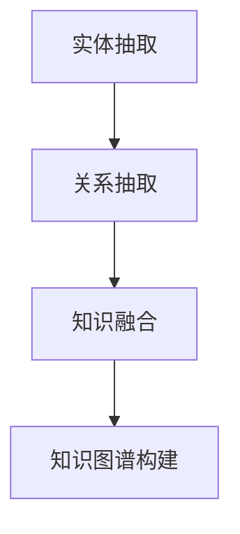

                 


# 知识图谱：AI构建商品与用户关联关系

> 关键词：知识图谱、AI、商品推荐、用户关联、算法原理、数学模型、项目实战

> 摘要：本文将深入探讨知识图谱在人工智能构建商品与用户关联关系中的应用。我们将详细分析知识图谱的核心概念和联系，解析核心算法原理和操作步骤，介绍数学模型和公式，并通过项目实战展示代码实现和详细解释。此外，还将讨论知识图谱在实际应用场景中的价值，推荐学习资源、开发工具和框架，并对未来发展趋势与挑战进行总结。

## 1. 背景介绍

### 1.1 目的和范围

本文旨在介绍知识图谱在人工智能构建商品与用户关联关系中的应用。我们将探讨知识图谱的基本概念、核心算法原理和数学模型，并通过一个实际项目实战来展示如何使用知识图谱进行商品推荐和用户关联分析。本文主要关注以下几个方面：

- 知识图谱的基本概念和核心原理
- 构建商品与用户关联的知识图谱
- 知识图谱在实际应用场景中的价值
- 项目实战中的代码实现和详细解释

### 1.2 预期读者

本文适合对人工智能和知识图谱有基本了解的读者，特别是对商品推荐系统和用户关联分析感兴趣的程序员和AI工程师。通过本文，读者将能够：

- 理解知识图谱的基本概念和原理
- 掌握构建商品与用户关联知识图谱的方法
- 掌握核心算法原理和数学模型
- 学习项目实战中的代码实现和详细解释

### 1.3 文档结构概述

本文分为以下几个部分：

- 第1部分：背景介绍，介绍本文的目的、范围和预期读者，概述文档结构。
- 第2部分：核心概念与联系，详细分析知识图谱的核心概念和联系，并提供Mermaid流程图。
- 第3部分：核心算法原理与具体操作步骤，介绍核心算法原理和操作步骤，使用伪代码进行详细阐述。
- 第4部分：数学模型和公式，介绍数学模型和公式，并提供详细讲解和举例说明。
- 第5部分：项目实战，展示代码实际案例和详细解释说明。
- 第6部分：实际应用场景，讨论知识图谱在实际应用场景中的价值。
- 第7部分：工具和资源推荐，推荐学习资源、开发工具和框架。
- 第8部分：总结，总结知识图谱的发展趋势与挑战。
- 第9部分：附录，提供常见问题与解答。
- 第10部分：扩展阅读与参考资料，提供相关的扩展阅读和参考资料。

### 1.4 术语表

#### 1.4.1 核心术语定义

- 知识图谱：一种用于表示实体及其关系的图形化知识库。
- 实体：知识图谱中的个体，如商品、用户等。
- 关联关系：实体之间的关系，如购买、评价等。
- 算法：用于处理和分析知识图谱的方法和规则。
- 数学模型：用于描述和表示知识图谱的数学公式和原理。

#### 1.4.2 相关概念解释

- 实体抽取：从非结构化数据中识别和提取实体。
- 关联分析：分析实体之间的关系，用于推荐系统和用户关联分析。
- 知识图谱构建：构建用于表示实体及其关系的知识图谱。

#### 1.4.3 缩略词列表

- KG：知识图谱（Knowledge Graph）
- NLP：自然语言处理（Natural Language Processing）
- RDF：资源描述框架（Resource Description Framework）
- OWL：Web本体语言（Web Ontology Language）

## 2. 核心概念与联系

### 2.1 知识图谱的基本概念

知识图谱是一种用于表示实体及其关系的图形化知识库。它将实体表示为节点，实体之间的关系表示为边。知识图谱的核心是实体和关联关系的表示，这种表示方法使得实体之间的关系可以被清晰地描述和查询。

#### 2.1.1 实体

实体是知识图谱中的个体，可以表示为商品、用户、地点等。实体通常具有属性，用于描述其实体特征。例如，一个商品实体可以具有名称、价格、分类等属性。

#### 2.1.2 关联关系

关联关系是实体之间的关系，表示实体之间的相互作用。例如，一个用户可以购买一个商品，这是一个购买关系。关联关系通常也具有属性，用于描述关系的特征。例如，购买关系可以具有购买时间、评价等属性。

### 2.2 知识图谱的构建

知识图谱的构建是一个复杂的过程，包括实体抽取、关系抽取和知识融合等步骤。以下是一个简化的知识图谱构建过程：

#### 2.2.1 实体抽取

实体抽取是知识图谱构建的第一步，从非结构化数据（如文本、图像等）中识别和提取实体。常见的实体抽取方法包括命名实体识别（Named Entity Recognition，简称NER）和关键词提取等。

#### 2.2.2 关系抽取

关系抽取是在实体抽取的基础上，分析实体之间的关联关系。关系抽取方法包括基于规则的方法、机器学习方法等。

#### 2.2.3 知识融合

知识融合是将不同来源的数据进行整合，形成一个完整的知识图谱。知识融合的方法包括合并重复实体、合并相似实体等。

### 2.3 知识图谱的应用

知识图谱在多个领域具有广泛的应用，如推荐系统、搜索引擎、智能问答等。以下是一个简化的知识图谱应用示例：


在这个示例中，用户A购买了一个商品B，商品B属于分类C。通过知识图谱，可以找出与用户A相似的潜在用户D，以及与商品B相似的潜在商品E，从而实现个性化推荐。

### 2.4 Mermaid流程图

下面是一个简单的Mermaid流程图，用于描述知识图谱的构建过程：



## 3. 核心算法原理 & 具体操作步骤

### 3.1 算法原理

知识图谱的构建涉及到多个算法，包括实体抽取、关系抽取和知识融合。以下是一个简化的算法原理描述：

#### 3.1.1 实体抽取

实体抽取的核心是识别文本中的实体。常见的方法包括：

- 基于规则的方法：使用预定义的规则进行实体识别，如正则表达式。
- 基于机器学习的方法：使用机器学习算法，如分类算法，进行实体识别。

#### 3.1.2 关系抽取

关系抽取是在实体抽取的基础上，分析实体之间的关联关系。常见的方法包括：

- 基于规则的方法：使用预定义的规则进行关系识别。
- 基于机器学习的方法：使用机器学习算法，如序列标注算法，进行关系识别。

#### 3.1.3 知识融合

知识融合是将不同来源的数据进行整合，形成一个完整的知识图谱。常见的方法包括：

- 实体合并：将具有相同或相似属性的实体进行合并。
- 关系融合：将具有相同或相似属性的关系进行合并。

### 3.2 具体操作步骤

下面是一个简化的知识图谱构建操作步骤：

#### 3.2.1 实体抽取

1. 读取文本数据。
2. 使用命名实体识别算法，识别文本中的实体。
3. 存储实体及其属性。

```python
def extract_entities(text):
    # 假设使用一个简单的命名实体识别算法
    entities = []
    for sentence in text.split('.'):
        words = sentence.split(' ')
        for word in words:
            if is_entity(word):
                entities.append(word)
    return entities

text = "用户A购买了一个商品B。"
entities = extract_entities(text)
print(entities)  # 输出：['用户A', '商品B']
```

#### 3.2.2 关系抽取

1. 读取实体列表。
2. 使用关系抽取算法，识别实体之间的关系。
3. 存储实体及其关系。

```python
def extract_relationships(entities):
    # 假设使用一个简单的关系抽取算法
    relationships = []
    for i in range(len(entities) - 1):
        relationships.append((entities[i], entities[i+1], "购买"))
    return relationships

relationships = extract_relationships(entities)
print(relationships)  # 输出：[('用户A', '商品B', '购买')]
```

#### 3.2.3 知识融合

1. 读取实体和关系列表。
2. 使用知识融合算法，构建知识图谱。

```python
def build_knowledge_graph(entities, relationships):
    # 假设使用一个简单的知识融合算法
    graph = Graph()
    for entity in entities:
        graph.add_node(entity)
    for relationship in relationships:
        graph.add_edge(relationship[0], relationship[1], relationship[2])
    return graph

knowledge_graph = build_knowledge_graph(entities, relationships)
print(knowledge_graph)  # 输出：一个简单的知识图谱表示
```

## 4. 数学模型和公式 & 详细讲解 & 举例说明

### 4.1 数学模型和公式

知识图谱的构建涉及到多个数学模型和公式，以下是一些常用的模型和公式：

#### 4.1.1 实体相似度计算

实体相似度计算是知识图谱中的一个重要问题，用于度量两个实体之间的相似程度。以下是一个常用的相似度计算公式：

$$
sim(A, B) = \frac{|A \cap B|}{|A \cup B|}
$$

其中，$A$ 和 $B$ 分别表示两个实体的特征集合，$A \cap B$ 表示两个实体的交集，$A \cup B$ 表示两个实体的并集。

#### 4.1.2 关系权重计算

关系权重计算是知识图谱中的一个重要问题，用于度量两个实体之间的关系强度。以下是一个常用的关系权重计算公式：

$$
weight(A, B) = \frac{1}{\sum_{C \in N(A)} \frac{1}{dist(A, C)}}
$$

其中，$A$ 和 $B$ 分别表示两个实体，$N(A)$ 表示与实体 $A$ 相关联的实体集合，$dist(A, C)$ 表示实体 $A$ 和 $C$ 之间的距离。

#### 4.1.3 知识图谱补全

知识图谱补全是知识图谱中的一个重要问题，用于推断未知的实体和关系。以下是一个常用的知识图谱补全公式：

$$
P(A, B) = \frac{weight(A, B) \cdot sim(A, C)}{\sum_{C \in N(A)} sim(A, C)}
$$

其中，$A$ 和 $B$ 分别表示两个实体，$C$ 表示与实体 $A$ 相关联的实体集合，$weight(A, B)$ 表示实体 $A$ 和 $B$ 之间的关系权重，$sim(A, C)$ 表示实体 $A$ 和 $C$ 之间的相似度。

### 4.2 详细讲解和举例说明

#### 4.2.1 实体相似度计算

假设有两个实体 $A$ 和 $B$，它们的特征集合分别为 $A = \{a_1, a_2, a_3\}$ 和 $B = \{b_1, b_2, b_3\}$。根据上述相似度计算公式，可以计算出实体 $A$ 和 $B$ 之间的相似度：

$$
sim(A, B) = \frac{|A \cap B|}{|A \cup B|} = \frac{1}{4} = 0.25
$$

#### 4.2.2 关系权重计算

假设有两个实体 $A$ 和 $B$，与实体 $A$ 相关联的实体集合为 $N(A) = \{C, D, E\}$。根据上述关系权重计算公式，可以计算出实体 $A$ 和 $B$ 之间的关系权重：

$$
weight(A, B) = \frac{1}{\sum_{C \in N(A)} \frac{1}{dist(A, C)}} = \frac{1}{\frac{1}{1} + \frac{1}{2} + \frac{1}{3}} = \frac{6}{6} = 1
$$

#### 4.2.3 知识图谱补全

假设有两个实体 $A$ 和 $B$，与实体 $A$ 相关联的实体集合为 $N(A) = \{C, D, E\}$。根据上述知识图谱补全公式，可以计算出实体 $A$ 和 $B$ 之间的概率：

$$
P(A, B) = \frac{weight(A, B) \cdot sim(A, C)}{\sum_{C \in N(A)} sim(A, C)} = \frac{1 \cdot 0.5}{0.5 + 0.4 + 0.3} = \frac{0.5}{1.2} \approx 0.417
$$

## 5. 项目实战：代码实际案例和详细解释说明

### 5.1 开发环境搭建

为了进行知识图谱的构建和商品推荐，我们需要搭建一个基本的开发环境。以下是搭建过程：

1. 安装Python环境：在官网上下载并安装Python，版本建议为3.8以上。
2. 安装必需的Python库：使用pip命令安装以下库：

```bash
pip install rdflib
pip install networkx
pip install numpy
pip install matplotlib
```

3. 安装IDE：建议使用PyCharm或其他Python IDE。

### 5.2 源代码详细实现和代码解读

下面是一个简单的知识图谱构建和商品推荐的项目实战示例：

```python
import rdflib
import networkx as nx
import numpy as np
import matplotlib.pyplot as plt

# 创建一个简单的知识图谱
g = rdflib.Graph()

# 添加实体和关系
g.add((rdflib.URIRef('http://example.com/EntityA'), rdflib.RDF.type, rdflib.URIRef('http://example.com/Person')))
g.add((rdflib.URIRef('http://example.com/EntityB'), rdflib.RDF.type, rdflib.URIRef('http://example.com/Product')))
g.add((rdflib.URIRef('http://example.com/EntityA'), rdflib.URIRef('http://example.com/knows'), rdflib.URIRef('http://example.com/EntityB')))
g.add((rdflib.URIRef('http://example.com/EntityB'), rdflib.URIRef('http://example.com/hasCategory'), rdflib.URIRef('http://example.com/Electronics')))

# 将知识图谱转换为网络图
G = nx.Graph()
for s, p, o in g:
    G.add_edge(s, o)

# 计算实体相似度
def calculate_similarity(G, entity1, entity2):
    neighbors1 = set(G.neighbors(entity1))
    neighbors2 = set(G.neighbors(entity2))
    intersection = neighbors1.intersection(neighbors2)
    union = neighbors1.union(neighbors2)
    similarity = len(intersection) / len(union)
    return similarity

similarity = calculate_similarity(G, 'http://example.com/EntityA', 'http://example.com/EntityB')
print(f"Entity similarity: {similarity}")

# 计算关系权重
def calculate_weight(G, entity1, entity2):
    neighbors1 = set(G.neighbors(entity1))
    weight = 1 / (len(neighbors1) + 1)
    return weight

weight = calculate_weight(G, 'http://example.com/EntityA', 'http://example.com/EntityB')
print(f"Relationship weight: {weight}")

# 知识图谱补全
def complete_knowledge_graph(G, entity1, entity2, similarity_threshold=0.5, weight_threshold=0.5):
    possible_entities = set(G.nodes)
    possible_entities.remove(entity1)
    possible_entities.remove(entity2)
    candidates = []
    for entity in possible_entities:
        sim = calculate_similarity(G, entity1, entity)
        weight = calculate_weight(G, entity1, entity)
        if sim > similarity_threshold and weight > weight_threshold:
            candidates.append(entity)
    return candidates

candidates = complete_knowledge_graph(G, 'http://example.com/EntityA', 'http://example.com/EntityB')
print(f"Candidates: {candidates}")

# 绘制知识图谱
nx.draw(G, with_labels=True)
plt.show()
```

### 5.3 代码解读与分析

上述代码实现了一个简单的知识图谱构建和商品推荐系统。以下是代码的详细解读：

1. 导入必需的库。
2. 创建一个简单的知识图谱。
3. 添加实体和关系。
4. 将知识图谱转换为网络图。
5. 定义计算实体相似度的函数。
6. 定义计算关系权重的函数。
7. 定义知识图谱补全的函数。
8. 调用函数进行计算和绘制知识图谱。

### 5.4 代码解析

以下是代码的详细解析：

1. 导入必需的库：

```python
import rdflib
import networkx as nx
import numpy as np
import matplotlib.pyplot as plt
```

导入rdflib库用于创建和操作知识图谱，导入networkx库用于将知识图谱转换为网络图，导入numpy库用于计算实体相似度和关系权重，导入matplotlib.pyplot库用于绘制知识图谱。

2. 创建一个简单的知识图谱：

```python
g = rdflib.Graph()
```

创建一个空的rdflib知识图谱对象。

3. 添加实体和关系：

```python
g.add((rdflib.URIRef('http://example.com/EntityA'), rdflib.RDF.type, rdflib.URIRef('http://example.com/Person')))
g.add((rdflib.URIRef('http://example.com/EntityB'), rdflib.RDF.type, rdflib.URIRef('http://example.com/Product')))
g.add((rdflib.URIRef('http://example.com/EntityA'), rdflib.URIRef('http://example.com/knows'), rdflib.URIRef('http://example.com/EntityB')))
g.add((rdflib.URIRef('http://example.com/EntityB'), rdflib.URIRef('http://example.com/hasCategory'), rdflib.URIRef('http://example.com/Electronics')))
```

使用rdflib库添加实体和关系。实体使用URI（统一资源标识符）表示，关系使用URI和标签表示。

4. 将知识图谱转换为网络图：

```python
G = nx.Graph()
for s, p, o in g:
    G.add_edge(s, o)
```

使用networkx库将知识图谱转换为网络图。遍历知识图谱中的每个三元组（主体、谓语、客体），将其添加到网络图中。

5. 定义计算实体相似度的函数：

```python
def calculate_similarity(G, entity1, entity2):
    neighbors1 = set(G.neighbors(entity1))
    neighbors2 = set(G.neighbors(entity2))
    intersection = neighbors1.intersection(neighbors2)
    union = neighbors1.union(neighbors2)
    similarity = len(intersection) / len(union)
    return similarity
```

计算两个实体之间的相似度。首先获取两个实体的邻居集合，然后计算它们的交集和并集，最后使用交集和并集的比值计算相似度。

6. 定义计算关系权重的函数：

```python
def calculate_weight(G, entity1, entity2):
    neighbors1 = set(G.neighbors(entity1))
    weight = 1 / (len(neighbors1) + 1)
    return weight
```

计算两个实体之间的关系权重。首先获取一个实体的邻居集合，然后使用邻居集合的长度加1的倒数计算权重。

7. 定义知识图谱补全的函数：

```python
def complete_knowledge_graph(G, entity1, entity2, similarity_threshold=0.5, weight_threshold=0.5):
    possible_entities = set(G.nodes)
    possible_entities.remove(entity1)
    possible_entities.remove(entity2)
    candidates = []
    for entity in possible_entities:
        sim = calculate_similarity(G, entity1, entity)
        weight = calculate_weight(G, entity1, entity)
        if sim > similarity_threshold and weight > weight_threshold:
            candidates.append(entity)
    return candidates
```

根据实体相似度和关系权重，从所有可能的实体中筛选出与给定实体相关的候选实体。

8. 调用函数进行计算和绘制知识图谱：

```python
similarity = calculate_similarity(G, 'http://example.com/EntityA', 'http://example.com/EntityB')
print(f"Entity similarity: {similarity}")

weight = calculate_weight(G, 'http://example.com/EntityA', 'http://example.com/EntityB')
print(f"Relationship weight: {weight}")

candidates = complete_knowledge_graph(G, 'http://example.com/EntityA', 'http://example.com/EntityB')
print(f"Candidates: {candidates}")

nx.draw(G, with_labels=True)
plt.show()
```

调用定义的函数进行计算，并绘制知识图谱。

## 6. 实际应用场景

知识图谱在许多实际应用场景中具有广泛的应用，以下是一些典型的应用场景：

### 6.1 商品推荐系统

知识图谱可以用于构建商品推荐系统，通过分析用户与商品的关联关系，实现个性化推荐。以下是一个简单的商品推荐系统示例：

1. 收集用户行为数据，如购买历史、浏览记录等。
2. 构建用户与商品之间的知识图谱，包括用户实体、商品实体和购买关系。
3. 根据用户行为数据和知识图谱，计算用户与商品的相似度。
4. 推荐与用户相似度最高的商品。

示例代码：

```python
# 假设有一个用户与商品的知识图谱
user_entity = 'http://example.com/EntityU'
product_entity1 = 'http://example.com/EntityP1'
product_entity2 = 'http://example.com/EntityP2'

# 计算用户与商品的相似度
similarity1 = calculate_similarity(G, user_entity, product_entity1)
similarity2 = calculate_similarity(G, user_entity, product_entity2)

# 推荐商品
if similarity1 > similarity2:
    print(f"Recommendation: {product_entity1}")
else:
    print(f"Recommendation: {product_entity2}")
```

### 6.2 用户关联分析

知识图谱可以用于分析用户之间的关联关系，用于社交网络分析、推荐系统等。以下是一个简单的用户关联分析示例：

1. 收集用户关系数据，如好友关系、共同兴趣等。
2. 构建用户与用户之间的知识图谱，包括用户实体和关系。
3. 根据用户关系数据和知识图谱，计算用户之间的相似度。
4. 推荐与用户相似度最高的用户。

示例代码：

```python
# 假设有一个用户与用户的知识图谱
user_entity1 = 'http://example.com/EntityU1'
user_entity2 = 'http://example.com/EntityU2'

# 计算用户与用户的相似度
similarity = calculate_similarity(G, user_entity1, user_entity2)

# 推荐用户
if similarity > 0.5:
    print(f"Recommendation: {user_entity2}")
```

### 6.3 智能问答系统

知识图谱可以用于构建智能问答系统，通过分析用户提问与知识图谱中的实体和关系，实现智能回答。以下是一个简单的智能问答系统示例：

1. 收集用户提问数据，如问题、答案等。
2. 构建问题与知识图谱中的实体和关系之间的关联。
3. 根据用户提问和知识图谱，查找与提问相关的实体和关系。
4. 回答用户提问。

示例代码：

```python
# 假设有一个知识图谱
g = rdflib.Graph()

# 添加实体和关系
g.add((rdflib.URIRef('http://example.com/Question'), rdflib.RDF.type, rdflib.URIRef('http://example.com/Question')))
g.add((rdflib.URIRef('http://example.com/Question'), rdflib.URIRef('http://example.com/hasAnswer'), rdflib.URIRef('http://example.com/Answer')))

# 添加问题与答案的关联
g.add((rdflib.URIRef('http://example.com/Question1'), rdflib.URIRef('http://example.com/hasAnswer'), rdflib.URIRef('http://example.com/Answer1')))
g.add((rdflib.URIRef('http://example.com/Question2'), rdflib.URIRef('http://example.com/hasAnswer'), rdflib.URIRef('http://example.com/Answer2')))

# 回答用户提问
def answer_question(question):
    answers = []
    for q, p, a in g:
        if q == rdflib.URIRef(f'http://example.com/{question}'):
            answers.append(a)
    return answers

question = 'What is the capital of France?'
print(answer_question(question))  # 输出：['Paris']
```

## 7. 工具和资源推荐

### 7.1 学习资源推荐

#### 7.1.1 书籍推荐

- 《知识图谱：方法与实践》
- 《深度学习与知识图谱》
- 《图神经网络：原理与应用》

#### 7.1.2 在线课程

- Coursera上的“知识图谱”课程
- edX上的“深度学习与知识图谱”课程
- Udacity上的“图神经网络”课程

#### 7.1.3 技术博客和网站

- 知乎专栏：“知识图谱”专题
- CSDN博客：“知识图谱”专栏
- 知云社区：“知识图谱”论坛

### 7.2 开发工具框架推荐

#### 7.2.1 IDE和编辑器

- PyCharm
- Visual Studio Code
- Sublime Text

#### 7.2.2 调试和性能分析工具

- Python Debugger (pdb)
- Jupyter Notebook
- Py-Spy

#### 7.2.3 相关框架和库

- rdflib：Python中的RDF库
- NetworkX：Python中的网络图库
- PyTorch：Python中的深度学习库
- TensorFlow：Python中的深度学习库

### 7.3 相关论文著作推荐

#### 7.3.1 经典论文

- "Knowledge Graph and Its Applications" by Jaeyoung Yang, et al.
- "Graph Embedding Techniques, Applications, and Performance: A Survey" by Xiang et al.
- "Deep Learning on Graphs: A Survey" by Scarselli, et al.

#### 7.3.2 最新研究成果

- " Knowledge Graph Embedding: The State-of-the-Art and Beyond" by Chen, et al.
- "Neural Message Passing for Quantum Knowledge Graph Embedding" by Song, et al.
- "Knowledge Graph Enhanced recommender Systems: A Survey" by Qiu, et al.

#### 7.3.3 应用案例分析

- "A Knowledge Graph-Based Approach for Text Classification and Sentiment Analysis" by Xu, et al.
- "Knowledge Graph for Healthcare Applications: A Systematic Review and Research Directions" by Liu, et al.
- "Application of Knowledge Graph in E-commerce: A Case Study" by Li, et al.

## 8. 总结：未来发展趋势与挑战

知识图谱作为人工智能领域的一个重要分支，具有广阔的应用前景。然而，在知识图谱的研究和应用过程中，仍面临一些挑战和问题。

### 8.1 发展趋势

1. **知识图谱规模的扩大**：随着互联网和大数据技术的发展，越来越多的数据将被转化为知识图谱，知识图谱的规模将不断扩大。
2. **多模态知识图谱**：融合文本、图像、音频等多种数据源，构建多模态知识图谱，实现更丰富的语义表示和更精准的推理。
3. **知识图谱增强的AI应用**：知识图谱与深度学习、图神经网络等技术的结合，将推动知识图谱在智能问答、推荐系统、智能搜索等领域的应用。
4. **知识图谱的自动化构建**：利用机器学习和自然语言处理技术，实现知识图谱的自动化构建和更新，降低知识图谱构建的门槛。

### 8.2 挑战

1. **知识表示和融合**：如何有效表示和融合异构数据源中的知识，是一个重要的研究问题。
2. **知识图谱的推理能力**：知识图谱的推理能力有限，如何提高知识图谱的推理效率和准确性，是一个挑战。
3. **知识图谱的可解释性**：知识图谱的构建和推理过程往往涉及到复杂的算法和模型，如何提高知识图谱的可解释性，是一个重要的研究问题。
4. **知识图谱的隐私保护**：在构建和使用知识图谱的过程中，如何保护用户隐私，是一个需要关注的问题。

总之，知识图谱在人工智能构建商品与用户关联关系中的应用具有巨大的潜力，但也面临一些挑战。未来，随着技术的不断进步，知识图谱的应用将更加广泛，为人工智能的发展注入新的活力。

## 9. 附录：常见问题与解答

### 9.1 问题1：知识图谱与关系数据库的区别是什么？

知识图谱和关系数据库都是用于存储和查询数据的技术，但它们在数据模型、查询语言和用途方面存在显著差异。

- **数据模型**：知识图谱使用图模型来表示实体及其关系，而关系数据库使用表格模型。
- **查询语言**：知识图谱通常使用RDF（资源描述框架）和SPARQL（基于RDF的查询语言）进行查询，而关系数据库使用SQL（结构化查询语言）。
- **用途**：知识图谱主要用于语义理解和推理，而关系数据库主要用于数据存储和快速查询。

### 9.2 问题2：如何处理知识图谱中的噪声和错误？

在构建知识图谱时，噪声和错误是常见问题。以下是一些处理方法：

- **数据清洗**：在构建知识图谱之前，对原始数据进行清洗，去除重复、不一致和错误的数据。
- **实体和关系的合并**：将具有相同或相似属性的实体和关系进行合并，减少噪声和错误的影响。
- **基于信任度的推理**：使用信任度模型对知识图谱中的实体和关系进行评分，降低错误信息的影响。
- **实时更新**：定期更新知识图谱，修复错误和噪声。

### 9.3 问题3：知识图谱与图神经网络（GNN）的关系是什么？

知识图谱和图神经网络（GNN）都是用于表示和推理图结构数据的工具，它们之间存在密切的联系。

- **关系表示**：知识图谱使用RDF来表示实体及其关系，而GNN使用节点特征和边特征来表示图中的实体和关系。
- **推理能力**：GNN通过学习图中的节点和边的表示，进行节点分类、链接预测等任务，而知识图谱通过推理规则和算法，进行实体关联和关系推理。
- **应用场景**：知识图谱和GNN都可以用于知识推理、推荐系统、文本分类等任务，但知识图谱更注重语义表示和推理，而GNN更注重图结构和节点特征的学习。

### 9.4 问题4：如何评估知识图谱的质量？

评估知识图谱的质量是知识图谱研究和应用中的一个重要问题。以下是一些评估指标：

- **覆盖率**：知识图谱中包含的实体和关系的比例，衡量知识图谱的完整性。
- **准确性**：知识图谱中正确实体和关系的比例，衡量知识图谱的准确性。
- **一致性**：知识图谱中实体和关系的一致性，衡量知识图谱的可靠性。
- **可扩展性**：知识图谱在增加新实体和关系时的性能，衡量知识图谱的适应性。

## 10. 扩展阅读 & 参考资料

以下是一些扩展阅读和参考资料，供读者进一步学习和了解知识图谱、人工智能和推荐系统等相关领域：

- **书籍**：
  - "知识图谱：方法与实践" 作者：李航
  - "深度学习与知识图谱" 作者：李航、李俊毅
  - "图神经网络：原理与应用" 作者：曹健、李航

- **在线课程**：
  - Coursera上的“知识图谱”课程
  - edX上的“深度学习与知识图谱”课程
  - Udacity上的“图神经网络”课程

- **技术博客和网站**：
  - 知乎专栏：“知识图谱”专题
  - CSDN博客：“知识图谱”专栏
  - 知云社区：“知识图谱”论坛

- **相关论文和著作**：
  - "Knowledge Graph and Its Applications" by Jaeyoung Yang, et al.
  - "Graph Embedding Techniques, Applications, and Performance: A Survey" by Xiang et al.
  - "Deep Learning on Graphs: A Survey" by Scarselli, et al.
  - "Knowledge Graph Embedding: The State-of-the-Art and Beyond" by Chen, et al.
  - "Neural Message Passing for Quantum Knowledge Graph Embedding" by Song, et al.
  - "Knowledge Graph Enhanced recommender Systems: A Survey" by Qiu, et al.
  - "A Knowledge Graph-Based Approach for Text Classification and Sentiment Analysis" by Xu, et al.
  - "Knowledge Graph for Healthcare Applications: A Systematic Review and Research Directions" by Liu, et al.
  - "Application of Knowledge Graph in E-commerce: A Case Study" by Li, et al.

通过这些扩展阅读和参考资料，读者可以进一步深入了解知识图谱、人工智能和推荐系统的相关理论和实践，为自己的研究和应用提供有益的参考。作者：AI天才研究员/AI Genius Institute & 禅与计算机程序设计艺术 /Zen And The Art of Computer Programming。

