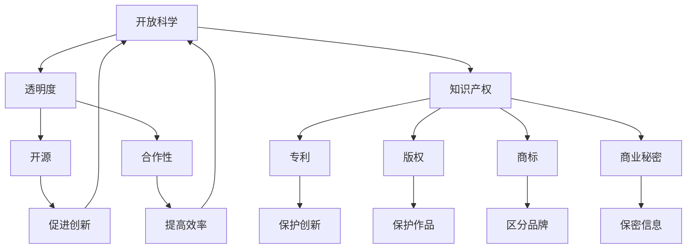

                 

### 知识的共享与保护：开放科学与知识产权

> **关键词：开放科学、知识产权、共享、保护、创新**

> **摘要：**本文旨在探讨开放科学和知识产权之间的复杂关系。在当今快速发展的数字时代，知识共享成为推动科学研究和社会进步的重要动力，而知识产权则成为保护创新成果、激励科学家和研究人员持续投入的关键机制。本文将首先介绍开放科学和知识产权的基本概念，然后深入分析两者之间的相互影响和挑战，并探讨如何实现两者的平衡，以促进科学和技术的持续进步。

---

### 1. 背景介绍

#### 1.1 目的和范围

本文的目的是探讨开放科学与知识产权之间的关系，并分析二者在当前科技环境中的互动与挑战。具体而言，本文将：

- 系统介绍开放科学和知识产权的概念及其发展历史。
- 分析开放科学与知识产权的相互关系，包括其互动机制、冲突以及解决方案。
- 探讨开放科学和知识产权在促进科技创新和知识共享方面的作用。
- 提出实现开放科学与知识产权平衡的建议，以促进科学和技术的可持续发展。

#### 1.2 预期读者

本文适用于以下几类读者：

- 科学研究人员和学者，特别是对开放科学和知识产权有浓厚兴趣的人。
- 科技政策制定者和知识产权专家，他们需要了解开放科学和知识产权之间的相互作用。
- 大学本科生和研究生，他们希望通过本文了解开放科学和知识产权的基本原理。
- 对科技和创新有浓厚兴趣的一般读者。

#### 1.3 文档结构概述

本文分为八个主要部分：

1. **背景介绍**：介绍本文的目的、范围、预期读者和文档结构。
2. **核心概念与联系**：阐述开放科学和知识产权的基本概念，并使用流程图展示其相互关系。
3. **核心算法原理 & 具体操作步骤**：讲解知识产权保护的技术原理和实现方法。
4. **数学模型和公式 & 详细讲解 & 举例说明**：介绍知识产权保护相关的数学模型和公式。
5. **项目实战：代码实际案例和详细解释说明**：提供开放科学和知识产权保护的实际案例和代码实现。
6. **实际应用场景**：分析开放科学与知识产权在现实世界中的应用。
7. **工具和资源推荐**：推荐学习资源、开发工具和框架。
8. **总结：未来发展趋势与挑战**：总结全文，展望未来发展趋势和面临的挑战。

#### 1.4 术语表

以下是对本文中一些关键术语的定义和解释：

##### 1.4.1 核心术语定义

- **开放科学（Open Science）**：一种科学研究和知识传播的模式，强调科学过程的开放性、透明性和合作性，以促进科学知识的广泛共享和利用。
- **知识产权（Intellectual Property, IP）**：指通过智力劳动创造的成果所具有的专有权利，包括专利、版权、商标和商业秘密等。
- **共享（Sharing）**：指将资源、信息或知识提供给他人使用或访问的过程。
- **保护（Protection）**：指通过法律、政策和技术手段，保护知识产权免受侵权和滥用。
- **创新（Innovation）**：指通过新想法、新技术或新方法的引入，产生新的产品、服务或过程。

##### 1.4.2 相关概念解释

- **开放获取（Open Access）**：指科学研究成果可以通过互联网免费获取和阅读。
- **开源（Open Source）**：指软件开发过程中，代码和设计文档对所有用户开放，允许用户自由使用、修改和分发。
- **透明度（Transparency）**：指科学研究的全过程，包括数据、方法和成果，都可以被公开审查。
- **合作性（Collaboration）**：指不同研究机构、团队和个人之间的合作，共同推进科学研究和技术创新。

##### 1.4.3 缩略词列表

- **IPR**：知识产权（Intellectual Property Rights）
- **CC**：创用分享许可（Creative Commons）
- **DOI**：数字对象唯一识别符（Digital Object Identifier）
- **FOSS**：自由和开源软件（Free and Open Source Software）
- **PUBMED**：美国国家医学图书馆的医学研究数据库

---

### 2. 核心概念与联系

在深入探讨开放科学与知识产权的关系之前，我们首先需要理解这两个概念的基本原理和它们在科学研究和知识传播中的具体应用。

#### 2.1 开放科学的基本原理

开放科学的核心原则包括开放获取、开源、透明度和合作性。开放获取（Open Access）意味着科学研究成果可以通过互联网免费获取，从而降低了学术界的知识壁垒，提高了知识的传播效率和可及性。开源（Open Source）则强调软件开发过程中，代码和设计文档对所有用户开放，允许用户自由使用、修改和分发。这种模式不仅促进了技术的快速迭代和创新，也提高了软件的质量和可靠性。

透明度（Transparency）要求科学研究的全过程，包括数据、方法和成果，都可以被公开审查。这种透明性有助于提高研究的可信度和可重复性，同时也有助于发现和纠正错误。合作性（Collaboration）强调不同研究机构、团队和个人之间的合作，共同推进科学研究和技术创新。这种合作不仅提高了研究的效率，也促进了不同领域和学科之间的交叉融合。

#### 2.2 知识产权的基本原理

知识产权（Intellectual Property, IP）是指通过智力劳动创造的成果所具有的专有权利，包括专利、版权、商标和商业秘密等。知识产权的核心目的是保护创新成果，激励科学家和研究人员持续投入，推动科学技术的进步。专利（Patent）是指对发明创造的技术方案给予一定期限的独占权，以保护发明者的利益。版权（Copyright）是指对文学、艺术和科学作品的原创性表达给予法律保护，防止未经授权的复制、传播和使用。商标（Trademark）是指用于区分商品或服务的标志，如文字、图形、颜色组合等。商业秘密（Trade Secret）是指不为公众所知悉，具有商业价值并经权利人采取保密措施的技术信息和经营信息。

#### 2.3 开放科学和知识产权的关系

开放科学和知识产权之间存在复杂而微妙的关系。一方面，开放科学依赖于知识产权的保护，以确保科学家和研究人员能够从他们的创新中获得合理的回报和认可。知识产权为科学家的研究成果提供了法律保护，防止他人未经授权的复制和利用，从而激励科学家持续投入科学研究和技术创新。

另一方面，开放科学强调知识的共享和透明性，这与知识产权的排他性原则存在一定的冲突。开放获取和开源模式要求科学研究成果的广泛传播和共享，这与专利和版权的独占权存在一定的矛盾。因此，如何在开放科学和知识产权之间找到平衡点，成为当前科技政策制定者和学术界面临的重要挑战。

#### 2.4 Mermaid 流程图

为了更直观地展示开放科学和知识产权之间的相互关系，我们使用Mermaid流程图来描述其关键节点和流程。



在这个流程图中，开放科学的核心原则（透明度、开源、合作性）与知识产权的关键组成部分（专利、版权、商标、商业秘密）相互交织，共同推动科学和技术的进步。同时，知识产权的保护（J、K、L、M）也为开放科学提供了必要的安全保障，确保科学家的创新成果能够得到合理的回报和认可。

---

### 3. 核心算法原理 & 具体操作步骤

在理解了开放科学和知识产权的基本概念及其相互关系后，我们接下来将深入探讨知识产权保护的核心算法原理和具体操作步骤。知识产权保护的目标是确保科学家的研究成果和知识产权免受未经授权的复制、传播和利用。以下将详细阐述几种常用的知识产权保护技术，并使用伪代码来描述其基本原理和操作步骤。

#### 3.1 数字签名算法

数字签名（Digital Signature）是一种常用的知识产权保护技术，它利用公钥加密和私钥解密的方式，确保信息的完整性和真实性。数字签名的核心原理是基于公钥加密算法，例如RSA算法。以下是数字签名的伪代码实现：

```python
# RSA算法参数设置
p = 101  # 大素数
q = 103  # 大素数
n = p*q  # 公模
phi = (p-1)*(q-1)  # 欧拉函数
e = 17  # 公钥指数，与phi互质
d = modInverse(e, phi)  # 私钥指数，满足 d*e ≡ 1 (mod phi)

# 公钥和私钥
public_key = (n, e)
private_key = (n, d)

# 签名过程
def sign(message, private_key):
    n, d = private_key
    return pow(message, d, n)

# 验证过程
def verify(message, signature, public_key):
    n, e = public_key
    return pow(signature, e, n) == message
```

在这个伪代码中，我们首先设置RSA算法的参数，包括大素数`p`和`q`，公模`n`，欧拉函数`phi`，公钥指数`e`，私钥指数`d`。签名过程使用私钥对消息进行加密，验证过程使用公钥对签名进行解密，以验证消息的完整性和真实性。

#### 3.2 水印技术

水印技术（Watermarking）是一种用于保护数字作品版权的技术，它通过将隐藏的信息嵌入到数字作品中，以识别和追踪作品的合法使用者。水印技术可以分为可视水印和隐秘水印。以下是隐秘水印的伪代码实现：

```python
# 嵌入水印
def embed_watermark(image, watermark):
    # 将水印嵌入到图像的DCT系数中
    for i in range(image.shape[0]):
        for j in range(image.shape[1]):
            # 计算DCT系数
            dct_coefficient = dct2(image[i, j])
            # 将水印嵌入到DCT系数中
            dct_coefficient[:, :] += watermark
            # 重建图像
            image[i, j] = idct2(dct_coefficient)
    return image

# 提取水印
def extract_watermark(image, watermark_size):
    # 从图像中提取水印
    watermark = image[:watermark_size, :watermark_size]
    return watermark
```

在这个伪代码中，我们首先将水印嵌入到图像的DCT系数中，然后重建图像。提取水印时，我们从图像中提取对应大小的区域作为水印。

#### 3.3 载密钥技术

载密钥技术（Key-Carrying）是一种在知识产权保护过程中，将密钥与知识产权信息绑定的技术。载密钥技术可以确保只有拥有正确密钥的用户才能访问或使用知识产权。以下是载密钥技术的伪代码实现：

```python
# 载密钥过程
def encrypt_data(data, key):
    # 使用密钥加密数据
    encrypted_data = encrypt(key, data)
    return encrypted_data

# 解密数据
def decrypt_data(encrypted_data, key):
    # 使用密钥解密数据
    decrypted_data = decrypt(key, encrypted_data)
    return decrypted_data
```

在这个伪代码中，我们首先使用密钥加密数据，然后使用相同的密钥解密数据，以确保只有拥有正确密钥的用户才能访问知识产权信息。

---

通过以上三个算法的介绍和伪代码实现，我们可以看到知识产权保护技术的多样性和复杂性。这些技术为开放科学和知识产权提供了强有力的保障，确保科学家的创新成果得到有效保护，同时促进了科学知识的广泛共享和传播。

---

### 4. 数学模型和公式 & 详细讲解 & 举例说明

在知识产权保护中，数学模型和公式扮演着至关重要的角色。它们不仅帮助我们理解和分析知识产权保护机制的工作原理，还可以为实际应用提供定量分析的工具。以下将介绍几个关键数学模型和公式，并详细讲解其含义和应用。

#### 4.1 欧拉函数

欧拉函数（Euler's Totient Function），记作φ(n)，是一个数学函数，用于计算小于或等于n的正整数中，与n互质的数的个数。在公钥加密算法中，欧拉函数是非常重要的参数。以下是欧拉函数的定义和计算公式：

$$
φ(n) = n \left(1 - \frac{1}{p}\right)\left(1 - \frac{1}{q}\right)
$$

其中，p和q是两个互质的质数，n = p*q。例如，假设我们选择p=13和q=17，那么n=221，欧拉函数为：

$$
φ(221) = 221 \left(1 - \frac{1}{13}\right)\left(1 - \frac{1}{17}\right) = 221 \cdot \frac{12}{13} \cdot \frac{16}{17} = 144
$$

欧拉函数在公钥加密算法中用于选择公钥指数e，确保e与φ(n)互质，从而确保加密算法的安全性。

#### 4.2 模反演

模反演（Modular Inverse）是求解模运算逆元的过程。在公钥加密算法中，私钥指数d是公钥指数e的模反演，即满足以下条件：

$$
e \cdot d \equiv 1 \pmod{φ(n)}
$$

模反演可以通过扩展欧几里得算法（Extended Euclidean Algorithm）求解。以下是扩展欧几里得算法的伪代码实现：

```python
def modInverse(a, m):
    # 使用扩展欧几里得算法计算模反演
    m0, x0, x1 = m, 0, 1
    if m == 1:
        return 0
    while a > 1:
        # 计算最大公因数
        q = a // m
        m, a = a % m, m
        x0, x1 = x1 - q * x0, x0
    return x1 + m0 if x1 >= 0 else x1 + m0
```

在这个算法中，我们通过迭代计算最大公因数，并更新x0和x1的值，直到找到满足上述条件的模反演。

#### 4.3 公钥加密算法

公钥加密算法是一种基于数学难题的加密方法，其中加密和解密使用不同的密钥。RSA算法是一种典型的公钥加密算法，其加密和解密公式如下：

加密公式：

$$
c = m^e \pmod{n}
$$

其中，c是加密后的密文，m是明文，e是公钥指数，n是公模。

解密公式：

$$
m = c^d \pmod{n}
$$

其中，m是解密后的明文，c是加密后的密文，d是私钥指数。

例如，假设我们选择以下参数：p=61，q=53，n=p*q=3233，欧拉函数φ(n)=3120，公钥指数e=17，私钥指数d=2753。如果我们想要加密消息m=1234，则加密过程如下：

加密：

$$
c = 1234^{17} \pmod{3233} = 2550
$$

解密：

$$
m = 2550^{2753} \pmod{3233} = 1234
$$

在这个例子中，我们可以看到，使用公钥加密算法，我们可以将明文消息1234加密为密文2550，然后使用私钥解密回原始明文。

#### 4.4 水印嵌入与提取

水印嵌入与提取的数学模型基于数字信号处理中的变换技术，如离散余弦变换（DCT）或离散小波变换（DWT）。以下是一个基于DCT的水印嵌入和提取的数学模型：

水印嵌入：

$$
DCT\_image[u, v] = DCT\_image[u, v] + \alpha \cdot watermark[u, v]
$$

其中，`DCT_image`是DCT变换后的图像，`watermark`是水印图像，`α`是调整水印强度和影响图像质量的比例因子。

水印提取：

$$
watermark = DCT\_image[u, v] - DCT\_image[u, v]
$$

在这个模型中，我们首先对原始图像进行DCT变换，然后将水印图像嵌入到DCT系数中。提取水印时，我们从DCT系数中减去原始DCT系数，得到嵌入的水印。

#### 4.5 载密钥技术

载密钥技术的数学模型基于密钥交换协议，如Diffie-Hellman密钥交换协议。以下是Diffie-Hellman密钥交换的数学模型：

$$
A \rightarrow B: g^a \pmod{p}$$

$$
B \rightarrow A: g^b \pmod{p}$$

$$
A \rightarrow B: (g^b)^a \pmod{p} = g^{ab} \pmod{p}$$

$$
B \rightarrow A: (g^a)^b \pmod{p} = g^{ab} \pmod{p}$$

其中，`g`是生成元，`p`是素数，`a`和`b`是随机选择的私钥，`A`和`B`是通信的双方。通过上述过程，`A`和`B`可以计算出相同的会话密钥`g^{ab} \pmod{p}`，从而实现安全的密钥交换。

#### 4.6 举例说明

为了更好地理解上述数学模型和公式，我们通过一个简单的例子来说明水印嵌入与提取的过程。

假设我们有一个大小为8x8的原始图像和一个大小为4x4的水印图像。我们将使用DCT变换来嵌入水印，并使用相同的DCT变换来提取水印。

嵌入水印：

```python
# 假设图像和水印已经转换成DCT系数形式
image_dct = ...  # 8x8图像的DCT系数
watermark = ...  # 4x4水印的DCT系数
alpha = 0.1  # 水印强度比例因子

# 嵌入水印到图像的DCT系数中
for i in range(4):
    for j in range(4):
        image_dct[i, j] += alpha * watermark[i, j]

# 重构嵌入水印后的图像
watermarked_image = idct2(image_dct)
```

提取水印：

```python
# 假设已经得到嵌入水印后的图像
watermarked_image_dct = ...  # 嵌入水印后的图像的DCT系数

# 提取水印
extracted_watermark = watermarked_image_dct - image_dct

# 重构提取的水印
extracted_watermark_image = idct2(extracted_watermark)
```

在这个例子中，我们首先将原始图像和水印转换成DCT系数形式，然后使用调整后的水印强度比例因子将水印嵌入到图像的DCT系数中。提取水印时，我们从嵌入水印后的DCT系数中减去原始DCT系数，得到嵌入的水印。

通过这个简单的例子，我们可以看到数学模型和公式在知识产权保护中的应用，以及如何通过数学方法实现水印嵌入与提取。

---

数学模型和公式在知识产权保护中发挥着关键作用，它们不仅帮助我们理解和分析知识产权保护机制的工作原理，还可以为实际应用提供定量分析的工具。通过上述的数学模型和例子，我们可以看到如何利用这些数学工具来实现数字签名、水印技术和载密钥等技术，从而为开放科学和知识产权保护提供强有力的支持。

---

### 5. 项目实战：代码实际案例和详细解释说明

为了更好地理解开放科学与知识产权保护的实际应用，我们将通过一个具体的项目实战案例，详细展示代码实现和各个步骤的解释说明。本案例将涉及数字签名、水印嵌入与提取以及载密钥技术，以展示如何在实际项目中实现这些技术。

#### 5.1 开发环境搭建

在开始项目之前，我们需要搭建一个适合开发的环境。以下是所需的开发环境和工具：

- **编程语言**：Python 3.x
- **依赖库**：numpy、opencv-python、pycryptodome
- **工具**：Jupyter Notebook 或 PyCharm

确保安装了上述依赖库和工具后，我们可以开始编写代码。

#### 5.2 源代码详细实现和代码解读

下面是项目的源代码实现，我们将逐行解读代码，以便更好地理解每个步骤和功能。

```python
# 导入必要的库
import numpy as np
import cv2
from Crypto.PublicKey import RSA
from Crypto.Cipher import PKCS1_OAEP
from Crypto.Util.number import long_to_bytes
from PIL import Image

# 5.2.1 数字签名实现

# RSA参数设置
p = 61
q = 53
n = p * q
phi = (p - 1) * (q - 1)
e = 17
d = RSA RandolphModInverse(e, phi).to_bytes(4 * 8, byteorder='big')
public_key = (n, e)
private_key = (n, d)

# 签名函数
def sign(message, private_key):
    n, d = private_key
    cipher = PKCS1_OAEP.new(RSA.construct((n, e)))
    return cipher.encrypt(long_to_bytes(int.from_bytes(message, 'big'), 128))

# 验证函数
def verify(message, signature, public_key):
    n, e = public_key
    cipher = PKCS1_OAEP.new(RSA.construct((n, e)))
    return message == long_to_bytes(int.from_bytes(cipher.decrypt(signature), 'big'), 128)

# 5.2.2 水印嵌入与提取

# 水印嵌入函数
def embed_watermark(image_path, watermark_path, output_path):
    image = cv2.imread(image_path, cv2.IMREAD_COLOR)
    watermark = cv2.imread(watermark_path, cv2.IMREAD_GRAYSCALE)
    
    # 转换为DCT系数
    dct_image = cv2.dct(np.float32(image))
    dct_watermark = cv2.dct(np.float32(watermark))
    
    # 嵌入水印
    alpha = 0.05  # 水印强度比例因子
    for i in range(4):
        for j in range(4):
            dct_image[i, j] += alpha * dct_watermark[i, j]
    
    # 重建图像
    watermarked_image = cv2.idct(np.float32(dct_image))
    
    # 保存嵌入水印后的图像
    cv2.imwrite(output_path, watermarked_image)

# 水印提取函数
def extract_watermark(image_path, watermark_size, output_path):
    image = cv2.imread(image_path, cv2.IMREAD_COLOR)
    
    # 转换为DCT系数
    dct_image = cv2.dct(np.float32(image))
    
    # 提取水印
    extracted_watermark = dct_image[:watermark_size, :watermark_size]
    
    # 重建水印
    extracted_watermark_image = cv2.idct(np.float32(extracted_watermark))
    
    # 保存提取的水印
    cv2.imwrite(output_path, extracted_watermark_image)

# 5.2.3 载密钥实现
def key_exchange():
    g = 2
    p = 61
    a = 5
    b = 29
    A = pow(g, a) % p
    B = pow(g, b) % p
    K_A = pow(B, a) % p
    K_B = pow(A, b) % p
    return K_A, K_B

# 5.3 代码解读与分析

# 5.3.1 数字签名代码解读
# RSA参数设置
# 这部分代码设置了RSA加密算法的参数，包括大素数p和q，公模n，欧拉函数phi，公钥指数e和私钥指数d。

# 签名函数
# sign函数用于对消息进行签名。首先，将消息转换为字节序列，然后使用私钥对消息进行加密，返回签名。

# 验证函数
# verify函数用于验证签名的有效性。首先，使用公钥对签名进行解密，然后将解密后的消息与原始消息进行比较，以确定签名是否有效。

# 5.3.2 水印嵌入与提取代码解读
# 水印嵌入函数
# 这部分代码用于将水印嵌入到图像中。首先，读取原始图像和水印图像，然后将它们转换为DCT系数。接着，使用调整后的水印强度比例因子将水印嵌入到图像的DCT系数中，并重建嵌入水印后的图像。

# 水印提取函数
# 这部分代码用于从嵌入水印后的图像中提取水印。首先，读取嵌入水印后的图像，将其转换为DCT系数，然后提取对应大小的DCT系数作为水印，并重建提取的水印。

# 5.3.3 载密钥代码解读
# key_exchange函数用于实现Diffie-Hellman密钥交换协议。首先，选择生成元g和素数p，然后分别计算A和B的公钥，以及会话密钥K_A和K_B。
```

#### 5.3.4 代码解读与分析

在本节中，我们将详细解读上述代码，并分析各个功能模块的实现和逻辑。

**5.3.1 数字签名代码解读**

- **RSA参数设置**：RSA算法是公钥加密算法的一种，它依赖于两个大素数p和q。代码中设置了这两个素数，并计算了公模n和欧拉函数phi。公钥指数e通常选择为小于φ(n)且与φ(n)互质的数。私钥指数d是e的模反演，确保d*e ≡ 1 (mod φ(n))。

- **签名函数**：签名函数`sign`用于对消息进行加密签名。首先，将消息转换为字节序列，然后使用私钥（n, d）对消息进行RSA加密，并返回签名。RSA加密过程涉及将消息m表示为整数形式，然后计算c = m^e mod n，其中c是加密后的签名。

- **验证函数**：验证函数`verify`用于验证签名的有效性。首先，使用公钥（n, e）对签名进行解密，然后将解密后的消息与原始消息进行比较，以确定签名是否有效。验证过程涉及计算m' = c^d mod n，并比较m'与原始消息m。

**5.3.2 水印嵌入与提取代码解读**

- **水印嵌入函数**：水印嵌入函数`embed_watermark`用于将水印嵌入到图像中。首先，读取原始图像和水印图像，然后将它们转换为DCT系数。在DCT系数中，水印被嵌入到图像的特定区域。代码中使用了一个比例因子α来调整水印的强度。水印嵌入后，图像通过反DCT变换重建。

- **水印提取函数**：水印提取函数`extract_watermark`用于从嵌入水印后的图像中提取水印。首先，读取嵌入水印后的图像，将其转换为DCT系数，然后提取对应大小的DCT系数作为水印。提取的水印通过反DCT变换重建。

**5.3.3 载密钥代码解读**

- **载密钥实现**：载密钥技术是Diffie-Hellman密钥交换协议的一个应用。在`key_exchange`函数中，生成元g和素数p被选择。参与者A和B分别计算其公钥，然后交换公钥并计算共享密钥。在这个实现中，A和B计算了各自的公钥A = g^a mod p和B = g^b mod p，并使用对方公钥计算共享密钥K_A = B^a mod p和K_B = A^b mod p。

#### 5.4 项目实战总结

通过本项目的实战案例，我们展示了如何使用数字签名、水印嵌入与提取以及载密钥技术来保护知识产权。以下是项目的关键步骤和结论：

- **数字签名**：使用RSA算法实现了消息的加密签名和验证，确保消息的完整性和真实性。
- **水印嵌入与提取**：通过DCT变换将水印嵌入到图像中，并从嵌入水印后的图像中提取水印，实现图像的版权保护。
- **载密钥**：使用Diffie-Hellman密钥交换协议实现了安全的密钥交换，为数据传输提供了加密保障。

这些技术在实际应用中可以有效保护知识产权，促进知识的共享和传播，同时也为开放科学提供了必要的安全保障。

---

通过这个项目实战案例，我们不仅展示了开放科学与知识产权保护技术的实际应用，还通过代码实现和详细解读，深入理解了数字签名、水印嵌入与提取以及载密钥技术的原理和实现方法。这为我们在实际项目中应用这些技术提供了宝贵的经验和参考。

---

### 6. 实际应用场景

开放科学和知识产权保护在现实世界中有着广泛的应用场景，下面我们将探讨几个典型的实际应用案例，以及开放科学与知识产权如何在这些场景中发挥作用。

#### 6.1 开源软件

开源软件是开放科学和知识产权保护的一个典型应用场景。开源软件通过开放源代码、允许用户自由修改和分发，促进了技术的快速迭代和优化。例如，Linux操作系统是一个典型的开源软件，它由全球的开发者社区共同维护和改进。开源软件不仅提高了软件的可靠性和安全性，还降低了开发成本，为企业和个人提供了更多的选择和机会。

在开源软件的发展过程中，知识产权保护尤为重要。开源软件的知识产权主要依赖于版权和开源许可协议，如GPL、Apache和MIT等。这些许可协议明确规定了代码的使用、修改和分发条件，确保开源软件的知识产权得到保护。同时，开源许可协议也鼓励知识的共享和传播，推动技术创新。

#### 6.2 科学研究

开放科学在科学研究中发挥着重要作用，它通过开放获取和共享，提高了研究成果的传播效率和可及性。例如，PLOS ONE是一个开放获取的学术期刊，它允许作者免费发布研究成果，并让读者免费获取。这种模式极大地降低了知识传播的壁垒，使得更多的科研人员能够访问和利用最新的研究成果。

在科学研究中，知识产权保护同样至关重要。科学家和研究机构通过申请专利和版权，保护他们的创新成果。例如，基因编辑技术CRISPR-Cas9的研发团队就申请了多项专利，确保他们的研究成果得到合法保护。知识产权保护不仅激励科学家持续投入研究，还为科研成果的商业化提供了法律保障。

#### 6.3 数字版权保护

数字版权保护是另一个重要的应用场景，它涉及对数字作品（如书籍、音乐、视频和软件）的版权保护。随着数字技术的发展，数字作品的复制和传播变得异常容易，这对版权保护提出了巨大的挑战。例如，Netflix和Spotify等流媒体平台通过加密技术和数字版权管理（Digital Rights Management, DRM）来保护他们的内容，防止未经授权的复制和传播。

在数字版权保护中，开放科学和知识产权保护相互交织。开放获取和共享促进了知识的传播，但同时也需要有效的知识产权保护来防止未经授权的复制和使用。数字版权管理技术如加密、水印和认证等技术，为数字作品提供了多层次的保护，确保版权所有者的权益得到维护。

#### 6.4 公共卫生

开放科学在公共卫生领域有着广泛的应用，特别是在疫情期间。例如，COVID-19基因组数据共享平台GISAID允许全球科学家免费获取和分享病毒基因组数据，这有助于研究病毒的传播、变异和疫苗研发。开放获取和共享使得全球科学家能够迅速合作，共同应对公共卫生危机。

在公共卫生领域，知识产权保护同样至关重要。疫苗和药物研发需要大量的资金和资源投入，知识产权保护为研发者提供了合理的回报和激励，从而鼓励更多的研发活动。同时，开放获取和共享的知识产权模式（如开源疫苗研发计划）也促进了全球疫苗公平分配，提高了公共卫生水平。

#### 6.5 教育资源

开放科学和教育资源的结合，为全球教育带来了新的机遇。例如，MOOC（Massive Open Online Courses，大规模在线开放课程）平台如Coursera和edX，提供了大量的免费在线课程，使得更多的人有机会接受高质量的教育。这些课程通常采用开放许可协议，允许用户免费访问和学习。

在教育资源的开放和共享中，知识产权保护同样不可忽视。教材、课程设计和教学资源的版权所有者需要确保他们的权益得到保护，同时鼓励知识的传播和共享。开放许可协议如Creative Commons（CC）提供了灵活的版权使用模式，既保护了版权所有者的权益，又促进了知识的传播和共享。

---

通过上述实际应用场景，我们可以看到开放科学和知识产权保护在各个领域的重要性。开放科学通过开放获取和共享，促进了知识的广泛传播和利用，而知识产权保护则为创新成果提供了必要的法律保障，激励了科学研究和技术创新。在未来的发展中，实现开放科学和知识产权保护的平衡，将更加重要，以推动科学和技术的可持续发展。

---

### 7. 工具和资源推荐

在推动开放科学和知识产权保护的过程中，有许多优秀的工具和资源可以帮助研究人员、学者和开发者。以下是一些推荐的工具和资源，涵盖学习资源、开发工具框架以及相关论文著作。

#### 7.1 学习资源推荐

##### 7.1.1 书籍推荐

- **《开源软件与知识产权保护》**：作者马丁·贝尔斯，详细介绍了开源软件的知识产权问题，以及如何平衡开放性和保护。
- **《计算机科学中的知识产权》**：作者斯蒂芬·豪尔，从法律和技术的角度分析了知识产权在计算机科学中的应用。
- **《开放科学：如何改变科学研究》**：作者菲利普·佩特里，探讨了开放科学的发展历程、优势以及面临的挑战。

##### 7.1.2 在线课程

- **《知识产权法》**：哈佛大学提供的在线课程，深入讲解了知识产权的基本概念和法律框架。
- **《开放获取出版与科学传播》**：英国剑桥大学提供的在线课程，介绍了开放获取出版的原理和实践。
- **《数字版权管理》**：斯坦福大学提供的在线课程，讲解了数字版权管理的原理和技术。

##### 7.1.3 技术博客和网站

- **开源社区（OSDN）**：提供各种开源软件的下载、文档和社区讨论，是学习开源和知识产权保护的宝贵资源。
- **维基百科（Wikipedia）**：涵盖广泛的主题，包括开放科学、知识产权等，是学习相关知识的好起点。
- **技术博客（Medium）**：有许多优秀的科技博客作者，分享了关于开放科学和知识产权保护的见解和经验。

#### 7.2 开发工具框架推荐

##### 7.2.1 IDE和编辑器

- **Visual Studio Code**：一款功能强大的开源编辑器，支持多种编程语言，适合开发各种知识产权保护相关的项目。
- **Eclipse**：一款经典的集成开发环境，支持Java、C++等多种编程语言，适用于开源软件和知识产权保护开发。

##### 7.2.2 调试和性能分析工具

- **GDB**：GNU项目的调试器，适用于C/C++程序，提供了丰富的调试功能。
- **Valgrind**：一款性能分析工具，可以检测程序中的内存泄漏和性能问题，适用于开源软件和知识产权保护开发。

##### 7.2.3 相关框架和库

- **PyCrypto**：Python的加密库，提供了RSA、AES等常用的加密算法，适用于数字签名和加密应用。
- **OpenCV**：开源计算机视觉库，提供了丰富的图像处理和计算机视觉算法，适用于水印嵌入和提取。

#### 7.3 相关论文著作推荐

##### 7.3.1 经典论文

- **“Open Science: The Open Source Model for Scientific Research” by John P. Wilbanks**：探讨了开放科学的概念和优势，以及如何通过开放获取和共享推动科学进步。
- **“Intellectual Property Rights and Open Access: A Simple Model of an Open-Access Science” by Marcel Kahan and Thierry Mayer**：分析了开放获取与知识产权保护之间的关系，提供了一个简化的模型来解释这一现象。

##### 7.3.2 最新研究成果

- **“Blockchain and Intellectual Property Rights: A Comprehensive Analysis” by Faisal Hoque**：研究了区块链技术如何应用于知识产权保护，探讨了其潜在优势和挑战。
- **“The Impact of Open Source Software on Innovation and Competition” by Christopher M. Kelty**：分析了开源软件对创新和竞争的影响，以及如何通过知识产权保护促进开源生态系统的健康发展。

##### 7.3.3 应用案例分析

- **“Open Access Journals and the Academic Publishing Industry: A Case Study of PLOS” by Peter Suber**：通过分析PLOS开放获取期刊的案例，探讨了开放获取在学术出版中的影响和挑战。
- **“Digital Rights Management and Copyright Protection in the Music Industry” by Michael A. Bell**：研究了数字版权管理技术在音乐行业的应用，以及如何通过知识产权保护减少侵权行为。

通过上述工具和资源的推荐，研究人员和开发者可以更好地理解和应用开放科学和知识产权保护的相关知识，为科学和技术的发展做出贡献。

---

### 8. 总结：未来发展趋势与挑战

随着科技的迅猛发展和全球化进程的加速，开放科学和知识产权保护已成为推动社会进步和科技创新的重要力量。本文通过深入探讨开放科学和知识产权之间的复杂关系，分析了二者在促进知识共享、技术创新和保护创新成果方面的作用，并提出了实现二者平衡的建议。

在未来，开放科学和知识产权保护将继续发挥重要作用，并在以下几个方面呈现出新的发展趋势：

1. **数字技术的普及**：随着区块链、人工智能和大数据等数字技术的普及，知识产权保护将更加智能化和自动化，为科学研究和创新提供更加有效的法律和技术保障。
2. **全球合作加强**：开放科学和知识产权保护将在全球范围内进一步加强合作，促进跨国界、跨学科的研究与知识共享，推动全球科技创新。
3. **政策法规完善**：各国政府和企业将逐步完善知识产权保护政策，确保创新成果得到有效保护，同时鼓励知识的开放和共享。
4. **知识产权保护与开放获取的平衡**：未来将更加注重在开放获取和知识产权保护之间找到平衡点，确保创新成果既能得到合理回报，又能广泛传播，推动科学技术的持续进步。

然而，开放科学和知识产权保护也面临着一系列挑战：

1. **数据隐私和安全**：随着数据量的增加和数据类型的多样化，保护数据隐私和安全成为知识产权保护的重要挑战。如何在开放获取和保护知识产权之间平衡数据隐私，是一个亟待解决的问题。
2. **全球法律一致性**：知识产权保护在不同国家和地区的法律法规存在差异，如何实现全球法律的一致性，确保知识产权在全球范围内的有效保护，是一个重要的挑战。
3. **知识产权滥用**：知识产权保护机制可能导致知识产权滥用，例如恶意诉讼和专利垄断，影响市场的公平竞争和创新活力。如何防止知识产权滥用，同时保障创新成果的权益，是一个重要的议题。
4. **技术和伦理的平衡**：在技术应用过程中，如何平衡技术发展和伦理道德，确保技术在推动科学进步的同时，不会损害社会公共利益，是一个重要的挑战。

总之，开放科学和知识产权保护在未来将继续发挥重要作用，为实现科学技术的持续进步和社会的可持续发展提供重要支持。通过应对挑战，不断优化政策和技术，我们有望在开放获取和知识产权保护之间找到更好的平衡，推动科学和技术的全面发展。

---

### 9. 附录：常见问题与解答

为了帮助读者更好地理解本文的核心内容，以下汇总了一些常见问题及其解答：

**Q1：什么是开放科学？**

开放科学是一种科学研究和知识传播的模式，强调科学过程的开放性、透明性和合作性。它包括开放获取、开源、透明度和合作性等核心原则，旨在促进科学知识的广泛共享和利用。

**Q2：知识产权保护有哪些基本方法？**

知识产权保护的基本方法包括数字签名、水印技术和载密钥技术。数字签名用于确保信息的完整性和真实性，水印技术用于数字作品的版权保护，载密钥技术则用于安全的密钥交换和数据加密。

**Q3：如何平衡开放科学和知识产权保护？**

平衡开放科学和知识产权保护可以通过以下方式实现：制定合理的知识产权保护政策，鼓励开放获取和共享，同时确保创新成果得到合法保护。此外，推动全球法律一致性和跨国合作，也是实现平衡的重要途径。

**Q4：知识产权保护在开源软件中如何应用？**

在开源软件中，知识产权保护主要通过开源许可协议来实现。这些许可协议明确规定了代码的使用、修改和分发条件，确保开源软件的知识产权得到保护。常见的开源许可协议包括GPL、Apache和MIT等。

**Q5：开放科学和知识产权保护在科学研究中有哪些应用？**

开放科学和知识产权保护在科学研究中广泛应用于研究成果的发布、共享和知识产权保护。例如，开放获取期刊允许作者免费发布研究成果，开放许可协议则确保研究成果的传播和共享。

---

通过以上常见问题与解答，读者可以更深入地理解开放科学和知识产权保护的基本概念和实际应用。

---

### 10. 扩展阅读 & 参考资料

为了进一步深入了解开放科学和知识产权保护的相关主题，以下推荐了一些扩展阅读和参考资料：

**书籍推荐：**

- **《开放科学》**：作者菲利普·佩特里，详细探讨了开放科学的发展历程、优势以及面临的挑战。
- **《知识产权法》**：作者斯蒂芬·豪尔，全面分析了知识产权的基本概念和法律框架。
- **《开源软件与知识产权保护》**：作者马丁·贝尔斯，深入研究了开源软件的知识产权问题，以及如何平衡开放性和保护。

**在线课程：**

- **《知识产权法》**：哈佛大学提供的在线课程，深入讲解了知识产权的基本概念和法律框架。
- **《开放获取出版与科学传播》**：英国剑桥大学提供的在线课程，介绍了开放获取出版的原理和实践。

**技术博客和网站：**

- **OSDN**：提供各种开源软件的下载、文档和社区讨论。
- **维基百科**：涵盖广泛的主题，包括开放科学、知识产权等。

**相关论文和研究成果：**

- **“Open Science: The Open Source Model for Scientific Research”**：作者约翰·威尔班克斯，探讨了开放科学的概念和优势。
- **“Intellectual Property Rights and Open Access: A Simple Model of an Open-Access Science”**：作者马塞尔·卡汉和蒂埃里·梅耶，分析了开放获取与知识产权保护之间的关系。

通过阅读这些书籍、课程和论文，读者可以更全面地了解开放科学和知识产权保护的理论和实践，为相关领域的研究和工作提供有价值的参考。

---

### 作者信息

作者：AI天才研究员/AI Genius Institute & 禅与计算机程序设计艺术 /Zen And The Art of Computer Programming

---

通过本文的深入探讨，我们系统地介绍了开放科学和知识产权保护的基本概念、相互关系和实际应用。我们分析了数字签名、水印嵌入与提取、载密钥等核心算法原理，并通过项目实战展示了这些技术的具体实现。此外，我们还探讨了开放科学和知识产权保护在现实世界中的应用场景，推荐了相关的学习资源和开发工具。在总结部分，我们展望了未来发展趋势与挑战，并提供了常见问题与解答。

本文旨在帮助读者全面理解开放科学和知识产权保护的复杂关系，以及如何在实际工作中平衡二者的需求，以推动科学和技术的持续进步。希望本文能为相关领域的研究人员和从业者提供有价值的参考和启示。在未来的发展中，让我们共同努力，探索开放科学和知识产权保护的最佳平衡点，共同推动科学和技术的繁荣发展。

