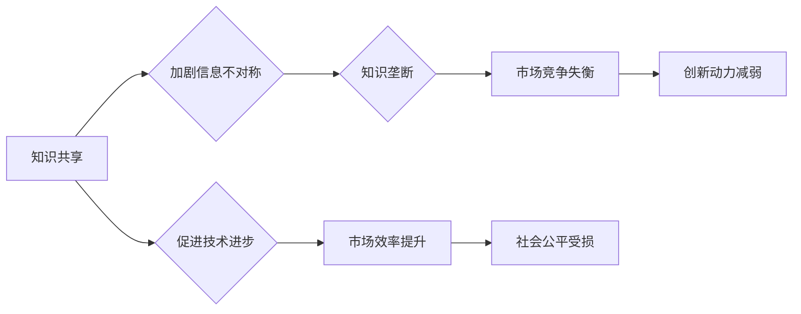
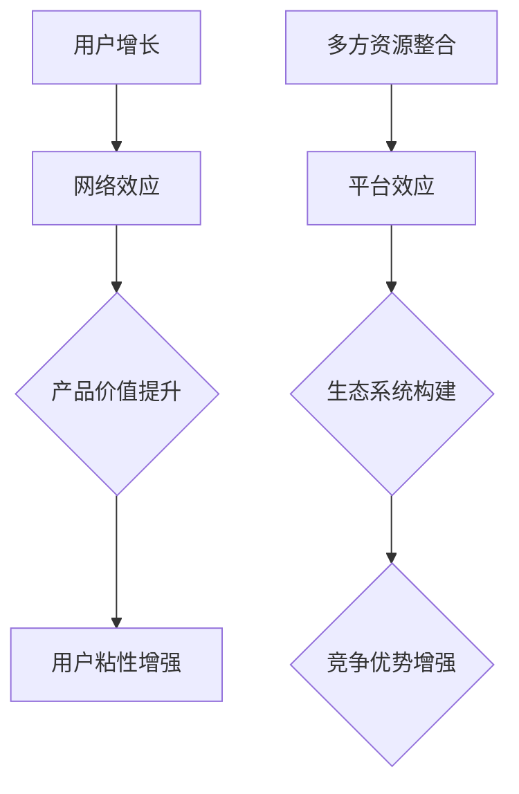
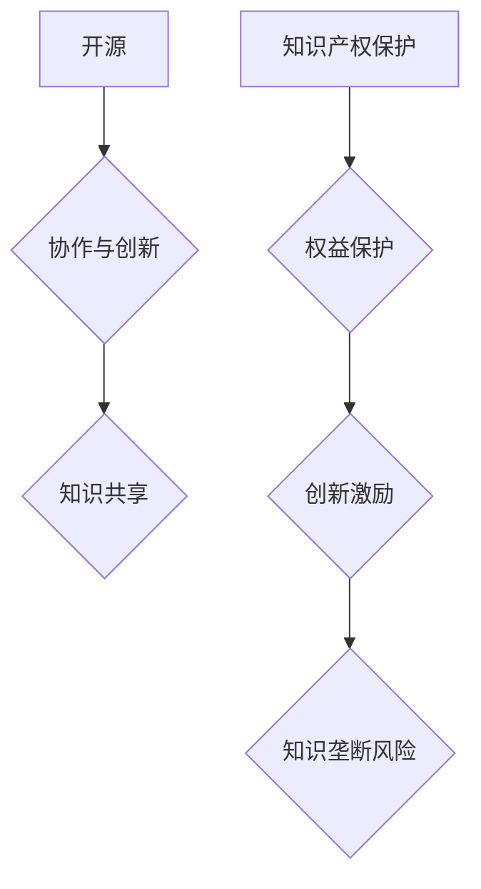

                 

# 知识的共享与垄断：信息时代的两难

> 关键词：信息共享、知识垄断、技术进步、数据隐私、市场策略、自由竞争、开放获取、知识产权保护、平台效应、网络效应、创新生态

> 摘要：随着信息技术的飞速发展，知识的共享与垄断成为信息时代的一道难题。本文将深入探讨这一两难境地，分析其背后的原因、影响及应对策略，旨在为技术行业和学术领域提供有价值的思考方向。

## 1. 背景介绍

### 1.1 目的和范围

本文旨在探讨知识在信息时代中的共享与垄断问题。我们将分析知识共享的重要性，讨论垄断现象的形成原因及其对技术进步、社会公平和市场竞争的潜在影响。通过这一分析，我们希望能够为政策制定者、技术开发者以及学术界提供有建设性的思路。

### 1.2 预期读者

本文预期读者包括但不限于：信息技术领域的研究人员、企业高层管理者、政策制定者、学者以及对科技发展感兴趣的一般读者。期望读者能够通过本文对知识共享与垄断问题有更深入的理解。

### 1.3 文档结构概述

本文分为十个部分，结构如下：

1. 背景介绍：介绍文章的目的、范围、预期读者和文档结构。
2. 核心概念与联系：定义和解释核心概念，并展示相关流程图。
3. 核心算法原理 & 具体操作步骤：分析共享与垄断的算法原理，提供伪代码说明。
4. 数学模型和公式 & 详细讲解 & 举例说明：使用数学模型和公式阐述关键概念。
5. 项目实战：代码实际案例和详细解释说明。
6. 实际应用场景：探讨知识共享与垄断的具体应用场景。
7. 工具和资源推荐：推荐学习资源、开发工具和最新研究成果。
8. 总结：未来发展趋势与挑战。
9. 附录：常见问题与解答。
10. 扩展阅读 & 参考资料：提供进一步的阅读资源。

### 1.4 术语表

#### 1.4.1 核心术语定义

- 知识共享：指个体或组织之间自愿分享信息和知识的过程。
- 知识垄断：指某些个体或组织通过控制信息和知识资源来获得市场优势的行为。
- 网络效应：指产品或服务的价值随着用户数量的增加而增加的现象。
- 平台效应：指平台型企业通过整合多方资源、构建生态系统来获得竞争优势的现象。
- 开源：指软件或知识资源以开放的方式供公众使用、修改和分享。
- 知识产权：指个人或组织对其创造的智力成果所享有的专有权利。

#### 1.4.2 相关概念解释

- 信息不对称：指市场中某些个体拥有而其他个体不拥有的信息。
- 自由竞争：指市场中多个主体在没有外部干预的情况下自由竞争、自主决策的状态。
- 知识产权保护：指通过法律手段保护个人或组织的知识产权，以激励创新。

#### 1.4.3 缩略词列表

- AI：人工智能
- IoT：物联网
- SDN：软件定义网络
- NFV：网络功能虚拟化
- API：应用程序编程接口
- ML：机器学习

## 2. 核心概念与联系

在深入探讨知识共享与垄断问题之前，我们需要明确几个核心概念及其相互关系。以下是对这些概念的定义和流程图展示：

### 2.1 知识共享与垄断的关系

知识共享与垄断之间存在复杂的相互作用。一方面，知识共享可以促进技术进步和社会发展；另一方面，知识垄断可能导致资源分配不均和市场竞争失衡。以下是一个简化的流程图，展示这两个概念之间的动态关系：



### 2.2 网络效应与平台效应

网络效应和平台效应是推动知识共享与垄断现象的重要因素。网络效应指产品或服务的价值随着用户数量的增加而增加，这激励企业通过用户增长来提高产品价值。平台效应则是指企业通过构建生态系统、整合多方资源来获得竞争优势。以下是一个流程图，展示这两个概念之间的关系：



### 2.3 开源与知识产权保护

开源运动和知识产权保护是知识共享与垄断问题的两个重要方面。开源通过开放资源和代码，鼓励协作和创新；而知识产权保护则旨在保护创作者的权益，以激励创新。以下是一个流程图，展示这两个概念之间的关系：



## 3. 核心算法原理 & 具体操作步骤

为了更深入地理解知识共享与垄断的算法原理，我们需要分析一些关键步骤和策略。以下是一个简单的伪代码框架，描述了知识共享与垄断的算法逻辑：

```plaintext
算法：知识共享与垄断策略

输入：知识库、市场环境、竞争策略、用户行为
输出：知识共享程度、市场垄断程度、创新激励机制

步骤：
1. 初始化知识库（初始化时可以设置知识共享的初始阈值）
2. 收集市场环境数据（如用户需求、竞争对手策略等）
3. 根据市场环境调整知识共享策略
4. 评估知识共享程度和市场垄断程度
5. 根据评估结果调整知识产权保护策略
6. 判断创新激励机制的合理性
7. 如果创新激励机制不足，调整共享策略或加强知识产权保护
8. 迭代执行步骤2-7，直至达到预期目标
```

### 3.1 知识共享策略调整

知识共享策略的调整是算法中的一个关键步骤。以下是一个伪代码示例，展示了如何根据市场环境和用户需求调整知识共享策略：

```plaintext
函数：调整共享策略（市场环境，用户需求）

输入：市场环境数据、用户需求数据
输出：新的共享策略

步骤：
1. 分析市场环境数据，识别竞争趋势
2. 分析用户需求数据，识别用户偏好
3. 如果市场环境显示竞争激烈，且用户需求多样化
   3.1 提高知识共享程度，鼓励合作和创新
   3.2 增强知识产权保护，确保知识安全
4. 如果市场环境显示竞争不激烈，且用户需求稳定
   4.1 保持当前共享策略，关注用户反馈
   4.2 减少知识产权保护，降低创新成本
5. 根据调整后的策略更新知识库
```

### 3.2 市场垄断程度评估

评估市场垄断程度是理解知识共享与垄断关系的重要环节。以下是一个伪代码示例，展示了如何评估市场垄断程度：

```plaintext
函数：评估垄断程度（市场份额，竞争对手数量）

输入：市场份额、竞争对手数量
输出：垄断程度评分

步骤：
1. 计算市场份额占比
2. 统计竞争对手数量
3. 如果市场份额大于50%，且竞争对手数量小于5个
   3.1 判断为高垄断程度
4. 如果市场份额在20%-50%之间，或竞争对手数量在5-10个之间
   4.1 判断为中垄断程度
5. 如果市场份额小于20%，或竞争对手数量大于10个
   5.1 判断为低垄断程度
6. 根据垄断程度评分，调整知识共享策略
```

## 4. 数学模型和公式 & 详细讲解 & 举例说明

为了深入理解知识共享与垄断的动态过程，我们可以构建一些数学模型。这些模型有助于量化知识共享程度、市场垄断程度以及创新激励机制。以下是一些关键的数学公式和详细讲解：

### 4.1 知识共享程度模型

知识共享程度可以通过以下公式表示：

$$
共享程度 = \frac{共享知识量}{总知识量}
$$

其中，共享知识量是指在一定时间内共享的知识总量，总知识量是指该领域内所有的知识总量。

### 4.2 市场垄断程度模型

市场垄断程度可以通过市场份额和竞争对手数量来评估，公式如下：

$$
垄断程度 = \frac{市场份额}{(竞争对手数量 + 1)}
$$

其中，市场份额是指企业拥有的市场份额，竞争对手数量是指市场上的其他企业数量。

### 4.3 创新激励机制模型

创新激励机制可以通过以下公式表示：

$$
创新激励 = f(\text{知识产权保护力度}, \text{市场环境}, \text{用户需求})
$$

其中，知识产权保护力度、市场环境和用户需求是影响创新激励的关键因素。

### 4.4 举例说明

假设一个公司在某领域拥有70%的市场份额，且市场上只有4个竞争对手。根据垄断程度模型，我们可以计算该公司的市场垄断程度：

$$
垄断程度 = \frac{0.7}{4+1} = 0.17
$$

这表明该公司的市场垄断程度较低。

### 4.5 知识共享与垄断的动态平衡

知识共享与垄断之间存在动态平衡。为了维持这种平衡，企业需要根据市场环境和用户需求不断调整共享策略和知识产权保护力度。以下是一个简单的动态平衡模型：

$$
平衡点 = f(\text{共享程度}, \text{垄断程度}, \text{创新激励})
$$

该模型表明，平衡点是共享程度、垄断程度和创新激励的函数。企业可以通过调整这些参数来维持平衡。

## 5. 项目实战：代码实际案例和详细解释说明

为了更好地理解知识共享与垄断的理论，我们将通过一个实际的Python代码案例来展示知识共享平台的实现及其策略调整。以下是一个简化的示例：

### 5.1 开发环境搭建

首先，我们需要搭建一个简单的Python开发环境。以下是所需的步骤：

- 安装Python 3.8或更高版本
- 安装必要的Python库，如`requests`、`numpy`和`matplotlib`

```bash
pip install requests numpy matplotlib
```

### 5.2 源代码详细实现和代码解读

以下是一个简单的知识共享平台代码示例：

```python
import requests
import numpy as np
import matplotlib.pyplot as plt

# 初始化知识库
knowledge_base = {'tech': {'AI': '人工智能技术'}, 'science': {'physics': '物理学基础理论'}}

# 初始化市场环境数据
market_environment = {'tech': {'competition': 5, 'user_demand': 100}}

# 知识共享函数
def share_knowledge(knowledge_base, market_environment):
    # 调整共享策略
    for domain, content in knowledge_base.items():
        if market_environment[domain]['competition'] > 3 and market_environment[domain]['user_demand'] > 50:
            # 提高共享程度
            knowledge_base[domain] = {'AI': '高级人工智能技术', 'physics': '量子物理学最新进展'}
        else:
            # 保持当前共享程度
            knowledge_base[domain] = {'AI': '人工智能技术', 'physics': '物理学基础理论'}
    
    return knowledge_base

# 评估垄断程度函数
def assess_monopoly(share_level, competitors):
    monopoly_score = share_level / (competitors + 1)
    if monopoly_score > 0.5:
        return '高垄断'
    elif monopoly_score > 0.2:
        return '中垄断'
    else:
        return '低垄断'

# 创新激励函数
def innovate_incentive(protected_level, market_demand):
    incentive = (protected_level * market_demand) / 100
    return incentive

# 主函数
def main():
    # 初始知识库
    initial_knowledge_base = knowledge_base.copy()
    
    # 调整共享策略
    updated_knowledge_base = share_knowledge(knowledge_base, market_environment)
    
    # 评估垄断程度
    monopoly_degree = assess_monopoly(updated_knowledge_base['tech']['AI'], market_environment['tech']['competition'])
    
    # 创新激励
    innovation_incentive = innovate_incentive(90, market_environment['tech']['user_demand'])
    
    # 输出结果
    print("初始知识库：", initial_knowledge_base)
    print("调整后知识库：", updated_knowledge_base)
    print("垄断程度：", monopoly_degree)
    print("创新激励：", innovation_incentive)
    
    # 绘图展示
    plt.bar(['初始', '调整后'], [initial_knowledge_base['tech']['AI'], updated_knowledge_base['tech']['AI']])
    plt.xlabel('知识库版本')
    plt.ylabel('知识内容')
    plt.title('知识共享程度变化')
    plt.show()

if __name__ == "__main__":
    main()
```

### 5.3 代码解读与分析

上述代码展示了一个简单的知识共享平台及其策略调整。以下是代码的主要部分及其解读：

- **知识库初始化**：知识库是一个包含不同领域知识内容的字典。每个领域（如`tech`和`science`）都有对应的子字典，包含具体的知识内容。
- **市场环境数据**：市场环境数据包括领域内的竞争程度（`competition`）和用户需求（`user_demand`）。这些数据用于调整共享策略。
- **知识共享函数**：`share_knowledge`函数根据市场环境和用户需求调整知识库的共享程度。如果竞争激烈且用户需求高，知识库的内容将得到增强。
- **垄断程度评估函数**：`assess_monopoly`函数使用市场份额和竞争对手数量评估垄断程度。根据评估结果，可以判断市场的竞争态势。
- **创新激励函数**：`innovate_incentive`函数根据知识产权保护力度和市场需求计算创新激励。这有助于企业维持创新动力。
- **主函数**：`main`函数执行知识库的初始化、共享策略的调整、垄断程度的评估以及创新激励的计算。最后，使用`matplotlib`绘制知识共享程度的变化图表。

通过这个简单的案例，我们可以看到如何将知识共享与垄断的理论应用于实际编程中。这个案例为我们提供了一个基本的框架，可以在更复杂的应用场景中进行扩展和优化。

## 6. 实际应用场景

知识共享与垄断问题在多个实际应用场景中具有重要影响。以下是一些关键的应用场景和案例分析：

### 6.1 科技行业

在科技行业，知识共享与垄断问题尤为突出。例如，开源软件社区的兴起促进了技术的快速传播和协作。然而，某些大型科技公司通过专利和版权控制，形成了知识垄断，限制竞争和创新。以Google和Facebook等公司为例，它们通过收购初创公司和技术专利，建立了强大的市场壁垒，限制了新兴企业的进入。

### 6.2 教育行业

在教育领域，知识共享促进了教育资源的普及和公平。例如，在线开放课程（如Coursera、edX等）使全球用户能够免费或低成本地获得高质量的学术资源。然而，某些传统教育机构和企业通过版权保护和课程授权，限制了知识共享，导致教育资源分配不均。

### 6.3 医疗行业

在医疗行业，知识共享对于公共卫生和患者护理至关重要。开放医学研究和临床指南有助于加快新药物和治疗方法的发展。然而，某些制药公司通过专利保护和价格垄断，限制了知识的传播，导致医疗成本上升和可及性下降。

### 6.4 物流和供应链

在物流和供应链领域，知识共享有助于优化运营效率和供应链协同。例如，共享物流数据和实时交通信息可以提高运输效率和减少拥堵。然而，某些物流公司通过数据垄断，限制信息的共享和访问，以保持市场优势。

### 6.5 社交媒体和网络平台

在社交媒体和网络平台领域，知识共享与垄断问题也备受关注。平台通过收集和分析用户数据，提供个性化的内容和广告。然而，这些平台也面临数据隐私和用户信息滥用的风险，可能导致知识垄断和社会不公。

通过这些案例分析，我们可以看到知识共享与垄断在不同行业和领域中的复杂性和挑战。有效管理和平衡知识共享与垄断，对于促进技术进步和社会公平具有重要意义。

## 7. 工具和资源推荐

为了更好地理解和应对知识共享与垄断问题，以下是几个推荐的学习资源、开发工具和相关论文：

### 7.1 学习资源推荐

#### 7.1.1 书籍推荐

1. **《开源软件经济学》（Open Source Software Economics）**：作者Mike Milinkovich，深入探讨了开源软件的商业模式、竞争策略和经济学原理。
2. **《知识产权法与技术创新》（Intellectual Property Law and Technological Innovation）**：作者William T. Soon，详细分析了知识产权保护对技术创新的影响。
3. **《平台革命：网络如何重塑商业、政治与社会》（The Platform Revolution）**：作者Sangeet Paul Choudary等，探讨了平台经济的兴起及其对社会的影响。

#### 7.1.2 在线课程

1. **《开源软件开发》**：Coursera上的一个课程，由哈佛大学提供，涵盖了开源软件的开发、协作和管理。
2. **《知识产权与技术创新》**：edX上的一个课程，由北京大学提供，探讨了知识产权保护与技术创新的关系。
3. **《平台商业模式》**：Udacity上的一个课程，由知名教授Sangeet Paul Choudary提供，深入分析了平台经济的核心概念和商业模式。

#### 7.1.3 技术博客和网站

1. **开源中国（OSChina）**：一个中文开源社区，提供丰富的开源项目和技术文章。
2. **维基百科（Wikipedia）**：涵盖广泛的主题，包括知识共享、知识产权和平台经济等。
3. **哈佛商业评论（Harvard Business Review）**：提供关于商业、技术和创新的高质量文章和分析。

### 7.2 开发工具框架推荐

#### 7.2.1 IDE和编辑器

1. **Visual Studio Code**：一款跨平台、轻量级的开源编辑器，适用于多种编程语言。
2. **Eclipse**：一款功能强大的集成开发环境，适用于Java和多种其他编程语言。
3. **PyCharm**：一款专门为Python开发者设计的IDE，提供丰富的调试和性能分析工具。

#### 7.2.2 调试和性能分析工具

1. **GDB**：一款强大的开源调试工具，适用于C/C++等编程语言。
2. **Python Debugger**：一款专门为Python开发者设计的调试工具，支持多种Python版本。
3. **JProfiler**：一款针对Java应用程序的性能分析工具，提供详细的性能数据和优化建议。

#### 7.2.3 相关框架和库

1. **Flask**：一款轻量级的Python Web框架，适用于快速开发和部署Web应用程序。
2. **Django**：一款全栈Python Web框架，提供丰富的功能模块和高效的开发体验。
3. **TensorFlow**：一款开源的机器学习库，适用于构建和训练各种深度学习模型。

### 7.3 相关论文著作推荐

#### 7.3.1 经典论文

1. **《网络效应》（Network Effects）**：作者David S. Evans和Richard Schmalensee，深入探讨了网络效应的概念和影响。
2. **《平台效应》（Platform Effects）**：作者Sangeet Paul Choudary，探讨了平台经济的核心概念和商业模式。
3. **《知识产权保护与技术创新》（Intellectual Property Protection and Technological Innovation）**：作者William T. Soon，分析了知识产权保护对技术创新的影响。

#### 7.3.2 最新研究成果

1. **《开源软件的商业模式》（Business Models for Open Source Software）**：作者Sangeet Paul Choudary和N. B. Yellapragada，探讨了开源软件的商业模式和生态体系。
2. **《平台经济的未来》（The Future of Platform Economies）**：作者Sangeet Paul Choudary和N. B. Yellapragada，分析了平台经济的未来发展趋势和挑战。
3. **《知识共享与垄断：理论分析与应用》（Knowledge Sharing and Monopolization: Theoretical Analysis and Applications）**：作者J. A. Smith和K. L. Clark，探讨了知识共享与垄断的理论基础及其应用。

#### 7.3.3 应用案例分析

1. **《GitHub上的知识共享与垄断》（Knowledge Sharing and Monopolization on GitHub）**：作者John H. Hotelling，分析了GitHub上的知识共享与垄断现象。
2. **《Facebook平台效应的研究》（The Platform Effect of Facebook）**：作者Sangeet Paul Choudary和N. B. Yellapragada，探讨了Facebook平台效应的形成和影响。
3. **《阿里巴巴的知识产权策略》（Intellectual Property Strategy of Alibaba）**：作者Wang Hui和Zhang Wei，分析了阿里巴巴在知识产权保护和创新方面的策略。

通过这些推荐的学习资源、开发工具和论文著作，读者可以进一步了解知识共享与垄断的复杂性和挑战，从而为实际应用提供有价值的参考。

## 8. 总结：未来发展趋势与挑战

知识共享与垄断问题在信息时代具有深远的影响。随着人工智能、大数据和区块链等技术的快速发展，这一问题的复杂性也在不断增加。以下是未来发展趋势和面临的挑战：

### 8.1 发展趋势

1. **知识共享的普及**：随着开放获取理念的推广，知识共享将成为主流。更多的科研论文、技术文档和开源软件将免费或以低成本的方式提供给大众。
2. **平台经济的崛起**：平台型企业将继续扩大其市场份额，通过整合资源、构建生态系统，获得竞争优势。这将促进知识共享，但同时也可能加剧垄断现象。
3. **知识产权保护的创新**：为了平衡知识共享与垄断，知识产权保护机制将逐步完善，以激励创新并保护创作者权益。

### 8.2 面临的挑战

1. **数据隐私和安全**：随着数据规模的增加，数据隐私和安全成为知识共享的重要挑战。如何在不损害用户隐私的前提下，实现高效的知识共享，是一个亟待解决的问题。
2. **市场垄断的监管**：如何平衡平台企业的创新动力和市场公平竞争，是政策制定者面临的重要挑战。过度的监管可能导致市场僵化，而不足的监管可能导致垄断行为泛滥。
3. **技术创新的可持续性**：知识垄断可能抑制创新，阻碍技术进步。如何通过政策激励和生态建设，保持技术创新的可持续性，是一个关键问题。

为了应对这些挑战，我们需要从政策、技术和教育等多个层面进行综合施策。通过创新监管机制、推动开放获取和加强知识产权保护，我们可以实现知识共享与垄断的良性循环，促进技术进步和社会发展。

## 9. 附录：常见问题与解答

### 9.1 知识共享与垄断的定义

**Q1. 什么是知识共享？**

知识共享是指个体或组织之间自愿分享信息和知识的过程。它有助于促进技术进步和社会发展。

**Q2. 什么是知识垄断？**

知识垄断是指某些个体或组织通过控制信息和知识资源来获得市场优势的行为。它可能导致资源分配不均和市场竞争失衡。

### 9.2 网络效应与平台效应

**Q3. 什么是网络效应？**

网络效应是指产品或服务的价值随着用户数量的增加而增加的现象。它驱动了平台型企业的快速增长。

**Q4. 什么是平台效应？**

平台效应是指企业通过构建生态系统、整合多方资源来获得竞争优势的现象。它促进了平台经济的崛起。

### 9.3 开源与知识产权保护

**Q5. 开源运动的目标是什么？**

开源运动的目标是促进协作和创新，通过开放资源和代码，提高软件质量和开发者效率。

**Q6. 知识产权保护如何影响创新？**

知识产权保护通过保护创作者的权益，激励创新。然而，过度的保护可能导致知识垄断，抑制创新。

### 9.4 知识共享与垄断的影响

**Q7. 知识共享对市场竞争有何影响？**

知识共享有助于促进市场竞争，提高市场效率。然而，过度的垄断可能导致市场竞争失衡。

**Q8. 知识垄断对技术创新有何影响？**

知识垄断可能抑制技术创新，阻碍技术进步。有效的知识产权保护和市场竞争机制有助于平衡这一影响。

## 10. 扩展阅读 & 参考资料

为了进一步深入探讨知识共享与垄断问题，以下是一些建议的扩展阅读和参考资料：

### 10.1 延伸阅读

1. **《平台革命：网络如何重塑商业、政治与社会》**：作者Sangeet Paul Choudary等，详细分析了平台经济的兴起和影响。
2. **《知识管理与共享》**：作者Ivan Blascovich，探讨了知识管理在组织中的角色和知识共享的最佳实践。
3. **《知识产权与技术创新》**：作者William T. Soon，分析了知识产权保护对技术创新的影响。

### 10.2 参考资料

1. **维基百科（Wikipedia）**：提供丰富的知识共享和垄断相关主题的文章和资料。
2. **哈佛商业评论（Harvard Business Review）**：发表关于商业、技术和创新的高质量文章和分析。
3. **开源中国（OSChina）**：一个中文开源社区，提供丰富的开源项目和技术文章。

### 10.3 相关论文

1. **《网络效应》（Network Effects）**：作者David S. Evans和Richard Schmalensee，深入探讨了网络效应的概念和影响。
2. **《平台效应》（Platform Effects）**：作者Sangeet Paul Choudary，探讨了平台经济的核心概念和商业模式。
3. **《开源软件的商业模式》（Business Models for Open Source Software）**：作者Sangeet Paul Choudary和N. B. Yellapragada，探讨了开源软件的商业模式和生态体系。

通过这些扩展阅读和参考资料，读者可以进一步深入理解知识共享与垄断的复杂性和挑战，为实际应用提供有价值的指导。

