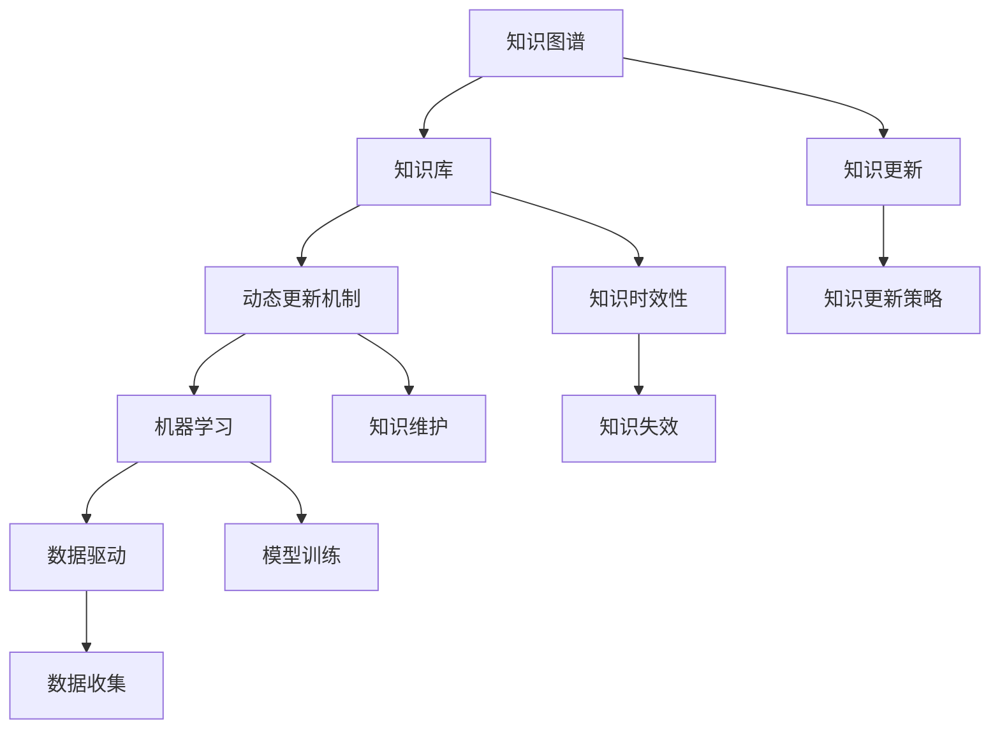

                 

# 知识的时效性：动态更新机制与终身学习

## 关键词

- 知识时效性
- 动态更新机制
- 终身学习
- 人工智能
- 数据驱动
- 知识图谱
- 机器学习
- 知识库

## 摘要

本文深入探讨了知识时效性的问题，并提出了动态更新机制和终身学习的重要性。知识随着时间的推移可能会变得过时，因此，维持知识的时效性成为了现代信息社会的一个重要议题。本文首先介绍了知识时效性的背景和挑战，接着详细阐述了动态更新机制的理论基础和实现方法。随后，本文强调了终身学习在应对知识时效性挑战中的核心作用，并通过实际案例展示了如何通过持续学习和知识更新来提升个人的专业技能和创新能力。最后，本文总结了未来发展趋势与挑战，并提供了相关工具和资源的推荐，以帮助读者更好地应对知识时效性带来的挑战。

## 1. 背景介绍

### 1.1 目的和范围

本文旨在探讨知识时效性的问题，并提出动态更新机制和终身学习在应对这一挑战中的作用。知识时效性是现代信息社会中的一个关键问题，因为知识更新的速度远快于人类的学习能力。为了维持知识的时效性，本文将讨论动态更新机制和终身学习的方法和策略。本文的范围包括以下几个方面：

1. **知识时效性的背景和挑战**：分析知识时效性的概念，探讨其在现代社会中的重要性，并指出当前知识时效性面临的主要挑战。
2. **动态更新机制**：介绍动态更新机制的理论基础，包括知识图谱、机器学习和数据驱动的方法，并详细讨论其实现步骤和应用场景。
3. **终身学习**：探讨终身学习的概念和重要性，提出终身学习的策略和实践方法，并分析其在应对知识时效性挑战中的核心作用。
4. **实际应用案例**：通过实际案例展示动态更新机制和终身学习在应对知识时效性挑战中的效果，提供具体的操作步骤和实施指南。
5. **未来发展趋势与挑战**：总结当前的研究进展，展望未来知识时效性领域的发展趋势和面临的挑战，并提出相应的解决方案。

### 1.2 预期读者

本文适合以下读者群体：

1. **IT行业从业者**：从事软件开发、数据科学、人工智能等领域的工作者，希望了解如何应对知识时效性挑战，提升自身技能和创新能力。
2. **学术研究人员**：从事知识时效性、动态更新机制和终身学习等领域的研究人员，希望了解最新的理论和方法。
3. **企业高管和培训师**：企业高管和培训师，希望了解如何通过动态更新机制和终身学习策略提升员工的技能水平和企业的竞争力。

### 1.3 文档结构概述

本文分为十个部分：

1. **引言**：介绍知识时效性的问题和本文的目的。
2. **背景介绍**：讨论知识时效性的背景、目的和范围。
3. **核心概念与联系**：介绍核心概念和原理，并给出Mermaid流程图。
4. **核心算法原理与具体操作步骤**：详细阐述核心算法原理和操作步骤。
5. **数学模型和公式**：介绍数学模型和公式，并给出详细讲解和举例。
6. **项目实战**：通过实际案例展示动态更新机制和终身学习的应用。
7. **实际应用场景**：分析动态更新机制和终身学习在现实中的应用场景。
8. **工具和资源推荐**：推荐学习资源和开发工具。
9. **总结**：总结未来发展趋势与挑战。
10. **附录**：常见问题与解答。
11. **扩展阅读与参考资料**：提供相关参考文献。

### 1.4 术语表

#### 1.4.1 核心术语定义

- 知识时效性：知识随着时间的推移而逐渐失去其价值和准确性的现象。
- 动态更新机制：用于实时更新和维护知识库的方法和策略。
- 终身学习：个人在整个生命过程中持续学习和更新知识的过程。
- 知识图谱：用于表示知识结构和关系的图形模型。
- 机器学习：一种利用数据构建模型并自动发现知识的技术。
- 数据驱动：基于数据的决策和行动，通过数据分析来指导实践。

#### 1.4.2 相关概念解释

- **知识库**：存储和组织知识的系统，用于支持决策和问题解决。
- **知识更新**：对知识库中的知识进行修改和补充，以维持其时效性和准确性。
- **知识图谱**：用于表示知识结构和关系的图形模型，通过节点和边来表示概念和关系。

#### 1.4.3 缩略词列表

- **AI**：人工智能（Artificial Intelligence）
- **ML**：机器学习（Machine Learning）
- **DL**：深度学习（Deep Learning）
- **NLP**：自然语言处理（Natural Language Processing）
- **KG**：知识图谱（Knowledge Graph）
- **SEO**：搜索引擎优化（Search Engine Optimization）
- **SaaS**：软件即服务（Software as a Service）
- **IaaS**：基础设施即服务（Infrastructure as a Service）
- **PaaS**：平台即服务（Platform as a Service）

## 2. 核心概念与联系

在探讨知识的时效性时，我们需要理解一系列核心概念和它们之间的联系。这些概念包括知识图谱、机器学习、数据驱动和知识库。以下是一个简单的Mermaid流程图，展示了这些核心概念和它们之间的关系。

### 2.1 知识图谱

知识图谱是一种用于表示知识结构和关系的图形模型。它通过节点和边来表示实体和它们之间的关系。知识图谱在许多领域都有广泛的应用，如搜索引擎优化（SEO）、推荐系统和自然语言处理（NLP）等。

#### 2.1.1 知识图谱的基本概念

- **实体**：知识图谱中的基本元素，表示具体的对象，如人、地点、物品等。
- **关系**：实体之间的关联，如“属于”、“位于”等。
- **属性**：实体的特征，如“年龄”、“出生地”等。

#### 2.1.2 知识图谱的应用

知识图谱在许多领域都有应用，如：

- **搜索引擎优化（SEO）**：通过构建和优化知识图谱来提高网站在搜索引擎中的排名。
- **推荐系统**：利用知识图谱来推荐相关的内容或产品。
- **自然语言处理（NLP）**：用于文本分析和语义理解。

### 2.2 机器学习

机器学习是一种利用数据构建模型并自动发现知识的技术。它通过从数据中学习规律，从而能够对未知数据进行预测或分类。

#### 2.2.1 机器学习的基本概念

- **模型**：通过学习数据得到的规律表示。
- **训练数据**：用于训练模型的数据集。
- **测试数据**：用于测试模型性能的数据集。

#### 2.2.2 机器学习的应用

机器学习在许多领域都有应用，如：

- **图像识别**：通过训练模型来自动识别图像中的对象。
- **语音识别**：通过训练模型来将语音信号转换为文本。
- **预测分析**：通过训练模型来预测未来的趋势和事件。

### 2.3 数据驱动

数据驱动是指基于数据的决策和行动，通过数据分析来指导实践。在知识时效性管理中，数据驱动非常重要，因为它可以帮助我们识别和解决知识过时的问题。

#### 2.3.1 数据驱动的基本概念

- **数据收集**：收集相关的数据。
- **数据分析**：对收集到的数据进行处理和分析。
- **数据可视化**：通过图形化的方式展示数据分析结果。

#### 2.3.2 数据驱动的应用

数据驱动在许多领域都有应用，如：

- **商业智能**：通过数据分析来指导企业的决策。
- **金融分析**：通过数据分析来预测市场的走势。
- **医疗诊断**：通过数据分析来辅助医生的诊断。

### 2.4 知识库

知识库是一种用于存储和组织知识的系统，它通常包含大量的数据、信息和知识。知识库在知识管理中起着核心作用，它可以帮助组织有效地管理和利用知识。

#### 2.4.1 知识库的基本概念

- **知识库**：存储和组织知识的系统。
- **知识管理**：对知识库中的知识进行收集、存储、更新和利用的过程。

#### 2.4.2 知识库的应用

知识库在许多领域都有应用，如：

- **企业知识管理**：用于存储和共享企业内部的知

