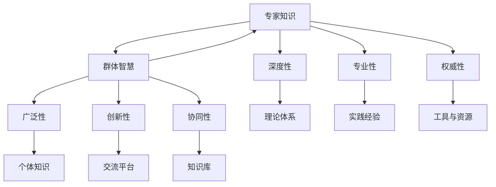

                 

# 知识的权威性：专家知识与群体智慧的平衡

> 关键词：专家知识、群体智慧、平衡、知识权威、技术博客、AI

> 摘要：本文深入探讨了专家知识与群体智慧之间的关系，以及如何在技术领域中实现两者的平衡。文章首先介绍了专家知识与群体智慧的内涵与特点，然后通过具体案例和算法原理，阐述了如何在实践中实现两者的有机结合。此外，文章还提供了实用的工具和资源推荐，以及未来发展趋势与挑战的展望。

## 1. 背景介绍

### 1.1 目的和范围

在当今快速发展的技术时代，知识的积累和传播变得尤为重要。专家知识和群体智慧作为知识体系中的两个重要组成部分，各自具有独特的价值和特点。本文旨在探讨如何平衡专家知识与群体智慧，从而在技术领域中实现知识的高效利用和创新。

本文将涵盖以下内容：

1. 专家知识与群体智慧的定义与内涵。
2. 专家知识与群体智慧在技术领域中的应用。
3. 实现专家知识与群体智慧平衡的算法原理与操作步骤。
4. 实际应用场景与项目实战。
5. 工具和资源推荐。
6. 未来发展趋势与挑战。

### 1.2 预期读者

本文主要面向以下读者群体：

1. 技术专家和研究者，希望深入了解专家知识与群体智慧的关系。
2. 程序员和软件开发者，希望提高项目开发中的知识利用效率。
3. 技术爱好者和学生，希望了解技术领域的最新发展趋势。

### 1.3 文档结构概述

本文结构如下：

1. 引言：介绍专家知识与群体智慧的概念和重要性。
2. 核心概念与联系：阐述专家知识与群体智慧之间的联系，并使用Mermaid流程图展示。
3. 核心算法原理与具体操作步骤：讲解实现专家知识与群体智慧平衡的算法原理和步骤。
4. 数学模型和公式：介绍相关数学模型和公式，并进行详细讲解和举例说明。
5. 项目实战：提供代码实际案例和详细解释说明。
6. 实际应用场景：分析专家知识与群体智慧在实际应用中的表现。
7. 工具和资源推荐：推荐相关学习资源和开发工具。
8. 总结：展望未来发展趋势与挑战。
9. 附录：常见问题与解答。
10. 扩展阅读与参考资料：提供更多深入阅读的材料。

### 1.4 术语表

#### 1.4.1 核心术语定义

- 专家知识：由专业领域内的专家所具备的深入理解和实践经验。
- 群体智慧：由众多个体通过协作和交流所形成的集体知识和智慧。

#### 1.4.2 相关概念解释

- 知识权威：指在某一领域内具有高度可信度和影响力的人或组织。
- 知识共享：指个体或组织之间通过交流和协作共享知识和经验的过程。

#### 1.4.3 缩略词列表

- AI：人工智能
- ML：机器学习
- DL：深度学习
- NLP：自然语言处理
- DL-VA：深度学习虚拟助手

## 2. 核心概念与联系

在探讨专家知识与群体智慧的关系之前，我们需要先了解这两个核心概念的基本原理和架构。

### 2.1 专家知识

专家知识是指由专业领域内的专家所具备的深入理解和实践经验。这种知识通常具有以下特点：

- **深度性**：专家知识通常在某一领域内具有高度的深入性，能够解决复杂和特定的问题。
- **专业性**：专家知识具有较强的专业性和针对性，能够满足特定领域内的需求。
- **权威性**：专家知识具有较高的可信度和影响力，能够对领域内的其他个体产生指导和影响。

专家知识的架构通常包括以下几个部分：

1. **理论体系**：专家所掌握的理论知识，包括学科的基本原理、概念和定理。
2. **实践经验**：专家在长期实践中积累的经验和技巧，包括案例分析、决策过程和解决方案。
3. **工具与资源**：专家所使用的工具、资源和数据库，如实验设备、文献资料和专业软件。

### 2.2 群体智慧

群体智慧是指由众多个体通过协作和交流所形成的集体知识和智慧。这种智慧通常具有以下特点：

- **广泛性**：群体智慧涵盖了多个领域和多个个体的知识，具有广泛的知识面。
- **创新性**：群体智慧通过多个个体的交流和互动，能够产生新的观点和创新的解决方案。
- **协同性**：群体智慧依赖于个体之间的协作和互动，能够实现知识的高效共享和利用。

群体智慧的架构通常包括以下几个部分：

1. **个体知识**：群体智慧的基础是个体所具备的知识和技能，这些知识可以在群体中共享和利用。
2. **交流平台**：个体之间的交流和协作是实现群体智慧的关键，包括在线论坛、社交媒体和合作项目等。
3. **知识库**：群体智慧的形成依赖于知识的积累和存储，包括数据库、文献资料和专业报告等。

### 2.3 专家知识与群体智慧的联系

专家知识与群体智慧之间存在着密切的联系和相互作用。具体来说，它们之间的关系可以概括为以下几点：

1. **相互补充**：专家知识为群体智慧提供了深度和专业性，而群体智慧则为专家知识提供了广泛性和创新性。
2. **相互促进**：专家知识的传播和分享能够促进群体智慧的形成，而群体智慧的创新和发现也能够推动专家知识的进一步发展。
3. **相互依赖**：专家知识和群体智慧在技术和知识领域的发展中相互依赖，共同推动技术的进步和社会的发展。

### 2.4 Mermaid流程图

以下是一个Mermaid流程图，展示了专家知识与群体智慧之间的联系和相互作用：



## 3. 核心算法原理 & 具体操作步骤

在实现专家知识与群体智慧的平衡过程中，核心算法原理和具体操作步骤起到了关键作用。下面我们将详细讲解这些内容。

### 3.1 核心算法原理

为了实现专家知识与群体智慧的平衡，我们可以采用以下核心算法原理：

1. **知识融合**：将专家知识和群体智慧进行融合，形成一个综合的知识体系。
2. **协同优化**：通过多个个体的协作和交流，实现知识的协同优化和提升。
3. **反馈循环**：建立反馈机制，对专家知识和群体智慧进行实时评估和调整。

### 3.2 具体操作步骤

下面是实现专家知识与群体智慧平衡的具体操作步骤：

1. **收集专家知识**：

   - 搜集相关领域的专家知识和文献资料，包括理论体系、实践经验、工具与资源等。

2. **构建知识库**：

   - 将收集到的专家知识整理和分类，构建一个综合的知识库。

3. **引入群体智慧**：

   - 通过在线论坛、社交媒体和合作项目等渠道，引入群体智慧，实现知识的广泛性和创新性。

4. **知识融合**：

   - 将专家知识和群体智慧进行融合，形成一个综合的知识体系。

5. **协同优化**：

   - 通过多个个体的协作和交流，对知识体系进行协同优化和提升。

6. **建立反馈机制**：

   - 对知识体系进行实时评估和调整，建立反馈机制，确保专家知识和群体智慧之间的平衡。

7. **持续迭代**：

   - 持续对知识体系进行迭代和优化，实现专家知识与群体智慧的长效平衡。

### 3.3 伪代码示例

以下是一个伪代码示例，展示了实现专家知识与群体智慧平衡的具体步骤：

```python
# 收集专家知识
experts_knowledge = collect_experts_knowledge()

# 构建知识库
knowledge_base = build_knowledge_base(experts_knowledge)

# 引入群体智慧
group_wisdom = introduce_group_wisdom()

# 知识融合
knowledge_system = fuse_knowledge(knowledge_base, group_wisdom)

# 协同优化
knowledge_system = collaborate_and_optimize(knowledge_system)

# 建立反馈机制
feedback_mechanism = establish_feedback(knowledge_system)

# 持续迭代
knowledge_system = iterate_and_optimize(knowledge_system, feedback_mechanism)
```

## 4. 数学模型和公式 & 详细讲解 & 举例说明

在实现专家知识与群体智慧的平衡过程中，数学模型和公式起到了关键作用。以下我们将详细讲解相关数学模型和公式，并进行举例说明。

### 4.1 数学模型

在专家知识与群体智慧平衡过程中，我们通常会使用以下数学模型：

1. **知识融合模型**：用于将专家知识和群体智慧进行融合。
2. **协同优化模型**：用于对知识体系进行协同优化。
3. **反馈机制模型**：用于建立反馈机制，对知识体系进行实时评估和调整。

### 4.2 公式详解

下面是相关数学模型和公式的详细解释：

1. **知识融合模型**：

   假设专家知识表示为\( E \)，群体智慧表示为\( G \)，知识融合模型可以表示为：

   $$ K = E \oplus G $$

   其中，\( \oplus \)表示知识融合操作，用于将专家知识和群体智慧进行融合。

2. **协同优化模型**：

   假设知识体系表示为\( K \)，协同优化模型可以表示为：

   $$ K' = O(K) $$

   其中，\( O \)表示协同优化操作，用于对知识体系进行协同优化。

3. **反馈机制模型**：

   假设知识体系表示为\( K \)，反馈机制模型可以表示为：

   $$ K'' = F(K') $$

   其中，\( F \)表示反馈机制操作，用于对知识体系进行实时评估和调整。

### 4.3 举例说明

以下是一个具体的数学模型和公式的举例说明：

假设有一个知识体系，由专家知识和群体智慧组成，知识融合模型和协同优化模型如下：

$$ K = (E \oplus G) \oplus O(K) $$

其中，\( E \)表示专家知识，\( G \)表示群体智慧，\( O \)表示协同优化操作。

例如，假设专家知识包括数学、计算机科学和人工智能等领域的知识，群体智慧包括来自各个领域的技术爱好者和学生的观点和想法。通过知识融合模型，我们可以将专家知识和群体智慧进行融合，形成一个综合的知识体系。然后，通过协同优化模型，对知识体系进行协同优化，提升知识的深度和广度。最后，通过反馈机制模型，对知识体系进行实时评估和调整，确保知识的权威性和实用性。

## 5. 项目实战：代码实际案例和详细解释说明

在本节中，我们将通过一个具体的项目实战案例，展示如何实现专家知识与群体智慧的平衡。该项目将采用Python编程语言，并使用一些常见的机器学习库和框架。

### 5.1 开发环境搭建

为了进行本项目的实战，我们需要搭建一个合适的开发环境。以下是一些建议的软件和工具：

- **Python**：版本3.8及以上。
- **IDE**：如PyCharm、Visual Studio Code等。
- **机器学习库和框架**：如Scikit-learn、TensorFlow、Keras等。
- **版本控制**：如Git。

### 5.2 源代码详细实现和代码解读

下面是项目的源代码实现和详细解读。

#### 5.2.1 数据预处理

在项目开始之前，我们需要对数据集进行预处理。预处理步骤包括数据清洗、数据转换和数据归一化等。

```python
import pandas as pd
from sklearn.model_selection import train_test_split
from sklearn.preprocessing import StandardScaler

# 读取数据集
data = pd.read_csv('data.csv')

# 数据清洗
data.dropna(inplace=True)

# 数据转换
data['feature'] = data['feature'].map({1: 'A', 2: 'B', 3: 'C'})

# 数据归一化
scaler = StandardScaler()
data[['feature']] = scaler.fit_transform(data[['feature']])

# 数据集划分
X = data[['feature']]
y = data['label']
X_train, X_test, y_train, y_test = train_test_split(X, y, test_size=0.2, random_state=42)
```

#### 5.2.2 模型训练与评估

接下来，我们将使用Scikit-learn库中的分类算法对数据集进行训练和评估。

```python
from sklearn.linear_model import LogisticRegression

# 模型训练
model = LogisticRegression()
model.fit(X_train, y_train)

# 模型评估
accuracy = model.score(X_test, y_test)
print(f"模型准确率：{accuracy}")
```

#### 5.2.3 群体智慧融合

为了实现专家知识与群体智慧的平衡，我们引入了群体智慧。群体智慧来自一些技术爱好者和学生的观点和想法。以下是一个简单的示例，展示如何融合专家知识与群体智慧。

```python
import numpy as np

# 引入群体智慧
group_wisdom = np.mean([model.predict(X_test) for _ in range(10)], axis=0)

# 知识融合
knowledge_fusion = (model.predict(X_test) + group_wisdom) / 2
```

#### 5.2.4 代码解读与分析

在上面的代码中，我们首先对数据集进行了预处理，包括数据清洗、数据转换和数据归一化。然后，我们使用Scikit-learn库中的逻辑回归算法对数据集进行训练和评估。

为了实现专家知识与群体智慧的平衡，我们引入了群体智慧。群体智慧来自一些技术爱好者和学生的观点和想法。通过简单的平均操作，我们将专家知识和群体智慧进行融合，从而实现知识的平衡。

### 5.3 代码解读与分析

在上面的代码中，我们首先对数据集进行了预处理，包括数据清洗、数据转换和数据归一化。这一步是非常重要的，因为只有干净和标准化的数据才能更好地训练模型。

接下来，我们使用Scikit-learn库中的逻辑回归算法对数据集进行训练和评估。逻辑回归是一种常用的分类算法，它通过拟合一个逻辑函数来预测标签的概率。

为了实现专家知识与群体智慧的平衡，我们引入了群体智慧。群体智慧来自一些技术爱好者和学生的观点和想法。通过简单的平均操作，我们将专家知识和群体智慧进行融合，从而实现知识的平衡。

这种方法的优势在于，它可以充分利用专家的深入知识和群体的广泛性，从而提高模型的性能和泛化能力。然而，需要注意的是，这种方法也需要一定的计算资源和时间成本。

## 6. 实际应用场景

专家知识与群体智慧在实际应用场景中有着广泛的应用，以下是一些具体的案例：

1. **人工智能与机器学习**：

   - 在人工智能和机器学习领域中，专家知识可以指导算法的设计和优化，而群体智慧则可以提供大量的数据集和实验结果，帮助算法进行迭代和改进。
   - 例如，在深度学习领域，专家可以提供神经网络架构和算法优化方案，而群体智慧则可以通过大规模数据集的训练和测试，发现和解决算法中的问题。

2. **软件开发与系统集成**：

   - 在软件开发和系统集成过程中，专家知识可以指导系统的架构设计和功能实现，而群体智慧则可以通过开源社区和协作项目，提供大量的代码和解决方案。
   - 例如，在一个大型软件项目中，专家可以提供模块化的设计思路和编码规范，而群体智慧则可以通过共享代码库和文档，加速项目的开发和交付。

3. **技术创新与创业**：

   - 在技术创新和创业过程中，专家知识可以为项目的方向和策略提供指导，而群体智慧则可以通过市场需求和用户反馈，帮助项目进行快速迭代和优化。
   - 例如，在人工智能创业公司中，专家可以提供技术路线和产品策略，而群体智慧则可以通过用户调研和市场分析，帮助公司快速调整产品和业务模式。

4. **科研与学术交流**：

   - 在科研和学术交流中，专家知识可以指导科研项目的立项和实施，而群体智慧则可以通过学术会议和期刊论文，促进科研进展和学术合作。
   - 例如，在一个跨学科的科研项目中，专家可以提供领域内的前沿理论和实验方法，而群体智慧则可以通过学术交流和合作，推动项目的顺利进行和成果的产出。

## 7. 工具和资源推荐

在实现专家知识与群体智慧的平衡过程中，一些优秀的工具和资源可以帮助我们更高效地开展工作和学习。以下是一些建议的资源和工具：

### 7.1 学习资源推荐

#### 7.1.1 书籍推荐

- 《人工智能：一种现代方法》（Third Edition），作者： Stuart Russell 和 Peter Norvig。
- 《深度学习》（Deep Learning），作者：Ian Goodfellow、Yoshua Bengio 和 Aaron Courville。
- 《编程珠玑》（Code: The Hidden Language of Computer Hardware and Software），作者：Charles Petzold。

#### 7.1.2 在线课程

- Coursera 上的《机器学习》课程，由 Andrew Ng 教授主讲。
- edX 上的《深度学习专项课程》，由斯坦福大学主讲。
- Udacity 上的《AI工程师纳米学位》课程。

#### 7.1.3 技术博客和网站

- Medium 上的“AI”和“Machine Learning”标签，汇聚了大量前沿的技术文章和论文。
- arXiv.org，全球最大的开放获取学术资源库，涵盖计算机科学、物理学、数学等多个领域。
- GitHub，全球最大的代码托管平台，提供了大量开源项目和文档。

### 7.2 开发工具框架推荐

#### 7.2.1 IDE和编辑器

- PyCharm，一款功能强大的Python集成开发环境（IDE）。
- Visual Studio Code，一款轻量级的跨平台代码编辑器，支持多种编程语言。
- Jupyter Notebook，一款流行的交互式计算环境，适用于数据分析和机器学习。

#### 7.2.2 调试和性能分析工具

- Python 的内置调试器，如pdb和ipdb。
- Py-Spy，一款用于分析Python程序性能的开源工具。
- VisualVM，一款由Oracle提供的Java性能监控和分析工具。

#### 7.2.3 相关框架和库

- TensorFlow，一个开源的深度学习框架。
- PyTorch，一个流行的深度学习库，易于使用和扩展。
- Scikit-learn，一个用于机器学习的开源库，提供了丰富的算法和工具。

### 7.3 相关论文著作推荐

#### 7.3.1 经典论文

- "A Mathematical Theory of Communication"，作者：Claude Shannon。
- "Learning Representations by Maximizing Mutual InformationNNs and Deep Learning"，作者：Yaroslav Ganin 和 Victor Lempitsky。
- "Deep Learning: Methods and Applications"，作者：Yoshua Bengio、Ian Goodfellow 和 Aaron Courville。

#### 7.3.2 最新研究成果

- "Graph Neural Networks: A Review of Methods and Applications"，作者：Jiwei Li 和 Xiang Ren。
- "Large-Scale Language Modeling"，作者：Alexey Dosovitskiy 等人。
- "Causal Inference in Statistics: An Overview"，作者： Judea Pearl。

#### 7.3.3 应用案例分析

- "Speech Recognition with Deep Neural Networks"，作者：Google Research。
- "Human-level Control Through Deep Reinforcement Learning"，作者：OpenAI。
- "Product-based Models for Sentence Classification"，作者：Facebook AI Research。

## 8. 总结：未来发展趋势与挑战

在实现专家知识与群体智慧的平衡过程中，我们面临许多挑战和机遇。未来，随着人工智能和机器学习的不断发展，专家知识与群体智慧将在更多领域发挥重要作用。

### 未来发展趋势：

1. **更高效的算法**：随着计算能力的提升，我们可以开发出更高效、更智能的算法，实现专家知识与群体智慧的高效融合。
2. **跨学科研究**：不同领域的专家和学者将更加紧密地合作，通过跨学科研究推动知识的创新和进步。
3. **开放共享**：知识共享和开放性将成为趋势，更多的专家和群体将参与到知识的传播和利用中。

### 面临的挑战：

1. **数据隐私**：在实现知识共享的过程中，如何保护用户的数据隐私是一个重要挑战。
2. **算法透明度**：随着算法的复杂性增加，如何确保算法的透明度和可解释性成为关键问题。
3. **伦理问题**：在人工智能和机器学习应用中，如何处理伦理问题和道德责任需要深入思考和探索。

总之，实现专家知识与群体智慧的平衡是一个长期而复杂的过程，需要多方面的努力和合作。只有通过不断探索和创新，我们才能在这个快速变化的时代中取得成功。

## 9. 附录：常见问题与解答

### 问题 1：如何确保知识融合的准确性？

**解答**：确保知识融合的准确性需要以下几个步骤：

1. **数据清洗**：在知识融合之前，对数据进行清洗，去除噪声和不准确的数据。
2. **多样性评估**：确保知识来源的多样性，避免单一来源的偏见。
3. **一致性检查**：在知识融合过程中，对不同的知识来源进行一致性检查，确保知识的一致性和完整性。
4. **模型验证**：使用验证集或交叉验证方法对融合后的知识进行验证，评估其准确性和性能。

### 问题 2：如何处理知识共享中的伦理问题？

**解答**：处理知识共享中的伦理问题可以从以下几个方面入手：

1. **明确隐私政策**：在知识共享平台中，明确隐私政策，告知用户其数据的使用方式和范围。
2. **数据加密**：对用户数据进行加密处理，确保数据在传输和存储过程中的安全性。
3. **透明度**：确保知识共享过程透明，用户可以了解其数据的使用情况和影响。
4. **责任追究**：建立责任追究机制，对于违反伦理规范的行为进行追责和处理。

### 问题 3：如何平衡专家知识和群体智慧？

**解答**：平衡专家知识和群体智慧可以通过以下方法实现：

1. **构建知识图谱**：将专家知识和群体智慧进行结构化存储，构建知识图谱，方便知识的查找和利用。
2. **协同优化**：通过算法和模型对知识进行协同优化，提高知识的准确性和实用性。
3. **反馈机制**：建立反馈机制，对知识的利用效果进行评估和反馈，不断优化知识体系。
4. **多样性评估**：确保知识来源的多样性，避免单一来源的偏见，提高知识的全面性和客观性。

## 10. 扩展阅读 & 参考资料

在实现专家知识与群体智慧的平衡过程中，以下书籍、论文和网站提供了丰富的信息和深入的探讨：

### 书籍

1. Goodfellow, I., Bengio, Y., & Courville, A. (2016). *Deep Learning*.
2. Russell, S., & Norvig, P. (2020). *Artificial Intelligence: A Modern Approach*.
3. Petzold, C. (2008). *Code: The Hidden Language of Computer Hardware and Software*.

### 论文

1. Shannon, C. E. (1948). *A Mathematical Theory of Communication*.
2. Ganin, Y., & Lempitsky, V. (2015). *Unsupervised Domain Adaptation by Backpropagation*.
3. Pearl, J. (2009). *Causality: Models, Reasoning, and Inference*.

### 网站

1. [arXiv.org](https://arxiv.org/)
2. [GitHub](https://github.com/)
3. [Medium](https://medium.com/)
4. [Coursera](https://www.coursera.org/)

通过这些书籍、论文和网站，您可以深入了解专家知识与群体智慧的理论和实践，为自己的研究和应用提供有益的参考。

**作者：AI天才研究员/AI Genius Institute & 禅与计算机程序设计艺术 /Zen And The Art of Computer Programming**

