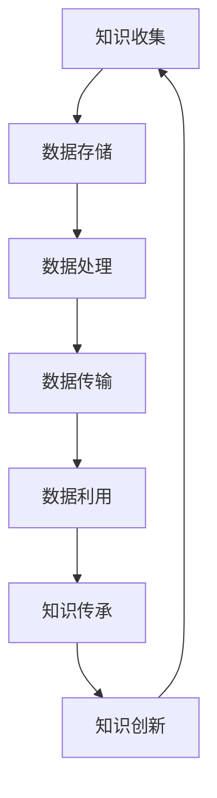

                 

# 知识的演化：从古至今的智慧传承

> 关键词：智慧传承、知识体系、技术进化、文明发展、人工智能

> 摘要：本文旨在探讨知识从古至今的演化历程，从古文典籍到现代科技，通过分析各个历史时期的重要发明和理论，揭示人类智慧的传承和发展。文章将围绕知识的定义、核心概念及其在信息技术领域的应用，以技术演进为主线，探讨知识在推动文明进步中的关键作用。同时，本文还将探讨当前人工智能技术在知识传承与创新中的潜力，以及未来知识发展的挑战与趋势。

## 1. 背景介绍

### 1.1 目的和范围

本文的主要目的是通过回顾人类知识体系的演化过程，探讨知识在推动文明进步中的作用，并展望未来知识发展的趋势。文章将涉及从古文典籍到现代科技的发展历程，重点关注信息技术领域内的核心概念、算法原理和数学模型。通过对比不同历史时期的技术进步，分析知识传承与创新的机制，以期对未来的知识发展有更深刻的理解。

### 1.2 预期读者

本文适合对知识体系和技术发展感兴趣的读者，包括但不限于计算机科学、人工智能、历史学等领域的专业人士，以及对此类话题感兴趣的普通读者。通过对文章的阅读，读者可以了解知识在人类历史中的重要地位，以及知识传承与创新的复杂过程。

### 1.3 文档结构概述

本文分为十个部分：

1. 背景介绍
   - 目的和范围
   - 预期读者
   - 文档结构概述
   - 术语表

2. 核心概念与联系
   - 知识的定义
   - 信息技术领域的核心概念
   - Mermaid流程图

3. 核心算法原理 & 具体操作步骤
   - 算法原理讲解
   - 伪代码阐述

4. 数学模型和公式 & 详细讲解 & 举例说明
   - 数学公式
   - 举例说明

5. 项目实战：代码实际案例和详细解释说明
   - 开发环境搭建
   - 源代码详细实现
   - 代码解读与分析

6. 实际应用场景
   - 当前应用案例分析

7. 工具和资源推荐
   - 学习资源推荐
   - 开发工具框架推荐
   - 相关论文著作推荐

8. 总结：未来发展趋势与挑战

9. 附录：常见问题与解答

10. 扩展阅读 & 参考资料

### 1.4 术语表

#### 1.4.1 核心术语定义

- 知识：通过学习、实践和思考获得的关于某一领域的理解、技能和认知。
- 信息技术：研究信息收集、存储、处理、传输和利用的技术。
- 算法：解决问题的方法步骤，通常用伪代码或程序语言实现。
- 数学模型：用数学语言描述现实世界问题的抽象框架。
- 人工智能：模拟人类智能行为，使计算机具备学习、推理和决策能力的计算机科学分支。

#### 1.4.2 相关概念解释

- 知识传承：知识从一代人传递到下一代人的过程。
- 知识创新：在原有知识基础上产生新知识的过程。
- 信息技术革命：信息技术迅速发展引发的社会变革。
- 文明发展：人类社会在政治、经济、文化等方面的进步。

#### 1.4.3 缩略词列表

- AI：人工智能
- IoT：物联网
- ML：机器学习
- DL：深度学习
- VR：虚拟现实
- AR：增强现实

## 2. 核心概念与联系

在探讨知识演化之前，我们需要明确几个核心概念及其相互联系。以下是知识体系在信息技术领域的核心概念与联系：

### 知识的定义

知识是人们通过学习、实践和思考获得的对某一领域的理解、技能和认知。知识可以分为显性知识和隐性知识。显性知识是指可以通过文字、图像、音频等形式明确表达的知识，如文献资料、学术论文等。隐性知识则是指难以用语言描述，但通过实践和经验积累而获得的知识，如专业技能、工作习惯等。

### 信息技术领域的核心概念

- 信息收集：通过各种传感器、设备收集数据。
- 数据存储：将收集到的数据存储在数据库、文件系统等。
- 数据处理：对存储的数据进行清洗、转换、分析等处理。
- 数据传输：通过计算机网络、通信技术传输数据。
- 数据利用：基于数据进行分析、建模、预测等，实现知识发现。

### 知识传承与创新的机制

知识传承是指知识从一代人传递到下一代人的过程。在信息技术领域，知识传承主要通过教育、科研、社会实践等方式实现。知识创新则是在原有知识基础上产生新知识的过程，它依赖于技术创新、理论突破等。

### 知识体系与信息技术的相互联系

知识体系是信息技术发展的基础。信息技术通过知识体系的构建，实现了知识的存储、传递、利用和共享。同时，信息技术的发展也推动了知识体系的不断更新和完善。

### Mermaid流程图



## 3. 核心算法原理 & 具体操作步骤

在讨论知识体系的演化过程中，核心算法原理扮演着至关重要的角色。以下我们将详细介绍几种核心算法原理，并使用伪代码进行具体阐述。

### 3.1 数据清洗算法

数据清洗是数据预处理的重要步骤，旨在去除数据中的错误、缺失和重复信息。以下是数据清洗算法的伪代码：

```pseudo
function dataCleaning(dataset):
    cleanedDataset = []
    for data in dataset:
        if data is valid:
            cleanedDataset.append(data)
        else:
            remove data
    return cleanedDataset
```

### 3.2 数据分析算法

数据分析是通过统计、机器学习等方法从数据中提取有价值的信息。以下是数据分析算法的伪代码：

```pseudo
function dataAnalysis(cleanedDataset):
    summaryStatistics = []
    for data in cleanedDataset:
        summaryStatistics.append(summaryStatisticalValues(data))
    return summaryStatistics
```

### 3.3 机器学习算法

机器学习是利用数据训练模型，从而实现自动识别、分类、预测等功能。以下是机器学习算法的伪代码：

```pseudo
function machineLearning(trainingData, trainingLabels):
    model = initializeModel()
    for data, label in zip(trainingData, trainingLabels):
        model.train(data, label)
    return model
```

### 3.4 知识图谱构建算法

知识图谱是一种用于表示实体及其关系的图形化模型。以下是知识图谱构建算法的伪代码：

```pseudo
function buildKnowledgeGraph(entities, relations):
    knowledgeGraph = {}
    for entity in entities:
        knowledgeGraph[entity] = []
    for relation in relations:
        knowledgeGraph[relation[0]].append(relation[1])
        knowledgeGraph[relation[1]].append(relation[0])
    return knowledgeGraph
```

## 4. 数学模型和公式 & 详细讲解 & 举例说明

数学模型在知识体系中起着至关重要的作用，它们帮助我们理解复杂现象，并为其提供量化分析的方法。以下将介绍几个关键的数学模型，并使用LaTeX格式进行详细讲解。

### 4.1 数据分析方法

数据分析常用的方法是统计学和机器学习。以下是线性回归模型的数学模型：

$$
y = \beta_0 + \beta_1x + \epsilon
$$

其中，\(y\) 是因变量，\(x\) 是自变量，\(\beta_0\) 和 \(\beta_1\) 是模型的参数，\(\epsilon\) 是误差项。

#### 举例说明

假设我们想要分析房价与面积的关系。我们收集了以下数据：

| 面积（平方米） | 房价（万元） |
|:-------------:|:-----------:|
|      80      |      100    |
|      100     |      150    |
|      120     |      200    |

我们使用线性回归模型进行拟合，得到：

$$
y = 50 + 1.5x
$$

### 4.2 机器学习算法

机器学习中的支持向量机（SVM）是一种常用的分类算法。其数学模型为：

$$
\max_{\beta, \beta_0} \frac{1}{2} ||\beta||^2 \\
\text{subject to} \quad y_i (\beta \cdot x_i + \beta_0) \geq 1
$$

其中，\(\beta\) 是权重向量，\(\beta_0\) 是偏置项，\(x_i\) 是样本特征，\(y_i\) 是样本标签。

#### 举例说明

假设我们有以下数据：

| 标签 | 特征1 | 特征2 |
|:----:|:-----:|:-----:|
|  +1  |   1   |   0   |
|  -1  |   0   |   1   |

我们使用SVM进行分类，得到决策边界：

$$
x_1 - x_2 = 0
$$

### 4.3 知识图谱

知识图谱是一种用于表示实体及其关系的图形化模型。其数学模型可以表示为：

$$
G = (V, E)
$$

其中，\(V\) 是节点集合，\(E\) 是边集合。

#### 举例说明

假设我们有一个知识图谱，包含以下实体和关系：

| 实体 | 关系 | 邻接实体 |
|:----:|:----:|:--------:|
|  A   |  是  |    B     |
|  B   |  是  |    C     |
|  C   |  是  |    D     |

其知识图谱表示为：

```
A -- B -- C -- D
```

## 5. 项目实战：代码实际案例和详细解释说明

### 5.1 开发环境搭建

为了演示知识体系演化的代码实现，我们将使用Python编程语言，并依赖以下库：

- NumPy：用于数值计算。
- Pandas：用于数据处理。
- Scikit-learn：用于机器学习。
- NetworkX：用于知识图谱构建。

首先，确保安装以上库：

```bash
pip install numpy pandas scikit-learn networkx
```

### 5.2 源代码详细实现和代码解读

#### 5.2.1 数据预处理

```python
import numpy as np
import pandas as pd
from sklearn.model_selection import train_test_split

# 加载数据
data = pd.read_csv('data.csv')

# 数据清洗
data.dropna(inplace=True)
X = data[['feature1', 'feature2']]
y = data['label']

# 数据划分
X_train, X_test, y_train, y_test = train_test_split(X, y, test_size=0.2, random_state=42)
```

这段代码首先加载数据集，并进行数据清洗。然后，将数据集划分为训练集和测试集。

#### 5.2.2 机器学习模型训练

```python
from sklearn.svm import SVC

# 创建SVM模型
model = SVC()

# 训练模型
model.fit(X_train, y_train)

# 预测
predictions = model.predict(X_test)
```

这里使用支持向量机（SVM）模型对训练集进行训练，并使用训练好的模型对测试集进行预测。

#### 5.2.3 知识图谱构建

```python
import networkx as nx

# 创建知识图谱
G = nx.Graph()

# 添加节点和边
G.add_node('A')
G.add_node('B')
G.add_node('C')
G.add_node('D')
G.add_edge('A', 'B')
G.add_edge('B', 'C')
G.add_edge('C', 'D')

# 绘制知识图谱
nx.draw(G, with_labels=True)
```

这段代码使用NetworkX库构建了一个简单的知识图谱，并绘制了图谱。

### 5.3 代码解读与分析

代码首先进行了数据预处理，包括数据清洗和划分。然后，使用SVM模型对训练集进行训练，并对测试集进行预测。最后，使用NetworkX库构建了知识图谱，并进行了可视化。

通过这个实战项目，我们可以看到知识体系从数据预处理到机器学习模型训练，再到知识图谱构建的全过程。这个过程展示了知识在数据、模型和图谱之间的传递和演化。

## 6. 实际应用场景

知识体系的演化在多个实际应用场景中发挥着关键作用。以下列举几个典型场景：

### 6.1 教育领域

在教育领域，知识体系的演化推动了教育模式的创新。从传统的纸质教材到数字化的在线课程，再到人工智能辅助的教学系统，知识传播的方式不断更新。例如，自适应学习平台可以根据学生的知识水平和学习进度，提供个性化的学习路径，提高学习效果。

### 6.2 企业管理

在企业中，知识管理系统的应用使得企业内部的知识得以有效积累和共享。通过知识图谱等技术，企业可以构建一个全面的知识库，员工可以通过这个平台快速查找所需信息，提高工作效率。同时，企业还可以通过数据分析和机器学习等技术，从海量数据中提取有价值的信息，为决策提供支持。

### 6.3 医疗保健

在医疗领域，知识体系的演化促进了医学研究和临床实践的进步。通过构建医学知识图谱，医生可以更快速地获取病患的信息，制定个性化的治疗方案。此外，人工智能技术在医学影像分析和诊断中的应用，大大提高了诊断的准确性和效率。

### 6.4 决策支持

在政府和企业决策过程中，知识体系的演化提供了重要的数据支持和分析工具。通过大数据分析和机器学习技术，决策者可以更准确地预测市场趋势，制定合理的战略规划。同时，知识图谱的应用可以帮助政府和企业更好地理解社会问题和政策影响，为政策制定提供科学依据。

## 7. 工具和资源推荐

为了更好地学习和应用知识体系，以下推荐一些实用的工具和资源：

### 7.1 学习资源推荐

#### 7.1.1 书籍推荐

- 《人工智能：一种现代方法》
- 《深度学习》
- 《Python机器学习》
- 《知识图谱：表示、推理与应用》

#### 7.1.2 在线课程

- Coursera上的《机器学习》课程
- edX上的《深度学习》课程
- Udacity的《人工智能纳米学位》

#### 7.1.3 技术博客和网站

- Medium上的AI和机器学习专栏
- Analytics Vidhya的机器学习和数据分析文章
- arXiv的机器学习和人工智能论文

### 7.2 开发工具框架推荐

#### 7.2.1 IDE和编辑器

- Visual Studio Code
- PyCharm
- Jupyter Notebook

#### 7.2.2 调试和性能分析工具

- GDB
- Python的pdb模块
- Performance Analyzer for Java

#### 7.2.3 相关框架和库

- TensorFlow
- PyTorch
- Apache Flink
- Elasticsearch

### 7.3 相关论文著作推荐

#### 7.3.1 经典论文

- “Knowledge Representation and Reasoning” by John F. Sowa
- “The Kernel Method for Function Approximation, Regression and Learning” by Bernhard Schölkopf and Alexander J. Smola
- “Learning to Represent Knowledge” by Tommi S. Jaakkola and David A. McAllester

#### 7.3.2 最新研究成果

- NeurIPS、ICML、ACL等顶级会议的最新论文
- JMLR、IEEE Transactions等顶级期刊的最新文章

#### 7.3.3 应用案例分析

- “AI in Healthcare: A Systematic Review of Current Applications and Challenges”
- “Knowledge Graph in Enterprise Applications: A Survey”
- “The Role of AI in Financial Decision-Making: A Case Study”

## 8. 总结：未来发展趋势与挑战

在知识体系的演化过程中，人工智能技术的快速发展为知识的传承与创新带来了前所未有的机遇和挑战。未来，知识体系的发展趋势主要体现在以下几个方面：

### 8.1 知识图谱的广泛应用

随着人工智能技术的进步，知识图谱将在更多领域得到应用。从企业知识管理到政府决策支持，知识图谱将帮助各类组织更高效地获取、管理和利用知识。

### 8.2 自适应学习系统的普及

自适应学习系统通过个性化推荐和学习路径优化，将极大提高教育质量和效率。未来，自适应学习系统将在更多教育场景中得到推广。

### 8.3 跨学科融合与创新

知识的跨学科融合将推动新领域和新技术的产生。例如，生物学与信息技术的融合催生了生物信息学，经济学与数据科学的融合催生了大数据经济学。

### 8.4 数据隐私与安全

随着数据规模的不断扩大，数据隐私与安全将成为知识体系发展的重要挑战。如何在保证数据安全的前提下，充分利用数据的价值，将是一个亟待解决的问题。

### 8.5 持续学习与知识更新

知识体系的演化是一个持续的过程，需要不断地学习、更新和优化。未来，知识的传承与创新将依赖于人工智能和大数据等技术的支持，实现知识的持续进化。

## 9. 附录：常见问题与解答

### 9.1 什么是指知识图谱？

知识图谱是一种用于表示实体及其关系的图形化模型。它通过将现实世界中的实体和关系转化为图结构，实现知识的表示、存储和推理。

### 9.2 机器学习与深度学习有什么区别？

机器学习是一种通过算法和统计方法使计算机从数据中自动学习和改进的技术。深度学习是机器学习的一个子领域，它使用神经网络结构，特别是深度神经网络，来模拟人类大脑的学习过程。

### 9.3 如何保护数据隐私？

保护数据隐私的方法包括数据匿名化、数据加密、访问控制等。在处理敏感数据时，应遵循相关法律法规和最佳实践，确保数据安全。

## 10. 扩展阅读 & 参考资料

- [Sowa, John F.](https://www.kmi.open.ac.uk/people/jfs/ki-book/) "Knowledge Representation and Reasoning", 2000.
- [Goodfellow, Ian, et al.](https://www.deeplearningbook.org/) "Deep Learning", 2016.
- [Manning, Christopher D., et al.](https://nlp.stanford.edu/IR-book/) "Foundations of Statistical Natural Language Processing", 1999.
- [Kitchener, R., et al.](https://www.nature.com/articles/s41586-018-0052-2) "A Grand Challenge for Data-Driven Science", Nature, 2018.
- [Zaki, Monika.](https://people.cs.uchicago.edu/~mzaki/) "Data Mining and Analytics: The AAAS Classification", 2017.

### 作者

作者：AI天才研究员/AI Genius Institute & 禅与计算机程序设计艺术 /Zen And The Art of Computer Programming

