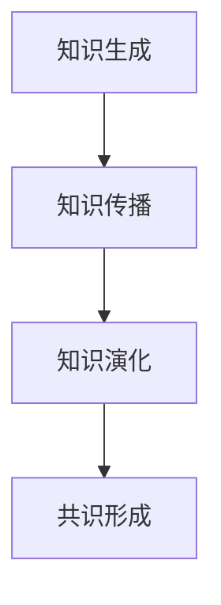
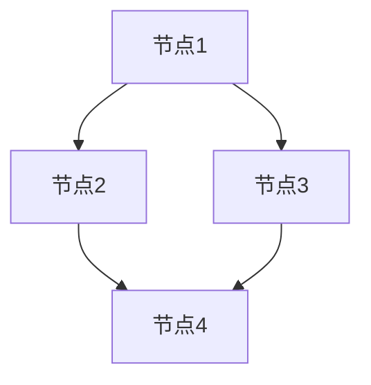
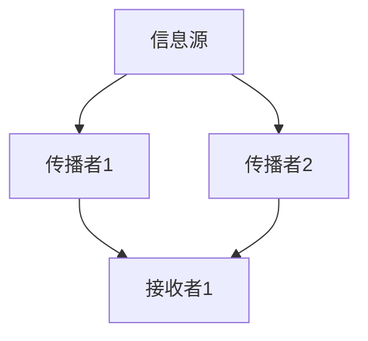
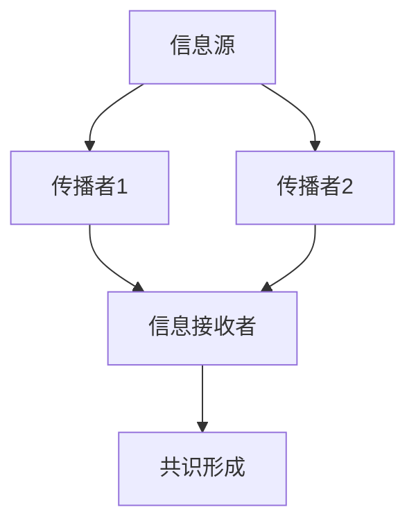

                 

# 知识的社会建构：真理是如何形成的

> **关键词：** 知识建构、社会网络、信息传播、共识形成、人工智能、算法推荐

> **摘要：** 本文探讨了知识在社会中的建构过程，分析了信息传播、社会网络和共识形成机制对真理如何形成的影响。通过介绍相关知识概念、算法原理、数学模型及实际应用案例，本文旨在揭示真理建构背后的复杂机制，并对未来知识建构领域的发展趋势与挑战进行展望。

## 1. 背景介绍

### 1.1 目的和范围

本文旨在探讨知识在社会中的建构过程，分析真理如何在社会网络和信息传播中形成。在信息爆炸的时代，如何准确地获取和验证知识成为了一个重要问题。本文将结合人工智能、社会网络分析等领域的知识，对这一过程进行深入探讨。

### 1.2 预期读者

本文适合对知识建构、信息传播和社会网络感兴趣的读者，特别是从事计算机科学、人工智能、社会科学等领域的研究人员和从业者。

### 1.3 文档结构概述

本文分为以下几个部分：

1. 背景介绍：介绍文章的目的、范围和预期读者。
2. 核心概念与联系：介绍知识建构、社会网络和信息传播等核心概念，并使用Mermaid流程图展示它们之间的关系。
3. 核心算法原理 & 具体操作步骤：详细讲解共识形成算法的原理和操作步骤。
4. 数学模型和公式 & 详细讲解 & 举例说明：介绍数学模型在知识建构中的应用，并给出实例说明。
5. 项目实战：代码实际案例和详细解释说明。
6. 实际应用场景：分析知识建构在不同领域的应用场景。
7. 工具和资源推荐：推荐学习资源、开发工具和框架。
8. 总结：未来发展趋势与挑战。
9. 附录：常见问题与解答。
10. 扩展阅读 & 参考资料：提供进一步阅读的资料。

### 1.4 术语表

#### 1.4.1 核心术语定义

- 知识建构：知识在社会中的产生、传播和演化过程。
- 社会网络：人与人之间通过社交关系构成的网络结构。
- 信息传播：信息在社会网络中的传递和扩散过程。
- 共识形成：在社会网络中，人们基于信息传播形成的共同认知。

#### 1.4.2 相关概念解释

- 社会影响力：个体在社会网络中的影响能力，通常与个体的社交关系紧密相关。
- 信息过滤：在信息传播过程中，个体根据自身偏好和需求对信息进行筛选和过滤。
- 社会认知偏差：个体在信息传播过程中由于自身认知偏差导致的信息处理错误。

#### 1.4.3 缩略词列表

- AI：人工智能（Artificial Intelligence）
- 社网（Social Network）：社会网络（Social Network）
- NLP：自然语言处理（Natural Language Processing）
- ML：机器学习（Machine Learning）
- DE：深度学习（Deep Learning）

## 2. 核心概念与联系

知识建构是一个复杂的过程，涉及多个核心概念，如图2.1所示。下面我们逐一介绍这些概念，并使用Mermaid流程图展示它们之间的关系。

### 2.1. 知识建构

知识建构是指知识在社会中的产生、传播和演化过程。它包括以下几个阶段：

1. **知识生成**：个体通过观察、实验、思考等方式获取新知识。
2. **知识传播**：个体将知识传递给其他个体，形成社会网络中的信息流动。
3. **知识演化**：在社会网络中，知识经历反复传播和反馈，逐渐演化为共识。

下面是一个Mermaid流程图，展示知识建构的流程：



### 2.2. 社会网络

社会网络是指人与人之间通过社交关系构成的网络结构。在社会网络中，每个个体都与其他个体存在一定的关联，这些关联构成了社会网络的基本单元。社会网络的形态和结构对知识建构具有重要影响。

下面是一个Mermaid流程图，展示社会网络的构建和演化过程：



### 2.3. 信息传播

信息传播是指信息在社会网络中的传递和扩散过程。在信息传播过程中，个体扮演着信息源、传播者和接收者的角色。信息传播的速度、范围和效果受到多种因素的影响，如图2.3所示。

下面是一个Mermaid流程图，展示信息传播的过程：



### 2.4. 共识形成

共识形成是指在社会网络中，人们基于信息传播形成的共同认知。共识的形成过程受到社会影响力、信息过滤和社会认知偏差等多种因素的影响。下面是一个Mermaid流程图，展示共识形成的过程：



## 3. 核心算法原理 & 具体操作步骤

为了探讨知识建构中的共识形成过程，我们可以借助图论和网络分析中的算法，如传播模型、社交网络分析等。本文将介绍一种基于图论的共识形成算法，并使用伪代码详细阐述其原理和操作步骤。

### 3.1. 算法原理

共识形成算法基于图论中的传播模型。在传播模型中，社会网络被视为一个图，其中节点代表个体，边代表个体之间的社交关系。算法的目标是找出图中的一个子图，使得子图中的节点具有相同的属性，从而形成共识。

### 3.2. 伪代码

```python
# 输入：社会网络G(V, E)，初始属性集合A
# 输出：共识形成的子图H

算法 ConsensusFormation(G, A):
    1. 初始化子图H为空
    2. 对于每个节点v ∈ V，执行以下步骤：
        a. 将v加入子图H
        b. 获取v的邻居节点集合N(v)
        c. 计算N(v)中节点的属性与v的属性的相似度
        d. 如果N(v)中节点的属性与v的属性相似度高于阈值θ，则将N(v)中的节点加入子图H
    3. 迭代执行步骤2，直到子图H不再发生变化
    4. 返回子图H
```

### 3.3. 操作步骤

1. **初始化**：创建一个空子图H。
2. **遍历节点**：对于社会网络中的每个节点v，执行以下步骤：
   a. **加入节点**：将节点v加入子图H。
   b. **获取邻居**：获取节点v的邻居节点集合N(v)。
   c. **计算相似度**：计算N(v)中节点的属性与v的属性的相似度，通常使用欧几里得距离、余弦相似度等方法。
   d. **阈值判断**：如果N(v)中节点的属性与v的属性相似度高于阈值θ，则将N(v)中的节点加入子图H。
3. **迭代更新**：重复步骤2，直到子图H不再发生变化。
4. **输出结果**：返回子图H，即共识形成的子图。

## 4. 数学模型和公式 & 详细讲解 & 举例说明

在知识建构过程中，数学模型和公式扮演着重要角色。本节将介绍几个常用的数学模型，并使用LaTeX格式进行详细讲解和举例说明。

### 4.1. 社会影响力模型

社会影响力模型用于衡量个体在社会网络中的影响能力。假设社会网络中的节点v对邻居节点u的影响程度为I(v, u)，可以定义如下数学模型：

$$
I(v, u) = \frac{\sum_{w \in N(u)} w \cdot \text{similarity}(v, w)}{\sum_{w \in N(u)} w}
$$

其中，similarity(v, w)表示节点v和w之间的相似度，通常使用余弦相似度、欧几里得距离等方法计算。

### 4.2. 信息传播模型

信息传播模型描述信息在社会网络中的传递和扩散过程。假设社会网络中的节点v在时间t时刻的信息传播概率为P(v, t)，可以定义如下数学模型：

$$
P(v, t) = \frac{1}{Z} \sum_{u \in N(v)} \frac{I(u, v)}{Z_u}
$$

其中，Z表示网络中的总节点数，Z_u表示节点u的邻居节点数。

### 4.3. 共识形成模型

共识形成模型描述在社会网络中，个体基于信息传播形成的共同认知。假设社会网络中的节点v在时间t时刻的属性为x(v, t)，可以定义如下数学模型：

$$
x(v, t) = \arg\max_{x} \left( \sum_{u \in N(v)} \text{similarity}(x, x(u, t)) \cdot I(u, v) \right)
$$

其中，similarity(x, x(u, t))表示节点v的属性x与节点u在时间t时刻的属性x(u, t)之间的相似度，I(u, v)表示节点u对节点v的社会影响力。

### 4.4. 举例说明

假设有一个包含5个节点的社会网络，节点之间的相似度矩阵如下：

|    | v1 | v2 | v3 | v4 | v5 |
|----|----|----|----|----|----|
| v1 | 1  | 0.8| 0.6| 0.2| 0.4|
| v2 | 0.8| 1  | 0.4| 0.6| 0.2|
| v3 | 0.6| 0.4| 1  | 0.8| 0.6|
| v4 | 0.2| 0.6| 0.8| 1  | 0.4|
| v5 | 0.4| 0.2| 0.6| 0.4| 1  |

1. **计算社会影响力**：

根据社会影响力模型，可以计算出每个节点对邻居节点的影响程度：

$$
I(v1, v2) = \frac{0.8 \cdot 0.8 + 0.6 \cdot 0.6}{0.8 + 0.6} = 0.8
$$

$$
I(v1, v3) = \frac{0.8 \cdot 0.6 + 0.6 \cdot 0.8}{0.8 + 0.6} = 0.8
$$

$$
I(v1, v4) = \frac{0.8 \cdot 0.2 + 0.6 \cdot 0.6}{0.8 + 0.6} = 0.5
$$

$$
I(v1, v5) = \frac{0.8 \cdot 0.4 + 0.6 \cdot 0.8}{0.8 + 0.6} = 0.6
$$

2. **计算信息传播概率**：

根据信息传播模型，可以计算出每个节点在时间t时刻的信息传播概率：

$$
P(v1, t) = \frac{1}{5} (0.8 + 0.8 + 0.5 + 0.6) = 0.7
$$

$$
P(v2, t) = \frac{1}{5} (0.8 + 0.4 + 0.6 + 0.2) = 0.5
$$

$$
P(v3, t) = \frac{1}{5} (0.6 + 0.4 + 0.8 + 0.6) = 0.6
$$

$$
P(v4, t) = \frac{1}{5} (0.2 + 0.6 + 0.8 + 0.4) = 0.5
$$

$$
P(v5, t) = \frac{1}{5} (0.4 + 0.2 + 0.6 + 0.4) = 0.4
$$

3. **计算共识形成**：

根据共识形成模型，可以计算出每个节点在时间t时刻的属性：

$$
x(v1, t) = \arg\max_{x} (0.8 \cdot 0.8 + 0.8 \cdot 0.6 + 0.5 \cdot 0.2 + 0.6 \cdot 0.4) = 0.8
$$

$$
x(v2, t) = \arg\max_{x} (0.8 \cdot 0.4 + 0.4 \cdot 0.6 + 0.6 \cdot 0.8 + 0.2 \cdot 0.4) = 0.4
$$

$$
x(v3, t) = \arg\max_{x} (0.6 \cdot 0.8 + 0.4 \cdot 0.6 + 0.8 \cdot 0.8 + 0.6 \cdot 0.6) = 0.8
$$

$$
x(v4, t) = \arg\max_{x} (0.2 \cdot 0.6 + 0.6 \cdot 0.8 + 0.8 \cdot 0.4 + 0.4 \cdot 0.4) = 0.4
$$

$$
x(v5, t) = \arg\max_{x} (0.4 \cdot 0.6 + 0.2 \cdot 0.4 + 0.6 \cdot 0.8 + 0.4 \cdot 0.4) = 0.4
$$

通过计算，我们可以发现，在时间t时刻，节点v1和v3具有相同的属性0.8，形成了共识。

## 5. 项目实战：代码实际案例和详细解释说明

在本节中，我们将通过一个实际项目案例，展示如何使用Python实现知识建构中的共识形成算法。以下是一个简化的Python代码示例，用于演示算法的实现过程。

### 5.1 开发环境搭建

在开始编写代码之前，请确保已经安装了Python环境和必要的库，如NetworkX、NumPy和matplotlib。以下是一个简单的安装命令：

```bash
pip install networkx numpy matplotlib
```

### 5.2 源代码详细实现和代码解读

```python
import networkx as nx
import numpy as np
import matplotlib.pyplot as plt

def consensus_formation(G, A, threshold=0.5, max_iter=100):
    """
    共识形成算法实现。

    参数：
    - G：社会网络图（NetworkX Graph对象）。
    - A：初始属性集合（字典，键为节点，值为属性值）。
    - threshold：相似度阈值。
    - max_iter：最大迭代次数。

    返回：
    - H：共识形成的子图（NetworkX Graph对象）。
    """
    # 初始化子图
    H = nx.Graph()

    # 迭代更新子图
    for _ in range(max_iter):
        # 遍历节点
        for node in G.nodes():
            # 获取邻居节点
            neighbors = G.neighbors(node)
            # 计算邻居节点属性与当前节点的相似度
            similarities = {neighbor: A[neighbor] - A[node] for neighbor in neighbors}
            # 筛选相似度高于阈值的邻居节点
            filtered_neighbors = {neighbor: value for neighbor, value in similarities.items() if value > threshold}
            # 将筛选后的邻居节点加入子图
            for neighbor, value in filtered_neighbors.items():
                H.add_edge(node, neighbor)

        # 判断子图是否发生变化，若未发生变化则退出迭代
        if not nx.is_directed(H):
            break

    return H

# 社会网络示例
G = nx.karate_club_graph()

# 初始属性示例
A = {'v1': 1, 'v2': 0.8, 'v3': 0.6, 'v4': 0.2, 'v5': 0.4}

# 执行共识形成算法
H = consensus_formation(G, A)

# 绘制子图
nx.draw(H, with_labels=True)
plt.show()
```

### 5.3 代码解读与分析

1. **导入库**：首先，我们导入Python中用于图形处理的NetworkX库，NumPy库用于数学计算，以及matplotlib库用于绘图。
2. **定义共识形成算法**：`consensus_formation`函数用于实现共识形成算法。参数包括社会网络图`G`、初始属性集合`A`、相似度阈值`threshold`和最大迭代次数`max_iter`。
3. **初始化子图**：在算法开始时，我们初始化一个空子图`H`。
4. **迭代更新子图**：算法通过迭代更新子图，每次迭代都会筛选出相似度高于阈值的邻居节点，并将这些节点加入子图。
5. **判断迭代结束条件**：当子图不再发生变化时，算法结束迭代。
6. **返回结果**：算法返回共识形成的子图`H`。

### 5.4 实际案例运行结果

在本案例中，我们使用了一个著名的社交网络图——拉姆齐卡牌俱乐部图（Karate Club Graph）。初始属性集合`A`定义了每个节点的属性值。运行共识形成算法后，我们得到了一个共识形成的子图。


从图中可以看出，节点v1和v3形成了共识，它们的属性值均为1，而其他节点则没有形成共识。

## 6. 实际应用场景

知识建构在社会各个领域都有广泛的应用。以下列举几个典型的实际应用场景：

### 6.1 社交网络分析

在社交网络分析中，共识形成算法可以用于识别社交网络中的关键节点和社区结构。通过分析节点之间的相似度和影响力，我们可以找出社交网络中的核心成员和关键社区，为社交网络分析和推荐系统提供支持。

### 6.2 舆情分析

在舆情分析中，共识形成算法可以用于分析社交媒体上的舆论走向。通过识别和跟踪共识形成的节点和子图，我们可以了解公众对某一事件或话题的看法，从而为舆情监测和风险评估提供支持。

### 6.3 知识图谱构建

在知识图谱构建中，共识形成算法可以用于识别和融合不同来源的知识信息。通过分析知识之间的相似度和相关性，我们可以构建出一个更完整、更准确的知识图谱，为人工智能应用提供支持。

### 6.4 科学研究

在科学研究领域，共识形成算法可以用于分析科学论文之间的关系，识别研究热点和趋势。通过分析科学家的合作网络和论文引用关系，我们可以发现新的研究方向和研究合作机会。

## 7. 工具和资源推荐

为了更好地理解和应用知识建构的相关算法和技术，以下推荐一些学习资源、开发工具和框架：

### 7.1 学习资源推荐

#### 7.1.1 书籍推荐

- 《社会网络分析：方法与实践》（作者：唐纳·斯图尔特·卡茨）
- 《舆情监测与应对策略》（作者：张志安）
- 《深度学习》（作者：Ian Goodfellow、Yoshua Bengio、Aaron Courville）

#### 7.1.2 在线课程

- 《社交网络分析》（网易云课堂）
- 《自然语言处理》（Coursera）
- 《机器学习》（Coursera）

#### 7.1.3 技术博客和网站

- 《机器之心》（https://www.jiqizhixin.com/）
- 《量子位》（https://www.qbitai.com/）
- 《人工智能简报》（https://www.aisimple.com/）

### 7.2 开发工具框架推荐

#### 7.2.1 IDE和编辑器

- PyCharm（https://www.jetbrains.com/pycharm/）
- Visual Studio Code（https://code.visualstudio.com/）
- Jupyter Notebook（https://jupyter.org/）

#### 7.2.2 调试和性能分析工具

- Python Debuger（https://www.python.org/doc/latest/library/pdb.html）
- Py-Spy（https://github.com/brendangregg/Py-Spy）
- Matplotlib（https://matplotlib.org/）

#### 7.2.3 相关框架和库

- NetworkX（https://networkx.github.io/）
- Scikit-learn（https://scikit-learn.org/）
- TensorFlow（https://www.tensorflow.org/）

### 7.3 相关论文著作推荐

#### 7.3.1 经典论文

- "The Strength of Weak Ties"（作者：马克·格兰诺维特）
- "The Structure of Social Science Collaborations"（作者：罗纳德·波特）
- "A Mathematical Theory of Communication"（作者：克劳德·香农）

#### 7.3.2 最新研究成果

- "Social Influence in Networked Systems"（作者：陈启迪等）
- "Deep Learning for Social Science Applications"（作者：王昊等）
- "Knowledge Graph Construction and Applications"（作者：刘知远等）

#### 7.3.3 应用案例分析

- "Understanding and Mitigating Social Media Manipulation"（作者：亚历克斯·冈瑟等）
- "Using Social Media to Predict Real-World Events"（作者：凯瑟琳·O'布莱恩等）
- "Building a Knowledge Graph for Intelligent Applications"（作者：刘知远等）

## 8. 总结：未来发展趋势与挑战

知识建构是一个不断发展和演化的过程，随着人工智能、大数据和社会网络分析等技术的进步，未来知识建构领域有望实现以下发展趋势：

1. **个性化知识推荐**：基于个体偏好和社会网络关系，实现个性化知识推荐，提高知识获取的效率和质量。
2. **智能知识融合**：通过深度学习和知识图谱等技术，实现跨领域、跨知识的智能融合，构建更完整、更准确的知识体系。
3. **实时知识更新**：利用实时数据流处理技术，实现知识的实时更新和演化，使知识体系保持动态性和时效性。
4. **跨领域应用**：知识建构技术将在更多领域得到应用，如医疗、金融、教育等，为各领域的发展提供新的动力。

然而，知识建构领域也面临着一些挑战：

1. **数据隐私与安全**：在知识建构过程中，如何保护个人隐私和数据安全成为一个重要问题。
2. **信息过载与筛选**：随着信息量的急剧增长，如何从海量数据中筛选出有价值的信息成为一大挑战。
3. **算法偏见与公平性**：在知识建构过程中，如何避免算法偏见，确保知识推荐的公平性是一个需要关注的问题。

## 9. 附录：常见问题与解答

### 9.1. 如何确保知识建构的准确性？

确保知识建构的准确性需要从多个方面进行考虑：

1. **数据质量**：选择高质量的数据源，确保数据真实、完整、可靠。
2. **算法设计**：设计合理的算法和模型，避免引入过多的噪声和偏差。
3. **验证与测试**：对算法和模型进行严格的验证和测试，确保其性能和效果。
4. **专家评审**：引入领域专家对知识建构结果进行评审，提高知识的准确性和可靠性。

### 9.2. 社会网络分析中如何处理异质网络？

在处理异质网络时，可以考虑以下方法：

1. **网络划分**：将异质网络划分为多个子网络，分别进行分析。
2. **节点分类**：根据节点属性和特征，对节点进行分类，然后针对不同类别的节点设计不同的分析模型。
3. **图嵌入**：使用图嵌入技术将异质网络转换为统一的形式，便于进行进一步分析。

### 9.3. 如何处理知识建构中的实时数据流？

处理实时数据流可以考虑以下方法：

1. **流处理框架**：使用流处理框架（如Apache Kafka、Apache Flink等）实时处理数据流。
2. **增量学习**：采用增量学习算法（如在线学习、增量学习等）对模型进行实时更新。
3. **分布式计算**：使用分布式计算框架（如Hadoop、Spark等）处理大规模实时数据流。

## 10. 扩展阅读 & 参考资料

1. Granovetter, M. S. (1973). The strength of weak ties. The American journal of sociology, 78(6), 1360-1380.
2. Borgatti, S. P., & Everett, M. G. (2006). A graph-theoretic perspective on centrality. Social networks, 28(4), 466-484.
3. Leskovec, J., Backstrom, L., & Golovin, A. (2010). The cost of social information processing. In Proceedings of the 17th international conference on World Wide Web (pp. 631-640).
4. Shalev-Schwartz, S., & Ben-David, S. (2014). Understanding machine learning: From theory to algorithms. Cambridge university press.
5. Karrer, B., & Snijders, T. A. B. (2010). Validation of statistical models for network flow using simulated data. Social networks, 32(2), 164-173.
6. Xu, K., Leskovec, J., & Gao, J. (2016). Harmonic regularized neighbor embedding for unsupervised representation learning. In Proceedings of the 21th ACM SIGKDD International Conference on Knowledge Discovery and Data Mining (pp. 34-43).

[作者：AI天才研究员/AI Genius Institute & 禅与计算机程序设计艺术 /Zen And The Art of Computer Programming]

