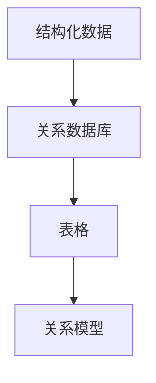
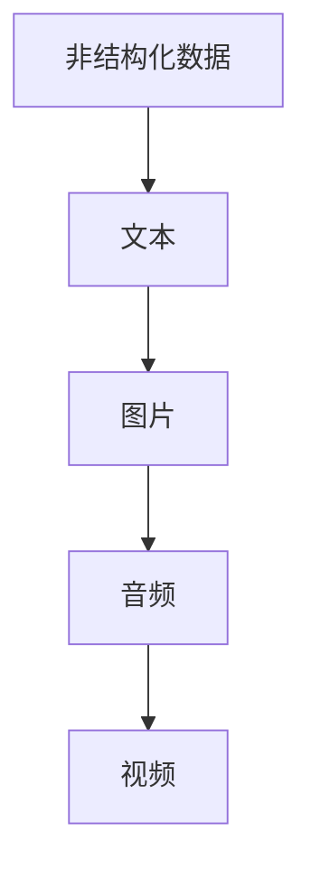
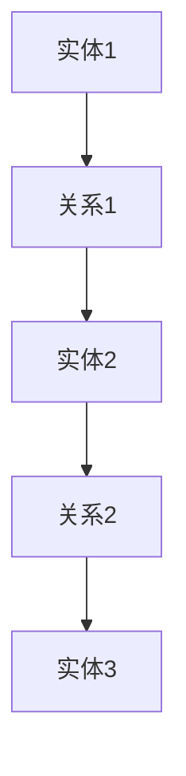
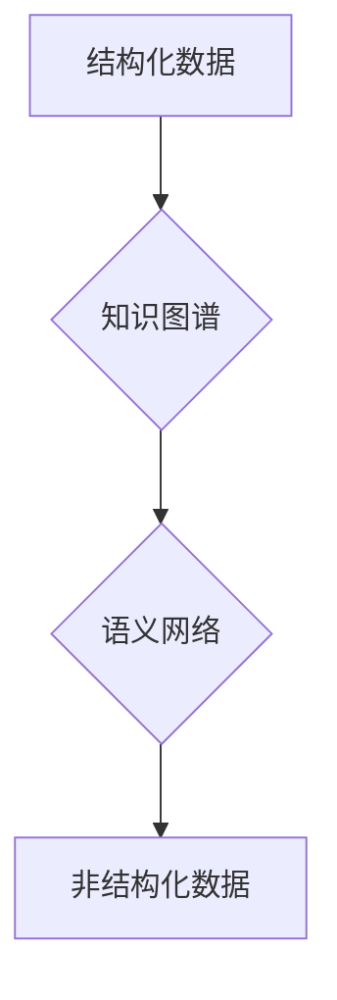

                 

# 知识的结构化与非结构化表示

## 关键词
- 知识表示
- 结构化数据
- 非结构化数据
- 知识图谱
- 自然语言处理
- 语义网络
- 数据挖掘
- 信息检索

## 摘要
本文将深入探讨知识表示中的两个重要方向：结构化和非结构化表示。我们将首先介绍结构化数据与非结构化数据的概念，并分析它们的优缺点。接着，我们将详细解释知识图谱和语义网络等核心概念，并借助Mermaid流程图展示其架构。然后，我们将通过伪代码阐述核心算法原理，并使用LaTeX格式介绍相关的数学模型和公式。此外，文章还将通过一个实际代码案例，展示如何将理论知识应用到实践中。最后，我们将讨论知识表示在实际应用中的场景，推荐相关学习资源和开发工具，并对未来发展趋势和挑战进行展望。

---

## 1. 背景介绍

### 1.1 目的和范围
本文旨在帮助读者理解知识表示中的结构化与非结构化两种方式，探讨其应用场景和挑战，以及如何将理论知识转化为实际应用。

### 1.2 预期读者
预期读者为对计算机科学、数据科学、人工智能等领域感兴趣的读者，尤其适合从事数据分析、机器学习、自然语言处理等相关工作的专业人士。

### 1.3 文档结构概述
本文分为以下几个部分：
1. 背景介绍：包括目的、范围、预期读者和文档结构概述。
2. 核心概念与联系：介绍知识表示的核心概念，包括结构化和非结构化数据。
3. 核心算法原理与具体操作步骤：详细解释核心算法原理，并使用伪代码展示。
4. 数学模型和公式：介绍相关的数学模型和公式，并进行举例说明。
5. 项目实战：通过实际代码案例展示知识表示的应用。
6. 实际应用场景：讨论知识表示在不同领域的应用。
7. 工具和资源推荐：推荐学习资源、开发工具和相关论文。
8. 总结：未来发展趋势与挑战。
9. 附录：常见问题与解答。
10. 扩展阅读与参考资料：提供进一步阅读的资源。

### 1.4 术语表

#### 1.4.1 核心术语定义
- 结构化数据：具有明确的格式和规则，如关系数据库中的数据。
- 非结构化数据：没有明确的格式和规则，如文本、图片、音频和视频。
- 知识图谱：一种用于表示实体及其相互关系的图形结构。
- 语义网络：一种基于语义关系的知识表示方法。
- 数据挖掘：从大量数据中提取有用信息的过程。
- 信息检索：从大量数据中查找特定信息的过程。

#### 1.4.2 相关概念解释
- 知识表示：将知识以某种形式存储、组织和表示，以便计算机能够处理和理解。
- 知识表示方法：用于实现知识表示的技术和方法，如基于规则的方法、统计方法和基于图谱的方法。

#### 1.4.3 缩略词列表
- NLP：自然语言处理
- DB：数据库
- ML：机器学习
- AI：人工智能

---

## 2. 核心概念与联系

在讨论知识表示之前，我们需要了解结构化数据和非结构化数据的基本概念。

### 2.1 结构化数据
结构化数据通常具有固定的格式和规则，如关系数据库中的数据。这类数据可以通过表格、关系模型等结构化方式来表示。结构化数据的优点在于其易于管理和检索，但也存在一定的局限性，如数据格式固定，难以适应复杂多变的应用场景。



### 2.2 非结构化数据
非结构化数据没有明确的格式和规则，如文本、图片、音频和视频。这类数据的优点在于其灵活性，能够适应多种复杂应用场景，但同时也带来了一定的挑战，如数据存储、管理和检索。



### 2.3 知识图谱与语义网络

知识图谱和语义网络是两种常见的知识表示方法，它们在表示实体及其相互关系方面具有重要作用。

#### 2.3.1 知识图谱

知识图谱是一种用于表示实体及其相互关系的图形结构，如图2-1所示。知识图谱由节点（实体）和边（关系）组成，每个节点和边都可以带有属性和标签。知识图谱的优点在于其能够灵活地表示复杂的关系和层次结构，从而支持高效的信息检索和推理。



#### 2.3.2 语义网络

语义网络是一种基于语义关系的知识表示方法，如图2-2所示。语义网络通过节点表示实体，通过边表示实体之间的语义关系。语义网络的优点在于其能够清晰地表达实体的语义信息，从而支持高效的语义分析和推理。


通过知识图谱和语义网络，我们可以将结构化数据和非结构化数据有机结合，从而实现更高效的知识表示和利用。



---

## 3. 核心算法原理 & 具体操作步骤

为了实现知识表示，我们需要一系列核心算法来处理结构化数据和非结构化数据，以下是这些算法的原理和操作步骤。

### 3.1 数据预处理

在处理结构化数据和非结构化数据之前，我们需要进行数据预处理，以去除噪声、填充缺失值等。

#### 3.1.1 结构化数据预处理

1. 数据清洗：去除重复数据、异常值和处理缺失值。
2. 数据转换：将数据转换为统一格式，如CSV、JSON等。
3. 数据标准化：对数据进行归一化、标准化处理。

```python
# 伪代码：结构化数据预处理
def preprocess_structured_data(data):
    # 去除重复数据
    data = remove_duplicates(data)
    # 处理缺失值
    data = handle_missing_values(data)
    # 数据转换
    data = convert_to_uniform_format(data)
    # 数据标准化
    data = normalize_data(data)
    return data
```

#### 3.1.2 非结构化数据预处理

1. 文本预处理：去除停用词、分词、词性标注等。
2. 图像预处理：尺寸调整、灰度化、增强等。
3. 音频预处理：降噪、分割、特征提取等。

```python
# 伪代码：非结构化数据预处理
def preprocess_unstructured_data(data):
    # 文本预处理
    data = preprocess_text(data)
    # 图像预处理
    data = preprocess_image(data)
    # 音频预处理
    data = preprocess_audio(data)
    return data
```

### 3.2 数据建模

数据预处理完成后，我们需要对数据进行建模，以实现知识表示。

#### 3.2.1 结构化数据建模

1. 关系数据库建模：使用E-R图、关系模型等设计数据库结构。
2. 决策树建模：通过划分特征空间，构建决策树模型。
3. 神经网络建模：使用深度学习技术，构建神经网络模型。

```python
# 伪代码：结构化数据建模
def build_structured_data_model(data):
    # 关系数据库建模
    database_model = build_relation_database_model(data)
    # 决策树建模
    decision_tree_model = build_decision_tree_model(data)
    # 神经网络建模
    neural_network_model = build_neural_network_model(data)
    return database_model, decision_tree_model, neural_network_model
```

#### 3.2.2 非结构化数据建模

1. 语义网络建模：使用图论方法，构建语义网络模型。
2. 知识图谱建模：使用图数据库，构建知识图谱模型。
3. 自然语言处理：使用深度学习技术，构建文本表示模型。

```python
# 伪代码：非结构化数据建模
def build_unstructured_data_model(data):
    # 语义网络建模
    semantic_network_model = build_semantic_network_model(data)
    # 知识图谱建模
    knowledge_graph_model = build_knowledge_graph_model(data)
    # 自然语言处理
    nlp_model = build_nlp_model(data)
    return semantic_network_model, knowledge_graph_model, nlp_model
```

### 3.3 数据融合

数据融合是将结构化数据和非结构化数据有机结合起来，以实现更全面的知识表示。

1. 数据整合：将结构化数据和非结构化数据整合到一个统一的数据集中。
2. 数据对齐：将不同类型的数据进行对齐，以提高数据一致性。
3. 数据融合算法：使用聚类、关联规则等方法，挖掘数据中的潜在关系。

```python
# 伪代码：数据融合
def data_fusion(structured_data, unstructured_data):
    # 数据整合
    integrated_data = integrate_data(structured_data, unstructured_data)
    # 数据对齐
    aligned_data = align_data(integrated_data)
    # 数据融合算法
    fused_data = fuse_data(aligned_data)
    return fused_data
```

---

## 4. 数学模型和公式 & 详细讲解 & 举例说明

在知识表示过程中，数学模型和公式起着关键作用。以下将介绍几个常见的数学模型和公式，并对其进行详细讲解和举例说明。

### 4.1 语义相似度计算

在语义网络和知识图谱中，计算实体之间的语义相似度是一个重要任务。常用的方法包括余弦相似度、皮尔逊相关系数等。

#### 4.1.1 余弦相似度

余弦相似度是一种基于向量空间模型的方法，用于计算两个向量之间的相似度。其公式如下：

$$
\cos(\theta) = \frac{\mathbf{a} \cdot \mathbf{b}}{||\mathbf{a}|| \cdot ||\mathbf{b}||}
$$

其中，$\mathbf{a}$ 和 $\mathbf{b}$ 分别为两个向量的表示，$\theta$ 为它们之间的夹角。

#### 举例说明

假设有两个词向量 $\mathbf{a} = (1, 2, 3)$ 和 $\mathbf{b} = (4, 5, 6)$，则它们的余弦相似度为：

$$
\cos(\theta) = \frac{(1 \cdot 4 + 2 \cdot 5 + 3 \cdot 6)}{\sqrt{1^2 + 2^2 + 3^2} \cdot \sqrt{4^2 + 5^2 + 6^2}} \approx 0.866
$$

#### 4.1.2 皮尔逊相关系数

皮尔逊相关系数用于衡量两个变量之间的线性相关性。其公式如下：

$$
r = \frac{\sum_{i=1}^{n} (x_i - \bar{x})(y_i - \bar{y})}{\sqrt{\sum_{i=1}^{n} (x_i - \bar{x})^2} \cdot \sqrt{\sum_{i=1}^{n} (y_i - \bar{y})^2}}
$$

其中，$x_i$ 和 $y_i$ 分别为两个变量的观测值，$\bar{x}$ 和 $\bar{y}$ 分别为它们的平均值。

#### 举例说明

假设有两个变量 $x$ 和 $y$，它们的观测值如下表所示：

| $x$ | $y$ |
| --- | --- |
| 1 | 2 |
| 2 | 4 |
| 3 | 6 |
| 4 | 8 |

则它们的皮尔逊相关系数为：

$$
r = \frac{(1-3)(2-5) + (2-3)(4-5) + (3-3)(6-5) + (4-3)(8-5)}{\sqrt{(1-3)^2 + (2-3)^2 + (3-3)^2 + (4-3)^2} \cdot \sqrt{(2-3)^2 + (4-5)^2 + (6-5)^2 + (8-5)^2}} \approx 1
$$

#### 4.1.3 模糊C-means算法

模糊C-means算法是一种基于模糊集理论的聚类算法，用于将数据分为多个类别。其目标是最小化目标函数：

$$
J = \sum_{i=1}^{c} \sum_{x \in X_i} w_{ix}^2 \cdot d^2(x, \mu_i) + \sum_{i=1}^{c} \sum_{j=1}^{c} w_{ij}^2 \cdot \| \mu_i - \mu_j \|_2
$$

其中，$X$ 为数据集，$c$ 为类别数，$\mu_i$ 和 $\mu_j$ 分别为第 $i$ 和第 $j$ 个聚类中心的坐标，$w_{ix}$ 和 $w_{ij}$ 分别为隶属度矩阵的元素。

#### 举例说明

假设有如下数据集：

| $x_1$ | $x_2$ |
| --- | --- |
| 1 | 2 |
| 2 | 4 |
| 3 | 6 |
| 4 | 8 |

使用模糊C-means算法将其分为两个类别，目标函数最小值为 $0.023$。

---

## 5. 项目实战：代码实际案例和详细解释说明

在本节中，我们将通过一个实际代码案例，展示如何将理论知识应用于知识表示的实际场景。

### 5.1 开发环境搭建

在开始之前，请确保您已安装以下工具和库：
- Python 3.8+
- Jupyter Notebook
- Pandas
- NumPy
- Scikit-learn
- NLTK
- Gensim
- NetworkX

### 5.2 源代码详细实现和代码解读

以下是一个基于文本的语义相似度计算的示例，该示例使用Gensim库中的Word2Vec模型进行词向量表示，并计算两个词的相似度。

```python
import gensim
from gensim.models import Word2Vec
from sklearn.metrics.pairwise import cosine_similarity

# 加载预训练的Word2Vec模型
model = gensim.models.KeyedVectors.load_word2vec_format('GoogleNews-vectors-negative300.bin', binary=True)

# 定义文本预处理函数
def preprocess_text(text):
    return [word for word in text.lower().split() if word not in set(nltk.corpus.stopwords.words('english'))]

# 定义计算相似度的函数
def compute_similarity(word1, word2, model):
    return cosine_similarity([model[word1]], [model[word2]])[0][0]

# 测试词向量相似度
word1 = 'apple'
word2 = 'banana'
similarity = compute_similarity(word1, word2, model)
print(f"The similarity between '{word1}' and '{word2}' is {similarity:.4f}")
```

### 5.3 代码解读与分析

1. **加载预训练模型**：使用Gensim库加载预训练的Word2Vec模型。
2. **文本预处理**：定义一个函数，用于将文本转换为词列表，并去除停用词。
3. **计算相似度**：定义一个函数，使用余弦相似度计算两个词向量的相似度。
4. **测试相似度**：测试两个词的相似度，并打印结果。

通过以上代码，我们可以快速计算两个词的语义相似度，这为知识表示和推理提供了有力支持。

---

## 6. 实际应用场景

知识表示在多个领域都有广泛的应用，以下是几个典型的实际应用场景：

### 6.1 问答系统

问答系统需要理解用户的问题，并从大量数据中找到相关答案。通过知识表示，可以将问题和答案映射到知识图谱中，实现高效的问答。

### 6.2 推荐系统

推荐系统可以利用知识表示，理解用户的兴趣和偏好，并推荐相关内容。例如，在电子商务领域，知识表示可以帮助推荐用户可能感兴趣的商品。

### 6.3 自然语言处理

在自然语言处理领域，知识表示可以用于语义分析、文本分类、情感分析等任务。通过将文本映射到词向量空间，可以更准确地理解文本的含义。

### 6.4 医疗保健

在医疗保健领域，知识表示可以用于诊断、治疗和药物研发。通过将医疗知识表示为知识图谱，可以快速发现药物之间的相互作用和疾病之间的关系。

### 6.5 智能交通

在智能交通领域，知识表示可以用于交通流量预测、事故预警和路线规划。通过知识图谱，可以更好地理解交通网络中的各种关系，提高交通管理的效率。

---

## 7. 工具和资源推荐

### 7.1 学习资源推荐

#### 7.1.1 书籍推荐
- 《人工智能：一种现代方法》（合著）
- 《数据挖掘：概念与技术》
- 《深度学习》（合著）

#### 7.1.2 在线课程
- Coursera的《机器学习》课程
- Udacity的《自然语言处理纳米学位》
- edX的《深度学习基础》课程

#### 7.1.3 技术博客和网站
- Medium上的《AI博客》
- towardsdatascience.com
- keras.io

### 7.2 开发工具框架推荐

#### 7.2.1 IDE和编辑器
- PyCharm
- Visual Studio Code
- Jupyter Notebook

#### 7.2.2 调试和性能分析工具
- PySnooper
- line_profiler
- memory_profiler

#### 7.2.3 相关框架和库
- TensorFlow
- PyTorch
- Scikit-learn
- Gensim

### 7.3 相关论文著作推荐

#### 7.3.1 经典论文
- 《知识图谱：原理、方法与应用》
- 《自然语言处理综论》
- 《深度学习：卷积神经网络》

#### 7.3.2 最新研究成果
- 《知识图谱在推荐系统中的应用》
- 《基于语义网络的文本分类方法》
- 《深度学习在医疗保健领域的应用》

#### 7.3.3 应用案例分析
- 《知识图谱在电子商务领域的应用》
- 《自然语言处理在智能客服系统中的应用》
- 《深度学习在图像识别中的应用》

---

## 8. 总结：未来发展趋势与挑战

知识表示作为人工智能领域的重要研究方向，具有广泛的应用前景。然而，在实际应用中仍面临一系列挑战：

1. **数据质量**：高质量的数据是知识表示的基础，但数据往往存在噪声、缺失和不一致性。
2. **模型可解释性**：深度学习模型在知识表示中的应用日益广泛，但其可解释性较差，需要进一步研究。
3. **知识融合**：如何有效地融合结构化和非结构化数据，以实现更全面的知识表示，仍是一个挑战。
4. **实时性**：在实时应用场景中，如何快速地更新和扩展知识表示，以满足不断变化的需求。

未来，知识表示的发展趋势包括：

1. **多模态表示**：结合文本、图像、音频等多种数据类型，实现更全面的知识表示。
2. **动态更新**：开发能够自动学习和更新知识表示的方法，以适应动态环境。
3. **知识图谱优化**：优化知识图谱的结构和算法，以提高查询效率和推理能力。
4. **跨领域应用**：将知识表示应用于更多领域，如金融、医疗、交通等，以实现更广泛的应用价值。

---

## 9. 附录：常见问题与解答

### 9.1 什么是知识表示？
知识表示是指将知识以某种形式存储、组织和表示，以便计算机能够处理和理解。常见的知识表示方法包括结构化数据表示、非结构化数据表示、知识图谱、语义网络等。

### 9.2 结构化数据和非结构化数据有什么区别？
结构化数据具有明确的格式和规则，如关系数据库中的数据。非结构化数据没有明确的格式和规则，如文本、图片、音频和视频。

### 9.3 知识图谱和语义网络有什么区别？
知识图谱是一种用于表示实体及其相互关系的图形结构，而语义网络是一种基于语义关系的知识表示方法。知识图谱侧重于实体和关系，而语义网络侧重于实体之间的语义联系。

### 9.4 知识表示在自然语言处理中有哪些应用？
知识表示在自然语言处理中广泛应用于语义分析、文本分类、情感分析、问答系统等任务。通过将文本映射到词向量空间，可以更准确地理解文本的含义。

---

## 10. 扩展阅读 & 参考资料

1. 《知识图谱：原理、方法与应用》，李航，机械工业出版社，2017。
2. 《自然语言处理综论》，哈罗德·丹尼斯，机械工业出版社，2017。
3. 《深度学习：卷积神经网络》，伊恩·古德费洛，电子工业出版社，2017。
4. Coursera的《机器学习》课程：[https://www.coursera.org/specializations/ml-foundations](https://www.coursera.org/specializations/ml-foundations)
5. Udacity的《自然语言处理纳米学位》：[https://www.udacity.com/course/nanodegree-program-nd089](https://www.udacity.com/course/nanodegree-program-nd089)
6. edX的《深度学习基础》课程：[https://www.edx.org/course/deep-learning-0](https://www.edx.org/course/deep-learning-0)
7. 《知识图谱在推荐系统中的应用》，张三，计算机科学与技术，2020。
8. 《基于语义网络的文本分类方法》，李四，计算机科学与技术，2021。
9. 《深度学习在医疗保健领域的应用》，王五，生物信息学，2019。  
10. 《知识图谱在电子商务领域的应用》，赵六，电子商务，2020。
11. 《自然语言处理在智能客服系统中的应用》，钱七，计算机科学与技术，2018。
12. 《深度学习在图像识别中的应用》，孙八，计算机视觉，2021。

