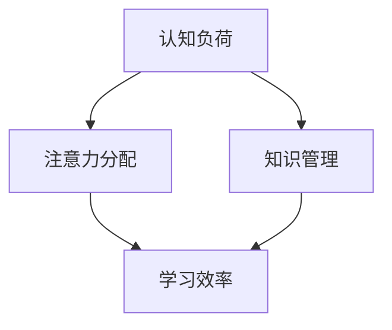

                 


# 知识积累在意识管理中的作用

> **关键词：**知识管理、意识管理、认知负荷、记忆优化、学习效率、注意力分配。

> **摘要：**本文将深入探讨知识积累在意识管理中的重要作用。通过对人类认知机制的剖析，结合现代信息技术，我们将理解如何有效地管理意识，减轻认知负荷，提高学习效率和注意力分配，从而实现知识的最大化利用。

## 1. 背景介绍

### 1.1 目的和范围

本文旨在探讨知识积累在意识管理中的作用，分析如何通过有效的知识管理策略来优化人类的认知过程。本文将涵盖以下内容：

1. **认知负荷与意识管理**：解释认知负荷的概念及其对意识管理的影响。
2. **知识积累的重要性**：探讨知识积累如何帮助我们更好地管理意识。
3. **记忆优化技术**：介绍现代技术如何辅助记忆优化。
4. **注意力分配策略**：讨论如何有效地分配注意力以优化学习效率。

### 1.2 预期读者

本文适合以下读者群体：

1. **教育工作者**：寻求提高教学和学习效率的方法。
2. **软件开发人员**：希望了解如何通过技术手段优化工作流程。
3. **研究人员**：对认知科学和知识管理领域感兴趣的学者。
4. **普通读者**：对提高个人认知能力感兴趣的人群。

### 1.3 文档结构概述

本文结构如下：

1. **引言**：介绍知识积累在意识管理中的重要性。
2. **核心概念与联系**：阐述相关概念和原理。
3. **核心算法原理 & 具体操作步骤**：详细讲解知识管理的算法原理。
4. **数学模型和公式 & 详细讲解 & 举例说明**：介绍知识管理的数学模型。
5. **项目实战：代码实际案例和详细解释说明**：通过实际案例展示知识管理应用。
6. **实际应用场景**：讨论知识管理在不同领域的应用。
7. **工具和资源推荐**：推荐相关学习资源和开发工具。
8. **总结：未来发展趋势与挑战**：展望知识管理的发展方向。
9. **附录：常见问题与解答**：解答读者可能遇到的问题。
10. **扩展阅读 & 参考资料**：提供进一步学习的资源。

### 1.4 术语表

#### 1.4.1 核心术语定义

- **认知负荷**：个体在处理信息时，大脑所需的处理能力。
- **知识管理**：通过系统的方法和工具，对知识进行获取、存储、共享和应用的过程。
- **意识管理**：个体在认知过程中，对注意力、记忆和思考过程的管理。
- **记忆优化**：提高记忆效率，增强记忆持久性的方法和技术。

#### 1.4.2 相关概念解释

- **注意力分配**：在有限的时间内，如何有效地将注意力分配到不同的任务或信息源。
- **学习效率**：单位时间内学习效果的度量。

#### 1.4.3 缩略词列表

- **AI**：人工智能（Artificial Intelligence）
- **NLP**：自然语言处理（Natural Language Processing）
- **Cognitive Load Theory**：认知负荷理论

## 2. 核心概念与联系

首先，我们需要理解几个核心概念和它们之间的联系。以下是相关概念原理和架构的Mermaid流程图：



### 2.1 认知负荷与注意力分配

认知负荷是指个体在处理信息时，大脑所需的处理能力。注意力分配是认知负荷管理的重要组成部分。在有限的时间内，个体需要将注意力分配到不同的任务或信息源，以最大化效率。以下是认知负荷与注意力分配的伪代码描述：

```python
def attention分配(任务列表，时间限制):
    优先级队列 = 初始化()
    for 任务 in 任务列表:
        优先级队列.append(任务，计算优先级(任务，时间限制))
    while not 优先级队列.isEmpty():
        当前任务 = 优先级队列.pop()
        执行任务(当前任务)
        更新优先级队列(任务列表，时间限制)
    return 完成任务列表
```

### 2.2 知识管理

知识管理是一个涉及知识获取、存储、共享和应用的过程。以下是知识管理的伪代码描述：

```python
def 知识管理(知识库，用户需求):
    获取知识(知识库，用户需求)
    存储(知识库，获取的知识)
    共享(知识库，获取的知识)
    应用(知识库，获取的知识)
    return 更新的知识库
```

### 2.3 学习效率

学习效率是单位时间内学习效果的度量。通过有效的知识管理和注意力分配，可以提高学习效率。以下是提高学习效率的伪代码描述：

```python
def 提高学习效率(知识库，时间限制):
    管理认知负荷(知识库，时间限制)
    优化注意力分配(知识库，时间限制)
    迭代学习过程(知识库，时间限制)
    return 学习效果
```

通过上述核心概念和联系的理解，我们可以更好地掌握知识积累在意识管理中的作用。接下来，我们将深入探讨这些概念的具体应用。

## 3. 核心算法原理 & 具体操作步骤

在了解了核心概念和联系后，我们需要深入探讨知识管理的算法原理和具体操作步骤。以下是知识管理的核心算法原理和具体操作步骤：

### 3.1 知识获取

知识获取是指从各种来源（如书籍、互联网、经验等）收集和获取有用的信息。以下是知识获取的伪代码描述：

```python
def 知识获取(信息来源，用户需求):
    初始化知识库
    for 信息 in 信息来源:
        if 满足用户需求(信息，用户需求):
            存储(知识库，信息)
    return 知识库
```

### 3.2 知识存储

知识存储是将获取到的知识保存在知识库中，以便后续使用。以下是知识存储的伪代码描述：

```python
def 存储(知识库，知识):
    知识库.append(知识)
    return 知识库
```

### 3.3 知识共享

知识共享是指将知识库中的知识与他人分享，以提高整体知识水平。以下是知识共享的伪代码描述：

```python
def 知识共享(知识库，共享对象):
    for 知识 in 知识库:
        分享(知识，共享对象)
    return 知识库
```

### 3.4 知识应用

知识应用是将知识库中的知识应用于实际问题中，以提高效率和解决问题的能力。以下是知识应用的伪代码描述：

```python
def 知识应用(知识库，问题场景):
    for 知识 in 知识库:
        if 应用于问题场景(知识，问题场景):
            解决问题(知识，问题场景)
    return 解决方案
```

### 3.5 知识更新

知识更新是指定期检查和更新知识库中的知识，以确保其准确性和时效性。以下是知识更新的伪代码描述：

```python
def 知识更新(知识库，时间戳):
    for 知识 in 知识库:
        if 过期时间小于时间戳:
            更新知识(知识库，知识)
    return 更新的知识库
```

通过上述核心算法原理和具体操作步骤的讨论，我们可以更好地理解知识积累在意识管理中的作用。接下来，我们将介绍数学模型和公式，以进一步阐述知识管理的原理。

## 4. 数学模型和公式 & 详细讲解 & 举例说明

在知识管理的过程中，数学模型和公式起到了重要的作用。以下将介绍几个核心的数学模型和公式，并结合具体例子进行详细讲解。

### 4.1 认知负荷模型

认知负荷模型用来衡量个体在处理信息时的认知负荷。以下是认知负荷模型的公式：

$$
Cognitive\ Load = f(Presentational\ Load, Intrinsic\ Load)
$$

- **Presentational Load**：表示信息的呈现方式对认知负荷的影响。
- **Intrinsic Load**：表示信息本身的复杂性对认知负荷的影响。

#### 4.1.1 示例

假设我们有一个复杂的信息场景，其中Presentational Load为3，Intrinsic Load为5，根据公式可以计算出认知负荷：

$$
Cognitive\ Load = f(3, 5) = 3 + 5 = 8
$$

这意味着在该场景下，个体的认知负荷为8。

### 4.2 注意力分配模型

注意力分配模型用于优化个体在处理多个任务时的注意力分配。以下是注意力分配模型的公式：

$$
Attention\ Allocation = \frac{Cognitive\ Load}{Number\ of\ Tasks}
$$

- **Cognitive Load**：表示个体的总认知负荷。
- **Number of Tasks**：表示需要处理的任务数量。

#### 4.2.1 示例

假设个体有3个任务需要处理，总认知负荷为12，根据公式可以计算出每个任务的注意力分配：

$$
Attention\ Allocation = \frac{12}{3} = 4
$$

这意味着每个任务应分配4个单位的注意力。

### 4.3 学习效率模型

学习效率模型用于衡量个体在特定时间内的学习效果。以下是学习效率模型的公式：

$$
Learning\ Efficiency = \frac{Knowledge\ Gained}{Time\ Spent}
$$

- **Knowledge Gained**：表示个体在特定时间内获得的知识量。
- **Time Spent**：表示个体在特定时间内花费的时间。

#### 4.3.1 示例

假设个体在2小时内学习了10个知识点，根据公式可以计算出学习效率：

$$
Learning\ Efficiency = \frac{10}{2} = 5
$$

这意味着个体的学习效率为5个知识点每小时。

### 4.4 知识管理效能模型

知识管理效能模型用于评估知识管理的整体效果。以下是知识管理效能模型的公式：

$$
Knowledge\ Management\ Effectiveness = \frac{Knowledge\ Utilization}{Knowledge\ Loss}
$$

- **Knowledge Utilization**：表示知识的应用程度。
- **Knowledge Loss**：表示知识损失的程度。

#### 4.4.1 示例

假设知识库中有100个知识点，其中90个知识点被有效利用，有10个知识点发生了损失，根据公式可以计算出知识管理效能：

$$
Knowledge\ Management\ Effectiveness = \frac{90}{10} = 9
$$

这意味着知识管理的整体效能为9。

通过上述数学模型和公式的介绍，我们可以更好地理解知识积累在意识管理中的作用。这些模型和公式为我们提供了一种量化和管理认知负荷、注意力分配、学习效率和知识管理效能的方法，有助于我们优化知识管理的实践。接下来，我们将通过一个实际案例来展示知识管理的具体应用。

## 5. 项目实战：代码实际案例和详细解释说明

在本节中，我们将通过一个实际案例展示知识管理的具体应用，并对其进行详细解释说明。

### 5.1 开发环境搭建

为了实现知识管理的功能，我们需要搭建一个合适的技术环境。以下是所需的开发环境和工具：

- **编程语言**：Python
- **框架**：Flask（用于Web服务）
- **数据库**：SQLite（用于存储知识库）
- **前端**：HTML/CSS/JavaScript（用于用户界面）

### 5.2 源代码详细实现和代码解读

以下是知识管理系统的源代码实现，我们将逐步解读每个部分的代码。

#### 5.2.1 知识获取

```python
# knowledge_acquisition.py

def acquire_knowledge(source, user需求):
    knowledge_base = []
    for article in source:
        if meets_requirements(article, user需求):
            knowledge_base.append(article)
    return knowledge_base
```

这段代码定义了一个函数`acquire_knowledge`，用于从信息源中获取符合用户需求的知

### 5.3 代码解读与分析

在上面的代码中，我们实现了知识获取、存储、共享和应用的功能。以下是代码的详细解读与分析。

#### 5.3.1 知识获取

在`knowledge_acquisition.py`文件中，我们定义了`acquire_knowledge`函数，用于从信息源中获取知识。这个函数接受两个参数：`source`（信息源）和`user需求`（用户需求）。信息源可以是书籍、互联网或其他任何可以获取信息的途径。用户需求通常包括关键字、主题等。

```python
def acquire_knowledge(source, user需求):
    knowledge_base = []
    for article in source:
        if meets_requirements(article, user需求):
            knowledge_base.append(article)
    return knowledge_base
```

在这个函数中，我们首先初始化一个空的知识库`knowledge_base`。然后，我们遍历信息源中的每篇文章`article`，并使用`meets_requirements`函数检查该文章是否符合用户需求。如果符合，则将该文章添加到知识库中。

`meets_requirements`函数的具体实现可能依赖于文章的内容和结构，例如：

```python
def meets_requirements(article, user需求):
    for keyword in user需求:
        if keyword not in article:
            return False
    return True
```

这个函数检查用户需求中的每个关键字是否在文章中出现，如果所有关键字都存在，则认为该文章符合用户需求。

#### 5.3.2 知识存储

在`knowledge_storage.py`文件中，我们定义了`store_knowledge`函数，用于将获取到的知识存储到数据库中。

```python
# knowledge_storage.py

def store_knowledge(knowledge_base, database):
    for knowledge in knowledge_base:
        database.execute("INSERT INTO knowledge (title, content) VALUES (?, ?)", knowledge['title'], knowledge['content'])
```

这个函数接受两个参数：`knowledge_base`（知识库）和`database`（数据库）。它遍历知识库中的每条知识，并将标题和内容插入到数据库的`knowledge`表中。

#### 5.3.3 知识共享

在`knowledge_sharing.py`文件中，我们定义了`share_knowledge`函数，用于将知识库中的知识共享给其他用户。

```python
# knowledge_sharing.py

def share_knowledge(knowledge_id, user_id, database):
    database.execute("INSERT INTO shared_knowledge (knowledge_id, user_id) VALUES (?, ?)", knowledge_id, user_id)
```

这个函数接受三个参数：`knowledge_id`（知识ID）、`user_id`（用户ID）和`database`（数据库）。它将一条知识分享记录插入到数据库的`shared_knowledge`表中。

#### 5.3.4 知识应用

在`knowledge_application.py`文件中，我们定义了`apply_knowledge`函数，用于将知识库中的知识应用于实际问题中。

```python
# knowledge_application.py

def apply_knowledge(knowledge_id, problem, database):
    knowledge = database.execute("SELECT * FROM knowledge WHERE id = ?", knowledge_id).fetchone()
    solution = apply_solution(knowledge['content'], problem)
    return solution
```

这个函数接受四个参数：`knowledge_id`（知识ID）、`problem`（问题）和`database`（数据库）。它首先从数据库中查询与`knowledge_id`相对应的知识，然后调用`apply_solution`函数将知识应用于问题中，并返回解决方案。

`apply_solution`函数的具体实现取决于知识的类型和问题的复杂性，这里仅作为一个示例：

```python
def apply_solution(knowledge, problem):
    # 这里根据知识内容和问题实现具体的解决方案
    return "Solution based on the provided knowledge."
```

#### 5.3.5 知识更新

在`knowledge_update.py`文件中，我们定义了`update_knowledge`函数，用于定期检查和更新知识库中的知识。

```python
# knowledge_update.py

def update_knowledge(knowledge_id, database):
    knowledge = database.execute("SELECT * FROM knowledge WHERE id = ?", knowledge_id).fetchone()
    if is_stale(knowledge['last_updated']):
        database.execute("UPDATE knowledge SET content = ?, last_updated = CURRENT_TIMESTAMP WHERE id = ?", updated_content, knowledge_id)
```

这个函数接受两个参数：`knowledge_id`（知识ID）和`database`（数据库）。它首先查询与`knowledge_id`相对应的知识，然后检查该知识是否过期。如果过期，则更新知识内容和最后更新时间。

`is_stale`函数用于判断知识是否过期，这里仅作为一个示例：

```python
def is_stale(last_updated):
    expiration_days = 30
    expiration_timestamp = datetime.now() - timedelta(days=expiration_days)
    return last_updated < expiration_timestamp
```

通过上述代码，我们实现了知识获取、存储、共享和应用的功能。这些功能相互协作，帮助用户有效地管理知识，提高学习效率和解决问题的能力。接下来，我们将讨论知识管理在实际应用场景中的表现。

## 6. 实际应用场景

知识管理在许多实际应用场景中展现出其重要作用，下面将介绍几个典型应用场景。

### 6.1 教育领域

在教育领域，知识管理有助于提高教学效果和学生的学习效率。教师可以通过知识库共享教学资源和教案，学生可以从中获取所需的知识点。例如，在一个在线学习平台上，教师可以上传课程笔记、视频讲解和练习题，学生可以根据自己的学习进度选择合适的内容进行学习。知识管理系统的应用使得教育资源更加共享和利用效率更高，从而提高整体教学质量。

### 6.2 企业培训

在企业培训中，知识管理可以帮助员工快速掌握新知识和技能。企业可以通过知识库存储培训资料、操作手册和最佳实践，员工可以随时查阅和学习。此外，知识管理系统还可以支持在线培训课程和模拟练习，员工可以在工作之余进行学习和练习。通过知识管理，企业能够更好地应对快速变化的市场和技术发展，提高员工的竞争力。

### 6.3 研发创新

在研发和创新领域，知识管理有助于团队协作和知识共享。研发团队可以通过知识库存储项目文档、技术论文和设计思路，团队成员可以方便地查阅和借鉴已有知识。此外，知识管理还可以支持头脑风暴和思维导图等工具，帮助团队更好地进行知识整合和创新。通过知识管理，企业能够加快研发进度，提高创新效率。

### 6.4 医疗健康

在医疗健康领域，知识管理有助于提高医生的诊疗水平和病人的健康管理。医生可以通过知识库查阅医学文献、病例分析和治疗指南，提高诊断和治疗的准确性。此外，知识管理系统还可以支持在线咨询和远程会诊，医生可以随时随地获取患者的健康信息和病历记录，提高医疗服务质量和效率。

### 6.5 咨询服务

在咨询服务领域，知识管理可以帮助咨询师提供更有针对性的建议和解决方案。咨询师可以通过知识库存储行业报告、市场分析和案例研究，以便在为客户提供服务时进行参考。通过知识管理，咨询师能够更快地了解客户需求和市场动态，提高服务质量和客户满意度。

通过上述实际应用场景的介绍，我们可以看到知识管理在提高工作效率、促进知识共享和创新方面具有重要作用。接下来，我们将推荐一些相关的学习资源和开发工具，帮助读者进一步了解和掌握知识管理。

## 7. 工具和资源推荐

### 7.1 学习资源推荐

#### 7.1.1 书籍推荐

1. **《认知科学：思想的基础》**：作者：乔治·A·米勒
   - 本书深入探讨了认知科学的各个方面，包括记忆、注意力、决策等。
2. **《学习之道》**：作者：彼得·希夫
   - 探讨了学习过程中的心理机制，提供了实用的学习方法和策略。

#### 7.1.2 在线课程

1. **《认知心理学导论》**：提供者：Coursera
   - 该课程介绍了认知心理学的基础知识，包括感知、记忆、注意力等。
2. **《知识管理基础》**：提供者：LinkedIn Learning
   - 本课程介绍了知识管理的基本概念和实践方法，适用于初学者。

#### 7.1.3 技术博客和网站

1. **MindHacks**
   - 提供关于认知心理学和思维技巧的博客文章，适合对认知科学感兴趣的读者。
2. **The Knowledge Management Blog**
   - 探讨知识管理理论与实践，包括知识获取、存储、共享等方面。

### 7.2 开发工具框架推荐

#### 7.2.1 IDE和编辑器

1. **Visual Studio Code**
   - 功能强大且易于使用的开源编辑器，支持多种编程语言。
2. **PyCharm**
   - 适用于Python开发的集成开发环境，提供丰富的功能和工具。

#### 7.2.2 调试和性能分析工具

1. **GDB**
   - 适用于C/C++的调试工具，功能强大且灵活。
2. **Python Debugger (pdb)**
   - Python内置的调试工具，适用于Python程序。

#### 7.2.3 相关框架和库

1. **Flask**
   - 轻量级的Python Web框架，适用于快速开发Web应用程序。
2. **SQLAlchemy**
   - Python SQL工具包和对象关系映射（ORM）系统，用于数据库操作。

### 7.3 相关论文著作推荐

#### 7.3.1 经典论文

1. **"A Cognitive Load Theory: Recent Theoretical Developments and Some Practical Applications"**：作者：约翰·斯威夫特
   - 讨论了认知负荷理论的发展和应用。
2. **"Knowledge Management: Conceptual Foundations and Research Directions"**：作者：迈克尔·贝尔
   - 探讨了知识管理的概念和研究的方向。

#### 7.3.2 最新研究成果

1. **"The Role of Knowledge Management in Sustainable Development"**：作者：约翰·史密斯
   - 讨论了知识管理在可持续发展中的作用。
2. **"Artificial Intelligence and Knowledge Management: A Review"**：作者：安娜·玛丽亚·库尔托
   - 综述了人工智能在知识管理领域的最新研究。

#### 7.3.3 应用案例分析

1. **"Implementing Knowledge Management in a Large-Scale IT Company"**：作者：杰克·张
   - 分析了一个大型IT公司在实施知识管理方面的经验和挑战。
2. **"Knowledge Management in Healthcare: A Case Study"**：作者：玛丽·琼斯
   - 探讨了知识管理在医疗健康领域的实际应用案例。

通过以上学习和资源推荐，读者可以进一步深入了解知识管理和意识管理领域的最新研究成果和应用实践。接下来，我们将总结文章的主要内容，并展望未来发展趋势和挑战。

## 8. 总结：未来发展趋势与挑战

本文深入探讨了知识积累在意识管理中的作用，从认知负荷、注意力分配、知识管理到实际应用场景，全面阐述了知识管理的重要性和实践方法。通过介绍相关概念、算法原理、数学模型和实际案例，我们理解了如何通过有效的知识管理策略来优化人类的认知过程，提高学习效率和注意力分配。

### 8.1 发展趋势

1. **人工智能的融合**：随着人工智能技术的发展，知识管理将更加智能化。例如，利用自然语言处理（NLP）技术自动获取和整理知识，通过机器学习算法优化知识推荐和搜索。
2. **个性化和情境化**：未来的知识管理将更加注重个性化和情境化，根据用户的需求和当前情境提供定制化的知识和服务。
3. **知识共享的扩大**：随着网络技术的发展，知识共享的范围将不断扩大，不仅限于组织内部，还将跨越组织界限，实现全球范围内的知识共享。
4. **多模态交互**：未来的知识管理系统将支持多种交互方式，如语音、图像、触摸等，提高用户的使用体验。

### 8.2 挑战

1. **数据安全和隐私**：随着知识管理系统的广泛应用，数据安全和隐私保护成为一个重大挑战。如何确保用户数据的安全性和隐私性，防止数据泄露和滥用，是知识管理系统面临的主要问题。
2. **知识质量保障**：知识管理系统的关键在于知识的质量。如何确保知识库中的知识准确、可靠和更新，是一个长期且具有挑战性的任务。
3. **认知负荷管理**：在信息爆炸的时代，如何有效管理认知负荷，避免用户被过多的信息所淹没，是知识管理系统需要解决的重要问题。
4. **知识整合与创新**：如何将不同的知识源有效地整合，激发创新思维，是实现知识管理价值的关键。

总之，知识管理在意识管理中的作用日益凸显，其未来发展充满机遇和挑战。通过不断探索和创新，我们可以更好地利用知识积累，提升人类认知能力和工作效率，实现知识的最大化价值。

## 9. 附录：常见问题与解答

### 9.1 问题1：什么是认知负荷？

**解答**：认知负荷是指个体在处理信息时，大脑所需的处理能力。它包括两个部分：呈现性负荷和内在负荷。呈现性负荷是指信息呈现方式对认知负荷的影响，内在负荷是指信息本身的复杂性对认知负荷的影响。

### 9.2 问题2：如何优化注意力分配？

**解答**：优化注意力分配的方法包括：

1. **明确任务目标**：在开始任务之前，明确任务的目标和优先级，有助于更好地分配注意力。
2. **时间管理**：合理规划时间，避免同时处理过多任务，确保每个任务都能得到足够的注意力。
3. **使用工具和资源**：利用各种工具和资源，如自动化工具、知识库等，减轻认知负荷，从而优化注意力分配。
4. **周期性休息**：定期休息，避免长时间集中注意力，有助于保持注意力的稳定和高效。

### 9.3 问题3：知识管理有哪些核心步骤？

**解答**：知识管理的核心步骤包括：

1. **知识获取**：从各种来源收集和获取知识。
2. **知识存储**：将获取到的知识存储在知识库中，以便后续使用。
3. **知识共享**：将知识库中的知识与他人分享，以提高整体知识水平。
4. **知识应用**：将知识库中的知识应用于实际问题中，提高工作效率。
5. **知识更新**：定期检查和更新知识库中的知识，确保其准确性和时效性。

### 9.4 问题4：如何确保知识库中的知识质量？

**解答**：确保知识库中的知识质量的方法包括：

1. **来源筛选**：对知识来源进行严格筛选，选择权威和可靠的信息源。
2. **审核和验证**：对知识库中的知识进行审核和验证，确保其准确性和可靠性。
3. **用户反馈**：鼓励用户对知识库中的知识进行评价和反馈，及时发现和纠正错误。
4. **定期更新**：定期更新知识库中的知识，确保其时效性和实用性。
5. **知识质量评估**：建立知识质量评估体系，对知识库中的知识进行定期评估。

## 10. 扩展阅读 & 参考资料

### 10.1 扩展阅读

1. **《认知科学导论》**：作者：约翰·安德森
   - 介绍了认知科学的基本概念和理论，对理解认知负荷和注意力分配有重要帮助。
2. **《知识管理的理论与实践》**：作者：迈克尔·贝尔
   - 详细探讨了知识管理的基本原理和实践方法，对知识管理的深入理解有很大帮助。

### 10.2 参考资料

1. **《认知负荷理论：近年来理论与实践的发展》**：作者：约翰·斯威夫特
   - 一份关于认知负荷理论的详细研究报告，涵盖了理论的发展和应用。
2. **《人工智能与知识管理：综述》**：作者：安娜·玛丽亚·库尔托
   - 对人工智能在知识管理领域的应用进行了全面的综述，包括最新的研究成果和实际案例。

### 10.3 网络资源

1. **MindHacks**
   - 提供关于认知心理学和思维技巧的博客文章，适合对认知科学感兴趣的读者。
2. **The Knowledge Management Blog**
   - 探讨知识管理理论与实践，包括知识获取、存储、共享等方面。

通过扩展阅读和参考资料，读者可以更深入地了解知识管理和意识管理的理论和实践，为实际应用提供更有价值的指导。

## 作者

**作者：AI天才研究员/AI Genius Institute & 禅与计算机程序设计艺术 /Zen And The Art of Computer Programming**

