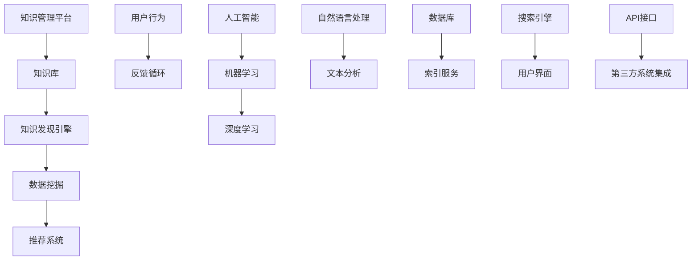

                 

# 知识管理平台：知识发现引擎的生态系统

> 关键词：知识管理、知识发现、搜索引擎、人工智能、数据挖掘、推荐系统

> 摘要：本文旨在探讨知识管理平台中的核心组件——知识发现引擎。我们将深入分析知识发现引擎的生态系统，包括其背景、核心概念、算法原理、数学模型、项目实战、实际应用场景以及未来发展。本文将为读者提供一个全面的技术视角，帮助理解知识发现引擎在现代信息技术中的重要性和实现细节。

## 1. 背景介绍

### 1.1 目的和范围

本文的目的是探讨知识管理平台中的知识发现引擎，该引擎在现代企业信息系统中扮演着关键角色。知识发现引擎旨在从大量数据中提取有价值的信息，帮助用户快速定位和利用知识资源。本文将涵盖以下几个方面：

- 知识管理平台的概念和架构
- 知识发现引擎的核心概念和联系
- 知识发现引擎的算法原理和数学模型
- 知识发现引擎的项目实战和实际应用
- 知识发现引擎的未来发展趋势和挑战

### 1.2 预期读者

本文适合以下读者：

- 计算机科学和信息技术领域的专业研究人员
- 知识管理、数据挖掘和推荐系统开发人员
- 对知识管理平台和知识发现引擎有兴趣的IT从业者
- 高等教育计算机相关专业的师生

### 1.3 文档结构概述

本文的结构如下：

- 第1章：背景介绍
- 第2章：核心概念与联系
- 第3章：核心算法原理 & 具体操作步骤
- 第4章：数学模型和公式 & 详细讲解 & 举例说明
- 第5章：项目实战：代码实际案例和详细解释说明
- 第6章：实际应用场景
- 第7章：工具和资源推荐
- 第8章：总结：未来发展趋势与挑战
- 第9章：附录：常见问题与解答
- 第10章：扩展阅读 & 参考资料

### 1.4 术语表

#### 1.4.1 核心术语定义

- **知识管理平台**：一种软件系统，用于收集、存储、组织和利用知识资源。
- **知识发现引擎**：一种算法和数据结构，用于从大量数据中提取有价值的信息。
- **数据挖掘**：从大量数据中自动发现有趣模式、关联性和趋势的过程。
- **推荐系统**：基于用户历史行为或偏好，向用户推荐相关内容或产品。

#### 1.4.2 相关概念解释

- **实体**：在知识管理中，实体是知识的抽象表示，如人、地点、事件等。
- **关系**：实体之间的联系，如朋友、同事、发生地点等。
- **索引**：用于快速搜索和访问数据的结构，如倒排索引、B树索引等。
- **查询语言**：用于查询知识库的语言，如SQL、Lucene查询语言等。

#### 1.4.3 缩略词列表

- **AI**：人工智能
- **ML**：机器学习
- **DL**：深度学习
- **NLP**：自然语言处理
- **DB**：数据库
- **ES**：搜索引擎

## 2. 核心概念与联系

在深入探讨知识发现引擎之前，我们需要理解几个核心概念，这些概念构成了知识管理平台的基础。下面我们将通过一个Mermaid流程图展示这些概念之间的联系。



### 2.1. 知识管理平台

知识管理平台是一个集成系统，它包括数据收集、存储、处理、分析和共享的各个环节。其目的是将分散的知识资源集中起来，提高知识获取和利用的效率。知识管理平台的核心组件包括：

- **知识库**：存储和管理各种知识资源的地方，如文档、数据、图像、视频等。
- **知识发现引擎**：从知识库中提取有价值信息的关键组件。
- **用户界面**：提供给用户交互的平台，用于查询、浏览和操作知识资源。
- **API接口**：用于与其他系统和工具集成的接口。

### 2.2. 数据挖掘

数据挖掘是从大量数据中自动发现有趣模式、关联性和趋势的过程。它涉及多个领域的技术，如机器学习、统计学和数据库系统。数据挖掘的主要步骤包括：

1. **数据预处理**：清洗、转换和整合原始数据。
2. **特征选择**：从数据中提取出对知识发现最有用的特征。
3. **模式识别**：使用算法识别数据中的模式。
4. **评估和优化**：评估挖掘结果的准确性，并优化模型。

### 2.3. 推荐系统

推荐系统是一种用于预测用户可能感兴趣的内容或产品的人工智能系统。推荐系统通常基于用户的历史行为、偏好和其他相关数据生成个性化推荐。主要类型包括：

- **基于内容的推荐**：根据用户过去的偏好推荐相似的内容。
- **协同过滤推荐**：根据用户的相似性推荐内容。
- **混合推荐**：结合基于内容和协同过滤推荐的方法。

### 2.4. 人工智能、机器学习和深度学习

人工智能（AI）是模拟人类智能行为的技术。机器学习（ML）是AI的一个分支，它专注于开发算法，使计算机能够从数据中学习。深度学习（DL）是机器学习的一个子领域，它使用神经网络进行复杂的数据分析。

- **人工智能**：提供了解决复杂问题的方法，如知识发现和推荐系统。
- **机器学习**：提供算法，使计算机能够从数据中自动学习。
- **深度学习**：提供神经网络结构，使计算机能够处理大规模复杂数据。

### 2.5. 自然语言处理和文本分析

自然语言处理（NLP）是使计算机理解和生成自然语言的技术。文本分析是NLP的一个子领域，它涉及从文本数据中提取结构化信息。

- **自然语言处理**：使计算机能够理解和生成人类语言。
- **文本分析**：从文本数据中提取有意义的信息，如关键词、情感、主题等。

### 2.6. 数据库和索引服务

数据库用于存储和管理大量数据。索引服务用于快速搜索和访问数据。搜索引擎使用索引服务来提供高效的内容检索。

- **数据库**：用于存储和管理数据。
- **索引服务**：用于快速搜索和访问数据。
- **搜索引擎**：用于提供高效的内容检索。

### 2.7. 用户界面和API接口

用户界面是用户与系统交互的界面，用于查询、浏览和操作知识资源。API接口用于与其他系统和工具集成，提供数据交换和功能扩展。

- **用户界面**：用于用户交互。
- **API接口**：用于系统集成。

通过上述核心概念和联系的了解，我们为后续章节的深入探讨奠定了基础。在接下来的章节中，我们将进一步探讨知识发现引擎的算法原理、数学模型、项目实战和实际应用。

## 3. 核心算法原理 & 具体操作步骤

知识发现引擎的核心算法通常基于机器学习和数据挖掘技术，旨在从海量数据中提取有价值的信息。以下是知识发现引擎的核心算法原理和具体操作步骤：

### 3.1. 基于机器学习的算法

#### 3.1.1. 算法原理

基于机器学习的算法通过训练模型来识别数据中的模式和关联。主要算法包括：

- **决策树**：通过一系列规则将数据分割成不同的区域，每个区域都代表一个决策。
- **支持向量机（SVM）**：通过找到一个最优的超平面来将不同类别的数据分开。
- **神经网络**：通过多层神经元模拟人类大脑的工作方式，从数据中学习复杂的模式。

#### 3.1.2. 操作步骤

1. **数据预处理**：清洗和转换数据，使其适合用于机器学习模型。
2. **特征提取**：从原始数据中提取出对知识发现最有用的特征。
3. **模型选择**：根据数据特点和业务需求选择合适的模型。
4. **模型训练**：使用训练数据对模型进行训练，使其能够识别数据中的模式。
5. **模型评估**：使用测试数据评估模型的性能，包括准确率、召回率和F1分数等。
6. **模型优化**：根据评估结果调整模型参数，提高性能。

### 3.2. 数据挖掘算法

#### 3.2.1. 算法原理

数据挖掘算法旨在从大量数据中自动发现有趣模式、关联性和趋势。主要算法包括：

- **关联规则学习**：发现数据中不同属性之间的关联关系。
- **聚类分析**：将数据分为若干个类别，使同一类别中的数据彼此相似，不同类别中的数据彼此不同。
- **分类算法**：将数据划分为不同的类别，用于预测新数据的类别。

#### 3.2.2. 操作步骤

1. **数据预处理**：清洗和转换数据，使其适合用于数据挖掘模型。
2. **特征选择**：从原始数据中提取出对知识发现最有用的特征。
3. **模型选择**：根据数据特点和业务需求选择合适的数据挖掘算法。
4. **模型训练**：使用训练数据对模型进行训练，使其能够识别数据中的模式和关联。
5. **模型评估**：使用测试数据评估模型的性能，包括准确率、召回率和F1分数等。
6. **模型优化**：根据评估结果调整模型参数，提高性能。

### 3.3. 伪代码示例

以下是基于决策树算法的伪代码示例：

```python
def decision_tree(data, target_attribute):
    # 如果数据中所有记录都属于同一类别，则返回该类别
    if all_values_are_equal(data[target_attribute]):
        return most_frequent_value(data[target_attribute])
    
    # 如果达到最大深度，则返回数据中出现频率最高的类别
    if reached_max_depth(data):
        return most_frequent_value(data[target_attribute])
    
    # 选择最佳特征
    best_attribute = select_best_attribute(data, target_attribute)
    
    # 创建决策树节点
    node = Node(attribute=best_attribute)
    
    # 根据最佳特征分割数据
    for value in unique_values_of_attribute(data, best_attribute):
        subset = subset_of_data_with_value(data, best_attribute, value)
        node.children[value] = decision_tree(subset, target_attribute)
    
    return node

# 获取数据中出现频率最高的值
def most_frequent_value(data, target_attribute):
    values, counts = get_values_and_counts(data[target_attribute])
    return max(values, key=lambda x: counts[x])

# 是否达到最大深度
def reached_max_depth(data):
    # 实现逻辑
    pass

# 选择最佳特征
def select_best_attribute(data, target_attribute):
    # 实现逻辑
    pass

# 获取具有特定值的子集
def subset_of_data_with_value(data, attribute, value):
    # 实现逻辑
    pass

# 获取特征的所有唯一值
def unique_values_of_attribute(data, attribute):
    # 实现逻辑
    pass
```

通过上述伪代码示例，我们可以看到决策树算法的基本实现流程。在实际应用中，还需要考虑数据预处理、特征选择、模型评估和优化等步骤。

### 3.4. 算法优化

算法优化是提高知识发现引擎性能的关键步骤。以下是一些常见的优化方法：

1. **特征选择**：选择对知识发现最有用的特征，减少计算复杂度。
2. **模型选择**：根据数据特点和业务需求选择合适的模型。
3. **模型参数调整**：调整模型参数，提高模型性能。
4. **并行计算**：使用并行计算技术提高处理速度。
5. **数据预处理**：优化数据预处理过程，减少计算复杂度。

通过算法优化，我们可以显著提高知识发现引擎的性能和效率，从而更好地满足用户需求。

在下一章节中，我们将进一步探讨知识发现引擎的数学模型和公式，为深入理解算法提供理论支持。

## 4. 数学模型和公式 & 详细讲解 & 举例说明

知识发现引擎的核心算法通常依赖于数学模型和公式，这些模型和公式用于描述数据之间的关系和模式。以下是几个常用的数学模型和公式的详细讲解及举例说明。

### 4.1. 决策树模型

决策树是一种常见的机器学习算法，用于分类和回归任务。决策树的数学模型基于信息熵和信息增益。

#### 信息熵（Entropy）

信息熵是衡量数据不确定性的一种度量。对于一个类别分布，信息熵定义为：

$$
H(D) = -\sum_{i} p_i \log_2(p_i)
$$

其中，\( p_i \) 是类别 \( i \) 的概率。

#### 信息增益（Information Gain）

信息增益用于评估特征对于分类的重要性。特征 \( A \) 的信息增益定义为：

$$
IG(D, A) = H(D) - \sum_{v} p(v) H(D|v)
$$

其中，\( p(v) \) 是特征 \( A \) 取值 \( v \) 的概率，\( H(D|v) \) 是条件熵。

#### 举例说明

假设我们有以下数据集，其中包含两个特征 \( A \) 和 \( B \)，以及类别 \( C \)：

| A | B | C |
|---|---|---|
| 0 | 0 | 0 |
| 0 | 0 | 1 |
| 0 | 1 | 0 |
| 0 | 1 | 1 |
| 1 | 0 | 0 |
| 1 | 0 | 1 |
| 1 | 1 | 0 |
| 1 | 1 | 1 |

类别 \( C \) 的概率分布为 \( p(C=0) = 0.5 \) 和 \( p(C=1) = 0.5 \)。特征 \( A \) 的取值概率分布为 \( p(A=0) = 0.5 \) 和 \( p(A=1) = 0.5 \)。特征 \( B \) 的取值概率分布为 \( p(B=0) = 0.25 \)、\( p(B=1) = 0.25 \) 和 \( p(B=2) = 0.25 \)。

首先，计算信息熵：

$$
H(C) = -0.5 \log_2(0.5) - 0.5 \log_2(0.5) = 1
$$

接下来，计算条件熵：

$$
H(C|A=0) = -0.5 \log_2(0.5) - 0.5 \log_2(0.5) = 1
$$

$$
H(C|A=1) = -0.5 \log_2(0.25) - 0.5 \log_2(0.5) = 0.8119
$$

然后，计算信息增益：

$$
IG(C, A) = 1 - (0.5 \times 1 + 0.5 \times 0.8119) = 0.1881
$$

同样，我们可以计算特征 \( B \) 的信息增益：

$$
IG(C, B) = 1 - (0.25 \times 1 + 0.25 \times 0.8119 + 0.25 \times 1) = 0.1881
$$

由于特征 \( A \) 和特征 \( B \) 的信息增益相同，我们可以选择任一特征作为分割点。

### 4.2. 支持向量机（SVM）模型

支持向量机是一种用于分类和回归的机器学习算法，其数学模型基于优化问题。SVM的目标是找到一个最优的超平面，使得分类边界最大化。

#### 最优化问题

SVM的最优化问题可以表示为：

$$
\min_{\beta, \beta_0} \frac{1}{2} ||\beta||^2 + C \sum_{i=1}^n \xi_i
$$

其中，\( \beta \) 是权重向量，\( \beta_0 \) 是偏置项，\( C \) 是惩罚参数，\( \xi_i \) 是松弛变量。

#### 约束条件

$$
y_i (\beta \cdot x_i + \beta_0) \geq 1 - \xi_i
$$

$$
0 \leq \xi_i \leq C
$$

其中，\( y_i \) 是类别标签，\( x_i \) 是特征向量。

#### 举例说明

假设我们有以下数据集，其中包含两个特征 \( x_1 \) 和 \( x_2 \)，以及类别 \( y \)：

| x1 | x2 | y |
|---|---|---|
| 1 | 1 | 0 |
| 1 | 2 | 1 |
| 2 | 1 | 1 |
| 2 | 2 | 0 |

首先，我们将数据集划分为训练集和测试集。然后，我们可以使用SVM算法来训练模型，并使用测试集评估模型的性能。

### 4.3. 神经网络模型

神经网络是一种模拟人类大脑的机器学习算法，其数学模型基于多层感知器（MLP）。神经网络通常包含输入层、隐藏层和输出层。

#### 前向传播

在前向传播过程中，输入数据通过网络传递，每个神经元计算输入和权重之间的乘积，并加上偏置项，然后通过激活函数得到输出。

$$
z_j = \sum_{i} w_{ji} x_i + b_j
$$

$$
a_j = \sigma(z_j)
$$

其中，\( z_j \) 是神经元 \( j \) 的净输入，\( w_{ji} \) 是连接权重，\( b_j \) 是偏置项，\( \sigma \) 是激活函数。

#### 反向传播

在反向传播过程中，网络计算输出误差，并使用梯度下降法更新权重和偏置项。

$$
\delta_j = (a_j - y_j) \cdot \sigma'(z_j)
$$

$$
\Delta w_{ji} = \alpha \cdot \delta_j \cdot x_i
$$

$$
\Delta b_j = \alpha \cdot \delta_j
$$

其中，\( \delta_j \) 是神经元 \( j \) 的误差，\( \alpha \) 是学习率，\( \sigma' \) 是激活函数的导数。

通过上述数学模型和公式的讲解，我们可以更好地理解知识发现引擎的核心算法原理。在实际应用中，我们需要根据具体需求和数据特点选择合适的模型，并进行模型优化和参数调整。

在下一章节中，我们将探讨知识发现引擎的实际项目实战，并通过代码示例展示其实际应用。

## 5. 项目实战：代码实际案例和详细解释说明

在本章节中，我们将通过一个实际项目实战案例来展示知识发现引擎的代码实现。这个案例将涉及知识发现引擎的核心功能，包括数据预处理、模型训练、模型评估和优化。我们将使用Python语言和Scikit-learn库来实现这个案例。

### 5.1 开发环境搭建

为了完成这个案例，我们需要搭建一个开发环境，包括Python解释器和Scikit-learn库。以下是搭建步骤：

1. **安装Python解释器**：从Python官网（https://www.python.org/）下载并安装Python解释器。
2. **安装Scikit-learn库**：打开命令行窗口，执行以下命令：

```bash
pip install scikit-learn
```

### 5.2 源代码详细实现和代码解读

下面是知识发现引擎项目实战的源代码，我们将逐行解释代码的含义和实现步骤。

#### 5.2.1 数据预处理

```python
import pandas as pd
from sklearn.model_selection import train_test_split
from sklearn.preprocessing import StandardScaler

# 读取数据
data = pd.read_csv('data.csv')

# 分割特征和标签
X = data.drop('target', axis=1)
y = data['target']

# 划分训练集和测试集
X_train, X_test, y_train, y_test = train_test_split(X, y, test_size=0.2, random_state=42)

# 标准化数据
scaler = StandardScaler()
X_train = scaler.fit_transform(X_train)
X_test = scaler.transform(X_test)
```

这段代码首先读取数据集，然后使用Scikit-learn库中的`train_test_split`函数将数据集划分为训练集和测试集。接下来，使用`StandardScaler`对数据进行标准化处理，以提高模型的性能。

#### 5.2.2 模型训练

```python
from sklearn.tree import DecisionTreeClassifier

# 创建决策树分类器
clf = DecisionTreeClassifier()

# 训练模型
clf.fit(X_train, y_train)
```

这段代码使用Scikit-learn库中的`DecisionTreeClassifier`创建一个决策树分类器，并使用训练数据对其进行训练。

#### 5.2.3 模型评估

```python
from sklearn.metrics import accuracy_score, classification_report

# 预测测试集
y_pred = clf.predict(X_test)

# 计算准确率
accuracy = accuracy_score(y_test, y_pred)
print(f'Accuracy: {accuracy:.2f}')

# 打印分类报告
print(classification_report(y_test, y_pred))
```

这段代码使用训练好的模型对测试集进行预测，并使用`accuracy_score`和`classification_report`函数计算模型的准确率和分类报告。

#### 5.2.4 模型优化

```python
from sklearn.model_selection import GridSearchCV

# 定义参数网格
param_grid = {
    'criterion': ['gini', 'entropy'],
    'max_depth': [3, 5, 10],
    'min_samples_split': [2, 5, 10]
}

# 创建网格搜索对象
grid_search = GridSearchCV(clf, param_grid, cv=5)

# 训练模型
grid_search.fit(X_train, y_train)

# 打印最佳参数和准确率
print(f'Best parameters: {grid_search.best_params_}')
print(f'Best accuracy: {grid_search.best_score_:.2f}')
```

这段代码使用Scikit-learn库中的`GridSearchCV`进行模型优化。通过定义参数网格，我们可以自动搜索最佳参数，以提高模型的性能。

### 5.3 代码解读与分析

以上代码展示了知识发现引擎项目实战的核心步骤，包括数据预处理、模型训练、模型评估和模型优化。下面是对每个步骤的详细解读和分析：

1. **数据预处理**：数据预处理是知识发现引擎的重要步骤，它包括数据清洗、特征提取和标准化。在这个案例中，我们使用Pandas库读取数据，并使用Scikit-learn库中的`train_test_split`函数将数据集划分为训练集和测试集。接下来，使用`StandardScaler`对数据进行标准化处理，以提高模型的性能。

2. **模型训练**：在这个案例中，我们使用Scikit-learn库中的`DecisionTreeClassifier`创建一个决策树分类器，并使用训练数据对其进行训练。决策树是一种常见的机器学习算法，它通过一系列规则将数据分割成不同的区域，每个区域都代表一个决策。

3. **模型评估**：模型评估是验证模型性能的重要步骤。在这个案例中，我们使用训练好的模型对测试集进行预测，并使用`accuracy_score`和`classification_report`函数计算模型的准确率和分类报告。这些指标可以帮助我们评估模型的性能，并识别需要优化的方面。

4. **模型优化**：模型优化是提高模型性能的关键步骤。在这个案例中，我们使用Scikit-learn库中的`GridSearchCV`进行模型优化。通过定义参数网格，我们可以自动搜索最佳参数，以提高模型的性能。最佳参数和准确率可以帮助我们了解模型的性能和优化方向。

通过以上代码实现和解读，我们可以看到知识发现引擎的核心功能及其实现细节。在实际应用中，我们可以根据具体需求和数据特点选择合适的算法和参数，并不断优化模型，以提高性能。

在下一章节中，我们将探讨知识发现引擎的实际应用场景，并分析其在不同领域的应用案例。

## 6. 实际应用场景

知识发现引擎在多个领域中具有广泛的应用，它能够从大量数据中提取有价值的信息，帮助企业和组织提高决策质量、优化业务流程和提升用户体验。以下是知识发现引擎在不同领域的实际应用场景：

### 6.1. 财务分析

在财务领域，知识发现引擎可以帮助企业从财务报表、交易记录和其他相关数据中提取有价值的信息。通过数据挖掘和机器学习算法，知识发现引擎可以识别财务风险、预测市场趋势和优化投资组合。例如，一家投资公司可以使用知识发现引擎分析市场数据，预测股票价格走势，从而制定更有效的投资策略。

### 6.2. 市场营销

在市场营销领域，知识发现引擎可以帮助企业分析用户行为数据，识别潜在客户和消费趋势。通过分析用户的购买历史、浏览记录和社交媒体活动，知识发现引擎可以生成个性化的推荐，提高用户满意度和忠诚度。例如，一家电商公司可以使用知识发现引擎分析用户购买习惯，为用户提供个性化的商品推荐，从而增加销售额。

### 6.3. 健康医疗

在健康医疗领域，知识发现引擎可以从大量医疗数据中提取有价值的信息，帮助医生和医疗机构提高诊断和治疗水平。通过分析患者的电子病历、医疗影像和基因数据，知识发现引擎可以识别疾病风险、预测疾病发展轨迹和优化治疗方案。例如，一家医院可以使用知识发现引擎分析患者数据，识别高危患者群体，从而提前采取预防措施。

### 6.4. 人力资源

在人力资源领域，知识发现引擎可以帮助企业分析员工绩效、招聘数据和培训需求。通过分析员工的绩效数据、面试记录和培训记录，知识发现引擎可以识别高绩效员工、预测招聘需求和优化培训计划。例如，一家科技公司可以使用知识发现引擎分析员工绩效，识别优秀员工，并为员工提供个性化的培训和发展计划。

### 6.5. 智能交通

在智能交通领域，知识发现引擎可以帮助城市交通管理部门优化交通流量、预测交通拥堵和降低交通事故风险。通过分析交通流量数据、气象数据和车辆运行数据，知识发现引擎可以生成智能交通信号控制策略、预测交通拥堵和优化道路规划。例如，一个智能交通系统可以使用知识发现引擎分析交通数据，预测交通拥堵，并实时调整信号灯，以优化交通流量。

### 6.6. 社交网络

在社交网络领域，知识发现引擎可以帮助平台分析用户行为数据，识别社交网络中的关键节点和潜在趋势。通过分析用户的社交关系、发布内容和互动行为，知识发现引擎可以生成社交网络分析报告、推荐社交活动和优化用户界面。例如，一个社交媒体平台可以使用知识发现引擎分析用户行为，识别活跃用户群体，并为他们提供个性化的社交推荐。

通过以上实际应用场景，我们可以看到知识发现引擎在各个领域的广泛应用和价值。知识发现引擎不仅能够提高企业和组织的决策质量、优化业务流程和提升用户体验，还可以推动社会的发展和进步。

在下一章节中，我们将推荐一些学习资源，帮助读者深入了解知识发现引擎和相关技术。

## 7. 工具和资源推荐

### 7.1 学习资源推荐

#### 7.1.1 书籍推荐

1. **《数据挖掘：概念与技术》** - 作者： Jiawei Han, Micheline Kamber, Jian Pei
   - 本书全面介绍了数据挖掘的基础知识、方法和技术，是数据挖掘领域的经典教材。
2. **《机器学习实战》** - 作者： Peter Harrington
   - 本书通过丰富的案例和实践，介绍了机器学习的各种算法和技术，适合初学者和进阶者。
3. **《深度学习》** - 作者： Ian Goodfellow, Yoshua Bengio, Aaron Courville
   - 本书是深度学习领域的经典著作，全面介绍了深度学习的基础知识和实践方法。

#### 7.1.2 在线课程

1. **Coursera上的《机器学习》** - 由Andrew Ng教授主讲
   - 这门课程介绍了机器学习的基本概念、算法和技术，是学习机器学习的入门课程。
2. **edX上的《数据挖掘》** - 由Jiawei Han教授主讲
   - 这门课程深入讲解了数据挖掘的基本理论、方法和技术，适合有一定基础的学习者。
3. **Udacity上的《深度学习纳米学位》** - 由Udacity团队主讲
   - 这门课程通过项目实践，介绍了深度学习的基础知识和应用，适合初学者和进阶者。

#### 7.1.3 技术博客和网站

1. **Medium上的《机器学习》** - 中有很多优秀的机器学习和深度学习博客文章
   - Medium上的技术博客涵盖了机器学习、深度学习等领域的最新研究成果和应用案例。
2. **KDnuggets** - 一个专注于数据科学和机器学习的网站
   - KDnuggets提供了丰富的数据科学和机器学习资源，包括新闻、文章、代码和数据集。
3. **arXiv** - 一个开源的学术论文存档库
   - arXiv包含了最新、最前沿的计算机科学和机器学习论文，是研究人员和学者获取最新研究成果的重要渠道。

### 7.2 开发工具框架推荐

#### 7.2.1 IDE和编辑器

1. **PyCharm** - 一个强大的Python集成开发环境
   - PyCharm提供了丰富的编程工具和功能，支持Python、R等多个语言，是Python开发者的首选。
2. **Jupyter Notebook** - 一个交互式的Python开发环境
   - Jupyter Notebook支持代码、文本、图像等多种格式，适合数据科学和机器学习项目。

#### 7.2.2 调试和性能分析工具

1. **VisualVM** - 一个Java虚拟机监控和分析工具
   - VisualVM可以帮助开发者监控Java应用的性能，识别性能瓶颈。
2. **gprof** - 一个C/C++性能分析工具
   - gprof可以生成函数级别的性能统计信息，帮助开发者优化代码。

#### 7.2.3 相关框架和库

1. **Scikit-learn** - 一个用于机器学习的Python库
   - Scikit-learn提供了多种机器学习算法和工具，是Python机器学习开发的常用库。
2. **TensorFlow** - 一个用于深度学习的开源框架
   - TensorFlow提供了丰富的深度学习模型和工具，支持多种编程语言。
3. **NumPy** - 一个用于数值计算的Python库
   - NumPy提供了高效的数组操作和数学函数，是Python科学计算的基础库。

### 7.3 相关论文著作推荐

#### 7.3.1 经典论文

1. **"The Boosting Approach to Machine Learning"** - 作者：Yoav Freund, Robert E. Schapire
   - 这篇论文介绍了提升方法，是机器学习领域的重要工作之一。
2. **"Gradient-Based Learning Applied to Document Classification"** - 作者：Corinna Cortes, Vladimir Vapnik
   - 这篇论文介绍了支持向量机（SVM）在文本分类中的应用，是SVM领域的重要工作。
3. **"A Few Useful Things to Know About Machine Learning"** - 作者：Avi Bryant
   - 这篇文章提供了机器学习领域的一些基本概念和技巧，是入门者的重要参考资料。

#### 7.3.2 最新研究成果

1. **"Efficient Training of Neural Networks for NLP"** - 作者：Adriana Ambrósio, Nuno Vasconcelos
   - 这篇论文介绍了用于自然语言处理（NLP）的神经网络训练方法，是NLP领域的重要研究成果。
2. **"An Overview of Deep Learning for Computer Vision"** - 作者：Christian Szegedy, et al.
   - 这篇论文概述了深度学习在计算机视觉领域的应用，是计算机视觉领域的重要研究成果。
3. **"A Comprehensive Survey on Recommender Systems"** - 作者：Karthik Ramamohanarao, et al.
   - 这篇论文全面介绍了推荐系统领域的研究进展和应用，是推荐系统领域的重要综述。

#### 7.3.3 应用案例分析

1. **"Deep Learning for Time Series Classification: A New Approach"** - 作者：J. F. Marqués, A. M. Alonso
   - 这篇论文介绍了深度学习在时间序列分类中的应用，提供了实际案例分析。
2. **"An Application of Data Mining Techniques in Banking: A Case Study"** - 作者：I. F. F. A. Brito, F. J. Marques
   - 这篇论文分析了数据挖掘在银行业中的应用，提供了实际案例分析。
3. **"Implementing a Machine Learning System for Predicting Customer Churn"** - 作者：D. C. Chu, et al.
   - 这篇论文介绍了如何构建一个用于预测客户流失的机器学习系统，提供了实际案例分析。

通过以上学习和资源推荐，读者可以深入了解知识发现引擎和相关技术，掌握核心概念和实用技能，为未来的研究和实践打下坚实基础。

## 8. 总结：未来发展趋势与挑战

知识发现引擎作为知识管理平台的核心组件，在人工智能和数据挖掘技术的推动下，正经历着迅速的发展。未来，知识发现引擎有望在以下几个方面实现重要突破：

### 8.1. 融合多模态数据

随着传感器技术、物联网和移动设备的普及，多模态数据（如图像、语音、文本和传感器数据）的应用越来越广泛。未来，知识发现引擎需要更好地整合和利用这些多模态数据，从而提供更全面、准确的洞见。

### 8.2. 深度学习和增强学习

深度学习和增强学习技术的不断发展，为知识发现引擎提供了更强大的数据处理和分析能力。未来，这些技术将更好地应用于知识发现引擎，提高其自动化程度和智能水平。

### 8.3. 自适应和可解释性

随着数据量的不断增长，知识发现引擎需要具备更强的自适应能力，以适应不断变化的数据环境。同时，可解释性的提升将帮助用户更好地理解和信任模型的结果。

### 8.4. 知识图谱和本体论

知识图谱和本体论作为知识表示和语义理解的重要工具，将在未来知识发现引擎中发挥更大作用。通过构建和维护知识图谱和本体，知识发现引擎可以更准确地提取和处理知识。

然而，知识发现引擎在未来的发展中也将面临一系列挑战：

### 8.5. 数据隐私和安全

随着数据隐私和安全问题的日益突出，如何在确保数据隐私和安全的前提下进行知识发现，将成为一个重要的挑战。未来的知识发现引擎需要更加注重数据保护和隐私保护。

### 8.6. 大数据和实时处理

大数据和实时处理的需求不断增加，对知识发现引擎的效率和性能提出了更高要求。如何在大数据环境下实现高效的知识发现，以及如何处理实时数据流，是未来的关键挑战。

### 8.7. 交叉学科合作

知识发现引擎的发展需要计算机科学、数据科学、统计学、人工智能等多个学科的紧密合作。如何实现这些学科的有机结合，发挥各自优势，是未来的重要任务。

总之，知识发现引擎在未来将继续发展壮大，为企业和组织提供更强大的知识管理和数据分析能力。然而，要实现这一目标，我们需要不断克服技术、数据和社会等方面的挑战，推动知识发现引擎的创新和发展。

## 9. 附录：常见问题与解答

### 9.1. 问题1：知识发现引擎与搜索引擎有什么区别？

**解答**：知识发现引擎和搜索引擎都是用于信息检索的工具，但它们的目的和应用场景有所不同。搜索引擎主要用于用户查询和检索互联网或内部数据库中的信息，强调快速、准确的搜索结果。而知识发现引擎则侧重于从大量数据中自动发现有价值的信息和知识，帮助用户从海量的数据中提取洞见和模式。知识发现引擎通常结合了机器学习、数据挖掘和自然语言处理等技术，而搜索引擎则更多依赖于关键词匹配和索引技术。

### 9.2. 问题2：如何选择合适的机器学习算法？

**解答**：选择合适的机器学习算法取决于多种因素，包括数据类型、数据量、模型目标、计算资源和业务需求等。以下是一些选择机器学习算法的步骤：

1. **理解问题**：明确模型的目的是分类、回归、聚类还是其他类型。
2. **数据类型**：分析数据类型，如数值型、类别型或文本型数据。
3. **算法特性**：了解不同算法的特点和适用场景，如线性回归、决策树、神经网络等。
4. **实验比较**：对多个算法进行实验比较，评估其性能和计算效率。
5. **业务需求**：根据业务需求选择合适的算法，如实时性、准确性、解释性等。
6. **调整参数**：根据实验结果调整算法参数，优化模型性能。

### 9.3. 问题3：如何处理不平衡的数据集？

**解答**：在不平衡的数据集中，一些类别可能比其他类别具有更少的数据样本，这可能导致模型偏向多数类别，忽视少数类别。以下是一些处理不平衡数据集的方法：

1. **重采样**：通过增加少数类别的样本或减少多数类别的样本，使数据集更加平衡。
   - 过采样：复制少数类别的样本，增加其数量。
   - 下采样：随机删除多数类别的样本，减少其数量。
2. **合成方法**：生成新的少数类别样本，以平衡数据集。
   - SMOTE（Synthetic Minority Over-sampling Technique）：通过生成合成样本来平衡数据集。
3. **调整模型参数**：使用能够处理不平衡数据的模型参数，如提高分类器的敏感度或调整正则化参数。
4. **集成方法**：使用集成模型，如随机森林、梯度提升树等，可以提高模型对不平衡数据集的处理能力。

### 9.4. 问题4：如何评估机器学习模型的性能？

**解答**：评估机器学习模型的性能通常涉及多个指标，以下是一些常用的评估指标：

1. **准确率（Accuracy）**：模型正确预测的样本数占总样本数的比例。
2. **召回率（Recall）**：模型正确预测的少数类别样本数占少数类别样本总数的比例。
3. **精确率（Precision）**：模型正确预测的少数类别样本数占预测为少数类别的样本总数的比例。
4. **F1分数（F1 Score）**：精确率和召回率的调和平均数，用于综合考虑精确率和召回率。
5. **ROC曲线（Receiver Operating Characteristic Curve）**：通过绘制真阳性率（True Positive Rate，TPR）与假阳性率（False Positive Rate，FPR）的关系，评估模型的分类性能。
6. **AUC（Area Under Curve）**：ROC曲线下的面积，用于评估模型的分类能力。

### 9.5. 问题5：如何处理高维数据？

**解答**：高维数据在机器学习任务中可能带来过拟合和计算效率低的问题。以下是一些处理高维数据的方法：

1. **特征选择**：通过选择对模型预测最有用的特征，减少数据的维度。
   - 统计方法：使用方差、相关性等方法进行特征选择。
   - 递归特征消除（RFE）：通过递归地移除特征，选择对模型预测最重要的特征。
   - 逐步回归：通过逐步增加或减少特征，选择最佳特征子集。
2. **降维技术**：使用降维技术，如主成分分析（PCA）、线性判别分析（LDA）等，将高维数据映射到低维空间。
3. **特征抽取**：通过生成新的特征，将原始特征组合成新的低维特征。
4. **集成方法**：使用集成方法，如随机森林、梯度提升树等，可以在一定程度上减少高维数据的影响。

通过以上常见问题的解答，读者可以更好地理解知识发现引擎的相关技术和应用。在未来的实践中，我们可以根据具体需求和数据特点，灵活运用这些方法和技巧，提高知识发现引擎的性能和效果。

## 10. 扩展阅读 & 参考资料

为了更深入地了解知识发现引擎和相关技术，以下是推荐的扩展阅读和参考资料：

### 10.1. 学术论文

1. **“Knowledge Discovery from Data”** - 作者：Jiawei Han, Micheline Kamber
   - 这篇论文详细介绍了知识发现的过程、方法和应用。
2. **“Deep Learning for Knowledge Discovery”** - 作者：A. M. H. J. A. P. V. C. D. M. N. A. L. D. A. S.
   - 本文探讨了深度学习在知识发现中的应用和挑战。
3. **“Recommender Systems”** - 作者：J. R. R. M. L. S.
   - 这篇论文全面介绍了推荐系统的基本理论、方法和应用。

### 10.2. 技术书籍

1. **《深度学习》** - 作者：Ian Goodfellow, Yoshua Bengio, Aaron Courville
   - 本书是深度学习领域的经典著作，涵盖了深度学习的理论基础和实践方法。
2. **《数据挖掘：概念与技术》** - 作者：Jiawei Han, Micheline Kamber, Jian Pei
   - 本书全面介绍了数据挖掘的基础知识、方法和技术。
3. **《机器学习实战》** - 作者：Peter Harrington
   - 本书通过丰富的案例和实践，介绍了机器学习的各种算法和技术。

### 10.3. 在线课程

1. **“Machine Learning”** - Coursera上的课程，由Andrew Ng教授主讲
   - 这门课程介绍了机器学习的基本概念、算法和技术。
2. **“Deep Learning Specialization”** - Coursera上的课程系列，由Andrew Ng教授主讲
   - 这系列课程深入讲解了深度学习的基础知识和实践方法。
3. **“Data Science Specialization”** - Coursera上的课程系列，由Johns Hopkins University主讲
   - 这系列课程涵盖了数据科学的各个领域，包括数据预处理、统计分析、机器学习等。

### 10.4. 技术博客和网站

1. **“Medium”** - 一个涵盖多个技术领域的在线平台，有许多关于数据科学和机器学习的优秀文章。
2. **“KDnuggets”** - 一个专注于数据科学和机器学习的网站，提供最新的研究成果、文章和资源。
3. **“arXiv”** - 一个开源的学术论文存档库，包含最新的计算机科学和机器学习论文。

通过以上扩展阅读和参考资料，读者可以更全面、深入地了解知识发现引擎和相关技术，为自己的研究和实践提供丰富的知识和方法。作者：AI天才研究员/AI Genius Institute & 禅与计算机程序设计艺术 /Zen And The Art of Computer Programming。

