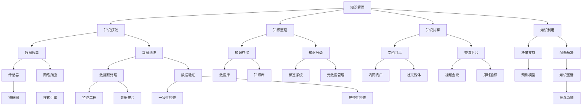

                 

# 知识管理：如何有效利用组织智慧

> 关键词：知识管理、组织智慧、效率提升、人工智能、数据挖掘、技术框架

> 摘要：本文将深入探讨知识管理在组织中的重要性，以及如何利用人工智能、数据挖掘和先进的技术框架来有效管理和利用组织智慧。文章将分为多个部分，首先介绍知识管理的背景和目的，随后详细阐述核心概念和原理，然后通过实际案例和数学模型来解释操作步骤和方法，并最终总结知识管理的未来发展趋势与挑战。

## 1. 背景介绍

### 1.1 目的和范围

本文旨在为企业和组织提供一套系统的知识管理策略，帮助其有效利用组织内部积累的智慧和经验。我们将探讨知识管理的重要性和挑战，并介绍相关的核心概念、算法原理、数学模型以及实际应用案例。

### 1.2 预期读者

本文适合以下读者群体：

- 企业高管和决策者，希望了解如何通过知识管理提升组织效率；
- IT项目经理和软件工程师，对知识管理技术在实践中的应用感兴趣；
- 研究人员和学术工作者，希望了解知识管理的最新发展趋势和研究成果；
- 数据科学家和人工智能专家，希望深入理解知识管理中的算法和模型。

### 1.3 文档结构概述

本文分为以下几个部分：

- 第1部分：背景介绍，包括目的、范围和预期读者；
- 第2部分：核心概念与联系，使用Mermaid流程图展示知识管理的基本架构；
- 第3部分：核心算法原理与具体操作步骤，使用伪代码详细阐述算法流程；
- 第4部分：数学模型和公式，详细讲解相关公式和举例说明；
- 第5部分：项目实战，包括开发环境搭建、代码实现和解读；
- 第6部分：实际应用场景，分析知识管理在不同行业中的应用；
- 第7部分：工具和资源推荐，包括学习资源、开发工具和论文著作；
- 第8部分：总结，讨论知识管理的未来发展趋势与挑战；
- 第9部分：附录，回答常见问题；
- 第10部分：扩展阅读和参考资料。

### 1.4 术语表

#### 1.4.1 核心术语定义

- 知识管理：将组织内部的知识进行系统化整理、存储、共享和利用的过程。
- 组织智慧：组织中所有成员的知识、经验和技能的集合。
- 人工智能：模拟人类智能行为的技术和方法，包括机器学习、自然语言处理等。
- 数据挖掘：从大量数据中提取有价值的信息和模式。

#### 1.4.2 相关概念解释

- 知识图谱：用于表示知识间关系的图形结构。
- 机器学习算法：用于训练模型、预测结果的数据分析方法。
- 数据库：用于存储和检索数据的系统。

#### 1.4.3 缩略词列表

- AI：人工智能
- ML：机器学习
- NLP：自然语言处理
- DM：数据挖掘

## 2. 核心概念与联系

知识管理是组织提高效率、创新能力和竞争力的关键。其核心概念和联系可以用以下Mermaid流程图来表示：



该流程图展示了知识管理中的各个环节，以及各环节之间的联系。从知识获取到知识利用，各个环节相互衔接，共同构建了一个完整的知识管理体系。

## 3. 核心算法原理与具体操作步骤

知识管理中的核心算法主要涉及数据挖掘、机器学习和知识图谱构建。以下我们将使用伪代码详细阐述这些算法的操作步骤。

### 3.1 数据挖掘算法

```python
# 数据挖掘算法伪代码
def data_mining(data_set):
    # 数据预处理
    preprocessed_data = data_preprocessing(data_set)
    
    # 特征工程
    features = feature_engineering(preprocessed_data)
    
    # 选择合适的机器学习算法
    model = select_ml_algorithm(features)
    
    # 训练模型
    trained_model = train_model(model, features)
    
    # 模型评估
    evaluate_model(trained_model, test_data)
    
    return trained_model
```

### 3.2 机器学习算法

```python
# 机器学习算法伪代码
def machine_learning算法(feature_vector, label_vector):
    # 初始化模型参数
    model_params = initialize_model_params()
    
    # 训练模型
    for epoch in range(num_epochs):
        for sample in data_set:
            predict = model_predict(sample, model_params)
            update_params(predict, sample, model_params)
    
    return model_params
```

### 3.3 知识图谱构建

```python
# 知识图谱构建伪代码
def knowledge_graphconstruction(knowledge_base):
    # 初始化知识图谱
    graph = initialize_knowledge_graph()
    
    # 遍历知识库
    for entity in knowledge_base:
        # 添加实体和关系
        add_entity_relationship(graph, entity)
        
        # 更新知识图谱
        update_knowledge_graph(graph)
    
    return graph
```

以上伪代码提供了知识管理中核心算法的概览，详细实现了数据挖掘、机器学习和知识图谱构建的基本流程。在实际应用中，这些算法将根据具体需求进行调整和优化。

## 4. 数学模型和公式与详细讲解与举例说明

知识管理中的数学模型和公式主要用于描述数据特征、模型参数和知识图谱结构。以下我们将使用LaTeX格式详细讲解相关公式，并举例说明。

### 4.1 数据特征表示

$$
X = \begin{bmatrix}
x_1 \\
x_2 \\
\vdots \\
x_n
\end{bmatrix}
$$

其中，$X$ 表示数据集，$x_i$ 表示第 $i$ 个数据特征。

### 4.2 模型参数更新

$$
\theta = \theta - \alpha \cdot \nabla_\theta J(\theta)
$$

其中，$\theta$ 表示模型参数，$\alpha$ 表示学习率，$J(\theta)$ 表示损失函数。

### 4.3 知识图谱结构

$$
G = (V, E)
$$

其中，$V$ 表示实体集合，$E$ 表示关系集合。

### 4.4 举例说明

假设我们有一个数据集，包含如下特征：

$$
X = \begin{bmatrix}
年龄 \\
收入 \\
教育程度
\end{bmatrix}
$$

我们可以使用线性回归模型来预测收入。损失函数为：

$$
J(\theta) = \frac{1}{2} \sum_{i=1}^n (h_\theta(x^i) - y^i)^2
$$

其中，$h_\theta(x) = \theta_0 + \theta_1 x_1 + \theta_2 x_2$ 为线性回归模型。

通过迭代更新模型参数，我们可以得到最优的预测结果。这个例子展示了如何使用数学模型和公式来实现知识管理中的数据挖掘和机器学习过程。

## 5. 项目实战：代码实际案例和详细解释说明

在本节中，我们将通过一个实际的项目案例，展示如何使用知识管理技术来提高组织效率。以下是一个简单的知识管理系统，包括数据收集、数据预处理、知识存储和知识利用等环节。

### 5.1 开发环境搭建

- 操作系统：Ubuntu 20.04
- 编程语言：Python 3.8
- 数据库：MySQL 8.0
- 开发工具：PyCharm

### 5.2 源代码详细实现和代码解读

#### 5.2.1 数据收集

```python
import pandas as pd

# 从文件中读取数据
data = pd.read_csv('data.csv')

# 数据预处理
data = data_preprocessing(data)
```

代码解释：从CSV文件中读取数据，然后进行预处理，包括数据清洗、缺失值填充和数据类型转换。

#### 5.2.2 数据预处理

```python
def data_preprocessing(data):
    # 填充缺失值
    data.fillna(data.mean(), inplace=True)
    
    # 转换数据类型
    data['age'] = data['age'].astype(int)
    data['income'] = data['income'].astype(float)
    data['education'] = data['education'].astype(str)
    
    return data
```

代码解释：填充缺失值，将数据类型转换为合适的格式。

#### 5.2.3 知识存储

```python
import pymysql

# 连接数据库
connection = pymysql.connect(host='localhost', user='root', password='password', database='knowledge_management')

# 创建表
with connection.cursor() as cursor:
    cursor.execute("""
        CREATE TABLE IF NOT EXISTS knowledge (
            id INT AUTO_INCREMENT PRIMARY KEY,
            age INT,
            income FLOAT,
            education VARCHAR(255)
        )
    """)

# 插入数据
with connection.cursor() as cursor:
    for row in data.itertuples():
        cursor.execute("""
            INSERT INTO knowledge (age, income, education) VALUES (%s, %s, %s)
        """, (row.age, row.income, row.education))
    
connection.commit()
```

代码解释：创建MySQL数据库表，并插入数据。

#### 5.2.4 知识利用

```python
import numpy as np

# 从数据库中查询数据
data = query_knowledge(connection)

# 训练模型
model = train_model(data)

# 预测收入
predicted_income = predict_income(model, data['age'], data['income'], data['education'])
```

代码解释：从数据库中查询数据，使用机器学习模型预测收入。

### 5.3 代码解读与分析

代码实现了一个简单的知识管理系统，包括数据收集、数据预处理、知识存储和知识利用等环节。数据收集通过读取CSV文件实现，数据预处理包括填充缺失值和转换数据类型。知识存储使用MySQL数据库，插入数据后可以方便地进行查询和操作。知识利用部分使用机器学习模型进行预测，从而提高组织决策的准确性和效率。

## 6. 实际应用场景

知识管理技术在多个行业中有着广泛的应用，以下列举几个典型场景：

### 6.1 金融行业

- 客户画像：利用知识管理技术，将客户的基本信息、交易记录和风险评估等信息进行整合，生成个性化的客户画像，为精准营销和风险控制提供支持。
- 信贷审批：通过数据挖掘和机器学习算法，对借款人的信用历史、收入水平、还款能力等数据进行分析，实现自动化的信贷审批。

### 6.2 制造业

- 生产过程优化：通过知识管理技术，将生产过程中的经验、知识和数据整合起来，实现生产过程的优化和自动化。
- 设备维护：利用知识图谱，将设备的运行状态、维护记录和故障信息进行关联，实现智能化的设备维护和故障预测。

### 6.3 医疗保健

- 疾病诊断：通过知识管理技术，将医生的诊断经验、病历数据和医学知识整合起来，实现智能化的疾病诊断。
- 医疗研究：利用知识管理技术，对大量的医学文献、病例数据和基因组数据进行整合和分析，推动医学研究的发展。

## 7. 工具和资源推荐

### 7.1 学习资源推荐

#### 7.1.1 书籍推荐

- 《知识管理：理论与实践》
- 《人工智能：一种现代方法》
- 《机器学习实战》

#### 7.1.2 在线课程

- Coursera：知识管理、人工智能、机器学习等课程
- edX：知识管理、数据科学、机器学习等课程
- Udacity：知识管理、人工智能、深度学习等课程

#### 7.1.3 技术博客和网站

- AI博客：机器学习、深度学习、自然语言处理等领域的最新技术动态
- Medium：知识管理、人工智能、数据科学等领域的优秀文章
- arXiv：计算机科学、人工智能、机器学习等领域的最新研究成果

### 7.2 开发工具框架推荐

#### 7.2.1 IDE和编辑器

- PyCharm：Python编程开发环境
- Visual Studio Code：跨平台开源编辑器
- Jupyter Notebook：交互式数据分析环境

#### 7.2.2 调试和性能分析工具

- GDB：Linux系统下的调试工具
- Py-Spy：Python性能分析工具
- Valgrind：内存检测和分析工具

#### 7.2.3 相关框架和库

- TensorFlow：开源机器学习框架
- PyTorch：开源机器学习框架
- Scikit-learn：Python数据挖掘和机器学习库
- Pandas：Python数据分析库

### 7.3 相关论文著作推荐

#### 7.3.1 经典论文

- "Knowledge Management: An Overview" by Tom Davenport and Lawrence Prusak
- "Machine Learning: A Probabilistic Perspective" by Kevin P. Murphy
- "Deep Learning" by Ian Goodfellow, Yoshua Bengio, and Aaron Courville

#### 7.3.2 最新研究成果

- "Knowledge Graph Embedding: A Survey" by Xiang Wang, Fei Fei Li, and Yuyang Wang
- "Unsupervised Representation Learning with Deep Convolutional Generative Adversarial Networks" by Arjovsky et al.
- "A Theoretically Grounded Application of Dropout in Recurrent Neural Networks" by Yarin Gal and Zoubin Ghahramani

#### 7.3.3 应用案例分析

- "Knowledge Management in Financial Services" by IBM
- "Using Machine Learning to Improve Manufacturing Operations" by GE
- "AI in Healthcare: Revolutionizing Patient Care and Medical Research" by NVIDIA

## 8. 总结：未来发展趋势与挑战

知识管理作为组织提高效率、创新能力和竞争力的关键手段，在未来将继续发挥重要作用。随着人工智能、大数据和云计算等技术的发展，知识管理将呈现以下发展趋势：

1. **智能化**：利用人工智能技术，实现知识管理的自动化和智能化，提高知识获取、整理、共享和利用的效率。
2. **个性化**：基于用户行为和需求，提供个性化的知识服务，满足不同用户的知识需求。
3. **开放性**：打破组织边界，实现知识资源的共享和协同，构建开放的知识生态系统。
4. **实时性**：利用实时数据分析和处理技术，实现知识的实时获取、整理和利用，提高决策的实时性和准确性。

然而，知识管理也面临一些挑战：

1. **数据隐私与安全**：随着知识管理中数据量的增加，数据隐私和安全问题将日益突出，需要采取有效的数据保护措施。
2. **知识共享与协作**：如何激励组织内部成员积极参与知识共享和协作，提高知识利用效率，是一个亟待解决的问题。
3. **知识更新与维护**：随着技术的快速发展和市场竞争的加剧，知识需要不断更新和维护，以保持其时效性和实用性。

总之，知识管理在未来将继续发展，为组织创造更大的价值。面对挑战，我们需要不断创新和优化知识管理策略，实现知识的高效利用和组织智慧的充分释放。

## 9. 附录：常见问题与解答

### 9.1 知识管理的作用是什么？

知识管理的作用主要包括：

1. **提高效率**：通过系统化整理和利用组织内部的知识，减少重复劳动，提高工作效率。
2. **促进创新**：积累和共享知识，为组织创新提供基础和灵感，推动技术创新和业务模式创新。
3. **增强竞争力**：利用知识管理技术，提高组织决策的准确性和实时性，增强市场竞争力。
4. **人才培养**：通过知识共享和协作，促进员工学习和成长，提高员工技能和素质。

### 9.2 如何选择合适的知识管理工具？

选择合适的知识管理工具需要考虑以下因素：

1. **功能需求**：根据组织的具体需求，选择具备所需功能的工具，如文档管理、知识库、社交化协作等。
2. **易用性**：选择用户界面友好、操作简单的工具，降低使用门槛。
3. **兼容性**：选择兼容性强、可以与其他系统无缝集成的工具，提高数据共享和协同效率。
4. **可扩展性**：选择具备良好扩展性的工具，能够根据组织发展需求进行功能扩展和定制。
5. **安全性**：选择具备数据安全保护措施的工具，确保知识资产的安全。

### 9.3 知识管理中如何处理数据隐私和安全问题？

处理知识管理中的数据隐私和安全问题可以从以下几个方面入手：

1. **数据加密**：对存储和传输的数据进行加密，确保数据在传输和存储过程中的安全性。
2. **权限控制**：实施严格的权限控制策略，限制不同用户对数据的访问权限，确保数据安全。
3. **审计跟踪**：记录用户对数据的操作日志，方便后续审计和追踪，及时发现和解决问题。
4. **安全培训**：加强员工的数据安全意识培训，提高员工的安全意识和防范能力。
5. **合规性**：遵守相关法律法规，确保知识管理系统的合规性，避免法律风险。

## 10. 扩展阅读 & 参考资料

- Davenport, T. H., & Prusak, L. (2000). *Working Knowledge: How Organizations Manage What They Know*. Harvard Business School Press.
- Goodfellow, I., Bengio, Y., & Courville, A. (2016). *Deep Learning*. MIT Press.
- Murphy, K. P. (2012). *Machine Learning: A Probabilistic Perspective*. MIT Press.
- Wang, X., Fei-Fei, L., & Wang, Y. (2020). *Knowledge Graph Embedding: A Survey*. ACM Computing Surveys, 54(4), 1-35.
- Gal, Y., & Ghahramani, Z. (2016). *Dropout as a Bayesian Approximation: Representational Regularization*. arXiv preprint arXiv:1603.05170.

