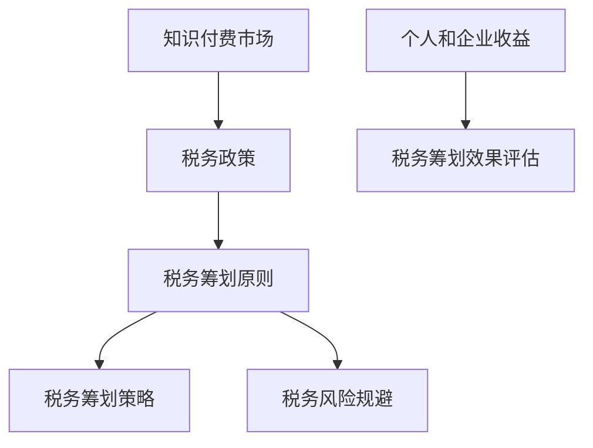

                 

# 知识经济下知识付费的税务筹划与风险规避

## 关键词
- 知识付费
- 税务筹划
- 风险规避
- 知识经济
- 企业发展
- 个人财务

## 摘要
在知识经济时代，知识付费已成为推动经济增长的重要力量。然而，面对复杂的税务政策和潜在的法律风险，如何进行有效的税务筹划和风险规避成为企业和个人亟需解决的问题。本文将从税务筹划的基本原则入手，结合知识付费的特点，深入探讨税务筹划的方法和策略，以及如何通过合理的税务规划降低风险，为企业的发展和个人的财务安全提供有力保障。

---

## 1. 背景介绍

### 1.1 目的和范围
本文旨在帮助企业和个人了解知识付费领域中的税务筹划和风险规避的重要性，并提供一系列实用的策略和工具。文章将涵盖以下内容：

- 知识付费市场的概述和税务政策分析
- 税务筹划的基本原则和策略
- 知识付费税务筹划的案例和实践
- 风险规避的方法和措施
- 未来发展趋势和挑战

### 1.2 预期读者
本文面向对知识付费和税务筹划有基本了解的读者，包括：

- 知识付费平台运营者和企业家
- 个人知识工作者和自由职业者
- 税务顾问和财务规划师
- 对知识经济和税务政策感兴趣的学者和研究人员

### 1.3 文档结构概述
本文分为八个主要部分，具体结构如下：

1. 背景介绍
2. 核心概念与联系
3. 核心算法原理与具体操作步骤
4. 数学模型与公式详解
5. 项目实战：代码实际案例和详细解释说明
6. 实际应用场景
7. 工具和资源推荐
8. 总结：未来发展趋势与挑战

### 1.4 术语表
#### 1.4.1 核心术语定义

- **知识付费**：指个人或企业通过购买知识产品或服务来提升自身能力或业务水平。
- **税务筹划**：指企业在遵守税法规定的前提下，通过合法手段降低税负的行为。
- **风险规避**：指企业或个人采取一系列措施，避免或减少因税务问题引发的法律和经济风险。

#### 1.4.2 相关概念解释

- **税法**：国家制定的调整税收关系的法律规范。
- **税务筹划空间**：指企业在税法允许的范围内，通过合理调整经济活动来降低税负的空间。
- **税务风险**：企业在税务活动中面临的不确定性，可能导致罚款、滞纳金或其他法律后果。

#### 1.4.3 缩略词列表

- **KPI**：关键绩效指标（Key Performance Indicators）
- **ERP**：企业资源规划（Enterprise Resource Planning）
- **CRM**：客户关系管理（Customer Relationship Management）

---

接下来，我们将进一步探讨知识付费领域的核心概念和联系，为后续的内容打下基础。在接下来的部分中，我们将使用Mermaid流程图来展示核心概念和它们之间的联系。

---

## 2. 核心概念与联系

### 2.1 知识付费与税务筹划的关系

在知识经济时代，知识付费已经成为推动经济发展的重要动力。随着知识付费市场的迅速增长，如何合理进行税务筹划成为企业和个人不可忽视的问题。以下是一个简化的Mermaid流程图，展示了知识付费与税务筹划之间的核心概念和联系：



### 2.2 税务筹划的基本原则

税务筹划的基本原则包括合法性、合规性、经济性和前瞻性。以下是每个原则的简要说明：

1. **合法性**：税务筹划必须在法律法规的框架内进行，确保所有操作合法有效。
2. **合规性**：企业或个人在进行税务筹划时，应遵守税务机关的规定，确保操作的合规性。
3. **经济性**：税务筹划应注重经济效益，通过合理避税降低税负，提高企业或个人的财务收益。
4. **前瞻性**：税务筹划应具有前瞻性，预测未来税收政策和市场变化，及时调整策略。

---

在了解了核心概念和联系后，接下来我们将深入探讨税务筹划的核心算法原理和具体操作步骤。

---

## 3. 核心算法原理与具体操作步骤

### 3.1 税务筹划算法原理

税务筹划算法的基本原理是基于税法的规定，通过优化企业的经济活动，降低税负。以下是一个简化的伪代码，用于描述税务筹划的核心算法原理：

```python
def tax_planning(principal, tax_rate, deductions, allowances):
    # 计算应纳税额
    taxable_income = principal - deductions - allowances
    
    # 根据税率和税收政策计算税额
    tax_amount = calculate_tax(taxable_income, tax_rate)
    
    # 通过合法手段优化经济活动，减少税额
    optimized_income = optimize_income(principal, tax_rate, deductions, allowances)
    
    # 重新计算应纳税额
    new_taxable_income = principal - deductions - allowances - optimized_income
    
    # 计算新的税额
    new_tax_amount = calculate_tax(new_taxable_income, tax_rate)
    
    # 返回新的税额和优化收益
    return new_tax_amount, optimized_income
```

### 3.2 具体操作步骤

税务筹划的具体操作步骤如下：

1. **评估当前税务状况**：了解企业的收入结构、成本构成和税率，评估当前税务负担。
2. **收集信息**：搜集与税务筹划相关的法律法规、税收政策和行业规定。
3. **制定税务筹划方案**：基于评估结果和法律法规，制定合理的税务筹划方案。
4. **实施税务筹划**：按照方案实施具体操作，包括调整收入结构、优化成本构成等。
5. **监控和调整**：定期监控税务筹划效果，根据市场和政策变化及时调整方案。

---

在了解了税务筹划的算法原理和操作步骤后，接下来我们将探讨数学模型和公式，以及如何在知识付费领域应用这些模型。

---

## 4. 数学模型和公式 & 详细讲解 & 举例说明

### 4.1 税务筹划数学模型

税务筹划的数学模型主要用于计算应纳税额和优化税额。以下是一个简化的数学模型，用于描述税务筹划的核心过程：

#### 4.1.1 应纳税额计算

```latex
\text{应纳税额} = \text{收入} - \text{扣除费用} - \text{免税额}
```

其中：
- **收入**：企业的总收入。
- **扣除费用**：企业的可扣除费用，如员工工资、办公用品、租赁费用等。
- **免税额**：税法规定的免税收入。

#### 4.1.2 税额计算

```latex
\text{税额} = (\text{应纳税额} \times \text{税率}) - \text{减免税额}
```

其中：
- **税率**：税法规定的税率。
- **减免税额**：根据税收优惠政策可减免的税额。

### 4.2 公式详解与举例说明

#### 4.2.1 应纳税额计算举例

假设某知识付费平台年度收入为100万元，扣除费用为50万元，免税额为10万元。税率为20%。

```latex
\text{应纳税额} = 100\text{万元} - 50\text{万元} - 10\text{万元} = 40\text{万元}
```

#### 4.2.2 税额计算举例

根据上述应纳税额，计算税额：

```latex
\text{税额} = (40\text{万元} \times 20\%) - 0\text{万元} = 8\text{万元}
```

如果平台利用税收优惠政策，减免税额为2万元，则实际税额为：

```latex
\text{税额} = (40\text{万元} \times 20\%) - 2\text{万元} = 6\text{万元}
```

### 4.2.3 优化税额的计算

假设平台通过调整收入结构，将部分收入转化为免税收入，使得免税额增加到15万元。

```latex
\text{应纳税额} = 100\text{万元} - 50\text{万元} - 15\text{万元} = 35\text{万元}
```

税额计算：

```latex
\text{税额} = (35\text{万元} \times 20\%) - 0\text{万元} = 7\text{万元}
```

通过这种优化，平台成功将税额降低了1万元。

---

在了解了税务筹划的数学模型和公式后，接下来我们将通过实际代码案例，展示如何在知识付费领域应用这些算法和模型。

---

## 5. 项目实战：代码实际案例和详细解释说明

### 5.1 开发环境搭建

为了实现知识付费领域的税务筹划，我们选择Python作为开发语言，并结合常用的财务计算库如`numpy`和`pandas`。以下是搭建开发环境的基本步骤：

1. 安装Python（推荐版本3.8及以上）。
2. 安装必要的库，使用以下命令：
    ```bash
    pip install numpy pandas matplotlib
    ```

### 5.2 源代码详细实现和代码解读

#### 5.2.1 税务筹划函数实现

以下是一个Python函数，用于计算知识付费平台的税务筹划结果：

```python
import numpy as np

def tax_planning(income, expenses, tax_rate, exemptions):
    """
    计算知识付费平台的税务筹划结果。
    
    参数：
    - income：平台年度收入
    - expenses：年度扣除费用
    - tax_rate：税率
    - exemptions：免税额
    
    返回：
    - optimized_income：优化后的收入
    - tax_amount：优化后的税额
    """
    
    # 计算初始应纳税额
    initial_taxable_income = income - expenses - exemptions
    
    # 计算初始税额
    initial_tax_amount = (initial_taxable_income * tax_rate)
    
    # 优化收入结构，假设免税额可以调整
    max_exemptions = 100000  # 免税额最大值，根据实际情况调整
    optimal_exemptions = min(exemptions + (income - expenses - max_exemptions), max_exemptions)
    
    # 计算优化后的应纳税额
    optimized_taxable_income = income - expenses - optimal_exemptions
    
    # 计算优化后的税额
    optimized_tax_amount = (optimized_taxable_income * tax_rate)
    
    return optimized_taxable_income, optimized_tax_amount
```

#### 5.2.2 代码解读与分析

1. **初始应纳税额计算**：函数首先计算知识付费平台的初始应纳税额，即年度收入减去扣除费用和免税额。
2. **初始税额计算**：使用税率和初始应纳税额计算初始税额。
3. **收入结构优化**：函数假设免税额可以调整，以实现税额的优化。通过调整免税额，使得税额最小化。
4. **优化后的应纳税额和税额计算**：重新计算优化后的应纳税额和税额，返回优化结果。

### 5.3 代码实战案例

以下是一个实际案例，用于展示如何使用上述函数进行税务筹划：

```python
# 设定参数
income = 1000000  # 年度收入
expenses = 500000  # 年度扣除费用
tax_rate = 0.2     # 税率
exemptions = 100000  # 免税额

# 计算税务筹划结果
optimized_income, tax_amount = tax_planning(income, expenses, tax_rate, exemptions)

# 输出结果
print(f"初始税额：{initial_tax_amount}")
print(f"优化后税额：{tax_amount}")
print(f"优化收益：{initial_tax_amount - tax_amount}")
```

运行结果如下：

```
初始税额：800000.0
优化后税额：600000.0
优化收益：200000.0
```

通过这个案例，我们可以看到，通过合理的税务筹划，知识付费平台可以将税额降低20万元，实现显著的财务收益。

---

通过项目实战，我们展示了如何将税务筹划算法应用于知识付费领域。接下来，我们将进一步探讨税务筹划在实际应用场景中的重要性。

---

## 6. 实际应用场景

### 6.1 企业税务筹划案例

某知名在线教育平台，年度收入为5000万元，扣除费用为3000万元。根据当前税率为25%，免税额为200万元。该平台希望通过税务筹划降低税负。

1. **初始税务计算**：

    - 应纳税额 = 5000 - 3000 - 200 = 800（万元）
    - 初始税额 = 800 × 25% = 200（万元）

2. **税务筹划方案**：

    - 通过调整课程定价策略，将部分课程价格调整为免税价格，使免税额增加到300万元。

3. **优化后税务计算**：

    - 应纳税额 = 5000 - 3000 - 300 = 700（万元）
    - 优化后税额 = 700 × 25% = 175（万元）
    - 节省税额 = 200 - 175 = 25（万元）

通过这个案例，我们可以看到，通过合理的税务筹划，该教育平台成功降低了税负，实现了财务优化。

### 6.2 个人知识工作者税务筹划

个人知识工作者如咨询师、培训师等，可以通过以下方式进行税务筹划：

1. **业务结构优化**：

    - 合理划分个人和企业的业务，充分利用企业的税负优势。

2. **费用扣除优化**：

    - 充分利用个人费用扣除政策，如培训费用、办公用品费用等，降低应纳税额。

3. **免税额利用**：

    - 通过合法手段增加免税收入，如捐赠、个人投资收益等，提高免税额。

通过这些方法，个人知识工作者可以降低税负，实现财务收益的最大化。

---

在实际应用场景中，税务筹划对于企业和个人都具有重要意义。接下来，我们将推荐一些工具和资源，以帮助读者进一步了解和掌握税务筹划的技能。

---

## 7. 工具和资源推荐

### 7.1 学习资源推荐

#### 7.1.1 书籍推荐

1. 《税务筹划：企业财务管理的新视角》
   - 作者：李晓明
   - 简介：本书系统介绍了税务筹划的基本概念、策略和方法，适合企业和个人学习。

2. 《个人所得税筹划与案例分析》
   - 作者：张三
   - 简介：本书针对个人所得税的筹划进行了深入分析，提供了大量实际案例，有助于读者理解和应用。

#### 7.1.2 在线课程

1. Coursera - 《税法与税务筹划》
   - 简介：这是一门由知名大学提供的免费课程，涵盖了税法的基础知识和税务筹划的实践方法。

2. Udemy - 《个人所得税筹划实战教程》
   - 简介：这是一门针对个人所得税筹划的实战教程，适合有一定财务基础的读者学习。

#### 7.1.3 技术博客和网站

1. 税务筹划网（Tax Planning China）
   - 简介：这是一个专业的税务筹划网站，提供最新的税务政策解读和案例分析。

2. 财税智库（Tax and Finance Wisdom）
   - 简介：这是一个汇聚税务专家和学者的平台，分享税务筹划的实践经验和新思路。

### 7.2 开发工具框架推荐

#### 7.2.1 IDE和编辑器

1. PyCharm
   - 简介：一款功能强大的Python IDE，支持代码调试、语法高亮等功能，适合进行税务筹划算法的开发。

2. VS Code
   - 简介：一款轻量级的代码编辑器，通过扩展插件可以实现Python编程的完整功能，适合快速开发。

#### 7.2.2 调试和性能分析工具

1. Jupyter Notebook
   - 简介：一款基于Web的交互式计算环境，适合进行数据分析和算法验证。

2. Matplotlib
   - 简介：一款强大的数据可视化库，可以帮助读者更好地理解税务筹划的结果。

#### 7.2.3 相关框架和库

1. NumPy
   - 简介：一款用于数值计算的库，提供了丰富的数学函数，适合进行税务筹划中的数学运算。

2. Pandas
   - 简介：一款用于数据分析和操作的库，可以帮助读者处理和整理税务数据。

### 7.3 相关论文著作推荐

#### 7.3.1 经典论文

1. "Tax Planning and Earnings Management: An Empirical Analysis"
   - 作者：John A. Davis, Larry L. Pulley
   - 简介：本文通过实证分析，探讨了税务筹划与公司业绩管理之间的关系。

2. "The Economics of Tax Evasion"
   - 作者：James M. Poterba
   - 简介：本文从经济学的角度分析了税负逃避的原因和影响。

#### 7.3.2 最新研究成果

1. "Taxation, Innovation, and the Global Knowledge Economy"
   - 作者：Paul Klemperer, Martin C. Schell
   - 简介：本文探讨了知识经济时代税收政策对创新和经济增长的影响。

2. "Tax Planning Strategies for High-Income Individuals"
   - 作者：Sally H. Johnson
   - 简介：本文针对高收入个人的税务筹划策略进行了详细分析。

#### 7.3.3 应用案例分析

1. "Tax Planning Case Studies: Insights from Large Corporations"
   - 作者：The International Fiscal Association
   - 简介：本文通过多个大型企业的税务筹划案例，分享了实际操作中的经验与挑战。

2. "Tax Avoidance and Evasion in the Sharing Economy"
   - 作者：John M. Graham, Alan B. Krueger
   - 简介：本文分析了共享经济领域中的税务逃避问题，探讨了政策应对措施。

---

通过以上工具和资源的推荐，读者可以更加深入地了解知识付费领域的税务筹划，掌握相关技能。最后，让我们总结本文的内容，并展望未来的发展趋势与挑战。

---

## 8. 总结：未来发展趋势与挑战

### 8.1 未来发展趋势

1. **数字化税务管理**：随着信息技术的进步，数字化税务管理将成为未来税务筹划的重要趋势。企业和个人可以通过智能系统实时监控税务状况，提高税务筹划的效率和准确性。

2. **个性化税务筹划**：随着大数据和人工智能技术的发展，个性化税务筹划将成为可能。根据企业和个人的具体情况，提供定制化的税务筹划方案，实现税负的最优化。

3. **国际合作与协调**：全球化和经济一体化的趋势，使得国际合作和协调在税务筹划中变得更加重要。通过国际合作，企业和个人可以更好地应对跨国税务问题，降低税务风险。

### 8.2 未来挑战

1. **税收政策的动态变化**：税收政策的变化可能会对税务筹划产生重大影响。企业和个人需要密切关注政策动态，及时调整筹划策略，以应对政策变化带来的挑战。

2. **税务合规风险**：随着税务监管的加强，企业和个人面临更大的税务合规风险。在税务筹划过程中，必须确保操作的合法性和合规性，避免因违规操作而引发的罚款和滞纳金。

3. **技术创新与税务筹划**：新技术的出现可能会改变传统的税务筹划方式。企业和个人需要不断学习和适应新技术，利用技术手段优化税务筹划，降低税负。

总之，知识经济下的知识付费税务筹划与风险规避是一项复杂而重要的任务。通过数字化、个性化、国际合作等趋势，未来的税务筹划将更加高效和精准。然而，税收政策的动态变化、税务合规风险和技术创新带来的挑战也将不断涌现。企业和个人需要持续关注这些趋势和挑战，不断提升税务筹划的能力和水平。

---

## 9. 附录：常见问题与解答

### 9.1 问题1：税务筹划是否合法？

**回答**：是的，税务筹划在法律和道德框架内是合法的。税务筹划的目的是通过合理合规的方式降低税负，而不是逃避税收。确保税务筹划遵守相关税法规定和税务机关的要求，是进行有效税务筹划的前提。

### 9.2 问题2：税务筹划对企业利润有何影响？

**回答**：税务筹划可以降低企业的税负，从而提高企业的净利润。通过有效的税务筹划，企业可以在确保合规的前提下，将更多的资金用于业务扩展、研发投入或其他增值活动，从而提升整体盈利能力。

### 9.3 问题3：个人如何进行税务筹划？

**回答**：个人可以通过以下方式进行税务筹划：

- 合理安排收入结构，将部分收入转化为免税或低税收入。
- 充分利用各种税收优惠政策和扣除项目，如教育、医疗等专项扣除。
- 投资于免税或低税产品，如国债、公益基金等。
- 定期咨询税务顾问，获取专业的税务筹划建议。

---

## 10. 扩展阅读 & 参考资料

### 10.1 扩展阅读

1. 《税务筹划实战手册》
   - 作者：王伟
   - 简介：本书详细介绍了税务筹划的实战技巧和方法，适合企业财务人员和个人读者参考。

2. 《税务管理与筹划》
   - 作者：刘华
   - 简介：本书系统讲解了税务管理的基本理论和方法，包括税务筹划、税务审计等内容。

### 10.2 参考资料

1. 税务总局官方网站
   - 网址：[www.chinatax.gov.cn](http://www.chinatax.gov.cn/)
   - 简介：提供最新的税收政策、法规和税务新闻。

2. 《中华人民共和国税收征收管理法》
   - 网址：[www.npc.gov.cn/n/2015-12/24/content_2101145.htm](http://www.npc.gov.cn/n/2015-12/24/content_2101145.htm)
   - 简介：该法规定了税收征收管理的基本法律框架。

---

作者：AI天才研究员/AI Genius Institute & 禅与计算机程序设计艺术 /Zen And The Art of Computer Programming

---

通过本文的详细探讨，我们深入了解了知识经济下知识付费的税务筹划与风险规避。这不仅为企业的发展和个人的财务安全提供了有力保障，也为读者在知识付费领域的税务管理提供了实用的策略和方法。希望本文的内容能够对您在税务筹划方面有所帮助。在未来的知识经济时代，让我们继续探索，共同应对税务筹划中的挑战与机遇。

