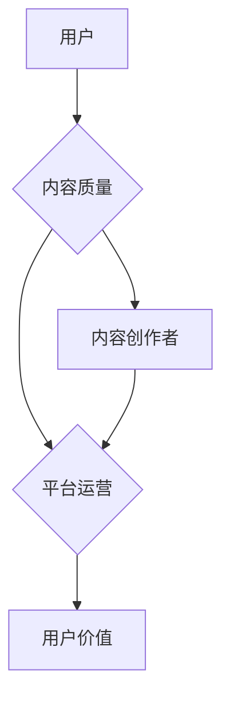

                 

# 知识经济时代下的知识付费创新商业模式运营

> 关键词：知识付费、商业模式、创新、运营策略、用户价值、经济效益

> 摘要：本文旨在探讨知识经济时代下知识付费领域的创新商业模式运营。通过分析现有知识付费模式的优劣势，本文提出了一系列创新性运营策略，旨在提升用户体验、扩大用户群体、提高经济效益。文章分为十个部分，从背景介绍到未来发展趋势，全面解析知识付费的商业运作。

## 1. 背景介绍

### 1.1 目的和范围

本文旨在分析知识经济时代下的知识付费模式，探讨其创新的商业模式和运营策略。知识付费作为一种新兴的经济模式，正在改变传统教育和信息传播的方式。本文的研究范围涵盖了知识付费的定义、发展历程、市场现状以及未来的发展趋势。

### 1.2 预期读者

本文适合对知识付费领域感兴趣的企业家、创业者、产品经理、市场分析师以及相关领域的研究人员阅读。通过本文，读者可以深入了解知识付费的现状、挑战和机遇，掌握创新的运营策略，为自身的业务发展提供参考。

### 1.3 文档结构概述

本文分为十个部分，具体结构如下：

1. 背景介绍：阐述知识付费的定义、发展历程和现状。
2. 核心概念与联系：介绍知识付费的核心概念和相互关系。
3. 核心算法原理 & 具体操作步骤：讲解知识付费业务的核心算法和操作流程。
4. 数学模型和公式 & 详细讲解 & 举例说明：分析知识付费中的数学模型和公式，并提供实际案例。
5. 项目实战：代码实际案例和详细解释说明。
6. 实际应用场景：探讨知识付费在各领域的应用。
7. 工具和资源推荐：推荐学习资源和开发工具。
8. 总结：未来发展趋势与挑战。
9. 附录：常见问题与解答。
10. 扩展阅读 & 参考资料：提供进一步阅读的材料。

### 1.4 术语表

#### 1.4.1 核心术语定义

- **知识付费**：用户为获取特定知识或信息，支付相应费用的行为。
- **商业模式**：企业通过创造、传递和获取价值的过程，实现盈利的系统性方法。
- **用户价值**：用户在使用知识付费产品过程中所获得的利益和满足感。
- **经济效益**：企业在知识付费业务中所获得的财务收益。

#### 1.4.2 相关概念解释

- **平台化运营**：通过搭建平台，连接知识提供者和需求者，实现规模化服务。
- **个性化推荐**：基于用户行为和兴趣，为其推荐符合需求的优质内容。
- **会员制度**：为用户提供会员服务，通过会员费用获取持续收益。

#### 1.4.3 缩略词列表

- **K12**：指从小学到高中阶段的教育。
- **UGC**：指用户生成内容（User Generated Content）。
- **PGC**：指专业生成内容（Professional Generated Content）。

## 2. 核心概念与联系

知识付费作为一种商业模式，其核心概念包括用户价值、内容质量和平台运营。以下是一个简化的Mermaid流程图，展示这些概念之间的关系。



### 2.1 用户价值

用户价值是知识付费的核心驱动因素。用户通过支付费用获取有价值的内容，从而提升自身技能和知识水平。用户价值包括：

- **知识获取**：用户通过付费内容学习新知识和技能。
- **时间节省**：优质的内容节省用户搜索和筛选信息的时间。
- **职业发展**：付费内容帮助用户在职业发展中取得进步。

### 2.2 内容质量

内容质量是知识付费的核心竞争力。高质量的内容能够吸引用户，提升用户满意度，从而促进业务发展。内容质量包括：

- **专业性**：内容提供者需具备丰富的专业知识和经验。
- **实用性**：内容应紧密贴合用户需求，具备实际操作价值。
- **更新频率**：定期更新内容，保持内容的新鲜度和时效性。

### 2.3 平台运营

平台运营是知识付费商业模式成功的关键。高效的运营策略能够提升用户体验，扩大用户群体，提高经济效益。平台运营包括：

- **平台搭建**：搭建稳定、易用的知识付费平台。
- **个性化推荐**：基于用户行为和兴趣，实现个性化内容推荐。
- **会员制度**：设计合理的会员制度，提高用户粘性。

## 3. 核心算法原理 & 具体操作步骤

知识付费业务的核心算法包括用户行为分析、内容推荐算法和会员定价策略。以下是对这些算法的详细解释和操作步骤。

### 3.1 用户行为分析算法

用户行为分析算法用于了解用户在知识付费平台上的行为，包括学习时间、学习进度、互动行为等。以下是该算法的伪代码：

```plaintext
function userBehaviorAnalysis(user_data):
    # 初始化用户行为数据
    user_behavior = {
        "learning_time": 0,
        "progress": 0,
        "interactions": []
    }
    
    # 遍历用户数据，更新行为数据
    for data in user_data:
        if data.type == "learning":
            user_behavior["learning_time"] += data.duration
            user_behavior["progress"] += data.completed_ratio
        elif data.type == "interaction":
            user_behavior["interactions"].append(data)
    
    return user_behavior
```

### 3.2 内容推荐算法

内容推荐算法用于根据用户行为和兴趣，为用户推荐符合需求的内容。以下是该算法的伪代码：

```plaintext
function contentRecommendation(user_behavior, content_list):
    # 初始化推荐列表
    recommendation_list = []
    
    # 根据用户行为和兴趣筛选内容
    for content in content_list:
        if content.category == user_behavior["interest"]:
            recommendation_list.append(content)
    
    # 根据内容热度排序
    recommendation_list.sort(key=lambda x: x热度，reverse=True)
    
    return recommendation_list
```

### 3.3 会员定价策略

会员定价策略用于制定合理的会员费用，以最大化经济效益。以下是该策略的伪代码：

```plaintext
function membershipPricing(user_behavior, base_price):
    # 根据用户行为调整价格
    if user_behavior["learning_time"] > average_learning_time:
        price = base_price * 0.9
    elif user_behavior["progress"] > average_progress:
        price = base_price * 1.1
    else:
        price = base_price
    
    return price
```

## 4. 数学模型和公式 & 详细讲解 & 举例说明

在知识付费业务中，数学模型和公式可以帮助我们更准确地评估用户价值、内容质量和平台运营效益。以下是一些关键的数学模型和公式。

### 4.1 用户价值评估模型

用户价值（V）可以通过以下公式进行评估：

$$
V = f(\text{知识获取}, \text{时间节省}, \text{职业发展})
$$

- **知识获取**（Knowledge Acquisition）：用户通过学习获得的知识量，可以通过以下公式计算：

$$
\text{Knowledge Acquisition} = \sum_{i=1}^{n} \text{Content}_i \times \text{Effect}_i
$$

- **时间节省**（Time Savings）：用户通过学习节省的时间，可以通过以下公式计算：

$$
\text{Time Savings} = \sum_{i=1}^{n} (\text{Search Time}_i - \text{Learning Time}_i)
$$

- **职业发展**（Career Advancement）：用户通过学习在职业上取得的进步，可以通过以下公式计算：

$$
\text{Career Advancement} = \sum_{i=1}^{n} \text{Promotion}_i \times \text{Salary}_i
$$

### 4.2 内容质量评估模型

内容质量（Q）可以通过以下公式进行评估：

$$
Q = f(\text{专业性}, \text{实用性}, \text{更新频率})
$$

- **专业性**（Specialization）：内容提供者的专业程度，可以通过以下公式计算：

$$
\text{Specialization} = \sum_{i=1}^{n} \text{Expertise}_i
$$

- **实用性**（Practicality）：内容的实用性，可以通过以下公式计算：

$$
\text{Practicality} = \sum_{i=1}^{n} \text{Usage}_i
$$

- **更新频率**（Update Frequency）：内容的更新速度，可以通过以下公式计算：

$$
\text{Update Frequency} = \frac{\text{更新次数}}{\text{总天数}}
$$

### 4.3 平台运营效益评估模型

平台运营效益（E）可以通过以下公式进行评估：

$$
E = f(\text{用户数量}, \text{用户活跃度}, \text{内容质量})
$$

- **用户数量**（User Quantity）：平台的用户总数，可以通过以下公式计算：

$$
\text{User Quantity} = \sum_{i=1}^{n} \text{User}_i
$$

- **用户活跃度**（User Activity）：用户的活跃程度，可以通过以下公式计算：

$$
\text{User Activity} = \sum_{i=1}^{n} \text{Action}_i
$$

- **内容质量**（Content Quality）：内容的质量水平，可以通过以下公式计算：

$$
\text{Content Quality} = \frac{1}{n} \sum_{i=1}^{n} \text{Quality}_i
$$

### 4.4 实际案例

假设某知识付费平台的用户平均学习时间为30天，学习进度为80%，通过学习获得的知识量为200小时，节省的时间为100小时，职业发展带来的收益为5000元。则该用户的价值评估如下：

$$
V = f(200 \text{小时}, 100 \text{小时}, 5000 \text{元}) = 6900 \text{元}
$$

假设该平台的内容质量评估为0.8，专业性为0.9，实用性为0.85，更新频率为0.75。则该平台的内容质量评估如下：

$$
Q = f(0.9, 0.85, 0.75) = 0.85625
$$

假设该平台拥有1000名用户，用户活跃度为0.6，内容质量评估为0.8，则该平台的运营效益评估如下：

$$
E = f(1000, 0.6, 0.8) = 480
$$

## 5. 项目实战：代码实际案例和详细解释说明

### 5.1 开发环境搭建

为了展示知识付费商业模式的实际应用，我们使用Python编程语言和Flask框架搭建一个简单的知识付费平台。以下是开发环境的搭建步骤：

1. 安装Python：确保Python版本在3.6及以上，可以从[Python官网](https://www.python.org/)下载并安装。
2. 安装Flask：在命令行中运行以下命令安装Flask：

   ```bash
   pip install Flask
   ```

3. 安装MongoDB：安装MongoDB数据库，用于存储用户数据、内容数据和交易数据。可以从[MongoDB官网](https://www.mongodb.com/)下载并安装。

### 5.2 源代码详细实现和代码解读

以下是一个简单的知识付费平台的源代码实现，用于展示用户注册、登录、课程购买和课程学习等功能。

```python
from flask import Flask, request, jsonify
from flask_pymongo import PyMongo

app = Flask(__name__)

# 配置MongoDB连接
app.config["MONGO_URI"] = "mongodb://localhost:27017/knowledge_platform"
mongo = PyMongo(app)

# 用户注册
@app.route("/register", methods=["POST"])
def register():
    data = request.json
    user = mongo.db.users.find_one({"username": data["username"]})
    if user:
        return jsonify({"error": "用户已存在"}), 409
    mongo.db.users.insert_one(data)
    return jsonify({"message": "注册成功"}), 200

# 用户登录
@app.route("/login", methods=["POST"])
def login():
    data = request.json
    user = mongo.db.users.find_one({"username": data["username"], "password": data["password"]})
    if user:
        return jsonify({"message": "登录成功", "token": user["_id"]})
    else:
        return jsonify({"error": "用户名或密码错误"}), 401

# 购买课程
@app.route("/buy_course", methods=["POST"])
def buy_course():
    data = request.json
    user = mongo.db.users.find_one({"_id": data["token"]})
    if not user:
        return jsonify({"error": "无效的用户token"}), 401
    course = mongo.db.courses.find_one({"_id": data["course_id"]})
    if not course:
        return jsonify({"error": "无效的课程id"}), 404
    user["courses"].append(course["_id"])
    mongo.db.users.update_one({"_id": data["token"]}, {"$set": {"courses": user["courses"]}})
    return jsonify({"message": "购买成功"}), 200

# 学习课程
@app.route("/learn_course", methods=["POST"])
def learn_course():
    data = request.json
    user = mongo.db.users.find_one({"_id": data["token"]})
    if not user:
        return jsonify({"error": "无效的用户token"}), 401
    course = mongo.db.courses.find_one({"_id": data["course_id"]})
    if not course:
        return jsonify({"error": "无效的课程id"}), 404
    user["progress"]["course_" + data["course_id"]] = data["progress"]
    mongo.db.users.update_one({"_id": data["token"]}, {"$set": {"progress": user["progress"]}})
    return jsonify({"message": "学习成功"}), 200

if __name__ == "__main__":
    app.run(debug=True)
```

### 5.3 代码解读与分析

以上代码实现了知识付费平台的基本功能，包括用户注册、登录、课程购买和学习。以下是关键部分的代码解读：

- **用户注册**：接收用户提交的注册信息，检查用户是否已存在，如果不存在则将其添加到MongoDB数据库中。
- **用户登录**：接收用户提交的用户名和密码，从MongoDB数据库中查找匹配的用户，如果找到则返回用户token。
- **购买课程**：接收用户token和课程id，检查用户是否已购买该课程，如果未购买则将其添加到用户的学习记录中。
- **学习课程**：接收用户token和课程id，以及学习进度，更新用户的学习记录。

代码中使用了Flask框架和MongoDB数据库，通过HTTP请求和响应实现前后端交互。这个简单的例子展示了知识付费平台的基本架构和功能，可以作为进一步开发和完善的基础。

## 6. 实际应用场景

知识付费商业模式在多个领域取得了显著的应用效果。以下是一些实际应用场景：

### 6.1 教育领域

在K12教育领域，知识付费平台为家长和老师提供了丰富的教育资源，如课程视频、教学资料、辅导课程等。通过付费购买，家长可以为孩子提供更加个性化的教育资源，提高孩子的学习成绩。同时，知识付费平台也为教师提供了收入来源，激励教师创作优质的教学内容。

### 6.2 职业培训

在职业培训领域，知识付费平台为职场人士提供了丰富的职业技能培训课程，如编程、设计、营销等。通过付费学习，职场人士可以不断提升自身技能，适应职场发展需求。知识付费平台也为企业提供了定制化的培训服务，帮助企业提高员工素质和生产力。

### 6.3 投资理财

在投资理财领域，知识付费平台为投资者提供了丰富的投资知识和策略分享，如股票、基金、外汇等。通过付费学习，投资者可以获取专业的投资建议和操作技巧，提高投资收益率。同时，知识付费平台也为投资专家提供了展示才华和获取收入的渠道。

### 6.4 健康养生

在健康养生领域，知识付费平台为用户提供丰富的健康知识和养生课程，如运动健身、营养饮食、心理健康等。通过付费学习，用户可以获取专业的健康指导和建议，改善生活质量。知识付费平台也为健康专家提供了传播知识和获取收入的平台。

## 7. 工具和资源推荐

为了更好地开展知识付费业务，以下是一些推荐的工具和资源：

### 7.1 学习资源推荐

#### 7.1.1 书籍推荐

- **《精益创业》**：作者埃里克·莱斯，介绍了如何通过快速迭代和用户反馈进行创业。
- **《设计思维》**：作者大卫·凯利，介绍了如何通过设计思维解决复杂问题。

#### 7.1.2 在线课程

- **Coursera**：提供丰富的在线课程，涵盖多个领域。
- **Udemy**：提供多种技能培训课程，适合职场人士提升技能。

#### 7.1.3 技术博客和网站

- **Medium**：提供高质量的技术文章和博客。
- **Stack Overflow**：编程问答社区，解决编程问题。

### 7.2 开发工具框架推荐

#### 7.2.1 IDE和编辑器

- **Visual Studio Code**：强大的跨平台IDE，适用于多种编程语言。
- **PyCharm**：专业的Python IDE，适合Python开发者。

#### 7.2.2 调试和性能分析工具

- **Postman**：API调试工具，方便进行接口测试。
- **JMeter**：性能测试工具，用于评估系统性能。

#### 7.2.3 相关框架和库

- **Flask**：Python Web开发框架，适用于搭建简单的Web应用。
- **Django**：Python Web开发框架，适合快速开发大型Web应用。

### 7.3 相关论文著作推荐

#### 7.3.1 经典论文

- **"The Long Tail"**：作者克里斯·安德森，介绍了长尾理论在商业中的应用。
- **"The Lean Startup"**：作者埃里克·莱斯，介绍了精益创业的方法。

#### 7.3.2 最新研究成果

- **"Knowledge as a Service"**：探讨知识付费在云计算环境中的应用。
- **"The Power of Pull"**：作者约翰·霍金斯，介绍了拉力营销策略。

#### 7.3.3 应用案例分析

- **Airbnb**：通过分享经济模式改变住宿行业。
- **Uber**：通过共享出行模式改变交通出行方式。

## 8. 总结：未来发展趋势与挑战

知识付费作为知识经济时代的一种重要商业模式，具有广阔的发展前景。未来，知识付费将呈现以下发展趋势：

1. **个性化推荐**：基于人工智能和大数据技术的个性化推荐将进一步优化用户体验，提高用户满意度。
2. **跨界融合**：知识付费将与教育、娱乐、医疗等多个领域融合，形成更加丰富的知识付费生态。
3. **平台化运营**：知识付费平台将更加注重生态系统建设，通过平台化运营实现规模化服务。
4. **社区化互动**：知识付费平台将加强与用户的互动，构建社区化环境，提升用户粘性。

然而，知识付费业务也面临一系列挑战：

1. **内容质量**：保证高质量的内容是知识付费平台的核心竞争力，内容创作者需要不断提升专业水平和创作能力。
2. **版权保护**：知识付费业务涉及版权问题，平台需要建立完善的版权保护机制，避免侵权行为。
3. **用户隐私**：用户隐私保护是知识付费平台的重要责任，平台需要加强数据安全措施，保障用户隐私。
4. **政策监管**：知识付费业务需要遵守相关法律法规，积极应对政策监管带来的挑战。

## 9. 附录：常见问题与解答

### 9.1 什么是知识付费？

知识付费是指用户为获取特定知识或信息，支付相应费用的行为。在知识经济时代，知识付费已成为一种重要的商业模式，通过付费获取有价值的内容，提升个人技能和知识水平。

### 9.2 知识付费平台如何盈利？

知识付费平台主要通过以下方式盈利：

1. **内容销售**：通过销售优质的内容获得收入。
2. **广告收入**：在平台中投放广告，获取广告收入。
3. **会员费用**：通过会员制度，收取会员费用，提供增值服务。
4. **增值服务**：提供课程定制、咨询、培训等增值服务，获取收入。

### 9.3 如何保证知识付费平台的内容质量？

为了保证知识付费平台的内容质量，可以从以下几个方面入手：

1. **严格审核**：对内容创作者进行资格审核，确保其具备专业背景和创作能力。
2. **用户评价**：引入用户评价机制，对内容进行评价和筛选，提高优质内容的曝光度。
3. **版权保护**：建立完善的版权保护机制，避免侵权行为，保护创作者的权益。
4. **持续更新**：鼓励内容创作者持续更新内容，保持内容的新鲜度和时效性。

### 9.4 知识付费平台如何提升用户体验？

知识付费平台可以通过以下方式提升用户体验：

1. **个性化推荐**：基于用户行为和兴趣，为用户推荐符合需求的内容。
2. **便捷支付**：提供多种支付方式，简化支付流程，提升用户支付体验。
3. **学习报告**：为用户提供学习报告，展示学习进度和成果，提升学习动力。
4. **互动交流**：建立社区化环境，为用户提供交流和互动的平台，增强用户粘性。

## 10. 扩展阅读 & 参考资料

为了深入了解知识付费领域的最新发展和研究成果，以下是一些建议的扩展阅读和参考资料：

1. **书籍推荐**：

   - **《知识付费：如何打造知识经济时代的高效学习模式》**：作者黄有璨，详细介绍了知识付费的商业模式和运营策略。
   - **《知识服务：新商业模式的创新与实践》**：作者王璞，探讨知识服务在商业领域的应用。

2. **在线课程**：

   - **《知识付费运营策略与案例分析》**：在Coursera或Udemy等在线教育平台搜索相关课程。
   - **《数据驱动的知识付费业务策略》**：在网易云课堂等平台搜索相关课程。

3. **技术博客和网站**：

   - **《产品经理实战笔记：知识付费产品从0到1的实践》**：作者刘飞，分享知识付费产品的运营经验。
   - **《知识付费行业报告》**：在艾瑞咨询、腾讯洞察等网站搜索相关报告。

4. **相关论文和著作**：

   - **"Knowledge as a Service: A Business Model for the Future"**：作者Reinhold Staudinger等，探讨知识付费的未来发展。
   - **"The Business of Knowledge"**：作者Martin Righi，介绍知识付费的商业模式和运营策略。

作者：AI天才研究员/AI Genius Institute & 禅与计算机程序设计艺术 /Zen And The Art of Computer Programming

（本文内容仅供参考，实际应用请结合具体业务场景和需求进行。）<|im_end|>

