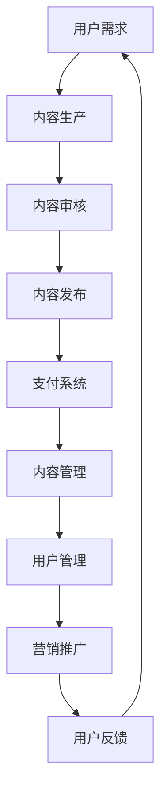
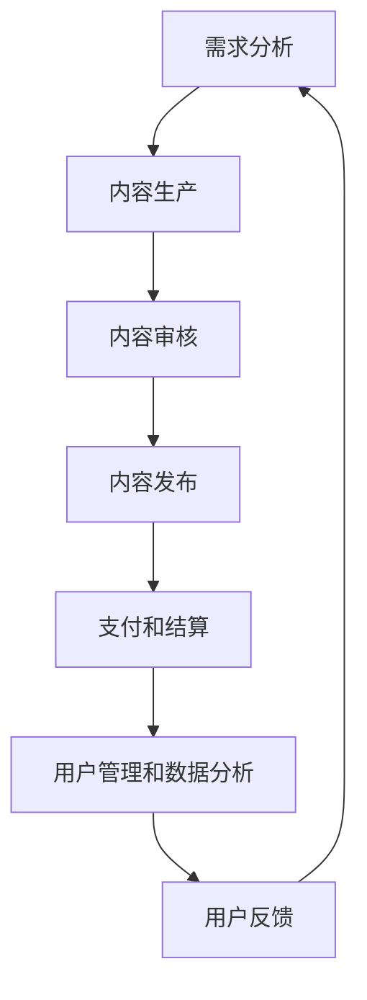

                 

### 知识经济时代的知识付费赚钱原理与方法实践

> **关键词**：知识付费、经济学原理、商业策略、技术实现、案例研究

> **摘要**：本文深入探讨知识经济时代下知识付费的赚钱原理与方法，分析其核心驱动因素、商业模式及实际操作步骤。通过案例研究和实践经验，提供可操作性强的策略，帮助个人和企业实现知识价值的最大化。

在当今知识爆炸和信息泛滥的时代，知识的获取和传播方式发生了深刻变革。知识付费作为一种新兴的商业模式，正逐渐成为推动经济发展的重要力量。本文旨在探讨知识付费的赚钱原理和方法，为广大知识生产者和消费者提供实用的指导和建议。

### 1. 背景介绍

#### 1.1 目的和范围

本文的目的是：
- 深入解析知识付费的经济学原理和商业策略。
- 探讨知识付费的核心驱动因素及其影响。
- 分析知识付费的具体操作步骤和实现方法。
- 提供成功案例和实用的建议，帮助个人和企业实现知识价值的最大化。

本文主要讨论以下内容：
- 知识付费的概念和核心特征。
- 知识付费的经济学原理和商业模式。
- 知识付费的技术实现方法和操作步骤。
- 知识付费的实际应用场景和成功案例。
- 知识付费的未来发展趋势和挑战。

#### 1.2 预期读者

本文主要面向以下读者群体：
- 对知识付费感兴趣的普通人，希望了解相关知识。
- 想要从事知识付费业务的企业和个人。
- 需要提升知识管理能力的专业人士。

#### 1.3 文档结构概述

本文结构如下：
1. 引言：介绍知识付费的概念和背景。
2. 核心概念与联系：分析知识付费的驱动因素和商业模式。
3. 核心算法原理与具体操作步骤：探讨知识付费的技术实现。
4. 数学模型和公式：讲解知识付费的经济学原理。
5. 项目实战：分析具体案例和操作步骤。
6. 实际应用场景：探讨知识付费在各行业的应用。
7. 工具和资源推荐：提供相关的学习资源和开发工具。
8. 总结：总结知识付费的未来发展趋势和挑战。

#### 1.4 术语表

在本文中，我们将使用以下术语：
- **知识付费**：指消费者通过支付费用来获取知识产品或服务。
- **知识产品**：包括书籍、课程、讲座、研究报告等形式的知识内容。
- **知识服务**：指为满足特定需求提供定制化的知识解决方案。
- **知识生产者**：指创作、制作和提供知识产品或服务的个人或机构。
- **知识消费者**：指购买或使用知识产品或服务的个人或组织。

#### 1.4.1 核心术语定义

- **知识付费**：知识付费是一种商业模式，通过消费者支付费用来获取知识产品或服务。这种模式的核心在于知识的价值和稀缺性。
- **知识产品**：知识产品是知识付费的核心载体，可以是书籍、电子书、课程、讲座、研究报告等多种形式。
- **知识服务**：知识服务是为满足特定需求提供定制化的知识解决方案，如咨询服务、培训服务、数据分析服务等。
- **知识生产者**：知识生产者是创作、制作和提供知识产品或服务的个人或机构，如专家、学者、企业家等。
- **知识消费者**：知识消费者是购买或使用知识产品或服务的个人或组织，可以是个人、企业、政府等。

#### 1.4.2 相关概念解释

- **知识经济**：知识经济是一种以知识为主要生产要素的经济形态，强调知识的创造、传播和应用。
- **商业模式**：商业模式是企业通过提供产品或服务来创造价值、获取利润的方式。
- **用户体验**：用户体验是指用户在使用产品或服务过程中的感受和体验，是影响消费者决策的重要因素。
- **知识传播**：知识传播是指知识在不同主体之间传递、交流和应用的过程。

#### 1.4.3 缩略词列表

- **KPI**：关键绩效指标（Key Performance Indicators）
- **ROI**：投资回报率（Return on Investment）
- **CRM**：客户关系管理（Customer Relationship Management）
- **SEO**：搜索引擎优化（Search Engine Optimization）
- **SNS**：社交网络服务（Social Networking Services）

### 2. 核心概念与联系

在深入探讨知识付费的赚钱原理与方法之前，我们首先需要理解与之相关的一些核心概念和它们之间的联系。

#### 2.1 知识付费的驱动因素

知识付费的驱动因素主要包括以下几个方面：

1. **用户需求**：随着社会的进步和人们认知水平的提高，越来越多的人意识到知识的重要性，愿意为高质量的知识产品或服务支付费用。
2. **技术进步**：互联网和信息技术的发展，使得知识的获取和传播变得更加便捷和高效，降低了知识获取的成本。
3. **市场环境**：市场竞争的加剧，使得企业需要不断学习和创新，以提升自身的竞争力。知识付费为企业和个人提供了提升能力的机会。
4. **经济效益**：知识付费不仅能够满足用户需求，还能为企业带来经济效益，是知识价值变现的有效途径。

#### 2.2 知识付费的商业模式

知识付费的商业模式主要包括以下几种：

1. **订阅制**：用户通过支付订阅费用，定期获取知识产品或服务。如一些在线课程平台、知识库等。
2. **单次购买**：用户为某个特定的知识产品或服务支付一次性费用。如电子书、研究报告等。
3. **按需付费**：用户根据实际需求，为特定的知识服务支付费用。如咨询服务、定制培训等。
4. **会员制**：用户成为会员，享受一定期限内的知识产品或服务。如一些付费社区、专业论坛等。

#### 2.3 知识付费的技术实现

知识付费的技术实现主要涉及以下几个方面：

1. **支付系统**：确保用户支付的安全和便捷，通常采用第三方支付平台或自建支付系统。
2. **内容管理**：对知识产品或服务进行有效管理，包括内容审核、发布、更新等。
3. **用户管理**：对用户进行有效管理，包括用户注册、登录、权限控制、数据统计等。
4. **营销推广**：通过多种渠道和手段，提升知识产品或服务的知名度和用户粘性。

#### 2.4 知识付费的经济学原理

知识付费的经济学原理主要基于以下几个理论：

1. **边际成本递减**：知识产品的边际成本随着生产规模的扩大而递减，使得大规模生产成为可能。
2. **知识价值变现**：知识付费将知识的潜在价值转化为实际的经济收益。
3. **消费行为经济学**：用户消费行为受多种因素影响，如需求、价格、质量、信任等。
4. **效用理论**：用户购买知识产品或服务是为了获得效用，效用大小是决定消费决策的重要因素。

#### 2.5 知识付费的框架图

为了更清晰地理解知识付费的各个环节和联系，我们可以使用Mermaid流程图来展示其核心概念和架构。以下是一个简单的Mermaid流程图示例：



在这个流程图中，用户需求是知识付费的起点，通过内容生产、内容审核、内容发布等环节，最终形成知识产品或服务。支付系统确保用户支付的安全和便捷，内容管理和用户管理则保障知识产品或服务的有效运营。营销推广和用户反馈则不断优化和提升用户体验，形成闭环。

### 3. 核心算法原理 & 具体操作步骤

在理解了知识付费的驱动因素、商业模式、技术实现和经济学原理之后，我们接下来将详细探讨知识付费的核心算法原理和具体操作步骤。这部分内容将通过伪代码和流程图来讲解，帮助读者更好地理解和实践。

#### 3.1 知识付费的核心算法原理

知识付费的核心算法原理主要包括以下几个方面：

1. **需求分析**：通过对用户行为数据和反馈的分析，识别用户的知识需求。
2. **内容推荐**：根据用户需求和内容特征，推荐合适的知识产品或服务。
3. **支付和结算**：确保支付过程的安全和高效，实现知识价值的变现。
4. **用户管理和数据分析**：对用户进行有效管理，进行数据统计和分析，以优化用户体验和营销策略。

以下是一个简单的伪代码示例，展示知识付费的核心算法原理：

```python
# 需求分析
def analyze_demand(user_data):
    # 分析用户行为数据和反馈
    # 返回用户知识需求
    return user_demand

# 内容推荐
def recommend_content(user_demand, content_library):
    # 根据用户需求从知识库中推荐内容
    # 返回推荐内容列表
    return recommended_content

# 支付和结算
def payment_and_settlement(recommended_content, payment_gateway):
    # 通过支付系统进行支付和结算
    # 返回支付结果
    return payment_result

# 用户管理和数据分析
def manage_users_and_analyze_data(payment_result, user_management_system, data_analysis_tool):
    # 对用户进行管理
    # 进行数据统计和分析
    # 返回用户管理和数据分析结果
    return user_management_result, data_analysis_result
```

#### 3.2 知识付费的具体操作步骤

在了解了核心算法原理后，我们将详细探讨知识付费的具体操作步骤。以下是知识付费的具体操作步骤：

1. **需求分析**：通过用户行为数据、反馈和市场调研，分析用户的知识需求。
2. **内容生产**：根据需求分析结果，生产或购买合适的知识产品或服务。
3. **内容审核**：对知识产品或服务进行审核，确保内容的质量和合规性。
4. **内容发布**：将审核通过的知识产品或服务发布到平台，供用户购买和使用。
5. **支付和结算**：通过支付系统进行支付和结算，实现知识价值的变现。
6. **用户管理和数据分析**：对用户进行有效管理，进行数据统计和分析，以优化用户体验和营销策略。

以下是具体的操作步骤流程图：



#### 3.3 具体案例分析

为了更好地理解知识付费的具体操作步骤，我们来看一个实际案例：某在线教育平台的知识付费业务。

**案例：在线教育平台的知识付费业务**

1. **需求分析**：在线教育平台通过对用户行为数据、反馈和市场调研，发现用户对职业培训课程需求较大。
2. **内容生产**：平台与职业培训专家合作，生产高质量的职业培训课程。
3. **内容审核**：对课程内容进行审核，确保内容的专业性和合规性。
4. **内容发布**：将审核通过的课程发布到平台，供用户购买和学习。
5. **支付和结算**：用户通过平台支付系统购买课程，平台与支付系统对接，实现支付和结算。
6. **用户管理和数据分析**：平台对用户进行有效管理，进行数据统计和分析，以优化课程内容和用户体验。

通过这个案例，我们可以看到知识付费的具体操作步骤是如何实现的。在线教育平台通过需求分析、内容生产、内容审核、内容发布、支付和结算、用户管理和数据分析等环节，为用户提供了高质量的职业培训课程，实现了知识价值的变现。

### 4. 数学模型和公式 & 详细讲解 & 举例说明

在知识付费的商业模式中，数学模型和公式可以用于分析用户行为、预测市场趋势、评估投资回报等。以下将介绍几个核心的数学模型和公式，并进行详细讲解和举例说明。

#### 4.1 投资回报率（ROI）模型

投资回报率（ROI）是评估知识付费项目经济效益的重要指标。其公式为：

$$ ROI = \frac{收益 - 成本}{成本} \times 100\% $$

其中，收益和成本是指知识付费项目在一定时期内的实际收益和投入成本。

**示例：**

某知识付费项目投入成本为100万元，经过半年运营，实现收益200万元。则该项目的ROI计算如下：

$$ ROI = \frac{200 - 100}{100} \times 100\% = 100\% $$

这说明该知识付费项目的投资回报率为100%，表示每投入1元，可获得1元的收益。

#### 4.2 用户留存率模型

用户留存率是衡量知识付费平台用户活跃度和用户满意度的关键指标。其公式为：

$$ 用户留存率 = \frac{第n个月仍活跃的用户数}{第1个月注册的用户数} \times 100\% $$

**示例：**

某知识付费平台第1个月注册用户数为1000人，第3个月仍活跃的用户数为800人。则该平台的用户留存率计算如下：

$$ 用户留存率 = \frac{800}{1000} \times 100\% = 80\% $$

这说明该平台的用户留存率为80%，表示每100个注册用户中有80个在第三个月仍然活跃。

#### 4.3 转化率模型

转化率是衡量知识付费平台营销效果的重要指标，其公式为：

$$ 转化率 = \frac{完成购买的用户数}{访问平台的用户数} \times 100\% $$

**示例：**

某知识付费平台在一个月内吸引了1000个访问用户，其中300个用户完成了购买。则该平台的转化率计算如下：

$$ 转化率 = \frac{300}{1000} \times 100\% = 30\% $$

这说明该平台的转化率为30%，表示每100个访问用户中有30个用户完成了购买。

#### 4.4 贝叶斯概率模型

贝叶斯概率模型可以用于预测用户对知识产品的需求概率。其公式为：

$$ P(A|B) = \frac{P(B|A) \cdot P(A)}{P(B)} $$

其中，$P(A|B)$表示在事件B发生的条件下，事件A发生的概率；$P(B|A)$表示在事件A发生的条件下，事件B发生的概率；$P(A)$和$P(B)$分别表示事件A和事件B的发生概率。

**示例：**

假设一个用户对某门课程的需求概率为20%（$P(A) = 0.2$），且已知该课程有30%的用户对该课程感兴趣（$P(B) = 0.3$）。如果该用户已对该课程感兴趣（$P(B|A) = 0.3$），则该用户实际购买该课程的概率（$P(A|B)$）计算如下：

$$ P(A|B) = \frac{0.3 \cdot 0.2}{0.3} = 0.2 $$

这说明在用户已对该课程感兴趣的情况下，实际购买该课程的概率为20%。

通过以上数学模型和公式的介绍，我们可以更好地分析知识付费项目的经济效益和用户行为，为决策提供数据支持。

### 5. 项目实战：代码实际案例和详细解释说明

在理解了知识付费的原理和操作步骤之后，接下来我们将通过一个实际项目案例，展示如何将理论知识转化为具体的代码实现。本案例将使用Python编程语言，结合实际项目场景，详细解释代码的实现过程和关键功能。

#### 5.1 开发环境搭建

在进行项目开发之前，我们需要搭建合适的开发环境。以下是所需的环境和工具：

- **Python版本**：3.8及以上版本
- **编程工具**：PyCharm、VSCode或其他Python兼容的IDE
- **数据库**：MySQL或PostgreSQL（可选）
- **前后端框架**：Flask（后端）、Vue.js（前端，可选）

**步骤1：安装Python和IDE**

在Windows或macOS操作系统上，可以通过Python官方网站下载Python安装程序，并按照提示进行安装。安装完成后，打开终端或命令行工具，输入以下命令测试Python安装是否成功：

```bash
python --version
```

安装IDE（如PyCharm或VSCode），并创建一个新的Python项目。

**步骤2：安装依赖库**

在项目根目录下，创建一个名为`requirements.txt`的文件，并写入以下依赖库：

```bash
Flask
SQLAlchemy
Flask-Migrate
gunicorn
```

通过以下命令安装依赖库：

```bash
pip install -r requirements.txt
```

**步骤3：数据库配置**

（可选）安装并配置MySQL或PostgreSQL数据库，创建一个用于存储用户和知识产品数据的数据库，并创建相应的表结构。

#### 5.2 源代码详细实现和代码解读

以下是项目的核心代码实现，包括后端Flask应用和数据库操作。代码将分步讲解，并附带详细解释。

**步骤1：创建Flask应用**

在项目根目录下，创建一个名为`app.py`的文件，并编写以下代码：

```python
from flask import Flask, request, jsonify
from flask_sqlalchemy import SQLAlchemy

app = Flask(__name__)
app.config['SQLALCHEMY_DATABASE_URI'] = 'sqlite:///knowledge_pay.db'
db = SQLAlchemy(app)

# 创建数据库表
class User(db.Model):
    id = db.Column(db.Integer, primary_key=True)
    username = db.Column(db.String(80), unique=True, nullable=False)
    password = db.Column(db.String(120), nullable=False)

class Content(db.Model):
    id = db.Column(db.Integer, primary_key=True)
    title = db.Column(db.String(120), nullable=False)
    description = db.Column(db.String(255), nullable=False)
    price = db.Column(db.Float, nullable=False)

# 初始化数据库
db.create_all()

# API路由
@app.route('/register', methods=['POST'])
def register():
    # 注册新用户
    pass

@app.route('/login', methods=['POST'])
def login():
    # 用户登录
    pass

@app.route('/contents', methods=['GET'])
def get_contents():
    # 获取所有知识产品
    pass

if __name__ == '__main__':
    app.run(debug=True)
```

**步骤2：用户注册和登录**

在`app.py`中添加用户注册和登录的API路由和处理逻辑：

```python
from flask import make_response
import jwt
import datetime

# 用户注册
@app.route('/register', methods=['POST'])
def register():
    data = request.get_json()
    username = data.get('username')
    password = data.get('password')
    
    if not username or not password:
        return jsonify({'message': '请填写用户名和密码！'}), 400
    
    # 验证用户名是否已存在
    existing_user = User.query.filter_by(username=username).first()
    if existing_user:
        return jsonify({'message': '用户名已存在！'}), 400
    
    # 存储新用户
    new_user = User(username=username, password=password)
    db.session.add(new_user)
    db.session.commit()
    
    return jsonify({'message': '注册成功！'}), 201

# 用户登录
@app.route('/login', methods=['POST'])
def login():
    data = request.get_json()
    username = data.get('username')
    password = data.get('password')
    
    user = User.query.filter_by(username=username).first()
    if not user or user.password != password:
        return jsonify({'message': '用户名或密码错误！'}), 401
    
    # 生成token
    token = jwt.encode({
        'user_id': user.id,
        'exp': datetime.datetime.utcnow() + datetime.timedelta(hours=24)
    }, 'secret_key', algorithm='HS256')
    
    return jsonify({'token': token.decode('utf-8')})
```

**步骤3：获取知识产品列表**

在`app.py`中添加获取知识产品列表的API路由和处理逻辑：

```python
@app.route('/contents', methods=['GET'])
def get_contents():
    contents = Content.query.all()
    content_list = [{'id': content.id, 'title': content.title, 'description': content.description, 'price': content.price} for content in contents]
    return jsonify({'contents': content_list})
```

**步骤4：数据库操作**

在`app.py`中，使用SQLAlchemy进行数据库操作。以下是添加、查询和删除知识产品的示例代码：

```python
# 添加知识产品
def add_content(title, description, price):
    new_content = Content(title=title, description=description, price=price)
    db.session.add(new_content)
    db.session.commit()

# 查询知识产品
def get_content(content_id):
    content = Content.query.get(content_id)
    return {'id': content.id, 'title': content.title, 'description': content.description, 'price': content.price}

# 删除知识产品
def delete_content(content_id):
    content = Content.query.get(content_id)
    db.session.delete(content)
    db.session.commit()
```

通过以上步骤，我们实现了用户注册、登录、获取知识产品列表等核心功能。接下来，我们将对代码进行详细解读。

#### 5.3 代码解读与分析

**1. 数据库模型**

在`app.py`中，我们创建了两个数据库模型：`User`和`Content`。

- `User`模型：用于存储用户信息，包括用户ID、用户名和密码。
- `Content`模型：用于存储知识产品信息，包括产品ID、标题、描述和价格。

数据库模型的定义如下：

```python
class User(db.Model):
    id = db.Column(db.Integer, primary_key=True)
    username = db.Column(db.String(80), unique=True, nullable=False)
    password = db.Column(db.String(120), nullable=False)

class Content(db.Model):
    id = db.Column(db.Integer, primary_key=True)
    title = db.Column(db.String(120), nullable=False)
    description = db.Column(db.String(255), nullable=False)
    price = db.Column(db.Float, nullable=False)
```

**2. 用户注册和登录**

用户注册和登录是通过API路由实现的。注册API用于接收用户名和密码，验证用户名是否已存在，并存储新用户信息。登录API用于验证用户名和密码，并生成登录token。

```python
@app.route('/register', methods=['POST'])
def register():
    data = request.get_json()
    username = data.get('username')
    password = data.get('password')
    
    if not username or not password:
        return jsonify({'message': '请填写用户名和密码！'}), 400
    
    # 验证用户名是否已存在
    existing_user = User.query.filter_by(username=username).first()
    if existing_user:
        return jsonify({'message': '用户名已存在！'}), 400
    
    # 存储新用户
    new_user = User(username=username, password=password)
    db.session.add(new_user)
    db.session.commit()
    
    return jsonify({'message': '注册成功！'}), 201

@app.route('/login', methods=['POST'])
def login():
    data = request.get_json()
    username = data.get('username')
    password = data.get('password')
    
    user = User.query.filter_by(username=username).first()
    if not user or user.password != password:
        return jsonify({'message': '用户名或密码错误！'}), 401
    
    # 生成token
    token = jwt.encode({
        'user_id': user.id,
        'exp': datetime.datetime.utcnow() + datetime.timedelta(hours=24)
    }, 'secret_key', algorithm='HS256')
    
    return jsonify({'token': token.decode('utf-8')})
```

**3. 获取知识产品列表**

获取知识产品列表API用于查询数据库中的所有知识产品信息，并返回一个包含产品列表的JSON对象。

```python
@app.route('/contents', methods=['GET'])
def get_contents():
    contents = Content.query.all()
    content_list = [{'id': content.id, 'title': content.title, 'description': content.description, 'price': content.price} for content in contents]
    return jsonify({'contents': content_list})
```

**4. 数据库操作**

数据库操作包括添加、查询和删除知识产品。这些操作通过SQLAlchemy进行，保证了代码的简洁性和易维护性。

```python
# 添加知识产品
def add_content(title, description, price):
    new_content = Content(title=title, description=description, price=price)
    db.session.add(new_content)
    db.session.commit()

# 查询知识产品
def get_content(content_id):
    content = Content.query.get(content_id)
    return {'id': content.id, 'title': content.title, 'description': content.description, 'price': content.price}

# 删除知识产品
def delete_content(content_id):
    content = Content.query.get(content_id)
    db.session.delete(content)
    db.session.commit()
```

通过以上代码实现，我们构建了一个简单的知识付费平台，包括用户注册、登录、获取知识产品列表等核心功能。在实际项目中，还可以扩展更多的功能，如支付、订单管理等，以实现完整的知识付费生态系统。

### 6. 实际应用场景

知识付费模式在多个行业中得到了广泛应用，以下列举了几个典型应用场景，展示了知识付费在教育培训、专业咨询、个人成长等领域的实际应用。

#### 6.1 教育培训

教育培训是知识付费最典型的应用场景之一。在线教育平台通过提供丰富的课程内容，包括课程学习、技能培训、职业发展等，吸引大量用户付费购买。例如，Coursera、Udemy等平台，通过优质的教育资源和灵活的学习模式，为全球用户提供高质量的知识服务。这些平台通过订阅制、单次购买、会员制等多种模式，满足用户不同的学习需求，实现知识价值的变现。

**案例**：网易云课堂是一家提供IT技术培训的在线教育平台，用户可以通过购买课程来提升自己的专业技能。平台通过分析用户的学习数据，推荐合适的课程，提高用户的满意度和留存率。

#### 6.2 专业咨询

专业咨询服务是另一个重要的知识付费领域。企业或个人通过付费获取专业顾问的服务，解决业务发展、项目管理、法律咨询等方面的难题。例如，法律咨询平台、财务咨询平台等，通过在线预约、付费咨询的方式，为用户提供专业的咨询服务。

**案例**：智审是一家专注于法律咨询的在线平台，用户可以通过付费预约律师，获得专业的法律咨询和服务。平台通过提供高质量的咨询服务，赢得了客户的信任和好评。

#### 6.3 个人成长

个人成长领域包括个人技能提升、心理健康、时间管理等方面的知识付费。通过在线课程、电子书、音频节目等形式，用户可以付费获取这些领域的知识，提升个人能力和素质。

**案例**：喜马拉雅FM是一家提供音频节目的平台，用户可以通过付费购买课程来学习技能、提升自我。平台通过丰富的课程内容和灵活的支付方式，满足用户个性化的学习需求。

#### 6.4 其他应用场景

除了上述领域，知识付费模式还可以应用于医疗健康、财经投资、艺术文化等多个领域。例如，医疗健康领域的在线咨询平台，通过付费咨询为用户提供专业医疗服务；财经投资领域的在线课程，帮助用户掌握投资知识和技巧。

**案例**：好医生是一家提供在线医疗咨询的平台，用户可以通过付费预约医生，获得专业的医疗服务。平台通过提供高质量的医疗咨询服务，为用户解决实际问题，提升用户满意度。

总之，知识付费模式在多个行业中得到了广泛应用，通过提供高质量的知识产品和服务，满足了用户的需求，实现了知识的有效传播和价值变现。

### 7. 工具和资源推荐

在知识付费领域，有大量的工具和资源可以帮助个人和企业实现知识的生产、传播和管理。以下推荐一些常用的学习资源、开发工具和相关论文，以供参考。

#### 7.1 学习资源推荐

**7.1.1 书籍推荐**

- 《创新与企业家精神》（作者：彼得·德鲁克）：介绍了企业创新和企业家精神的核心概念和实践方法。
- 《人人都是产品经理》（作者：洪峰）：针对产品经理的入门书籍，详细讲解了产品策划、设计和运营的各个环节。
- 《数据挖掘：概念与技术》（作者：M. Imran Ahsan）：系统地介绍了数据挖掘的基本概念、技术和应用。

**7.1.2 在线课程**

- Coursera：提供各种领域的在线课程，包括计算机科学、商业管理、数据科学等。
- Udemy：丰富的在线课程资源，涵盖编程、市场营销、设计等多个领域。
- 慕课网：国内知名的IT在线教育平台，提供Java、Python、前端开发等课程。

**7.1.3 技术博客和网站**

- 知乎：具有大量专业用户和高质量内容的问答社区，可以找到关于知识付费的各种讨论和经验分享。
-掘金：国内知名的编程技术社区，提供丰富的技术文章和项目分享。
- Medium：全球知名的内容平台，有许多关于知识付费、商业策略等方面的优质文章。

#### 7.2 开发工具框架推荐

**7.2.1 IDE和编辑器**

- PyCharm：强大的Python集成开发环境，适用于企业级开发。
- VSCode：跨平台的轻量级代码编辑器，支持多种编程语言。
- Sublime Text：简洁易用的文本编辑器，适用于快速开发和调试。

**7.2.2 调试和性能分析工具**

- PyDebug：Python调试工具，支持多线程调试和远程调试。
- Charles：HTTP/HTTPS代理调试工具，可以监控和修改网络请求。
- New Relic：应用性能监控工具，可以实时监控应用的性能和健康状况。

**7.2.3 相关框架和库**

- Flask：轻量级Python Web框架，适用于快速开发Web应用。
- SQLAlchemy：Python数据库ORM库，简化数据库操作。
- JWT：JSON Web Token库，用于生成和验证Token。

#### 7.3 相关论文著作推荐

**7.3.1 经典论文**

- "The Long Tail"（作者：Chris Anderson）：介绍了长尾理论的起源和应用，对知识付费模式产生了重要影响。
- "The Power of Pull"（作者：John Hagel III、John Seely Brown、Lang Davison）：探讨了知识付费模式下，用户需求驱动的知识传播机制。

**7.3.2 最新研究成果**

- "Knowledge-as-a-Service: A New Business Model for the Age of Digital Disruption"（作者：Jan-Hendrik Ekert、Jens Butzmann）：探讨了知识付费作为一种新兴商业模式，在数字化时代的发展趋势和机遇。
- "The Economics of Knowledge as a Commodity"（作者：Alessandro Volpi）：分析了知识付费的经济原理和商业模式，为知识价值的实现提供了新的视角。

**7.3.3 应用案例分析**

- "Knowledge Markets: The New Value Chain of the Digital Economy"（作者：Stefano M. Iacus）：通过案例分析，探讨了知识付费在数字化经济中的应用和挑战。

通过以上推荐的学习资源、开发工具和相关论文，个人和企业可以更好地理解和实践知识付费模式，实现知识的有效传播和价值变现。

### 8. 总结：未来发展趋势与挑战

知识付费作为一种新兴商业模式，在当今知识经济时代展现出强大的生命力和广阔的发展前景。然而，面对日益激烈的市场竞争和不断变化的技术环境，知识付费也面临着诸多挑战。

**未来发展趋势：**

1. **个性化服务**：随着人工智能和大数据技术的发展，知识付费平台将能够更精准地分析用户需求，提供个性化的知识产品和服务。
2. **多元化内容形式**：除了传统的书籍、课程、讲座等形式，知识付费内容将更加多样化，如虚拟现实（VR）、增强现实（AR）等新兴技术将带来全新的学习体验。
3. **跨界合作**：知识付费将与其他行业深度融合，如教育与游戏、医疗与健康等，打造全新的知识生态系统。
4. **国际化发展**：随着全球化的深入，知识付费将不再局限于特定地区或国家，国际市场将成为新的增长点。

**面临的挑战：**

1. **内容质量**：高质量的知识产品是知识付费的核心竞争力，如何保证内容的权威性和专业性是知识付费平台需要面对的挑战。
2. **用户隐私**：在数据驱动的大背景下，保护用户隐私和数据安全是知识付费平台必须重视的问题。
3. **市场垄断**：随着市场集中度的提高，知识付费领域可能形成垄断局面，影响市场竞争和创新。
4. **法律风险**：知识付费涉及版权、隐私等多个法律领域，如何合规经营是知识付费平台需要解决的重要问题。

总之，知识付费在未来的发展中，需要不断创新和优化，以应对市场变化和挑战，实现可持续发展。

### 9. 附录：常见问题与解答

**问题1：如何确保知识付费内容的质量？**

解答：确保知识付费内容质量的关键在于以下几点：
- 严格的审核机制：平台需要对知识产品进行审核，确保内容的权威性、专业性和准确性。
- 专家评审：邀请相关领域的专家对知识产品进行评审，提供专业意见。
- 用户反馈：建立用户评价和反馈机制，根据用户反馈不断优化内容。

**问题2：知识付费如何保障用户隐私？**

解答：保障用户隐私的措施包括：
- 加密技术：使用HTTPS协议和加密算法，确保用户数据和交易信息的安全。
- 数据匿名化：对用户数据进行匿名化处理，避免个人隐私泄露。
- 法律合规：遵循相关法律法规，制定隐私保护政策和流程。

**问题3：知识付费平台的盈利模式有哪些？**

解答：知识付费平台的盈利模式主要包括：
- 订阅制：用户通过支付订阅费用，定期获取知识产品或服务。
- 单次购买：用户为单个知识产品支付一次性费用。
- 广告收入：通过展示广告，获取广告收入。
- 交易佣金：平台从用户购买知识产品的交易中抽取一定比例的佣金。

**问题4：知识付费对教育行业有哪些影响？**

解答：知识付费对教育行业的影响主要体现在：
- 教育资源分配：知识付费使得优质教育资源得到更广泛的传播和共享。
- 教育模式变革：知识付费推动了在线教育的发展，改变了传统的教育模式。
- 教育质量提升：知识付费平台提供了高质量的教育内容，有助于提升教育质量。

**问题5：如何避免知识付费平台的抄袭和侵权问题？**

解答：避免知识付费平台的抄袭和侵权问题，可以从以下几个方面入手：
- 审核机制：对知识产品进行严格的审核，确保内容原创性和合法性。
- 版权保护：平台可以与内容创作者签订版权协议，明确版权归属和授权范围。
- 用户举报：建立用户举报机制，鼓励用户举报侵权行为，及时处理。
- 技术手段：使用技术手段，如水印、加密等，保护知识产品的版权。

通过以上措施，知识付费平台可以有效地避免抄袭和侵权问题，保障知识创作者的合法权益。

### 10. 扩展阅读 & 参考资料

**扩展阅读：**
- 德鲁克，彼得.《创新与企业家精神》[M]. 机械工业出版社，2005.
- 洪峰.《人人都是产品经理》[M]. 人民邮电出版社，2010.
- Ahsan，M. Imran.《数据挖掘：概念与技术》[M]. 电子工业出版社，2012.

**参考资料：**
- Coursera: https://www.coursera.org/
- Udemy: https://www.udemy.com/
- 知乎：https://www.zhihu.com/
- 掘金：https://juejin.cn/
- Medium：https://medium.com/
- PyCharm：https://www.jetbrains.com/pycharm/
- VSCode：https://code.visualstudio.com/
- Flask：https://flask.palletsprojects.com/
- SQLAlchemy：https://www.sqlalchemy.org/
- JWT：https://github.com/jwt.io/

