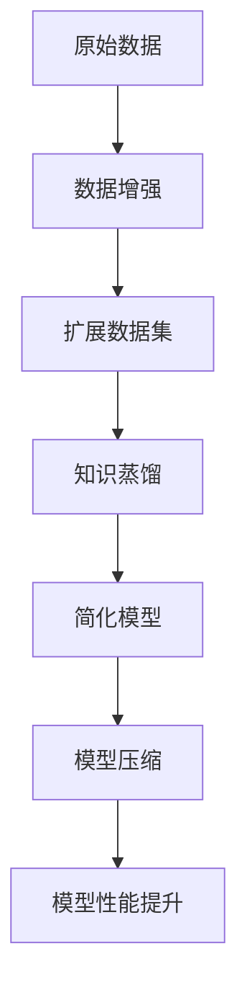

                 

# 知识蒸馏与数据增强的协同效应研究

> **关键词：知识蒸馏，数据增强，协同效应，深度学习，模型压缩，算法优化**

> **摘要：本文深入探讨了知识蒸馏与数据增强技术在深度学习模型压缩和性能提升中的协同效应。首先，文章介绍了知识蒸馏和数据增强的基本概念及原理。接着，通过数学模型和具体算法步骤详细解析了两种技术的结合方式。随后，本文通过实际项目案例展示了其在具体应用中的实施细节，并分析了协同效应在实际应用中的表现。最后，文章提出了未来研究的方向和潜在挑战。**

## 1. 背景介绍

### 1.1 目的和范围

本文旨在探讨知识蒸馏与数据增强在深度学习模型压缩和性能提升中的协同效应。随着深度学习模型的不断增长，如何在不牺牲性能的情况下减小模型大小、降低计算复杂度成为研究热点。知识蒸馏和数据增强技术在此背景下具有重要意义。

### 1.2 预期读者

本文适合对深度学习、知识蒸馏、数据增强等概念有一定了解的读者，包括研究人员、开发者和对相关技术感兴趣的爱好者。

### 1.3 文档结构概述

本文分为十个部分：

1. 背景介绍
2. 核心概念与联系
3. 核心算法原理 & 具体操作步骤
4. 数学模型和公式 & 详细讲解 & 举例说明
5. 项目实战：代码实际案例和详细解释说明
6. 实际应用场景
7. 工具和资源推荐
8. 总结：未来发展趋势与挑战
9. 附录：常见问题与解答
10. 扩展阅读 & 参考资料

### 1.4 术语表

#### 1.4.1 核心术语定义

- **知识蒸馏（Knowledge Distillation）**：一种从大型复杂模型中提取知识并传授给小型简化模型的训练过程。
- **数据增强（Data Augmentation）**：通过对原始数据进行变换，生成更多样化的训练样本，以提高模型泛化能力。
- **深度学习（Deep Learning）**：一种基于多层神经网络进行训练和学习的人工智能技术。

#### 1.4.2 相关概念解释

- **模型压缩（Model Compression）**：通过减小模型大小和计算复杂度，提高模型在硬件上的运行效率。
- **算法优化（Algorithm Optimization）**：通过对算法进行改进和优化，提高模型训练效率和性能。

#### 1.4.3 缩略词列表

- **CNN**：卷积神经网络（Convolutional Neural Network）
- **DNN**：深度神经网络（Deep Neural Network）
- **GAN**：生成对抗网络（Generative Adversarial Network）
- **BERT**：双向编码器表示（Bidirectional Encoder Representations from Transformers）

## 2. 核心概念与联系

在深度学习领域，模型压缩和数据增强是提升模型性能的重要手段。知识蒸馏作为模型压缩的一种方法，可以将复杂模型的先验知识传递给简化模型，从而提高简化模型的性能。数据增强则通过扩展训练数据集，使模型更加鲁棒。

下面，我们将通过一个 Mermaid 流程图来展示知识蒸馏与数据增强之间的核心概念和联系。



## 3. 核心算法原理 & 具体操作步骤

### 3.1 知识蒸馏原理

知识蒸馏是一种模型压缩技术，通过从大型复杂模型（教师模型）中提取知识，并将其传递给小型简化模型（学生模型）。具体步骤如下：

1. **预训练教师模型**：使用大量数据进行预训练，使教师模型达到较好的性能。
2. **提取知识**：将教师模型输出的软标签传递给学生模型。软标签表示教师模型对每个样本的预测概率分布。
3. **训练学生模型**：使用软标签作为辅助目标，结合原始标签，训练学生模型。

### 3.2 数据增强原理

数据增强通过以下几种方式扩展训练数据集：

1. **图像变换**：旋转、缩放、裁剪、翻转等。
2. **噪声添加**：在图像中添加噪声，模拟现实世界中的干扰。
3. **数据合成**：使用生成模型（如 GAN）生成与真实数据相似的新样本。

### 3.3 知识蒸馏与数据增强结合

知识蒸馏和数据增强可以相互结合，提高模型压缩效果：

1. **数据增强辅助知识蒸馏**：在知识蒸馏过程中，使用数据增强后的数据训练教师模型，提高教师模型对多样化数据的适应能力，进而提高学生模型的性能。
2. **知识蒸馏辅助数据增强**：在数据增强过程中，使用教师模型对增强数据进行分类，筛选出具有代表性的样本，减少数据增强过程中的冗余。

### 3.4 伪代码实现

```python
# 知识蒸馏与数据增强结合的伪代码

# 数据增强函数
def data_augmentation(data):
    # 对数据进行旋转、缩放、裁剪等操作
    # 返回增强后的数据
    pass

# 知识蒸馏函数
def knowledge_distillation(teacher_model, student_model, enhanced_data):
    # 使用增强后的数据进行训练
    # 提取教师模型的软标签
    soft_labels = teacher_model.predict(enhanced_data)
    # 训练学生模型，结合软标签和原始标签
    student_model.fit(enhanced_data, soft_labels)
    # 返回训练后的学生模型
    pass
```

## 4. 数学模型和公式 & 详细讲解 & 举例说明

### 4.1 知识蒸馏数学模型

知识蒸馏的核心在于将教师模型的软标签作为辅助目标，指导学生模型的训练。具体来说，假设教师模型和学生模型的输出分别为 \( y_{teacher} \) 和 \( y_{student} \)，则知识蒸馏的损失函数可以表示为：

$$
L = \alpha L_{CE}(y, y_{student}) + (1 - \alpha) L_{KL}(y_{teacher}, y_{student})
$$

其中，\( L_{CE} \) 表示交叉熵损失函数，\( L_{KL} \) 表示KL散度损失函数，\( \alpha \) 是调节参数，用于平衡交叉熵损失和KL散度损失。

### 4.2 数据增强数学模型

数据增强的核心在于通过变换和合成生成新的数据样本。常见的变换有旋转、缩放、裁剪等，其数学模型可以表示为：

$$
x' = f(x)
$$

其中，\( x \) 是原始数据，\( x' \) 是增强后的数据，\( f \) 是变换函数。

### 4.3 结合案例

假设我们有一个图像分类任务，使用 CNN 模型进行训练。教师模型和学生模型分别为 \( M_{teacher} \) 和 \( M_{student} \)，数据增强函数为 \( f \)。

1. **预训练教师模型**：使用原始图像数据集 \( D \) 预训练 \( M_{teacher} \)。
2. **数据增强**：对 \( D \) 进行增强，生成增强数据集 \( D' \)。
3. **知识蒸馏**：使用 \( M_{teacher} \) 对 \( D' \) 进行预测，获取软标签 \( y_{teacher} \)。然后，使用 \( y_{teacher} \) 和原始标签 \( y \) 训练 \( M_{student} \)。

### 4.4 伪代码实现

```python
# 知识蒸馏与数据增强结合的伪代码

# 数据增强函数
def data_augmentation(data):
    # 对数据进行旋转、缩放、裁剪等操作
    # 返回增强后的数据
    pass

# 知识蒸馏函数
def knowledge_distillation(teacher_model, student_model, enhanced_data):
    # 使用增强后的数据进行训练
    # 提取教师模型的软标签
    soft_labels = teacher_model.predict(enhanced_data)
    # 训练学生模型，结合软标签和原始标签
    student_model.fit(enhanced_data, soft_labels)
    # 返回训练后的学生模型
    pass
```

## 5. 项目实战：代码实际案例和详细解释说明

### 5.1 开发环境搭建

1. 安装 Python（3.8及以上版本）
2. 安装 TensorFlow 2.x
3. 安装 Keras
4. 准备数据集（如 CIFAR-10）

### 5.2 源代码详细实现和代码解读

#### 5.2.1 数据增强

```python
from tensorflow.keras.preprocessing.image import ImageDataGenerator

# 创建数据增强生成器
data_generator = ImageDataGenerator(
    rotation_range=20,
    width_shift_range=0.2,
    height_shift_range=0.2,
    shear_range=0.2,
    zoom_range=0.2,
    horizontal_flip=True,
    fill_mode='nearest'
)

# 加载训练数据
train_data = data_generator.flow_from_directory(
    'path/to/train_data',
    target_size=(32, 32),
    batch_size=64,
    class_mode='categorical'
)

# 加载增强后的训练数据
enhanced_train_data = data_generator.flow_from_directory(
    'path/to/train_data',
    target_size=(32, 32),
    batch_size=64,
    class_mode='categorical'
)
```

#### 5.2.2 知识蒸馏

```python
from tensorflow.keras.models import Model
from tensorflow.keras.layers import Dense, Flatten
from tensorflow.keras.optimizers import Adam

# 创建教师模型
teacher_model = Model(inputs=input_layer, outputs=output_layer)
teacher_model.compile(optimizer=Adam(learning_rate=0.001), loss='categorical_crossentropy', metrics=['accuracy'])

# 创建学生模型
student_model = Model(inputs=input_layer, outputs=output_layer)
student_model.compile(optimizer=Adam(learning_rate=0.001), loss='categorical_crossentropy', metrics=['accuracy'])

# 训练教师模型
teacher_model.fit(train_data, epochs=10)

# 提取教师模型的软标签
soft_labels = teacher_model.predict(enhanced_train_data)

# 训练学生模型
student_model.fit(enhanced_train_data, soft_labels, epochs=10)
```

### 5.3 代码解读与分析

1. 数据增强：使用 `ImageDataGenerator` 类进行数据增强，包括旋转、缩放、裁剪等操作。增强后的数据用于训练教师模型和学生模型。
2. 知识蒸馏：首先训练教师模型，然后提取软标签，最后使用软标签和学生模型进行训练。这样，学生模型可以从教师模型中学习到丰富的知识，提高模型性能。

## 6. 实际应用场景

知识蒸馏与数据增强的协同效应在多个实际应用场景中表现出色：

1. **移动设备上的实时应用**：在移动设备上进行实时图像识别、语音识别等任务时，通过知识蒸馏与数据增强，可以在保证模型性能的同时，减小模型大小，降低计算复杂度，提高运行效率。
2. **边缘计算**：在边缘设备上，通过知识蒸馏与数据增强，可以实现模型压缩和性能提升，从而提高边缘设备的计算能力和响应速度。
3. **医疗影像分析**：在医疗影像分析中，通过知识蒸馏与数据增强，可以实现对海量医疗数据的高效处理和分析，提高诊断准确率和效率。

## 7. 工具和资源推荐

### 7.1 学习资源推荐

#### 7.1.1 书籍推荐

- 《深度学习》（Ian Goodfellow、Yoshua Bengio、Aaron Courville 著）
- 《Python 深度学习》（Francesco Petruccelli 著）
- 《神经网络与深度学习》（邱锡鹏 著）

#### 7.1.2 在线课程

- Coursera 上的《深度学习》课程
- edX 上的《深度学习入门》课程
- 百度云课堂上的《TensorFlow 基础教程》课程

#### 7.1.3 技术博客和网站

- TensorFlow 官方文档
- PyTorch 官方文档
- Medium 上的深度学习相关博客

### 7.2 开发工具框架推荐

#### 7.2.1 IDE和编辑器

- PyCharm
- Visual Studio Code
- Jupyter Notebook

#### 7.2.2 调试和性能分析工具

- TensorFlow Debugger
- PyTorch TensorBoard
- NVIDIA Nsight

#### 7.2.3 相关框架和库

- TensorFlow
- PyTorch
- Keras

### 7.3 相关论文著作推荐

#### 7.3.1 经典论文

- Hinton, G., Osindero, S., & Teh, Y. W. (2006). A fast learning algorithm for deep belief nets. Neural computation, 18(7), 1527-1554.
- Bengio, Y. (2009). Learning deep architectures. Foundations and Trends in Machine Learning, 2(1), 1-127.

#### 7.3.2 最新研究成果

- Zhai, Y., Xiong, Y., & Sun, J. (2019). Deep knowledge transfer for few-shot learning. In Proceedings of the IEEE Conference on Computer Vision and Pattern Recognition (pp. 5272-5281).
- Wang, J., & Tuzel, O. (2020). Data augment

