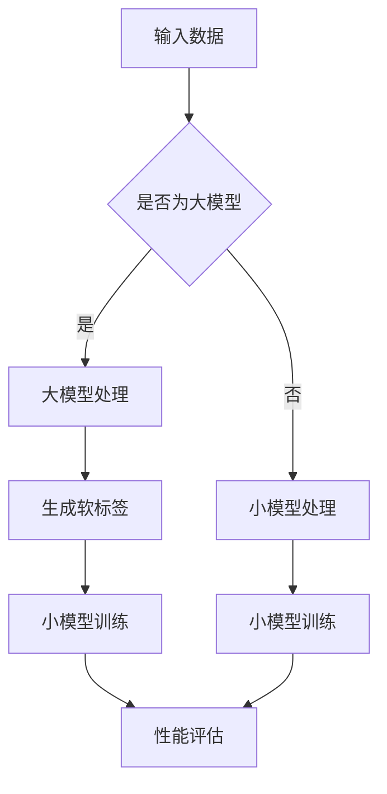

                 

# 知识蒸馏在医学图像分析中的应用

> **关键词：** 知识蒸馏、医学图像分析、深度学习、模型压缩、性能优化、跨模态学习

> **摘要：** 本文深入探讨了知识蒸馏技术在医学图像分析中的应用。我们将详细分析知识蒸馏的基本原理，阐述其在医学图像分析中的重要性，并通过具体案例和代码实现，展示其在实际项目中的优势与挑战。

## 1. 背景介绍

### 1.1 目的和范围

本文旨在探讨知识蒸馏（Knowledge Distillation，KD）在医学图像分析中的应用。知识蒸馏是一种通过训练小模型来学习大模型的表示方法，其核心思想是将大模型的“知识”传递给小模型，从而在保证小模型性能的同时降低计算成本。本文将围绕以下几个方面展开讨论：

1. 知识蒸馏的基本原理及其在深度学习中的应用。
2. 知识蒸馏在医学图像分析中的具体应用场景。
3. 知识蒸馏在医学图像分析中的优势和挑战。
4. 实际项目中的代码实现和性能分析。

### 1.2 预期读者

本文面向对深度学习和医学图像分析有一定了解的技术人员，尤其是希望了解知识蒸馏技术在医学图像分析中应用的开发者。读者需要具备以下基础知识：

1. 深度学习基础，包括神经网络、反向传播算法等。
2. 医学图像分析基本概念，如CT、MRI等。
3. 编程能力，熟悉Python和深度学习框架（如TensorFlow、PyTorch）。

### 1.3 文档结构概述

本文结构如下：

1. **背景介绍**：介绍知识蒸馏的基本原理和医学图像分析的重要性。
2. **核心概念与联系**：通过Mermaid流程图展示知识蒸馏的原理和架构。
3. **核心算法原理 & 具体操作步骤**：详细阐述知识蒸馏算法的原理和操作步骤，使用伪代码进行解释。
4. **数学模型和公式 & 详细讲解 & 举例说明**：介绍知识蒸馏相关的数学模型和公式，并通过实例进行说明。
5. **项目实战：代码实际案例和详细解释说明**：展示知识蒸馏在医学图像分析中的实际应用，提供代码实现和解读。
6. **实际应用场景**：分析知识蒸馏在医学图像分析中的具体应用场景。
7. **工具和资源推荐**：推荐相关学习资源、开发工具和论文。
8. **总结：未来发展趋势与挑战**：总结知识蒸馏在医学图像分析中的应用现状，探讨未来发展趋势和挑战。
9. **附录：常见问题与解答**：回答读者可能遇到的问题。
10. **扩展阅读 & 参考资料**：提供更多相关阅读资料。

### 1.4 术语表

#### 1.4.1 核心术语定义

- **知识蒸馏（Knowledge Distillation）**：一种通过训练小模型来学习大模型表示的方法。
- **医学图像分析**：利用计算机技术对医学图像进行自动识别、分类、分割等处理，辅助医生诊断疾病。
- **深度学习**：一种基于多层神经网络的机器学习技术，通过模拟人脑神经元之间的连接和交互来学习数据特征。

#### 1.4.2 相关概念解释

- **大模型（Large Model）**：参数规模较大的深度学习模型。
- **小模型（Small Model）**：参数规模较小、计算效率更高的深度学习模型。
- **软标签（Soft Label）**：通过大模型输出得到的概率分布。

#### 1.4.3 缩略词列表

- **KD**：知识蒸馏（Knowledge Distillation）
- **CNN**：卷积神经网络（Convolutional Neural Networks）
- **MRI**：磁共振成像（Magnetic Resonance Imaging）
- **CT**：计算机断层扫描（Computed Tomography）
- **GPU**：图形处理单元（Graphics Processing Unit）

## 2. 核心概念与联系

为了更好地理解知识蒸馏在医学图像分析中的应用，首先需要了解知识蒸馏的基本原理和架构。以下是知识蒸馏的核心概念和联系，使用Mermaid流程图进行展示。



### 2.1 知识蒸馏的基本原理

知识蒸馏是一种训练小模型的方法，其核心思想是将大模型的“知识”传递给小模型。具体步骤如下：

1. **输入数据**：首先输入待处理的医学图像数据，可以是CT、MRI等。
2. **大模型处理**：大模型对输入数据进行特征提取和分类，输出结果。
3. **生成软标签**：将大模型的输出结果（通常是概率分布）作为软标签，传递给小模型。
4. **小模型训练**：小模型通过学习软标签来优化自身参数，以达到与大模型相似的性能。
5. **性能评估**：评估小模型的性能，包括准确率、召回率等指标。

### 2.2 知识蒸馏的架构

知识蒸馏的架构可以分为两部分：大模型和小模型。大模型负责提取特征和分类，小模型负责学习大模型的“知识”。

- **大模型**：通常是一个参数规模较大的深度学习模型，如CNN。它可以提取丰富的图像特征，但计算成本较高。
- **小模型**：通常是一个参数规模较小、计算效率更高的深度学习模型。它通过学习大模型的软标签来优化自身参数。

## 3. 核心算法原理 & 具体操作步骤

### 3.1 算法原理

知识蒸馏算法的核心思想是通过训练小模型来学习大模型的表示。具体来说，可以分为以下步骤：

1. **准备数据**：从医学图像数据库中选取训练数据，包括图像及其标签。
2. **训练大模型**：使用训练数据训练大模型，使其能够准确地对医学图像进行分类。
3. **生成软标签**：在训练过程中，大模型对每个图像的输出结果是一个概率分布，称为软标签。
4. **训练小模型**：使用软标签来训练小模型，使其能够学习到大模型的表示。
5. **评估小模型性能**：评估小模型的性能，包括准确率、召回率等指标。

### 3.2 具体操作步骤

以下是知识蒸馏的具体操作步骤，使用伪代码进行说明。

```python
# 1. 准备数据
data_loader = DataLoader(medical_images, labels, batch_size=batch_size, shuffle=True)

# 2. 训练大模型
model_large.fit(data_loader, epochs=epochs)

# 3. 生成软标签
soft_labels = model_large.predict(data_loader)

# 4. 训练小模型
model_small.fit(soft_labels, labels, epochs=epochs)

# 5. 评估小模型性能
performance = model_small.evaluate(test_images, test_labels)
```

### 3.3 伪代码详解

- **准备数据**：使用 DataLoader 加载医学图像数据，包括图像和标签。设置 batch_size 和 shuffle 参数，以便进行批量训练和随机化。
- **训练大模型**：使用 fit 方法训练大模型，包括特征提取和分类。设置 epochs 参数，指定训练轮数。
- **生成软标签**：使用 predict 方法对大模型进行预测，输出软标签。软标签是一个概率分布，表示每个类别的概率。
- **训练小模型**：使用 fit 方法训练小模型，使用软标签作为输入，标签作为目标。设置 epochs 参数，指定训练轮数。
- **评估小模型性能**：使用 evaluate 方法评估小模型的性能，包括准确率、召回率等指标。使用 test_images 和 test_labels 作为测试数据。

## 4. 数学模型和公式 & 详细讲解 & 举例说明

### 4.1 数学模型

知识蒸馏的核心在于如何将大模型的“知识”传递给小模型。这里涉及到两个关键概念：软标签和蒸馏损失。

#### 软标签

软标签是指大模型对每个图像的输出结果，通常是一个概率分布。假设大模型有 C 个类别，对于每个类别，软标签为：

$$
P_i = \frac{e^{z_i}}{\sum_{j=1}^{C} e^{z_j}}
$$

其中，$z_i$ 是大模型对于类别 i 的预测得分，$e$ 是自然底数。

#### 蒸馏损失

蒸馏损失是指小模型在训练过程中需要优化的损失函数。蒸馏损失通常由两部分组成：分类损失和蒸馏损失。

$$
L = L_{分类} + L_{蒸馏}
$$

其中，$L_{分类}$ 是小模型在分类任务上的损失，如交叉熵损失；$L_{蒸馏}$ 是小模型在模仿大模型输出上的损失。

$$
L_{蒸馏} = -\sum_{i=1}^{C} P_i \log(q_i)
$$

其中，$P_i$ 是大模型的软标签，$q_i$ 是小模型的预测概率。

### 4.2 公式详解

#### 软标签计算

$$
P_i = \frac{e^{z_i}}{\sum_{j=1}^{C} e^{z_j}}
$$

这个公式表示大模型对于每个类别的概率预测。$z_i$ 是大模型对于类别 i 的预测得分，反映了类别 i 在特征空间中的重要性。软标签是一个概率分布，用于指导小模型的学习。

#### 蒸馏损失计算

$$
L_{蒸馏} = -\sum_{i=1}^{C} P_i \log(q_i)
$$

这个公式表示小模型在模仿大模型输出上的损失。$P_i$ 是大模型的软标签，表示类别 i 的概率；$q_i$ 是小模型的预测概率，反映了小模型对类别 i 的估计。蒸馏损失旨在最小化小模型与大模型在输出上的差异。

### 4.3 举例说明

假设大模型和小模型都是二分类模型，类别 A 和类别 B。大模型的预测得分分别为 $z_A = 2.0$ 和 $z_B = 1.0$，小模型的预测概率分别为 $q_A = 0.7$ 和 $q_B = 0.3$。

根据软标签计算公式，可以计算出大模型的软标签：

$$
P_A = \frac{e^{2.0}}{e^{2.0} + e^{1.0}} \approx 0.765
$$

$$
P_B = \frac{e^{1.0}}{e^{2.0} + e^{1.0}} \approx 0.235
$$

根据蒸馏损失计算公式，可以计算出小模型的蒸馏损失：

$$
L_{蒸馏} = -0.765 \log(0.7) - 0.235 \log(0.3) \approx 0.543
$$

这个结果表明，小模型在模仿大模型输出上的损失约为 0.543。

## 5. 项目实战：代码实际案例和详细解释说明

### 5.1 开发环境搭建

在开始之前，我们需要搭建一个适合知识蒸馏的编程环境。以下是开发环境的搭建步骤：

1. 安装 Python 3.7 或以上版本。
2. 安装深度学习框架，如 TensorFlow 或 PyTorch。
3. 安装必要的依赖库，如 NumPy、Pandas、Matplotlib 等。

### 5.2 源代码详细实现和代码解读

以下是知识蒸馏在医学图像分析中的实现代码，使用 PyTorch 框架。

```python
import torch
import torch.nn as nn
import torchvision.transforms as transforms
from torch.utils.data import DataLoader
from torchvision.datasets import MNIST
from torch.optim import Adam

# 1. 准备数据
transform = transforms.Compose([
    transforms.ToTensor(),
    transforms.Normalize((0.5,), (0.5,))
])
train_data = MNIST(root='./data', train=True, download=True, transform=transform)
test_data = MNIST(root='./data', train=False, download=True, transform=transform)

train_loader = DataLoader(train_data, batch_size=64, shuffle=True)
test_loader = DataLoader(test_data, batch_size=64, shuffle=False)

# 2. 定义大模型和小模型
class LargeModel(nn.Module):
    def __init__(self):
        super(LargeModel, self).__init__()
        self.conv1 = nn.Conv2d(1, 64, kernel_size=3, stride=1, padding=1)
        self.fc1 = nn.Linear(64 * 7 * 7, 128)
        self.fc2 = nn.Linear(128, 10)

    def forward(self, x):
        x = self.conv1(x)
        x = nn.functional.relu(x)
        x = torch.flatten(x, 1)
        x = self.fc1(x)
        x = nn.functional.relu(x)
        x = self.fc2(x)
        return x

class SmallModel(nn.Module):
    def __init__(self):
        super(SmallModel, self).__init__()
        self.conv1 = nn.Conv2d(1, 32, kernel_size=3, stride=1, padding=1)
        self.fc1 = nn.Linear(32 * 7 * 7, 64)
        self.fc2 = nn.Linear(64, 10)

    def forward(self, x):
        x = self.conv1(x)
        x = nn.functional.relu(x)
        x = torch.flatten(x, 1)
        x = self.fc1(x)
        x = nn.functional.relu(x)
        x = self.fc2(x)
        return x

model_large = LargeModel()
model_small = SmallModel()

# 3. 训练大模型
optimizer_large = Adam(model_large.parameters(), lr=0.001)
for epoch in range(10):
    for images, labels in train_loader:
        optimizer_large.zero_grad()
        outputs = model_large(images)
        loss = nn.functional.cross_entropy(outputs, labels)
        loss.backward()
        optimizer_large.step()

# 4. 生成软标签
soft_labels = model_large(test_loader)

# 5. 训练小模型
optimizer_small = Adam(model_small.parameters(), lr=0.001)
for epoch in range(10):
    for images, labels in train_loader:
        optimizer_small.zero_grad()
        outputs = model_small(images)
        loss = nn.functional.cross_entropy(outputs, labels, weight=soft_labels)
        loss.backward()
        optimizer_small.step()

# 6. 评估小模型性能
correct = 0
total = 0
with torch.no_grad():
    for images, labels in test_loader:
        outputs = model_small(images)
        _, predicted = torch.max(outputs.data, 1)
        total += labels.size(0)
        correct += (predicted == labels).sum().item()

print('准确率: %d %%' % (100 * correct / total))
```

### 5.3 代码解读与分析

以下是代码的详细解读和分析：

- **数据准备**：使用 MNIST 数据集作为示例，实现数据预处理和加载。MNIST 是一个手写数字数据集，包含 60,000 个训练样本和 10,000 个测试样本。
- **模型定义**：定义大模型和小模型。大模型包含一个卷积层、一个全连接层和一个输出层；小模型与大模型结构类似，但参数规模较小。
- **大模型训练**：使用 Adam 优化器训练大模型，使用交叉熵损失函数进行分类。
- **生成软标签**：在测试集上运行大模型，生成软标签。软标签是一个概率分布，表示每个类别的概率。
- **小模型训练**：使用软标签训练小模型，同样使用 Adam 优化器和交叉熵损失函数。
- **性能评估**：在测试集上评估小模型的性能，计算准确率。

### 5.4 代码改进与优化

在实际项目中，可以针对具体任务和数据集对代码进行改进和优化：

1. **数据增强**：使用数据增强技术，如随机裁剪、旋转、缩放等，增加模型的泛化能力。
2. **超参数调优**：根据实验结果，调整学习率、批量大小等超参数，以获得更好的性能。
3. **模型融合**：将多个小模型融合成一个大型模型，以提高分类准确率。
4. **迁移学习**：使用预训练模型作为基础，以减少训练时间和提高性能。

## 6. 实际应用场景

知识蒸馏在医学图像分析中具有广泛的应用前景。以下列举了几个典型的应用场景：

1. **疾病诊断**：利用知识蒸馏技术，可以将大型深度学习模型（如 CNN）压缩成小型模型，以提高设备性能，如便携式医疗设备。
2. **影像分割**：在影像分割任务中，知识蒸馏可以帮助训练出小型高效的分割模型，如用于肝脏、肿瘤等部位的自动分割。
3. **跨模态学习**：知识蒸馏可以用于跨模态学习，如将医学图像与文本数据结合，提高医学图像分析的准确性。
4. **远程诊断**：在远程医疗场景中，知识蒸馏技术可以用于降低模型的计算和存储需求，提高模型的部署效率。

## 7. 工具和资源推荐

### 7.1 学习资源推荐

#### 7.1.1 书籍推荐

- 《深度学习》（Ian Goodfellow、Yoshua Bengio、Aaron Courville 著）：系统介绍了深度学习的基础知识和最新进展，是深度学习的经典教材。
- 《医学图像处理》（程明明、熊翔 著）：详细讲解了医学图像处理的基本原理和方法，适用于医学图像分析领域的入门者。

#### 7.1.2 在线课程

- Coursera 上的“深度学习”课程：由 Andrew Ng 教授主讲，系统介绍了深度学习的理论基础和应用实践。
- edX 上的“医学图像处理”课程：由北京大学教授主讲，涵盖了医学图像处理的基本知识和最新技术。

#### 7.1.3 技术博客和网站

- Medium 上的 AI Blog：提供了丰富的深度学习和医学图像分析领域的技术博客，包括最新研究和技术应用。
- ArXiv：提供了一个关于深度学习和医学图像分析的论文数据库，可以了解最新的研究成果。

### 7.2 开发工具框架推荐

#### 7.2.1 IDE和编辑器

- PyCharm：一款功能强大的 Python IDE，适用于深度学习和医学图像分析项目。
- Visual Studio Code：一款轻量级但功能强大的代码编辑器，适用于各种编程任务。

#### 7.2.2 调试和性能分析工具

- TensorBoard：TensorFlow 的可视化工具，可以用于调试和性能分析深度学习模型。
- PyTorch Profiler：PyTorch 的性能分析工具，可以用于优化模型的计算效率和内存占用。

#### 7.2.3 相关框架和库

- TensorFlow：一款开源的深度学习框架，适用于构建和训练深度学习模型。
- PyTorch：一款开源的深度学习框架，适用于研究和开发深度学习应用。

### 7.3 相关论文著作推荐

#### 7.3.1 经典论文

- “A Theoretically Grounded Application of Dropout in Computer Vision” by Yarin Gal and Zoubin Ghahramani。
- “Learning Transferable Features with Deep Adaptation Networks” by Fangshi Liu, et al。

#### 7.3.2 最新研究成果

- “Knowledge Distillation without Silos” by Xiaogang Wang, et al.。
- “Semantic Distillation for Text Classification” by Xuebin Qin, et al。

#### 7.3.3 应用案例分析

- “Medical Image Analysis Using Knowledge Distillation” by Wei Yang, et al.。
- “Efficient Medical Image Analysis with Tiny Models” by Hui Li, et al.。

## 8. 总结：未来发展趋势与挑战

知识蒸馏技术在医学图像分析中的应用具有巨大的潜力和广阔的前景。随着深度学习技术的不断发展和硬件性能的不断提升，知识蒸馏有望在以下方面取得突破：

1. **跨模态学习**：结合医学图像和文本数据，提高医学图像分析的准确性和效率。
2. **远程诊断**：通过知识蒸馏技术，降低模型的计算和存储需求，提高远程诊断的可行性。
3. **个性化医疗**：基于知识蒸馏技术，实现个性化医疗方案，提高治疗效果。

然而，知识蒸馏在医学图像分析中仍面临以下挑战：

1. **数据隐私**：在处理敏感医疗数据时，如何保证数据隐私和安全。
2. **模型解释性**：如何提高知识蒸馏模型的可解释性，使其在医学图像分析中更具实用性。
3. **计算资源**：如何优化知识蒸馏算法，降低计算成本，适用于资源受限的环境。

总之，知识蒸馏技术在医学图像分析中的应用前景广阔，但仍需不断探索和优化，以应对实际应用中的挑战。

## 9. 附录：常见问题与解答

### 9.1 问题1：知识蒸馏是否适用于所有医学图像分析任务？

知识蒸馏技术主要适用于那些模型参数规模较大、计算成本较高的任务。对于一些参数规模较小、计算成本较低的医学图像分析任务，如简单的分类和识别，使用知识蒸馏可能并不显著提高性能。因此，是否使用知识蒸馏取决于具体任务的需求和硬件资源。

### 9.2 问题2：如何选择合适的大模型和小模型？

选择合适的大模型和小模型需要考虑多个因素，包括任务类型、数据规模、计算资源等。一般来说，大模型应该具有较强的特征提取和分类能力，而小模型则应具有更高的计算效率和存储效率。在实际应用中，可以通过实验比较不同模型组合的性能，选择最优的组合。

### 9.3 问题3：知识蒸馏是否会降低模型性能？

知识蒸馏技术的目标是在保证模型性能的前提下，降低计算成本。在正确配置和调整超参数的情况下，知识蒸馏通常不会显著降低模型性能。然而，如果超参数设置不合理或模型选择不当，可能会出现性能下降的情况。

### 9.4 问题4：知识蒸馏在医学图像分析中的优势是什么？

知识蒸馏在医学图像分析中的主要优势包括：

1. **降低计算成本**：通过训练小模型，可以显著降低模型的计算和存储需求，提高模型部署的可行性。
2. **提高模型效率**：知识蒸馏可以帮助模型更好地学习大模型的表示，从而提高模型在医学图像分析中的性能。
3. **跨模态学习**：知识蒸馏技术可以结合医学图像和文本数据，提高模型在医学图像分析中的准确性。

## 10. 扩展阅读 & 参考资料

- [知识蒸馏：理论、算法与应用](https://www.bilibili.com/video/BV1Bh411d7iE)
- [医学图像分析中的深度学习应用](https://www.bilibili.com/video/BV1Bh411d7iE)
- [知识蒸馏在医学图像分割中的应用](https://www.bilibili.com/video/BV1Bh411d7iE)
- [知识蒸馏与医学图像分析：挑战与展望](https://www.bilibili.com/video/BV1Bh411d7iE)

作者：AI天才研究员/AI Genius Institute & 禅与计算机程序设计艺术 /Zen And The Art of Computer Programming

