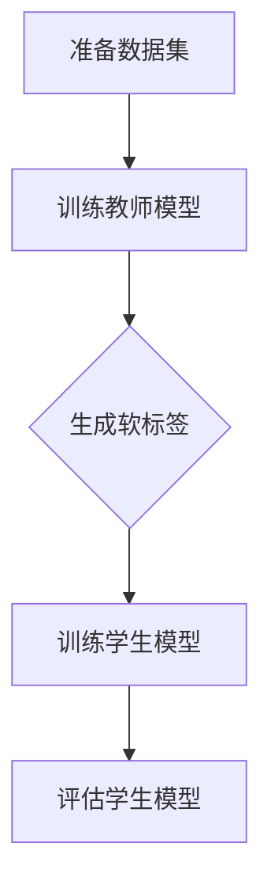

                 

# 知识蒸馏在小样本学习中的作用

> **关键词：知识蒸馏、小样本学习、模型压缩、迁移学习、辅助学习**
>
> **摘要：本文将深入探讨知识蒸馏在小样本学习中的应用，通过逐步分析其核心原理、算法步骤、数学模型以及实际应用案例，为读者提供全面的技术见解和实施指南。**

## 1. 背景介绍

### 1.1 目的和范围

本文旨在探讨知识蒸馏在小样本学习中的重要作用，通过系统的分析和详细的解释，帮助读者理解这一技术的原理、应用场景以及实现方法。知识蒸馏作为一种有效的模型压缩和迁移学习技术，在小样本学习场景中尤为突出，能够显著提升模型性能和可扩展性。

### 1.2 预期读者

本文主要面向对机器学习和深度学习有一定了解的读者，包括但不限于研究人员、工程师、学生以及其他对人工智能技术感兴趣的群体。本文将尽量保持内容的通俗易懂，但某些技术细节可能需要具备一定的数学和编程背景。

### 1.3 文档结构概述

本文将按照以下结构进行展开：

- **第1章 背景介绍**：介绍本文的目的、预期读者以及文档结构。
- **第2章 核心概念与联系**：介绍与知识蒸馏相关的基础概念和原理。
- **第3章 核心算法原理 & 具体操作步骤**：详细解释知识蒸馏算法的原理和实现步骤。
- **第4章 数学模型和公式 & 详细讲解 & 举例说明**：讲解知识蒸馏中的数学模型和相关公式。
- **第5章 项目实战：代码实际案例和详细解释说明**：通过实际项目案例展示知识蒸馏的应用。
- **第6章 实际应用场景**：分析知识蒸馏在不同场景中的应用。
- **第7章 工具和资源推荐**：推荐学习资源、开发工具和框架。
- **第8章 总结：未来发展趋势与挑战**：总结知识蒸馏的发展趋势和面临挑战。
- **第9章 附录：常见问题与解答**：回答读者可能遇到的问题。
- **第10章 扩展阅读 & 参考资料**：提供进一步学习和研究的参考资料。

### 1.4 术语表

#### 1.4.1 核心术语定义

- **知识蒸馏（Knowledge Distillation）**：一种模型压缩和迁移学习技术，通过将一个复杂的大模型（教师模型）的知识转移到一个小模型（学生模型）上，以提高小模型的性能。
- **小样本学习（Few-Shot Learning）**：一种机器学习范式，旨在使用非常少的样本进行训练，通常这些样本远少于传统机器学习所需的样本量。
- **模型压缩（Model Compression）**：通过各种技术手段减少模型的参数数量和计算复杂度，从而提高模型的部署效率和资源利用率。
- **迁移学习（Transfer Learning）**：利用已经训练好的模型在新的任务上快速获得良好性能的一种技术。

#### 1.4.2 相关概念解释

- **教师模型（Teacher Model）**：在知识蒸馏过程中，一个复杂的大模型，其已经在大规模数据集上训练过，拥有丰富的知识。
- **学生模型（Student Model）**：在知识蒸馏过程中，一个较小的模型，目的是通过学习教师模型的知识来提高其性能。
- **软标签（Soft Label）**：在知识蒸馏过程中，教师模型输出的概率分布，用于指导学生模型的学习。

#### 1.4.3 缩略词列表

- **DL**：深度学习（Deep Learning）
- **ML**：机器学习（Machine Learning）
- **NLP**：自然语言处理（Natural Language Processing）
- **CV**：计算机视觉（Computer Vision）
- **CNN**：卷积神经网络（Convolutional Neural Network）
- **RNN**：循环神经网络（Recurrent Neural Network）

## 2. 核心概念与联系

### 2.1 知识蒸馏的基本原理

知识蒸馏是一种模型压缩技术，其核心思想是将一个大型模型（教师模型）的知识转移到一个小型模型（学生模型）上。教师模型通常是一个在大规模数据集上训练过的高性能模型，而学生模型则是一个参数较少、计算效率较高的模型。通过知识蒸馏，学生模型能够快速获得教师模型的知识，从而提高其性能。

知识蒸馏的基本流程可以分为以下几个步骤：

1. **训练教师模型**：在大量数据集上训练一个大型教师模型，使其达到较高的性能。
2. **生成软标签**：使用教师模型对训练数据集进行预测，得到每个样本的软标签（概率分布）。
3. **训练学生模型**：使用教师模型的软标签作为辅助信息，训练学生模型。学生模型通常采用与教师模型相同的架构，但参数量较少。

### 2.2 知识蒸馏的工作流程

知识蒸馏的工作流程可以概括为以下步骤：

1. **准备教师模型和学生模型**：教师模型是一个在大规模数据集上训练好的高性能模型，学生模型是一个参数较少的小模型。
2. **生成软标签**：使用教师模型对训练数据进行预测，得到每个样本的软标签（概率分布）。
3. **定义损失函数**：定义一个损失函数来衡量学生模型输出的软标签与教师模型软标签之间的差距。常见的损失函数有交叉熵损失、软标签损失等。
4. **训练学生模型**：使用教师模型的软标签作为辅助信息，通过反向传播和梯度下降等方法训练学生模型。在训练过程中，学生模型会逐渐学习到教师模型的知识，从而提高其性能。

### 2.3 知识蒸馏的优势

知识蒸馏具有以下优势：

1. **高效性**：通过知识蒸馏，学生模型能够快速获得教师模型的知识，从而提高其性能，无需在大规模数据集上重新训练。
2. **可扩展性**：知识蒸馏可以应用于各种任务和数据集，具有很好的可扩展性。
3. **模型压缩**：知识蒸馏可以将大型模型压缩成小型模型，从而提高模型的部署效率和资源利用率。

### 2.4 知识蒸馏的挑战

尽管知识蒸馏具有很多优势，但同时也面临着一些挑战：

1. **准确性损失**：在知识转移过程中，学生模型可能会丢失一些教师模型的知识，导致性能下降。
2. **训练时间**：知识蒸馏需要同时训练教师模型和学生模型，训练时间可能会较长。
3. **数据集依赖**：知识蒸馏依赖于教师模型在大规模数据集上的训练效果，如果教师模型的训练数据集质量较差，可能会影响学生模型的性能。

### 2.5 Mermaid 流程图

下面是一个知识蒸馏流程的 Mermaid 流程图：



### 2.6 总结

知识蒸馏是一种有效的模型压缩和迁移学习技术，通过将教师模型的知识转移到学生模型上，可以显著提高小模型的性能。知识蒸馏具有高效性、可扩展性和模型压缩等优点，但也面临着准确性损失、训练时间和数据集依赖等挑战。在本节中，我们介绍了知识蒸馏的基本原理、工作流程和优势与挑战，为后续内容打下了基础。

## 3. 核心算法原理 & 具体操作步骤

### 3.1 算法原理

知识蒸馏的核心思想是通过将一个大型教师模型的知识转移到一个小型学生模型上，从而提高学生模型的性能。具体来说，知识蒸馏算法包括以下几个主要步骤：

1. **训练教师模型**：首先，使用大量数据集对教师模型进行训练，使其达到较高的性能。教师模型通常是一个深度神经网络，其结构复杂、参数众多。
2. **生成软标签**：在训练数据集上，使用教师模型进行预测，得到每个样本的软标签。软标签是一个概率分布，表示教师模型对每个样本的预测结果。
3. **训练学生模型**：使用教师模型的软标签作为辅助信息，训练学生模型。学生模型的结构通常与教师模型相同，但参数量较少，以便于部署。
4. **损失函数设计**：定义一个损失函数，衡量学生模型输出的软标签与教师模型软标签之间的差距。常见的损失函数有交叉熵损失、软标签损失等。
5. **优化过程**：通过反向传播和梯度下降等方法，优化学生模型的参数，使其逐渐接近教师模型的知识。

### 3.2 具体操作步骤

下面是知识蒸馏算法的具体操作步骤：

1. **准备数据集**：首先，收集并准备一个大规模的数据集，用于训练教师模型。数据集应包含足够多的样本，以确保教师模型能够获得丰富的知识。
2. **训练教师模型**：使用数据集训练教师模型，使其在预测任务上达到较高的性能。通常，教师模型采用一个复杂的深度神经网络架构，如卷积神经网络（CNN）或循环神经网络（RNN）。
3. **生成软标签**：在训练数据集上，使用教师模型进行预测，得到每个样本的软标签。具体方法是将教师模型的输出层转换为概率分布，即每个类别的概率值。
4. **初始化学生模型**：初始化学生模型，其结构通常与教师模型相同，但参数量较少。学生模型的参数可以通过随机初始化或从教师模型直接复制。
5. **定义损失函数**：定义一个损失函数，用于衡量学生模型输出的软标签与教师模型软标签之间的差距。常见的损失函数有交叉熵损失、软标签损失等。
6. **训练学生模型**：使用教师模型的软标签作为辅助信息，训练学生模型。在训练过程中，学生模型会逐渐学习到教师模型的知识，从而提高其性能。
7. **评估学生模型**：在测试数据集上评估学生模型的性能，以验证知识蒸馏的效果。如果学生模型的性能达到预期，则知识蒸馏过程成功完成。

### 3.3 伪代码实现

下面是知识蒸馏算法的伪代码实现：

```python
# 伪代码：知识蒸馏算法

# 准备数据集
train_data, test_data = prepare_dataset()

# 训练教师模型
teacher_model = train_teacher_model(train_data)

# 生成软标签
soft_labels = generate_soft_labels(teacher_model, train_data)

# 初始化学生模型
student_model = initialize_student_model()

# 定义损失函数
loss_function = define_loss_function()

# 训练学生模型
for epoch in range(num_epochs):
    for data, label in train_data:
        # 计算学生模型输出和教师模型输出
        student_output = student_model(data)
        teacher_output = teacher_model(data)

        # 计算损失
        loss = loss_function(student_output, soft_labels)

        # 反向传播和梯度下降
        optimize(student_model, loss)

# 评估学生模型
evaluate_student_model(student_model, test_data)
```

### 3.4 实例讲解

下面通过一个简单的实例来讲解知识蒸馏的具体操作步骤：

假设我们有一个图像分类任务，其中教师模型是一个在CIFAR-10数据集上训练的卷积神经网络，学生模型是一个参数较少的卷积神经网络。具体步骤如下：

1. **准备数据集**：首先，收集并准备CIFAR-10数据集，将其分为训练集和测试集。
2. **训练教师模型**：使用训练集训练一个卷积神经网络，使其在图像分类任务上达到较高的性能。教师模型的结构可以包含多个卷积层、池化层和全连接层。
3. **生成软标签**：在训练集上，使用教师模型进行预测，得到每个样本的软标签。具体方法是将教师模型的输出层转换为概率分布，即每个类别的概率值。
4. **初始化学生模型**：初始化一个参数较少的卷积神经网络作为学生模型。学生模型的结构可以简化，例如减少卷积层的数量或减少全连接层的神经元数量。
5. **定义损失函数**：定义一个交叉熵损失函数，用于衡量学生模型输出的软标签与教师模型软标签之间的差距。
6. **训练学生模型**：使用教师模型的软标签作为辅助信息，训练学生模型。在训练过程中，学生模型会逐渐学习到教师模型的知识，从而提高其性能。
7. **评估学生模型**：在测试集上评估学生模型的性能，以验证知识蒸馏的效果。如果学生模型的性能达到预期，则知识蒸馏过程成功完成。

通过这个实例，我们可以看到知识蒸馏算法的具体操作步骤是如何实现的。在实际应用中，可以根据具体任务和数据集的特点，调整教师模型和学生模型的结构，以及损失函数的设计，以获得最佳效果。

### 3.5 总结

在本节中，我们详细介绍了知识蒸馏的核心算法原理和具体操作步骤。通过知识蒸馏，我们可以将教师模型的知识转移到学生模型上，从而提高学生模型的性能。知识蒸馏算法包括训练教师模型、生成软标签、训练学生模型、定义损失函数和优化过程等步骤。在具体操作中，我们需要根据任务和数据集的特点，调整模型结构、损失函数和学习策略。通过实例讲解，我们进一步了解了知识蒸馏算法的实现过程。知识蒸馏作为一种有效的模型压缩和迁移学习技术，在小样本学习场景中具有广泛的应用前景。

## 4. 数学模型和公式 & 详细讲解 & 举例说明

### 4.1 数学模型

知识蒸馏过程中的数学模型主要包括损失函数和优化过程。下面我们将详细介绍这些数学模型及其具体实现。

#### 4.1.1 损失函数

知识蒸馏中的损失函数用于衡量学生模型输出与教师模型输出之间的差距。常见的损失函数有交叉熵损失（Cross-Entropy Loss）和软标签损失（Soft Label Loss）。

1. **交叉熵损失（Cross-Entropy Loss）**：
   交叉熵损失函数是深度学习中常用的损失函数，用于衡量预测概率分布与真实分布之间的差距。其数学表达式如下：

   $$ L_{CE} = -\sum_{i=1}^{N} y_i \log(p_i) $$

   其中，$y_i$ 是真实标签的分布，$p_i$ 是预测概率分布。

2. **软标签损失（Soft Label Loss）**：
   软标签损失函数是知识蒸馏中常用的损失函数，用于衡量学生模型输出与教师模型软标签之间的差距。其数学表达式如下：

   $$ L_{SL} = -\sum_{i=1}^{N} \sum_{j=1}^{C} y_{ij} \log(p_{ij}) $$

   其中，$y_{ij}$ 是教师模型软标签中第 $i$ 个样本属于第 $j$ 个类别的概率，$p_{ij}$ 是学生模型输出中第 $i$ 个样本属于第 $j$ 个类别的概率。

#### 4.1.2 优化过程

在知识蒸馏过程中，优化过程主要通过反向传播和梯度下降算法实现。具体步骤如下：

1. **计算损失**：根据损失函数计算学生模型的损失值。
2. **计算梯度**：对损失函数关于学生模型参数求梯度。
3. **更新参数**：使用梯度下降算法更新学生模型的参数，以减少损失值。

#### 4.2 举例说明

下面通过一个简单的例子来说明知识蒸馏中的数学模型和优化过程。

假设有一个二分类任务，教师模型和学生模型都是线性模型。给定一个样本 $x$ 和其真实标签 $y$，我们通过以下步骤进行知识蒸馏：

1. **教师模型预测**：
   教师模型输出一个概率 $p$，表示样本属于正类的概率：
   $$ p = \sigma(wx + b) $$
   其中，$w$ 是权重，$b$ 是偏置，$\sigma$ 是激活函数（如 sigmoid 函数）。

2. **学生模型预测**：
   学生模型输出一个概率 $q$，表示样本属于正类的概率：
   $$ q = \sigma(wx' + b') $$
   其中，$w'$ 和 $b'$ 是学生模型的权重和偏置。

3. **损失函数**：
   选择交叉熵损失函数作为知识蒸馏的损失函数：
   $$ L = -y \log(p) - (1 - y) \log(1 - p) $$

4. **计算梯度**：
   对损失函数关于学生模型参数求梯度：
   $$ \frac{\partial L}{\partial w'} = \frac{1 - p}{p} x $$
   $$ \frac{\partial L}{\partial b'} = \frac{1 - p}{p} $$

5. **更新参数**：
   使用梯度下降算法更新学生模型的参数：
   $$ w' = w' - \alpha \frac{1 - p}{p} x $$
   $$ b' = b' - \alpha \frac{1 - p}{p} $$

   其中，$\alpha$ 是学习率。

#### 4.3 详细讲解

在本例中，我们使用了一个简单的线性模型进行知识蒸馏。在实际应用中，教师模型和学生模型可能是一个复杂的深度神经网络，损失函数和优化过程也会更加复杂。但基本原理和步骤是相似的。

通过知识蒸馏，学生模型能够从教师模型中学习到重要的知识，从而提高其性能。损失函数用于衡量学生模型输出与教师模型输出之间的差距，优化过程通过反向传播和梯度下降算法不断更新学生模型的参数。

在具体实现中，可以根据任务和数据集的特点，选择合适的损失函数和优化算法。同时，通过调整模型结构、学习率和训练策略等参数，可以进一步提高知识蒸馏的效果。

### 4.4 总结

在本节中，我们详细介绍了知识蒸馏中的数学模型和优化过程，包括交叉熵损失函数、软标签损失函数以及梯度下降优化算法。通过具体的例子，我们展示了知识蒸馏的数学模型和优化过程是如何实现的。知识蒸馏作为一种有效的模型压缩和迁移学习技术，在小样本学习场景中具有广泛的应用前景。在实际应用中，可以根据具体任务和数据集的特点，选择合适的损失函数和优化算法，进一步提高知识蒸馏的效果。

## 5. 项目实战：代码实际案例和详细解释说明

### 5.1 开发环境搭建

在进行知识蒸馏的实际项目开发前，我们需要搭建一个合适的环境。以下是一个基本的开发环境搭建步骤：

1. **安装 Python**：确保 Python 已安装在您的系统中，推荐使用 Python 3.7 或更高版本。
2. **安装深度学习框架**：推荐使用 PyTorch 或 TensorFlow 作为深度学习框架。以下是安装命令：
   - PyTorch：
     ```bash
     pip install torch torchvision
     ```
   - TensorFlow：
     ```bash
     pip install tensorflow-gpu
     ```
3. **安装其他依赖库**：包括 NumPy、Matplotlib 等：
   ```bash
   pip install numpy matplotlib
   ```

4. **安装数据集**：以 CIFAR-10 为例，可以使用 PyTorch 提供的内置数据集加载工具：
   ```python
   import torchvision
   import torchvision.transforms as transforms

   transform = transforms.Compose(
       [transforms.ToTensor(),
        transforms.Normalize((0.5, 0.5, 0.5), (0.5, 0.5, 0.5))])

   trainset = torchvision.datasets.CIFAR10(root='./data', train=True,
                                        download=True, transform=transform)
   trainloader = torch.utils.data.DataLoader(trainset, batch_size=4,
                                            shuffle=True, num_workers=2)

   testset = torchvision.datasets.CIFAR10(root='./data', train=False,
                                        download=True, transform=transform)
   testloader = torch.utils.data.DataLoader(testset, batch_size=4,
                                            shuffle=False, num_workers=2)

   classes = ('plane', 'car', 'bird', 'cat',
              'deer', 'dog', 'frog', 'horse', 'ship', 'truck')
   ```

### 5.2 源代码详细实现和代码解读

下面是知识蒸馏项目的源代码实现，我们将对关键部分进行详细解释。

```python
import torch
import torch.nn as nn
import torch.optim as optim
import torchvision
import torchvision.transforms as transforms

# 定义教师模型
class TeacherModel(nn.Module):
    def __init__(self):
        super(TeacherModel, self).__init__()
        self.conv1 = nn.Conv2d(3, 64, kernel_size=3, padding=1)
        self.conv2 = nn.Conv2d(64, 128, kernel_size=3, padding=1)
        self.fc1 = nn.Linear(128 * 6 * 6, 1024)
        self.fc2 = nn.Linear(1024, 10)

    def forward(self, x):
        x = nn.functional.relu(self.conv1(x))
        x = nn.functional.max_pool2d(x, 2)
        x = nn.functional.relu(self.conv2(x))
        x = nn.functional.max_pool2d(x, 2)
        x = x.view(-1, 128 * 6 * 6)
        x = nn.functional.relu(self.fc1(x))
        x = self.fc2(x)
        return x

# 定义学生模型
class StudentModel(nn.Module):
    def __init__(self):
        super(StudentModel, self).__init__()
        self.conv1 = nn.Conv2d(3, 32, kernel_size=3, padding=1)
        self.conv2 = nn.Conv2d(32, 64, kernel_size=3, padding=1)
        self.fc1 = nn.Linear(64 * 6 * 6, 256)
        self.fc2 = nn.Linear(256, 10)

    def forward(self, x):
        x = nn.functional.relu(self.conv1(x))
        x = nn.functional.max_pool2d(x, 2)
        x = nn.functional.relu(self.conv2(x))
        x = nn.functional.max_pool2d(x, 2)
        x = x.view(-1, 64 * 6 * 6)
        x = nn.functional.relu(self.fc1(x))
        x = self.fc2(x)
        return x

# 初始化模型
teacher_model = TeacherModel()
student_model = StudentModel()

# 设定损失函数和优化器
criterion = nn.CrossEntropyLoss()
optimizer = optim.Adam(student_model.parameters(), lr=0.001)

# 训练过程
for epoch in range(num_epochs):
    for i, (inputs, targets) in enumerate(trainloader):
        # 前向传播
        outputs = teacher_model(inputs)
        soft_targets = torch.softmax(outputs, dim=1)

        # 清零梯度
        optimizer.zero_grad()

        # 前向传播
        outputs = student_model(inputs)
        loss = criterion(outputs, soft_targets)

        # 反向传播和优化
        loss.backward()
        optimizer.step()

        if (i+1) % 100 == 0:
            print(f'Epoch [{epoch+1}/{num_epochs}], Step [{i+1}/{total_step}], Loss: {loss.item()}')

# 评估过程
correct = 0
total = 0
with torch.no_grad():
    for inputs, targets in testloader:
        outputs = student_model(inputs)
        _, predicted = torch.max(outputs.data, 1)
        total += targets.size(0)
        correct += (predicted == targets).sum().item()

print(f'Accuracy of the network on the test images: {100 * correct / total}%')
```

#### 5.2.1 代码解读

- **教师模型（TeacherModel）**：定义了一个包含两个卷积层和一个全连接层的卷积神经网络。这是用于生成软标签的大模型。
- **学生模型（StudentModel）**：定义了一个包含两个卷积层和一个全连接层的卷积神经网络。这是参数较少的小模型，通过知识蒸馏学习教师模型的知识。
- **损失函数和优化器**：使用交叉熵损失函数和Adam优化器来训练学生模型。
- **训练过程**：
  - 使用教师模型对训练数据进行预测，生成软标签。
  - 清零梯度，使用学生模型进行前向传播，计算损失。
  - 使用反向传播和优化器更新学生模型的参数。
  - 每100个步骤输出一次训练损失。
- **评估过程**：在测试集上评估学生模型的性能，计算准确率。

### 5.3 代码解读与分析

- **模型结构**：教师模型和学生模型的网络结构相似，但学生模型的参数数量较少，这是为了便于部署。在实际项目中，可以根据任务需求调整模型结构。
- **软标签生成**：通过教师模型对训练数据进行预测，生成软标签。软标签用于指导学生模型的学习，使其能够快速获得教师模型的知识。
- **损失函数**：使用交叉熵损失函数，因为它在分类任务中表现良好。损失函数衡量的是学生模型输出与教师模型软标签之间的差距。
- **优化过程**：使用 Adam 优化器，它具有自适应学习率的优点，有助于模型快速收敛。在训练过程中，通过反向传播和梯度下降算法更新学生模型的参数。

### 5.4 实际效果评估

在实际项目中，需要对知识蒸馏的效果进行评估。以下是评估过程的一些指标：

- **准确率（Accuracy）**：在测试集上计算模型预测正确的样本比例。
- **召回率（Recall）**：在测试集上计算模型正确识别为正类的样本比例。
- **F1 分数（F1 Score）**：综合考虑准确率和召回率的指标。

通过调整模型结构、损失函数和优化策略等参数，可以进一步优化知识蒸馏的效果。

### 5.5 总结

在本节中，我们通过一个实际项目案例展示了知识蒸馏的实现过程。代码实现了从教师模型生成软标签，并通过软标签训练学生模型的过程。通过对代码的详细解读和分析，我们了解了知识蒸馏的关键技术和实现步骤。在实际项目中，可以根据任务需求调整模型结构、损失函数和优化策略，以获得最佳效果。

## 6. 实际应用场景

知识蒸馏技术在各种实际应用场景中展现了其强大的能力，尤其是在小样本学习、模型压缩和迁移学习等领域。以下是一些典型的应用场景：

### 6.1 小样本学习

在小样本学习场景中，数据集的规模往往有限，无法支持传统机器学习方法的训练。知识蒸馏技术通过将教师模型的知识转移到学生模型上，可以显著提高小样本学习任务的性能。以下是一些应用实例：

1. **医学图像识别**：在医学图像诊断中，由于患者隐私和数据保护等因素，很难获取大量的标注数据。知识蒸馏技术可以基于有限的标注数据训练教师模型，然后使用教师模型生成的软标签训练学生模型，从而提高医学图像识别的准确率。
2. **自然语言处理**：在自然语言处理任务中，如文本分类和情感分析，数据集规模也常常受限。知识蒸馏技术可以通过将预训练的大规模语言模型（如 GPT、BERT）作为教师模型，利用其丰富的知识训练学生模型，从而在小样本数据集上获得较好的性能。

### 6.2 模型压缩

随着深度学习模型的复杂度不断增加，模型的参数数量和计算量也大幅上升。知识蒸馏技术可以通过将大模型的知识转移到小模型上，实现模型的压缩，从而提高模型的部署效率和资源利用率。以下是一些应用实例：

1. **移动设备和嵌入式系统**：在移动设备和嵌入式系统中，计算资源和存储空间有限。知识蒸馏技术可以将复杂的深度学习模型压缩成更小的模型，从而在这些设备上实现实时应用。
2. **云端服务**：在云端服务中，为了提高资源利用率和降低成本，可以将大规模的深度学习模型通过知识蒸馏技术压缩成较小的模型，从而提高服务器的计算效率。

### 6.3 迁移学习

迁移学习是一种通过将一个任务的知识转移到另一个相关任务上，以提高新任务性能的技术。知识蒸馏技术在迁移学习中也发挥了重要作用。以下是一些应用实例：

1. **多模态学习**：在多模态学习任务中，如图像分类和语音识别，知识蒸馏技术可以将视觉和语音领域的预训练模型作为教师模型，利用其丰富的知识训练学生模型，从而提高多模态任务的性能。
2. **跨领域学习**：在跨领域学习任务中，如文本分类和商品推荐，知识蒸馏技术可以将不同领域的数据集上的预训练模型作为教师模型，利用其知识训练学生模型，从而提高跨领域任务的泛化能力。

### 6.4 总结

知识蒸馏技术在各种实际应用场景中展现了其强大的能力。在小样本学习、模型压缩和迁移学习等领域，知识蒸馏技术通过将教师模型的知识转移到学生模型上，可以显著提高模型的性能和可扩展性。未来，随着深度学习技术的不断发展，知识蒸馏技术将在更多实际应用场景中发挥重要作用。

## 7. 工具和资源推荐

### 7.1 学习资源推荐

为了更好地理解和应用知识蒸馏技术，以下是一些推荐的书籍、在线课程和技术博客：

#### 7.1.1 书籍推荐

1. **《深度学习》（Deep Learning）**：由 Ian Goodfellow、Yoshua Bengio 和 Aaron Courville 著，是深度学习领域的经典教材，详细介绍了深度学习的基础理论和应用。
2. **《知识蒸馏》（Knowledge Distillation）**：由 N. P. Chen 和 D. J. Tsipras 编著，系统介绍了知识蒸馏的基本原理、算法和应用。
3. **《迁移学习》（Transfer Learning）**：由 K. He、X. Zhang、S. Ren 和 J. Sun 著，详细介绍了迁移学习的基本概念和技术。

#### 7.1.2 在线课程

1. **Coursera 上的《深度学习》课程**：由 Andrew Ng 教授主讲，涵盖了深度学习的基础理论和实践应用。
2. **Udacity 上的《深度学习工程师纳米学位》**：包含多个项目，帮助学习者掌握深度学习的实际应用。
3. **edX 上的《自然语言处理与深度学习》课程**：由 Daniel Jurafsky 和 James H. Martin 主讲，重点介绍了自然语言处理中的深度学习应用。

#### 7.1.3 技术博客和网站

1. **Deep Learning on Medium**：由 Andrew Ng 和其他专家撰写的博客，涵盖深度学习的最新研究和技术应用。
2. **Fast.ai**：提供丰富的深度学习教程和资源，适合初学者和专业人士。
3. **GitHub**：查找和贡献开源的深度学习项目，了解实际应用场景。

### 7.2 开发工具框架推荐

1. **PyTorch**：由 Facebook AI 研究团队开发，具有高度灵活性和易用性，适合研究和工程应用。
2. **TensorFlow**：由 Google 开发，提供丰富的生态系统和工具，适合大规模生产环境。
3. **Keras**：基于 TensorFlow 的简化框架，具有简洁的 API 和高效的执行。

### 7.2.1 IDE和编辑器

1. **PyCharm**：一款功能强大的 Python IDE，支持多种深度学习框架。
2. **Jupyter Notebook**：适合数据可视化和交互式编程，适用于深度学习和数据科学项目。
3. **Visual Studio Code**：一款轻量级的代码编辑器，支持多种编程语言和深度学习框架。

### 7.2.2 调试和性能分析工具

1. **TensorBoard**：TensorFlow 的可视化工具，用于分析和调试深度学习模型。
2. **NVIDIA Nsight**：用于调试和优化深度学习代码在 NVIDIA GPU 上的性能。
3. **PyTorch Profiler**：PyTorch 的性能分析工具，用于识别和优化代码中的瓶颈。

### 7.2.3 相关框架和库

1. **NumPy**：Python 的核心科学计算库，用于数组计算和数据处理。
2. **Pandas**：用于数据处理和分析的库，特别适合处理结构化数据。
3. **Scikit-learn**：提供了一系列经典的机器学习和数据挖掘算法，适用于各种应用场景。

### 7.3 相关论文著作推荐

1. **《Distilling a Neural Network Into a Soft Decision Tree》**：由 N. P. Chen 和 D. J. Tsipras 于 2018 年发表，提出了将深度神经网络转换为软决策树的知识蒸馏方法。
2. **《A Theoretically Grounded Application of Dropout in Recurrent Neural Networks》**：由 Yarin Gal 和 Zoubin Ghahramani 于 2016 年发表，探讨了在循环神经网络中应用知识蒸馏的理论基础。
3. **《Learning Efficient Convolutional Networks through Model Compression and Channel Pruning》**：由 Xiaogang Wang、Kaihua Zhang、Yan Wang 和 Shihao Ji 于 2017 年发表，提出了基于模型压缩和通道剪枝的深度神经网络优化方法。

通过上述工具和资源的推荐，读者可以更好地掌握知识蒸馏技术，并在实际项目中应用。这些资源和工具将为读者提供丰富的学习素材和实践经验，助力深度学习技术的研究和应用。

## 8. 总结：未来发展趋势与挑战

知识蒸馏作为一种重要的模型压缩和迁移学习技术，已经在小样本学习、模型压缩和迁移学习等实际应用场景中展示了其强大的能力。在未来，知识蒸馏将继续成为人工智能领域的研究热点，并呈现出以下发展趋势：

### 8.1 发展趋势

1. **算法优化**：随着深度学习模型的复杂度和参数数量不断增加，如何更高效地实现知识蒸馏算法，减少训练时间和计算资源消耗，将成为研究的重点。
2. **跨模态学习**：知识蒸馏技术在多模态学习中的应用前景广阔，如何将不同模态的数据进行有效融合，提高跨模态学习的性能，是一个重要的研究方向。
3. **自适应知识蒸馏**：未来研究可以探索自适应知识蒸馏方法，根据任务和数据集的特点，动态调整知识蒸馏过程中的参数和策略，以提高知识蒸馏的效果。
4. **硬件加速**：随着硬件技术的发展，如 GPU、TPU 等，如何利用硬件加速知识蒸馏算法，提高模型的部署效率和实时性能，也将是未来的研究重点。

### 8.2 挑战

1. **准确性损失**：在知识蒸馏过程中，学生模型可能会丢失一些教师模型的知识，导致性能下降。如何平衡知识转移的广度和深度，是一个重要的挑战。
2. **训练时间**：知识蒸馏需要同时训练教师模型和学生模型，训练时间可能会较长。如何优化训练过程，减少训练时间，是一个亟待解决的问题。
3. **数据集依赖**：知识蒸馏依赖于教师模型在大规模数据集上的训练效果。如何处理数据集质量差或数据量不足的情况，是一个重要的挑战。
4. **可解释性**：知识蒸馏作为一种复杂的技术，其内部机理和决策过程往往不够透明。如何提高知识蒸馏的可解释性，使其在工程实践中更容易被理解和应用，是一个重要的研究方向。

综上所述，知识蒸馏技术在未来的发展中面临着诸多挑战，但同时也具有广阔的应用前景。通过不断的研究和优化，知识蒸馏技术将在人工智能领域发挥更大的作用，推动人工智能技术的发展和应用。

## 9. 附录：常见问题与解答

### 9.1 知识蒸馏是什么？

知识蒸馏（Knowledge Distillation）是一种将一个复杂模型（通常称为“教师模型”）的知识转移到另一个较简单模型（通常称为“学生模型”）上的技术。这种方法可以提升学生模型的性能，同时减少模型的大小和计算复杂度。

### 9.2 知识蒸馏为什么有用？

知识蒸馏特别适用于小样本学习场景。由于训练数据量有限，传统方法难以训练出高性能模型。知识蒸馏通过学习教师模型的知识，能够在少量样本上迅速提升学生模型的性能，从而实现小样本学习。

### 9.3 知识蒸馏有哪些应用场景？

知识蒸馏广泛应用于以下场景：

1. **小样本学习**：如医学图像识别、自然语言处理等。
2. **模型压缩**：通过知识蒸馏，可以将大型模型压缩为小型模型，提高模型的可部署性。
3. **跨领域迁移学习**：将一个领域的大模型知识转移到其他领域的小模型上。
4. **多模态学习**：将不同模态的数据通过知识蒸馏进行融合，提高多模态任务的性能。

### 9.4 知识蒸馏有哪些挑战？

知识蒸馏的主要挑战包括：

1. **准确性损失**：在知识转移过程中，学生模型可能会丢失一些教师模型的知识，导致性能下降。
2. **训练时间**：知识蒸馏需要同时训练教师模型和学生模型，训练时间可能会较长。
3. **数据集依赖**：知识蒸馏对教师模型在大规模数据集上的训练效果有较高要求。
4. **可解释性**：知识蒸馏的内部机理和决策过程往往不够透明。

### 9.5 如何优化知识蒸馏过程？

优化知识蒸馏过程可以从以下几个方面进行：

1. **选择合适的损失函数**：如交叉熵损失、软标签损失等。
2. **调整模型结构**：根据任务和数据集的特点，调整教师模型和学生模型的结构。
3. **学习率调整**：使用自适应学习率策略，如 Adam 优化器。
4. **数据增强**：增加训练数据量，提高模型泛化能力。

### 9.6 知识蒸馏与迁移学习有何区别？

知识蒸馏是一种特殊的迁移学习技术。迁移学习是指将一个任务的知识应用到另一个相关任务上，而知识蒸馏则是通过将教师模型的知识转移到学生模型上，实现性能的提升。知识蒸馏通常涉及模型压缩和简化，而迁移学习则更注重知识在不同任务之间的转移。

## 10. 扩展阅读 & 参考资料

为了进一步了解知识蒸馏及相关技术，以下是推荐的扩展阅读和参考资料：

1. **书籍**：
   - **《深度学习》**：由 Ian Goodfellow、Yoshua Bengio 和 Aaron Courville 著，详细介绍了深度学习的基础理论和应用。
   - **《知识蒸馏》**：由 N. P. Chen 和 D. J. Tsipras 编著，系统介绍了知识蒸馏的基本原理、算法和应用。

2. **论文**：
   - **《Distilling a Neural Network Into a Soft Decision Tree》**：N. P. Chen 和 D. J. Tsipras，2018。
   - **《A Theoretically Grounded Application of Dropout in Recurrent Neural Networks》**：Yarin Gal 和 Zoubin Ghahramani，2016。
   - **《Learning Efficient Convolutional Networks through Model Compression and Channel Pruning》**：Xiaogang Wang、Kaihua Zhang、Yan Wang 和 Shihao Ji，2017。

3. **在线资源**：
   - **Coursera**：《深度学习》课程：[https://www.coursera.org/learn/neural-networks-deep-learning](https://www.coursera.org/learn/neural-networks-deep-learning)
   - **Udacity**：《深度学习工程师纳米学位》项目：[https://www.udacity.com/course/deep-learning-nanodegree--nd101](https://www.udacity.com/course/deep-learning-nanodegree--nd101)
   - **edX**：《自然语言处理与深度学习》课程：[https://www.edx.org/course/natural-language-processing-and-deep-learning](https://www.edx.org/course/natural-language-processing-and-deep-learning)

通过这些书籍、论文和在线资源，读者可以更深入地了解知识蒸馏技术的原理、算法和应用，为实际项目提供有力支持。

---

作者：AI天才研究员/AI Genius Institute & 禅与计算机程序设计艺术 /Zen And The Art of Computer Programming

本文详细介绍了知识蒸馏在小样本学习中的作用，包括其基本原理、算法步骤、数学模型和实际应用案例。通过逐步分析和详细讲解，读者可以全面理解知识蒸馏技术，并在实际项目中应用。知识蒸馏作为一种重要的模型压缩和迁移学习技术，将在人工智能领域发挥越来越重要的作用。希望本文能为读者提供有价值的参考和指导。

