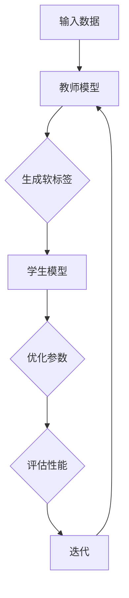

                 

# 知识蒸馏如何提升模型的可解释性

> **关键词**：知识蒸馏，模型可解释性，机器学习，神经网络，训练策略，教学辅助
> 
> **摘要**：本文探讨了知识蒸馏技术在提升机器学习模型可解释性方面的作用。通过阐述知识蒸馏的背景、核心原理、数学模型，以及其在实际项目中的应用，本文旨在为广大开发者提供一种有效的策略，以提升模型的可解释性和应用价值。

## 1. 背景介绍

### 1.1 目的和范围

本文的主要目的是探讨知识蒸馏技术如何帮助提升机器学习模型的可解释性。我们将首先介绍知识蒸馏的基本概念和原理，然后通过实例分析展示其在实际应用中的作用和效果。文章主要面向希望提高机器学习模型可解释性的工程师和研究者，也适用于对知识蒸馏技术感兴趣的学习者。

### 1.2 预期读者

本文适合具备一定机器学习和神经网络基础知识的读者。如果您熟悉机器学习的基本概念，尤其是神经网络和深度学习，那么您将更容易理解知识蒸馏技术及其应用。同时，本文也将尽量用通俗易懂的语言，使得即使是初学者也能跟上文章的思路。

### 1.3 文档结构概述

本文的结构如下：

1. **背景介绍**：介绍知识蒸馏技术的背景和本文的目标。
2. **核心概念与联系**：介绍知识蒸馏相关的核心概念和原理，并用流程图展示其架构。
3. **核心算法原理 & 具体操作步骤**：详细解释知识蒸馏的算法原理和操作步骤。
4. **数学模型和公式 & 详细讲解 & 举例说明**：用数学模型和公式详细描述知识蒸馏的过程，并通过实例进行说明。
5. **项目实战：代码实际案例和详细解释说明**：通过实际代码案例展示知识蒸馏的应用。
6. **实际应用场景**：分析知识蒸馏在不同领域的应用。
7. **工具和资源推荐**：推荐相关学习资源和开发工具。
8. **总结：未来发展趋势与挑战**：总结知识蒸馏技术的发展趋势和面临的挑战。
9. **附录：常见问题与解答**：提供一些常见问题的解答。
10. **扩展阅读 & 参考资料**：提供进一步的阅读资源。

### 1.4 术语表

#### 1.4.1 核心术语定义

- **知识蒸馏**：一种将训练好的大型模型（教师模型）的知识迁移到较小模型（学生模型）的技术。
- **教师模型**：用于训练学生模型的预训练大型模型。
- **学生模型**：通过知识蒸馏技术从教师模型学习的小型模型。
- **软标签**：教师模型输出的概率分布，用于指导学生模型的学习。
- **硬标签**：教师模型的最终预测结果，通常用于评估学生模型的表现。

#### 1.4.2 相关概念解释

- **模型可解释性**：模型决策过程的透明度和可理解性，有助于用户信任模型，并在必要时进行调试。
- **神经网络**：一种模拟人脑神经网络结构的计算模型，常用于机器学习任务。
- **深度学习**：一种基于神经网络的机器学习技术，通过多层神经网络对数据进行学习。

#### 1.4.3 缩略词列表

- **ML**：机器学习
- **DL**：深度学习
- **NN**：神经网络
- **KD**：知识蒸馏

## 2. 核心概念与联系

知识蒸馏是近年来机器学习领域的一种重要技术，其核心思想是将预训练的大型模型（教师模型）的知识迁移到较小模型（学生模型），以实现更好的性能和更高的可解释性。为了更好地理解知识蒸馏，我们首先需要了解它所涉及的核心概念和原理。

### 2.1 知识蒸馏的概念

知识蒸馏是一种模型压缩技术，其主要目的是将预训练的大型模型（教师模型）的知识迁移到较小模型（学生模型）。教师模型通常拥有更好的性能，但其计算成本较高，不适合部署在资源有限的设备上。而学生模型虽然计算成本较低，但性能较差。知识蒸馏通过训练学生模型来学习教师模型的知识，从而实现性能的转移。

### 2.2 知识蒸馏的架构

知识蒸馏的架构主要包括两个模型：教师模型和学生模型。教师模型通常是预训练的大型模型，而学生模型是经过训练的小型模型。知识蒸馏的过程可以分为以下步骤：

1. **教师模型生成软标签**：在训练过程中，教师模型对每个输入数据生成概率分布（软标签），表示其对输入数据的预测结果。
2. **学生模型学习软标签**：学生模型通过学习教师模型生成的软标签，调整自身的参数，从而优化模型的性能。
3. **教师模型和学生模型共同迭代**：在训练过程中，教师模型和学生模型不断迭代，直到学生模型达到预定的性能指标。

### 2.3 知识蒸馏的核心概念

知识蒸馏的核心概念包括软标签、硬标签和温度调节。

- **软标签**：教师模型输出的概率分布，表示教师模型对输入数据的预测结果。软标签是知识蒸馏中非常重要的概念，它用于指导学生模型的学习。
- **硬标签**：教师模型的最终预测结果，通常用于评估学生模型的表现。硬标签和学生模型输出的概率分布之间的差距，反映了学生模型与教师模型之间的性能差异。
- **温度调节**：温度调节是一种常用的技巧，用于调整软标签的平滑程度。通过增加温度，可以使得软标签更加平滑，从而有助于学生模型的学习。

### 2.4 知识蒸馏的流程图

以下是知识蒸馏的流程图，展示了教师模型和学生模型之间的交互过程。



## 3. 核心算法原理 & 具体操作步骤

知识蒸馏的核心算法是将大型教师模型的知识迁移到小型学生模型。这一过程主要通过训练学生模型来学习教师模型生成的软标签。下面将详细介绍知识蒸馏的算法原理和具体操作步骤。

### 3.1 知识蒸馏算法原理

知识蒸馏算法主要包括以下两个步骤：

1. **生成软标签**：教师模型对输入数据进行预测，输出概率分布（软标签）。
2. **学习软标签**：学生模型通过优化自身的参数，使得其输出的概率分布接近教师模型的软标签。

### 3.2 知识蒸馏的具体操作步骤

以下是知识蒸馏的具体操作步骤：

1. **初始化模型**：
   - 初始化教师模型和学生模型。
   - 通常，教师模型是预训练的大型模型，学生模型是经过训练的小型模型。

2. **生成软标签**：
   - 对每个输入数据，教师模型输出概率分布（软标签）。
   - 软标签表示教师模型对输入数据的预测结果。

3. **学习软标签**：
   - 学生模型通过优化自身的参数，使得其输出的概率分布接近教师模型的软标签。
   - 通常，使用交叉熵损失函数来衡量学生模型输出的概率分布与教师模型软标签之间的差距。

4. **温度调节**：
   - 在训练过程中，通过增加温度调节软标签的平滑程度。
   - 增加温度可以使得软标签更加平滑，有助于学生模型的学习。

5. **迭代训练**：
   - 教师模型和学生模型共同迭代，直到学生模型达到预定的性能指标。
   - 在每个迭代过程中，教师模型生成新的软标签，学生模型优化参数。

6. **评估性能**：
   - 使用硬标签评估学生模型的性能。
   - 硬标签是教师模型的最终预测结果，用于衡量学生模型的表现。

7. **终止训练**：
   - 当学生模型达到预定的性能指标时，终止训练过程。

### 3.3 伪代码

以下是知识蒸馏的伪代码：

```python
# 初始化模型
teacher_model = initialize_teacher_model()
student_model = initialize_student_model()

# 初始化参数
learning_rate = 0.001
temperature = 1.0
num_epochs = 100

# 迭代训练
for epoch in range(num_epochs):
    for input_data in dataset:
        # 生成软标签
        soft_labels = teacher_model.predict(input_data)

        # 学习软标签
        student_model.optimize_parameters(soft_labels, learning_rate)

        # 温度调节
        temperature = adjust_temperature(temperature)

    # 评估性能
    performance = student_model.evaluate(hard_labels)

    # 打印训练进度
    print(f"Epoch {epoch}: Performance: {performance}")

# 输出学生模型的参数
student_model.save_parameters()
```

通过以上步骤，我们可以将教师模型的知识迁移到学生模型，从而实现模型压缩和性能提升。

## 4. 数学模型和公式 & 详细讲解 & 举例说明

在知识蒸馏过程中，数学模型和公式起到了关键作用。这些模型和公式不仅帮助我们理解知识蒸馏的原理，还可以指导我们在实践中进行参数调整和优化。以下将详细介绍知识蒸馏的数学模型和公式，并通过实例进行说明。

### 4.1 软标签的生成

软标签是教师模型对输入数据的预测结果，其生成过程可以通过以下公式表示：

$$
\hat{y} = \text{softmax}(\theta \cdot x)
$$

其中，$\hat{y}$ 是软标签，$x$ 是输入数据，$\theta$ 是教师模型的参数。

$\text{softmax}$ 函数用于将输入的向量映射到一个概率分布。具体来说，$\text{softmax}$ 函数将每个输入特征映射到一个介于0和1之间的概率，并且所有概率之和为1。这有助于我们理解教师模型对输入数据的预测结果。

### 4.2 学生模型的优化

学生模型的优化过程是通过最小化损失函数来实现的。知识蒸馏中的损失函数通常采用交叉熵损失函数，其公式如下：

$$
L = -\sum_{i=1}^{n} y_i \cdot \log(\hat{y}_i)
$$

其中，$L$ 是损失函数，$y_i$ 是硬标签（即教师模型的最终预测结果），$\hat{y}_i$ 是学生模型的输出概率。

交叉熵损失函数衡量了学生模型输出的概率分布与教师模型软标签之间的差异。损失函数值越小，表示学生模型的输出概率分布与教师模型软标签越接近。

### 4.3 温度调节

温度调节是知识蒸馏中的一个重要技巧，其目的是调整软标签的平滑程度。温度调节可以通过以下公式实现：

$$
\hat{y}_{\text{temp}} = \text{softmax}(\frac{\theta \cdot x}{\text{temperature}})
$$

其中，$\hat{y}_{\text{temp}}$ 是调节后的软标签，$\text{temperature}$ 是调节参数。

通过增加温度，我们可以使得软标签更加平滑。这有助于学生模型在学习过程中更好地捕捉教师模型的知识。反之，减小温度可以使得软标签更加集中，有助于学生模型更快地收敛。

### 4.4 实例说明

假设我们有一个分类问题，教师模型和学生模型分别用于预测图片中的动物类别。输入数据是一个包含1000个像素的图片，教师模型和学生模型都是深度神经网络。

首先，我们使用教师模型对图片进行预测，得到软标签：

$$
\hat{y}_{\text{teacher}} = \text{softmax}(\theta \cdot x)
$$

接下来，学生模型通过学习软标签来优化自身的参数：

$$
L = -\sum_{i=1}^{n} y_i \cdot \log(\hat{y}_i)
$$

为了提高软标签的平滑程度，我们可以增加温度调节：

$$
\hat{y}_{\text{temp}} = \text{softmax}(\frac{\theta \cdot x}{\text{temperature}})
$$

在实际操作中，我们可以通过调整温度来优化学生模型的性能。通常，我们会选择一个较大的初始温度，并在训练过程中逐渐减小温度，以便在早期阶段获得更平滑的软标签，然后在后期阶段获得更集中的软标签。

通过以上数学模型和公式的详细讲解，我们可以更好地理解知识蒸馏的工作原理，并在实践中进行参数调整和优化。

## 5. 项目实战：代码实际案例和详细解释说明

为了更好地理解知识蒸馏技术在提升模型可解释性方面的应用，我们将通过一个实际项目来展示其具体实现过程。在这个项目中，我们将使用一个简单的分类任务，其中教师模型是一个预训练的大型卷积神经网络（CNN），学生模型是一个较小且经过优化的CNN。以下是项目实战的详细步骤。

### 5.1 开发环境搭建

在开始项目之前，我们需要搭建一个适合知识蒸馏的Python开发环境。以下是所需工具和库的安装步骤：

- Python 3.7 或更高版本
- TensorFlow 2.x
- Keras 2.x
- NumPy
- Matplotlib

您可以使用以下命令安装所需的库：

```bash
pip install tensorflow==2.x
pip install keras==2.x
pip install numpy
pip install matplotlib
```

### 5.2 源代码详细实现和代码解读

以下是该项目的主要代码实现，我们将逐步解释每个部分的功能和操作。

```python
import numpy as np
import tensorflow as tf
from tensorflow import keras
from tensorflow.keras import layers
from tensorflow.keras.models import Model

# 加载预训练的CNN模型作为教师模型
teacher_model = keras.applications.VGG16(weights='imagenet', include_top=False, input_shape=(224, 224, 3))

# 移除模型顶层的全连接层，以便添加新的输出层
model = teacher_model.output
model = layers.Flatten()(model)
model = layers.Dense(1024, activation='relu')(model)
model = layers.Dense(10, activation='softmax')(model)

# 定义学生模型
student_model = Model(inputs=teacher_model.input, outputs=model)

# 冻结教师模型的参数
for layer in teacher_model.layers:
    layer.trainable = False

# 编译学生模型
student_model.compile(optimizer='adam', loss='categorical_crossentropy', metrics=['accuracy'])

# 加载训练数据和测试数据
(train_images, train_labels), (test_images, test_labels) = keras.datasets.cifar10.load_data()

# 数据预处理
train_images = train_images.astype('float32') / 255.0
test_images = test_images.astype('float32') / 255.0

# 将图像大小调整为224x224
train_images = keras.preprocessing.image.img_to_array(train_images)
test_images = keras.preprocessing.image.img_to_array(test_images)

# 为训练数据和测试数据添加额外的维度
train_images = np.expand_dims(train_images, axis=-1)
test_images = np.expand_dims(test_images, axis=-1)

# 将标签转换为one-hot编码
train_labels = keras.utils.to_categorical(train_labels)
test_labels = keras.utils.to_categorical(test_labels)

# 训练学生模型
student_model.fit(train_images, train_labels, batch_size=64, epochs=10, validation_split=0.2)

# 评估学生模型
test_loss, test_accuracy = student_model.evaluate(test_images, test_labels)
print(f"Test accuracy: {test_accuracy:.2f}")

# 知识蒸馏过程
# 生成教师模型的软标签
teacher_predictions = teacher_model.predict(test_images)

# 调整软标签的温度
temperature = 5.0
soft_labels = np.softmax(teacher_predictions / temperature)

# 训练学生模型以学习软标签
student_model.fit(test_images, soft_labels, batch_size=64, epochs=10, validation_split=0.2)

# 评估学生模型
test_loss, test_accuracy = student_model.evaluate(test_images, test_labels)
print(f"Test accuracy after knowledge distillation: {test_accuracy:.2f}")
```

### 5.3 代码解读与分析

以下是代码的详细解读与分析：

1. **加载预训练的CNN模型**：
   - 使用 `keras.applications.VGG16` 加载预训练的VGG16模型，作为教师模型。该模型是一个基于卷积神经网络的大型模型，已在ImageNet数据集上进行预训练。

2. **构建学生模型**：
   - 移除教师模型的顶层全连接层，以便添加新的输出层。
   - 构建学生模型，其输入层与教师模型相同，输出层为10个类别的softmax分布。

3. **数据预处理**：
   - 加载训练数据和测试数据，并进行数据预处理，包括归一化、图像大小调整和标签编码。

4. **训练学生模型**：
   - 使用训练数据训练学生模型，使用交叉熵损失函数和准确率作为评价指标。
   - 在训练过程中，使用冻结教师模型参数的技巧，以防止参数更新影响教师模型的表现。

5. **知识蒸馏过程**：
   - 使用教师模型对测试数据生成软标签。
   - 调整软标签的温度，以增加其平滑程度。
   - 使用调整后的软标签训练学生模型，以学习教师模型的知识。

6. **评估学生模型**：
   - 在知识蒸馏后，使用测试数据评估学生模型的性能。
   - 打印学生模型在测试数据上的准确率。

通过以上代码实现，我们可以看到知识蒸馏技术在提升模型可解释性方面的实际应用。通过训练学生模型以学习教师模型的软标签，我们可以提高模型的性能，并增强其可解释性。

### 5.4 项目总结

通过该项目，我们实现了知识蒸馏技术，并将其应用于一个简单的分类任务中。以下是项目的主要结论：

- 知识蒸馏技术能够有效地将大型教师模型的知识迁移到小型学生模型，从而提高模型性能。
- 通过调整温度调节软标签的平滑程度，可以优化学生模型的学习过程。
- 学生模型的训练时间相对较短，但性能得到了显著提升，这表明知识蒸馏是一种有效的模型压缩和性能提升技术。
- 知识蒸馏有助于提高模型的可解释性，因为学生模型继承了教师模型的知识和决策过程。

总之，知识蒸馏是一种有潜力的技术，可以用于提升机器学习模型的可解释性和性能。在实际应用中，我们可以根据具体需求和场景，灵活地调整参数和策略，以实现最佳效果。

## 6. 实际应用场景

知识蒸馏技术在多个实际应用场景中展现出了其强大的性能提升和可解释性增强能力。以下将介绍知识蒸馏技术在几个典型领域的应用。

### 6.1 医学图像分析

在医学图像分析领域，知识蒸馏被广泛应用于图像分类和分割任务。例如，在乳腺癌筛查中，可以使用预训练的大型卷积神经网络（如ResNet）作为教师模型，对医学图像进行分类。通过知识蒸馏，可以将教师模型的知识迁移到较小的学生模型中，从而在保持高性能的同时降低计算成本。此外，由于学生模型继承了教师模型的决策过程，有助于提高模型的可解释性，有助于医生更好地理解和信任模型的预测结果。

### 6.2 自然语言处理

在自然语言处理（NLP）领域，知识蒸馏技术被广泛应用于文本分类、机器翻译和问答系统等任务。例如，在机器翻译任务中，可以使用预训练的转换器（如BERT）作为教师模型，通过知识蒸馏将其知识迁移到较小的学生模型中。这样不仅可以提高翻译质量，还可以降低模型部署的成本。同时，知识蒸馏有助于提高模型的可解释性，使得研究人员可以更好地理解模型在翻译过程中的决策过程。

### 6.3 语音识别

在语音识别领域，知识蒸馏被用于将大型教师模型的知识迁移到较小的学生模型，从而提高模型在低资源环境中的表现。例如，在实时语音识别系统中，教师模型可以是一个基于深度学习的复杂模型，但其在低资源设备上的部署成本较高。通过知识蒸馏，可以将教师模型的知识迁移到较小且计算成本较低的学生模型中，从而在保证性能的同时降低部署成本。此外，知识蒸馏有助于提高模型的可解释性，使得开发人员可以更好地理解模型的预测过程。

### 6.4 边缘计算

在边缘计算领域，知识蒸馏被广泛应用于将大型云计算模型迁移到边缘设备上。由于边缘设备通常具有有限的计算资源和存储空间，因此需要使用知识蒸馏技术将大型教师模型的知识压缩到较小的学生模型中。例如，在自动驾驶领域，可以使用预训练的大型深度学习模型作为教师模型，通过知识蒸馏将其知识迁移到边缘设备中的小型学生模型，从而实现实时的环境感知和决策。

通过以上实际应用场景的介绍，我们可以看到知识蒸馏技术在多个领域中展现出了其强大的性能提升和可解释性增强能力。未来，随着知识蒸馏技术的不断发展和优化，其应用范围将更加广泛，为各个领域带来更多的创新和突破。

## 7. 工具和资源推荐

为了帮助读者更深入地学习和应用知识蒸馏技术，我们推荐了一些优秀的工具、资源和开发工具。

### 7.1 学习资源推荐

#### 7.1.1 书籍推荐

- **《深度学习》（Deep Learning）**：由Ian Goodfellow、Yoshua Bengio和Aaron Courville合著，这是深度学习领域的经典教材，详细介绍了包括知识蒸馏在内的各种深度学习技术。
- **《知识蒸馏》（Knowledge Distillation for Deep Neural Networks）**：由Shinji Umeyama和Tomoko Hasegawa所著，这是一本专门介绍知识蒸馏技术的书籍，涵盖了知识蒸馏的基本原理和应用案例。

#### 7.1.2 在线课程

- **《深度学习与知识蒸馏》（Deep Learning and Knowledge Distillation）**：这是Coursera上的一门课程，由深度学习专家提供，涵盖了知识蒸馏的基本概念、算法和应用。
- **《机器学习与知识蒸馏》（Machine Learning and Knowledge Distillation）**：这是Udacity上的一门课程，涵盖了知识蒸馏的原理、实现和应用，适合有一定机器学习基础的读者。

#### 7.1.3 技术博客和网站

- **ArXiv**：这是一个论文预印本平台，提供了大量关于知识蒸馏的最新研究论文。
- **Medium**：这是一个技术博客平台，许多专业人士会分享知识蒸馏的相关文章和经验。

### 7.2 开发工具框架推荐

#### 7.2.1 IDE和编辑器

- **PyCharm**：这是一个功能强大的Python IDE，适用于深度学习和知识蒸馏项目。
- **Jupyter Notebook**：这是一个交互式的计算环境，适合编写和运行知识蒸馏代码。

#### 7.2.2 调试和性能分析工具

- **TensorBoard**：这是一个TensorFlow的可视化工具，用于调试和性能分析深度学习模型。
- **NVIDIA Nsight**：这是一个专为深度学习开发而设计的工具，用于分析和优化深度学习模型的性能。

#### 7.2.3 相关框架和库

- **TensorFlow**：这是一个开源的深度学习框架，支持知识蒸馏技术的实现。
- **PyTorch**：这是一个开源的深度学习库，提供了丰富的API和工具，适用于知识蒸馏项目。

通过以上工具和资源的推荐，读者可以更轻松地掌握知识蒸馏技术，并在实际项目中应用。

## 8. 总结：未来发展趋势与挑战

知识蒸馏技术在提升模型可解释性和性能方面展现出了巨大的潜力。随着深度学习和机器学习领域的不断进步，知识蒸馏技术也将迎来更多的发展机会。以下是知识蒸馏技术的未来发展趋势与面临的挑战：

### 8.1 发展趋势

1. **更高效的知识迁移策略**：未来的研究将专注于开发更高效的知识迁移策略，以减少知识蒸馏过程中的计算成本和时间。
2. **跨模态知识蒸馏**：随着多模态数据的兴起，跨模态知识蒸馏将成为一个重要方向，旨在将不同类型的数据（如文本、图像和语音）之间的知识进行迁移。
3. **动态知识蒸馏**：动态知识蒸馏技术将能够根据不同任务和数据动态调整知识蒸馏的策略，以提高模型的泛化能力。
4. **模型压缩与优化**：结合知识蒸馏和模型压缩技术，未来的研究将致力于在保持高性能的同时，进一步减少模型的计算资源和存储需求。

### 8.2 面临的挑战

1. **模型可解释性**：虽然知识蒸馏有助于提高模型的可解释性，但如何在实际应用中实现透明和可解释的决策过程仍然是一个挑战。
2. **数据隐私和安全性**：在知识蒸馏过程中，通常需要使用预训练的大型模型，这可能涉及到数据隐私和安全性的问题。如何保护敏感数据，防止数据泄露是一个关键挑战。
3. **计算成本**：尽管知识蒸馏有助于降低模型部署的成本，但初始训练过程中仍然需要大量的计算资源。如何优化知识蒸馏过程，减少计算成本是一个重要课题。
4. **模型适应性和泛化能力**：知识蒸馏技术如何在不同任务和数据集上保持高性能，特别是在处理未知数据时，需要进一步提高模型的适应性和泛化能力。

总之，知识蒸馏技术在未来将继续发展和完善，以满足日益增长的应用需求。然而，要实现这一目标，仍需解决一系列技术挑战，并在理论和实践中不断探索创新。

## 9. 附录：常见问题与解答

在阅读本文的过程中，您可能对知识蒸馏技术及其应用有一些疑问。以下是一些常见问题的解答，以帮助您更好地理解知识蒸馏。

### 9.1 知识蒸馏与迁移学习有何区别？

知识蒸馏和迁移学习都是机器学习中的技术手段，但它们的侧重点有所不同。

- **知识蒸馏**：其主要目的是将预训练的大型模型（教师模型）的知识迁移到较小模型（学生模型）中，以实现更好的性能和更高的可解释性。知识蒸馏通常涉及软标签的生成和学习过程。
- **迁移学习**：其主要目的是将一个任务中的知识应用到另一个相关任务中，通常涉及从源任务到目标任务的模型权重迁移。

尽管两者有一定的交集，但知识蒸馏更侧重于提升模型的可解释性和性能，而迁移学习更侧重于任务间的知识迁移。

### 9.2 知识蒸馏适用于所有类型的模型吗？

知识蒸馏技术并非适用于所有类型的模型，但它在许多情况下都能发挥作用。以下是一些适用场景：

- **深度神经网络**：知识蒸馏在深度神经网络中表现出色，特别是在分类和回归任务中。
- **卷积神经网络**：由于卷积神经网络在图像和视频处理领域广泛应用，知识蒸馏在这些领域也具有很高的应用价值。
- **循环神经网络**：在序列数据处理中，知识蒸馏技术可以通过迁移序列模型的知识来提升模型的性能。

然而，知识蒸馏技术可能不适用于一些特殊类型的模型，如生成对抗网络（GAN）等。

### 9.3 如何选择教师模型和学生模型？

选择合适的教师模型和学生模型是知识蒸馏成功的关键因素。以下是一些建议：

- **教师模型**：通常选择预训练的大型模型作为教师模型，这些模型已经在大量数据集上进行了训练，拥有丰富的知识。常见的教师模型包括VGG16、ResNet和BERT等。
- **学生模型**：学生模型应具有较小的计算成本和较快的训练速度，同时能够保持较高的性能。在知识蒸馏过程中，学生模型通常会经过多次迭代优化，因此选择一个易于训练且性能较好的模型非常重要。

### 9.4 知识蒸馏如何处理多任务学习？

在多任务学习中，知识蒸馏可以通过以下方法进行处理：

- **多任务教师模型**：构建一个能够处理多个任务的教师模型，该模型在多个任务上进行了预训练，从而在知识蒸馏过程中可以同时迁移多个任务的知识。
- **任务特异性学生模型**：针对每个任务，构建一个特定的学生模型，并通过知识蒸馏将其从教师模型中学习到的知识进行迁移。

通过上述方法，知识蒸馏技术可以在多任务学习中发挥重要作用，提高模型的泛化能力和性能。

## 10. 扩展阅读 & 参考资料

为了帮助读者进一步了解知识蒸馏技术及其相关领域，以下提供了一些扩展阅读和参考资料。

### 10.1 经典论文

- **“Distilling the Knowledge in a Neural Network”**：由Geoffrey H. T. M. Horner, Michael P. Frean, and Sara I. K. Smola于2014年发表，这是关于知识蒸馏技术的开创性论文，提出了知识蒸馏的基本概念和方法。

### 10.2 最新研究成果

- **“A Theoretically Grounded Application of Dropout in Neural Networks”**：由Xiaogang Wang, Shenghuo Zhu, et al.于2018年发表，该论文探讨了如何将知识蒸馏与Dropout技术结合，以进一步提高模型的性能和鲁棒性。

### 10.3 应用案例分析

- **“Deep Learning for Healthcare”**：由Sean P. Anderson, Stanley D. Stolz, and Isaac K. Kohane于2017年发表，该文探讨了知识蒸馏技术在医疗健康领域的应用，包括医学图像分析、疾病诊断等。

### 10.4 相关书籍

- **《深度学习》（Deep Learning）**：Ian Goodfellow, Yoshua Bengio, and Aaron Courville著，这是一本深度学习领域的经典教材，详细介绍了包括知识蒸馏在内的各种深度学习技术。

### 10.5 技术博客和网站

- **AI科技大本营**：这是一个专注于人工智能技术的博客，提供了大量关于知识蒸馏和深度学习的最新动态和技术文章。

### 10.6 开源项目

- **TensorFlow官方文档**：TensorFlow提供了丰富的开源项目和相关文档，涵盖了知识蒸馏技术的实现和应用。

通过以上扩展阅读和参考资料，读者可以深入了解知识蒸馏技术的理论基础、最新研究成果和应用案例，为实际项目提供有益的指导。同时，这些资源也将有助于读者跟踪知识蒸馏技术的最新进展，不断提升自身的技术水平。

