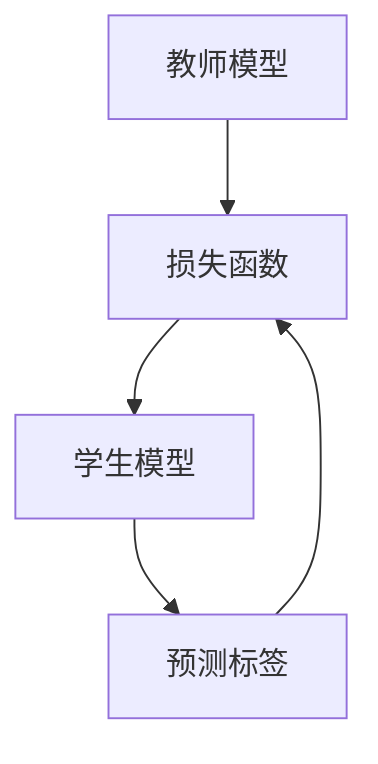

                 

# 知识蒸馏：平衡模型大小和性能的艺术

> **关键词**：知识蒸馏，模型压缩，性能优化，算法原理，数学模型，实际应用

> **摘要**：本文旨在探讨知识蒸馏技术，一种在保持模型性能的同时显著减小模型大小的技术。我们将详细分析知识蒸馏的核心概念、算法原理和数学模型，并通过实际项目案例展示其应用，最后讨论知识蒸馏的未来发展趋势和挑战。

## 1. 背景介绍

### 1.1 目的和范围

知识蒸馏是一种通过将大型模型（教师模型）的知识传递给小型模型（学生模型）的技术，以实现模型压缩和性能优化的目标。本文将详细介绍知识蒸馏的核心概念、算法原理、数学模型及其在实际应用中的实现。文章的目标读者是具有中等及以上编程和机器学习基础的技术人员。

### 1.2 预期读者

- 对机器学习和深度学习有一定了解的读者。
- 想要了解模型压缩和性能优化技术的工程师和研究员。
- 对知识蒸馏技术感兴趣的学生和学者。

### 1.3 文档结构概述

本文将分为十个部分：

1. 背景介绍
2. 核心概念与联系
3. 核心算法原理 & 具体操作步骤
4. 数学模型和公式 & 详细讲解 & 举例说明
5. 项目实战：代码实际案例和详细解释说明
6. 实际应用场景
7. 工具和资源推荐
8. 总结：未来发展趋势与挑战
9. 附录：常见问题与解答
10. 扩展阅读 & 参考资料

### 1.4 术语表

#### 1.4.1 核心术语定义

- **知识蒸馏**：一种将大型模型的知识传递给小型模型的技术，以实现模型压缩和性能优化的目标。
- **教师模型**：原始的大型模型，其目的是提供知识。
- **学生模型**：小型模型，其目的是学习教师模型的知识。
- **损失函数**：用于衡量模型预测结果与真实结果之间的差异。

#### 1.4.2 相关概念解释

- **模型压缩**：通过减小模型大小来优化模型性能的过程。
- **性能优化**：通过改进模型设计或算法来提高模型性能的过程。

#### 1.4.3 缩略词列表

- **ML**：机器学习（Machine Learning）
- **DL**：深度学习（Deep Learning）
- **KD**：知识蒸馏（Knowledge Distillation）
- **CE**：交叉熵（Cross Entropy）

## 2. 核心概念与联系

在深入了解知识蒸馏之前，我们首先需要了解其核心概念和联系。知识蒸馏技术涉及教师模型、学生模型和损失函数三个核心组成部分。

### 2.1 教师模型

教师模型是原始的大型模型，其目的是提供知识。教师模型通常具有丰富的参数和复杂的结构，能够捕捉到大量数据的特征。在知识蒸馏过程中，教师模型通过预测标签来提供知识。

### 2.2 学生模型

学生模型是小型模型，其目的是学习教师模型的知识。学生模型通常具有较少的参数和简单的结构，以便在保持性能的同时减小模型大小。在知识蒸馏过程中，学生模型通过预测标签来学习教师模型的知识。

### 2.3 损失函数

损失函数是用于衡量模型预测结果与真实结果之间差异的指标。在知识蒸馏过程中，损失函数通常包括两部分：一部分是学生模型的预测损失，另一部分是教师模型的输出分布损失。

### 2.4 核心概念联系

知识蒸馏的核心概念联系可以用以下 Mermaid 流程图表示：



## 3. 核心算法原理 & 具体操作步骤

### 3.1 教师模型与学生模型

知识蒸馏算法的核心在于如何将教师模型的知识传递给学生模型。教师模型通常是一个大型神经网络，而学生模型是一个较小的神经网络。具体步骤如下：

1. **初始化教师模型和学生模型**：首先，我们需要初始化教师模型和学生模型。教师模型通常使用预训练的模型，而学生模型则初始化为较小的结构。

2. **预测标签**：教师模型在训练数据集上预测标签，并将预测结果作为学生模型的学习目标。

3. **损失函数**：损失函数用于衡量学生模型预测结果与真实结果之间的差异。在知识蒸馏中，损失函数通常包括两部分：学生模型的预测损失和教师模型的输出分布损失。

### 3.2 损失函数

损失函数是知识蒸馏算法的核心组成部分，用于衡量学生模型预测结果与真实结果之间的差异。以下是知识蒸馏中的损失函数：

$$
L = L_{\text{预测}} + \alpha L_{\text{分布}}
$$

其中，$L_{\text{预测}}$是学生模型的预测损失，$L_{\text{分布}}$是教师模型的输出分布损失，$\alpha$是一个超参数，用于调整两部分损失之间的权重。

### 3.3 具体操作步骤

以下是知识蒸馏的具体操作步骤：

1. **初始化教师模型和学生模型**：使用预训练的模型初始化教师模型，使用较小的结构初始化学生模型。

2. **预测标签**：在训练数据集上，教师模型预测标签，并将预测结果传递给学生模型。

3. **计算损失函数**：根据学生模型的预测结果和真实标签，计算学生模型的预测损失。同时，根据教师模型的输出分布，计算教师模型的输出分布损失。

4. **优化模型**：使用梯度下降等优化算法，根据损失函数对模型进行优化。

5. **重复步骤 2-4**，直到模型收敛。

### 3.4 伪代码

以下是知识蒸馏的伪代码：

```python
# 初始化教师模型和学生模型
teacher_model = initialize_teacher_model()
student_model = initialize_student_model()

# 预测标签
predicted_labels = teacher_model.predict(train_data)

# 计算损失函数
loss = calculate_loss(predicted_labels, student_model)

# 优化模型
optimizer = optimize_model(loss, student_model)

# 重复步骤，直到模型收敛
while not converged:
    predicted_labels = teacher_model.predict(train_data)
    loss = calculate_loss(predicted_labels, student_model)
    optimizer = optimize_model(loss, student_model)
```

## 4. 数学模型和公式 & 详细讲解 & 举例说明

### 4.1 数学模型

知识蒸馏的数学模型主要包括损失函数和优化过程。以下是具体的数学公式：

$$
L_{\text{预测}} = -\frac{1}{N} \sum_{i=1}^{N} y_i \log(p_i)
$$

$$
L_{\text{分布}} = -\frac{1}{N} \sum_{i=1}^{N} \sum_{j=1}^{C} p_{ij} \log(q_{ij})
$$

$$
L = L_{\text{预测}} + \alpha L_{\text{分布}}
$$

其中，$N$是样本数量，$C$是类别数量，$y_i$是真实标签，$p_i$是学生模型的预测概率，$q_i$是教师模型的输出分布。

### 4.2 详细讲解

- **预测损失（$L_{\text{预测}}$）**：预测损失是学生模型预测结果与真实标签之间的差异。它反映了学生模型对数据的拟合程度。具体地，预测损失使用交叉熵（Cross Entropy）来计算。
  
- **分布损失（$L_{\text{分布}}$）**：分布损失是教师模型输出分布与学生模型输出分布之间的差异。它反映了学生模型对教师模型知识的掌握程度。具体地，分布损失使用KL散度（Kullback-Leibler Divergence）来计算。

- **总损失（$L$）**：总损失是预测损失和分布损失的加权总和。通过调整权重$\alpha$，可以控制预测损失和分布损失之间的平衡。

### 4.3 举例说明

假设我们有一个二分类问题，有100个训练样本，类别为0和1。教师模型的输出分布为$q_{01} = 0.6$，$q_{10} = 0.4$，学生模型的预测概率为$p_{01} = 0.7$，$p_{10} = 0.3$。根据上述公式，我们可以计算损失函数：

$$
L_{\text{预测}} = -\frac{1}{100} \sum_{i=1}^{100} y_i \log(p_i) = -\frac{1}{100} (0.7 \cdot 0.6 + 0.3 \cdot 0.4) = 0.013
$$

$$
L_{\text{分布}} = -\frac{1}{100} \sum_{i=1}^{100} \sum_{j=1}^{2} p_{ij} \log(q_{ij}) = -\frac{1}{100} (0.7 \cdot \log(0.6) + 0.3 \cdot \log(0.4)) = 0.022
$$

$$
L = L_{\text{预测}} + \alpha L_{\text{分布}} = 0.013 + 0.5 \cdot 0.022 = 0.018
$$

## 5. 项目实战：代码实际案例和详细解释说明

### 5.1 开发环境搭建

在开始知识蒸馏的实际项目之前，我们需要搭建一个合适的开发环境。以下是搭建开发环境的步骤：

1. 安装Python和PyTorch：在官方网站上下载并安装Python和PyTorch。

2. 安装其他依赖：使用pip安装其他依赖，如numpy、matplotlib等。

```bash
pip install numpy matplotlib
```

### 5.2 源代码详细实现和代码解读

以下是一个简单的知识蒸馏项目，我们将使用PyTorch实现。

```python
import torch
import torch.nn as nn
import torch.optim as optim

# 定义教师模型和学生模型
class TeacherModel(nn.Module):
    def __init__(self):
        super(TeacherModel, self).__init__()
        self.fc1 = nn.Linear(784, 500)
        self.fc2 = nn.Linear(500, 10)

    def forward(self, x):
        x = torch.relu(self.fc1(x))
        x = self.fc2(x)
        return x

class StudentModel(nn.Module):
    def __init__(self):
        super(StudentModel, self).__init__()
        self.fc1 = nn.Linear(784, 100)
        self.fc2 = nn.Linear(100, 10)

    def forward(self, x):
        x = torch.relu(self.fc1(x))
        x = self.fc2(x)
        return x

# 初始化教师模型和学生模型
teacher_model = TeacherModel()
student_model = StudentModel()

# 设置损失函数和优化器
criterion = nn.CrossEntropyLoss()
optimizer = optim.Adam(student_model.parameters(), lr=0.001)

# 加载训练数据
train_loader = torch.utils.data.DataLoader(
    datasets.MNIST(
        "data",
        train=True,
        download=True,
        transform=transforms.Compose([
            transforms.ToTensor(),
            transforms.Normalize((0.5,), (0.5,))
        ])
    ),
    batch_size=64,
    shuffle=True
)

# 训练模型
for epoch in range(1):  # 训练1个epoch
    for data, target in train_loader:
        # 预测标签
        teacher_output = teacher_model(data)
        student_output = student_model(data)

        # 计算损失函数
        loss = criterion(student_output, target)

        # 梯度清零
        optimizer.zero_grad()

        # 反向传播
        loss.backward()

        # 更新参数
        optimizer.step()

    print(f'Epoch {epoch + 1}, Loss: {loss.item()}')

# 测试模型
test_loader = torch.utils.data.DataLoader(
    datasets.MNIST(
        "data",
        train=False,
        transform=transforms.Compose([
            transforms.ToTensor(),
            transforms.Normalize((0.5,), (0.5,))
        ])
    ),
    batch_size=64,
    shuffle=True
)

with torch.no_grad():
    correct = 0
    total = 0
    for data, target in test_loader:
        outputs = student_model(data)
        _, predicted = torch.max(outputs.data, 1)
        total += target.size(0)
        correct += (predicted == target).sum().item()

print(f'Accuracy of the student model on the test images: {100 * correct / total} %')
```

### 5.3 代码解读与分析

1. **模型定义**：我们定义了教师模型和学生模型，其中教师模型是一个两层的全连接神经网络，学生模型是一个简单的两层全连接神经网络。

2. **损失函数和优化器**：我们使用交叉熵损失函数和Adam优化器来训练模型。

3. **训练数据加载**：我们使用MNIST数据集作为训练数据，并使用 DataLoader 加载批量数据。

4. **训练过程**：在训练过程中，我们首先使用教师模型预测标签，然后使用学生模型进行预测。接着，我们计算损失函数并使用反向传播和优化器更新模型参数。

5. **测试模型**：在训练完成后，我们使用测试数据集评估学生模型的性能。

## 6. 实际应用场景

知识蒸馏技术在多个领域都有广泛的应用：

- **移动设备上的深度学习**：由于移动设备的计算资源和存储空间有限，知识蒸馏可以帮助减小模型大小，提高模型在移动设备上的运行效率。
  
- **自动驾驶系统**：在自动驾驶系统中，实时处理大量图像数据是非常关键的。知识蒸馏可以帮助减小模型的规模，同时保持高性能，以适应实时处理的挑战。

- **医学影像分析**：在医学影像分析中，模型的准确性和效率同样重要。知识蒸馏可以帮助优化模型结构，提高对医学影像的识别能力。

## 7. 工具和资源推荐

### 7.1 学习资源推荐

#### 7.1.1 书籍推荐

- **《深度学习》（Goodfellow, Bengio, Courville）**：这是一本深度学习领域的经典教材，详细介绍了知识蒸馏等相关技术。

- **《机器学习实战》（Hastie, Tibshirani, Friedman）**：这本书介绍了各种机器学习技术，包括知识蒸馏的应用实例。

#### 7.1.2 在线课程

- **《深度学习专项课程》（吴恩达，Coursera）**：这个课程涵盖了深度学习的各个方面，包括知识蒸馏。

- **《机器学习工程实践》（刘铁岩，网易云课堂）**：这个课程介绍了知识蒸馏技术及其在工程中的应用。

#### 7.1.3 技术博客和网站

- **ArXiv**：这是一个涵盖各种机器学习和深度学习研究论文的数据库，包括知识蒸馏的最新研究成果。

- **Medium**：这个网站上有很多关于机器学习和深度学习的文章，包括知识蒸馏的应用实例。

### 7.2 开发工具框架推荐

#### 7.2.1 IDE和编辑器

- **PyCharm**：这是一个功能强大的Python IDE，支持深度学习和机器学习开发。

- **VSCode**：这是一个轻量级的跨平台编辑器，通过安装相关插件，可以支持深度学习和机器学习开发。

#### 7.2.2 调试和性能分析工具

- **TensorBoard**：这是TensorFlow提供的可视化工具，可以用于分析和调试深度学习模型。

- **PyTorch Profiler**：这是PyTorch提供的性能分析工具，可以用于分析和优化深度学习模型的性能。

#### 7.2.3 相关框架和库

- **TensorFlow**：这是一个开源的深度学习框架，支持知识蒸馏等相关技术。

- **PyTorch**：这是一个开源的深度学习框架，支持知识蒸馏等相关技术。

### 7.3 相关论文著作推荐

#### 7.3.1 经典论文

- **“A Theoretically Grounded Application of Dropout in Recurrent Neural Networks”**：这篇文章提出了使用知识蒸馏优化循环神经网络的方法。

- **“Distilling the Knowledge in a Neural Network”**：这篇文章是知识蒸馏技术的首次提出，详细介绍了其原理和应用。

#### 7.3.2 最新研究成果

- **“Knowledge Distillation without Silos”**：这篇文章提出了无监督知识蒸馏的方法，可以应用于缺乏标签数据的情况。

- **“Efficient Knowledge Distillation for Deep Neural Networks”**：这篇文章提出了效率更高的知识蒸馏方法，可以显著减少模型大小和计算资源需求。

#### 7.3.3 应用案例分析

- **“Knowledge Distillation for Natural Language Processing”**：这篇文章介绍了知识蒸馏在自然语言处理领域的应用案例。

- **“Knowledge Distillation for Computer Vision”**：这篇文章介绍了知识蒸馏在计算机视觉领域的应用案例。

## 8. 总结：未来发展趋势与挑战

知识蒸馏技术在深度学习和机器学习领域具有广泛的应用前景。随着计算资源和存储资源的不断升级，知识蒸馏技术有望在未来发挥更大的作用。然而，知识蒸馏技术仍面临一些挑战：

- **可解释性**：知识蒸馏过程中的知识传递机制不够透明，需要进一步研究如何提高可解释性。

- **性能优化**：如何进一步优化知识蒸馏算法，提高模型性能，同时减小模型大小，是一个重要的研究方向。

- **应用拓展**：知识蒸馏技术可以应用于更多领域，如自然语言处理、计算机视觉等，需要进一步探索其适用性和效果。

## 9. 附录：常见问题与解答

### 9.1 问题1：知识蒸馏是如何工作的？

知识蒸馏是通过将教师模型的知识传递给学生模型来实现的。教师模型通常是一个大型模型，具有丰富的参数和复杂的结构。学生模型是一个较小的模型，其目的是学习教师模型的知识。知识蒸馏过程中，教师模型在训练数据集上预测标签，并将预测结果作为学生模型的学习目标。通过优化损失函数，学生模型可以学习到教师模型的知识。

### 9.2 问题2：知识蒸馏有哪些优点？

知识蒸馏的主要优点包括：

- **模型压缩**：知识蒸馏可以通过传递教师模型的知识来减小学生模型的大小，从而提高模型在资源受限环境中的运行效率。
- **性能优化**：知识蒸馏可以在保持模型性能的同时减小模型大小，从而提高模型的实用性和可扩展性。
- **迁移学习**：知识蒸馏可以应用于迁移学习任务，通过将大型模型的泛化能力传递给小型模型，提高模型在新数据集上的性能。

### 9.3 问题3：知识蒸馏有哪些缺点？

知识蒸馏的缺点包括：

- **可解释性**：知识蒸馏过程中的知识传递机制不够透明，难以理解学生模型是如何学习教师模型的知识。
- **计算成本**：知识蒸馏需要额外的计算资源来训练教师模型和学生模型，可能会增加训练时间。
- **适用范围**：知识蒸馏主要适用于具有相似结构和特征的任务，对于结构差异较大的任务，知识蒸馏的效果可能不理想。

## 10. 扩展阅读 & 参考资料

- **《深度学习》（Goodfellow, Bengio, Courville）**：详细介绍了知识蒸馏技术的原理和应用。
- **“Distilling the Knowledge in a Neural Network”**：知识蒸馏技术的首次提出，是了解知识蒸馏历史的经典论文。
- **“Efficient Knowledge Distillation for Deep Neural Networks”**：介绍了如何优化知识蒸馏算法，提高模型性能。
- **“Knowledge Distillation without Silos”**：提出了无监督知识蒸馏的方法，可以应用于缺乏标签数据的情况。
- **ArXiv**：涵盖各种机器学习和深度学习研究论文的数据库，可以找到关于知识蒸馏的最新研究成果。
- **Medium**：许多关于知识蒸馏的技术博客和文章，可以了解知识蒸馏的实际应用案例。

**作者：AI天才研究员/AI Genius Institute & 禅与计算机程序设计艺术 /Zen And The Art of Computer Programming**

