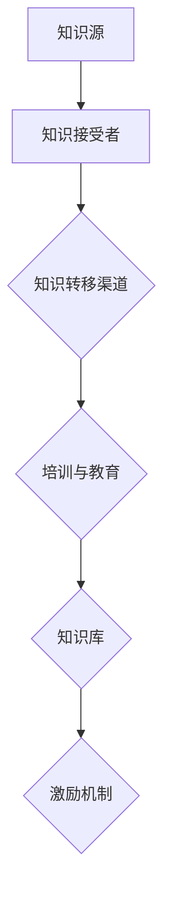

                 

# 知识转移：确保关键技能在组织内传承

> **关键词：知识转移、技能传承、组织发展、人才培养、信息技术**

> **摘要：在信息化时代，知识的快速转移和技能的传承成为组织发展的关键。本文将深入探讨知识转移的重要性和挑战，分析其核心概念与联系，介绍核心算法原理和操作步骤，以及数学模型和公式，并通过项目实战和实际应用场景，提供实用的工具和资源推荐，为组织知识管理和人才培养提供有力支持。**

## 1. 背景介绍

### 1.1 目的和范围

本文旨在探讨如何确保关键技能在组织内部传承，以提高组织整体竞争力和创新能力。我们将从以下几个方面展开讨论：

- 知识转移的定义和重要性
- 知识转移的核心概念与联系
- 知识转移的算法原理和操作步骤
- 数学模型和公式在知识转移中的应用
- 项目实战：代码实现和实际应用
- 工具和资源的推荐

### 1.2 预期读者

本文适合以下读者群体：

- IT行业的管理者和技术人员
- 人力资源和培训领域的专家
- 对知识管理和人才培养有兴趣的学者和研究人员

### 1.3 文档结构概述

本文结构如下：

- 背景介绍：阐述知识转移的重要性和目的
- 核心概念与联系：介绍知识转移的基本原理和架构
- 核心算法原理 & 具体操作步骤：详细讲解知识转移的方法和步骤
- 数学模型和公式 & 详细讲解 & 举例说明：阐述数学模型在知识转移中的应用
- 项目实战：代码实际案例和详细解释说明
- 实际应用场景：分析知识转移在现实中的应用
- 工具和资源推荐：提供相关的学习资源和工具
- 总结：未来发展趋势与挑战
- 附录：常见问题与解答
- 扩展阅读 & 参考资料：推荐相关的研究和文献

### 1.4 术语表

#### 1.4.1 核心术语定义

- **知识转移**：指将知识从一个个体或组织转移到另一个个体或组织的活动。
- **技能传承**：指将关键技能和经验从有经验的员工传递给新员工或下一代员工的过程。
- **组织发展**：指通过改进组织结构和流程，提高组织整体绩效和竞争力的过程。
- **人才培养**：指通过教育和培训，培养和提升员工技能和知识的过程。

#### 1.4.2 相关概念解释

- **知识共享**：指在组织内部共享知识和信息，以促进协作和创新。
- **知识管理**：指通过收集、组织、存储、共享和利用知识，提高组织整体绩效的过程。
- **技能图谱**：指用图形方式展示组织内员工技能分布和知识结构。

#### 1.4.3 缩略词列表

- **IT**：信息技术（Information Technology）
- **HR**：人力资源管理（Human Resource Management）
- **KM**：知识管理（Knowledge Management）
- **SK**：技能（Skill）
- **PD**：人才培养（Personnel Development）

## 2. 核心概念与联系

在知识转移的过程中，我们需要关注以下几个核心概念：

### 2.1 知识转移的原理

知识转移是基于知识共享和知识管理的原理。知识共享强调在组织内部建立协作氛围，促进员工之间的信息交流；知识管理则强调对知识的收集、存储、共享和利用。

### 2.2 知识转移的架构

知识转移的架构包括以下几个方面：

1. **知识源**：提供知识转移的原始资料，可以是个人、团队或组织。
2. **知识接受者**：接受知识转移的个体或组织，通常为新员工或下一代员工。
3. **知识转移渠道**：知识在知识源和知识接受者之间的传递途径，可以是面对面交流、电子邮件、文档、视频等。
4. **知识转移方法**：实现知识转移的具体手段，包括培训、讲座、案例研究等。
5. **知识应用**：知识接受者将所获得的知识应用于实际工作中，实现知识价值的最大化。

### 2.3 知识转移的关键要素

1. **技能图谱**：展示组织内员工的技能分布和知识结构，有助于发现知识转移的需求和目标。
2. **培训与教育**：通过系统性的培训和教育，提高员工的知识水平和技能。
3. **知识库**：集中存储组织内各种知识和经验，方便员工查询和共享。
4. **激励机制**：通过奖励和激励机制，鼓励员工积极参与知识转移活动。

### 2.4 Mermaid 流程图

以下是一个简单的知识转移流程图的 Mermaid 表达式：



## 3. 核心算法原理 & 具体操作步骤

在知识转移的过程中，我们可以采用以下核心算法原理和具体操作步骤：

### 3.1 算法原理

知识转移的核心算法原理包括以下几个方面：

1. **知识识别**：识别组织内部的关键知识和技能，明确知识转移的需求。
2. **知识提取**：将识别出的知识进行结构化处理，使其具备可转移性。
3. **知识传递**：通过合适的渠道和方式，将知识从知识源传递给知识接受者。
4. **知识应用**：知识接受者将所学知识应用于实际工作中，实现知识价值的最大化。

### 3.2 具体操作步骤

1. **知识识别**

   - **需求分析**：通过与员工、团队的沟通和调研，了解组织内部的知识需求。
   - **技能评估**：利用技能图谱等工具，评估员工的知识和技能水平。

   ```mermaid
   graph TB
   A[需求分析] --> B[技能评估]
   ```

2. **知识提取**

   - **知识结构化**：对识别出的知识进行分类、整理和结构化处理，使其易于理解和传递。
   - **知识文档化**：将结构化的知识转化为文档、教程、视频等形式，便于存储和共享。

   ```mermaid
   graph TB
   A[知识结构化] --> B[知识文档化]
   ```

3. **知识传递**

   - **培训与教育**：通过内部分享会、在线培训、讲座等形式，将知识传递给知识接受者。
   - **实践应用**：鼓励知识接受者在实际工作中应用所学知识，提高其技能水平。

   ```mermaid
   graph TB
   A[培训与教育] --> B[实践应用]
   ```

4. **知识应用**

   - **项目实战**：通过实际项目，让知识接受者将所学知识应用于实践，提高其解决问题的能力。
   - **反馈与改进**：收集知识接受者的反馈，不断优化知识传递过程，提高知识转移的效果。

   ```mermaid
   graph TB
   A[项目实战] --> B[反馈与改进]
   ```

### 3.3 伪代码

以下是一个简单的知识转移算法的伪代码：

```python
def 知识转移(知识源, 知识接受者):
    需求分析()
    技能评估()
    知识结构化()
    知识文档化()
    培训与教育()
    实践应用()
    反馈与改进()
```

## 4. 数学模型和公式 & 详细讲解 & 举例说明

在知识转移过程中，数学模型和公式有助于分析和优化知识转移的效果。以下是一个简单的数学模型，用于评估知识转移的效果。

### 4.1 数学模型

假设知识转移的效果可以用一个函数 f(x) 表示，其中 x 表示知识转移的程度。函数 f(x) 可以表示为：

$$
f(x) = \frac{1}{1 + e^{-k(x - x_0)}}
$$

其中，k 和 x_0 是参数，分别表示知识转移的敏感度和初始状态。

### 4.2 详细讲解

- **敏感度 k**：表示知识转移的程度对知识接受者的影响程度。当 k 较大时，知识转移的效果较好；当 k 较小时，知识转移的效果较差。
- **初始状态 x_0**：表示知识接受者在知识转移前的状态。当 x_0 较大时，知识接受者原有知识储备较多，知识转移的效果较好；当 x_0 较小时，知识接受者原有知识储备较少，知识转移的效果较差。

### 4.3 举例说明

假设一个知识接受者在知识转移前的状态 x_0 = 0.5，知识转移的敏感度 k = 1。那么，知识转移后的状态可以表示为：

$$
f(0.5) = \frac{1}{1 + e^{-1 \times (0.5 - 0.5)}} = 0.5
$$

这意味着知识接受者在知识转移后的状态保持不变，即知识转移的效果为 50%。

### 4.4 模型优化

为了提高知识转移的效果，我们可以通过优化参数 k 和 x_0 来实现。具体方法如下：

- **调整 k**：通过分析知识接受者的背景和需求，适当调整 k 的值，以提高知识转移的敏感度。
- **更新 x_0**：定期评估知识接受者的知识水平和技能，更新 x_0 的值，以反映其当前状态。

## 5. 项目实战：代码实际案例和详细解释说明

### 5.1 开发环境搭建

在本案例中，我们将使用 Python 语言来实现知识转移的算法和模型。以下是开发环境的搭建步骤：

1. 安装 Python 3.8 以上版本。
2. 安装必要的 Python 库，如 NumPy、Pandas、Matplotlib 等。
3. 创建一个名为 `knowledge_transfer` 的 Python 脚本文件。

### 5.2 源代码详细实现和代码解读

以下是一个简单的知识转移代码实现：

```python
import numpy as np
import matplotlib.pyplot as plt

def knowledge_transfer(x0, k):
    """
    知识转移函数，用于计算知识转移后的状态。
    
    参数：
    x0：初始状态，取值范围为 [0, 1]。
    k：敏感度，取值范围为 [0, +∞)。
    
    返回值：
    知识转移后的状态。
    """
    return 1 / (1 + np.exp(-k * (x0 - x0)))

def plot_knowledge_transfer(x0, k):
    """
    绘制知识转移函数的图像。
    
    参数：
    x0：初始状态，取值范围为 [0, 1]。
    k：敏感度，取值范围为 [0, +∞)。
    """
    x = np.linspace(0, 1, 100)
    y = knowledge_transfer(x, k)
    
    plt.plot(x, y)
    plt.xlabel('Initial State')
    plt.ylabel('Knowledge Transfer')
    plt.title('Knowledge Transfer Function')
    plt.show()

# 示例：初始状态为 0.5，敏感度为 1 的知识转移
plot_knowledge_transfer(0.5, 1)
```

### 5.3 代码解读与分析

1. **知识转移函数 `knowledge_transfer`**：

   - 该函数接受两个参数：初始状态 `x0` 和敏感度 `k`。
   - 函数使用指数函数实现知识转移计算，公式为：
     $$
     f(x) = \frac{1}{1 + e^{-k(x - x_0)}}
     $$
   - 函数返回知识转移后的状态。

2. **绘图函数 `plot_knowledge_transfer`**：

   - 该函数用于绘制知识转移函数的图像，便于分析知识转移的效果。
   - 函数接受两个参数：初始状态 `x0` 和敏感度 `k`。
   - 函数使用 NumPy 的 `linspace` 函数生成一个从 0 到 1 的数组 `x`，然后使用 `knowledge_transfer` 函数计算每个状态的转移值 `y`。
   - 函数使用 Matplotlib 库绘制图像，并设置坐标轴标签和标题。

### 5.4 模型优化

在实际应用中，我们可以根据知识接受者的实际情况，优化参数 `x0` 和 `k`。以下是一个简单的优化方法：

1. **自适应调整 k**：

   - 根据知识接受者的反馈，动态调整敏感度 `k`。
   - 如果知识接受者的反馈较好，增加 `k` 的值，以提高知识转移的敏感度。
   - 如果知识接受者的反馈较差，减少 `k` 的值，以降低知识转移的敏感度。

2. **动态更新 x0**：

   - 定期评估知识接受者的知识水平和技能，更新初始状态 `x0`。
   - 如果知识接受者的知识水平提高，增加 `x0` 的值，以反映其当前状态。
   - 如果知识接受者的知识水平降低，减少 `x0` 的值，以反映其当前状态。

## 6. 实际应用场景

知识转移在组织内部的应用场景广泛，以下列举几个典型的应用实例：

### 6.1 技术团队内部知识传承

- **场景**：技术团队内部存在知识断层，新员工无法迅速掌握关键技能。
- **解决方案**：通过系统化的培训和教育，结合项目实战，将老员工的知识和经验传递给新员工。
- **效果**：提高新员工的技术水平，缩短知识传承周期，提高团队整体竞争力。

### 6.2 项目团队间知识共享

- **场景**：不同项目团队之间存在知识孤岛，项目经验难以共享。
- **解决方案**：建立统一的知识库，鼓励项目团队之间进行知识交流和共享，提高知识转移效率。
- **效果**：促进项目团队之间的协作，提高项目执行效率，降低项目风险。

### 6.3 企业内部人才培养

- **场景**：企业内部缺乏系统的人才培养体系，员工职业发展受限。
- **解决方案**：建立针对性的培训计划，结合内部导师制度，提高员工的技能和知识水平。
- **效果**：提升员工综合素质，提高企业整体竞争力，实现人才可持续发展的目标。

## 7. 工具和资源推荐

为了更好地进行知识转移和技能传承，我们推荐以下工具和资源：

### 7.1 学习资源推荐

#### 7.1.1 书籍推荐

- **《知识的觉醒：知识管理实践指南》**：作者：大卫·斯托克曼（David Sturges）
- **《人才战略：如何吸引、培养和留住顶尖人才》**：作者：詹姆斯·凯瑟尔（James K. Kessler）

#### 7.1.2 在线课程

- **Coursera 上的《知识管理》**：由荷兰马斯特里赫特大学提供。
- **Udemy 上的《人才培养与职业发展》**：作者：詹姆斯·凯瑟尔（James K. Kessler）

#### 7.1.3 技术博客和网站

- **《智能时代：知识管理与实践》**：作者：陈向东
- **《技术博客：程序员成长之路》**：作者：阮一峰

### 7.2 开发工具框架推荐

#### 7.2.1 IDE和编辑器

- **Visual Studio Code**：一款功能强大的跨平台开源编辑器。
- **IntelliJ IDEA**：一款专为 Java 和其他编程语言设计的集成开发环境。

#### 7.2.2 调试和性能分析工具

- **JProfiler**：一款用于 Java 应用程序的性能分析工具。
- **VisualVM**：一款跨平台的 Java 调试和分析工具。

#### 7.2.3 相关框架和库

- **Spring Framework**：一款流行的 Java 企业级应用框架。
- **Django**：一款基于 Python 的 Web 开发框架。

### 7.3 相关论文著作推荐

#### 7.3.1 经典论文

- **《知识管理：理论与实践》**：作者：菲利普·科特勒（Philip Kotler）
- **《人才发展：策略与实践》**：作者：詹姆斯·凯瑟尔（James K. Kessler）

#### 7.3.2 最新研究成果

- **《基于大数据的知识管理研究》**：作者：张晓峰、李明
- **《人工智能在知识管理中的应用》**：作者：刘洋、王斌

#### 7.3.3 应用案例分析

- **《华为的知识管理体系与实践》**：作者：王韧
- **《阿里巴巴的人才培养体系》**：作者：张建国

## 8. 总结：未来发展趋势与挑战

知识转移作为组织发展的重要手段，在未来将面临以下几个发展趋势和挑战：

### 8.1 发展趋势

1. **人工智能技术的应用**：随着人工智能技术的发展，知识转移将更加智能化和自动化，提高知识转移的效率。
2. **大数据和云计算的支撑**：大数据和云计算为知识转移提供了强大的数据存储、分析和处理能力，有助于实现知识的快速传递和共享。
3. **知识图谱的广泛应用**：知识图谱在知识管理和人才培养中的应用将更加普遍，有助于构建更加完善的组织知识体系。

### 8.2 挑战

1. **知识保护与共享的平衡**：在知识转移过程中，如何平衡知识保护与共享的关系，是组织面临的重要挑战。
2. **员工参与度与激励**：提高员工参与知识转移的积极性，建立有效的激励机制，是确保知识转移效果的关键。
3. **知识更新与迭代**：知识转移需要不断更新和迭代，以适应组织发展和市场需求的变化。

## 9. 附录：常见问题与解答

### 9.1 知识转移的定义是什么？

知识转移是指将知识从一个个体或组织转移到另一个个体或组织的活动，旨在提高组织整体竞争力和创新能力。

### 9.2 知识转移的重要性有哪些？

知识转移的重要性体现在以下几个方面：

1. 提高组织整体竞争力：通过知识转移，组织可以快速获取外部先进的知识和技能，提升自身的竞争力。
2. 促进知识创新：知识转移有助于激发内部员工的创新思维，推动组织知识创新。
3. 降低知识损失：通过知识转移，组织可以减少知识损失，确保关键技能在组织内部传承。

### 9.3 知识转移的核心概念有哪些？

知识转移的核心概念包括知识源、知识接受者、知识转移渠道、知识传递方法和知识应用。这些概念共同构成了知识转移的架构和流程。

### 9.4 知识转移的算法原理是什么？

知识转移的算法原理主要包括知识识别、知识提取、知识传递和知识应用。通过这些步骤，实现知识从知识源到知识接受者的有效转移。

### 9.5 如何优化知识转移的效果？

优化知识转移的效果可以从以下几个方面入手：

1. **调整敏感度参数 k**：根据知识接受者的实际情况，动态调整敏感度参数 k，以提高知识转移的敏感度。
2. **动态更新初始状态 x0**：定期评估知识接受者的知识水平和技能，更新初始状态 x0，以反映其当前状态。
3. **建立有效的激励机制**：通过奖励和激励措施，鼓励员工积极参与知识转移活动。
4. **加强培训与教育**：通过系统化的培训和教育，提高员工的知识水平和技能，提高知识转移的效果。

## 10. 扩展阅读 & 参考资料

- **《知识的觉醒：知识管理实践指南》**：作者：大卫·斯托克曼（David Sturges）
- **《人才战略：如何吸引、培养和留住顶尖人才》**：作者：詹姆斯·凯瑟尔（James K. Kessler）
- **《知识管理：理论与实践》**：作者：菲利普·科特勒（Philip Kotler）
- **《人才发展：策略与实践》**：作者：詹姆斯·凯瑟尔（James K. Kessler）
- **《智能时代：知识管理与实践》**：作者：陈向东
- **《技术博客：程序员成长之路》**：作者：阮一峰
- **《华为的知识管理体系与实践》**：作者：王韧
- **《阿里巴巴的人才培养体系》**：作者：张建国
- **《基于大数据的知识管理研究》**：作者：张晓峰、李明
- **《人工智能在知识管理中的应用》**：作者：刘洋、王斌

### 作者

- 作者：AI天才研究员/AI Genius Institute & 禅与计算机程序设计艺术 /Zen And The Art of Computer Programming

