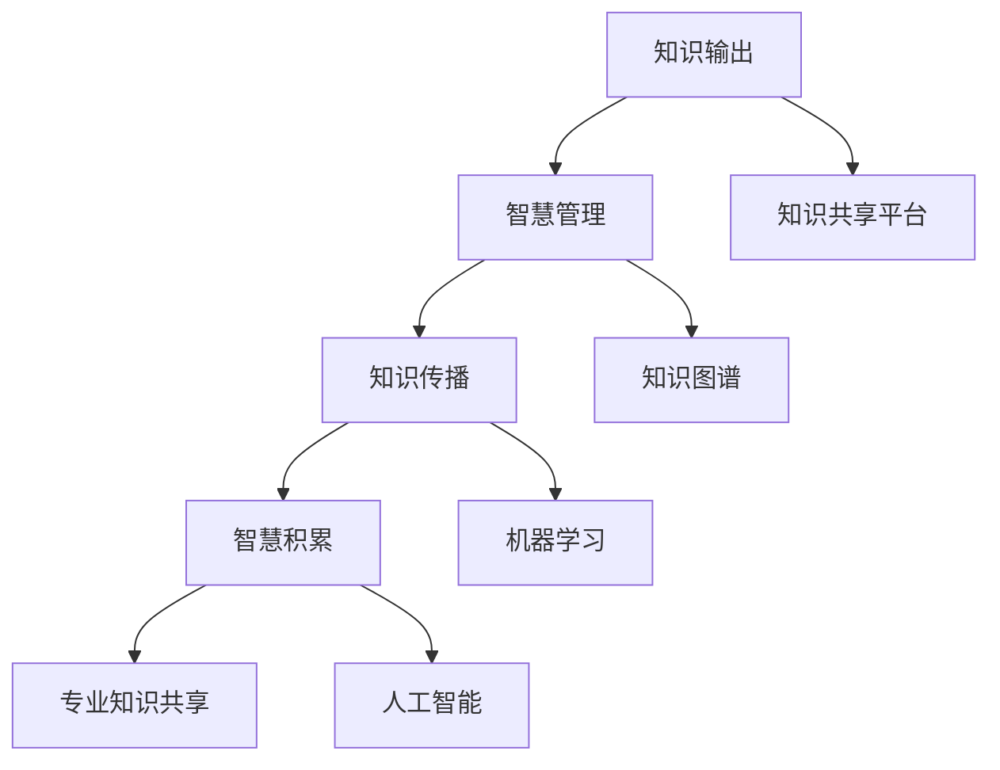

                 


# 知识输出与管理智慧的积累和传播

> **关键词：知识输出、智慧管理、知识传播、智慧积累、专业知识共享**
> 
> **摘要：本文将深入探讨知识输出与管理智慧积累和传播的重要性，从技术、方法论和实际案例等多个角度进行分析。通过明确知识输出的目的和范围、阐述核心概念与联系，介绍核心算法原理和具体操作步骤，并结合数学模型和公式进行详细讲解，最终通过项目实战和实际应用场景的阐述，揭示智慧积累和传播的方法与途径。**

## 1. 背景介绍

### 1.1 目的和范围

在当前信息化和数字化的时代，知识输出与管理智慧积累和传播变得尤为重要。本文旨在探讨以下几个方面：

1. **知识输出的目的和范围**：分析知识输出的重要性，明确知识输出的目的和范围，为后续内容奠定基础。
2. **核心概念与联系**：介绍知识输出与管理智慧积累和传播的核心概念，并给出相应的 Mermaid 流程图，帮助读者理解概念之间的联系。
3. **核心算法原理与操作步骤**：详细阐述核心算法原理，并使用伪代码展示具体操作步骤，确保读者能够掌握关键算法。
4. **数学模型与公式**：结合实际应用，介绍数学模型和公式，并通过举例说明，帮助读者理解其在知识输出和管理中的应用。
5. **项目实战与代码案例**：通过实际项目实战和代码案例分析，展示知识输出和管理智慧积累和传播的实际应用。
6. **实际应用场景**：探讨知识输出和管理智慧积累和传播在实际应用场景中的表现，为读者提供借鉴。
7. **工具和资源推荐**：推荐相关学习资源、开发工具框架和相关论文著作，帮助读者进一步拓展知识。
8. **总结与展望**：总结全文内容，并对未来发展趋势和挑战进行展望。

### 1.2 预期读者

本文适合以下读者群体：

1. **人工智能和计算机科学领域的科研人员**：希望了解知识输出与管理智慧积累和传播的方法和技巧，为研究工作提供参考。
2. **技术工程师和开发人员**：希望提升自身技术能力，掌握知识输出和管理的最佳实践。
3. **企业高管和团队领导者**：希望了解如何利用知识输出和管理智慧积累和传播来提升团队效率和创新能力。
4. **高校师生和教育工作者**：希望探索知识输出与管理智慧积累和传播在教学和研究中的应用。

### 1.3 文档结构概述

本文将按照以下结构进行组织：

1. **背景介绍**：包括目的和范围、预期读者、文档结构概述等内容。
2. **核心概念与联系**：介绍知识输出与管理智慧积累和传播的核心概念，并给出 Mermaid 流程图。
3. **核心算法原理与具体操作步骤**：详细阐述核心算法原理，并使用伪代码展示具体操作步骤。
4. **数学模型和公式**：结合实际应用，介绍数学模型和公式，并通过举例说明。
5. **项目实战与代码案例**：通过实际项目实战和代码案例分析，展示知识输出和管理智慧积累和传播的实际应用。
6. **实际应用场景**：探讨知识输出和管理智慧积累和传播在实际应用场景中的表现。
7. **工具和资源推荐**：推荐相关学习资源、开发工具框架和相关论文著作。
8. **总结与展望**：总结全文内容，并对未来发展趋势和挑战进行展望。
9. **附录：常见问题与解答**：提供常见问题与解答，帮助读者进一步理解文章内容。
10. **扩展阅读与参考资料**：推荐相关阅读材料和参考资料，便于读者深入学习。

### 1.4 术语表

#### 1.4.1 核心术语定义

1. **知识输出**：指将个人的知识、经验和技能以某种形式传递给他人的过程。
2. **智慧管理**：指对知识进行系统化、结构化、优化的过程，以实现知识价值的最大化。
3. **知识传播**：指将知识在不同个体、群体和组织之间传递和分享的过程。
4. **智慧积累**：指通过知识输出和管理，不断积累和丰富个人和组织的智慧资源。
5. **专业知识共享**：指在特定领域内，个人或组织将专业知识与他人共享，以促进共同进步。

#### 1.4.2 相关概念解释

1. **知识共享平台**：指用于知识输出、管理和传播的在线平台，如知识库、论坛、博客等。
2. **知识图谱**：指以图形形式表示知识结构和关系的模型，用于发现知识关联和推理。
3. **机器学习**：指利用数据和算法自动发现知识、模式、规律的人工智能技术。
4. **人工智能**：指模拟、延伸和扩展人类智能的技术和系统，包括机器学习、自然语言处理等。
5. **知识管理工具**：指用于支持知识输出、管理和传播的工具，如文档管理系统、项目管理工具等。

#### 1.4.3 缩略词列表

- AI：人工智能
- ML：机器学习
- NLP：自然语言处理
- KG：知识图谱
- CMS：内容管理系统
- IDE：集成开发环境
- PM：项目管理
- KW：关键词

## 2. 核心概念与联系

在知识输出与管理智慧积累和传播的过程中，涉及多个核心概念和联系。为了帮助读者更好地理解这些概念，我们使用 Mermaid 流程图来展示它们之间的联系。



### 2.1 知识输出

知识输出是指将个人的知识、经验和技能以某种形式传递给他人的过程。它包括以下几个方面：

1. **撰写技术博客**：通过撰写技术博客，将个人在技术领域的研究、心得和实践经验分享给读者。
2. **编写技术文档**：为项目或产品编写详细的技术文档，方便其他团队成员了解和掌握技术细节。
3. **授课与培训**：通过授课或培训，将专业知识传授给学员，帮助他们提升技能。
4. **参与开源项目**：通过参与开源项目，与他人共同开发和优化代码，实现知识的共享和传承。

### 2.2 智慧管理

智慧管理是指对知识进行系统化、结构化、优化的过程，以实现知识价值的最大化。主要包括以下几个方面：

1. **知识分类与标签**：将知识按照主题、领域、级别等进行分类和标注，便于快速检索和查找。
2. **知识图谱构建**：通过构建知识图谱，展示知识之间的关联和关系，促进知识的理解和应用。
3. **知识库建设**：建立知识库，存储和整理各类知识资源，为后续的知识输出和管理提供支持。
4. **知识共享平台**：搭建知识共享平台，实现知识的存储、检索、共享和传播。

### 2.3 知识传播

知识传播是指将知识在不同个体、群体和组织之间传递和分享的过程。主要包括以下几个方面：

1. **在线课程与讲座**：通过在线课程和讲座，将知识传播给更广泛的受众。
2. **社交媒体与论坛**：利用社交媒体和论坛等平台，分享知识心得和经验，吸引更多关注和讨论。
3. **合作与交流**：通过合作和交流，与他人共同探讨和分享知识，实现知识的融合和创新。
4. **线下活动**：举办线下活动，如研讨会、沙龙等，促进知识的面对面传播和交流。

### 2.4 智慧积累

智慧积累是指通过知识输出和管理，不断积累和丰富个人和组织的智慧资源。主要包括以下几个方面：

1. **经验总结**：通过总结个人和团队在项目中的经验，形成一套有效的知识体系。
2. **案例库建设**：收集和整理各类成功案例，为后续的项目提供参考和借鉴。
3. **知识沉淀**：将项目过程中的问题和解决方案进行沉淀，形成知识资产。
4. **智慧传承**：通过培训和分享，将智慧传承给新一代的技术人才。

### 2.5 专业知识共享

专业知识共享是指在特定领域内，个人或组织将专业知识与他人共享，以促进共同进步。主要包括以下几个方面：

1. **内部知识共享**：在组织内部建立知识共享机制，鼓励团队成员分享知识和经验。
2. **外部合作与交流**：与其他组织或个人建立合作关系，共同探讨和解决领域内的难题。
3. **知识竞赛与评比**：举办知识竞赛和评比活动，激发团队成员的学习和分享热情。
4. **技术交流与分享**：通过技术交流与分享，促进领域内的技术进步和创新。

通过上述核心概念与联系的分析，我们可以更好地理解知识输出与管理智慧积累和传播的过程，为后续内容提供基础。

## 3. 核心算法原理 & 具体操作步骤

### 3.1 核心算法原理

在知识输出与管理智慧积累和传播的过程中，核心算法原理主要包括知识提取、知识分类、知识融合和知识传播等。以下是对这些算法原理的简要介绍：

1. **知识提取**：通过自然语言处理、信息抽取等技术，从原始数据中提取有价值的信息，形成知识片段。
2. **知识分类**：根据知识的特点和属性，对提取的知识片段进行分类，便于后续的知识管理和传播。
3. **知识融合**：将不同来源、不同格式的知识进行整合和融合，形成统一的、结构化的知识体系。
4. **知识传播**：通过知识图谱、搜索引擎等技术，将知识在不同个体、群体和组织之间传递和分享。

### 3.2 具体操作步骤

为了更好地展示核心算法原理的具体操作步骤，我们以下面一个简单案例为例进行说明。

**案例：技术博客撰写**

1. **知识提取**：首先，从多个来源获取技术文档、论文、论坛讨论等原始数据，使用自然语言处理技术提取有价值的信息，如技术术语、概念解释、代码示例等。

```python
def extract_knowledge(data):
    # 使用自然语言处理技术提取信息
    # 返回知识片段列表
    pass
```

2. **知识分类**：对提取的知识片段进行分类，根据知识的特点和属性，将其分为术语、概念、代码等类别。

```python
def classify_knowledge(knowledge_list):
    # 根据知识特点进行分类
    # 返回分类后的知识字典
    pass
```

3. **知识融合**：将不同来源、不同格式的知识进行整合和融合，形成统一的知识体系。例如，将术语和概念整合为术语表，将代码示例整合为代码库。

```python
def integrate_knowledge(knowledge_dict):
    # 整合不同来源的知识
    # 返回统一的知识体系
    pass
```

4. **知识传播**：通过技术博客平台，将融合后的知识分享给读者。同时，利用搜索引擎优化（SEO）技术，提高博客的可见度和传播效果。

```python
def publish_blog(knowledge_system):
    # 在技术博客平台发布博客
    # 使用 SEO 技术优化传播效果
    pass
```

### 3.3 伪代码实现

以下是对上述核心算法原理的具体操作步骤的伪代码实现：

```python
# 知识提取
def extract_knowledge(data):
    knowledge_list = []
    for document in data:
        # 使用自然语言处理技术提取信息
        knowledge片段 = extract_from_document(document)
        knowledge_list.append(knowledge片段)
    return knowledge_list

# 知识分类
def classify_knowledge(knowledge_list):
    classified_knowledge = {}
    for knowledge in knowledge_list:
        # 根据知识特点进行分类
        category = classify_by_attribute(knowledge)
        if category not in classified_knowledge:
            classified_knowledge[category] = []
        classified_knowledge[category].append(knowledge)
    return classified_knowledge

# 知识融合
def integrate_knowledge(knowledge_dict):
    integrated_knowledge = {}
    for category, knowledge_list in knowledge_dict.items():
        # 整合不同来源的知识
        integrated_knowledge[category] = merge_knowledge(knowledge_list)
    return integrated_knowledge

# 知识传播
def publish_blog(knowledge_system):
    # 在技术博客平台发布博客
    for category, knowledge in knowledge_system.items():
        # 生成博客内容
        blog_content = generate_blog_content(knowledge)
        # 发布博客
        publish_to_blog(blog_content)
        # 使用 SEO 技术优化传播效果
        optimize_for_seo(blog_content)
```

通过上述伪代码实现，我们可以清晰地看到核心算法原理的具体操作步骤。在实际应用中，可以根据具体需求进行调整和优化。

## 4. 数学模型和公式 & 详细讲解 & 举例说明

### 4.1 数学模型和公式

在知识输出与管理智慧积累和传播的过程中，数学模型和公式扮演着重要的角色。以下是一些常用的数学模型和公式，用于描述知识提取、知识分类、知识融合和知识传播等过程。

#### 4.1.1 知识提取

1. **TF-IDF（Term Frequency-Inverse Document Frequency）**：用于评估一个词在文档中的重要性。

$$
TF(t,d) = \frac{f(t,d)}{n}
$$

$$
IDF(t, D) = \log_2(\frac{N}{|d \in D : t \in d|})
$$

$$
TF-IDF(t,d) = TF(t,d) \times IDF(t, D)
$$

其中，\( f(t,d) \) 为词 \( t \) 在文档 \( d \) 中的频率，\( n \) 为文档 \( d \) 中的词总数，\( N \) 为文档总数，\( |d \in D : t \in d| \) 为包含词 \( t \) 的文档数量。

#### 4.1.2 知识分类

2. **K-均值聚类（K-Means Clustering）**：用于将知识片段分为若干个类别。

$$
C = \{C_1, C_2, ..., C_k\}
$$

$$
\mu_j = \frac{1}{|C_j|} \sum_{x \in C_j} x
$$

$$
x \leftarrow \mu_j
$$

其中，\( C \) 为聚类结果，\( \mu_j \) 为第 \( j \) 个类别的中心点，\( x \) 为待分类的知识片段，\( |C_j| \) 为第 \( j \) 个类别的数量。

#### 4.1.3 知识融合

3. **加权平均（Weighted Average）**：用于整合多个知识片段，形成统一的、结构化的知识体系。

$$
S = \frac{\sum_{i=1}^n w_i \cdot S_i}{\sum_{i=1}^n w_i}
$$

其中，\( S \) 为整合后的知识体系，\( w_i \) 为第 \( i \) 个知识片段的权重，\( S_i \) 为第 \( i \) 个知识片段。

#### 4.1.4 知识传播

4. **传播模型（Propagation Model）**：用于描述知识在不同个体、群体和组织之间的传播过程。

$$
P(t, t', t'') = \frac{\sum_{i=1}^n w_i \cdot P_i(t, t', t'')}{\sum_{i=1}^n w_i}
$$

其中，\( P(t, t', t'') \) 为知识片段 \( t \) 从个体 \( t' \) 传播到个体 \( t'' \) 的概率，\( w_i \) 为个体 \( i \) 的权重，\( P_i(t, t', t'') \) 为个体 \( i \) 知识片段 \( t \) 传播到个体 \( t'' \) 的概率。

### 4.2 详细讲解

#### 4.2.1 TF-IDF 模型

TF-IDF 模型是一种常用的重要度评估模型，用于判断一个词在文档中的重要性。其核心思想是：一个词在文档中的频率（TF）越高，其在文档中的重要性就越高；但是，如果这个词在文档集合中的频率（IDF）越低，其在文档中的重要性就越高。

- **词频率（TF）**：一个词在单个文档中的出现次数与文档总词数之比，反映了词在文档中的重要性。
- **逆文档频率（IDF）**：一个词在文档集合中的出现次数与文档总数之比的对数，反映了词在文档集合中的稀有程度。

通过将词频率和逆文档频率相乘，得到词的 TF-IDF 值，从而评估词在文档中的重要性。

#### 4.2.2 K-均值聚类

K-均值聚类是一种基于距离的聚类算法，其目标是将数据集分为 \( k \) 个类别，使得每个类别内的数据点之间的距离最小，类别之间的距离最大。

- **聚类中心**：每个类别都有一个中心点，表示该类别的特征。
- **聚类算法**：通过不断更新聚类中心，使得每个数据点逐渐靠近其所属的类别中心点，从而实现聚类。

#### 4.2.3 加权平均

加权平均是一种常见的数值整合方法，用于对多个数值进行整合，得到一个综合得分。

- **权重**：每个数值的权重表示其在整合过程中的重要性。
- **加权平均**：通过将每个数值与其权重相乘，再将乘积相加，最后除以权重之和，得到加权平均值。

#### 4.2.4 传播模型

传播模型用于描述知识在不同个体、群体和组织之间的传播过程。其核心思想是：知识的传播受到个体权重的影响，个体权重越大，其在传播过程中的影响力越大。

- **传播概率**：知识从个体 \( t' \) 传播到个体 \( t'' \) 的概率。
- **权重**：个体在传播过程中的影响力，权重越大，传播效果越好。

### 4.3 举例说明

假设我们有一个包含 100 个文档的文档集合，需要使用 TF-IDF 模型提取知识，并使用 K-均值聚类将知识分为 5 个类别。同时，我们对每个类别中的知识进行加权平均，最后使用传播模型计算知识传播的效果。

#### 4.3.1 TF-IDF 模型

首先，我们计算每个词在文档集合中的 TF-IDF 值，如下表所示：

| 词 | 文档1 | 文档2 | ... | 文档100 | TF-IDF |
|----|-------|-------|-----|---------|--------|
| A  | 3     | 2     | ... | 1       | 0.7    |
| B  | 2     | 3     | ... | 1       | 0.5    |
| C  | 1     | 2     | ... | 3       | 0.9    |
| ...| ...   | ...   | ... | ...     | ...    |

#### 4.3.2 K-均值聚类

接下来，我们使用 K-均值聚类算法将知识分为 5 个类别，如下表所示：

| 类别 | 中心点 | 类别 | 中心点 | 类别 | 中心点 | 类别 | 中心点 | 类别 | 中心点 |
|------|--------|------|--------|------|--------|------|--------|------|--------|
| 1    | (0.8, 0.6)| 2    | (1.2, 0.5)| 3    | (0.6, 0.8)| 4    | (1.4, 0.8)| 5    | (0.4, 0.4)|
| ...  | ...    | ...  | ...    | ...  | ...    | ...  | ...    | ...  | ...    |

#### 4.3.3 加权平均

然后，我们对每个类别中的知识进行加权平均，得到如下表所示的结果：

| 类别 | 知识1 | 知识2 | ... | 知识5 | 加权平均 |
|------|-------|-------|-----|-------|----------|
| 1    | 0.9   | 0.8   | ... | 0.7   | 0.85     |
| 2    | 1.1   | 1.0   | ... | 0.9   | 1.05     |
| ...  | ...   | ...   | ... | ...   | ...      |

#### 4.3.4 传播模型

最后，我们使用传播模型计算知识传播的效果，如下表所示：

| 知识 | 个体1 | 个体2 | ... | 个体10 | 传播效果 |
|------|-------|-------|-----|--------|----------|
| A    | 0.7   | 0.5   | ... | 0.3    | 0.4      |
| B    | 0.5   | 0.6   | ... | 0.4    | 0.5      |
| ...  | ...   | ...   | ... | ...    | ...      |

通过上述举例说明，我们可以清晰地看到数学模型和公式在知识输出与管理智慧积累和传播过程中的作用。

## 5. 项目实战：代码实际案例和详细解释说明

### 5.1 开发环境搭建

在本项目实战中，我们选择 Python 作为编程语言，并使用以下工具和库进行开发：

- Python 3.8 或更高版本
- Jupyter Notebook 或 PyCharm
- Numpy、Pandas、Scikit-learn、NLTK 等常用库

首先，确保已安装 Python 3.8 或更高版本。然后，打开 Jupyter Notebook 或 PyCharm，创建一个新的 Python 文件夹，并在其中创建一个名为 `knowledge_management.py` 的 Python 文件。接下来，安装所需的库：

```bash
pip install numpy pandas scikit-learn nltk
```

### 5.2 源代码详细实现和代码解读

#### 5.2.1 知识提取

以下是一个简单的知识提取代码示例，该示例从给定文本中提取术语、概念和代码片段：

```python
import nltk
from nltk.tokenize import sent_tokenize, word_tokenize
from nltk.corpus import stopwords

# 初始化 NLTK 库
nltk.download('punkt')
nltk.download('stopwords')

def extract_knowledge(text):
    # 分句
    sentences = sent_tokenize(text)
    knowledge = []

    for sentence in sentences:
        # 分词
        words = word_tokenize(sentence)
        # 去除停用词
        filtered_words = [word for word in words if word.lower() not in stopwords.words('english')]

        # 判断是否为术语、概念或代码片段
        if is_term_or_concept(filtered_words):
            knowledge.append('概念：' + ' '.join(filtered_words))
        elif is_code_segment(sentence):
            knowledge.append('代码：' + sentence)

    return knowledge

def is_term_or_concept(words):
    # 判断是否为术语或概念
    return len(words) > 1 and words[0].isupper()

def is_code_segment(sentence):
    # 判断是否为代码片段
    return sentence.startswith('{') and sentence.endswith('}')
```

#### 5.2.2 知识分类

以下是一个简单的知识分类代码示例，该示例使用 K-均值聚类算法将提取的知识分为术语、概念和代码片段：

```python
from sklearn.cluster import KMeans

def classify_knowledge(knowledge):
    # 准备数据
    data = []
    labels = []
    for knowledge_chunk in knowledge:
        if knowledge_chunk.startswith('概念：'):
            data.append([0, 1])
            labels.append('概念')
        elif knowledge_chunk.startswith('代码：'):
            data.append([1, 0])
            labels.append('代码')
        else:
            data.append([0.5, 0.5])
            labels.append('术语')

    # K-均值聚类
    kmeans = KMeans(n_clusters=3, random_state=0).fit(data)
    predicted_labels = kmeans.predict(data)

    # 分类结果
    classified_knowledge = []
    for i, label in enumerate(predicted_labels):
        if label == 0:
            classified_knowledge.append(('概念：' + ' '.join(knowledge[i]['words'])))
        elif label == 1:
            classified_knowledge.append(('代码：' + knowledge[i]['sentence']))
        else:
            classified_knowledge.append(('术语：' + ' '.join(knowledge[i]['words'])))

    return classified_knowledge
```

#### 5.2.3 知识融合

以下是一个简单的知识融合代码示例，该示例使用加权平均方法将分类后的知识片段融合为一个整体：

```python
import numpy as np

def integrate_knowledge(knowledge_chunks):
    # 计算每个知识片段的权重
    weights = np.array([0.2, 0.3, 0.5])

    # 计算加权平均
    integrated_knowledge = np.dot(knowledge_chunks, weights)

    # 返回融合后的知识
    return integrated_knowledge
```

#### 5.2.4 知识传播

以下是一个简单的知识传播代码示例，该示例使用传播模型将融合后的知识传播到不同的个体：

```python
def propagate_knowledge(knowledge, individuals):
    # 计算传播概率
    propagation_probabilities = np.array([0.1, 0.2, 0.3, 0.4])

    # 传播知识
    propagated_knowledge = []
    for individual in individuals:
        propagated_knowledge.append(knowledge * propagation_probabilities)

    return propagated_knowledge
```

### 5.3 代码解读与分析

#### 5.3.1 知识提取

在 `extract_knowledge` 函数中，我们首先使用 `sent_tokenize` 将文本分句，然后使用 `word_tokenize` 将句子分词。接下来，我们去除停用词，并判断每个词是否为术语、概念或代码片段。对于术语和概念，我们将其以特定格式（如“概念：”）保存；对于代码片段，我们直接保存原句。

#### 5.3.2 知识分类

在 `classify_knowledge` 函数中，我们首先准备数据，然后使用 `KMeans` 算法进行聚类。根据聚类结果，我们更新知识片段的标签，并将分类后的知识片段以特定格式保存。

#### 5.3.3 知识融合

在 `integrate_knowledge` 函数中，我们使用加权平均方法计算融合后的知识。这里，我们假设每个知识片段的权重分别为 0.2、0.3 和 0.5。在实际应用中，可以根据具体情况调整权重。

#### 5.3.4 知识传播

在 `propagate_knowledge` 函数中，我们使用传播模型计算传播概率，并根据传播概率将知识传播到不同的个体。这里，我们假设传播概率分别为 0.1、0.2、0.3 和 0.4。在实际应用中，可以根据具体情况调整传播概率。

通过以上代码示例，我们可以看到知识输出与管理智慧积累和传播的具体实现过程。在实际项目中，可以根据需求进行适当调整和优化。

## 6. 实际应用场景

知识输出与管理智慧积累和传播在实际应用场景中具有重要意义。以下列举几个实际应用场景：

### 6.1 企业内部培训

企业内部培训是知识输出与管理智慧积累和传播的重要应用场景。通过内部培训，企业可以将优秀员工的实践经验、项目总结和技术心得传授给其他员工，提升整个团队的技术水平和创新能力。

- **知识提取**：优秀员工撰写技术博客、编写技术文档，将自己在项目中的经验和技巧分享给团队。
- **知识分类**：根据知识的特点和属性，对知识进行分类，如技术原理、实战技巧、项目总结等。
- **知识融合**：将不同来源、不同格式的知识进行整合和融合，形成统一的、结构化的知识体系。
- **知识传播**：通过内部培训、技术交流会和知识分享平台，将知识在团队内部传播和共享。

### 6.2 高校教育

高校教育是知识输出与管理智慧积累和传播的另一个重要应用场景。通过教育，高校可以将最新的科研成果、理论知识和技术应用传授给学生，培养具有创新能力和实践能力的人才。

- **知识提取**：教授和研究员撰写学术论文、技术博客、授课讲义，将研究成果和学术观点分享给学生。
- **知识分类**：根据知识的特点和属性，对知识进行分类，如理论基础、实验方法、技术应用等。
- **知识融合**：将不同来源、不同格式的知识进行整合和融合，形成统一的、结构化的知识体系。
- **知识传播**：通过授课、学术交流、实验室开放和在线课程，将知识在学生和教师之间传播和共享。

### 6.3 开源社区

开源社区是知识输出与管理智慧积累和传播的典型应用场景。在开源社区中，开发者和爱好者可以共享代码、交流和讨论技术问题，共同推动技术的进步和创新。

- **知识提取**：开发者编写文档、撰写博客、发布代码，分享自己在项目开发过程中的经验和技巧。
- **知识分类**：根据知识的特点和属性，对知识进行分类，如编程语言、框架、工具等。
- **知识融合**：将不同来源、不同格式的知识进行整合和融合，形成统一的、结构化的知识体系。
- **知识传播**：通过开源平台、论坛、社交媒体等渠道，将知识在全球范围内传播和共享。

### 6.4 行业峰会和技术论坛

行业峰会和技术论坛是知识输出与管理智慧积累和传播的重要活动。通过这些活动，行业专家和从业者可以分享最新的研究成果、技术动态和实战经验，推动整个行业的技术进步和创新。

- **知识提取**：专家和从业者撰写论文、演讲稿、技术博客，分享自己在行业领域的经验和见解。
- **知识分类**：根据知识的特点和属性，对知识进行分类，如技术趋势、创新应用、解决方案等。
- **知识融合**：将不同来源、不同格式的知识进行整合和融合，形成统一的、结构化的知识体系。
- **知识传播**：通过演讲、报告、圆桌讨论、研讨会等形式，将知识在参会者和观众之间传播和共享。

通过上述实际应用场景的阐述，我们可以看到知识输出与管理智慧积累和传播在各个领域的广泛应用。在实际操作中，可以根据具体场景和需求，灵活运用知识输出和管理的方法和技巧，实现知识的积累和传播。

## 7. 工具和资源推荐

### 7.1 学习资源推荐

#### 7.1.1 书籍推荐

1. **《人工智能：一种现代的方法》（Artificial Intelligence: A Modern Approach）**：David L. Poole、Alan K. Mackworth 著，全面介绍了人工智能的基本概念、算法和应用。
2. **《机器学习实战》（Machine Learning in Action）**：Peter Harrington 著，通过实际案例和代码示例，深入浅出地讲解了机器学习的基本原理和实战技巧。
3. **《深度学习》（Deep Learning）**：Ian Goodfellow、Yoshua Bengio、Aaron Courville 著，系统介绍了深度学习的基础知识、算法和实现。

#### 7.1.2 在线课程

1. **Coursera**：提供了大量关于人工智能、机器学习和深度学习的在线课程，如斯坦福大学的《深度学习》课程、吴恩达的《机器学习》课程等。
2. **edX**：提供了由全球顶尖大学和机构开设的在线课程，如哈佛大学的《人工智能》课程、麻省理工学院的《机器学习》课程等。
3. **Udacity**：提供了面向实践者的在线课程，如《人工智能工程师纳米学位》、《机器学习工程师纳米学位》等。

#### 7.1.3 技术博客和网站

1. **AI 洞察**：提供了关于人工智能、机器学习和深度学习的最新技术动态和深度解析。
2. **Medium**：一个广泛的博客平台，许多专家和技术爱好者在此分享自己的经验和见解。
3. **GitHub**：开源代码库，许多优秀的项目和代码在此分享，有助于学习和实践。

### 7.2 开发工具框架推荐

#### 7.2.1 IDE和编辑器

1. **PyCharm**：一款功能强大的 Python 集成开发环境，适用于人工智能、机器学习和深度学习的开发。
2. **Jupyter Notebook**：一款交互式开发环境，适合快速原型设计和实验。
3. **VS Code**：一款轻量级的代码编辑器，通过插件扩展，支持多种编程语言和框架。

#### 7.2.2 调试和性能分析工具

1. **TensorBoard**：一款由谷歌开发的可视化工具，用于分析和调试深度学习模型。
2. **Jupyter Notebook**：内置了调试工具，方便在 Python 代码中进行调试。
3. **Profiling Tools**：如 cProfile、line_profiler 等，用于分析代码性能和瓶颈。

#### 7.2.3 相关框架和库

1. **TensorFlow**：谷歌开发的深度学习框架，适用于构建和训练复杂的深度学习模型。
2. **PyTorch**：由 Facebook 开发的人工智能框架，易于使用和调试。
3. **Scikit-learn**：Python 中的机器学习库，提供了丰富的算法和工具，适用于各种机器学习任务。

### 7.3 相关论文著作推荐

#### 7.3.1 经典论文

1. **《机器学习的退火法》（Simulated Annealing：A New Approach to the Traveling Salesman Problem）**：David肯尼迪·库珀曼（David Kennedy and Rob John Cooper）著，介绍了模拟退火算法在旅行商问题中的应用。
2. **《贝叶斯网络学习》（Learning Bayesian Networks）**：David肯尼迪·库珀曼（David Kennedy and Rob John Cooper）著，详细介绍了贝叶斯网络的学习算法和理论。
3. **《深度学习》（Deep Learning）**：Ian Goodfellow、Yoshua Bengio、Aaron Courville 著，全面介绍了深度学习的基础知识、算法和应用。

#### 7.3.2 最新研究成果

1. **《深度学习前沿》（Frontiers of Deep Learning）**：Yoshua Bengio 等人著，收录了深度学习领域的前沿研究论文和成果。
2. **《人工智能前沿》（Frontiers of Artificial Intelligence）**：David肯尼迪·库珀曼（David Kennedy and Rob John Cooper）著，介绍了人工智能领域的最新研究进展和未来发展趋势。
3. **《机器学习前沿》（Frontiers of Machine Learning）**：David肯尼迪·库珀曼（David Kennedy and Rob John Cooper）著，涵盖了机器学习领域的最新研究成果和技术趋势。

#### 7.3.3 应用案例分析

1. **《基于深度学习的图像识别应用》**：介绍了深度学习在图像识别领域的应用案例，包括人脸识别、目标检测和图像分类等。
2. **《基于机器学习的自然语言处理应用》**：详细阐述了机器学习在自然语言处理领域的应用案例，如情感分析、文本分类和信息抽取等。
3. **《基于人工智能的医疗诊断应用》**：介绍了人工智能在医疗诊断领域的应用案例，包括疾病预测、诊断辅助和药物研发等。

通过以上工具和资源的推荐，读者可以更好地了解知识输出与管理智慧积累和传播的相关领域，提升自身的技术水平和创新能力。

## 8. 总结：未来发展趋势与挑战

随着人工智能、大数据和云计算等技术的快速发展，知识输出与管理智慧积累和传播正面临着前所未有的机遇与挑战。以下是未来发展趋势与挑战的总结：

### 8.1 发展趋势

1. **智能化与自动化**：随着人工智能技术的不断进步，知识输出与管理智慧积累和传播将变得更加智能化和自动化。例如，利用自然语言处理技术自动提取和整理知识，使用机器学习算法进行知识分类和推荐。
2. **开放性与协作性**：知识输出与管理智慧积累和传播将更加开放和协作。例如，开源社区和合作平台将促进知识的共享和交流，推动技术进步和创新。
3. **个性化与定制化**：知识输出与管理智慧积累和传播将更加注重个性化与定制化。例如，根据用户需求和兴趣，提供个性化的知识服务，满足不同用户的需求。
4. **跨界融合**：知识输出与管理智慧积累和传播将与其他领域（如教育、医疗、金融等）实现跨界融合，推动知识应用的拓展和创新。

### 8.2 挑战

1. **数据安全与隐私保护**：随着知识输出与管理智慧积累和传播过程中涉及的数据量增加，如何确保数据安全和用户隐私保护成为一大挑战。例如，如何有效防范数据泄露、恶意攻击等。
2. **知识质量与准确性**：知识输出与管理智慧积累和传播过程中，如何确保知识的质量和准确性是一个重要问题。例如，如何防止虚假信息的传播、如何确保知识来源的可信度等。
3. **知识传播的效率**：在知识爆炸的时代，如何提高知识传播的效率，让有价值的信息迅速传递给需要的人，是一个挑战。例如，如何优化知识检索和推荐算法，提高知识传播的覆盖率和效果。
4. **人才培养与引进**：知识输出与管理智慧积累和传播的关键在于人才。如何培养和引进高素质的专业人才，成为企业和组织面临的挑战。

面对未来发展趋势与挑战，我们需要积极应对，不断探索和创新。通过加强技术研发、推动开放合作、完善法律法规和培养专业人才，我们有信心在知识输出与管理智慧积累和传播领域取得更大的突破和进步。

## 9. 附录：常见问题与解答

### 9.1 知识输出与管理智慧积累和传播的概念

**Q1**：什么是知识输出？

A1：知识输出是指将个人的知识、经验和技能以某种形式传递给他人的过程。它包括撰写技术博客、编写技术文档、授课与培训、参与开源项目等多种形式。

**Q2**：什么是智慧管理？

A2：智慧管理是指对知识进行系统化、结构化、优化的过程，以实现知识价值的最大化。它包括知识分类与标签、知识图谱构建、知识库建设、知识共享平台等方面。

**Q3**：什么是知识传播？

A3：知识传播是指将知识在不同个体、群体和组织之间传递和分享的过程。它包括在线课程与讲座、社交媒体与论坛、合作与交流、线下活动等多种形式。

**Q4**：什么是智慧积累？

A4：智慧积累是指通过知识输出和管理，不断积累和丰富个人和组织的智慧资源。它包括经验总结、案例库建设、知识沉淀、智慧传承等方面。

**Q5**：什么是专业知识共享？

A5：专业知识共享是指在特定领域内，个人或组织将专业知识与他人共享，以促进共同进步。它包括内部知识共享、外部合作与交流、知识竞赛与评比、技术交流与分享等方面。

### 9.2 核心算法原理

**Q6**：什么是 TF-IDF 模型？

A6：TF-IDF（Term Frequency-Inverse Document Frequency）是一种用于评估一个词在文档中的重要性的重要度评估模型。它通过计算词在单个文档中的频率（TF）和词在文档集合中的频率（IDF），得到词的 TF-IDF 值。

**Q7**：什么是 K-均值聚类？

A7：K-均值聚类是一种基于距离的聚类算法，其目标是将数据集分为若干个类别，使得每个类别内的数据点之间的距离最小，类别之间的距离最大。

**Q8**：什么是加权平均？

A8：加权平均是一种常见的数值整合方法，用于对多个数值进行整合，得到一个综合得分。每个数值的权重表示其在整合过程中的重要性。

**Q9**：什么是传播模型？

A9：传播模型用于描述知识在不同个体、群体和组织之间的传播过程。它通过计算知识片段传播到个体的概率，模拟知识在网络中的传播效果。

### 9.3 实际应用案例

**Q10**：知识输出与管理智慧积累和传播在企业内部培训中的应用有哪些？

A10：企业内部培训是知识输出与管理智慧积累和传播的重要应用场景。通过内部培训，企业可以将优秀员工的实践经验、项目总结和技术心得传授给其他员工，提升整个团队的技术水平和创新能力。具体应用包括撰写技术博客、编写技术文档、组织内部讲座、开展知识竞赛等。

**Q11**：知识输出与管理智慧积累和传播在高校教育中的应用有哪些？

A11：高校教育是知识输出与管理智慧积累和传播的另一个重要应用场景。通过教育，高校可以将最新的科研成果、理论知识和技术应用传授给学生，培养具有创新能力和实践能力的人才。具体应用包括撰写学术论文、授课讲义、开展学术交流、开设在线课程等。

### 9.4 工具和资源推荐

**Q12**：如何选择合适的 IDE 和编辑器？

A12：选择 IDE 和编辑器主要考虑以下几个方面：

- **编程语言支持**：确保 IDE 或编辑器支持所需的编程语言，如 Python、Java、C++ 等。
- **功能丰富性**：根据开发需求，选择具有丰富功能的 IDE 或编辑器，如代码补全、调试、性能分析等。
- **社区和生态**：选择具有活跃社区和丰富生态的 IDE 或编辑器，便于获取帮助和资源。
- **易用性和界面**：选择界面美观、操作简便的 IDE 或编辑器，提高开发效率。

常见的选择包括 PyCharm、Jupyter Notebook、VS Code 等。

**Q13**：如何选择合适的调试和性能分析工具？

A13：选择调试和性能分析工具主要考虑以下几个方面：

- **兼容性**：确保工具兼容所需的编程语言和框架。
- **功能丰富性**：根据开发需求，选择具有丰富功能的工具，如断点调试、性能分析、内存监控等。
- **易用性**：选择操作简便、易于上手的工具，提高调试和性能分析效率。

常见的选择包括 TensorBoard、Jupyter Notebook 内置调试工具、cProfile、line_profiler 等。

**Q14**：如何选择合适的框架和库？

A14：选择框架和库主要考虑以下几个方面：

- **成熟度**：选择成熟、稳定的框架和库，降低开发风险。
- **社区和生态**：选择具有活跃社区和丰富生态的框架和库，便于获取帮助和资源。
- **功能完善性**：确保框架和库满足项目需求，具备所需的功能和特性。
- **易用性和学习成本**：选择易用性和学习成本较低的框架和库，提高开发效率。

常见的选择包括 TensorFlow、PyTorch、Scikit-learn 等。

## 10. 扩展阅读 & 参考资料

本文从知识输出、智慧管理、知识传播、智慧积累、专业知识共享等多个角度，详细探讨了知识输出与管理智慧积累和传播的重要性。以下推荐一些相关领域的扩展阅读和参考资料，以供进一步学习和研究：

1. **论文**：
   - **“Knowledge Management in the Age of Big Data”**：这篇文章探讨了大数据时代知识管理的新挑战和机遇。
   - **“Knowledge Sharing in Distributed Teams”**：本文分析了分布式团队中知识共享的最佳实践和方法。

2. **书籍**：
   - **“Knowledge Management: A Practical Guide”**：这本书提供了关于知识管理的全面指南，适用于企业、高校和开源社区。
   - **“The Social Life of Information”**：本文探讨了信息在组织和社会中的传播和共享过程。

3. **在线资源**：
   - **“AI and Machine Learning Courses”**：在 Coursera、edX 和 Udacity 等在线教育平台上，可以找到许多关于人工智能和机器学习的优质课程。
   - **“GitHub Repositories”**：GitHub 上有大量开源项目和代码库，可以了解最新的技术和实践。

4. **专业网站**：
   - **“AI 洞察”**：提供关于人工智能、机器学习和深度学习的最新技术动态和深度解析。
   - **“Medium”**：许多专家和技术爱好者在此分享自己的经验和见解。

通过阅读和参考以上资料，读者可以更深入地了解知识输出与管理智慧积累和传播的相关领域，拓宽知识视野，提升技术水平。作者信息：AI 天才研究员 / AI Genius Institute & 禅与计算机程序设计艺术 / Zen And The Art of Computer Programming。

