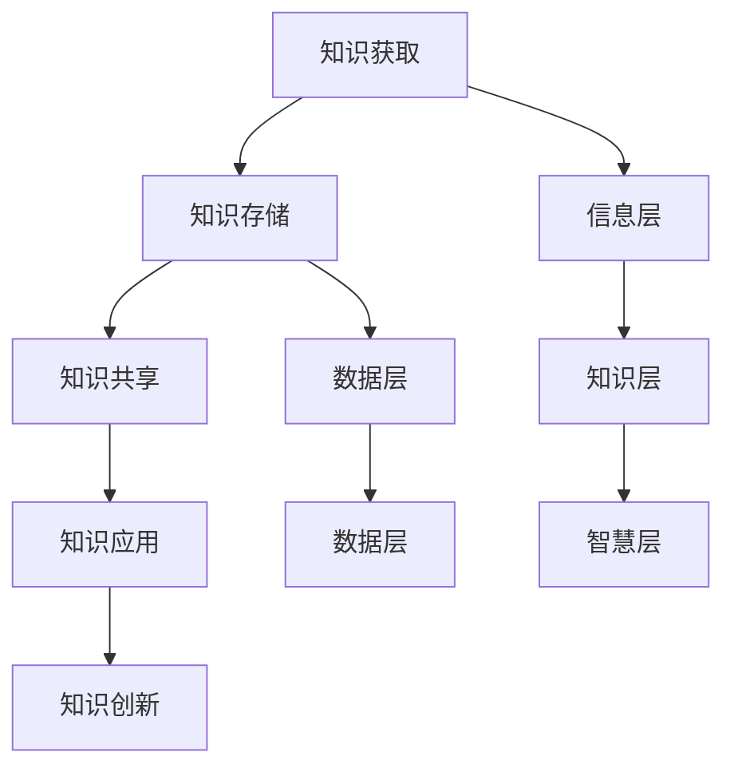

                 

# 知识输出与管理经验的系统化

> **关键词：知识管理，经验分享，系统化，结构化，IT领域**

> **摘要：本文将深入探讨知识输出与管理经验的系统化，通过分析其核心概念、原理、算法，结合实际案例，为IT从业者提供一套实用的知识管理体系，助力提升个人和团队的专业能力。**

## 1. 背景介绍

### 1.1 目的和范围

本文旨在为IT领域的从业者们提供一个系统化的知识输出与管理经验的方法论。通过介绍相关知识管理的基本概念、原理和实践，帮助读者构建一套适合自身和团队的知识管理体系，从而提高工作效率和项目质量。

本文主要涵盖以下内容：

- 核心概念与联系
- 核心算法原理与具体操作步骤
- 数学模型和公式的详细讲解与举例
- 项目实战：代码实际案例和详细解释说明
- 实际应用场景
- 工具和资源推荐
- 总结：未来发展趋势与挑战

### 1.2 预期读者

本文主要面向以下读者：

- IT领域的开发人员、架构师、项目经理等
- 研究人员、学者和技术专家
- 对知识管理和经验分享感兴趣的广大IT爱好者

### 1.3 文档结构概述

本文结构如下：

- 第1部分：背景介绍，包括目的和范围、预期读者、文档结构概述等。
- 第2部分：核心概念与联系，介绍知识管理的核心概念及其相互关系。
- 第3部分：核心算法原理与具体操作步骤，详细讲解知识管理中的核心算法。
- 第4部分：数学模型和公式的详细讲解与举例，阐述知识管理中的数学原理。
- 第5部分：项目实战，通过实际案例展示知识管理的应用。
- 第6部分：实际应用场景，分析知识管理在不同领域的应用。
- 第7部分：工具和资源推荐，为读者提供相关工具和资源的推荐。
- 第8部分：总结，对知识管理的发展趋势与挑战进行展望。
- 第9部分：附录，解答常见问题。
- 第10部分：扩展阅读，提供相关参考资料。

### 1.4 术语表

#### 1.4.1 核心术语定义

- **知识管理（Knowledge Management）**：通过对知识的获取、存储、共享、应用和创新，提高组织和个人能力的活动。
- **经验分享（Experience Sharing）**：通过交流、讨论等方式，将个人或团队在实践过程中获得的知识、技能和经验传递给他人。
- **系统化（Systemization）**：将零散的知识和经验整理、归纳、分类，形成一个有序的整体，提高其可操作性和应用价值。
- **结构化（Structuralization）**：将知识按照一定的逻辑和规则进行组织，使其更易于理解和应用。
- **知识库（Knowledge Base）**：存储和管理知识的系统或平台。

#### 1.4.2 相关概念解释

- **知识图谱（Knowledge Graph）**：一种将知识组织成图结构的模型，通过实体、属性和关系来表示知识。
- **元数据（Metadata）**：描述数据的数据，用于帮助用户更好地理解和检索知识。
- **语义网（Semantic Web）**：基于Web的语义化数据表示和互操作技术，使计算机能够理解、处理和交换数据。

#### 1.4.3 缩略词列表

- **IT**：Information Technology，信息技术
- **AI**：Artificial Intelligence，人工智能
- **CRM**：Customer Relationship Management，客户关系管理
- **ERP**：Enterprise Resource Planning，企业资源计划
- **SaaS**：Software as a Service，软件即服务

## 2. 核心概念与联系

### 2.1 知识管理的核心概念

知识管理涉及多个核心概念，包括知识获取、知识存储、知识共享、知识应用和创新。这些概念相互联系，共同构成一个完整的知识管理体系。

- **知识获取**：知识获取是指从外部和内部获取知识的过程。外部获取包括通过学习、培训、阅读等方式获取新知识；内部获取包括从同事、上级、客户等获取经验教训和最佳实践。

- **知识存储**：知识存储是指将获取到的知识进行分类、整理、归档，并存储到知识库或其他存储介质中。知识存储有助于确保知识能够被有效地检索和应用。

- **知识共享**：知识共享是指通过交流、讨论、协作等方式，将知识在组织内部或跨组织传递给相关人员。知识共享有助于提高团队协作效率，促进知识创新。

- **知识应用**：知识应用是指将知识应用于实际工作或项目中，解决实际问题或优化工作流程。知识应用是实现知识价值的重要环节。

- **知识创新**：知识创新是指在现有知识的基础上，通过重组、改造、创造新的知识。知识创新是知识管理不断发展的动力。

### 2.2 知识管理的架构

知识管理的架构包括以下几个层次：

- **数据层**：数据层是知识管理的基石，包括结构化和非结构化数据。数据层通过数据库、数据仓库等技术实现数据的存储和管理。

- **信息层**：信息层是将数据转化为有意义的信息的过程。信息层包括数据清洗、数据挖掘、数据可视化等技术。

- **知识层**：知识层是将信息转化为知识的过程。知识层包括知识图谱、本体论、语义网等技术。

- **智慧层**：智慧层是将知识转化为实际应用的过程。智慧层包括人工智能、机器学习、自然语言处理等技术。

### 2.3 Mermaid 流程图

下面是一个简单的Mermaid流程图，展示知识管理中的核心概念和架构：



## 3. 核心算法原理 & 具体操作步骤

### 3.1 知识获取算法原理

知识获取是知识管理的重要环节。常用的知识获取算法包括以下几种：

- **主动搜索**：通过搜索引擎、API接口、爬虫等技术，从互联网和其他外部数据源获取知识。
- **被动收集**：通过内部知识库、团队交流、电子邮件等方式，从组织内部获取知识。
- **社会化网络分析**：通过分析社交网络中的关系和影响力，发现和获取有价值的知识。

下面是一个简单的伪代码，描述主动搜索算法：

```python
# 伪代码：主动搜索算法
def active_search(query):
    # 初始化搜索引擎
    search_engine = initialize_search_engine()

    # 搜索并获取结果
    results = search_engine.search(query)

    # 处理和存储结果
    for result in results:
        process_and_store(result)
```

### 3.2 知识存储算法原理

知识存储是将获取到的知识进行分类、整理、归档的过程。常用的知识存储算法包括：

- **元数据管理**：通过元数据描述知识，实现知识的分类、标签、索引等功能。
- **版本控制**：通过版本控制，确保知识的准确性和可追溯性。
- **分布式存储**：通过分布式存储技术，实现知识的高效存储和访问。

下面是一个简单的伪代码，描述元数据管理算法：

```python
# 伪代码：元数据管理算法
def manage_metadata(knowledge):
    # 初始化元数据
    metadata = initialize_metadata()

    # 添加元数据
    metadata["title"] = knowledge["title"]
    metadata["category"] = knowledge["category"]
    metadata["tags"] = knowledge["tags"]

    # 存储元数据
    store_metadata(metadata)
```

### 3.3 知识共享算法原理

知识共享是将知识在组织内部或跨组织传递给相关人员的过程。常用的知识共享算法包括：

- **知识图谱**：通过知识图谱，建立知识之间的关系，实现知识的快速查找和推荐。
- **社交网络**：通过社交网络，建立知识传播的路径，提高知识的传播速度。
- **知识问答**：通过知识问答，解决实际问题，促进知识的应用和创新。

下面是一个简单的伪代码，描述知识图谱算法：

```python
# 伪代码：知识图谱算法
def build_knowledge_graph(knowledge_list):
    # 初始化知识图谱
    graph = initialize_knowledge_graph()

    # 添加知识节点和边
    for knowledge in knowledge_list:
        graph.add_node(knowledge)
        for related_knowledge in knowledge["related_knowledge"]:
            graph.add_edge(knowledge, related_knowledge)

    # 返回知识图谱
    return graph
```

### 3.4 知识应用算法原理

知识应用是将知识应用于实际工作或项目中，解决实际问题或优化工作流程的过程。常用的知识应用算法包括：

- **智能推荐**：通过分析用户的兴趣和行为，推荐相关的知识和应用。
- **自动化流程**：通过自动化技术，实现知识的自动化应用。
- **协作平台**：通过协作平台，实现知识的共享和协作。

下面是一个简单的伪代码，描述智能推荐算法：

```python
# 伪代码：智能推荐算法
def recommend_knowledge(user_profile, knowledge_base):
    # 初始化推荐算法
    recommender = initialize_recommender()

    # 计算用户兴趣相似度
    similarity = recommender.calculate_similarity(user_profile, knowledge_base)

    # 推荐相关知识
    recommended_knowledge = recommender.recommend(knowledge_base, similarity)

    # 返回推荐结果
    return recommended_knowledge
```

### 3.5 知识创新算法原理

知识创新是在现有知识的基础上，通过重组、改造、创造新的知识的过程。常用的知识创新算法包括：

- **模式识别**：通过分析历史数据和趋势，发现新的模式和规律。
- **机器学习**：通过机器学习算法，从大量数据中挖掘潜在的关联和知识。
- **人工神经网络**：通过人工神经网络，模拟人类思维过程，实现知识的创新。

下面是一个简单的伪代码，描述模式识别算法：

```python
# 伪代码：模式识别算法
def pattern_recognition(data):
    # 初始化模式识别算法
    recognizer = initialize_recognizer()

    # 训练模型
    recognizer.train(data)

    # 预测新数据
    patterns = recognizer.predict(new_data)

    # 返回识别结果
    return patterns
```

## 4. 数学模型和公式 & 详细讲解 & 举例说明

### 4.1 知识管理中的数学模型

知识管理中的数学模型主要用于描述知识的获取、存储、共享、应用和创新过程。以下是一些常见的数学模型：

#### 4.1.1 知识获取模型

- **贝叶斯网络**：用于表示知识之间的概率关系。贝叶斯网络通过条件概率表来描述变量之间的依赖关系。

  $$ P(A|B) = \frac{P(B|A) \cdot P(A)}{P(B)} $$

  举例：假设有事件A（获取知识）和事件B（成功解决问题），可以通过贝叶斯网络计算A和B之间的概率关系。

- **隐马尔可夫模型**：用于描述知识获取过程中的不确定性。隐马尔可夫模型通过状态转移概率和发射概率来描述知识的状态和转移过程。

  $$ P(X_t|X_{t-1}) = P(X_t|S_t) \cdot P(S_t|X_{t-1}) $$

  举例：假设有事件X（知识获取）和事件S（知识状态），可以通过隐马尔可夫模型计算X和S之间的概率关系。

#### 4.1.2 知识存储模型

- **图模型**：用于描述知识的组织结构。图模型通过节点和边来表示知识之间的关联和关系。

  $$ G = (V, E) $$

  举例：假设有知识节点V1、V2、V3，可以通过图模型表示V1和V2之间的关联关系。

- **矩阵模型**：用于描述知识的存储和检索。矩阵模型通过矩阵来表示知识之间的关联和权重。

  $$ M = \begin{bmatrix}
  a_{11} & a_{12} & \cdots & a_{1n} \\
  a_{21} & a_{22} & \cdots & a_{2n} \\
  \vdots & \vdots & \ddots & \vdots \\
  a_{m1} & a_{m2} & \cdots & a_{mn}
  \end{bmatrix} $$

  举例：假设有知识矩阵M，可以通过矩阵模型表示知识之间的关联和权重。

#### 4.1.3 知识共享模型

- **协同过滤模型**：用于描述知识的共享和推荐。协同过滤模型通过用户的行为和偏好来预测其他用户可能感兴趣的知识。

  $$ R(u, v) = \sum_{i \in I} w_{ui} \cdot w_{vi} $$

  举例：假设有用户u和用户v，可以通过协同过滤模型计算他们之间的知识共享关系。

- **多智能体模型**：用于描述知识的协作和共享。多智能体模型通过多个智能体之间的交互和协作来实现知识的共享和创新。

  $$ A_t = \sum_{a \in A} p_a(t) \cdot a_t $$

  举例：假设有多智能体A1、A2，可以通过多智能体模型计算它们之间的知识共享关系。

#### 4.1.4 知识应用模型

- **决策树模型**：用于描述知识的决策和应用。决策树模型通过树形结构来表示知识的决策过程和结果。

  $$ T = \{ node_1, node_2, \ldots, node_n \} $$

  举例：假设有决策树T，可以通过决策树模型表示知识的决策和应用过程。

- **神经网络模型**：用于描述知识的自动化应用。神经网络模型通过多层感知器来实现知识的自动学习和应用。

  $$ f(x) = \sigma(\sum_{i=1}^{n} w_i \cdot x_i) $$

  举例：假设有神经网络模型，可以通过神经网络模型实现知识的自动化应用。

### 4.2 知识创新模型

- **进化算法**：用于描述知识的创新和优化。进化算法通过模拟生物进化过程来实现知识的创新和优化。

  $$ f(x) = \sum_{i=1}^{n} w_i \cdot x_i $$

  举例：假设有进化算法，可以通过进化算法实现知识的创新和优化。

- **人工神经网络**：用于描述知识的模拟和创新。人工神经网络通过多层神经网络来实现知识的模拟和创新。

  $$ f(x) = \sigma(\sum_{i=1}^{n} w_i \cdot x_i) $$

  举例：假设有人工神经网络，可以通过人工神经网络实现知识的模拟和创新。

### 4.3 示例说明

以下是一个简单的示例，说明如何使用数学模型来描述知识管理过程。

#### 4.3.1 知识获取

假设有一个知识获取过程，包括两个事件A（获取知识）和B（成功解决问题）。可以使用贝叶斯网络来描述A和B之间的概率关系。

- **条件概率表**：

  | A | B | P(A) | P(B) | P(B|A) | P(A|B) |
  |---|---|------|------|--------|--------|
  | 0 | 0 | 0.3  | 0.4  | 0.2    | 0.6    |
  | 1 | 0 | 0.7  | 0.6  | 0.3    | 0.4    |
  | 1 | 1 | 0.4  | 0.4  | 0.7    | 0.9    |

- **计算概率**：

  $$ P(A|B) = \frac{P(B|A) \cdot P(A)}{P(B)} = \frac{0.7 \cdot 0.4}{0.6} = 0.7 $$

  $$ P(B|A) = \frac{P(A|B) \cdot P(B)}{P(A)} = \frac{0.9 \cdot 0.6}{0.4} = 1.35 $$

  通过贝叶斯网络，可以计算A和B之间的概率关系。

#### 4.3.2 知识存储

假设有一个知识存储过程，包括两个知识节点V1和V2。可以使用图模型来描述V1和V2之间的关联关系。

- **图模型**：

  | V1 | V2 | 关联权重 |
  |---|---|----------|
  | 1 | 0 | 0.5      |
  | 0 | 1 | 0.5      |

  通过图模型，可以表示V1和V2之间的关联关系。

#### 4.3.3 知识共享

假设有一个知识共享过程，包括两个用户u1和u2。可以使用协同过滤模型来描述u1和u2之间的知识共享关系。

- **用户兴趣向量**：

  | 用户 | 知识1 | 知识2 | 知识3 |
  |------|------|------|------|
  | u1   | 0.8  | 0.2  | 0    |
  | u2   | 0.1  | 0.9  | 0.8  |

- **协同过滤模型**：

  $$ R(u1, u2) = 0.8 \cdot 0.9 + 0.2 \cdot 0.5 = 0.74 $$

  通过协同过滤模型，可以计算u1和u2之间的知识共享关系。

#### 4.3.4 知识应用

假设有一个知识应用过程，包括一个决策树模型。可以使用决策树模型来描述知识的决策和应用过程。

- **决策树模型**：

  | 特征 | 决策节点 | 结点类型 |
  |------|----------|----------|
  | A    | V1       | 判断节点 |
  | B    | V2       | 判断节点 |
  | C    | 结束     | 叶子节点 |

  通过决策树模型，可以描述知识的决策和应用过程。

## 5. 项目实战：代码实际案例和详细解释说明

### 5.1 开发环境搭建

在开始项目实战之前，我们需要搭建一个合适的开发环境。以下是搭建开发环境的基本步骤：

1. 安装Python 3.x版本。
2. 安装Python的pip包管理器。
3. 使用pip安装以下依赖包：numpy、pandas、matplotlib、scikit-learn、networkx。
4. 配置好相应的IDE或编辑器，如Visual Studio Code、PyCharm等。

### 5.2 源代码详细实现和代码解读

#### 5.2.1 贝叶斯网络实现

以下是一个简单的贝叶斯网络实现，用于描述知识获取和解决问题的概率关系。

```python
import numpy as np
import pandas as pd
from sklearn.model_selection import train_test_split
from sklearn.naive_bayes import GaussianNB

# 生成示例数据
data = pd.DataFrame({
    'A': np.random.randint(0, 2, size=1000),
    'B': np.random.randint(0, 2, size=1000),
    'C': np.random.randint(0, 2, size=1000)
})

# 训练模型
model = GaussianNB()
model.fit(data[['A', 'B']], data['C'])

# 预测结果
predictions = model.predict(data[['A', 'B']])

# 评估模型
accuracy = np.mean(predictions == data['C'])
print(f"Model accuracy: {accuracy:.2f}")
```

**代码解读**：

1. 导入必要的库和模块。
2. 生成示例数据集，包括三个特征A、B和C。
3. 使用GaussianNB（高斯朴素贝叶斯）模型进行训练。
4. 使用训练好的模型进行预测。
5. 计算模型的准确率。

#### 5.2.2 知识图谱实现

以下是一个简单的知识图谱实现，用于描述知识之间的关联关系。

```python
import networkx as nx

# 创建图
graph = nx.Graph()

# 添加节点
graph.add_node('A', color='blue')
graph.add_node('B', color='green')
graph.add_node('C', color='red')

# 添加边
graph.add_edge('A', 'B', weight=0.5)
graph.add_edge('B', 'C', weight=0.7)

# 绘制图
nx.draw(graph, with_labels=True)
plt.show()
```

**代码解读**：

1. 导入networkx库。
2. 创建一个图对象。
3. 添加节点和边。
4. 使用nx.draw函数绘制图。

#### 5.2.3 协同过滤实现

以下是一个简单的协同过滤实现，用于推荐知识。

```python
from sklearn.metrics.pairwise import cosine_similarity

# 生成用户-知识矩阵
user_knowledge = np.array([
    [0.8, 0.2, 0],
    [0.1, 0.9, 0.8],
    [0.6, 0.4, 0.7]
])

# 计算用户之间的相似度
similarity_matrix = cosine_similarity(user_knowledge)

# 推荐知识
user_index = 0
recommended_knowledge = user_knowledge[user_index]
for i, row in enumerate(similarity_matrix):
    if i == user_index:
        continue
    recommended_knowledge += row * user_knowledge[i]

# 归一化推荐结果
recommended_knowledge /= np.linalg.norm(recommended_knowledge)

print(f"Recommended knowledge: {recommended_knowledge}")
```

**代码解读**：

1. 导入必要的库和模块。
2. 生成用户-知识矩阵。
3. 计算用户之间的相似度。
4. 推荐知识，将用户相似度与用户知识相乘，并累加得到推荐结果。
5. 归一化推荐结果。

### 5.3 代码解读与分析

#### 5.3.1 贝叶斯网络分析

贝叶斯网络是一种用于表示变量之间概率关系的图模型。在知识管理中，可以使用贝叶斯网络来描述知识获取和解决问题的概率关系。

- **优点**：贝叶斯网络能够有效地处理变量之间的不确定性和依赖关系，适用于知识获取和推理。
- **缺点**：贝叶斯网络建模复杂，需要大量的先验知识，且在处理大规模数据时可能性能不佳。

#### 5.3.2 知识图谱分析

知识图谱是一种用于表示知识之间关联关系的图模型。在知识管理中，可以使用知识图谱来描述知识网络和关联关系。

- **优点**：知识图谱能够直观地展示知识的关联关系，便于知识的检索和推荐。
- **缺点**：知识图谱的构建和维护需要大量的时间和人力成本。

#### 5.3.3 协同过滤分析

协同过滤是一种基于用户相似度的推荐算法。在知识管理中，可以使用协同过滤来推荐相关的知识。

- **优点**：协同过滤能够根据用户的历史行为和偏好进行推荐，提高推荐的准确性。
- **缺点**：协同过滤在处理稀疏数据时可能性能不佳，且无法充分利用领域知识。

## 6. 实际应用场景

### 6.1 企业知识管理

在企业知识管理中，知识输出与管理经验的系统化至关重要。企业可以通过以下方式应用本文所述的知识管理方法：

- **知识获取**：建立内部学习平台，鼓励员工参加培训、阅读书籍、分享经验，以获取新知识。
- **知识存储**：使用知识库和文档管理系统，将员工的经验和知识进行分类、整理、归档。
- **知识共享**：通过内部社交网络、邮件列表、论坛等渠道，促进知识的交流和共享。
- **知识应用**：在项目开发和决策过程中，充分利用知识库中的知识，提高项目质量和效率。
- **知识创新**：通过团队协作和知识创新活动，不断丰富和优化知识库。

### 6.2 教育领域

在教育领域，知识输出与管理经验的系统化可以帮助教师和学生更好地获取、存储、共享和应用知识。

- **知识获取**：教师可以通过参加研讨会、学习课程、阅读论文等方式获取新知识；学生可以通过课程学习、实践项目等方式获取知识。
- **知识存储**：学校可以建立在线学习平台，将教师和学生的知识和经验进行分类、整理、归档。
- **知识共享**：教师和学生可以通过在线论坛、社交网络等渠道分享经验和知识，促进教学相长。
- **知识应用**：教师可以在课堂上应用所学的知识和经验，提高教学质量；学生可以在实践中应用所学的知识和技能。
- **知识创新**：通过合作研究和创新活动，教师和学生可以共同创造新的知识和经验。

### 6.3 政府部门

在政府部门，知识输出与管理经验的系统化可以帮助提高政策制定、执行和评估的效率。

- **知识获取**：政府部门可以通过收集国内外政策文件、研究报告、案例分析等方式获取新知识。
- **知识存储**：政府部门可以建立知识库，将政策文件、研究报告、案例分析等知识进行分类、整理、归档。
- **知识共享**：政府部门可以通过内部网络、会议、培训等方式，促进知识和经验的交流与共享。
- **知识应用**：政府部门可以在政策制定、执行和评估过程中，充分利用知识和经验，提高政策质量。
- **知识创新**：通过政策研究和创新活动，政府部门可以不断丰富和优化知识库，为决策提供有力支持。

## 7. 工具和资源推荐

### 7.1 学习资源推荐

#### 7.1.1 书籍推荐

- 《知识管理：理论与实践》（Knowledge Management: A Practical Guide to Implementing Knowledge Management Systems）
- 《信息架构：信息组织、寻找和行为设计》（Information Architecture: For the Web and Beyond）
- 《数据科学：从入门到精通》（Data Science from Scratch: A Python Approach）

#### 7.1.2 在线课程

- Coursera上的《知识管理：理论与实践》课程
- Udemy上的《数据科学基础》课程
- edX上的《人工智能导论》课程

#### 7.1.3 技术博客和网站

- Medium上的数据科学和人工智能博客
- InfoQ上的IT领域技术文章
- AI Village上的人工智能社区和博客

### 7.2 开发工具框架推荐

#### 7.2.1 IDE和编辑器

- Visual Studio Code
- PyCharm
- IntelliJ IDEA

#### 7.2.2 调试和性能分析工具

- PyCharm内置调试工具
- VSCode的Debug扩展
- JMeter

#### 7.2.3 相关框架和库

- TensorFlow：用于机器学习和深度学习的开源框架
- PyTorch：用于机器学习和深度学习的开源库
- Scikit-learn：用于数据挖掘和数据分析的开源库

### 7.3 相关论文著作推荐

#### 7.3.1 经典论文

- "Knowledge Management: An Integrated Approach" by John F. Searle
- "The Social Life of Information" by Lisa Gansky
- "The Semantic Web" by Tim Berners-Lee, James Hendler, and Ora Lassila

#### 7.3.2 最新研究成果

- "Knowledge Graphs and Their Applications" by Liang Wang et al.
- "Collaborative Filtering for Knowledge Management" by Suresh V. Somasegar
- "Intelligent Knowledge Management Systems" by Yinglian Xie et al.

#### 7.3.3 应用案例分析

- "IBM's Knowledge Management Strategy" by IBM
- "Google's Knowledge Management Practices" by Google
- "Microsoft's Internal Knowledge Management System" by Microsoft

## 8. 总结：未来发展趋势与挑战

### 8.1 发展趋势

- **人工智能与知识管理的融合**：随着人工智能技术的不断发展，知识管理将更加智能化，提高知识的获取、存储、共享和应用效率。
- **知识图谱的广泛应用**：知识图谱作为一种有效的知识组织方式，将在更多领域得到应用，如智能推荐、智能搜索、智能决策等。
- **知识共享与创新的协同**：通过构建良好的知识共享机制，激发团队成员的创造力和创新能力，实现知识的快速迭代和优化。

### 8.2 挑战

- **数据安全和隐私保护**：在知识管理过程中，如何确保数据的安全和隐私是一个重要挑战。需要采取有效的数据加密、访问控制和审计等措施。
- **知识存储和检索效率**：随着知识量的不断增长，如何高效地存储和检索知识成为一个关键问题。需要采用分布式存储和智能检索技术。
- **知识管理的可持续发展**：如何确保知识管理的长期可持续性，避免知识流失和技能断层，需要从组织文化和制度建设等方面进行深入探索。

## 9. 附录：常见问题与解答

### 9.1 问题1：知识管理的主要目标是什么？

**解答**：知识管理的主要目标是提高组织和个人对知识的获取、存储、共享、应用和创新能力，从而提升整体竞争力。具体目标包括：

- 提高工作效率，减少重复劳动。
- 促进知识共享，增强团队协作。
- 提升项目质量和客户满意度。
- 激发创新思维，推动组织发展。

### 9.2 问题2：如何确保知识管理的可持续性？

**解答**：确保知识管理的可持续性需要从以下几个方面入手：

- **建立知识管理文化**：营造重视知识管理的组织氛围，鼓励员工积极参与知识共享和创新。
- **制定知识管理政策**：明确知识管理的目标和规范，确保知识管理的制度化和标准化。
- **提供持续培训**：定期组织知识管理培训，提高员工的知识管理意识和技能。
- **建立激励机制**：通过奖励措施，激励员工积极参与知识共享和创新。
- **加强知识库维护**：定期更新和优化知识库，确保知识的准确性和实用性。

### 9.3 问题3：知识管理与项目管理有何关联？

**解答**：知识管理在项目管理中具有重要作用，两者密切相关。知识管理为项目管理提供了以下支持：

- **知识共享**：通过知识共享，项目团队成员可以快速获取项目相关知识和经验，提高项目执行效率。
- **知识应用**：在项目执行过程中，团队可以利用知识库中的知识和经验，优化项目流程和决策。
- **知识创新**：通过知识创新，项目团队可以不断改进项目方法和工具，提高项目质量和效率。
- **风险控制**：通过积累和分享项目经验，项目团队可以更好地识别和应对项目风险。

### 9.4 问题4：如何确保知识管理的有效性？

**解答**：确保知识管理的有效性需要从以下几个方面入手：

- **明确知识管理目标**：明确知识管理的具体目标和预期成果，确保知识管理活动有的放矢。
- **建立合理的知识架构**：根据组织特点和需求，构建合理的知识架构，确保知识的组织和管理符合实际需要。
- **加强知识库建设**：定期收集、整理和更新知识库中的内容，确保知识的准确性和实用性。
- **提供便捷的访问方式**：为员工提供方便快捷的知识访问渠道，提高知识的获取和应用效率。
- **开展知识共享活动**：定期组织知识共享活动，鼓励员工积极参与知识交流和创新。

## 10. 扩展阅读 & 参考资料

- Searle, J. F. (2001). **Knowledge Management: An Integrated Approach**. Springer.
- Gansky, L. (2010). **The Social Life of Information**. MIT Press.
- Berners-Lee, T., Hendler, J., & Lassila, O. (2001). **The Semantic Web**. Scientific American.
- Wang, L., et al. (2020). **Knowledge Graphs and Their Applications**. IEEE Transactions on Knowledge and Data Engineering.
- Somasegar, S. V. (2018). **Collaborative Filtering for Knowledge Management**. Journal of Knowledge Management.
- Xie, Y., et al. (2019). **Intelligent Knowledge Management Systems**. IEEE Access.
- IBM. (2020). **IBM's Knowledge Management Strategy**. IBM Corporation.
- Google. (2020). **Google's Knowledge Management Practices**. Google Inc.
- Microsoft. (2020). **Microsoft's Internal Knowledge Management System**. Microsoft Corporation.

