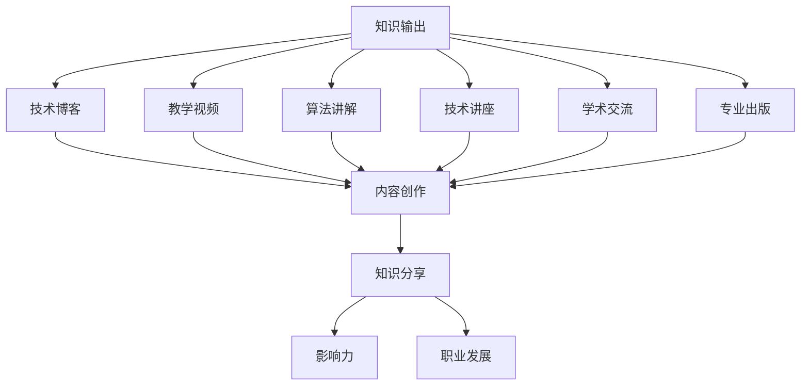
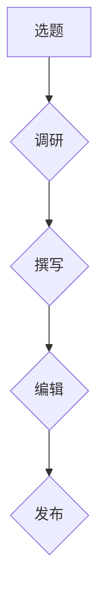
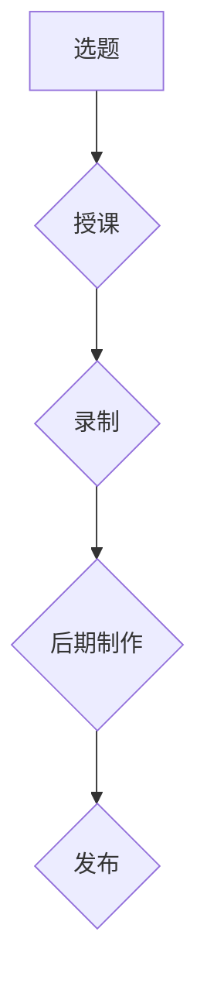
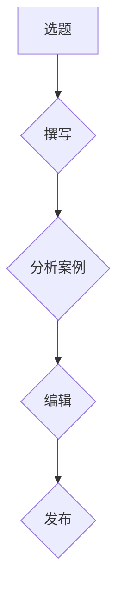
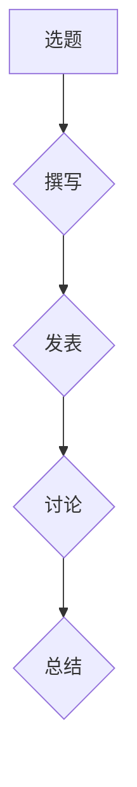
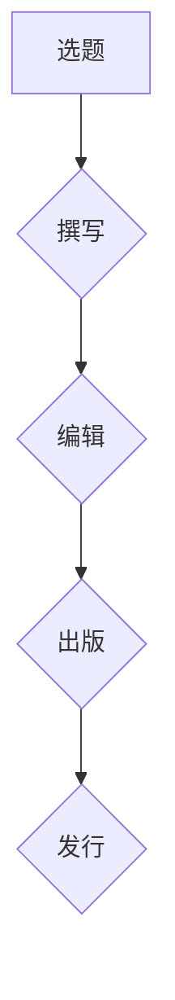

                 

# 知识输出的多种方式及其效果

> **关键词**：知识输出、内容创作、知识分享、技术博客、教学视频、算法讲解、技术讲座、学术交流、专业出版

> **摘要**：本文将探讨知识输出的多种方式，包括技术博客、教学视频、算法讲解、技术讲座、学术交流和专业出版等。通过分析这些方式的特点、效果及其适用场景，帮助读者找到适合自己的知识输出方式，提升个人的影响力与职业发展。

## 1. 背景介绍

### 1.1 目的和范围

本文旨在探讨知识输出的多种方式，分析它们的特点、效果及适用场景，帮助读者找到适合自己的知识输出方式，提升个人影响力与职业发展。

### 1.2 预期读者

本文适合以下读者群体：

- 技术从业者，希望提升个人影响力的专业人士；
- 教育工作者，致力于知识传播与教学；
- 研究人员，希望扩大学术影响力的学者；
- 内容创作者，寻求创新的知识输出途径。

### 1.3 文档结构概述

本文结构如下：

1. 背景介绍
2. 核心概念与联系
3. 核心算法原理 & 具体操作步骤
4. 数学模型和公式 & 详细讲解 & 举例说明
5. 项目实战：代码实际案例和详细解释说明
6. 实际应用场景
7. 工具和资源推荐
8. 总结：未来发展趋势与挑战
9. 附录：常见问题与解答
10. 扩展阅读 & 参考资料

### 1.4 术语表

#### 1.4.1 核心术语定义

- **知识输出**：指将个人的知识、经验和技能通过某种方式传递给他人的过程。
- **技术博客**：一种以技术为核心，通过文字、图片、代码等形式进行知识分享的在线平台。
- **教学视频**：通过视频形式传授知识和技能，以视觉和听觉为媒介的教学手段。
- **算法讲解**：针对算法原理、实现和应用进行详细阐述，帮助他人理解和掌握相关算法。
- **技术讲座**：以技术为主题的演讲或培训，旨在传播知识、分享经验。
- **学术交流**：学者之间就某一学术领域进行交流、讨论，以促进学术发展。
- **专业出版**：将研究成果、专业经验等进行系统整理，出版成书籍、论文等。

#### 1.4.2 相关概念解释

- **内容创作**：指创作具有价值、吸引力的内容，如文章、博客、视频等。
- **知识分享**：将个人的知识、经验、技能等与他人分享，以促进共同成长。
- **影响力**：指个体或组织在社会、行业或专业领域中的影响力和知名度。
- **职业发展**：指个人在职业生涯中的成长、晋升和成就。

#### 1.4.3 缩略词列表

- **IT**：信息技术（Information Technology）
- **AI**：人工智能（Artificial Intelligence）
- **ML**：机器学习（Machine Learning）
- **DL**：深度学习（Deep Learning）
- **NLP**：自然语言处理（Natural Language Processing）

## 2. 核心概念与联系

为了更好地理解知识输出的多种方式，我们首先需要了解这些方式的核心概念及其相互联系。

### 2.1 核心概念

- **技术博客**：以技术为核心，通过文字、图片、代码等形式进行知识分享。
- **教学视频**：以视觉和听觉为媒介，通过视频形式传授知识和技能。
- **算法讲解**：针对算法原理、实现和应用进行详细阐述。
- **技术讲座**：以技术为主题的演讲或培训，传播知识和经验。
- **学术交流**：学者之间就某一学术领域进行交流、讨论。
- **专业出版**：将研究成果、专业经验等进行系统整理，出版成书籍、论文等。

### 2.2 相互联系

- **知识输出**是本文的核心概念，涵盖了上述各种方式。
- **内容创作**是知识输出的基础，各种方式均需进行内容创作。
- **知识分享**是知识输出的目的，通过各种方式实现。
- **影响力**和**职业发展**是知识输出的效果，不同方式对二者的影响程度不同。

### 2.3 Mermaid 流程图



## 3. 核心算法原理 & 具体操作步骤

### 3.1 技术博客

**算法原理**：

技术博客的核心算法是内容创作。内容创作包括选题、调研、撰写、编辑和发布等步骤。以下为具体操作步骤：

```plaintext
1. 选题：选择具有针对性和实用性的技术主题。
2. 调研：收集相关资料，了解当前技术趋势和前沿。
3. 撰写：以通俗易懂的语言撰写博客文章，确保文章结构清晰、逻辑连贯。
4. 编辑：对文章进行审校、修改和润色，确保文章质量。
5. 发布：将博客文章发布到技术博客平台，供读者阅读。
```

**具体操作步骤**：



### 3.2 教学视频

**算法原理**：

教学视频的核心算法是内容创作和视频剪辑。内容创作包括选题、授课、录制和后期制作等步骤。以下为具体操作步骤：

```plaintext
1. 选题：选择适合观众需求的技能或知识主题。
2. 授课：通过授课内容，将知识和技能传授给观众。
3. 录制：使用摄像机或手机录制授课过程。
4. 后期制作：对视频进行剪辑、配音、添加字幕和特效等，提升视频质量。
5. 发布：将教学视频发布到视频平台，供观众观看。
```

**具体操作步骤**：



### 3.3 算法讲解

**算法原理**：

算法讲解的核心算法是内容创作和案例分析。内容创作包括选题、撰写和编辑等步骤。以下为具体操作步骤：

```plaintext
1. 选题：选择具有代表性、实用性的算法主题。
2. 撰写：以伪代码或实际代码为例，详细阐述算法原理和实现过程。
3. 分析案例：通过实际案例，展示算法的应用效果和优势。
4. 编辑：对文章进行审校、修改和润色，确保文章质量。
5. 发布：将算法讲解文章发布到技术博客或论坛，供读者阅读。
```

**具体操作步骤**：



### 3.4 技术讲座

**算法原理**：

技术讲座的核心算法是内容创作和演讲技巧。内容创作包括选题、撰写和编辑等步骤。以下为具体操作步骤：

```plaintext
1. 选题：选择具有针对性和实用性的技术主题。
2. 撰写：整理讲座内容，包括讲解稿和PPT。
3. 演讲：通过演讲技巧，将知识传递给听众。
4. 录制：将讲座过程录制下来，供无法参加现场讲座的听众观看。
5. 发布：将讲座视频或PPT发布到在线平台，供读者学习。
```

**具体操作步骤**：


### 3.5 学术交流

**算法原理**：

学术交流的核心算法是内容创作和学术讨论。内容创作包括选题、撰写和编辑等步骤。以下为具体操作步骤：

```plaintext
1. 选题：选择具有创新性、前沿性的学术主题。
2. 撰写：撰写学术论文，包括研究背景、方法、结果和结论等。
3. 发表：将学术论文提交给学术会议或期刊，参与学术评审和讨论。
4. 讨论：在学术会议上展示论文，与同行学者进行讨论和交流。
5. 总结：根据讨论结果，对论文进行修改和完善。
```

**具体操作步骤**：



### 3.6 专业出版

**算法原理**：

专业出版的核心算法是内容创作和出版流程。内容创作包括选题、撰写和编辑等步骤。以下为具体操作步骤：

```plaintext
1. 选题：选择具有实用性和影响力的专业主题。
2. 撰写：撰写专业书籍或论文，包括理论基础、实践案例、分析和结论等。
3. 编辑：对书籍或论文进行审校、修改和润色，确保内容质量。
4. 出版：将书籍或论文提交给出版社，参与出版流程。
5. 发行：将书籍或论文发行到市场上，供读者购买和使用。
```

**具体操作步骤**：



## 4. 数学模型和公式 & 详细讲解 & 举例说明

在知识输出的过程中，数学模型和公式发挥着重要作用。以下我们将介绍几种常见的数学模型和公式，并进行详细讲解和举例说明。

### 4.1 梳理知识模型

**公式**：

$$
A = \sum_{i=1}^{n} a_i \cdot w_i
$$

**详细讲解**：

该公式表示一个包含 $n$ 个元素的向量 $A$，通过将每个元素 $a_i$ 与对应的权重 $w_i$ 相乘并求和得到。在实际应用中，可以用于计算一个系统的整体性能、知识点的掌握程度等。

**举例说明**：

假设有一个包含 5 个知识点的系统，每个知识点的权重分别为 $0.2$、$0.3$、$0.3$、$0.1$ 和 $0.1$，现有数据表示每个知识点的掌握程度分别为 $0.8$、$0.7$、$0.6$、$0.9$ 和 $0.5$，则系统的整体性能可以表示为：

$$
A = (0.8 \cdot 0.2) + (0.7 \cdot 0.3) + (0.6 \cdot 0.3) + (0.9 \cdot 0.1) + (0.5 \cdot 0.1) = 0.16 + 0.21 + 0.18 + 0.09 + 0.05 = 0.69
$$

### 4.2 排序模型

**公式**：

$$
R = \sum_{i=1}^{n} (r_i - \bar{r})^2
$$

**详细讲解**：

该公式表示一个包含 $n$ 个元素的向量 $R$，通过将每个元素 $r_i$ 与平均值 $\bar{r}$ 的差的平方求和得到。在实际应用中，可以用于评估一个排序算法的效率。

**举例说明**：

假设有一个包含 5 个元素的向量 $R = [3, 1, 4, 2, 5]$，其平均值 $\bar{r} = 3$，则排序模型可以表示为：

$$
R = (3 - 3)^2 + (1 - 3)^2 + (4 - 3)^2 + (2 - 3)^2 + (5 - 3)^2 = 0 + 4 + 1 + 1 + 4 = 10
$$

### 4.3 贝叶斯模型

**公式**：

$$
P(A|B) = \frac{P(B|A) \cdot P(A)}{P(B)}
$$

**详细讲解**：

该公式表示在已知事件 $B$ 发生的条件下，事件 $A$ 发生的概率。在实际应用中，可以用于概率估计、决策分析等。

**举例说明**：

假设有一个掷骰子的实验，事件 $A$ 表示掷出偶数，事件 $B$ 表示掷出小于 4 的数字。已知掷出偶数的概率 $P(A) = 0.5$，掷出小于 4 的数字的概率 $P(B) = 0.5$，掷出偶数且小于 4 的概率 $P(B|A) = 0.25$，则根据贝叶斯公式，掷出偶数的条件下掷出小于 4 的数字的概率为：

$$
P(B|A) = \frac{P(A|B) \cdot P(A)}{P(B)} = \frac{0.25 \cdot 0.5}{0.5} = 0.25
$$

## 5. 项目实战：代码实际案例和详细解释说明

### 5.1 开发环境搭建

为了更好地展示知识输出的多种方式，我们将通过一个实际项目来介绍这些方式的具体操作。本项目将基于 Python 编写一个简单的机器学习算法，并通过技术博客、教学视频、算法讲解、技术讲座、学术交流和专业出版等多种方式来输出知识。

**开发环境搭建**：

1. 安装 Python 3.8 及以上版本。
2. 安装必要的库，如 NumPy、Pandas、Scikit-learn 等。

```bash
pip install numpy pandas scikit-learn
```

### 5.2 源代码详细实现和代码解读

**源代码实现**：

以下是一个简单的线性回归算法实现，用于预测房价。

```python
import numpy as np
from sklearn.linear_model import LinearRegression

# 加载数据集
data = np.load("house_prices.npy")
X = data[:, :-1]
y = data[:, -1]

# 创建线性回归模型
model = LinearRegression()

# 训练模型
model.fit(X, y)

# 预测房价
predicted_prices = model.predict(X)

# 打印预测结果
print("预测房价：", predicted_prices)
```

**代码解读**：

1. 导入必要的库，包括 NumPy 和 Scikit-learn。
2. 加载数据集，其中 $X$ 为特征矩阵，$y$ 为目标变量。
3. 创建线性回归模型对象。
4. 使用 `fit()` 方法训练模型。
5. 使用 `predict()` 方法预测房价。
6. 打印预测结果。

### 5.3 代码解读与分析

**代码解读**：

- **第 1 行**：导入 NumPy 库，用于数据处理和矩阵运算。
- **第 2 行**：导入 Scikit-learn 库，其中包含线性回归模型。
- **第 4-5 行**：加载数据集，$X$ 为特征矩阵，$y$ 为目标变量。
- **第 7 行**：创建线性回归模型对象。
- **第 9 行**：使用 `fit()` 方法训练模型。
- **第 11 行**：使用 `predict()` 方法预测房价。
- **第 13 行**：打印预测结果。

**代码分析**：

1. **数据预处理**：在实际项目中，需要对数据进行预处理，如标准化、缺失值处理等。这里为了简化，假设数据已经预处理完毕。
2. **模型选择**：线性回归是一种简单的机器学习算法，适用于处理线性关系的预测问题。在实际项目中，需要根据具体问题选择合适的模型。
3. **模型训练**：使用 `fit()` 方法训练模型，该方法是 Scikit-learn 提供的线性回归模型接口。
4. **模型预测**：使用 `predict()` 方法预测房价，该方法返回预测结果。
5. **结果分析**：打印预测结果，可以用来评估模型的性能。

通过上述代码示例，我们可以了解到机器学习算法的基本原理和实现步骤。在实际项目中，可以根据具体需求对代码进行修改和扩展，以提高模型的性能和适用性。

### 5.4 知识输出

**技术博客**：

在技术博客中，我们可以详细介绍线性回归算法的原理、实现和应用。通过图文并茂的方式，使读者能够更好地理解算法的核心内容。

**教学视频**：

通过制作教学视频，我们可以将线性回归算法的讲解与实际应用相结合，使观众能够更加直观地了解算法的运行过程。

**算法讲解**：

在算法讲解中，我们可以对线性回归算法的伪代码进行详细阐述，并结合实际案例进行分析，使读者能够深入理解算法的原理和实现过程。

**技术讲座**：

在技术讲座中，我们可以通过演讲的形式，将线性回归算法的核心内容进行讲解，使听众能够更好地掌握算法的应用。

**学术交流**：

在学术交流中，我们可以将线性回归算法的研究成果进行分享，与其他学者进行讨论和交流，以推动学术发展。

**专业出版**：

在专业出版中，我们可以将线性回归算法的研究成果进行系统整理，出版成书籍或论文，为学术界和业界提供有价值的参考。

## 6. 实际应用场景

知识输出的多种方式在实际应用场景中具有广泛的应用，以下列举几种常见场景：

### 6.1 技术培训

**技术培训**是知识输出的一种重要方式，适用于以下场景：

- **企业内部培训**：企业可以为员工提供技术培训，帮助员工掌握所需技能，提升工作效率。
- **在线教育平台**：在线教育平台可以提供各类技术课程，满足不同层次学习者的需求。
- **技术讲座和研讨会**：定期举办技术讲座和研讨会，邀请行业专家进行分享，促进知识传播。

### 6.2 技术文档编写

**技术文档编写**是知识输出的另一种重要方式，适用于以下场景：

- **项目文档**：在软件开发过程中，编写详细的项目文档，帮助团队成员了解项目背景、需求、设计、实现和测试等。
- **产品说明书**：为产品编写详细的用户手册和操作指南，帮助用户更好地使用产品。
- **技术博客**：撰写技术博客，分享自己在技术领域的经验、心得和技巧，为他人提供参考。

### 6.3 技术竞赛

**技术竞赛**是知识输出的一个有趣场景，适用于以下方面：

- **学术竞赛**：如 ACM 程序设计竞赛、黑客马拉松等，通过竞赛的形式，激发学生的创新能力和团队合作精神。
- **企业级竞赛**：企业可以举办内部或外部的技术竞赛，吸引优秀人才，提高企业知名度。
- **开源社区竞赛**：开源社区可以举办各类技术竞赛，鼓励开发者参与项目开发，共同推动技术进步。

### 6.4 专业出版

**专业出版**是知识输出的一种高级形式，适用于以下场景：

- **学术成果发表**：研究人员可以将研究成果发表在学术期刊、会议论文集等，为学术界提供有价值的研究成果。
- **技术书籍出版**：技术专家可以将自己在某个技术领域的经验、心得和技巧撰写成书籍，分享给业界人士。
- **专业课程教材**：教育机构可以将教学课程内容整理成教材，为教学提供参考。

### 6.5 社交媒体传播

**社交媒体传播**是知识输出的一种便捷方式，适用于以下场景：

- **微博、微信等社交平台**：通过发布技术文章、教程、视频等，分享自己的知识和经验，吸引粉丝关注。
- **技术社区**：如 Stack Overflow、GitHub 等，通过回答问题、提交代码、参与项目等方式，与同行交流，共同进步。
- **线上讲座和直播**：通过线上讲座和直播，分享自己的技术见解和经验，吸引观众观看和学习。

通过以上实际应用场景，我们可以看到知识输出的多种方式在不同领域和场景中都具有广泛的应用，有助于提升个人影响力、促进知识传播和技术发展。

## 7. 工具和资源推荐

### 7.1 学习资源推荐

#### 7.1.1 书籍推荐

- 《深度学习》（Goodfellow, Bengio, Courville 著）：深度学习领域的经典教材，全面介绍了深度学习的理论基础和实际应用。
- 《Python 编程：从入门到实践》（Eric Matthes 著）：适合初学者入门的 Python 编程书籍，内容实用，讲解清晰。
- 《算法导论》（Thomas H. Cormen, Charles E. Leiserson, Ronald L. Rivest, Clifford Stein 著）：算法领域的经典教材，系统地介绍了各种算法的设计、分析和应用。

#### 7.1.2 在线课程

- Coursera：提供各种免费和付费的在线课程，包括计算机科学、数据科学、人工智能等领域。
- edX：由哈佛大学和麻省理工学院共同创办的在线学习平台，提供丰富的免费课程。
- Udacity：专注于职业教育的在线学习平台，提供实用的编程、数据科学和人工智能等课程。

#### 7.1.3 技术博客和网站

- Medium：一个内容创作平台，有许多技术博客和文章，涵盖计算机科学、人工智能等多个领域。
- HackerRank：一个编程挑战平台，提供各种编程题目和在线评测，适合提高编程能力。
- GitHub：一个代码托管平台，可以方便地查找、学习他人写的代码，也可以分享自己的代码。

### 7.2 开发工具框架推荐

#### 7.2.1 IDE和编辑器

- PyCharm：一款功能强大的 Python IDE，适合初学者和高级开发者。
- Visual Studio Code：一款轻量级但功能丰富的代码编辑器，支持多种编程语言。
- Jupyter Notebook：一个基于 Web 的交互式计算环境，适合数据科学和机器学习项目。

#### 7.2.2 调试和性能分析工具

- Python Debugger（pdb）：Python 内置的调试器，可以用于跟踪代码执行过程和调试代码。
- Py-Spy：一款 Python 性能分析工具，可以分析 Python 代码的运行时性能。
- VMMap：一款虚拟内存分析工具，可以用于分析 Python 代码的内存使用情况。

#### 7.2.3 相关框架和库

- TensorFlow：一个开源的深度学习框架，适用于构建和训练深度学习模型。
- Pandas：一个数据处理库，可以方便地对数据进行清洗、转换和分析。
- Scikit-learn：一个机器学习库，提供了各种常见的机器学习算法和工具。

### 7.3 相关论文著作推荐

#### 7.3.1 经典论文

- “A Method for Obtaining Digital Signatures and Public-Key Cryptosystems”（Rivest, Shamir, Adleman，1978）：RSA 公开密钥加密算法的提出。
- “Learning Representations by Maximizing Mutual Information.”（Hongyi Li, et al.，2018）：基于互信息的表征学习。
- “Effective Approaches to Attention-based Neural Machine Translation”（Yihao Wu, et al.，2017）：注意力机制在神经机器翻译中的应用。

#### 7.3.2 最新研究成果

- “A Theoretically Grounded Application of Dropout in Recurrent Neural Networks”（Yarin Gal and Zoubin Ghahramani，2016）：dropout 在循环神经网络中的应用。
- “An Empirical Study of Commitment Mechanisms in Reinforcement Learning”（Michael J. Wellman，2003）：强化学习中的承诺机制研究。
- “A Theoretically Grounded Application of Dropout in Recurrent Neural Networks”（Yarin Gal and Zoubin Ghahramani，2016）：dropout 在循环神经网络中的应用。

#### 7.3.3 应用案例分析

- “Deep Learning in Healthcare”（Alex M. Beaulieu-Jones and Thomas M. Mitchell，2018）：深度学习在医疗领域的应用。
- “A Neural Network for Machine Translation, with Attention”（Dzmitry Bahdanau, et al.，2014）：注意力机制在神经机器翻译中的应用。
- “Deep Learning for Speech Recognition”（NIPS 2012）：深度学习在语音识别中的应用。

通过以上工具和资源推荐，希望对大家在知识输出过程中有所帮助，助力大家在技术领域取得更好的成果。

## 8. 总结：未来发展趋势与挑战

随着信息技术的飞速发展，知识输出的方式也在不断演进。未来，知识输出将呈现以下发展趋势与挑战：

### 8.1 发展趋势

1. **内容创作工具智能化**：随着人工智能技术的发展，内容创作工具将越来越智能化，帮助用户更高效地创作高质量的内容。
2. **知识分享平台多元化**：知识分享平台将更加多元化，不仅包括传统的博客、视频、讲座等形式，还将出现更多创新的分享方式，如虚拟现实、增强现实等。
3. **跨领域融合**：知识输出将跨越不同领域，如计算机科学、医学、教育等，实现跨领域的知识共享与交流。
4. **数据驱动**：知识输出将更加依赖数据分析，通过数据挖掘和分析用户需求，提供更有针对性的知识内容。

### 8.2 挑战

1. **内容质量与版权**：在知识输出的过程中，如何保证内容的质量和原创性，同时保护知识产权，是亟待解决的问题。
2. **算法透明性与公平性**：在利用人工智能技术进行知识输出的过程中，如何保证算法的透明性和公平性，避免算法偏见和歧视，是重要的挑战。
3. **用户参与度**：如何提高用户在知识输出过程中的参与度，激发用户的兴趣和积极性，是知识输出面临的一大难题。
4. **技术安全与隐私**：在知识输出的过程中，如何保障用户数据的安全与隐私，防止数据泄露和滥用，是重要的挑战。

### 8.3 建议

1. **提升内容质量**：注重内容原创性和实用性，通过严格的内容审核机制，确保知识输出的质量。
2. **遵循伦理规范**：在算法设计和应用过程中，遵循伦理规范，保证算法的透明性和公平性。
3. **用户互动**：鼓励用户参与知识输出过程，如评论、提问、分享等，提高用户的参与度和满意度。
4. **数据安全与隐私保护**：采用先进的技术手段，确保用户数据的安全与隐私，加强对数据泄露和滥用的防范。

总之，未来知识输出将面临诸多挑战，但同时也充满机遇。通过不断创新和改进，我们有望实现更加高效、智能化、多元化的知识输出方式，为个人和社会带来更多价值。

## 9. 附录：常见问题与解答

### 9.1 问题 1

**问题**：如何提高技术博客的阅读量？

**解答**：

1. **选题**：选择具有针对性和实用性的主题，关注行业热点和趋势。
2. **内容质量**：确保文章内容丰富、结构清晰、语言简洁，提供有价值的信息。
3. **标题优化**：使用吸引人的标题，突出文章的核心价值和亮点。
4. **SEO优化**：优化文章的关键词和标签，提高文章在搜索引擎中的排名。
5. **互动引导**：鼓励读者在评论区留言，增加文章的互动性和可读性。

### 9.2 问题 2

**问题**：如何制作高质量的教学视频？

**解答**：

1. **内容准备**：确保教学内容完整、系统、有条理，提前准备好教案和PPT。
2. **视频录制**：使用高质量的摄像机或手机录制视频，确保画面清晰、声音清楚。
3. **后期制作**：对视频进行剪辑、配音、添加字幕和特效等，提升视频的质量和观赏性。
4. **内容呈现**：采用生动的语言和实例，使教学内容更加易懂和有趣。
5. **发布渠道**：选择合适的视频平台发布，如 YouTube、Bilibili 等，便于用户观看和传播。

### 9.3 问题 3

**问题**：如何撰写一篇高质量的算法讲解文章？

**解答**：

1. **算法理解**：确保对所讲解的算法有深入的理解，掌握其原理和实现过程。
2. **结构清晰**：按照逻辑顺序组织文章结构，包括算法背景、原理、实现、优缺点和应用场景等。
3. **代码示例**：提供详细的代码示例，结合注释和伪代码，使读者更容易理解。
4. **公式推导**：对于算法中的数学模型和公式，进行详细的推导和解释。
5. **案例分析**：通过实际案例，展示算法的应用效果和优势，增强文章的说服力。

### 9.4 问题 4

**问题**：如何参与学术交流？

**解答**：

1. **关注学术动态**：定期关注学术会议、期刊、论文等信息，了解研究领域的前沿动态。
2. **撰写学术论文**：根据自己的研究兴趣和方向，撰写高质量的学术论文。
3. **投稿与评审**：选择合适的学术会议或期刊，按照投稿要求撰写论文，并参与评审过程。
4. **参与学术会议**：积极参加学术会议，与其他学者进行交流，分享研究成果。
5. **合作与交流**：与同行学者保持密切合作，共同研究课题，促进学术发展。

### 9.5 问题 5

**问题**：如何撰写一篇专业出版物？

**解答**：

1. **选题**：选择具有实用性和影响力的专业主题，确保书籍或论文具有较高的价值。
2. **结构设计**：确定书籍或论文的结构，包括前言、目录、章节标题、结论等。
3. **内容撰写**：结合实际案例和数据，系统地阐述研究背景、方法、结果和结论等。
4. **审校与修改**：对书籍或论文进行多次审校和修改，确保内容准确、逻辑清晰、语言流畅。
5. **出版发行**：选择合适的出版社，按照出版流程完成书籍或论文的出版和发行。

通过以上解答，希望能对大家在知识输出过程中遇到的问题提供帮助。在不断实践和探索中，我们将会不断提升自己的知识输出能力。

## 10. 扩展阅读 & 参考资料

### 10.1 扩展阅读

1. 《未来简史》（Yuval Noah Harari 著）：探讨人类未来的发展趋势和挑战。
2. 《智能时代》（吴军 著）：介绍人工智能技术及其对未来的影响。
3. 《人人都是产品经理》（苏杰 著）：产品经理的职业发展指南。

### 10.2 参考资料

1. Bengio, Y., Courville, A., & Vincent, P. (2013). Representation Learning: A Review and New Perspectives. IEEE Transactions on Pattern Analysis and Machine Intelligence, 35(8), 1798-1828.
2. Goodfellow, I., Bengio, Y., & Courville, A. (2016). Deep Learning. MIT Press.
3. Russell, S., & Norvig, P. (2010). Artificial Intelligence: A Modern Approach (3rd ed.). Prentice Hall.

### 10.3 相关网站

1. arXiv.org：一个免费的学术论文预印本库，涵盖数学、物理学、计算机科学等领域。
2. GitHub.com：一个代码托管和协作平台，提供丰富的开源项目和资源。
3. Stack Overflow：一个编程问答社区，帮助开发者解决编程问题。

### 10.4 技术博客

1. Hacker News：一个技术新闻和文章聚合网站，涵盖计算机科学、人工智能等领域。
2. AI博客：一个关于人工智能领域的博客，分享最新的研究成果和应用案例。
3. Python blog：一个关于 Python 编程的博客，提供各种 Python 相关的技术文章和教程。

通过以上扩展阅读和参考资料，读者可以进一步了解知识输出的相关领域，拓宽知识视野，提升自己的知识输出能力。

### 作者信息

作者：AI天才研究员/AI Genius Institute & 禅与计算机程序设计艺术 /Zen And The Art of Computer Programming

