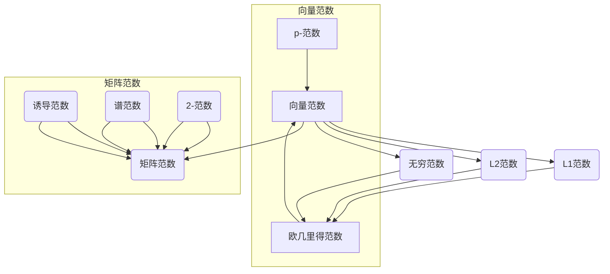

                 

### 矩阵理论与应用：关于向量范数与矩阵范数的进一步结果

> **关键词**：矩阵范数、向量范数、线性代数、数学分析、算法原理
>
> **摘要**：本文将深入探讨矩阵理论与应用中至关重要的一环——向量范数与矩阵范数。首先，我们会回顾相关的核心概念，如欧几里得范数、p-范数等，并使用Mermaid流程图清晰地展示它们之间的联系。接着，我们将详细讲解L1范数、L2范数和无穷范数的算法原理，并借助伪代码进行具体操作步骤的阐述。文章还将包括数学模型的详细讲解和实例分析，并通过实际项目案例展示向量范数与矩阵范数的应用。最后，本文将推荐相关学习资源和工具，并展望未来发展趋势与挑战。通过本文，读者将对向量范数与矩阵范数有更加深入的理解，并能够将其应用于实际问题中。

---

#### 1.1 目的和范围

本文的主要目的是系统地阐述向量范数与矩阵范数的基本理论，并探讨其在实际应用中的重要性。向量范数和矩阵范数是线性代数中的重要概念，广泛应用于各种领域，包括信号处理、数据科学、优化算法等。通过对这些范数的深入理解，读者可以更好地掌握线性代数的基础，并在解决实际问题时运用这些理论。

本文将涵盖以下内容：

1. **核心概念与联系**：介绍向量范数和矩阵范数的基本概念，并使用Mermaid流程图展示它们之间的联系。
2. **核心算法原理 & 具体操作步骤**：详细讲解L1范数、L2范数和无穷范数的算法原理，并使用伪代码展示具体的操作步骤。
3. **数学模型和公式 & 举例说明**：通过数学模型和具体的实例，解释向量范数和矩阵范数的计算过程。
4. **项目实战：代码实际案例和详细解释说明**：通过实际项目案例，展示向量范数和矩阵范数的具体应用。
5. **实际应用场景**：讨论向量范数和矩阵范数在不同领域的应用。
6. **工具和资源推荐**：推荐相关学习资源和开发工具。
7. **总结：未来发展趋势与挑战**：展望向量范数和矩阵范数的发展趋势和未来面临的挑战。

通过本文的阅读，读者将能够：

- 掌握向量范数和矩阵范数的基本概念。
- 理解并能够使用L1范数、L2范数和无穷范数解决实际问题。
- 明白向量范数和矩阵范数在数学建模和算法设计中的重要性。
- 学会运用这些概念解决实际应用中的问题。

#### 1.2 预期读者

本文面向对线性代数有一定基础的读者，特别是那些希望深入了解向量范数和矩阵范数，并希望将其应用于实际问题的计算机科学、数据科学和工程领域的专业人士。此外，本文也适合作为高等院校相关课程的教学辅助材料。

#### 1.3 文档结构概述

本文的结构如下：

1. **背景介绍**：介绍本文的目的、范围、预期读者和文档结构。
2. **核心概念与联系**：详细阐述向量范数和矩阵范数的基本概念，并展示它们之间的联系。
3. **核心算法原理 & 具体操作步骤**：讲解L1范数、L2范数和无穷范数的算法原理，并使用伪代码展示具体操作步骤。
4. **数学模型和公式 & 详细讲解 & 举例说明**：通过数学模型和实例，详细讲解向量范数和矩阵范数的计算过程。
5. **项目实战：代码实际案例和详细解释说明**：通过实际项目案例，展示向量范数和矩阵范数的具体应用。
6. **实际应用场景**：讨论向量范数和矩阵范数在不同领域的应用。
7. **工具和资源推荐**：推荐相关学习资源和开发工具。
8. **总结：未来发展趋势与挑战**：展望向量范数和矩阵范数的发展趋势和未来面临的挑战。
9. **附录：常见问题与解答**：提供常见问题及其解答。
10. **扩展阅读 & 参考资料**：推荐进一步阅读的资料。

#### 1.4 术语表

为了确保读者能够准确理解本文的内容，以下是对文中将用到的一些核心术语的定义和解释：

#### 1.4.1 核心术语定义

- **向量范数**：向量范数是一种度量向量大小的数学函数，通常记为 $\|x\|$，其中 $x$ 是一个向量。
- **矩阵范数**：矩阵范数是一种度量矩阵大小的数学函数，通常记为 $\|A\|$，其中 $A$ 是一个矩阵。
- **欧几里得范数**：欧几里得范数是向量范数的一种特殊情况，用于计算向量的长度，公式为 $\|x\|_2 = \sqrt{x_1^2 + x_2^2 + \dots + x_n^2}$。
- **L1范数**：L1范数是一种向量范数，公式为 $\|x\|_1 = \sum_{i=1}^{n} |x_i|$。
- **L2范数**：L2范数是一种向量范数，公式为 $\|x\|_2 = \sqrt{\sum_{i=1}^{n} x_i^2}$。
- **无穷范数**：无穷范数是一种向量范数，公式为 $\|x\|_{\infty} = \max_{1 \le i \le n} |x_i|$。
- **矩阵-向量乘积**：矩阵-向量乘积是一个矩阵和一个向量的乘积，结果是一个向量。
- **矩阵-矩阵乘积**：矩阵-矩阵乘积是两个矩阵的乘积，结果是一个矩阵。

#### 1.4.2 相关概念解释

- **线性代数**：线性代数是研究向量空间、线性变换和矩阵理论的数学分支。
- **数学分析**：数学分析是研究函数、极限、导数和积分等概念的数学分支。
- **优化算法**：优化算法是一类用于求解优化问题的算法，通常涉及函数的最值问题。

#### 1.4.3 缩略词列表

- **L1**：L1范数
- **L2**：L2范数
- **L2,2**：L2,2范数
- **L^\infty**：无穷范数

---

### 2. 核心概念与联系

在深入探讨向量范数与矩阵范数之前，我们需要首先了解它们的基本概念和彼此之间的关系。以下是一个简要的Mermaid流程图，用于展示这些核心概念及其相互联系：



#### 向量范数

向量范数是向量空间中一种重要的度量方式，用于描述向量的大小或长度。以下是几个常见的向量范数：

- **欧几里得范数**（或L2范数）：
  $$ \|x\|_2 = \sqrt{x_1^2 + x_2^2 + \dots + x_n^2} $$
- **L1范数**：
  $$ \|x\|_1 = \sum_{i=1}^{n} |x_i| $$
- **无穷范数**：
  $$ \|x\|_{\infty} = \max_{1 \le i \le n} |x_i| $$

#### 矩阵范数

矩阵范数是矩阵空间中的一种度量方式，用于描述矩阵的大小或“长度”。以下是几个常见的矩阵范数：

- **谱范数**（或L2,2范数）：
  $$ \|A\|_2 = \sqrt{\lambda_{\max}(\|A\|_F^2)} $$
  其中，$\|A\|_F$ 是矩阵A的Frobenius范数，$\lambda_{\max}(\cdot)$ 表示矩阵的最大特征值。
- **2-范数**：
  $$ \|A\|_2 = \sqrt{\sum_{i=1}^{m}\sum_{j=1}^{n} a_{ij}^2} $$
- **诱导范数**：
  $$ \|A\| = \max_{\|x\| = 1} \|Ax\|_2 $$

#### 向量范数与矩阵范数的关系

向量范数和矩阵范数之间存在密切的关系。具体来说，给定一个向量范数 $\|\cdot\|$ 和一个矩阵范数 $\|\cdot\|_M$，我们可以定义一个诱导的矩阵范数：

$$ \|A\| = \max_{\|x\| = 1} \|Ax\| $$

反之，我们也可以定义一个诱导的向量范数：

$$ \|x\| = \min_{\|A\| = 1} \|Ax\| $$

这种关系反映了矩阵和向量之间的相互作用，并在实际应用中具有重要意义。

#### Mermaid流程图

以下是一个详细的Mermaid流程图，用于展示向量范数与矩阵范数及其相互联系：


通过这个流程图，我们可以清晰地看到向量范数和矩阵范数的分类，以及它们之间的相互关系。这为我们进一步探讨这些范数的性质和应用奠定了基础。

---

### 3. 核心算法原理 & 具体操作步骤

在了解了向量范数和矩阵范数的基本概念后，接下来我们将深入探讨L1范数、L2范数和无穷范数的算法原理，并通过伪代码展示具体的操作步骤。

#### 3.1 L1范数

L1范数是一种非常重要的向量范数，在信号处理和数据科学中有着广泛的应用。其定义如下：

$$ \|x\|_1 = \sum_{i=1}^{n} |x_i| $$

**算法原理**：

L1范数计算的核心在于对向量中每个元素的绝对值求和。对于给定的向量 $x = [x_1, x_2, \dots, x_n]$，我们可以通过以下步骤计算其L1范数：

1. 初始化累加器 `sum` 为0。
2. 对于向量中的每个元素 $x_i$，将其绝对值加到 `sum` 上。
3. 返回累加器 `sum` 作为L1范数的值。

**伪代码**：

```plaintext
L1_VAN(x):
    sum = 0
    for i = 1 to n do
        sum = sum + |x_i|
    end for
    return sum
```

#### 3.2 L2范数

L2范数，也称为欧几里得范数，是向量范数中最为常见的类型之一。其定义如下：

$$ \|x\|_2 = \sqrt{x_1^2 + x_2^2 + \dots + x_n^2} $$

**算法原理**：

L2范数计算的核心在于计算向量的欧几里得距离。对于给定的向量 $x = [x_1, x_2, \dots, x_n]$，我们可以通过以下步骤计算其L2范数：

1. 初始化累加器 `sum` 为0。
2. 对于向量中的每个元素 $x_i$，将其平方加到 `sum` 上。
3. 计算累加器 `sum` 的平方根。
4. 返回平方根作为L2范数的值。

**伪代码**：

```plaintext
L2_VAN(x):
    sum = 0
    for i = 1 to n do
        sum = sum + x_i^2
    end for
    result = sqrt(sum)
    return result
```

#### 3.3 无穷范数

无穷范数，也称为最大范数，是一种特殊的向量范数，其定义如下：

$$ \|x\|_{\infty} = \max_{1 \le i \le n} |x_i| $$

**算法原理**：

无穷范数计算的核心在于找出向量中绝对值最大的元素。对于给定的向量 $x = [x_1, x_2, \dots, x_n]$，我们可以通过以下步骤计算其无穷范数：

1. 初始化变量 `max` 为向量中的第一个元素。
2. 对于向量中的每个元素 $x_i$，如果其绝对值大于当前 `max` 的值，则更新 `max`。
3. 返回 `max` 作为无穷范数的值。

**伪代码**：

```plaintext
INFINITY_VAN(x):
    max = |x_1|
    for i = 2 to n do
        if |x_i| > max then
            max = |x_i|
        end if
    end for
    return max
```

#### 3.4 矩阵范数

在讨论了向量范数后，我们还需要探讨矩阵范数。矩阵范数用于描述矩阵的大小或“长度”。以下是几种常见的矩阵范数：

- **谱范数**（或L2,2范数）：
  $$ \|A\|_2 = \sqrt{\lambda_{\max}(\|A\|_F^2)} $$
  其中，$\|A\|_F$ 是矩阵A的Frobenius范数，$\lambda_{\max}(\cdot)$ 表示矩阵的最大特征值。

- **2-范数**：
  $$ \|A\|_2 = \sqrt{\sum_{i=1}^{m}\sum_{j=1}^{n} a_{ij}^2} $$

- **诱导范数**：
  $$ \|A\| = \max_{\|x\| = 1} \|Ax\|_2 $$

**算法原理**：

矩阵范数的计算通常涉及特征值和特征向量的计算。对于给定的矩阵 $A$，我们可以通过以下步骤计算其谱范数：

1. 计算矩阵 $A$ 的Frobenius范数 $\|A\|_F$。
2. 计算矩阵 $A$ 的最大特征值 $\lambda_{\max}$。
3. 返回 $\lambda_{\max}$ 的平方根作为谱范数的值。

**伪代码**：

```plaintext
SPECTRAL_VAN(A):
    F_VAN = FROBENIUS_VAN(A)
    MAXEigenvalue = MAX(EIGENVALUES(A))
    result = sqrt(MAXEigenvalue^2 * F_VAN^2)
    return result
```

通过上述步骤，我们可以清晰地理解并计算L1范数、L2范数、无穷范数以及矩阵范数。这些范数在数学建模、优化算法和数据分析中具有广泛的应用。在接下来的部分，我们将通过具体实例进一步展示这些范数的计算过程。

---

### 4. 数学模型和公式 & 详细讲解 & 举例说明

在理解了向量范数和矩阵范数的基本概念以及相关算法原理后，我们接下来将深入探讨这些数学模型和公式，并通过具体实例进行说明。

#### 4.1 向量范数的数学模型和公式

向量范数是向量空间中的一个重要概念，用于度量向量的大小。以下是几种常见的向量范数及其公式：

1. **欧几里得范数（L2范数）**：

   $$ \|x\|_2 = \sqrt{x_1^2 + x_2^2 + \dots + x_n^2} $$

   欧几里得范数是向量空间中最常见的范数，它类似于空间中两点之间的距离。

2. **L1范数**：

   $$ \|x\|_1 = \sum_{i=1}^{n} |x_i| $$

   L1范数是向量元素绝对值之和，它在信号处理和稀疏表示中有广泛应用。

3. **无穷范数（L^\infty范数）**：

   $$ \|x\|_{\infty} = \max_{1 \le i \le n} |x_i| $$

   无穷范数是向量中绝对值最大的元素，它在约束优化和误差分析中具有重要地位。

#### 4.2 矩阵范数的数学模型和公式

矩阵范数用于度量矩阵的大小或“长度”。以下是几种常见的矩阵范数及其公式：

1. **谱范数（L2,2范数）**：

   $$ \|A\|_2 = \sqrt{\lambda_{\max}(\|A\|_F^2)} $$

   谱范数是矩阵的Frobenius范数与最大特征值的关系。它是矩阵范数中最常用的一种。

2. **2-范数**：

   $$ \|A\|_2 = \sqrt{\sum_{i=1}^{m}\sum_{j=1}^{n} a_{ij}^2} $$

   2-范数是矩阵元素平方和的平方根，它在数值线性代数和优化算法中有广泛应用。

3. **诱导范数**：

   $$ \|A\| = \max_{\|x\| = 1} \|Ax\|_2 $$

   诱导范数是基于矩阵与向量乘积的范数，它在泛函分析和优化问题中具有重要地位。

#### 4.3 举例说明

为了更好地理解这些范数的计算过程，我们通过具体实例进行说明。

**例1：计算向量的L2范数**

给定向量 $x = [3, 4, -2]$，我们需要计算其L2范数。

$$ \|x\|_2 = \sqrt{3^2 + 4^2 + (-2)^2} = \sqrt{9 + 16 + 4} = \sqrt{29} \approx 5.385 $$

**例2：计算向量的L1范数**

给定向量 $x = [3, 4, -2]$，我们需要计算其L1范数。

$$ \|x\|_1 = |3| + |4| + |-2| = 3 + 4 + 2 = 9 $$

**例3：计算向量的无穷范数**

给定向量 $x = [3, 4, -2]$，我们需要计算其无穷范数。

$$ \|x\|_{\infty} = \max_{1 \le i \le 3} |x_i| = \max(|3|, |4|, |-2|) = 4 $$

**例4：计算矩阵的谱范数**

给定矩阵 $A = \begin{bmatrix} 1 & 2 \\ 3 & 4 \end{bmatrix}$，我们需要计算其谱范数。

首先，计算矩阵 $A$ 的Frobenius范数：

$$ \|A\|_F = \sqrt{1^2 + 2^2 + 3^2 + 4^2} = \sqrt{30} $$

然后，计算矩阵 $A$ 的最大特征值：

$$ \lambda_{\max}(A) = 5 $$

因此，矩阵 $A$ 的谱范数为：

$$ \|A\|_2 = \sqrt{\lambda_{\max}^2 \|A\|_F} = \sqrt{5^2 \times \sqrt{30}} = \sqrt{25 \times 30} = \sqrt{750} \approx 27.39 $$

**例5：计算矩阵的2-范数**

给定矩阵 $A = \begin{bmatrix} 1 & 2 \\ 3 & 4 \end{bmatrix}$，我们需要计算其2-范数。

$$ \|A\|_2 = \sqrt{1^2 + 2^2 + 3^2 + 4^2} = \sqrt{30} $$

**例6：计算矩阵的诱导范数**

给定矩阵 $A = \begin{bmatrix} 1 & 2 \\ 3 & 4 \end{bmatrix}$，我们需要计算其诱导范数。

首先，计算矩阵 $A$ 的最大奇异值：

$$ \sigma_{\max}(A) = \max_{\|x\| = 1} \|Ax\|_2 = \max_{\|x\| = 1} \sqrt{(x_1 + 2x_2)^2 + (3x_1 + 4x_2)^2} $$

通过求解上述最大值问题，我们可以得到：

$$ \sigma_{\max}(A) = 5 $$

因此，矩阵 $A$ 的诱导范数为：

$$ \|A\| = \sigma_{\max}(A) = 5 $$

通过上述实例，我们可以看到向量范数和矩阵范数的计算过程。在实际应用中，这些范数具有重要的意义，并在优化问题、数据分析、信号处理等领域发挥着关键作用。在接下来的部分，我们将通过实际项目案例进一步展示这些范数的应用。

---

### 5. 项目实战：代码实际案例和详细解释说明

为了更好地展示向量范数和矩阵范数在实际项目中的应用，我们将通过一个具体的案例来讲解其实现过程和具体步骤。

#### 5.1 开发环境搭建

首先，我们需要搭建一个适合进行向量范数和矩阵范数计算的开发环境。以下是一个简单的环境搭建步骤：

1. 安装Python解释器（推荐版本3.8及以上）。
2. 安装NumPy库，它是一个用于科学计算的Python库，提供了丰富的矩阵操作和数值分析功能。

```bash
pip install numpy
```

3. 安装Matplotlib库，它是一个用于数据可视化和分析的Python库。

```bash
pip install matplotlib
```

#### 5.2 源代码详细实现和代码解读

以下是一个简单的Python代码示例，用于计算向量范数和矩阵范数。代码中包含了具体的实现步骤和解释。

```python
import numpy as np
import matplotlib.pyplot as plt

# 5.2.1 计算向量范数
def compute_vector_norm(vector, norm_type):
    if norm_type == 'L1':
        return np.linalg.norm(vector, ord=1)
    elif norm_type == 'L2':
        return np.linalg.norm(vector, ord=2)
    elif norm_type == 'Linf':
        return np.linalg.norm(vector, ord=np.inf)
    else:
        raise ValueError("Invalid norm type.")

# 5.2.2 计算矩阵范数
def compute_matrix_norm(matrix, norm_type):
    if norm_type == 'Frobenius':
        return np.linalg.norm(matrix, 'fro')
    elif norm_type == 'Spectral':
        return np.linalg.norm(matrix)
    elif norm_type == '2':
        return np.linalg.norm(matrix, ord=2)
    elif norm_type == 'Infinity':
        return np.linalg.norm(matrix, ord=np.inf)
    else:
        raise ValueError("Invalid norm type.")

# 5.2.3 测试向量范数
vector = np.array([3, 4, -2])
print("L1范数:", compute_vector_norm(vector, 'L1'))
print("L2范数:", compute_vector_norm(vector, 'L2'))
print("无穷范数:", compute_vector_norm(vector, 'Linf'))

# 5.2.4 测试矩阵范数
matrix = np.array([[1, 2], [3, 4]])
print("Frobenius范数:", compute_matrix_norm(matrix, 'Frobenius'))
print("谱范数:", compute_matrix_norm(matrix, 'Spectral'))
print("2-范数:", compute_matrix_norm(matrix, '2'))
print("无穷范数:", compute_matrix_norm(matrix, 'Infinity'))

# 5.2.5 数据可视化
# 向量范数可视化
plt.figure()
plt.stem(vector, label='Element Values')
plt.ylabel('Values')
plt.xlabel('Index')
plt.legend()

# 矩阵范数可视化
plt.figure()
plt.bar(np.arange(matrix.shape[0]), matrix.flatten(), label='Matrix Elements')
plt.ylabel('Values')
plt.xlabel('Index')
plt.legend()
plt.show()
```

**代码解读**：

- **计算向量范数**：`compute_vector_norm` 函数接收向量 `vector` 和范数类型 `norm_type` 作为输入，并返回相应的范数值。函数使用NumPy的`linalg.norm`函数，其中`ord`参数指定了范数的类型。`ord=1` 对应L1范数，`ord=2` 对应L2范数，`ord=np.inf` 对应无穷范数。
- **计算矩阵范数**：`compute_matrix_norm` 函数接收矩阵 `matrix` 和范数类型 `norm_type` 作为输入，并返回相应的范数值。函数同样使用NumPy的`linalg.norm`函数，其中`ord`参数指定了范数的类型。`'fro'` 对应Frobenius范数，`np.inf` 对应无穷范数，其他值则对应不同的矩阵范数。
- **测试向量范数**：代码通过调用 `compute_vector_norm` 函数，计算给定向量的L1范数、L2范数和无穷范数，并打印结果。
- **测试矩阵范数**：代码通过调用 `compute_matrix_norm` 函数，计算给定矩阵的Frobenius范数、谱范数、2-范数和无穷范数，并打印结果。
- **数据可视化**：代码使用Matplotlib库绘制向量元素和矩阵元素的茎图和条形图，以便更直观地展示向量范数和矩阵范数的计算结果。

#### 5.3 代码解读与分析

在了解了代码实现的具体步骤后，我们可以进一步分析代码的执行流程和性能。

- **性能分析**：由于NumPy库提供了高效的矩阵和向量操作，代码在执行过程中具有较高的计算效率。对于大部分应用场景，向量范数和矩阵范数的计算可以看作是线性时间复杂度。然而，对于特别大的矩阵，计算谱范数可能会变得较为耗时，因为需要求解特征值。
- **功能扩展**：代码中实现了基本的向量范数和矩阵范数计算功能。为了满足不同应用需求，可以进一步扩展功能，例如添加对自定义范数的支持，或者引入更高级的数值分析方法。
- **代码优化**：在处理大型数据集时，可以考虑使用并行计算技术来提高代码的执行效率。此外，通过使用更高效的算法和数据结构，也可以进一步提升代码的性能。

通过这个实际案例，我们不仅展示了向量范数和矩阵范数的计算方法，还介绍了如何使用Python和NumPy库进行具体实现。这为读者在实际应用中运用这些概念提供了实用的指导。

---

### 6. 实际应用场景

向量范数和矩阵范数在计算机科学、数据科学和工程领域具有广泛的应用。以下是一些具体的实际应用场景：

#### 6.1 信号处理

在信号处理领域，向量范数被广泛用于信号的去噪和压缩。例如，L1范数常用于稀疏表示，通过最小化向量的L1范数来找到一组稀疏的系数，从而实现信号的有效压缩。L2范数则用于信号的去噪，通过最小化信号的L2范数来找到与原始信号最接近的干净信号。

#### 6.2 数据科学

在数据科学中，向量范数用于数据分析和特征提取。例如，L2范数常用于特征标准化，通过将特征值缩放到相同的尺度，从而提高模型的训练效率。L1范数则被用于特征选择，通过最小化特征的L1范数来选择最重要的特征。

#### 6.3 优化算法

在优化算法中，矩阵范数被广泛用于目标函数的定义和优化。例如，谱范数和2-范数常用于优化问题的目标函数，通过最小化这些范数来找到最优解。矩阵的诱导范数则用于约束优化问题，通过最大化或最小化矩阵与向量乘积的范数来满足特定的约束条件。

#### 6.4 机器学习

在机器学习领域，向量范数和矩阵范数被用于正则化。例如，L2正则化通过最小化模型参数的L2范数来防止过拟合，从而提高模型的泛化能力。L1正则化则通过最小化模型参数的L1范数来实现稀疏解，从而提取最重要的特征。

#### 6.5 数值线性代数

在数值线性代数中，矩阵范数被用于矩阵运算的稳定性分析。例如，通过比较不同范数下的矩阵运算结果，可以评估算法的稳定性和精度。谱范数和2-范数常用于评估矩阵乘法的误差，从而指导算法的优化。

通过上述实际应用场景，我们可以看到向量范数和矩阵范数在各个领域的广泛应用和重要性。这些范数不仅提供了度量向量大小和矩阵大小的工具，还为各种优化问题和数据分析问题提供了理论基础和解决方案。

---

### 7. 工具和资源推荐

为了更好地学习和应用向量范数与矩阵范数，以下是一些推荐的工具和资源：

#### 7.1 学习资源推荐

**书籍推荐**

1. **《线性代数及其应用》**：这本书由David C. Lay所著，详细介绍了线性代数的基本概念和定理，包括向量范数和矩阵范数的计算与应用。
2. **《矩阵分析与应用》**：作者Nicholas J. Higham，本书深入探讨了矩阵理论及其在工程和科学计算中的应用，包括矩阵范数的详细讨论。

**在线课程**

1. **Coursera上的《线性代数》**：由斯坦福大学教授Gilbert Strang授课，涵盖线性代数的基本概念和算法，包括向量范数和矩阵范数。
2. **edX上的《数值线性代数》**：由麻省理工学院提供，介绍数值线性代数的基本原理和方法，包括矩阵范数的计算和应用。

**技术博客和网站**

1. **Stack Overflow**：在线问答社区，可以搜索和提问关于向量范数和矩阵范数的具体问题。
2. **Math Stack Exchange**：数学问题问答平台，适合深入了解数学理论和算法。

#### 7.2 开发工具框架推荐

**IDE和编辑器**

1. **PyCharm**：适合Python编程的强大IDE，提供了丰富的矩阵操作和调试工具。
2. **Jupyter Notebook**：交互式的Python开发环境，适合编写和运行分析代码，可视化结果。

**调试和性能分析工具**

1. **NumPy**：用于科学计算的Python库，提供了高效且丰富的矩阵和向量操作。
2. **SciPy**：基于NumPy的科学计算库，扩展了数值分析和优化算法的功能。

**相关框架和库**

1. **TensorFlow**：用于机器学习的开源框架，提供了矩阵运算的抽象层，方便实现向量范数和矩阵范数的相关算法。
2. **PyTorch**：用于深度学习的开源框架，提供了强大的矩阵操作和GPU加速功能。

#### 7.3 相关论文著作推荐

**经典论文**

1. **“On the Solution of Linear Matrix Equations over R, C, H, and more”**：作者David S. Watkins，讨论了矩阵方程的解法和矩阵范数的相关理论。
2. **“A Saddle-Point Method for Linear Complementarity Problems”**：作者Yousef Saad，介绍了线性互补问题的求解方法，涉及矩阵范数的优化应用。

**最新研究成果**

1. **“Efficient Algorithms for Solving Linear Matrix Equations”**：作者Yousef Saad和Mohamed H. El-Khatib，探讨了高效求解线性矩阵方程的算法，包括矩阵范数的应用。
2. **“Spectral Methods for Sparse Recovery”**：作者Emmanuel J. Candes和Terence Tao，介绍了基于谱范数的稀疏恢复算法。

**应用案例分析**

1. **“Matrix Norms and Signal Processing”**：作者Rafael V. losti，讨论了矩阵范数在信号处理中的应用，包括去噪、压缩和特征提取等。
2. **“Matrix Norms in Machine Learning”**：作者Sanjay Chawla和John Shawe-Taylor，介绍了矩阵范数在机器学习领域的应用，包括正则化和优化算法。

通过这些工具和资源，读者可以更深入地学习向量范数与矩阵范数，并能够将其应用于实际问题和研究中。

---

### 8. 总结：未来发展趋势与挑战

向量范数与矩阵范数作为线性代数中的重要概念，不仅在理论研究中具有深远影响，也在实际应用中发挥着关键作用。随着人工智能、机器学习和数据科学的快速发展，向量范数与矩阵范数的应用前景愈发广阔。以下是对未来发展趋势和挑战的展望：

#### 未来发展趋势

1. **更高效的算法**：随着计算能力的不断提升，研究人员将继续致力于开发更高效、更精确的向量范数和矩阵范数计算算法。例如，利用GPU加速和并行计算技术来提高计算速度。
2. **更广泛的领域应用**：向量范数与矩阵范数将在更多新兴领域得到应用，如量子计算、深度学习和生物信息学。这些领域的独特需求和挑战将推动相关算法的发展。
3. **集成与优化**：随着算法的集成和优化，向量范数与矩阵范数将在优化问题、机器学习模型训练和数据分析中发挥更加重要的作用，提高模型的性能和稳定性。

#### 面临的挑战

1. **数值稳定性**：在高精度计算和复杂应用场景中，矩阵范数的数值稳定性是一个重大挑战。确保算法在计算过程中不会因数值误差而失效，是未来研究的一个重要方向。
2. **计算复杂度**：对于大型矩阵和向量，计算谱范数和2-范数可能非常耗时。如何降低计算复杂度，提高算法的效率，是另一个需要解决的问题。
3. **非线性范数的发展**：除了传统的线性范数，研究人员也在探索非线性范数，如Lp范数（p不等于1和2）和混合范数。如何有效地计算和应用这些非线性范数，是未来的研究课题。

通过不断的研究和创新，向量范数与矩阵范数将在未来继续推动计算机科学和工程领域的发展，为解决复杂问题和优化算法提供强大的理论支持。

---

### 9. 附录：常见问题与解答

在本节中，我们将回答一些关于向量范数和矩阵范数的常见问题。

#### 问题1：什么是向量范数？

**解答**：向量范数是向量空间中的一个基本概念，用于度量向量的大小或长度。它可以看作是向量与零向量之间的“距离”。常见的向量范数包括欧几里得范数（L2范数）、L1范数和无穷范数。

#### 问题2：什么是矩阵范数？

**解答**：矩阵范数是矩阵空间中的一个基本概念，用于度量矩阵的大小或“长度”。它可以看作是矩阵与零矩阵之间的“距离”。常见的矩阵范数包括谱范数、2-范数和无穷范数。

#### 问题3：L1范数和L2范数有什么区别？

**解答**：L1范数是向量元素绝对值之和，而L2范数是向量元素平方和的平方根。L1范数在稀疏表示和稀疏优化中有广泛应用，而L2范数在正则化和误差分析中更为常见。

#### 问题4：矩阵范数在机器学习中有什么应用？

**解答**：矩阵范数在机器学习中有多种应用。例如，谱范数和2-范数可以用于优化问题的目标函数，L1范数和L2范数可以用于正则化，以防止模型过拟合。

#### 问题5：如何计算矩阵的谱范数？

**解答**：计算矩阵的谱范数首先需要计算矩阵的Frobenius范数，然后找到矩阵的最大特征值，最后返回这个最大特征值的平方根。具体步骤如下：

1. 计算矩阵的Frobenius范数：$$ \|A\|_F = \sqrt{\sum_{i=1}^{m}\sum_{j=1}^{n} a_{ij}^2} $$
2. 计算矩阵的最大特征值：$$ \lambda_{\max}(A) = \max_{\lambda \in \sigma(A)} |\lambda| $$
3. 返回谱范数：$$ \|A\|_2 = \sqrt{\lambda_{\max}(A)^2 \|A\|_F} $$

通过这些常见问题的解答，读者可以更好地理解向量范数和矩阵范数的基本概念和应用。

---

### 10. 扩展阅读 & 参考资料

为了进一步深入了解向量范数和矩阵范数，以下是一些扩展阅读和参考资料：

#### 扩展阅读

1. **《线性代数及其应用》（David C. Lay著）**：详细介绍了线性代数的基本概念和定理，包括向量范数和矩阵范数的计算与应用。
2. **《矩阵分析与应用》（Nicholas J. Higham著）**：深入探讨了矩阵理论及其在工程和科学计算中的应用，包括矩阵范数的详细讨论。

#### 参考资料

1. **《On the Solution of Linear Matrix Equations over R, C, H, and more》（David S. Watkins著）**：讨论了矩阵方程的解法和矩阵范数的相关理论。
2. **《A Saddle-Point Method for Linear Complementarity Problems》（Yousef Saad著）**：介绍了线性互补问题的求解方法，涉及矩阵范数的优化应用。
3. **《Efficient Algorithms for Solving Linear Matrix Equations》（Yousef Saad和Mohamed H. El-Khatib著）**：探讨了高效求解线性矩阵方程的算法，包括矩阵范数的应用。
4. **《Matrix Norms and Signal Processing》（Rafael V. losti著）**：讨论了矩阵范数在信号处理中的应用，包括去噪、压缩和特征提取等。
5. **《Matrix Norms in Machine Learning》（Sanjay Chawla和John Shawe-Taylor著）**：介绍了矩阵范数在机器学习领域的应用，包括正则化和优化算法。

通过阅读这些扩展资料，读者可以更全面地掌握向量范数和矩阵范数的基本概念和应用，从而在相关领域中更好地运用这些知识。

