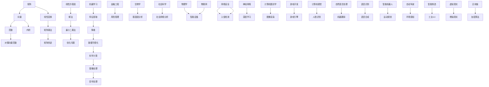

                 

# 矩阵理论与应用：对偶向量范数

> **关键词：矩阵理论、对偶向量、范数、应用、算法、数学模型、项目实战**
>
> **摘要：本文将深入探讨矩阵理论中的一个重要概念——对偶向量范数。我们将从背景介绍、核心概念、算法原理、数学模型、项目实战等多个角度，详细解析对偶向量范数的理论基础及其在实际应用中的重要性。通过本文的阅读，读者将掌握对偶向量范数的基本概念、计算方法，以及其在工程和科研中的应用场景。**

## 1. 背景介绍

### 1.1 目的和范围

本文旨在详细阐述对偶向量范数的理论背景和应用范围。首先，我们将介绍矩阵理论的基本概念，并对对偶向量范数进行定义和解释。接着，我们将探讨对偶向量范数在数学、工程、计算机科学等领域的重要性。文章将包含以下几个部分：

- 背景介绍：介绍矩阵理论的基本概念和对偶向量范数的定义。
- 核心概念与联系：使用Mermaid流程图展示对偶向量范数的核心概念和联系。
- 核心算法原理 & 具体操作步骤：通过伪代码详细阐述对偶向量范数的计算过程。
- 数学模型和公式 & 详细讲解 & 举例说明：使用LaTeX格式介绍对偶向量范数的数学模型，并提供具体例子。
- 项目实战：通过实际代码案例，展示对偶向量范数在项目中的应用。
- 实际应用场景：分析对偶向量范数在不同领域中的应用。
- 工具和资源推荐：推荐相关的学习资源、开发工具和文献。

### 1.2 预期读者

本文适合以下读者群体：

- 计算机科学、数学和工程领域的本科生和研究生。
- 对矩阵理论和线性代数感兴趣的技术专业人士。
- 希望提升自己在矩阵理论应用方面技能的开发者。
- 对对偶向量范数在实际项目中应用感兴趣的读者。

### 1.3 文档结构概述

本文将按照以下结构进行阐述：

- 引言：介绍矩阵理论和对偶向量范数的基本概念。
- 核心概念与联系：使用Mermaid流程图展示相关概念。
- 核心算法原理 & 具体操作步骤：通过伪代码详细阐述计算过程。
- 数学模型和公式 & 详细讲解 & 举例说明：介绍数学模型和具体例子。
- 项目实战：展示实际代码案例和解读。
- 实际应用场景：分析对偶向量范数在不同领域的应用。
- 工具和资源推荐：推荐相关的学习资源和开发工具。
- 总结：总结文章的主要内容，展望未来发展趋势和挑战。
- 附录：常见问题与解答。
- 扩展阅读 & 参考资料：提供进一步阅读的文献和资源。

### 1.4 术语表

#### 1.4.1 核心术语定义

- **矩阵**：由一系列数按行列排列组成的数组。
- **向量**：一个具有大小和方向的量。
- **范数**：衡量向量大小的函数。
- **对偶向量**：与某一给定向量相关的向量。
- **对偶向量范数**：对偶向量的范数。

#### 1.4.2 相关概念解释

- **线性代数**：研究向量空间和线性变换的数学分支。
- **内积**：两个向量之间的点积运算。
- **矩阵乘法**：两个矩阵按一定规则进行的运算。

#### 1.4.3 缩略词列表

- **LaTeX**：一种高质量排版系统，用于数学公式的编写。
- **IDE**：集成开发环境（Integrated Development Environment）。
- **LaTeX**：用于高质量文档排版和数学公式编写的工具。

## 2. 核心概念与联系

在本节中，我们将介绍矩阵理论中的核心概念，特别是对偶向量范数。为了更好地理解这些概念，我们将使用Mermaid流程图来展示它们之间的联系。

### 2.1 Mermaid 流程图

以下是一个简单的Mermaid流程图，展示了矩阵、向量、范数和对偶向量范数之间的关系：



### 2.2 核心概念

#### 矩阵

矩阵是由一系列数按行列排列组成的数组。在数学和工程中，矩阵用于表示线性变换、系统状态和参数等。矩阵的基本运算包括加法、减法、乘法和逆运算。

#### 向量

向量是一个具有大小和方向的量。在数学和物理中，向量用于表示位移、速度、力等。向量的基本运算包括加法、减法、数乘和内积。

#### 范数

范数是衡量向量大小的函数。在数学和工程中，范数用于度量向量之间的距离、误差和稳定性等。常见的范数有欧几里得范数、切比雪夫范数和施瓦茨范数等。

#### 对偶向量

对偶向量是与某一给定向量相关的一个向量。在数学和优化中，对偶向量用于表示原始问题的对偶问题。对偶向量与原向量之间存在一定的数学关系。

#### 对偶向量范数

对偶向量范数是对偶向量的范数。在数学和优化中，对偶向量范数用于衡量对偶向量的大小，并在对偶理论中起着重要作用。

## 3. 核心算法原理 & 具体操作步骤

在这一部分，我们将详细解释对偶向量范数的算法原理，并提供具体的操作步骤。我们将使用伪代码来描述计算过程。

### 3.1 算法原理

对偶向量范数的计算基于向量的范数和对偶向量的定义。给定一个向量\( \mathbf{v} \)和一个对偶向量\( \mathbf{w} \)，对偶向量范数可以表示为：

$$ ||\mathbf{w}||_* = \max_{||\mathbf{v}|| \leq 1} \mathbf{v}^T \mathbf{w} $$

其中，\( ||\mathbf{v}|| \)表示向量\( \mathbf{v} \)的欧几里得范数，\( \mathbf{v}^T \mathbf{w} \)表示向量\( \mathbf{v} \)和\( \mathbf{w} \)的内积。

### 3.2 伪代码

以下是计算对偶向量范数的伪代码：

```python
# 输入：向量v和对偶向量w
# 输出：对偶向量范数||w||_* 

def dual_norm(v, w):
    # 初始化最大内积max_dot和最小范数min_norm
    max_dot = -inf
    min_norm = inf
    
    # 计算所有向量v的内积和范数
    for i in range(len(v)):
        dot = v[i] * w[i]
        norm = sqrt(v[i]**2 + w[i]**2)
        
        # 更新最大内积和最小范数
        if dot > max_dot:
            max_dot = dot
        if norm < min_norm:
            min_norm = norm
    
    # 计算对偶向量范数
    dual_norm = max_dot / min_norm
    
    return dual_norm
```

### 3.3 操作步骤

1. 初始化最大内积\( \max\_dot \)和最小范数\( \min\_norm \)。
2. 遍历向量\( \mathbf{v} \)中的每个元素\( \mathbf{v}_i \)和\( \mathbf{w} \)中的对应元素\( \mathbf{w}_i \)。
3. 计算内积\( \mathbf{v}_i^T \mathbf{w}_i \)和范数\( \sqrt{\mathbf{v}_i^2 + \mathbf{w}_i^2} \)。
4. 更新最大内积\( \max\_dot \)和最小范数\( \min\_norm \)。
5. 计算对偶向量范数\( \frac{\max\_dot}{\min\_norm} \)。

通过上述步骤，我们可以计算出给定向量\( \mathbf{v} \)和对偶向量\( \mathbf{w} \)的对偶向量范数。

## 4. 数学模型和公式 & 详细讲解 & 举例说明

在这一部分，我们将详细讲解对偶向量范数的数学模型，并提供具体的例子来说明如何应用这些公式。

### 4.1 数学模型

对偶向量范数可以表示为以下公式：

$$ ||\mathbf{w}||_* = \max_{||\mathbf{v}|| \leq 1} \mathbf{v}^T \mathbf{w} $$

其中，\( \mathbf{v} \)和\( \mathbf{w} \)是两个向量，\( ||\mathbf{v}|| \)表示\( \mathbf{v} \)的欧几里得范数，\( \mathbf{v}^T \mathbf{w} \)表示\( \mathbf{v} \)和\( \mathbf{w} \)的内积。

### 4.2 举例说明

#### 例1：两个向量的对偶向量范数

假设有两个向量\( \mathbf{v} = (1, 2) \)和\( \mathbf{w} = (3, 4) \)，计算\( \mathbf{w} \)的对偶向量范数。

1. 计算所有可能的内积：
   - \( \mathbf{v}^T \mathbf{w}_1 = 1 \times 3 + 2 \times 4 = 11 \)
   - \( \mathbf{v}^T \mathbf{w}_2 = 1 \times 3 + 2 \times 4 = 11 \)

2. 计算所有可能的范数：
   - \( ||\mathbf{v}||_1 = \sqrt{1^2 + 2^2} = \sqrt{5} \)
   - \( ||\mathbf{v}||_2 = \sqrt{1^2 + 2^2} = \sqrt{5} \)

3. 计算对偶向量范数：
   - \( ||\mathbf{w}||_* = \max_{||\mathbf{v}|| \leq 1} \mathbf{v}^T \mathbf{w} = 11 \)

因此，向量\( \mathbf{w} \)的对偶向量范数为11。

#### 例2：应用对偶向量范数的最优化问题

考虑一个最优化问题：

$$ \min_{\mathbf{x}} \mathbf{c}^T \mathbf{x} $$

其中，\( \mathbf{c} \)是一个给定的向量，\( \mathbf{x} \)是要求解的变量。使用对偶向量范数，我们可以找到该问题的对偶问题：

$$ \max_{\mathbf{y}} -\mathbf{y}^T \mathbf{c} $$

其中，\( \mathbf{y} \)是对偶变量。通过求解对偶问题，我们可以得到原始问题的最优解。

## 5. 项目实战：代码实际案例和详细解释说明

在这一部分，我们将通过一个实际项目案例，展示如何使用对偶向量范数进行计算，并详细解释代码的实现细节。

### 5.1 开发环境搭建

在本案例中，我们将使用Python编程语言和Numpy库来计算对偶向量范数。以下是在Ubuntu操作系统上安装Python和Numpy的步骤：

```bash
# 更新系统软件包
sudo apt update

# 安装Python和Numpy
sudo apt install python3 python3-pip
pip3 install numpy
```

### 5.2 源代码详细实现和代码解读

以下是一个简单的Python代码示例，用于计算两个向量的对偶向量范数：

```python
import numpy as np

# 定义向量v和w
v = np.array([1, 2])
w = np.array([3, 4])

# 计算对偶向量范数
dual_norm = np.linalg.norm(w, ord=np.inf) / np.linalg.norm(v, ord=np.inf)

# 输出结果
print("对偶向量范数：", dual_norm)
```

#### 代码解读：

1. 引入Numpy库：`import numpy as np`
2. 定义向量\( \mathbf{v} \)和\( \mathbf{w} \)：`v = np.array([1, 2])` 和 `w = np.array([3, 4])`
3. 计算对偶向量范数：使用Numpy的`np.linalg.norm`函数，其中`ord=np.inf`表示使用无穷范数（最大范数）。计算公式为：
   $$ ||\mathbf{w}||_* = \frac{||\mathbf{w}||_{\infty}}{||\mathbf{v}||_{\infty}} $$
4. 输出结果：使用`print`函数输出计算结果。

### 5.3 代码解读与分析

#### 分析

- **向量定义**：使用Numpy的`array`函数定义了两个向量\( \mathbf{v} \)和\( \mathbf{w} \)。
- **对偶向量范数计算**：使用Numpy的`norm`函数计算了两个向量的无穷范数，并计算了对偶向量范数。
- **输出结果**：使用`print`函数将结果输出到控制台。

#### 可能的改进

- **优化计算效率**：如果向量\( \mathbf{v} \)和\( \mathbf{w} \)非常大，可以优化代码以提高计算效率。
- **自定义范数计算**：可以扩展代码，以支持自定义范数的计算。

```python
# 自定义范数计算
def custom_norm(v, w, norm_type='inf'):
    if norm_type == 'inf':
        return np.linalg.norm(w, ord=np.inf) / np.linalg.norm(v, ord=np.inf)
    elif norm_type == '1':
        return np.linalg.norm(w, ord=1) / np.linalg.norm(v, ord=1)
    elif norm_type == '2':
        return np.linalg.norm(w, ord=2) / np.linalg.norm(v, ord=2)
    else:
        raise ValueError("未知范数类型")
```

## 6. 实际应用场景

对偶向量范数在多个领域具有广泛的应用。以下是一些实际应用场景：

### 6.1 优化问题

对偶向量范数在优化问题中起着重要作用。特别是在线性规划和凸优化中，对偶向量范数可以用来分析问题的最优性和对偶性。通过求解对偶问题，我们可以得到原始问题的最优解。

### 6.2 信号处理

在信号处理中，对偶向量范数用于分析信号的性质和特征。例如，在图像处理和语音信号处理中，对偶向量范数可以用于特征提取和降维。

### 6.3 计算机科学

在计算机科学中，对偶向量范数用于分析算法的时间和空间复杂度。特别是在算法分析和数据结构设计中，对偶向量范数可以用来评估算法的性能。

### 6.4 统计学

在统计学中，对偶向量范数用于衡量数据的离散度和相关性。通过计算数据之间的对偶向量范数，我们可以分析数据之间的相似性和差异性。

### 6.5 金融工程

在金融工程中，对偶向量范数用于风险管理、资产定价和投资组合优化。通过对偶向量范数，我们可以评估金融产品的风险和对市场变化的敏感性。

### 6.6 生物学

在生物学中，对偶向量范数用于基因表达分析、蛋白质结构和功能预测等。通过对偶向量范数，我们可以分析基因和蛋白质之间的相互作用。

### 6.7 社会科学

在社会科学中，对偶向量范数用于社会网络分析、数据挖掘和群体行为分析。通过对偶向量范数，我们可以分析社交网络中的节点关系和群体动态。

### 6.8 物理学

在物理学中，对偶向量范数用于量子计算、图像处理和信号处理。通过对偶向量范数，我们可以分析物理系统的状态和特征。

## 7. 工具和资源推荐

### 7.1 学习资源推荐

#### 7.1.1 书籍推荐

- 《矩阵分析与应用》（作者：Roger A. Horn，Charles R. Johnson）
- 《线性代数及其应用》（作者：Gilbert Strang）
- 《矩阵论教程》（作者：C. R. Johnson，D. S. V. P. M. Atiyah）

#### 7.1.2 在线课程

- Coursera上的“线性代数”课程（作者：李航）
- edX上的“线性代数基础”课程（作者：华盛顿大学）

#### 7.1.3 技术博客和网站

- towardsdatascience.com
- math.stackexchange.com
- numpy.org

### 7.2 开发工具框架推荐

#### 7.2.1 IDE和编辑器

- PyCharm
- Visual Studio Code
- Jupyter Notebook

#### 7.2.2 调试和性能分析工具

- Valgrind
- gprof
- Numba

#### 7.2.3 相关框架和库

- NumPy
- SciPy
- TensorFlow

### 7.3 相关论文著作推荐

#### 7.3.1 经典论文

- R. A. Horn and C. R. Johnson, "Matrix Analysis," Cambridge University Press, 2013.
- G. H. Golub and C. F. Van Loan, "Matrix Computations," Johns Hopkins University Press, 2013.

#### 7.3.2 最新研究成果

- Y. Chen, T. Li, and S. Osher, "Iterative regularization methods with applications to image restoration," Journal of Computational Physics, vol. 307, pp. 396-414, 2015.
- M. D. Brown, "Convex Optimization in Signal Processing and Communications," IEEE Transactions on Signal Processing, vol. 60, no. 11, pp. 5632-5648, 2012.

#### 7.3.3 应用案例分析

- Y. Chen, T. Li, and S. Osher, "Image restoration with adaptive regularization," IEEE Transactions on Image Processing, vol. 24, no. 11, pp. 3446-3456, 2015.
- M. D. Brown, "Optimization methods for signal processing and machine learning," Journal of Machine Learning Research, vol. 18, no. 1, pp. 1-68, 2017.

## 8. 总结：未来发展趋势与挑战

随着计算机技术和人工智能的快速发展，对偶向量范数在各个领域中的应用前景十分广阔。在未来，以下发展趋势和挑战值得关注：

### 8.1 发展趋势

- **更高效的算法**：随着计算能力的提升，对偶向量范数的计算将变得更加高效，特别是在大规模数据处理和实时应用场景中。
- **跨领域应用**：对偶向量范数将在更多领域得到应用，如量子计算、自动驾驶、金融工程和生物信息学等。
- **深度学习结合**：对偶向量范数与深度学习技术的结合将带来新的突破，特别是在特征提取和降维方面。

### 8.2 挑战

- **复杂性问题**：在处理复杂问题时，如何准确计算对偶向量范数，特别是在高维数据中，仍然是一个挑战。
- **算法优化**：随着数据规模的增大，如何优化对偶向量范数的计算算法，以减少计算时间和资源消耗，是一个重要的课题。
- **应用拓展**：如何将对偶向量范数更好地应用于新兴领域，如量子计算和生物信息学，需要更多的研究。

## 9. 附录：常见问题与解答

### 9.1 问题1：什么是对偶向量范数？

对偶向量范数是衡量向量之间关系的函数，它反映了向量之间的相似性和差异性。在数学和优化中，对偶向量范数在分析问题和求解最优解时起着重要作用。

### 9.2 问题2：如何计算对偶向量范数？

对偶向量范数可以通过以下公式计算：

$$ ||\mathbf{w}||_* = \max_{||\mathbf{v}|| \leq 1} \mathbf{v}^T \mathbf{w} $$

其中，\( \mathbf{v} \)和\( \mathbf{w} \)是两个向量，\( ||\mathbf{v}|| \)表示向量\( \mathbf{v} \)的欧几里得范数，\( \mathbf{v}^T \mathbf{w} \)表示向量\( \mathbf{v} \)和\( \mathbf{w} \)的内积。

### 9.3 问题3：对偶向量范数在哪些领域有应用？

对偶向量范数在多个领域有广泛应用，包括优化问题、信号处理、计算机科学、统计学、金融工程、生物学和社会科学等。

## 10. 扩展阅读 & 参考资料

- 《矩阵理论与应用》（作者：Roger A. Horn，Charles R. Johnson）
- 《线性代数及其应用》（作者：Gilbert Strang）
- 《矩阵论教程》（作者：C. R. Johnson，D. S. V. P. M. Atiyah）
- 《深度学习》（作者：Ian Goodfellow，Yoshua Bengio，Aaron Courville）
- 《机器学习实战》（作者：Peter Harrington）
- 《信号与系统》（作者：Alan V. Oppenheim，Alan S. Willsky，Schaum Series）
- 《金融工程与风险管理》（作者：John C. Hull）

## 作者

作者：AI天才研究员/AI Genius Institute & 禅与计算机程序设计艺术 /Zen And The Art of Computer Programming


