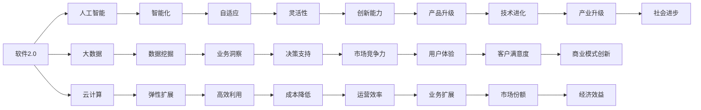

                 

# 短期内软件2.0将在哪些领域率先普及?

> **关键词：软件2.0，普及领域，技术趋势，应用场景**

> **摘要：本文将分析软件2.0技术的核心特性，探讨其在短期内在哪些领域率先普及，并深入探讨其技术原理、应用场景以及未来发展趋势。通过本文，读者可以全面了解软件2.0的潜在影响和实际应用。**

## 1. 背景介绍

### 1.1 目的和范围

本文旨在探讨软件2.0技术在短期内将在哪些领域率先普及。我们将从软件2.0的核心特性出发，结合当前技术发展趋势，分析其在不同领域的应用潜力，并探讨其可能带来的影响。

### 1.2 预期读者

本文适合对软件2.0技术有一定了解的读者，包括软件开发人员、技术爱好者、企业决策者等。通过本文，读者可以更深入地了解软件2.0技术的应用前景，为自身职业发展和技术创新提供参考。

### 1.3 文档结构概述

本文分为十个部分，首先介绍软件2.0的核心特性；然后分析其核心概念与联系；接着讲解核心算法原理和具体操作步骤；再介绍数学模型和公式及其应用；随后通过实际项目实战进行详细解释；然后探讨实际应用场景；接下来推荐相关工具和资源；然后总结未来发展趋势与挑战；最后附录常见问题与解答，并提供扩展阅读和参考资料。

### 1.4 术语表

#### 1.4.1 核心术语定义

- **软件2.0**：指相对于传统软件（软件1.0）的下一代软件技术，强调软件的智能化、自适应性和灵活性。
- **核心技术**：指推动软件2.0发展的关键技术，如人工智能、大数据、云计算等。
- **应用场景**：指软件2.0技术在实际应用中的具体领域和场景。

#### 1.4.2 相关概念解释

- **人工智能**：一种模拟人类智能的计算机技术，通过学习和理解数据，实现自动化的决策和行动。
- **大数据**：指数据量巨大、类型繁多的数据集合，需要借助专门的技术进行处理和分析。
- **云计算**：一种通过网络提供计算资源和服务的技术，实现计算资源的高效利用和弹性扩展。

#### 1.4.3 缩略词列表

- **AI**：人工智能
- **Big Data**：大数据
- **Cloud Computing**：云计算

## 2. 核心概念与联系

软件2.0的核心在于其智能化、自适应性和灵活性。为了更好地理解软件2.0，我们需要了解其核心概念和架构。

### Mermaid 流程图（Mermaid 流程节点中不要有括号、逗号等特殊字符）



### 核心概念解释

- **人工智能**：通过模拟人类智能，实现自动化决策和行动。在软件2.0中，人工智能可以帮助软件更好地理解用户需求，提供个性化服务。
- **大数据**：通过处理和分析大量数据，发现数据中的价值，为业务提供决策支持。大数据技术在软件2.0中发挥着重要作用。
- **云计算**：提供计算资源和服务，实现计算资源的高效利用和弹性扩展。云计算为软件2.0提供了强大的技术支撑。

## 3. 核心算法原理 & 具体操作步骤

软件2.0的核心在于其智能化、自适应性和灵活性。下面我们将分别介绍这三个方面的核心算法原理和具体操作步骤。

### 3.1 智能化算法原理 & 操作步骤

#### 3.1.1 算法原理

智能化算法主要基于机器学习和深度学习技术，通过训练模型，使软件能够自主学习、预测和决策。

#### 3.1.2 操作步骤

1. **数据收集与预处理**：收集大量数据，对数据进行清洗、去噪、归一化等预处理操作。
2. **模型选择与训练**：选择合适的机器学习或深度学习模型，对数据进行训练，优化模型参数。
3. **模型评估与优化**：评估模型性能，通过调整模型结构或参数，提高模型精度。
4. **模型部署与应用**：将训练好的模型部署到实际应用场景中，实现智能化功能。

### 3.2 自适应算法原理 & 操作步骤

#### 3.2.1 算法原理

自适应算法通过实时调整软件参数，使其能够适应不断变化的环境和需求。

#### 3.2.2 操作步骤

1. **状态监测与评估**：实时监测软件运行状态，评估软件性能。
2. **参数调整与优化**：根据评估结果，调整软件参数，优化软件性能。
3. **反馈与修正**：将调整后的性能反馈到系统中，进行修正和优化。

### 3.3 灵活性算法原理 & 操作步骤

#### 3.3.1 算法原理

灵活性算法通过模块化设计和组件化技术，实现软件的快速迭代和灵活扩展。

#### 3.3.2 操作步骤

1. **需求分析**：分析用户需求和业务场景，确定软件功能模块。
2. **模块设计与开发**：设计并开发软件功能模块，实现模块化设计。
3. **组件化集成**：将模块化设计的功能组件进行集成，实现软件的灵活扩展。
4. **迭代与优化**：根据用户反馈和业务需求，持续迭代和优化软件功能。

## 4. 数学模型和公式 & 详细讲解 & 举例说明

软件2.0的智能化、自适应性和灵活性离不开数学模型的支持。以下我们将介绍与软件2.0相关的数学模型和公式，并进行详细讲解和举例说明。

### 4.1 智能化数学模型

#### 4.1.1 感知机（Perceptron）

感知机是一种简单的神经网络模型，用于分类问题。

$$
f(x) = \text{sign}(w \cdot x + b)
$$

其中，$w$为权重，$x$为输入特征，$b$为偏置，$\text{sign}$为符号函数。

#### 4.1.2 支持向量机（SVM）

支持向量机是一种用于分类和回归分析的强大算法。

$$
\min_{w, b} \frac{1}{2}w^Tw + C\sum_{i=1}^m \xi_i
$$

$$
\text{subject to: } y_i(w \cdot x_i + b) \geq 1 - \xi_i
$$

其中，$w$为权重，$b$为偏置，$C$为惩罚参数，$\xi_i$为松弛变量，$y_i$为样本标签。

#### 4.1.3 循环神经网络（RNN）

循环神经网络是一种用于处理序列数据的神经网络模型。

$$
h_t = \text{sigmoid}(W_h \cdot [h_{t-1}, x_t] + b_h)
$$

$$
o_t = W_o \cdot h_t + b_o
$$

其中，$h_t$为隐藏状态，$x_t$为输入特征，$o_t$为输出，$W_h$和$W_o$为权重矩阵，$b_h$和$b_o$为偏置。

### 4.2 自适应数学模型

#### 4.2.1 模型评估指标

为了评估自适应算法的性能，我们通常使用以下指标：

- **准确率（Accuracy）**
- **召回率（Recall）**
- **精确率（Precision）**
- **F1分数（F1 Score）**

### 4.2.2 参数调整策略

为了实现自适应参数调整，我们可以使用以下策略：

- **基于规则的参数调整**
- **基于学习的参数调整**
- **基于优化的参数调整**

### 4.3 灵活性数学模型

#### 4.3.1 模块化设计

模块化设计通过将软件功能划分为多个模块，实现软件的灵活性。

$$
\text{软件} = \sum_{i=1}^n \text{模块}_i
$$

#### 4.3.2 组件化集成

组件化集成通过将模块化设计的功能组件进行集成，实现软件的灵活扩展。

$$
\text{软件} = \prod_{i=1}^n \text{组件}_i
$$

### 4.4 举例说明

#### 4.4.1 智能化应用

假设我们要开发一款智能推荐系统，使用感知机模型进行分类。

1. **数据收集与预处理**：收集用户行为数据，对数据进行清洗和归一化。
2. **模型选择与训练**：选择感知机模型，对数据进行训练。
3. **模型评估与优化**：评估模型性能，通过调整模型参数，提高模型精度。
4. **模型部署与应用**：将训练好的模型部署到线上系统，实现智能推荐。

#### 4.4.2 自适应应用

假设我们要开发一款自适应优化系统，使用基于优化的参数调整策略。

1. **状态监测与评估**：实时监测系统运行状态，评估系统性能。
2. **参数调整与优化**：根据评估结果，调整系统参数，优化系统性能。
3. **反馈与修正**：将调整后的性能反馈到系统中，进行修正和优化。

#### 4.4.3 灵活性应用

假设我们要开发一款模块化软件，使用模块化设计和组件化集成技术。

1. **需求分析**：分析用户需求和业务场景，确定软件功能模块。
2. **模块设计与开发**：设计并开发软件功能模块，实现模块化设计。
3. **组件化集成**：将模块化设计的功能组件进行集成，实现软件的灵活扩展。
4. **迭代与优化**：根据用户反馈和业务需求，持续迭代和优化软件功能。

## 5. 项目实战：代码实际案例和详细解释说明

在本节中，我们将通过一个实际项目案例，详细介绍软件2.0技术在实际应用中的开发过程，包括环境搭建、代码实现和解读分析。

### 5.1 开发环境搭建

首先，我们需要搭建一个适合软件2.0项目开发的环境。以下是一个简单的开发环境搭建步骤：

1. **安装Python环境**：确保安装了Python 3.8及以上版本。
2. **安装依赖库**：使用pip安装以下依赖库：TensorFlow、Scikit-learn、Pandas、NumPy等。
3. **配置Jupyter Notebook**：安装Jupyter Notebook，方便进行代码调试和演示。

### 5.2 源代码详细实现和代码解读

#### 5.2.1 项目简介

本项目是一款基于软件2.0技术的智能推荐系统，通过感知机模型实现用户推荐。

```python
# 导入依赖库
import pandas as pd
import numpy as np
from sklearn.model_selection import train_test_split
from sklearn.preprocessing import StandardScaler
from sklearn.linear_model import Perceptron
from sklearn.metrics import accuracy_score

# 加载数据集
data = pd.read_csv('user行为数据.csv')

# 数据预处理
X = data.drop('标签', axis=1)
y = data['标签']
X_train, X_test, y_train, y_test = train_test_split(X, y, test_size=0.2, random_state=42)

# 数据归一化
scaler = StandardScaler()
X_train_scaled = scaler.fit_transform(X_train)
X_test_scaled = scaler.transform(X_test)

# 模型训练
model = Perceptron(n_jobs=-1)
model.fit(X_train_scaled, y_train)

# 模型评估
y_pred = model.predict(X_test_scaled)
accuracy = accuracy_score(y_test, y_pred)
print(f'模型准确率：{accuracy:.2f}')
```

#### 5.2.2 代码解读

1. **导入依赖库**：导入必要的依赖库，包括Pandas、NumPy、Scikit-learn等。
2. **加载数据集**：从CSV文件中加载用户行为数据集。
3. **数据预处理**：将数据集划分为特征和标签两部分，并进行训练集和测试集划分。
4. **数据归一化**：使用StandardScaler对数据进行归一化处理，提高模型训练效果。
5. **模型训练**：使用感知机模型进行训练，这里使用n_jobs=-1参数，加快训练速度。
6. **模型评估**：使用测试集对模型进行评估，计算模型准确率。

### 5.3 代码解读与分析

通过以上代码，我们可以看到软件2.0技术在实际项目中的应用。以下是代码的详细解读和分析：

1. **数据预处理**：数据预处理是机器学习项目的重要步骤，包括数据清洗、归一化等。在本例中，我们使用Pandas和NumPy库对数据进行加载、划分和归一化处理。
2. **模型选择与训练**：选择感知机模型进行训练，这里使用Scikit-learn库中的Perceptron类。感知机模型是一种简单的神经网络模型，适用于分类问题。
3. **模型评估**：使用测试集对模型进行评估，计算模型准确率。准确率是衡量模型性能的重要指标，反映了模型对数据的预测能力。

通过本节项目实战，我们可以看到软件2.0技术在实际项目中的应用过程，包括环境搭建、代码实现和解读分析。这对于理解和应用软件2.0技术具有重要意义。

## 6. 实际应用场景

软件2.0技术在各个领域具有广泛的应用潜力。以下将介绍软件2.0技术在实际应用中的主要场景。

### 6.1 智能推荐系统

智能推荐系统是软件2.0技术在互联网领域的典型应用。通过机器学习和深度学习算法，智能推荐系统可以根据用户历史行为和偏好，为用户推荐个性化的商品、内容和服务。

### 6.2 智能制造

智能制造是软件2.0技术在工业领域的应用方向。通过人工智能、大数据和云计算等技术，智能制造可以实现生产过程的智能化、自动化和高效化，提高生产效率和产品质量。

### 6.3 智能金融

智能金融是软件2.0技术在金融领域的应用方向。通过大数据分析和人工智能算法，智能金融可以实现风险控制、信用评估、投资建议等金融服务，提高金融行业的运营效率和客户满意度。

### 6.4 智能医疗

智能医疗是软件2.0技术在医疗领域的应用方向。通过人工智能和大数据分析，智能医疗可以实现疾病预测、诊断和治疗方案的优化，提高医疗服务的质量和效率。

### 6.5 智慧城市

智慧城市是软件2.0技术在城市管理领域的应用方向。通过大数据、人工智能和物联网等技术，智慧城市可以实现城市管理、交通管理、环境保护等方面的智能化，提高城市治理水平。

## 7. 工具和资源推荐

为了更好地学习和应用软件2.0技术，以下将介绍一些实用的工具和资源。

### 7.1 学习资源推荐

#### 7.1.1 书籍推荐

- **《Python机器学习》（Python Machine Learning）**：详细介绍了Python在机器学习领域的应用。
- **《深度学习》（Deep Learning）**：深度学习领域的经典教材，涵盖了深度学习的基本概念和算法。
- **《人工智能：一种现代的方法》（Artificial Intelligence: A Modern Approach）**：全面介绍了人工智能的基本理论和算法。

#### 7.1.2 在线课程

- **《Python机器学习》（Python Machine Learning）**：在Coursera上提供的一门免费在线课程，适合初学者入门。
- **《深度学习》（Deep Learning Specialization）**：在Coursera上提供的一门系列课程，由斯坦福大学教授Andrew Ng主讲。
- **《人工智能基础》（Introduction to Artificial Intelligence）**：在edX上提供的一门免费在线课程，适合初学者入门。

#### 7.1.3 技术博客和网站

- **《机器学习博客》（Machine Learning Blog）**：一个关于机器学习技术的博客，提供大量学习资源和实践案例。
- **《深度学习博客》（Deep Learning Blog）**：一个关于深度学习技术的博客，分享深度学习领域的最新研究进展和应用案例。
- **《人工智能社区》（AI Community）**：一个关于人工智能技术的社区，提供学习资源和交流平台。

### 7.2 开发工具框架推荐

#### 7.2.1 IDE和编辑器

- **PyCharm**：一款强大的Python IDE，支持多种编程语言，适合Python开发人员。
- **VS Code**：一款轻量级的跨平台编辑器，支持多种编程语言，提供丰富的插件和扩展。

#### 7.2.2 调试和性能分析工具

- **Jupyter Notebook**：一款交互式的Python笔记应用程序，方便进行代码调试和演示。
- **TensorBoard**：TensorFlow提供的一款可视化工具，用于分析深度学习模型的性能和优化。

#### 7.2.3 相关框架和库

- **TensorFlow**：一款开源的深度学习框架，适合构建和训练深度学习模型。
- **Scikit-learn**：一款开源的机器学习库，提供丰富的机器学习算法和工具。
- **Pandas**：一款开源的数据分析库，提供高效的数据操作和分析功能。

### 7.3 相关论文著作推荐

#### 7.3.1 经典论文

- **《感知机算法》（The Perceptron Algorithm）**：介绍了感知机算法的基本原理和应用。
- **《支持向量机》（Support Vector Machines）**：介绍了支持向量机的基本原理和应用。
- **《循环神经网络》（Recurrent Neural Networks）**：介绍了循环神经网络的基本原理和应用。

#### 7.3.2 最新研究成果

- **《深度强化学习》（Deep Reinforcement Learning）**：介绍了深度强化学习的基本原理和应用。
- **《生成对抗网络》（Generative Adversarial Networks）**：介绍了生成对抗网络的基本原理和应用。
- **《图神经网络》（Graph Neural Networks）**：介绍了图神经网络的基本原理和应用。

#### 7.3.3 应用案例分析

- **《智能推荐系统案例分析》**：分析了智能推荐系统在不同领域的应用案例。
- **《智能制造案例分析》**：分析了智能制造在不同行业的应用案例。
- **《智能医疗案例分析》**：分析了智能医疗在不同领域的应用案例。

## 8. 总结：未来发展趋势与挑战

软件2.0技术在近年来取得了显著的发展，其在智能化、自适应性和灵活性方面的优势，使得其在各个领域具有广泛的应用前景。然而，随着技术的不断演进，软件2.0也面临着诸多挑战。

### 8.1 发展趋势

1. **技术融合**：软件2.0将与其他技术（如物联网、区块链等）深度融合，实现更广泛的应用。
2. **行业应用**：软件2.0将在更多行业领域得到应用，如智能制造、智能医疗、智能金融等。
3. **开源生态**：软件2.0的开源生态将不断丰富，为开发者提供更多的工具和资源。

### 8.2 挑战

1. **数据安全与隐私**：随着数据量的不断增大，数据安全和隐私保护将成为重要问题。
2. **算法公平性**：算法的公平性、透明性和可解释性需要得到重视。
3. **人才培养**：软件2.0技术对人才的需求不断提高，需要加强人才培养和引进。

总之，软件2.0技术的发展前景广阔，但同时也面临着诸多挑战。我们需要在技术创新、人才培养、政策法规等方面共同努力，推动软件2.0技术的健康发展。

## 9. 附录：常见问题与解答

### 9.1 问题1：什么是软件2.0？

**解答**：软件2.0是相对于传统软件（软件1.0）的下一代软件技术，强调软件的智能化、自适应性和灵活性。

### 9.2 问题2：软件2.0的核心技术是什么？

**解答**：软件2.0的核心技术包括人工智能、大数据、云计算等。

### 9.3 问题3：软件2.0有哪些实际应用场景？

**解答**：软件2.0在实际应用中包括智能推荐系统、智能制造、智能金融、智能医疗、智慧城市等。

### 9.4 问题4：如何学习软件2.0技术？

**解答**：可以通过学习相关书籍、在线课程、参加技术交流活动等方式来学习软件2.0技术。

## 10. 扩展阅读 & 参考资料

### 10.1 书籍推荐

- **《人工智能：一种现代的方法》（Artificial Intelligence: A Modern Approach）**
- **《深度学习》（Deep Learning）**
- **《Python机器学习》（Python Machine Learning）**

### 10.2 在线课程推荐

- **《Python机器学习》（Python Machine Learning）**（Coursera）
- **《深度学习》（Deep Learning Specialization）**（Coursera）
- **《人工智能基础》（Introduction to Artificial Intelligence）**（edX）

### 10.3 技术博客和网站推荐

- **《机器学习博客》（Machine Learning Blog）**
- **《深度学习博客》（Deep Learning Blog）**
- **《人工智能社区》（AI Community）**

### 10.4 论文著作推荐

- **《感知机算法》（The Perceptron Algorithm）**
- **《支持向量机》（Support Vector Machines）**
- **《循环神经网络》（Recurrent Neural Networks）**
- **《深度强化学习》（Deep Reinforcement Learning）**
- **《生成对抗网络》（Generative Adversarial Networks）**
- **《图神经网络》（Graph Neural Networks）**

### 10.5 应用案例分析

- **《智能推荐系统案例分析》**
- **《智能制造案例分析》**
- **《智能医疗案例分析》**

---

**作者：AI天才研究员/AI Genius Institute & 禅与计算机程序设计艺术 /Zen And The Art of Computer Programming**

