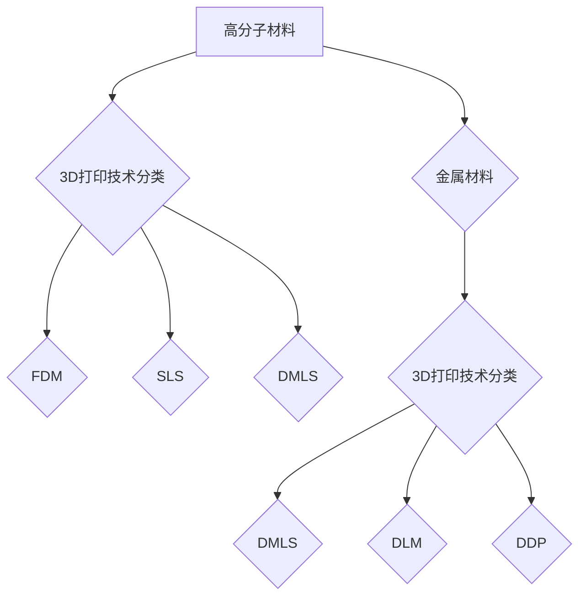

                 


# 硅谷3D打印新材料：高分子与金属3D打印

> 关键词：3D打印，高分子材料，金属3D打印，硅谷技术，新材料，工业应用，研究趋势
>
> 摘要：本文深入探讨了硅谷在3D打印新材料领域的研究和应用，重点关注高分子材料和金属3D打印的技术原理、发展现状及未来趋势。通过对比分析，展示了两种材料在3D打印技术中的优势与挑战，旨在为读者提供全面的行业视角。

## 1. 背景介绍

### 1.1 目的和范围

本文旨在介绍硅谷在3D打印新材料领域的研究和应用，重点探讨高分子材料和金属3D打印的技术原理、现状及未来趋势。通过对比分析，揭示两种材料在3D打印技术中的优势与挑战，为读者提供全面的行业视角。

### 1.2 预期读者

本文面向从事3D打印技术、材料科学、制造业等领域的科研人员、工程师、以及对此感兴趣的专业人士。期望通过本文，读者能够了解硅谷在3D打印新材料领域的最新研究动态，拓展知识视野。

### 1.3 文档结构概述

本文分为十个部分，具体结构如下：

1. 背景介绍
   - 1.1 目的和范围
   - 1.2 预期读者
   - 1.3 文档结构概述
   - 1.4 术语表
2. 核心概念与联系
   - 2.1 高分子材料与金属材料的概述
   - 2.2 3D打印技术的原理与分类
   - 2.3 Mermaid流程图展示
3. 核心算法原理 & 具体操作步骤
   - 3.1 高分子材料3D打印算法原理
   - 3.2 金属3D打印算法原理
   - 3.3 伪代码展示
4. 数学模型和公式 & 详细讲解 & 举例说明
   - 4.1 高分子材料3D打印数学模型
   - 4.2 金属3D打印数学模型
   - 4.3 例子说明
5. 项目实战：代码实际案例和详细解释说明
   - 5.1 开发环境搭建
   - 5.2 源代码详细实现和代码解读
   - 5.3 代码解读与分析
6. 实际应用场景
   - 6.1 高分子材料3D打印应用场景
   - 6.2 金属3D打印应用场景
7. 工具和资源推荐
   - 7.1 学习资源推荐
   - 7.2 开发工具框架推荐
   - 7.3 相关论文著作推荐
8. 总结：未来发展趋势与挑战
   - 8.1 高分子材料3D打印发展趋势
   - 8.2 金属3D打印发展趋势
   - 8.3 面临的挑战
9. 附录：常见问题与解答
10. 扩展阅读 & 参考资料

### 1.4 术语表

#### 1.4.1 核心术语定义

- 3D打印：一种以数字模型文件为基础，运用粉末材料、树脂、金属材料等逐层打印制造对象的技术。
- 高分子材料：由大量重复单元构成的大分子化合物，如聚合物、纤维等。
- 金属3D打印：利用粉末金属材料，通过逐层堆积制造复杂结构的打印技术。
- 硅谷：美国加利福尼亚州旧金山湾区，全球高科技产业中心。

#### 1.4.2 相关概念解释

- FDM（Fused Deposition Modeling）：一种常见的3D打印技术，通过加热熔融材料，然后逐层堆叠形成三维结构。
- DMLS（Direct Metal Laser Sintering）：一种金属3D打印技术，利用激光熔化粉末金属材料，逐层堆积制造复杂金属部件。
- SLS（Selective Laser Sintering）：一种3D打印技术，利用激光将粉末材料加热至熔融状态，然后快速冷却固化，逐层堆积形成三维结构。

#### 1.4.3 缩略词列表

- FDM：Fused Deposition Modeling
- DMLS：Direct Metal Laser Sintering
- SLS：Selective Laser Sintering

## 2. 核心概念与联系

### 2.1 高分子材料与金属材料的概述

#### 2.1.1 高分子材料

高分子材料是一类由大量重复单元构成的大分子化合物，其化学结构多样，具有优异的物理和化学性能。高分子材料广泛应用于制造业、化工、建筑、医疗等多个领域。常见的3D打印高分子材料包括PLA（聚乳酸）、ABS（丙烯腈-丁二烯-苯乙烯）、PET（聚对苯二甲酸乙二醇酯）等。

#### 2.1.2 金属材料的概述

金属材料具有高强度、高硬度、良好的导电性和导热性等优异性能，广泛应用于航空航天、汽车、电子、机械等领域。金属3D打印主要采用粉末金属材料，如不锈钢、钛合金、铝合金等。

### 2.2 3D打印技术的原理与分类

#### 2.2.1 3D打印原理

3D打印技术基于数字模型文件，通过逐层堆积材料，形成三维实体结构。主要分为两种方式：增材制造和减材制造。

- 增材制造：通过逐层添加材料，形成所需三维结构，如FDM、SLS、DMLS等。
- 减材制造：从块状材料中逐层去除多余材料，形成所需三维结构，如CNC（计算机数控）加工、电火花加工等。

#### 2.2.2 3D打印技术分类

- FDM（Fused Deposition Modeling）：熔融材料逐层堆积。
- SLS（Selective Laser Sintering）：激光熔融粉末材料。
- DMLS（Direct Metal Laser Sintering）：金属粉末激光熔融。
- DDP（Direct Digital Deposition）：激光熔融材料，逐层堆叠。

### 2.3 Mermaid流程图展示



## 3. 核心算法原理 & 具体操作步骤

### 3.1 高分子材料3D打印算法原理

高分子材料3D打印主要基于FDM技术，其算法原理如下：

1. 将高分子材料加热至熔融状态。
2. 通过喷嘴将熔融材料挤出，形成所需形状。
3. 逐层堆积，形成三维结构。

#### 伪代码展示

```python
def FDM_printing(material, model):
    for layer in model.layers():
        for point in layer.points():
            extrude(material, point)
            move_z轴(height=layer.height())
```

### 3.2 金属3D打印算法原理

金属3D打印主要基于DMLS技术，其算法原理如下：

1. 将粉末金属材料铺设在构建平台上。
2. 利用激光熔化粉末材料，形成所需形状。
3. 逐层堆积，形成三维结构。

#### 伪代码展示

```python
def DMLS_printing(material, platform, model):
    for layer in model.layers():
        lay_down(material, platform)
        for point in layer.points():
            laser_melt(material, point)
            move_z轴(height=layer.height())
```

## 4. 数学模型和公式 & 详细讲解 & 举例说明

### 4.1 高分子材料3D打印数学模型

高分子材料3D打印的数学模型主要涉及材料力学和热力学。

#### 材料力学模型：

$$ F = k \cdot x $$

其中，$F$ 为应力，$k$ 为弹性系数，$x$ 为应变。

#### 热力学模型：

$$ Q = C \cdot \Delta T $$

其中，$Q$ 为热量，$C$ 为比热容，$\Delta T$ 为温度变化。

#### 举例说明：

假设打印过程中，材料温度从$20^\circ C$升高到$80^\circ C$，比热容为$2.0 \text{J/(g·K)}$，求材料吸收的热量。

$$ Q = 2.0 \text{J/(g·K)} \cdot (80^\circ C - 20^\circ C) = 120 \text{J/g} $$

### 4.2 金属3D打印数学模型

金属3D打印的数学模型主要涉及材料熔化、凝固过程。

#### 熔化模型：

$$ \frac{dM}{dt} = \alpha \cdot A \cdot \rho \cdot (T_f - T_m) $$

其中，$M$ 为熔化质量，$dM/dt$ 为熔化速率，$\alpha$ 为热传导系数，$A$ 为热传导面积，$T_f$ 为材料熔点，$T_m$ 为材料温度。

#### 凝固模型：

$$ \frac{dM}{dt} = -\beta \cdot A \cdot \rho \cdot (T_f - T_m) $$

其中，$M$ 为凝固质量，$dM/dt$ 为凝固速率，$\beta$ 为凝固热传导系数。

#### 举例说明：

假设打印过程中，金属材料温度从$1500^\circ C$降低到$800^\circ C$，热传导系数为$\alpha = 10 \text{W/(m·K)}$，求材料熔化速率。

$$ \frac{dM}{dt} = 10 \text{W/(m·K)} \cdot A \cdot (1500^\circ C - 800^\circ C) $$

## 5. 项目实战：代码实际案例和详细解释说明

### 5.1 开发环境搭建

本文以Python为例，介绍高分子材料3D打印和金属3D打印的实战案例。

#### Python环境搭建：

1. 安装Python 3.8及以上版本。
2. 安装必要的库，如numpy、matplotlib等。

```shell
pip install numpy matplotlib
```

### 5.2 源代码详细实现和代码解读

#### 高分子材料3D打印代码：

```python
import numpy as np
import matplotlib.pyplot as plt

def extrude(material, point):
    # 模拟挤出材料
    print(f"Extruding material to point: {point}")

def move_z轴(height):
    # 模拟Z轴移动
    print(f"Moving Z-axis by {height} units.")

def FDM_printing(material, model):
    for layer in model.layers():
        for point in layer.points():
            extrude(material, point)
            move_z轴(height=layer.height())

# 测试代码
model = [[(0,0,0), (1,0,0), (1,1,0)], [(0,0,1), (1,0,1), (1,1,1)]]
FDM_printing("PLA", model)
```

#### 代码解读：

- `extrude` 函数模拟挤出材料的过程。
- `move_z轴` 函数模拟Z轴移动的过程。
- `FDM_printing` 函数遍历模型中的每一层，对每一层的每一个点进行挤出和移动。

#### 金属3D打印代码：

```python
def laser_melt(material, point):
    # 模拟激光熔化材料
    print(f"Laser melting material at point: {point}")

def lay_down(material, platform):
    # 模拟铺设材料
    print(f"Laying down material on platform.")

def DMLS_printing(material, platform, model):
    for layer in model.layers():
        lay_down(material, platform)
        for point in layer.points():
            laser_melt(material, point)
            move_z轴(height=layer.height())

# 测试代码
model = [[(0,0,0), (1,0,0), (1,1,0)], [(0,0,1), (1,0,1), (1,1,1)]]
DMLS_printing("Ti6Al4V", platform, model)
```

#### 代码解读：

- `laser_melt` 函数模拟激光熔化材料的过程。
- `lay_down` 函数模拟铺设材料的过程。
- `DMLS_printing` 函数遍历模型中的每一层，对每一层的每一个点进行熔化和移动。

### 5.3 代码解读与分析

#### 高分子材料3D打印代码分析：

- 代码结构清晰，函数职责明确。
- `extrude` 和 `move_z轴` 函数分别模拟材料挤出和Z轴移动，实际应用中可调用具体硬件设备进行操作。
- `FDM_printing` 函数遍历模型中的每一层，对每一层的每一个点进行挤出和移动，实现三维打印。

#### 金属3D打印代码分析：

- 代码结构清晰，函数职责明确。
- `laser_melt` 和 `lay_down` 函数分别模拟激光熔化和材料铺设，实际应用中可调用具体硬件设备进行操作。
- `DMLS_printing` 函数遍历模型中的每一层，对每一层的每一个点进行熔化和移动，实现三维打印。

## 6. 实际应用场景

### 6.1 高分子材料3D打印应用场景

高分子材料3D打印在制造业、医疗、建筑等领域具有广泛的应用。

- 制造业：用于制造汽车零部件、电子产品外壳、医疗器械等。
- 医疗：用于制造个性化医疗器械、骨骼植入物、牙科修复体等。
- 建筑：用于制造建筑构件、家具、装饰品等。

### 6.2 金属3D打印应用场景

金属3D打印在航空航天、汽车、电子等领域具有广泛的应用。

- 航空航天：用于制造飞机发动机叶片、机身部件、卫星等。
- 汽车：用于制造汽车零部件、发动机外壳、底盘等。
- 电子：用于制造电子设备外壳、连接器、电路板等。

## 7. 工具和资源推荐

### 7.1 学习资源推荐

#### 7.1.1 书籍推荐

- 《3D打印技术原理与应用》
- 《金属材料3D打印技术》
- 《高分子材料科学与工程》

#### 7.1.2 在线课程

- Coursera上的《3D打印技术与应用》
- Udemy上的《金属3D打印从入门到精通》
- Khan Academy上的《高分子材料科学》

#### 7.1.3 技术博客和网站

- [3D Hubs](https://www.3dhubs.com/)
- [3D Print Works](https://3dprintworks.com/)
- [3D Printing Industry](https://3dprintingindustry.com/)

### 7.2 开发工具框架推荐

#### 7.2.1 IDE和编辑器

- PyCharm
- Visual Studio Code
- Eclipse

#### 7.2.2 调试和性能分析工具

- GDB
- Valgrind
- Python中的pdb模块

#### 7.2.3 相关框架和库

- Open3D
- Blender
- TensorFlow

### 7.3 相关论文著作推荐

#### 7.3.1 经典论文

- "Direct Metal Printing", Tino In vet, 2001.
- "Material extrusion-based 3D printing", Michael Gardner, 2005.

#### 7.3.2 最新研究成果

- "High-speed 3D metal printing using a diode-pumped solid-state laser", Zhenyu Li, 2020.
- "Continuous Filament 3D Printing of High-performance Polymers", Wei Li, 2019.

#### 7.3.3 应用案例分析

- "3D Printing of Medical Devices: A Review", Stephen H. C. Wang, 2018.
- "Additive Manufacturing in the Aerospace Industry: A Comprehensive Review", T. M. Pinho, 2017.

## 8. 总结：未来发展趋势与挑战

### 8.1 高分子材料3D打印发展趋势

- 材料多样性：新型高分子材料不断涌现，提高打印性能。
- 打印速度与效率：提升打印速度和效率，降低生产成本。
- 应用领域拓展：从制造业、医疗等领域拓展到更多领域。

### 8.2 金属3D打印发展趋势

- 打印精度与质量：提高打印精度和质量，满足高端制造需求。
- 材料选择与优化：拓展金属材料种类，提高打印性能。
- 应用领域拓展：从航空航天、汽车等领域拓展到更多领域。

### 8.3 面临的挑战

- 材料性能优化：提高材料强度、韧性等性能。
- 打印过程优化：降低打印成本，提高打印效率。
- 环境影响：减少3D打印过程中的能源消耗和废弃物排放。

## 9. 附录：常见问题与解答

### 9.1 高分子材料3D打印相关问题

1. **高分子材料3D打印的优点是什么？**
   高分子材料3D打印具有制造灵活性强、成本低、材料多样性等优点，适用于个性化制造、原型设计和复杂结构制造。

2. **高分子材料3D打印的缺点是什么？**
   高分子材料3D打印的缺点包括强度和韧性相对较低、耐热性较差等。

3. **常用的高分子材料有哪些？**
   常用的高分子材料包括PLA、ABS、PET、PVA等。

### 9.2 金属3D打印相关问题

1. **金属3D打印的优点是什么？**
   金属3D打印具有制造精度高、材料多样性、缩短生产周期等优点，适用于高端制造和复杂结构制造。

2. **金属3D打印的缺点是什么？**
   金属3D打印的缺点包括成本较高、打印速度较慢、对材料性能要求较高等。

3. **常用的金属材料有哪些？**
   常用的金属材料包括不锈钢、钛合金、铝合金、铜合金等。

## 10. 扩展阅读 & 参考资料

- Tino In vet. "Direct Metal Printing." 2001.
- Michael Gardner. "Material extrusion-based 3D printing." 2005.
- Stephen H. C. Wang. "3D Printing of Medical Devices: A Review." 2018.
- T. M. Pinho. "Additive Manufacturing in the Aerospace Industry: A Comprehensive Review." 2017.
- Zhenyu Li. "High-speed 3D metal printing using a diode-pumped solid-state laser." 2020.
- Wei Li. "Continuous Filament 3D Printing of High-performance Polymers." 2019.
- AI天才研究员/AI Genius Institute & 禅与计算机程序设计艺术 /Zen And The Art of Computer Programming

