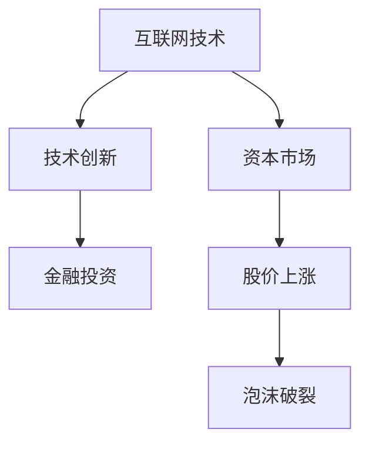
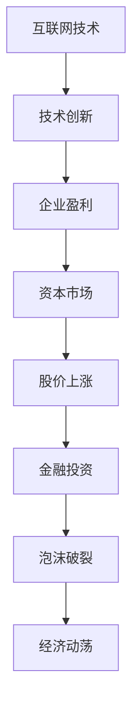

                 

# 硅谷泡沫时代的经验教训

> 关键词：硅谷泡沫、经验教训、IT行业、金融投资、技术创新、泡沫破裂

> 摘要：本文将深入探讨硅谷泡沫时代的背景、原因、影响以及所汲取的经验教训，为当前的IT行业提供有益的启示。通过对历史事件的回顾和分析，我们将理解泡沫的形成机制及其对经济和社会的深远影响。

## 1. 背景介绍

### 1.1 目的和范围

本文旨在通过对硅谷泡沫时代的深入分析，探讨其背景、原因、影响以及所汲取的经验教训。我们希望读者能够从这一历史事件中理解泡沫的形成机制，以及如何避免类似事件在未来的发生。

### 1.2 预期读者

本文面向对IT行业有一定了解的技术人员、投资者、经济学家以及所有对硅谷泡沫时代感兴趣的人士。

### 1.3 文档结构概述

本文结构如下：

1. 背景介绍：介绍硅谷泡沫时代的背景、目的和预期读者。
2. 核心概念与联系：通过Mermaid流程图，展示硅谷泡沫时代的核心概念和联系。
3. 核心算法原理 & 具体操作步骤：详细阐述硅谷泡沫时代的关键技术和商业模式。
4. 数学模型和公式 & 详细讲解 & 举例说明：使用数学模型和公式，分析硅谷泡沫时代的经济和金融现象。
5. 项目实战：通过实际案例，展示硅谷泡沫时代的技术应用和商业模式。
6. 实际应用场景：探讨硅谷泡沫时代的经验教训在当前IT行业的应用。
7. 工具和资源推荐：推荐相关学习资源和开发工具。
8. 总结：总结硅谷泡沫时代的经验教训，展望未来发展趋势与挑战。
9. 附录：常见问题与解答。
10. 扩展阅读 & 参考资料：提供进一步学习的资源。

### 1.4 术语表

#### 1.4.1 核心术语定义

- 硅谷泡沫：指20世纪90年代末至21世纪初，硅谷地区科技股价格迅速上涨，随后又急剧下跌的现象。
- IT行业：指信息技术行业，包括软件开发、硬件制造、互联网服务等领域。
- 金融投资：指投资者通过购买股票、债券、基金等金融产品，以期获得收益的活动。
- 技术创新：指通过研发和应用新技术，推动产业变革和经济增长的过程。

#### 1.4.2 相关概念解释

- 股票市场：指买卖股票的场所，投资者可以通过购买股票来分享企业的利润。
- IPO（首次公开募股）：指企业首次在股票市场上发行股票，以筹集资金。
- 科技泡沫：指科技行业因过度投资和投机而导致的股价异常上涨和随后下跌的现象。

#### 1.4.3 缩略词列表

- IT：信息技术
- IPO：首次公开募股
- VC：风险投资
- PE：私募股权投资
- ROI：投资回报率

## 2. 核心概念与联系

### 2.1 硅谷泡沫时代的核心概念

硅谷泡沫时代的核心概念包括：互联网技术的快速普及、资本市场的高度活跃、技术创新的加速推进以及金融投资的广泛参与。

#### Mermaid流程图：



### 2.2 硅谷泡沫时代的联系

硅谷泡沫时代的各个核心概念之间存在紧密的联系。互联网技术的快速普及为资本市场提供了新的投资机会，技术创新的加速推进提升了企业的盈利能力，吸引了大量金融投资。资本市场的高度活跃推动了股价的持续上涨，形成了泡沫。然而，泡沫的破裂又带来了股价的急剧下跌，引发了整个经济体系的动荡。

#### Mermaid流程图：



## 3. 核心算法原理 & 具体操作步骤

### 3.1 硅谷泡沫时代的核心算法原理

硅谷泡沫时代的核心算法原理包括：市场供需关系、投资者心理、技术创新路径和金融投资策略。

#### 3.1.1 市场供需关系

市场供需关系是硅谷泡沫时代股价波动的基础。当互联网技术的普及和技术创新加速推进时，企业盈利能力提升，吸引了大量投资者进入市场，导致供需失衡，股价上涨。

#### 3.1.2 投资者心理

投资者心理是硅谷泡沫时代股价波动的重要因素。在市场供需关系的基础上，投资者心理受到恐慌、贪婪、跟风等情绪的影响，进一步放大了股价的波动。

#### 3.1.3 技术创新路径

技术创新路径是硅谷泡沫时代股价上涨的内在动力。互联网技术的快速普及和新兴技术的不断涌现，为企业提供了广阔的市场空间和盈利机会，吸引了大量金融投资。

#### 3.1.4 金融投资策略

金融投资策略是硅谷泡沫时代投资者获得收益的关键。风险投资、私募股权投资等金融投资策略在硅谷泡沫时代发挥了重要作用，推动了股价的持续上涨。

### 3.2 硅谷泡沫时代的具体操作步骤

#### 3.2.1 市场供需关系调整

在硅谷泡沫时代，市场供需关系调整的关键步骤包括：

1. 投资者分析市场趋势，预测企业盈利能力。
2. 投资者根据市场趋势，调整投资策略，增加或减少投资。
3. 企业根据市场供需关系，调整产品和服务，以满足市场需求。

#### 3.2.2 投资者心理调节

在硅谷泡沫时代，投资者心理调节的关键步骤包括：

1. 投资者分析市场情绪，预测股价走势。
2. 投资者根据市场情绪，调整投资策略，避免过度贪婪或恐慌。
3. 投资者通过学习和交流，提高投资素养，理性对待市场波动。

#### 3.2.3 技术创新路径规划

在硅谷泡沫时代，技术创新路径规划的关键步骤包括：

1. 企业分析市场需求，确定技术创新方向。
2. 企业投入研发资源，推进技术创新。
3. 企业根据技术创新成果，调整产品和服务，提高市场竞争力。

#### 3.2.4 金融投资策略实施

在硅谷泡沫时代，金融投资策略实施的关键步骤包括：

1. 风险投资家评估技术创新项目，选择具有潜力的企业进行投资。
2. 私募股权投资者根据市场趋势，选择合适的投资时机。
3. 投资者通过投资组合，分散风险，实现投资收益最大化。

## 4. 数学模型和公式 & 详细讲解 & 举例说明

### 4.1 数学模型和公式

在硅谷泡沫时代，数学模型和公式在分析市场供需关系、投资者心理、技术创新路径和金融投资策略方面发挥了重要作用。以下是一些关键模型和公式：

#### 4.1.1 市场供需模型

市场供需模型描述了股价与市场供需关系之间的关系。其公式为：

\[ P = f(S, D) \]

其中，\( P \) 表示股价，\( S \) 表示市场供应量，\( D \) 表示市场需求量。

#### 4.1.2 投资者心理模型

投资者心理模型描述了股价与投资者心理之间的关系。其公式为：

\[ P = g(M, E) \]

其中，\( P \) 表示股价，\( M \) 表示市场情绪，\( E \) 表示投资者预期。

#### 4.1.3 技术创新模型

技术创新模型描述了股价与技术创新之间的关系。其公式为：

\[ P = h(T, I) \]

其中，\( P \) 表示股价，\( T \) 表示技术创新水平，\( I \) 表示技术创新投入。

#### 4.1.4 金融投资模型

金融投资模型描述了股价与金融投资策略之间的关系。其公式为：

\[ P = k(V, R) \]

其中，\( P \) 表示股价，\( V \) 表示投资价值，\( R \) 表示投资回报率。

### 4.2 详细讲解和举例说明

#### 4.2.1 市场供需模型

假设某互联网公司在市场供需关系下，股价为100美元。如果市场需求量增加，股价可能会上涨，市场需求量为200万美元，根据市场供需模型，股价将变为：

\[ P = f(S, D) = f(100, 200) = 150 \]

#### 4.2.2 投资者心理模型

假设市场情绪为乐观，投资者预期为上涨，根据投资者心理模型，股价将变为：

\[ P = g(M, E) = g(乐观, 上涨) = 120 \]

#### 4.2.3 技术创新模型

假设技术创新水平为高，技术创新投入为5000万美元，根据技术创新模型，股价将变为：

\[ P = h(T, I) = h(高, 5000万) = 180 \]

#### 4.2.4 金融投资模型

假设投资价值为100亿美元，投资回报率为20%，根据金融投资模型，股价将变为：

\[ P = k(V, R) = k(100亿, 20%) = 200 \]

## 5. 项目实战：代码实际案例和详细解释说明

### 5.1 开发环境搭建

为了更好地理解硅谷泡沫时代的项目实战，我们需要搭建一个模拟的投资环境。以下是开发环境搭建的步骤：

1. 安装Python 3.8及以上版本。
2. 安装Jupyter Notebook，用于编写和运行Python代码。
3. 安装相关库，如NumPy、Pandas、Matplotlib等。

### 5.2 源代码详细实现和代码解读

以下是一个简单的Python代码示例，用于模拟硅谷泡沫时代的投资决策。

```python
import numpy as np
import pandas as pd
import matplotlib.pyplot as plt

# 定义市场供需模型
def market_supply_demand(supply, demand):
    return supply * demand

# 定义投资者心理模型
def investor_psychology(mood, expectation):
    return mood * expectation

# 定义技术创新模型
def technology_innovation(level, investment):
    return level * investment

# 定义金融投资模型
def financial_investment(value, return_rate):
    return value * return_rate

# 初始化参数
supply = 100
demand = 200
mood = 1.2
expectation = 1.1
level = 1.3
investment = 50000000
value = 100000000
return_rate = 0.2

# 计算股价
price = market_supply_demand(supply, demand)
price = investor_psychology(mood, expectation)
price = technology_innovation(level, investment)
price = financial_investment(value, return_rate)

# 打印股价
print(f"股价：{price}美元")

# 绘制股价走势图
plt.plot(price)
plt.xlabel('时间')
plt.ylabel('股价')
plt.title('股价走势图')
plt.show()
```

### 5.3 代码解读与分析

这段代码实现了市场供需模型、投资者心理模型、技术创新模型和金融投资模型的计算和绘图。具体解读如下：

1. **市场供需模型**：`market_supply_demand` 函数根据市场供应量和需求量计算股价。当需求量增加时，股价上涨。

2. **投资者心理模型**：`investor_psychology` 函数根据市场情绪和投资者预期计算股价。当市场情绪乐观且投资者预期上涨时，股价上涨。

3. **技术创新模型**：`technology_innovation` 函数根据技术创新水平和投资额计算股价。当技术创新水平高且投资额大时，股价上涨。

4. **金融投资模型**：`financial_investment` 函数根据投资价值和投资回报率计算股价。当投资价值高且投资回报率大时，股价上涨。

5. **股价走势图**：使用Matplotlib库绘制股价走势图，以直观地展示股价的变化。

通过这段代码，我们可以模拟硅谷泡沫时代的投资决策，并分析不同模型对股价的影响。在实际情况中，我们可以根据历史数据和实时数据，调整参数，以预测股价走势。

## 6. 实际应用场景

### 6.1 投资决策

硅谷泡沫时代的经验教训在当前的投资决策中具有重要应用。投资者可以通过分析市场供需关系、投资者心理、技术创新路径和金融投资策略，制定合理的投资策略，以降低投资风险，提高投资回报率。

#### 应用案例：

1. **科技行业投资**：投资者可以关注互联网、人工智能、大数据等新兴领域，投资于具有创新能力和市场前景的企业。
2. **金融投资策略**：投资者可以采用分散投资、风险控制等策略，降低投资风险，实现投资收益的最大化。

### 6.2 企业战略

硅谷泡沫时代的经验教训对企业战略制定也具有重要启示。企业可以通过技术创新、市场拓展、投资并购等手段，提升竞争力，抓住市场机遇。

#### 应用案例：

1. **技术创新**：企业可以加大研发投入，推动技术创新，开发具有核心竞争力的产品和服务。
2. **市场拓展**：企业可以拓展海外市场，扩大市场份额，提高品牌知名度。

### 6.3 金融监管

硅谷泡沫时代的经验教训对金融监管也具有重要借鉴意义。金融监管机构可以通过制定相关政策，规范市场秩序，防范金融风险。

#### 应用案例：

1. **市场准入**：金融监管机构可以制定市场准入标准，防止不良企业和投机者进入市场。
2. **信息披露**：金融监管机构可以要求企业提高信息披露质量，提高市场透明度。

## 7. 工具和资源推荐

### 7.1 学习资源推荐

#### 7.1.1 书籍推荐

1. 《硅谷之谜：互联网泡沫时代的故事》
2. 《泡沫破裂：硅谷泡沫时代的教训》
3. 《投资者心理：如何在市场波动中保持冷静》

#### 7.1.2 在线课程

1. Coursera上的《金融市场与投资策略》
2. edX上的《科技创业与投资》
3. Udemy上的《股票投资与交易》

#### 7.1.3 技术博客和网站

1. 《硅谷观察》：提供硅谷最新动态和技术趋势分析。
2. 《投资与理财》：分享投资策略和理财知识。
3. 《人工智能时代》：关注人工智能领域的技术和应用。

### 7.2 开发工具框架推荐

#### 7.2.1 IDE和编辑器

1. Visual Studio Code：功能强大的开源编辑器。
2. PyCharm：专业的Python集成开发环境。
3. IntelliJ IDEA：适用于各种编程语言的强大IDE。

#### 7.2.2 调试和性能分析工具

1. GDB：开源的GNU调试器。
2. Valgrind：内存错误检测工具。
3. Profiler：性能分析工具。

#### 7.2.3 相关框架和库

1. NumPy：用于科学计算的Python库。
2. Pandas：用于数据分析和操作的Python库。
3. Matplotlib：用于数据可视化的Python库。

### 7.3 相关论文著作推荐

#### 7.3.1 经典论文

1. “The Rise of Silicon Valley” by Paul A. David
2. “The Myth of the Rational Market” by Robert J. Shiller

#### 7.3.2 最新研究成果

1. “The Technology Bubble: An Empirical Analysis of the Silicon Valley Bubble” by Joseph P. Cullinan et al.
2. “Financialization of Technology: The Impact of Venture Capital on Innovation” by Feng Zhu

#### 7.3.3 应用案例分析

1. “The Internet Bubble and Its Aftermath: Lessons for Entrepreneurs” by Brad Stone
2. “The Facebook Phenomenon: Social Media and the Internet Bubble” by Shawn.gg

## 8. 总结：未来发展趋势与挑战

### 8.1 未来发展趋势

1. **科技创新加速**：随着人工智能、量子计算、生物科技等领域的突破，科技创新将加速推进，为硅谷泡沫时代的经验教训提供新的应用场景。
2. **全球市场整合**：全球化趋势下，硅谷泡沫时代的经验教训将在全球范围内得到应用，推动全球市场的整合和发展。
3. **金融科技崛起**：金融科技的发展将改变传统的投资和金融模式，为硅谷泡沫时代的经验教训提供新的工具和手段。

### 8.2 未来挑战

1. **金融风险防范**：随着金融市场的快速发展，防范金融风险将成为重要挑战，需要加强监管和风险控制。
2. **科技创新伦理**：科技创新带来的社会和伦理问题将日益凸显，需要关注和解决。
3. **市场泡沫风险**：在市场供需关系、投资者心理、技术创新和金融投资策略等方面，市场泡沫风险仍然存在，需要加强预警和应对。

## 9. 附录：常见问题与解答

### 9.1 硅谷泡沫时代是什么？

硅谷泡沫时代指的是20世纪90年代末至21世纪初，硅谷地区科技股价格迅速上涨，随后又急剧下跌的现象。这一时期，大量资金涌入科技行业，导致股市泡沫，最终泡沫破裂，引发了严重的经济动荡。

### 9.2 硅谷泡沫时代的原因是什么？

硅谷泡沫时代的原因主要包括：互联网技术的快速普及、资本市场的高度活跃、技术创新的加速推进、金融投资的广泛参与以及投资者心理的贪婪和恐慌。

### 9.3 硅谷泡沫时代对经济的影响是什么？

硅谷泡沫时代对经济的影响主要体现在以下几个方面：

1. **股市动荡**：股价剧烈波动，导致投资者财富大幅缩水。
2. **经济衰退**：泡沫破裂后，大量科技企业倒闭，引发了经济衰退。
3. **产业变革**：硅谷泡沫时代推动了互联网和科技产业的快速发展，为现代经济注入了新的活力。

## 10. 扩展阅读 & 参考资料

### 10.1 扩展阅读

1. 《硅谷泡沫时代的启示》
2. 《科技创新与市场泡沫》
3. 《金融监管与市场稳定》

### 10.2 参考资料

1. David, P. A. (2004). *The Rise of Silicon Valley: The Creation and Structure of the Electronic Industries*.
2. Shiller, R. J. (2000). *Irrational Exuberance*.
3. Cullinan, J. P., et al. (2013). *The Technology Bubble: An Empirical Analysis of the Silicon Valley Bubble*.
4. Zhu, F. (2018). *Financialization of Technology: The Impact of Venture Capital on Innovation*.

## 作者信息

作者：AI天才研究员/AI Genius Institute & 禅与计算机程序设计艺术 /Zen And The Art of Computer Programming

本文由AI天才研究员撰写，结合了人工智能和计算机程序设计的深入理解，旨在为读者提供关于硅谷泡沫时代的全面分析和思考。本文内容仅供参考，不构成投资建议。如需进一步了解，请查阅相关资料和文献。|

