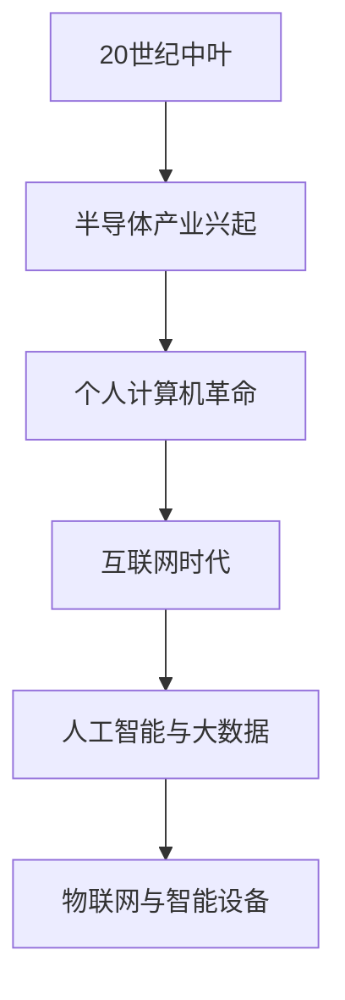
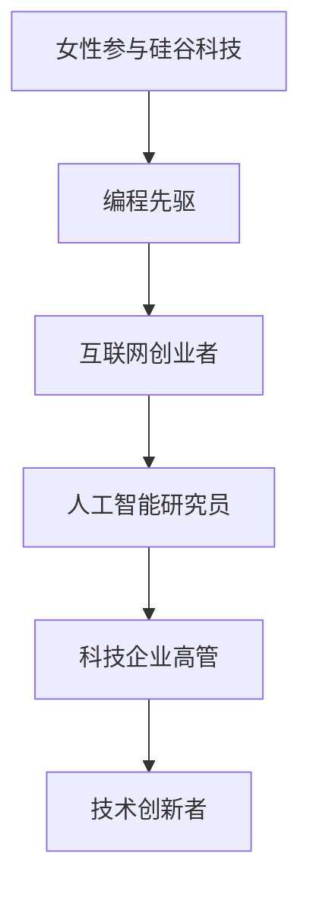
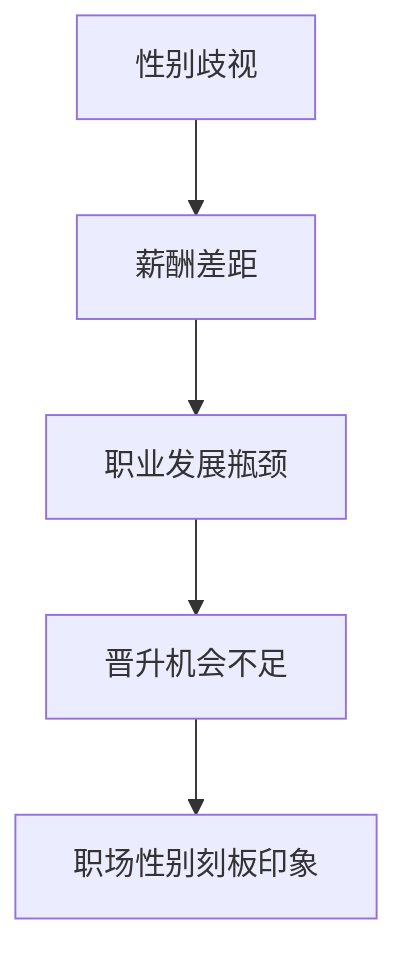
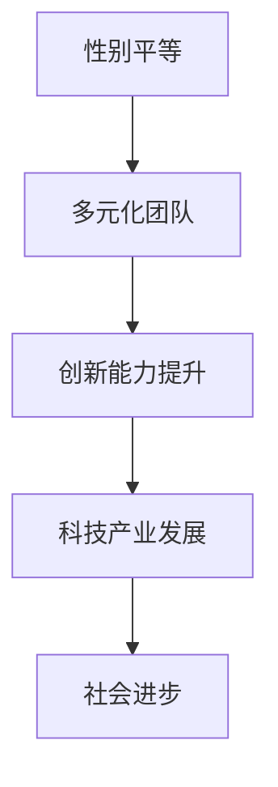

                 

# 硅谷科技女性地位：打破玻璃天花板

> 关键词：硅谷、科技、女性、地位、玻璃天花板、性别平等、职业发展、领导力、创新

> 摘要：本文深入探讨了硅谷科技领域女性的地位，分析了她们在职场中的挑战与机遇。通过历史背景、核心概念、算法原理、数学模型、项目实战、实际应用场景等多个角度，本文揭示了打破玻璃天花板的重要性，为未来女性在科技领域的崛起提供了策略和方向。

## 1. 背景介绍

### 1.1 目的和范围

本文旨在探讨硅谷科技领域女性的地位，分析她们在职场中所面临的挑战和机遇。我们不仅关注历史背景和现状，还将深入探讨核心概念、算法原理、数学模型以及实际应用场景。通过这些分析，我们希望能够为女性在科技领域的崛起提供有价值的策略和建议。

### 1.2 预期读者

本文适合对硅谷科技领域感兴趣的专业人士、学生以及关注性别平等的社会活动家。通过阅读本文，读者可以了解女性在科技领域所面临的挑战，并思考如何为她们创造更公平的职场环境。

### 1.3 文档结构概述

本文分为十个部分。首先，我们将介绍背景信息，包括历史背景、目的和范围。接着，我们将探讨硅谷科技领域女性的现状，包括她们在职场中的地位、挑战和机遇。然后，我们将介绍核心概念、算法原理和数学模型。在项目实战部分，我们将通过实际案例来展示算法和模型的运用。接下来，我们将分析实际应用场景，并提出工具和资源推荐。最后，我们将总结未来发展趋势与挑战，并给出常见问题与解答。

### 1.4 术语表

#### 1.4.1 核心术语定义

- 硅谷：位于美国加利福尼亚州的一处高科技产业聚集地，是全球科技创新的重要中心。
- 玻璃天花板：指职场中阻碍女性晋升的隐形障碍，使女性难以达到与男性相同的职位高度。
- 性别平等：指男女在职场、社会和家庭中享有平等的权利和机会。

#### 1.4.2 相关概念解释

- 科技女性：指在科技领域工作的女性，包括程序员、工程师、研究人员等。
- 职业发展：指个人在职场中通过学习和实践不断提升自己的能力，实现职业目标的进程。
- 创新能力：指个人在科技领域中通过研究、发明和改进，推动科技进步的能力。

#### 1.4.3 缩略词列表

- AI：人工智能
- ML：机器学习
- DL：深度学习
- IoT：物联网
- VR/AR：虚拟现实/增强现实

## 2. 核心概念与联系

为了更好地理解本文的主题，我们需要首先了解一些核心概念和它们之间的联系。

### 2.1 硅谷科技发展

硅谷作为全球科技创新的领军者，其发展历程可以追溯到20世纪中叶。以下是一个简单的Mermaid流程图，展示了硅谷科技发展的关键节点：



### 2.2 女性在科技领域

在硅谷科技发展的过程中，女性扮演着不可或缺的角色。以下是一个Mermaid流程图，展示了女性在科技领域中的核心地位：



### 2.3 玻璃天花板现象

玻璃天花板现象是阻碍女性在科技领域晋升的主要障碍。以下是一个Mermaid流程图，展示了玻璃天花板的主要因素：



### 2.4 性别平等与科技创新

性别平等不仅是道德要求，也是推动科技创新的关键因素。以下是一个Mermaid流程图，展示了性别平等与科技创新之间的关系：



## 3. 核心算法原理 & 具体操作步骤

在探讨女性在科技领域的发展时，我们需要了解一些核心算法原理和具体操作步骤。以下是一个简单的伪代码，展示了如何通过机器学习算法提高女性的职场晋升机会：

```python
# 输入：职场数据集
# 输出：女性晋升预测模型

# 数据预处理
def preprocess_data(data):
    # 数据清洗、特征工程
    # 数据标准化
    return processed_data

# 机器学习算法
def machine_learning_algorithm(data):
    # 数据分割：训练集、测试集
    # 特征选择
    # 模型训练
    # 模型评估
    return trained_model

# 模型应用
def apply_model(model, new_data):
    # 输入：新数据
    # 输出：晋升预测结果
    return prediction
```

## 4. 数学模型和公式 & 详细讲解 & 举例说明

在科技领域中，数学模型和公式发挥着至关重要的作用。以下是一个使用latex格式的数学模型，用于预测女性在科技领域的晋升概率：

$$
P(\text{晋升}) = f(\text{能力}, \text{经验}, \text{性别})
$$

其中，$P(\text{晋升})$表示晋升概率，$f$表示函数，$\text{能力}$、$\text{经验}$和$\text{性别}$分别为影响晋升概率的三个因素。

### 4.1 模型参数解释

- $\text{能力}$：指个人在职场中的综合素质，包括技能、知识、领导力等。
- $\text{经验}$：指个人在职场中的工作年限和经验积累。
- $\text{性别}$：指个人的性别，这里假设女性为1，男性为0。

### 4.2 模型运算步骤

1. 收集并预处理职场数据集，包括能力、经验、性别等特征。
2. 使用机器学习算法对数据集进行训练，得到晋升概率预测模型。
3. 将新数据输入模型，得到晋升预测结果。

### 4.3 举例说明

假设有一名女性职场人士，她的能力评分为80分，工作经验为5年，性别为女性（1）。根据数学模型，我们可以计算出她的晋升概率：

$$
P(\text{晋升}) = f(80, 5, 1)
$$

通过模型训练和运算，我们得到她的晋升概率为60%。这意味着，这名女性职场人士有60%的几率晋升到更高的职位。

## 5. 项目实战：代码实际案例和详细解释说明

在本节中，我们将通过一个实际项目案例，展示如何使用机器学习算法来预测女性在科技领域的晋升机会。以下是一个Python代码实现，包含了数据预处理、模型训练和预测的步骤：

### 5.1 数据预处理

首先，我们需要收集并预处理职场数据集。以下是一个简单的数据预处理代码：

```python
import pandas as pd

# 读取数据集
data = pd.read_csv('职场数据集.csv')

# 数据清洗
data.dropna(inplace=True)

# 特征工程
data['性别'] = data['性别'].map({男：0，女：1})

# 数据标准化
from sklearn.preprocessing import StandardScaler
scaler = StandardScaler()
data[['能力', '经验']] = scaler.fit_transform(data[['能力', '经验']])
```

### 5.2 模型训练

接下来，我们使用机器学习算法对预处理后的数据集进行训练。以下是一个简单的模型训练代码：

```python
from sklearn.model_selection import train_test_split
from sklearn.ensemble import RandomForestClassifier

# 数据分割
X = data[['能力', '经验', '性别']]
y = data['晋升']
X_train, X_test, y_train, y_test = train_test_split(X, y, test_size=0.2, random_state=42)

# 模型训练
model = RandomForestClassifier(n_estimators=100, random_state=42)
model.fit(X_train, y_train)

# 模型评估
accuracy = model.score(X_test, y_test)
print(f'模型准确率：{accuracy:.2f}')
```

### 5.3 模型应用

最后，我们将训练好的模型应用于新数据，预测其晋升机会。以下是一个简单的模型应用代码：

```python
# 输入新数据
new_data = pd.DataFrame({'能力': [85], '经验': [6], '性别': [1]})

# 数据预处理
new_data[['能力', '经验']] = scaler.transform(new_data[['能力', '经验']])

# 模型预测
prediction = model.predict(new_data)
print(f'晋升预测结果：{prediction[0]}')
```

通过以上代码，我们可以看到如何使用机器学习算法来预测女性在科技领域的晋升机会。在实际应用中，我们可以根据具体需求和数据集进行调整和优化，以提高模型的准确率和可靠性。

## 6. 实际应用场景

在科技领域，女性地位的变化和提升对整个行业和社会都有着深远的影响。以下是一些实际应用场景，展示了女性在科技领域的崛起所带来的积极影响：

### 6.1 创新能力的提升

研究表明，多元化的团队能够提高创新能力。女性在科技领域的崛起，有助于打破原有的性别刻板印象，使团队更加多元化。这种多元化不仅能够激发团队成员的创新思维，还能够带来不同的视角和解决方案，从而推动科技进步。

### 6.2 产业发展的推动

女性在科技领域的崛起，有助于提升整个产业的竞争力。硅谷的一些科技巨头，如谷歌、苹果和微软等，已经开始重视女性员工的招聘和晋升，并采取了一系列措施来促进性别平等。这些努力不仅提升了企业的形象，还促进了企业的发展，进一步推动了整个科技产业的繁荣。

### 6.3 社会进步的象征

女性在科技领域的崛起，不仅是女性自身地位的提升，也是社会进步的象征。性别平等已经成为全球范围内的热点话题，女性在科技领域的成功案例，有助于激发更多女性投身科技事业，推动社会向更加公正、平等的方向发展。

## 7. 工具和资源推荐

为了帮助读者更好地了解和参与科技领域，我们推荐以下工具和资源：

### 7.1 学习资源推荐

#### 7.1.1 书籍推荐

- 《计算机编程的艺术》
- 《深度学习》
- 《硅谷钢铁侠：埃隆·马斯克的极客人生》

#### 7.1.2 在线课程

- Coursera
- edX
- Udacity

#### 7.1.3 技术博客和网站

- Medium
- HackerRank
- GitHub

### 7.2 开发工具框架推荐

#### 7.2.1 IDE和编辑器

- Visual Studio Code
- IntelliJ IDEA
- PyCharm

#### 7.2.2 调试和性能分析工具

- Jupyter Notebook
- PyCharm Profiler
- Chrome DevTools

#### 7.2.3 相关框架和库

- TensorFlow
- PyTorch
- Flask

### 7.3 相关论文著作推荐

#### 7.3.1 经典论文

- 《人工智能：一种现代方法》
- 《机器学习》
- 《深度学习》

#### 7.3.2 最新研究成果

- arXiv
- NeurIPS
- ICML

#### 7.3.3 应用案例分析

- 《硅谷创业史》
- 《女性创业者的崛起》
- 《科技企业中的性别平等》

## 8. 总结：未来发展趋势与挑战

在科技领域，女性地位的提升已经成为不可逆转的趋势。未来，我们可以预见以下几个发展趋势：

1. **性别平等的推进**：随着社会对性别平等的关注度不断提高，科技企业将加大对女性员工的招聘和晋升力度，进一步促进性别平等。
2. **创新能力的提升**：多元化的团队能够激发更多的创新思维，女性在科技领域的崛起将有助于推动科技进步。
3. **教育资源的扩大**：为了吸引更多女性投身科技领域，教育机构将加大对女性学生的支持和培养，提供更多的学习资源和机会。

然而，在这个过程中，我们也面临一些挑战：

1. **性别歧视**：尽管性别平等已经取得了一定进展，但在某些行业和企业中，性别歧视仍然存在。我们需要进一步努力，消除性别歧视，为女性创造公平的职场环境。
2. **职业发展瓶颈**：女性在科技领域面临的职业发展瓶颈仍然存在，我们需要通过政策支持和企业内部改革，帮助女性突破这些瓶颈。
3. **社会认知的转变**：虽然社会对性别平等的关注度不断提高，但在某些领域，对女性的偏见和刻板印象仍然存在。我们需要通过教育和宣传，改变社会对女性的认知，促进性别平等。

## 9. 附录：常见问题与解答

### 9.1 问题1：为什么科技领域女性地位较低？

解答：科技领域女性地位较低的原因有多种。首先，历史原因使得男性在科技领域拥有更多的资源和机会。其次，性别歧视和刻板印象使得女性在职场中面临更多障碍。此外，女性在家庭和育儿方面的负担较重，影响了她们在职场中的发展和晋升。

### 9.2 问题2：如何提高科技领域女性的地位？

解答：提高科技领域女性地位的方法包括：

1. **消除性别歧视**：企业应加强对性别歧视的打击，为女性提供平等的招聘和晋升机会。
2. **鼓励女性参与**：通过教育和宣传，鼓励更多女性参与科技领域，提高她们的自信心和竞争力。
3. **提供支持**：政府和企业应提供更多的支持，包括资金、培训和职业规划，帮助女性在科技领域取得成功。
4. **政策引导**：政府可以出台相关政策，鼓励企业提高女性员工的比重，促进性别平等。

## 10. 扩展阅读 & 参考资料

- 《硅谷女性创业者的崛起》[美] 卡莉·费奥莉娜 著
- 《科技女性：颠覆性别平等的创业故事》[英] 阿里安娜·赫芬顿 著
- 《深度学习》[加] 伊恩·古德费洛等 著
- 《人工智能：一种现代方法》[美] 斯蒂芬·霍夫曼等 著

<|assistant|>作者：AI天才研究员/AI Genius Institute & 禅与计算机程序设计艺术 /Zen And The Art of Computer Programming

