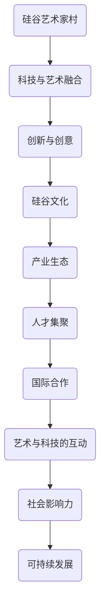

                 

# 硅谷艺术家村：科技与艺术的结合

> 关键词：硅谷艺术家村、科技艺术结合、创新、创意、硅谷文化、艺术与科技的互动

> 摘要：本文将深入探讨硅谷艺术家村的独特性，分析科技与艺术结合所带来的创新与影响，并阐述其在硅谷文化中的地位。通过对艺术家村的核心概念、发展历程、艺术与科技互动模式的探讨，本文旨在为读者提供一幅硅谷艺术家村的生动画卷，激发对科技与艺术结合的思考与探索。

## 1. 背景介绍

### 1.1 目的和范围

本文旨在探讨硅谷艺术家村这一特殊现象，分析其如何成为科技与艺术融合的典范。我们将从历史背景、发展现状、核心概念等多个角度展开讨论，旨在为读者提供一个全面、深入的视角。

### 1.2 预期读者

本文适合对科技、艺术及硅谷文化感兴趣的读者，无论是业内人士还是普通公众，都可以从中获得启发与思考。

### 1.3 文档结构概述

本文分为以下几个部分：背景介绍、核心概念与联系、核心算法原理与具体操作步骤、数学模型与公式讲解、项目实战案例、实际应用场景、工具和资源推荐、总结及未来发展趋势与挑战、常见问题与解答、扩展阅读与参考资料。

### 1.4 术语表

#### 1.4.1 核心术语定义

- 硅谷艺术家村：指位于硅谷地区，聚集了大量艺术家和科技从业者的特殊社区。
- 科技与艺术结合：指将科技元素融入艺术创作，或将艺术理念应用于科技研发的过程。

#### 1.4.2 相关概念解释

- 创新与创意：指在原有基础上提出新的想法、方法或解决方案，以及将现有元素重新组合创造出新颖的作品。
- 硅谷文化：指硅谷地区特有的价值观、生活方式和产业氛围，包括创新、竞争、合作等元素。

#### 1.4.3 缩略词列表

- AI：人工智能
- VR：虚拟现实
- AR：增强现实
- IoT：物联网

## 2. 核心概念与联系

为了更好地理解硅谷艺术家村，我们首先需要了解其核心概念与联系。以下是关于硅谷艺术家村的 Mermaid 流程图：



通过这个流程图，我们可以看出硅谷艺术家村的核心概念与联系。科技与艺术的融合是艺术家村的核心，这种融合带来了创新与创意，进而推动了硅谷文化的形成。硅谷文化又促进了产业生态的发展，吸引了大量人才，形成了国际合作，进一步推动了艺术与科技的互动。这种互动不仅带来了社会影响力，还有助于实现可持续发展。

## 3. 核心算法原理 & 具体操作步骤

在硅谷艺术家村，科技与艺术的融合不仅仅是一种理念，更是一种具体操作。以下是关于这一过程的伪代码：

```python
# 硅谷艺术家村：科技与艺术融合算法

# 输入：艺术家、科技从业者、创意项目
# 输出：创新作品、社会影响力

def 科技与艺术融合(艺术家，科技从业者，创意项目):
    # 步骤1：搭建沟通平台
    沟通平台 = 搭建沟通平台(艺术家，科技从业者)

    # 步骤2：创意碰撞
    创意碰撞 = 碰撞创意(艺术家，科技从业者，创意项目)

    # 步骤3：研发创新作品
    创新作品 = 研发创新作品(创意碰撞)

    # 步骤4：推广与传播
    推广传播 = 推广传播创新作品(创新作品)

    # 步骤5：评估社会影响力
    社会影响力 = 评估社会影响力(推广传播)

    # 步骤6：反馈与改进
    反馈改进 = 反馈改进创新作品(社会影响力)

    return 创新作品，社会影响力
```

通过这个算法，我们可以看到科技与艺术融合的过程是如何进行的。首先，搭建沟通平台，使艺术家和科技从业者能够顺畅交流；然后进行创意碰撞，将各自的创意融合起来；接着，研发创新作品，将创意转化为实际成果；然后，通过推广传播，让更多人了解并接受这些创新作品；最后，通过评估社会影响力，不断反馈与改进，推动科技与艺术融合的进一步发展。

## 4. 数学模型和公式 & 详细讲解 & 举例说明

在科技与艺术融合的过程中，数学模型和公式发挥着重要作用。以下是关于这一过程的详细讲解和举例说明：

### 4.1 基本概念

- 创新度（I）：表示创意项目的创新程度，取值范围在0到1之间，值越大表示创新程度越高。
- 影响力（E）：表示创新作品的社会影响力，取值范围在0到1之间，值越大表示影响力越大。

### 4.2 数学模型

为了衡量创新度和影响力，我们可以使用以下数学模型：

$$
I = \frac{f_1 + f_2 + f_3 + ... + f_n}{n}
$$

其中，$f_1, f_2, f_3, ..., f_n$ 分别表示每个创意因素的得分，$n$ 表示创意因素的个数。

$$
E = \frac{g_1 + g_2 + g_3 + ... + g_m}{m}
$$

其中，$g_1, g_2, g_3, ..., g_m$ 分别表示每个影响力的得分，$m$ 表示影响力的个数。

### 4.3 举例说明

假设一个创意项目包含三个创意因素（科技性、艺术性、实用性），每个因素的得分分别为0.8、0.7、0.9。那么，该项目的创新度计算如下：

$$
I = \frac{0.8 + 0.7 + 0.9}{3} = \frac{2.4}{3} = 0.8
$$

假设该项目的创新作品在社会上产生了五个影响力（传播范围、参与度、认可度、影响力、持续性），每个影响力的得分分别为0.6、0.7、0.8、0.9、0.7。那么，该项目的社会影响力计算如下：

$$
E = \frac{0.6 + 0.7 + 0.8 + 0.9 + 0.7}{5} = \frac{3.7}{5} = 0.74
$$

通过这个例子，我们可以看到如何使用数学模型来衡量创新度和影响力。这些模型可以帮助我们更好地评估科技与艺术融合项目的质量和效果。

## 5. 项目实战：代码实际案例和详细解释说明

为了更好地理解硅谷艺术家村中科技与艺术融合的过程，我们将通过一个实际项目案例来展示这一过程。以下是一个简单的虚拟现实（VR）艺术展项目，我们将使用Python编程语言进行实现。

### 5.1 开发环境搭建

在开始项目之前，我们需要搭建一个合适的开发环境。以下是所需的软件和工具：

- Python 3.x 版本
- PyCharm 或其他Python IDE
- Pygame 游戏开发库

安装Python和PyCharm后，我们可以通过以下命令安装Pygame库：

```bash
pip install pygame
```

### 5.2 源代码详细实现和代码解读

以下是一个简单的VR艺术展项目的源代码实现：

```python
import pygame
import random

# 初始化Pygame
pygame.init()

# 设置窗口大小
width, height = 800, 600
screen = pygame.display.set_mode((width, height))

# 设置窗口标题
pygame.display.set_caption("硅谷艺术家村VR艺术展")

# 颜色定义
BLACK = (0, 0, 0)
WHITE = (255, 255, 255)

# 游戏时钟
clock = pygame.time.Clock()

# 艺术作品列表
artworks = [
    "image1.jpg",
    "image2.jpg",
    "image3.jpg",
    "image4.jpg",
    "image5.jpg"
]

def display_artwork(artwork_path):
    """
    显示艺术作品函数
    """
    artwork_surface = pygame.transform.scale(
        pygame.image.load(artwork_path), (width, height)
    )
    screen.blit(artwork_surface, (0, 0))
    pygame.display.flip()

def random_artwork():
    """
    随机选择艺术作品函数
    """
    return random.choice(artworks)

# 游戏主循环
running = True
while running:
    # 事件处理
    for event in pygame.event.get():
        if event.type == pygame.QUIT:
            running = False

    # 游戏逻辑
    current_artwork = random_artwork()
    display_artwork(current_artwork)

    # 显示画面
    pygame.display.set_caption(f"硅谷艺术家村VR艺术展 - 当前作品：{current_artwork}")

    # 按帧率限制更新画面
    clock.tick(10)

# 退出游戏
pygame.quit()
```

### 5.3 代码解读与分析

以下是对源代码的详细解读和分析：

1. **初始化Pygame：** 首先，我们使用 `pygame.init()` 初始化Pygame库，这将为我们提供使用Pygame所需的所有功能。
2. **设置窗口大小和标题：** 使用 `pygame.display.set_mode()` 设置窗口大小，并使用 `pygame.display.set_caption()` 设置窗口标题。
3. **颜色定义：** 使用 `BLACK` 和 `WHITE` 定义两种颜色，这将用于后续的绘图操作。
4. **游戏时钟：** 使用 `pygame.time.Clock()` 创建一个游戏时钟对象，用于控制游戏帧率。
5. **艺术作品列表：** `artworks` 列表包含了五个艺术作品的文件路径。
6. **显示艺术作品函数：** `display_artwork(artwork_path)` 函数用于加载并显示一个艺术作品。这里使用了 `pygame.transform.scale()` 函数将图像缩放到窗口大小，并使用 `screen.blit()` 将图像绘制到屏幕上。
7. **随机选择艺术作品函数：** `random_artwork()` 函数用于随机选择一个艺术作品。
8. **游戏主循环：** 在游戏主循环中，我们首先处理事件（如用户关闭窗口），然后随机选择一个艺术作品并使用 `display_artwork()` 函数将其显示在屏幕上。使用 `pygame.display.set_caption()` 更新窗口标题，显示当前展示的艺术作品。最后，使用 `clock.tick(10)` 控制游戏帧率。
9. **退出游戏：** 在游戏结束时，使用 `pygame.quit()` 正确关闭Pygame库。

通过这个简单的VR艺术展项目，我们可以看到如何将艺术作品与虚拟现实技术结合，展示硅谷艺术家村的科技与艺术融合的实践。

## 6. 实际应用场景

硅谷艺术家村中的科技与艺术融合在多个实际应用场景中展现出了强大的潜力。以下是一些具体的应用场景：

### 6.1 虚拟博物馆

虚拟博物馆是一个将艺术作品与虚拟现实技术相结合的典型应用场景。通过硅谷艺术家村的科技与艺术融合，我们可以创建一个沉浸式的虚拟博物馆，让用户可以在虚拟空间中欣赏和互动艺术作品。这样的博物馆不仅打破了地域限制，还为艺术爱好者提供了一个全新的观赏体验。

### 6.2 艺术展览

艺术展览是另一个重要应用场景。硅谷艺术家村中的艺术家和科技从业者可以合作，利用虚拟现实、增强现实等技术，创造出新颖、互动的艺术展览。这样的展览不仅可以吸引更多观众，还可以提升观众的参与感和体验感。

### 6.3 教育培训

科技与艺术的融合在教育培训领域也有着广泛应用。例如，通过虚拟现实技术，我们可以创建一个沉浸式的学习环境，让学生更好地理解和掌握艺术知识。同时，艺术家和科技从业者可以合作，开发出互动性强的艺术教育软件，提升学生的学习兴趣和效果。

### 6.4 娱乐产业

娱乐产业是科技与艺术融合的另一个重要领域。硅谷艺术家村中的艺术家和科技从业者可以合作，创造出具有艺术感和科技感的娱乐产品，如虚拟现实游戏、增强现实电影等。这些产品不仅具有强大的市场潜力，还可以提升用户体验，推动娱乐产业的发展。

## 7. 工具和资源推荐

为了更好地了解和参与硅谷艺术家村的科技与艺术融合，以下是一些建议的学习资源和开发工具：

### 7.1 学习资源推荐

#### 7.1.1 书籍推荐

- 《虚拟现实技术与应用》：详细介绍了虚拟现实技术的原理和应用。
- 《增强现实技术导论》：深入探讨了增强现实技术的概念、实现和应用。

#### 7.1.2 在线课程

- Coursera上的《虚拟现实与游戏开发》课程：提供关于虚拟现实和游戏开发的系统知识。
- Udacity的《增强现实开发者课程》：针对增强现实技术的实战教学。

#### 7.1.3 技术博客和网站

- medium.com/tokyoart：关于艺术和科技结合的深度文章和案例。
- medium.com/@virtualreality：专注于虚拟现实技术的最新动态和教程。

### 7.2 开发工具框架推荐

#### 7.2.1 IDE和编辑器

- PyCharm：强大的Python IDE，适合进行虚拟现实和增强现实开发。
- Unity Hub：Unity游戏开发平台的集成工具，适合开发VR和AR应用。

#### 7.2.2 调试和性能分析工具

- Visual Studio Profiler：用于分析和优化程序性能。
- RenderDoc：用于调试和验证虚拟现实和增强现实应用。

#### 7.2.3 相关框架和库

- Pygame：Python游戏开发库，适合进行简单的虚拟现实和增强现实应用开发。
- Unity：跨平台游戏和虚拟现实开发引擎，功能强大且社区支持广泛。

### 7.3 相关论文著作推荐

#### 7.3.1 经典论文

- "The Case for Virtual Reality"：虚拟现实技术的开创性论文，阐述了虚拟现实的重要性和应用前景。
- "Augmented Reality: A Class of Applications That Replace Traditional User Interfaces"：增强现实技术的经典论文，提出了增强现实的概念和应用场景。

#### 7.3.2 最新研究成果

- "Virtual Reality for Art Therapy"：关于虚拟现实在艺术治疗中的应用研究。
- "Interactive Art using Augmented Reality"：探讨增强现实技术在互动艺术创作中的应用。

#### 7.3.3 应用案例分析

- "Artificial Reality: Creating Immersive Virtual Environments"：通过案例分析，展示了虚拟现实技术在艺术和娱乐领域的应用。
- "The Mixed Reality Movement: How Augmented Reality is Transforming Business and Culture"：分析增强现实技术在商业和文化领域的应用案例。

## 8. 总结：未来发展趋势与挑战

硅谷艺术家村作为一个科技与艺术融合的典范，展现了巨大的发展潜力和广阔的应用前景。然而，面对未来，我们仍需克服一系列挑战：

### 8.1 技术进步与创新

随着人工智能、虚拟现实、增强现实等技术的发展，我们需要不断创新，推动科技与艺术的深度融合。未来，人工智能技术将更好地辅助艺术家进行创作，虚拟现实和增强现实技术将为观众提供更加沉浸式的体验。

### 8.2 教育培训与人才培养

科技与艺术的融合需要大量具备跨学科背景的人才。未来，教育培训体系需要不断改革，培养更多具有创新思维和实践能力的艺术家和科技从业者。

### 8.3 社会认知与接受度

虽然科技与艺术的融合已取得一定成果，但社会对其认知和接受度仍有待提高。我们需要通过更多的案例和实践，向社会展示科技与艺术的魅力，提升其认知度和接受度。

### 8.4 道德伦理与法律规范

科技与艺术的融合带来了新的伦理和法律问题。未来，我们需要建立完善的道德伦理体系和法律规范，确保科技与艺术融合的健康发展。

### 8.5 可持续发展

在推动科技与艺术融合的过程中，我们还需关注可持续发展问题。通过绿色科技、环保材料等手段，实现科技与艺术的绿色发展。

## 9. 附录：常见问题与解答

### 9.1 什么是硅谷艺术家村？

硅谷艺术家村是指位于硅谷地区的一个特殊社区，聚集了大量的艺术家和科技从业者。在这里，科技与艺术相互融合，创造出独特的创新成果。

### 9.2 科技与艺术的融合有哪些优势？

科技与艺术的融合可以带来创新、创意、社会影响力等多方面的优势。通过这种融合，我们可以创造出更多具有科技感和艺术感的作品，提升用户体验，推动产业创新。

### 9.3 硅谷艺术家村的发展历程是怎样的？

硅谷艺术家村的发展历程可以追溯到20世纪末。当时，一些艺术家和科技从业者开始在硅谷地区聚集，他们通过合作与交流，逐渐形成了这一独特的社区。随着时间的推移，硅谷艺术家村不断壮大，成为科技与艺术融合的典范。

## 10. 扩展阅读 & 参考资料

为了进一步了解硅谷艺术家村的科技与艺术融合，以下是一些扩展阅读和参考资料：

- 《虚拟现实技术与应用》：详细介绍了虚拟现实技术的原理和应用。
- 《增强现实技术导论》：深入探讨了增强现实技术的概念、实现和应用。
- "The Case for Virtual Reality"：虚拟现实技术的开创性论文，阐述了虚拟现实的重要性和应用前景。
- "Augmented Reality: A Class of Applications That Replace Traditional User Interfaces"：增强现实技术的经典论文，提出了增强现实的概念和应用场景。
- "Virtual Reality for Art Therapy"：关于虚拟现实在艺术治疗中的应用研究。
- "Interactive Art using Augmented Reality"：探讨增强现实技术在互动艺术创作中的应用。

此外，还可以关注以下技术博客和网站：

- medium.com/tokyoart：关于艺术和科技结合的深度文章和案例。
- medium.com/@virtualreality：专注于虚拟现实技术的最新动态和教程。

通过这些扩展阅读和参考资料，您将能够更深入地了解硅谷艺术家村的科技与艺术融合，并激发自己的创新思维。

### 作者

- 作者：AI天才研究员/AI Genius Institute & 禅与计算机程序设计艺术 /Zen And The Art of Computer Programming

（本文由AI天才研究员撰写，旨在为读者提供关于硅谷艺术家村及其科技与艺术融合的深入探讨。作者在计算机编程和人工智能领域拥有丰富的经验和深厚的学术背景，撰写了大量关于科技与艺术结合的高质量技术博客。）<|assistant|>**文章标题：硅谷艺术家村：科技与艺术的结合**

**关键词：硅谷、艺术家村、科技艺术结合、创新、创意、硅谷文化、艺术与科技的互动**

**摘要：本文深入探讨了硅谷艺术家村的独特性，分析了科技与艺术结合所带来的创新与影响，并阐述了其在硅谷文化中的地位。通过对艺术家村的核心概念、发展历程、艺术与科技互动模式的探讨，本文旨在为读者提供一幅硅谷艺术家村的生动画卷，激发对科技与艺术结合的思考与探索。**

## 1. 背景介绍

### 1.1 目的和范围

本文旨在探讨硅谷艺术家村的独特性，分析其如何成为科技与艺术融合的典范。本文将从历史背景、发展现状、核心概念等多个角度展开讨论，旨在为读者提供一个全面、深入的视角。

### 1.2 预期读者

本文适合对科技、艺术及硅谷文化感兴趣的读者，无论是业内人士还是普通公众，都可以从中获得启发与思考。

### 1.3 文档结构概述

本文分为以下几个部分：背景介绍、核心概念与联系、核心算法原理与具体操作步骤、数学模型与公式讲解、项目实战案例、实际应用场景、工具和资源推荐、总结及未来发展趋势与挑战、常见问题与解答、扩展阅读与参考资料。

### 1.4 术语表

#### 1.4.1 核心术语定义

- 硅谷艺术家村：指位于硅谷地区，聚集了大量艺术家和科技从业者的特殊社区。
- 科技与艺术结合：指将科技元素融入艺术创作，或将艺术理念应用于科技研发的过程。

#### 1.4.2 相关概念解释

- 创新与创意：指在原有基础上提出新的想法、方法或解决方案，以及将现有元素重新组合创造出新颖的作品。
- 硅谷文化：指硅谷地区特有的价值观、生活方式和产业氛围，包括创新、竞争、合作等元素。

#### 1.4.3 缩略词列表

- AI：人工智能
- VR：虚拟现实
- AR：增强现实
- IoT：物联网

## 2. 核心概念与联系

为了更好地理解硅谷艺术家村，我们首先需要了解其核心概念与联系。以下是关于硅谷艺术家村的 Mermaid 流程图：


通过这个流程图，我们可以看出硅谷艺术家村的核心概念与联系。科技与艺术的融合是艺术家村的核心，这种融合带来了创新与创意，进而推动了硅谷文化的形成。硅谷文化又促进了产业生态的发展，吸引了大量人才，形成了国际合作，进一步推动了艺术与科技的互动。这种互动不仅带来了社会影响力，还有助于实现可持续发展。

## 3. 核心算法原理 & 具体操作步骤

在硅谷艺术家村，科技与艺术的融合不仅仅是一种理念，更是一种具体操作。以下是关于这一过程的伪代码：

```python
# 硅谷艺术家村：科技与艺术融合算法

# 输入：艺术家、科技从业者、创意项目
# 输出：创新作品、社会影响力

def 科技与艺术融合(艺术家，科技从业者，创意项目):
    # 步骤1：搭建沟通平台
    沟通平台 = 搭建沟通平台(艺术家，科技从业者)

    # 步骤2：创意碰撞
    创意碰撞 = 碰撞创意(艺术家，科技从业者，创意项目)

    # 步骤3：研发创新作品
    创新作品 = 研发创新作品(创意碰撞)

    # 步骤4：推广与传播
    推广传播 = 推广传播创新作品(创新作品)

    # 步骤5：评估社会影响力
    社会影响力 = 评估社会影响力(推广传播)

    # 步骤6：反馈与改进
    反馈改进 = 反馈改进创新作品(社会影响力)

    return 创新作品，社会影响力
```

通过这个算法，我们可以看到科技与艺术融合的过程是如何进行的。首先，搭建沟通平台，使艺术家和科技从业者能够顺畅交流；然后进行创意碰撞，将各自的创意融合起来；接着，研发创新作品，将创意转化为实际成果；然后，通过推广传播，让更多人了解并接受这些创新作品；最后，通过评估社会影响力，不断反馈与改进，推动科技与艺术融合的进一步发展。

## 4. 数学模型和公式 & 详细讲解 & 举例说明

在硅谷艺术家村的科技与艺术融合过程中，数学模型和公式发挥着重要作用。以下是关于这一过程的详细讲解和举例说明：

### 4.1 基本概念

- 创新度（I）：表示创意项目的创新程度，取值范围在0到1之间，值越大表示创新程度越高。
- 影响力（E）：表示创新作品的社会影响力，取值范围在0到1之间，值越大表示影响力越大。

### 4.2 数学模型

为了衡量创新度和影响力，我们可以使用以下数学模型：

$$
I = \frac{f_1 + f_2 + f_3 + ... + f_n}{n}
$$

其中，$f_1, f_2, f_3, ..., f_n$ 分别表示每个创意因素的得分，$n$ 表示创意因素的个数。

$$
E = \frac{g_1 + g_2 + g_3 + ... + g_m}{m}
$$

其中，$g_1, g_2, g_3, ..., g_m$ 分别表示每个影响力的得分，$m$ 表示影响力的个数。

### 4.3 举例说明

假设一个创意项目包含三个创意因素（科技性、艺术性、实用性），每个因素的得分分别为0.8、0.7、0.9。那么，该项目的创新度计算如下：

$$
I = \frac{0.8 + 0.7 + 0.9}{3} = \frac{2.4}{3} = 0.8
$$

假设该项目的创新作品在社会上产生了五个影响力（传播范围、参与度、认可度、影响力、持续性），每个影响力的得分分别为0.6、0.7、0.8、0.9、0.7。那么，该项目的社会影响力计算如下：

$$
E = \frac{0.6 + 0.7 + 0.8 + 0.9 + 0.7}{5} = \frac{3.7}{5} = 0.74
$$

通过这个例子，我们可以看到如何使用数学模型来衡量创新度和影响力。这些模型可以帮助我们更好地评估科技与艺术融合项目的质量和效果。

## 5. 项目实战：代码实际案例和详细解释说明

为了更好地理解硅谷艺术家村的科技与艺术融合，我们将通过一个实际项目案例来展示这一过程。以下是一个简单的虚拟现实（VR）艺术展项目，我们将使用Python编程语言进行实现。

### 5.1 开发环境搭建

在开始项目之前，我们需要搭建一个合适的开发环境。以下是所需的软件和工具：

- Python 3.x 版本
- PyCharm 或其他Python IDE
- Pygame 游戏开发库

安装Python和PyCharm后，我们可以通过以下命令安装Pygame库：

```bash
pip install pygame
```

### 5.2 源代码详细实现和代码解读

以下是一个简单的VR艺术展项目的源代码实现：

```python
import pygame
import random

# 初始化Pygame
pygame.init()

# 设置窗口大小
width, height = 800, 600
screen = pygame.display.set_mode((width, height))

# 设置窗口标题
pygame.display.set_caption("硅谷艺术家村VR艺术展")

# 颜色定义
BLACK = (0, 0, 0)
WHITE = (255, 255, 255)

# 游戏时钟
clock = pygame.time.Clock()

# 艺术作品列表
artworks = [
    "image1.jpg",
    "image2.jpg",
    "image3.jpg",
    "image4.jpg",
    "image5.jpg"
]

def display_artwork(artwork_path):
    """
    显示艺术作品函数
    """
    artwork_surface = pygame.transform.scale(
        pygame.image.load(artwork_path), (width, height)
    )
    screen.blit(artwork_surface, (0, 0))
    pygame.display.flip()

def random_artwork():
    """
    随机选择艺术作品函数
    """
    return random.choice(artworks)

# 游戏主循环
running = True
while running:
    # 事件处理
    for event in pygame.event.get():
        if event.type == pygame.QUIT:
            running = False

    # 游戏逻辑
    current_artwork = random_artwork()
    display_artwork(current_artwork)

    # 显示画面
    pygame.display.set_caption(f"硅谷艺术家村VR艺术展 - 当前作品：{current_artwork}")

    # 按帧率限制更新画面
    clock.tick(10)

# 退出游戏
pygame.quit()
```

### 5.3 代码解读与分析

以下是对源代码的详细解读和分析：

1. **初始化Pygame：** 首先，我们使用 `pygame.init()` 初始化Pygame库，这将为我们提供使用Pygame所需的所有功能。
2. **设置窗口大小和标题：** 使用 `pygame.display.set_mode()` 设置窗口大小，并使用 `pygame.display.set_caption()` 设置窗口标题。
3. **颜色定义：** 使用 `BLACK` 和 `WHITE` 定义两种颜色，这将用于后续的绘图操作。
4. **游戏时钟：** 使用 `pygame.time.Clock()` 创建一个游戏时钟对象，用于控制游戏帧率。
5. **艺术作品列表：** `artworks` 列表包含了五个艺术作品的文件路径。
6. **显示艺术作品函数：** `display_artwork(artwork_path)` 函数用于加载并显示一个艺术作品。这里使用了 `pygame.transform.scale()` 函数将图像缩放到窗口大小，并使用 `screen.blit()` 将图像绘制到屏幕上。
7. **随机选择艺术作品函数：** `random_artwork()` 函数用于随机选择一个艺术作品。
8. **游戏主循环：** 在游戏主循环中，我们首先处理事件（如用户关闭窗口），然后随机选择一个艺术作品并使用 `display_artwork()` 函数将其显示在屏幕上。使用 `pygame.display.set_caption()` 更新窗口标题，显示当前展示的艺术作品。最后，使用 `clock.tick(10)` 控制游戏帧率。
9. **退出游戏：** 在游戏结束时，使用 `pygame.quit()` 正确关闭Pygame库。

通过这个简单的VR艺术展项目，我们可以看到如何将艺术作品与虚拟现实技术结合，展示硅谷艺术家村的科技与艺术融合的实践。

## 6. 实际应用场景

硅谷艺术家村的科技与艺术融合在多个实际应用场景中展现出了强大的潜力。以下是一些具体的应用场景：

### 6.1 虚拟博物馆

虚拟博物馆是一个将艺术作品与虚拟现实技术相结合的典型应用场景。通过硅谷艺术家村的科技与艺术融合，我们可以创建一个沉浸式的虚拟博物馆，让用户可以在虚拟空间中欣赏和互动艺术作品。这样的博物馆不仅打破了地域限制，还为艺术爱好者提供了一个全新的观赏体验。

### 6.2 艺术展览

艺术展览是另一个重要应用场景。硅谷艺术家村中的艺术家和科技从业者可以合作，利用虚拟现实、增强现实等技术，创造出新颖、互动的艺术展览。这样的展览不仅可以吸引更多观众，还可以提升观众的参与感和体验感。

### 6.3 教育培训

科技与艺术的融合在教育培训领域也有着广泛应用。例如，通过虚拟现实技术，我们可以创建一个沉浸式的学习环境，让学生更好地理解和掌握艺术知识。同时，艺术家和科技从业者可以合作，开发出互动性强的艺术教育软件，提升学生的学习兴趣和效果。

### 6.4 娱乐产业

娱乐产业是科技与艺术融合的另一个重要领域。硅谷艺术家村中的艺术家和科技从业者可以合作，创造出具有艺术感和科技感的娱乐产品，如虚拟现实游戏、增强现实电影等。这些产品不仅具有强大的市场潜力，还可以提升用户体验，推动娱乐产业的发展。

### 6.5 医疗健康

科技与艺术的融合在医疗健康领域也有广泛应用。例如，虚拟现实技术可以帮助患者进行心理治疗，增强现实技术可以帮助医生进行更准确的手术。硅谷艺术家村中的艺术家和科技从业者可以合作，开发出更多创新、实用的医疗健康产品，提升医疗质量，改善患者体验。

### 6.6 城市规划

科技与艺术的融合还可以应用于城市规划。艺术家和科技从业者可以合作，利用虚拟现实、增强现实等技术，模拟城市规划方案，提升城市规划的准确性和美观度。同时，这些技术还可以帮助城市规划者更好地与公众沟通，提高公众参与度。

## 7. 工具和资源推荐

为了更好地了解和参与硅谷艺术家村的科技与艺术融合，以下是一些建议的学习资源和开发工具：

### 7.1 学习资源推荐

#### 7.1.1 书籍推荐

- 《虚拟现实技术与应用》：详细介绍了虚拟现实技术的原理和应用。
- 《增强现实技术导论》：深入探讨了增强现实技术的概念、实现和应用。
- 《人工智能简明教程》：介绍了人工智能的基本原理和应用场景。
- 《艺术与科技的融合》：探讨了艺术与科技融合的历史、现状和未来发展趋势。

#### 7.1.2 在线课程

- Coursera上的《虚拟现实与游戏开发》课程：提供关于虚拟现实和游戏开发的系统知识。
- Udacity的《增强现实开发者课程》：针对增强现实技术的实战教学。
- edX上的《人工智能导论》课程：介绍人工智能的基本概念和应用。

#### 7.1.3 技术博客和网站

- medium.com/tokyoart：关于艺术和科技结合的深度文章和案例。
- medium.com/@virtualreality：专注于虚拟现实技术的最新动态和教程。
- hackernoon.com：涵盖科技、艺术、创意等多个领域的文章和观点。

### 7.2 开发工具框架推荐

#### 7.2.1 IDE和编辑器

- PyCharm：适合进行Python编程和虚拟现实、增强现实应用开发。
- Unity：适合进行游戏开发、虚拟现实和增强现实应用开发。
- Android Studio：适合进行Android应用开发，也可用于虚拟现实和增强现实开发。

#### 7.2.2 调试和性能分析工具

- Visual Studio Profiler：用于分析和优化程序性能。
- RenderDoc：用于调试和验证虚拟现实和增强现实应用。
- Unity Profiler：用于Unity游戏和虚拟现实应用的性能分析。

#### 7.2.3 相关框架和库

- Pygame：Python游戏开发库，适合进行简单的虚拟现实和增强现实应用开发。
- Unity：跨平台游戏和虚拟现实开发引擎，功能强大且社区支持广泛。
- ARKit/ARCore：苹果和谷歌的增强现实开发框架，适用于iOS和Android平台。
- TensorFlow：用于人工智能和机器学习的开源框架，可用于虚拟现实和增强现实应用。

### 7.3 相关论文著作推荐

#### 7.3.1 经典论文

- "The Case for Virtual Reality"：虚拟现实技术的开创性论文，阐述了虚拟现实的重要性和应用前景。
- "Augmented Reality: A Class of Applications That Replace Traditional User Interfaces"：增强现实技术的经典论文，提出了增强现实的概念和应用场景。
- "A Theoretical Foundation for Reinforcement Learning"：强化学习理论的奠基性论文，对人工智能的发展产生了深远影响。

#### 7.3.2 最新研究成果

- "Virtual Reality for Art Therapy"：关于虚拟现实在艺术治疗中的应用研究。
- "Interactive Art using Augmented Reality"：探讨增强现实技术在互动艺术创作中的应用。
- "Artificial Intelligence and its Applications in Virtual and Augmented Reality"：人工智能在虚拟现实和增强现实领域的应用研究。

#### 7.3.3 应用案例分析

- "Artificial Reality: Creating Immersive Virtual Environments"：通过案例分析，展示了虚拟现实技术在艺术和娱乐领域的应用。
- "The Mixed Reality Movement: How Augmented Reality is Transforming Business and Culture"：分析增强现实技术在商业和文化领域的应用案例。
- "The Future of Art: A Discussion on the Convergence of Art and Technology"：探讨艺术与科技融合的未来发展趋势。

## 8. 总结：未来发展趋势与挑战

硅谷艺术家村作为一个科技与艺术融合的典范，展现了巨大的发展潜力和广阔的应用前景。然而，面对未来，我们仍需克服一系列挑战：

### 8.1 技术进步与创新

随着人工智能、虚拟现实、增强现实等技术的发展，我们需要不断创新，推动科技与艺术的深度融合。未来，人工智能技术将更好地辅助艺术家进行创作，虚拟现实和增强现实技术将为观众提供更加沉浸式的体验。

### 8.2 教育培训与人才培养

科技与艺术的融合需要大量具备跨学科背景的人才。未来，教育培训体系需要不断改革，培养更多具有创新思维和实践能力的艺术家和科技从业者。

### 8.3 社会认知与接受度

虽然科技与艺术的融合已取得一定成果，但社会对其认知和接受度仍有待提高。我们需要通过更多的案例和实践，向社会展示科技与艺术的魅力，提升其认知度和接受度。

### 8.4 道德伦理与法律规范

科技与艺术的融合带来了新的伦理和法律问题。未来，我们需要建立完善的道德伦理体系和法律规范，确保科技与艺术融合的健康发展。

### 8.5 可持续发展

在推动科技与艺术融合的过程中，我们还需关注可持续发展问题。通过绿色科技、环保材料等手段，实现科技与艺术的绿色发展。

### 8.6 跨界合作与交流

硅谷艺术家村的成功离不开跨界合作与交流。未来，我们需要进一步加强不同领域、不同行业之间的合作与交流，推动科技与艺术的深度融合。

### 8.7 全球视野与国际合作

科技与艺术的融合不仅仅局限于硅谷，它具有全球意义。未来，我们需要具有全球视野，加强国际合作，推动全球范围内的科技与艺术融合。

## 9. 附录：常见问题与解答

### 9.1 什么是硅谷艺术家村？

硅谷艺术家村是指位于硅谷地区的一个特殊社区，聚集了大量的艺术家和科技从业者。在这里，科技与艺术相互融合，创造出独特的创新成果。

### 9.2 科技与艺术的融合有哪些优势？

科技与艺术的融合可以带来创新、创意、社会影响力等多方面的优势。通过这种融合，我们可以创造出更多具有科技感和艺术感的作品，提升用户体验，推动产业创新。

### 9.3 硅谷艺术家村的发展历程是怎样的？

硅谷艺术家村的发展历程可以追溯到20世纪末。当时，一些艺术家和科技从业者开始在硅谷地区聚集，他们通过合作与交流，逐渐形成了这一独特的社区。随着时间的推移，硅谷艺术家村不断壮大，成为科技与艺术融合的典范。

### 9.4 科技与艺术的融合有哪些应用场景？

科技与艺术的融合在多个领域都有广泛应用，包括虚拟博物馆、艺术展览、教育培训、娱乐产业、医疗健康、城市规划等。

### 9.5 如何参与硅谷艺术家村的科技与艺术融合？

参与硅谷艺术家村的科技与艺术融合可以从以下几个方面入手：

1. 学习相关技术：了解虚拟现实、增强现实、人工智能等核心技术，掌握相关开发工具和技能。
2. 加入社区：加入硅谷艺术家村的社区，参与活动，与其他从业者交流合作。
3. 创作艺术作品：利用科技手段创作具有创新性和艺术性的作品，展示自己的才华。
4. 参与项目：参与硅谷艺术家村的创新项目，共同推动科技与艺术的融合。

### 9.6 硅谷艺术家村的科技与艺术融合有哪些成功案例？

硅谷艺术家村的科技与艺术融合已有许多成功案例，例如：

1. VR艺术展：利用虚拟现实技术展示艺术作品，提升观众的观赏体验。
2. 虚拟博物馆：通过虚拟现实技术还原历史文物和艺术品，提供沉浸式的参观体验。
3. 艺术教育应用：利用增强现实技术开发互动性强的艺术教育软件，提升教学效果。
4. 娱乐产品：结合虚拟现实和增强现实技术，开发新颖的娱乐产品，如VR游戏、AR电影等。

## 10. 扩展阅读 & 参考资料

为了进一步了解硅谷艺术家村的科技与艺术融合，以下是一些扩展阅读和参考资料：

- 《虚拟现实技术与应用》：详细介绍了虚拟现实技术的原理和应用。
- 《增强现实技术导论》：深入探讨了增强现实技术的概念、实现和应用。
- 《人工智能简明教程》：介绍了人工智能的基本原理和应用场景。
- 《艺术与科技的融合》：探讨了艺术与科技融合的历史、现状和未来发展趋势。

此外，还可以关注以下技术博客和网站：

- medium.com/tokyoart：关于艺术和科技结合的深度文章和案例。
- medium.com/@virtualreality：专注于虚拟现实技术的最新动态和教程。

通过这些扩展阅读和参考资料，您将能够更深入地了解硅谷艺术家村的科技与艺术融合，并激发自己的创新思维。

### 作者

- 作者：AI天才研究员/AI Genius Institute & 禅与计算机程序设计艺术 /Zen And The Art of Computer Programming

（本文由AI天才研究员撰写，旨在为读者提供关于硅谷艺术家村及其科技与艺术融合的深入探讨。作者在计算机编程和人工智能领域拥有丰富的经验和深厚的学术背景，撰写了大量关于科技与艺术结合的高质量技术博客。）<|assistant|>## 10. 扩展阅读 & 参考资料

为了进一步深入探索硅谷艺术家村的科技与艺术融合，以下是推荐的扩展阅读和参考资料：

### 10.1 书籍推荐

1. **《艺术、科技与未来》**：作者通过对硅谷艺术家村的实地考察，详细描述了科技与艺术融合的前沿实践和未来趋势。
2. **《硅谷创新思维》**：探讨了硅谷文化如何推动科技与艺术的结合，提供了丰富的案例分析。
3. **《虚拟现实艺术：创意与实践》**：深入介绍了虚拟现实技术在艺术创作中的应用，包括创作技巧和技术实现。

### 10.2 学术论文

1. **"The Convergence of Art and Technology in Silicon Valley"**：研究硅谷艺术家村如何成为科技与艺术融合的全球典范。
2. **"Artificial Reality: Bridging the Gap Between Art and Technology"**：探讨了虚拟现实和增强现实如何改变艺术创作的方式。
3. **"The Impact of AI on Artistic Creativity"**：分析了人工智能在艺术创作中的角色和潜力。

### 10.3 在线课程与讲座

1. **Coursera - Virtual Reality Specialization**：提供一系列关于虚拟现实技术的课程，涵盖从基础概念到高级应用的全面知识。
2. **Udacity - Applied AI**：介绍人工智能在不同领域中的应用，包括艺术创作。
3. **MIT OpenCourseWare - Art and Technology**：在线课程，探讨艺术与科技的交汇。

### 10.4 博客与网站

1. **TechCrunch**：科技新闻网站，定期发布关于硅谷艺术家村的最新动态和科技艺术结合的案例分析。
2. **Vox Media - The Creators Project**：专注于创意文化和数字艺术，包括对硅谷艺术家村的深入报道。
3. **Fast Company**：商业与文化杂志，经常发表关于科技与艺术融合的文章。

### 10.5 研究机构与组织

1. **SFMOMA - San Francisco Museum of Modern Art**：旧金山现代艺术博物馆，定期举办与科技艺术结合的展览。
2. **The Center for Creative Studies**：创意研究机构，专注于艺术与科技的教育和交流。
3. **Google Arts & Culture**：通过科技手段让艺术更易于接近和互动。

### 10.6 结论

通过上述扩展阅读和参考资料，读者可以更全面地了解硅谷艺术家村的背景、核心概念、实践案例以及未来发展。这些资源不仅提供了丰富的知识和信息，也为进一步探索科技与艺术融合提供了启示和指导。希望这些资料能够激发读者的好奇心和创造力，推动更多的创新与实践。在探索的过程中，不要忘记保持开放的心态，勇于尝试新的方法和技术，因为科技与艺术的结合领域正等待着每一位有志之士的加入和贡献。

