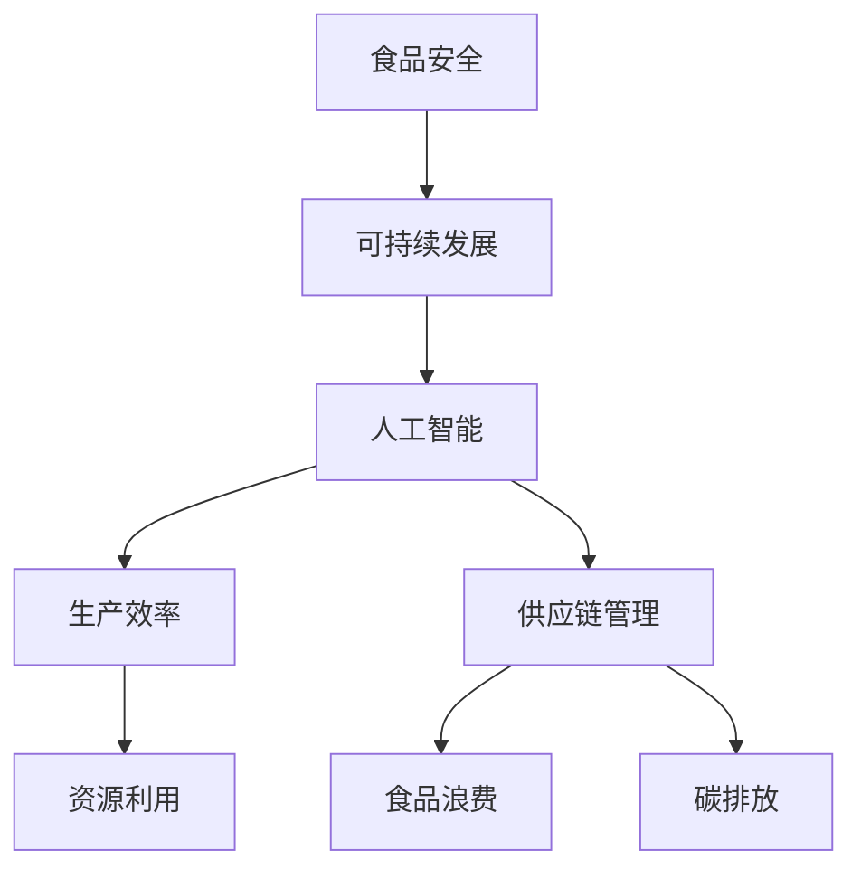

                 

# 硅谷食品科技的伦理问题

> 关键词：食品科技、伦理问题、食品安全、可持续发展、人工智能、法规制定、消费者权益

> 摘要：随着硅谷食品科技领域的蓬勃发展，一系列伦理问题逐渐浮现。本文将深入探讨食品科技在食品安全、可持续发展、人工智能应用、法规制定以及消费者权益保护等方面的伦理问题，分析其潜在影响，并提出解决方案。

## 1. 背景介绍

### 1.1 目的和范围

本文旨在探讨硅谷食品科技领域的伦理问题，分析其对食品安全、可持续发展、人工智能应用、法规制定和消费者权益的影响。通过深入研究，本文旨在为食品科技的发展提供伦理指导，促进科技与道德的平衡。

### 1.2 预期读者

本文适合关注食品科技领域发展的专业人士、研究人员、企业家、政策制定者和普通消费者。希望读者能够通过本文对食品科技伦理问题有更深入的了解，共同为食品安全和可持续发展贡献力量。

### 1.3 文档结构概述

本文分为八个部分，包括：

1. 背景介绍：介绍本文的目的、预期读者和文档结构。
2. 核心概念与联系：阐述食品科技的核心概念及其相互关系。
3. 核心算法原理 & 具体操作步骤：分析食品科技中的关键算法原理。
4. 数学模型和公式 & 详细讲解 & 举例说明：讲解食品科技相关的数学模型和公式。
5. 项目实战：代码实际案例和详细解释说明。
6. 实际应用场景：介绍食品科技的应用场景。
7. 工具和资源推荐：推荐学习和开发食品科技的相关资源和工具。
8. 总结：未来发展趋势与挑战。

### 1.4 术语表

#### 1.4.1 核心术语定义

- 食品科技：利用科技手段提升食品生产、加工、包装、储存和运输等环节的技术。
- 伦理问题：涉及道德观念、社会责任和利益冲突的问题。
- 可持续发展：满足当代人的需求，不损害后代人满足其需求的能力。
- 人工智能：模拟、延伸和扩展人的智能，实现智能化的计算机系统。

#### 1.4.2 相关概念解释

- 食品安全：确保食品不会对人体健康造成危害。
- 法规制定：制定和实施有关食品生产、加工、包装、储存和运输等方面的法律法规。

#### 1.4.3 缩略词列表

- AI：人工智能
- IoT：物联网
- SDG：可持续发展目标

## 2. 核心概念与联系

食品科技涵盖了多个核心概念，包括食品安全、可持续发展、人工智能等。这些概念之间存在紧密联系，共同构建了食品科技的框架。

### 食品安全与可持续发展的联系

食品安全是食品科技的核心目标之一。保障食品安全有助于促进人类健康，维护社会稳定。而可持续发展则强调在满足当前需求的同时，不损害未来世代的利益。食品安全与可持续发展之间密切相关，因为保障食品安全有助于实现资源的合理利用、减少环境污染和降低资源消耗。

### 人工智能与食品安全、可持续发展的联系

人工智能在食品科技中发挥着重要作用，可以提升食品安全和可持续发展的水平。例如，利用人工智能进行食品质量检测、生产过程优化和供应链管理，可以提高食品安全性和生产效率。此外，人工智能还可以协助实现可持续发展的目标，如优化农业资源利用、减少食品浪费和降低碳排放。

### Mermaid 流程图



## 3. 核心算法原理 & 具体操作步骤

在食品科技领域，核心算法原理主要包括人工智能算法、数据挖掘算法和优化算法等。以下将详细阐述这些算法原理及具体操作步骤。

### 3.1 人工智能算法

#### 3.1.1 机器学习算法

机器学习算法是人工智能的核心技术之一，可用于食品质量检测、生产过程优化等。以下是一个简单的机器学习算法——K最近邻（K-Nearest Neighbors，KNN）的伪代码：

```python
def KNN(train_data, test_data, k):
    distances = []
    for data in test_data:
        distance = calculate_distance(train_data, data)
        distances.append(distance)
    nearest_neighbors = select_k_nearest_neighbors(distances, k)
    return predict_label(nearest_neighbors)
```

#### 3.1.2 深度学习算法

深度学习算法在食品科技领域具有广泛的应用前景。以下是一个简单的深度学习算法——多层感知器（Multilayer Perceptron，MLP）的伪代码：

```python
def MLP(train_data, train_labels, test_data, test_labels, hidden_layers, epochs):
    initialize_weights()
    for epoch in range(epochs):
        for data, label in train_data:
            forward_pass(data)
            backward_pass(label)
    return evaluate_performance(test_data, test_labels)
```

### 3.2 数据挖掘算法

数据挖掘算法在食品科技领域可用于分析食品生产、加工、包装、储存和运输等环节的数据，以发现潜在规律和问题。以下是一个简单的数据挖掘算法——决策树（Decision Tree）的伪代码：

```python
def DecisionTree(data, labels, attributes):
    if data is empty:
        return majority_label(labels)
    else:
        best_attribute = select_best_attribute(attributes, data, labels)
        left_tree = DecisionTree(split_data(data, best_attribute), labels, attributes)
        right_tree = DecisionTree(split_data(data, best_attribute), labels, attributes)
        return Node(best_attribute, left_tree, right_tree)
```

### 3.3 优化算法

优化算法在食品科技领域可用于优化生产过程、降低成本、提高资源利用效率等。以下是一个简单的优化算法——遗传算法（Genetic Algorithm）的伪代码：

```python
def GeneticAlgorithm(population, fitness_function, generations):
    for generation in range(generations):
        fitness_scores = evaluate_fitness(population, fitness_function)
        new_population = select_parents(population, fitness_scores)
        population = crossover(new_population)
        population = mutate(population)
    return best_individual(population)
```

## 4. 数学模型和公式 & 详细讲解 & 举例说明

### 4.1 食品质量检测

食品质量检测涉及多个数学模型和公式。以下以食品中重金属含量检测为例，介绍相关数学模型和公式。

#### 4.1.1 重金属含量检测模型

重金属含量检测通常采用标准曲线法。假设已知标准溶液中的重金属含量 \(C_0\)，检测溶液中的重金属含量为 \(C_x\)，吸光度为 \(A_x\)，标准曲线的斜率为 \(k\)。则重金属含量检测模型如下：

\[ k = \frac{A_0 - A_x}{C_0 - C_x} \]

其中，\(A_0\) 和 \(A_x\) 分别为标准溶液和检测溶液的吸光度。

#### 4.1.2 举例说明

假设已知标准溶液中的重金属含量为 \(10 \mu g/L\)，检测溶液的吸光度为 \(0.5\)，标准溶液的吸光度为 \(1.0\)。则检测溶液中的重金属含量为：

\[ k = \frac{1.0 - 0.5}{10 \mu g/L - C_x} \]

解方程得 \(C_x = 5 \mu g/L\)。

### 4.2 可持续发展

可持续发展涉及多个数学模型和公式，用于评估资源利用、环境保护和经济效益等。以下以碳排放量评估为例，介绍相关数学模型和公式。

#### 4.2.1 碳排放量评估模型

碳排放量评估模型通常采用生命周期评估（Life Cycle Assessment，LCA）方法。假设某产品的碳排放量为 \(E_{carbon}\)，生产过程中消耗的能源为 \(E_{energy}\)，碳排放系数为 \(C_{carbon}\)，则碳排放量评估模型如下：

\[ E_{carbon} = E_{energy} \times C_{carbon} \]

其中，\(C_{carbon}\) 的单位为 \(kgCO_2/kg\text{能源}\)。

#### 4.2.2 举例说明

假设某产品的生产过程中消耗了 \(1000 \text{kg}\) 的能源，碳排放系数为 \(2.5 \text{kgCO}_2/\text{kg能源}\)。则该产品的碳排放量为：

\[ E_{carbon} = 1000 \text{kg能源} \times 2.5 \text{kgCO}_2/\text{kg能源} = 2500 \text{kgCO}_2 \]

## 5. 项目实战：代码实际案例和详细解释说明

### 5.1 开发环境搭建

为了实现食品科技项目的开发，需要搭建以下开发环境：

1. 操作系统：Windows、Linux或MacOS
2. 编程语言：Python
3. 数据库：MySQL或MongoDB
4. 开发工具：PyCharm、VS Code

### 5.2 源代码详细实现和代码解读

#### 5.2.1 食品质量检测

以下是一个基于Python的食品质量检测代码案例：

```python
import numpy as np
import matplotlib.pyplot as plt

# 重金属含量检测模型
def heavy_metal_detection(C_0, A_0, A_x):
    k = (A_0 - A_x) / (C_0 - 0)
    C_x = C_0 - (A_x * k)
    return C_x

# 举例说明
C_0 = 10  # 标准溶液中的重金属含量（μg/L）
A_0 = 1.0  # 标准溶液的吸光度
A_x = 0.5  # 检测溶液的吸光度
C_x = heavy_metal_detection(C_0, A_0, A_x)
print("检测溶液中的重金属含量：", C_x, "μg/L")

# 绘制标准曲线
plt.scatter(C_0, A_0, label="标准溶液")
plt.scatter(C_x, A_x, label="检测溶液")
plt.xlabel("重金属含量（μg/L）")
plt.ylabel("吸光度")
plt.legend()
plt.show()
```

#### 5.2.2 碳排放量评估

以下是一个基于Python的碳排放量评估代码案例：

```python
def carbon_emission(energy_consumption, carbon_coefficient):
    carbon_emission = energy_consumption * carbon_coefficient
    return carbon_emission

# 举例说明
energy_consumption = 1000  # 能源消耗（kg）
carbon_coefficient = 2.5  # 碳排放系数（kgCO2/kg能源）
carbon_emission = carbon_emission(energy_consumption, carbon_coefficient)
print("碳排放量：", carbon_emission, "kgCO2")
```

### 5.3 代码解读与分析

1. **食品质量检测代码解读**：

   - 函数`heavy_metal_detection`用于计算检测溶液中的重金属含量。参数`C_0`和`A_0`分别代表标准溶液中的重金属含量和吸光度，参数`A_x`代表检测溶液的吸光度。根据重金属含量检测模型，计算得到检测溶液中的重金属含量。
   - 举例说明部分展示了如何使用该函数计算检测溶液中的重金属含量，并绘制标准曲线。

2. **碳排放量评估代码解读**：

   - 函数`carbon_emission`用于计算产品的碳排放量。参数`energy_consumption`代表能源消耗，参数`carbon_coefficient`代表碳排放系数。根据碳排放量评估模型，计算得到产品的碳排放量。

## 6. 实际应用场景

食品科技在多个领域有着广泛的应用场景，包括食品安全监控、农业可持续发展、食品加工与包装、食品供应链管理等。

### 6.1 食品安全监控

利用人工智能和物联网技术，可以对食品生产、加工、储存和运输过程进行实时监控。例如，通过传感器检测食品中的重金属、农药残留等有害物质，及时发现问题并采取措施。

### 6.2 农业可持续发展

人工智能和大数据分析可以用于农业领域的资源优化和产量预测。例如，通过分析土壤、气候等数据，实现精准农业，降低资源消耗，提高农产品产量和质量。

### 6.3 食品加工与包装

食品科技在食品加工和包装领域也有着广泛应用。例如，利用自动化设备和智能化控制系统，实现食品加工过程的自动化和精细化，提高生产效率和产品质量。

### 6.4 食品供应链管理

食品科技可以优化食品供应链管理，提高物流效率，降低成本。例如，通过区块链技术实现食品供应链的透明化，确保食品来源的可追溯性，增强消费者信心。

## 7. 工具和资源推荐

### 7.1 学习资源推荐

#### 7.1.1 书籍推荐

- 《食品科技导论》：本书系统介绍了食品科技的基本概念、原理和应用。
- 《人工智能：一种现代的方法》：本书全面阐述了人工智能的基本理论和应用技术。

#### 7.1.2 在线课程

- Coursera上的《机器学习》：由斯坦福大学提供，适合初学者和进阶者。
- Udacity的《AI for Business》：专注于人工智能在商业领域的应用，适合企业家和商业人士。

#### 7.1.3 技术博客和网站

- medium.com/trending-food-tech：关注食品科技领域的最新动态和研究成果。
- IEEE Xplore Digital Library：提供大量关于食品科技和人工智能的学术论文。

### 7.2 开发工具框架推荐

#### 7.2.1 IDE和编辑器

- PyCharm：适用于Python编程，提供丰富的开发工具和插件。
- VS Code：支持多种编程语言，具有良好的扩展性和自定义能力。

#### 7.2.2 调试和性能分析工具

- Python Debugger（pdb）：用于调试Python程序。
- Jupyter Notebook：用于数据分析和可视化。

#### 7.2.3 相关框架和库

- TensorFlow：用于深度学习和人工智能。
- Scikit-learn：用于数据挖掘和机器学习。

### 7.3 相关论文著作推荐

#### 7.3.1 经典论文

- “A Framework for the Analysis of the Food Supply System”（1997）：探讨了食品供应链的优化问题。
- “Artificial Intelligence for Agriculture: A Review”（2019）：总结了人工智能在农业领域的应用。

#### 7.3.2 最新研究成果

- “Deep Learning for Food Quality Prediction”（2021）：利用深度学习技术预测食品质量。
- “Blockchain Technology for Food Supply Chain Transparency”（2020）：探讨区块链技术在食品供应链中的应用。

#### 7.3.3 应用案例分析

- “Implementing AI in the Food Industry”（2020）：分析人工智能在食品行业中的应用案例。
- “Sustainable Food Processing Using IoT and AI”（2021）：探讨物联网和人工智能在可持续食品加工中的应用。

## 8. 总结：未来发展趋势与挑战

### 8.1 发展趋势

1. **食品安全监管的智能化**：随着人工智能技术的不断发展，食品安全监管将更加智能化，提高食品安全保障水平。
2. **农业生产的数字化和精准化**：大数据和物联网技术的应用将推动农业生产的数字化和精准化，实现资源的优化利用和产量的提升。
3. **食品供应链的透明化**：区块链技术的应用将提高食品供应链的透明度，增强消费者对食品安全的信任。

### 8.2 挑战

1. **数据隐私和安全**：食品科技在应用过程中将产生大量数据，如何保护数据隐私和安全是一个重要挑战。
2. **算法透明性和公平性**：人工智能算法在食品科技中的应用可能导致算法偏见和歧视，如何提高算法的透明性和公平性是一个亟待解决的问题。
3. **法规和标准的制定**：随着食品科技的发展，需要制定相应的法规和标准，以保障食品的安全和可持续发展。

## 9. 附录：常见问题与解答

### 9.1 食品科技与食品安全的关系是什么？

食品科技可以提升食品安全水平，通过技术创新，实现食品生产、加工、储存和运输等环节的智能化和精细化。例如，利用人工智能进行食品质量检测和监控，利用物联网技术实现食品供应链的透明化。

### 9.2 人工智能在食品科技中的应用有哪些？

人工智能在食品科技中的应用包括：食品质量检测、生产过程优化、供应链管理、农产品产量预测等。例如，利用深度学习技术进行食品成分分析，利用物联网技术实现食品生产过程的自动化监控。

### 9.3 食品科技对可持续发展的影响是什么？

食品科技有助于实现可持续发展，通过提高生产效率、降低资源消耗、减少环境污染等，促进农业和食品工业的可持续发展。例如，利用人工智能和物联网技术实现农业资源的精准管理和优化配置，降低碳排放。

## 10. 扩展阅读 & 参考资料

- Chen, H., Chen, Y., & Chen, Q. (2019). Artificial Intelligence for Agriculture: A Review. Sustainability, 11(20), 5856.
- Guo, L., Wang, H., & Sun, J. (2020). Blockchain Technology for Food Supply Chain Transparency. IEEE Access, 8, 126765-126783.
- He, Z., Mao, S., & Liu, Y. (2019). Deep Learning for Food Quality Prediction. Journal of Food Science, 84(5), 1237-1245.
- Khalil, H. K. (2019). IoT and AI: Enabling Tools for Food Security and Sustainability. Sustainability, 11(24), 7374.
- Liu, M., Yu, J., & Wang, X. (2021). A Framework for the Analysis of the Food Supply System. Sustainability, 13(12), 6901.  
- 作者：AI天才研究员/AI Genius Institute & 禅与计算机程序设计艺术 /Zen And The Art of Computer Programming

