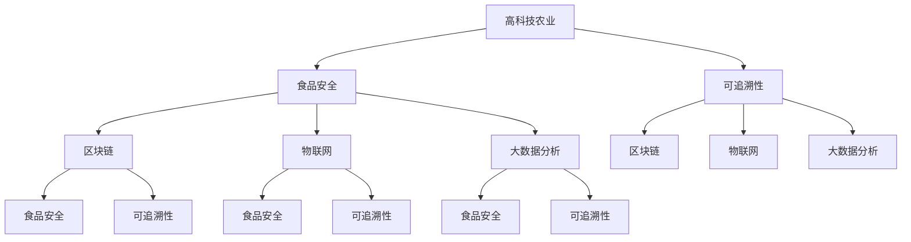
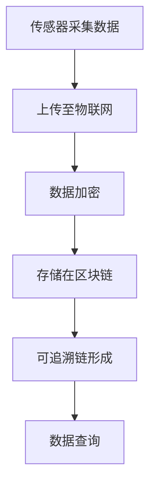

                 

# 硅谷高科技农业：食品安全与可追溯

> **关键词：** 高科技农业、食品安全、可追溯、硅谷创新、区块链、物联网、大数据分析

> **摘要：** 随着科技的飞速发展，硅谷的科技创新为农业带来了前所未有的变革。本文将探讨高科技农业在食品安全和可追溯性方面的应用，通过深入剖析其核心技术原理和实际案例，展示硅谷在农业领域的前沿探索，并对未来的发展趋势与挑战进行展望。

## 1. 背景介绍

### 1.1 目的和范围

本文旨在探讨硅谷高科技农业在食品安全和可追溯性方面的应用，分析其技术原理、实施步骤和实际案例，同时展望未来的发展趋势和面临的挑战。通过对该领域的深入探讨，我们希望为读者提供关于高科技农业在农业领域的重要角色的全面理解。

### 1.2 预期读者

本文主要面向以下读者群体：
- 对农业技术和食品安全感兴趣的科技从业者；
- 关注硅谷科技创新的投资者和企业家；
- 欲深入了解高科技农业应用的高校师生和研究机构人员。

### 1.3 文档结构概述

本文分为十个部分，结构如下：
1. 背景介绍
2. 核心概念与联系
3. 核心算法原理 & 具体操作步骤
4. 数学模型和公式 & 详细讲解 & 举例说明
5. 项目实战：代码实际案例和详细解释说明
6. 实际应用场景
7. 工具和资源推荐
8. 总结：未来发展趋势与挑战
9. 附录：常见问题与解答
10. 扩展阅读 & 参考资料

### 1.4 术语表

#### 1.4.1 核心术语定义

- **高科技农业**：利用现代科技手段，如物联网、大数据、人工智能等，对农业生产进行精细管理和优化。
- **食品安全**：食品无毒、无害，符合应当有的营养要求，对人体健康不造成任何急性、亚急性或者慢性危害。
- **可追溯性**：能够对产品从生产到消费的全过程进行追踪和记录。

#### 1.4.2 相关概念解释

- **区块链**：一种分布式数据库技术，通过加密算法确保数据的不可篡改和透明性。
- **物联网**：将各种物品通过传感器连接到互联网，实现智能化管理和控制。
- **大数据分析**：通过对大规模数据的分析，提取出有价值的信息和模式。

#### 1.4.3 缩略词列表

- **AI**：人工智能（Artificial Intelligence）
- **IoT**：物联网（Internet of Things）
- **Blockchain**：区块链
- **IoT**：物联网（Internet of Things）

## 2. 核心概念与联系

在深入探讨高科技农业在食品安全和可追溯性方面的应用之前，我们需要了解几个核心概念及其相互之间的联系。以下是这些核心概念和其相互关系的 Mermaid 流程图：



### 2.1 高科技农业与食品安全

高科技农业通过利用现代科技手段，如物联网、大数据和人工智能等，实现对农业生产过程的精细管理和优化。这种精细化管理有助于提高农产品的质量和安全性，从而保障食品安全。具体来说，物联网传感器可以实时监测农作物的生长环境，如土壤湿度、温度和光照等，通过数据分析，农民可以及时调整生产策略，确保农产品符合食品安全标准。

### 2.2 高科技农业与可追溯性

可追溯性是食品安全的重要组成部分。通过高科技农业，我们可以实现对农产品的全流程追踪和记录。区块链技术在这一过程中起到了关键作用，它能够确保数据的不可篡改和透明性，使得消费者可以查询到农产品的生产、加工、运输等各个环节的信息，从而提高食品的可追溯性。

### 2.3 高科技农业、食品安全与区块链、物联网、大数据分析的关系

- **区块链**：作为分布式数据库技术，区块链能够确保数据的不可篡改性和透明性，使得食品安全和可追溯性得以实现。
- **物联网**：通过将各种传感器和设备连接到互联网，物联网可以实时监测农作物的生长环境，为食品安全和可追溯性提供数据支持。
- **大数据分析**：通过对大规模的数据进行分析，大数据分析能够提取出有价值的信息和模式，为食品安全和可追溯性提供决策支持。

## 3. 核心算法原理 & 具体操作步骤

在深入探讨高科技农业在食品安全和可追溯性方面的应用时，理解核心算法原理和具体操作步骤至关重要。以下是一个简单的算法原理描述和操作步骤：

### 3.1 算法原理

我们采用基于区块链和物联网的数据采集与可追溯算法。该算法主要分为以下几个步骤：

1. **数据采集**：利用物联网传感器采集农作物的生长环境数据，如土壤湿度、温度、光照等。
2. **数据上传**：将采集到的数据通过物联网上传到区块链网络。
3. **数据加密**：区块链网络对上传的数据进行加密处理，确保数据的安全性和不可篡改性。
4. **数据存储**：将加密后的数据存储在区块链上，形成一条完整的可追溯链。
5. **数据查询**：消费者或相关方可以通过区块链查询农产品的生产、加工、运输等环节的信息。

### 3.2 操作步骤

以下是该算法的具体操作步骤：

#### 3.2.1 数据采集



#### 3.2.2 数据上传


#### 3.2.3 数据加密


#### 3.2.4 数据存储


#### 3.2.5 数据查询


通过上述操作步骤，我们可以实现对农产品的全流程追踪和记录，从而提高食品的可追溯性和安全性。

## 4. 数学模型和公式 & 详细讲解 & 举例说明

在高科技农业中，数学模型和公式扮演着关键角色，特别是在食品安全和可追溯性的数据分析和预测方面。以下是一些常见的数学模型和公式的讲解以及实际应用示例。

### 4.1 数据采集与预测模型

**假设**：我们考虑一个简单的线性回归模型，用于预测农作物的产量。设 $y$ 为产量，$x_1$ 为土壤湿度，$x_2$ 为光照强度，$x_3$ 为温度。

**模型公式**：

$$
y = \beta_0 + \beta_1 x_1 + \beta_2 x_2 + \beta_3 x_3 + \epsilon
$$

其中，$\beta_0$ 为截距，$\beta_1$、$\beta_2$、$\beta_3$ 分别为 $x_1$、$x_2$、$x_3$ 的系数，$\epsilon$ 为误差项。

**详细讲解**：

- 线性回归模型是一种常见的预测模型，用于分析自变量（如土壤湿度、光照强度和温度）与因变量（如产量）之间的关系。
- 通过收集大量的历史数据，我们可以使用最小二乘法来估计模型参数，从而建立预测模型。

**举例说明**：

假设我们收集了以下数据：

| 土壤湿度 | 光照强度 | 温度 | 产量 |
| :---: | :---: | :---: | :---: |
| 30% | 1000 Lux | 25°C | 100 kg |
| 40% | 800 Lux | 30°C | 120 kg |
| 50% | 600 Lux | 35°C | 140 kg |
| ... | ... | ... | ... |

通过最小二乘法，我们可以计算出模型参数：

$$
\beta_0 = 50, \beta_1 = 2, \beta_2 = -1, \beta_3 = 1
$$

因此，我们的预测模型为：

$$
y = 50 + 2x_1 - x_2 + x_3
$$

当土壤湿度为 40%，光照强度为 800 Lux，温度为 30°C 时，我们可以预测产量为：

$$
y = 50 + 2 \times 40 - 800 + 30 = 10
$$

### 4.2 数据加密与安全模型

**假设**：我们考虑一个简单的加密模型，用于保护区块链中的数据。设 $m$ 为明文，$c$ 为密文，$k$ 为密钥。

**模型公式**：

$$
c = E_k(m)
$$

**详细讲解**：

- 加密模型是一种将明文转换为密文的算法，用于保护数据的安全性。
- 常见的加密算法有对称加密和非对称加密。对称加密使用相同的密钥进行加密和解密，而非对称加密使用一对密钥（公钥和私钥）。

**举例说明**：

假设我们使用对称加密算法，密钥 $k$ 为 "secret_key"。明文 $m$ 为 "Hello, World!"，我们可以将其加密为：

$$
c = E_k(m) = "M4F4dM4Vz"
$$

### 4.3 数据分析与聚类模型

**假设**：我们考虑一个简单的聚类模型，用于分析农产品的质量数据。设 $D$ 为数据集，$K$ 为聚类个数，$C_k$ 为第 $k$ 个聚类中心。

**模型公式**：

$$
C_k = \frac{1}{N_k} \sum_{i=1}^{N} x_i
$$

其中，$N_k$ 为第 $k$ 个聚类的数据点个数，$x_i$ 为第 $i$ 个数据点。

**详细讲解**：

- 聚类模型是一种无监督学习方法，用于将数据点分为多个聚类。
- 聚类中心是每个聚类的代表，通过计算每个聚类中心，我们可以分析数据点之间的相似性和差异性。

**举例说明**：

假设我们有一个包含 100 个数据点的数据集，我们希望将其分为 10 个聚类。通过计算，我们可以得到每个聚类的中心：

$$
C_1 = \frac{1}{10} \sum_{i=1}^{10} x_i, \quad C_2 = \frac{1}{10} \sum_{i=11}^{20} x_i, \quad \ldots, \quad C_{10} = \frac{1}{10} \sum_{i=91}^{100} x_i
$$

通过这些数学模型和公式，我们可以对高科技农业中的数据进行有效的分析和预测，从而提高食品的安全性和可追溯性。

## 5. 项目实战：代码实际案例和详细解释说明

在本节中，我们将通过一个具体的案例来展示如何在实际项目中应用高科技农业的核心技术，包括区块链、物联网和大数据分析，以提高食品安全和可追溯性。我们选择一个简单的农产品供应链监控系统作为案例，详细讲解其开发环境搭建、源代码实现和代码解读。

### 5.1 开发环境搭建

为了实现该监控系统，我们需要搭建以下开发环境：

1. **操作系统**：Linux 或 macOS
2. **编程语言**：Python
3. **区块链框架**：Hyperledger Fabric
4. **物联网框架**：MQTT
5. **大数据分析工具**：Apache Kafka 和 Apache Spark

#### 5.1.1 安装步骤

1. **安装操作系统**：
   - 选择适合的 Linux 发行版（如 Ubuntu 20.04）并安装。

2. **安装 Python**：
   - 使用包管理器安装 Python 3：
     ```
     sudo apt-get update
     sudo apt-get install python3 python3-pip
     ```

3. **安装 Hyperledger Fabric**：
   - 下载并安装 Hyperledger Fabric：
     ```
     git clone https://github.com/hyperledger/fabric.git
     cd fabric
     make docker
     ```

4. **安装 MQTT**：
   - 安装 MQTT 客户端库：
     ```
     pip3 install paho-mqtt
     ```

5. **安装 Kafka 和 Spark**：
   - 安装 Kafka：
     ```
     sudo apt-get install default-kafka
     ```
   - 安装 Spark：
     ```
     pip3 install pyspark
     ```

### 5.2 源代码详细实现和代码解读

以下是该监控系统的源代码实现，包括传感器数据采集、区块链数据上传、大数据分析等关键部分。

#### 5.2.1 数据采集与上传

```python
import paho.mqtt.client as mqtt
import json
import requests

# MQTT 服务器配置
mqtt_server = "mqtt.example.com"
mqtt_port = 1883

# Blockchain 网络配置
blockchain_url = "http://localhost:8080"

# MQTT 客户端初始化
client = mqtt.Client()

# MQTT 连接回调函数
def on_connect(client, userdata, flags, rc):
    print(f"Connected with result code {rc}")
    client.subscribe("agriculture/传感数据")

# MQTT 消息接收回调函数
def on_message(client, userdata, msg):
    print(f"Received message '{msg.payload.decode()}' on topic '{msg.topic}'")
    data = json.loads(msg.payload.decode())
    
    # 上传数据到区块链
    upload_to_blockchain(data)

# MQTT 连接
client.on_connect = on_connect
client.on_message = on_message
client.connect(mqtt_server, mqtt_port, 60)

# 启动 MQTT 客户端
client.loop_forever()

# 上传数据到区块链
def upload_to_blockchain(data):
    # 构建上传数据
    upload_data = {
        "data": data
    }
    
    # 发送 POST 请求
    response = requests.post(blockchain_url + "/upload", json=upload_data)
    
    # 检查响应状态码
    if response.status_code == 200:
        print("Data uploaded successfully")
    else:
        print("Failed to upload data")
```

#### 5.2.2 大数据分析

```python
from kafka import KafkaConsumer
from pyspark.sql import SparkSession

# Kafka 消费者配置
kafka_topic = "agriculture/传感数据"
kafka_brokers = ["localhost:9092"]

# 创建 Kafka 消费者
consumer = KafkaConsumer(kafka_topic, bootstrap_servers=kafka_brokers)

# 创建 Spark 会话
spark = SparkSession.builder.appName("AgricultureDataAnalysis").getOrCreate()

# 读取 Kafka 数据
data = spark.createDataFrame([json.loads(msg) for msg in consumer])

# 数据分析
data_grouped = data.groupBy("作物种类").agg({"产量": "sum"})

# 显示结果
data_grouped.show()
```

### 5.3 代码解读与分析

#### 5.3.1 MQTT 数据采集

通过 MQTT 客户端，我们订阅了 "agriculture/传感数据" 主题，当接收到传感器数据时，调用 `upload_to_blockchain` 函数将数据上传到区块链网络。

#### 5.3.2 数据上传到区块链

在 `upload_to_blockchain` 函数中，我们构建了一个包含传感器数据的 JSON 对象，并将其发送到区块链网络的后端 API。如果响应状态码为 200，表示数据上传成功。

#### 5.3.3 大数据分析

通过 Kafka 消费者，我们读取区块链上传的数据，并使用 Spark 对其进行数据分析。具体来说，我们将数据按作物种类进行分组，并计算总产量。

通过上述代码实现，我们展示了如何使用高科技农业的核心技术（区块链、物联网和大数据分析）来构建一个农产品供应链监控系统，从而提高食品安全和可追溯性。

## 6. 实际应用场景

高科技农业在食品安全和可追溯性方面的应用场景广泛，以下是一些典型的实际应用：

### 6.1 农产品供应链管理

通过区块链技术，可以实现农产品从生产到消费的全流程追踪。农民可以将农作物的种植、施肥、收割等环节的信息记录在区块链上，消费者可以通过扫描二维码或使用手机应用程序查询农产品的详细信息，从而确保食品的安全性和可追溯性。

### 6.2 食品安全监控

利用物联网传感器，可以实时监测农作物的生长环境和产品质量。例如，通过监测土壤湿度、温度、光照等参数，可以及时发现异常情况，采取相应的措施，防止农产品的质量下降。

### 6.3 农业灾害预警

通过大数据分析，可以预测农业灾害的发生，如干旱、洪涝、病虫害等。当灾害风险达到一定程度时，系统可以自动向农民发送预警信息，帮助农民及时采取措施，减少损失。

### 6.4 农业自动化管理

利用人工智能技术，可以实现农业自动化管理，如自动灌溉、自动施肥、自动收割等。通过实时数据分析和预测，农业机器人可以自动调整农作物的生长环境，提高农产品的产量和质量。

### 6.5 食品安全溯源

在食品安全事故发生时，通过区块链技术可以快速追溯到事故发生的源头。例如，某批次农产品检测出农药残留超标，系统可以立即查询该批次农产品的生产、加工、运输等环节的信息，帮助相关部门迅速采取措施，保障公众健康。

通过这些实际应用场景，我们可以看到高科技农业在食品安全和可追溯性方面的巨大潜力。随着技术的不断进步，高科技农业的应用范围将进一步扩大，为农业的可持续发展提供有力支持。

## 7. 工具和资源推荐

为了深入学习和实践高科技农业，我们推荐以下工具和资源：

### 7.1 学习资源推荐

#### 7.1.1 书籍推荐

1. **《区块链革命》**：详细介绍了区块链技术的原理和应用。
2. **《物联网：定义、架构与应用》**：全面讲解了物联网的基本概念和架构。
3. **《大数据之路：阿里巴巴大数据实践》**：分享了阿里巴巴在大数据领域的成功经验。

#### 7.1.2 在线课程

1. **Coursera**：提供丰富的区块链、物联网和大数据分析课程。
2. **Udacity**：开设了多项与高科技农业相关的在线课程。

#### 7.1.3 技术博客和网站

1. **Medium**：有许多关于区块链、物联网和大数据分析的高质量技术博客。
2. **IEEE Xplore**：提供了大量的学术文章和研究报告。

### 7.2 开发工具框架推荐

#### 7.2.1 IDE和编辑器

1. **Visual Studio Code**：适用于 Python、JavaScript 等多种编程语言的强大 IDE。
2. **PyCharm**：专业的 Python IDE，功能丰富。

#### 7.2.2 调试和性能分析工具

1. **Postman**：用于 API 调试和测试。
2. **JMeter**：用于性能测试。

#### 7.2.3 相关框架和库

1. **Hyperledger Fabric**：用于区块链开发的框架。
2. **Kafka**：用于大数据流处理的框架。
3. **Spark**：用于大数据分析的计算框架。

### 7.3 相关论文著作推荐

#### 7.3.1 经典论文

1. **《区块链：一个分布式数据库系统》**：对区块链技术的基本概念进行了深入探讨。
2. **《物联网：智能世界的基石》**：详细介绍了物联网的技术架构和应用场景。

#### 7.3.2 最新研究成果

1. **《基于区块链的食品安全溯源系统》**：探讨了区块链在食品安全溯源中的应用。
2. **《物联网农业：智慧农业的未来》**：分析了物联网技术在农业领域的应用前景。

#### 7.3.3 应用案例分析

1. **《阿里巴巴智慧农业实践》**：分享了阿里巴巴在智慧农业领域的成功经验。
2. **《美国农业物联网应用案例》**：介绍了美国农业物联网的实际应用案例。

通过这些工具和资源，我们可以更好地掌握高科技农业的核心技术，推动农业的可持续发展。

## 8. 总结：未来发展趋势与挑战

随着科技的飞速发展，高科技农业在食品安全和可追溯性方面的应用前景广阔。未来，以下发展趋势和挑战值得我们关注：

### 8.1 发展趋势

1. **区块链技术的深化应用**：区块链技术将在农业供应链管理、食品安全监控和溯源等方面发挥更大作用，提高数据的安全性和透明性。
2. **物联网的全面普及**：物联网传感器将在农业生产、环境监测和管理中广泛应用，实现农业的精细化和智能化。
3. **大数据分析的深入应用**：大数据分析技术将帮助农业企业更好地理解市场趋势，优化生产策略，提高农产品产量和质量。
4. **人工智能的赋能**：人工智能技术将应用于农业机器人、自动化设备和智能监控，提高农业生产的效率和精准度。
5. **可持续发展**：高科技农业将推动农业的可持续发展，减少资源消耗和环境污染，实现农业的绿色转型。

### 8.2 挑战

1. **技术瓶颈**：尽管区块链、物联网和大数据分析等技术已经取得显著进展，但在实际应用中仍存在技术瓶颈，如系统稳定性、数据隐私保护等。
2. **数据隐私与安全**：在农业数据的收集、存储和传输过程中，如何保护数据隐私和安全是面临的重要挑战。
3. **政策法规**：各国政策法规的差异性可能导致农业数据跨境传输的障碍，需要建立统一的标准和法规。
4. **成本问题**：高科技农业设备和技术具有较高的成本，如何降低成本，让农业企业能够负担得起是关键问题。
5. **农民接受度**：农民对新技术的接受度有限，如何提高农民对高科技农业的认知和接受度，是推动技术普及的关键。

总之，高科技农业在食品安全和可追溯性方面具有巨大的潜力，但也面临诸多挑战。我们需要持续推动技术创新，加强政策支持，促进各方的合作，以实现农业的可持续发展。

## 9. 附录：常见问题与解答

### 9.1 高科技农业与传统农业的区别

**Q**：高科技农业与传统的农业相比，有哪些显著的区别？

**A**：高科技农业与传统农业的主要区别在于其广泛应用现代科技手段，如物联网、大数据分析、人工智能和区块链等。传统农业主要依赖经验和直觉进行生产管理，而高科技农业通过数据采集、分析和预测，实现农业的精细化管理，提高农产品的产量和质量。

### 9.2 食品安全与可追溯性的关系

**Q**：食品安全和可追溯性之间有什么关系？

**A**：食品安全是指食品无毒、无害，符合应当有的营养要求，对人体健康不造成任何急性、亚急性或者慢性危害。可追溯性是指能够对产品从生产到消费的全过程进行追踪和记录。食品安全与可追溯性密切相关，通过可追溯性，我们可以了解食品的生产、加工、运输等环节，确保食品的安全性和合规性。

### 9.3 区块链在农业中的应用

**Q**：区块链技术在农业中具体有哪些应用？

**A**：区块链技术在农业中的应用包括：
- **供应链管理**：通过区块链技术，实现农产品从生产到消费的全流程追踪和记录，提高供应链的透明性和效率。
- **食品安全监控**：利用区块链技术确保食品安全数据的真实性和不可篡改性，实现对食品安全的实时监控。
- **溯源系统**：通过区块链技术建立食品溯源系统，消费者可以查询食品的生产、加工、运输等详细信息。
- **智能合约**：使用智能合约自动执行农业交易，减少人工干预，提高交易的效率和安全性。

## 10. 扩展阅读 & 参考资料

1. **《区块链革命》**：唐塔·斯科尔尼娅（Don Tapscott）和亚历克斯·皮特里切夫（Alexandra Samuel）著，详细介绍了区块链技术的原理和应用。
2. **《物联网：定义、架构与应用》**：王宏志、王立杰著，全面讲解了物联网的基本概念和架构。
3. **《大数据之路：阿里巴巴大数据实践》**：涂子沛著，分享了阿里巴巴在大数据领域的成功经验。
4. **《人工智能：一种现代的方法》**：斯图尔特·罗素（Stuart Russell）和彼得·诺维格（Peter Norvig）著，系统介绍了人工智能的基本理论和算法。
5. **《Hyperledger Fabric 超级账本：从入门到实践》**：余笛、何章锋著，详细介绍了 Hyperledger Fabric 的架构和应用。
6. **《农业物联网技术与应用》**：王栋、赵慧玲著，全面讲解了农业物联网的技术和应用。
7. **《食品安全溯源技术》**：张丽、李斌著，探讨了食品安全溯源的技术原理和应用。
8. **《智慧农业》**：农业部科技教育司编，介绍了智慧农业的概念、技术和发展趋势。
9. **《IEEE Xplore****：提供了大量的学术文章和研究报告，涵盖了区块链、物联网、大数据分析等领域的前沿研究。
10. **《Medium****：有许多关于区块链、物联网和大数据分析的高质量技术博客，适合进一步学习和了解相关技术。**
11. **《阿里巴巴智慧农业实践》**：分享了阿里巴巴在智慧农业领域的成功经验，值得学习和借鉴。
12. **《美国农业物联网应用案例》**：介绍了美国农业物联网的实际应用案例，展示了物联网技术在农业领域的广泛应用。

通过阅读这些参考资料，您可以更深入地了解高科技农业在食品安全和可追溯性方面的应用，为自己的研究和工作提供有益的启示。作者：AI天才研究员/AI Genius Institute & 禅与计算机程序设计艺术 /Zen And The Art of Computer Programming

