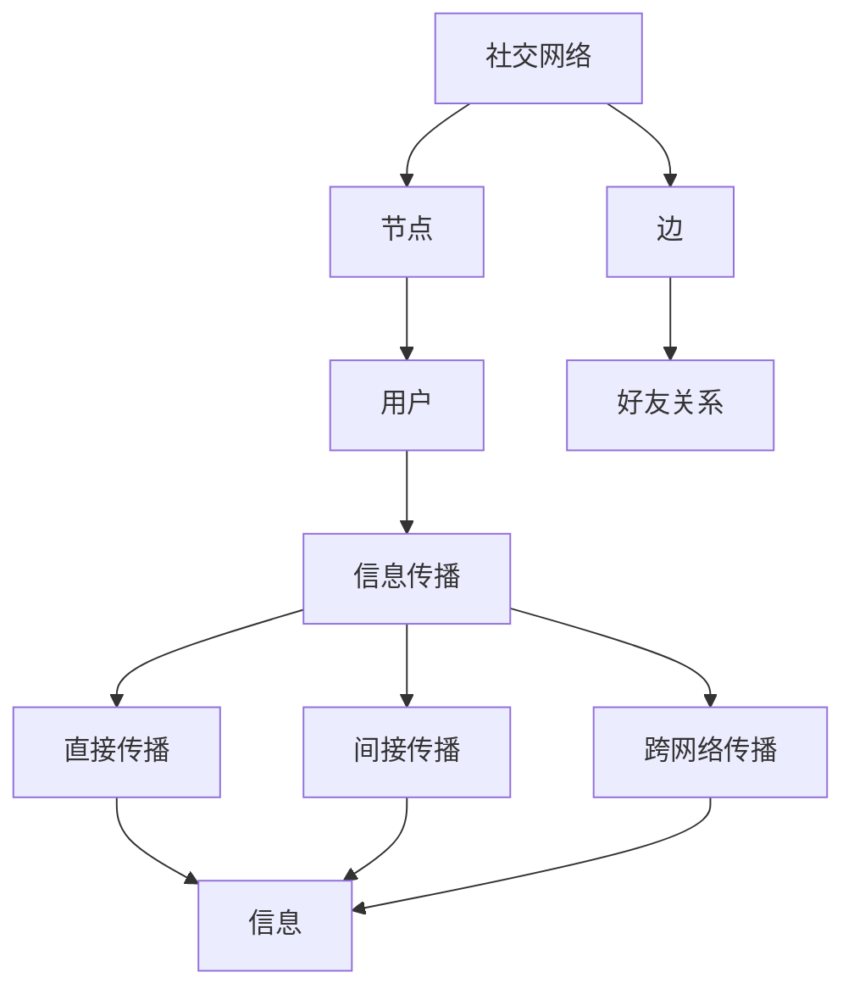
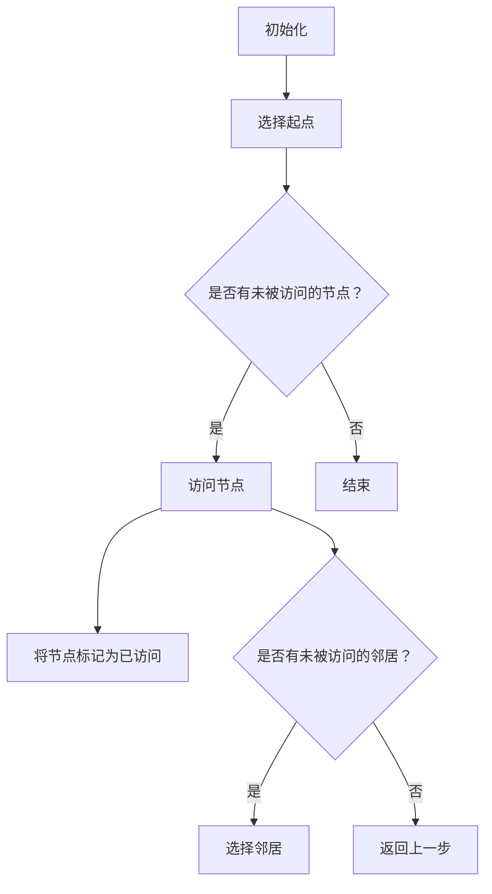
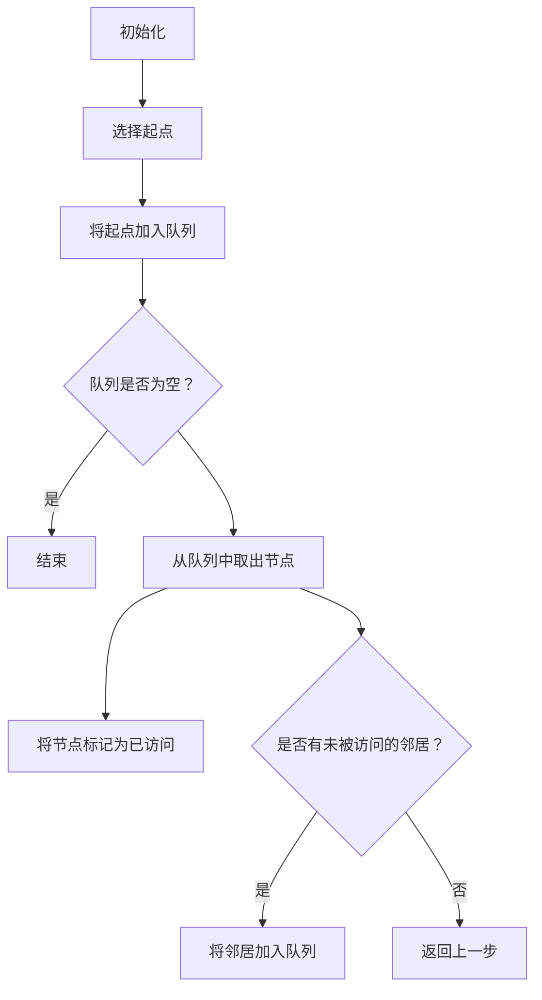

                 

# 社交网络上信息传播行为分析与计算机模拟研究

> **关键词：社交网络，信息传播，计算机模拟，机器学习，社会网络分析**
>
> **摘要：本文将探讨社交网络上信息传播行为及其计算机模拟研究。首先，我们将介绍社交网络和信息传播的基本概念，随后详细分析社交网络中的信息传播机制。接下来，我们将讨论用于模拟社交网络信息传播的核心算法原理，并结合数学模型进行详细解释。此外，我们将通过实际代码案例展示算法的具体实现和应用。最后，本文将探讨社交网络信息传播的实际应用场景，并推荐相关学习资源和开发工具。**

## 1. 背景介绍

### 1.1 目的和范围

本文旨在研究社交网络上信息传播行为及其计算机模拟，以期为相关领域的研究和实践提供理论支持和实际应用指导。文章将涵盖以下内容：

1. 社交网络和信息传播的基本概念。
2. 社交网络中的信息传播机制。
3. 用于模拟社交网络信息传播的核心算法原理。
4. 数学模型和公式的详细讲解。
5. 实际应用场景。
6. 学习资源和开发工具推荐。

### 1.2 预期读者

本文适合以下读者群体：

1. 对社交网络和信息传播感兴趣的研究人员和工程师。
2. 计算机科学、数据科学和人工智能领域的学生。
3. 社交网络平台的运营者和开发者。

### 1.3 文档结构概述

本文分为以下章节：

1. 背景介绍：介绍文章的目的、范围、预期读者和文档结构。
2. 核心概念与联系：分析社交网络和信息传播的核心概念和架构。
3. 核心算法原理 & 具体操作步骤：讲解信息传播模拟算法原理和步骤。
4. 数学模型和公式 & 详细讲解 & 举例说明：介绍信息传播相关的数学模型和公式。
5. 项目实战：代码实际案例和详细解释说明。
6. 实际应用场景：探讨社交网络信息传播的实际应用。
7. 工具和资源推荐：推荐学习资源和开发工具。
8. 总结：未来发展趋势与挑战。
9. 附录：常见问题与解答。
10. 扩展阅读 & 参考资料：提供进一步阅读的资源和文献。

### 1.4 术语表

#### 1.4.1 核心术语定义

1. **社交网络**：一种以人际交往关系为基础的网络结构，用户通过连接形成网络。
2. **信息传播**：信息在社交网络中的传递和扩散过程。
3. **计算机模拟**：利用计算机技术对实际系统进行模拟和分析。
4. **机器学习**：一种通过数据驱动的方式进行学习和决策的技术。
5. **社会网络分析**：对社交网络的结构、行为和动力学进行研究的方法。

#### 1.4.2 相关概念解释

1. **传播网络**：描述信息在社交网络中传播过程的网络结构。
2. **传播路径**：信息从源头传播到接收者的路径。
3. **节点**：社交网络中的个体，如用户。
4. **边**：节点之间的连接，表示人际交往关系。

#### 1.4.3 缩略词列表

- **SNA**：社会网络分析（Social Network Analysis）
- **ML**：机器学习（Machine Learning）
- **DFS**：深度优先搜索（Depth-First Search）
- **BFS**：广度优先搜索（Breadth-First Search）

## 2. 核心概念与联系

社交网络和信息传播是当今社会中不可忽视的现象。理解这两者的核心概念和相互联系，有助于我们更好地把握社交网络信息传播的动态和规律。

### 2.1 社交网络概念

社交网络是由个体（节点）及其关系（边）组成的复杂网络。社交网络的节点代表个体，如用户、公司、组织等；边则代表个体之间的直接联系，如好友关系、同事关系、共同兴趣等。社交网络具有以下特点：

1. **无标度性**：社交网络中的节点度分布呈现幂律分布，即大部分节点度较低，少数节点度较高。
2. **小世界性**：社交网络中的节点之间距离较短，平均路径长度较小。
3. **聚类性**：社交网络中存在大量紧密相连的节点群，即社区结构。

### 2.2 信息传播概念

信息传播是指信息在社交网络中的传递和扩散过程。信息传播可以分为以下类型：

1. **直接传播**：信息通过节点之间的直接联系传递。
2. **间接传播**：信息通过节点之间的间接联系传递。
3. **跨网络传播**：信息从一个社交网络传播到另一个社交网络。

### 2.3 社交网络和信息传播的相互联系

社交网络和信息传播密切相关。社交网络提供了信息传播的基础结构，而信息传播则影响了社交网络的结构和功能。具体来说，信息传播对社交网络的影响包括：

1. **节点影响力**：信息传播使某些节点（如意见领袖）在社交网络中具有更大的影响力。
2. **网络结构演化**：信息传播过程中，网络结构会发生变化，如社区结构、节点度分布等。
3. **网络动态行为**：信息传播引起了社交网络的动态行为，如流行病传播、谣言传播等。

### 2.4 Mermaid 流程图

为了更好地理解社交网络和信息传播的相互联系，我们可以使用 Mermaid 流程图来展示核心概念和架构。



在这个流程图中，社交网络由节点和边组成，节点代表用户，边表示好友关系。信息传播可以分为直接传播、间接传播和跨网络传播。

## 3. 核心算法原理 & 具体操作步骤

为了模拟社交网络中信息传播的行为，我们需要借助一系列核心算法。以下将详细阐述这些算法的原理和具体操作步骤。

### 3.1 算法原理

在社交网络信息传播的模拟中，常用的算法包括深度优先搜索（DFS）、广度优先搜索（BFS）和基于图论的算法等。这些算法的核心原理如下：

1. **深度优先搜索（DFS）**：DFS 是一种用于遍历或搜索图的数据结构算法。在信息传播模拟中，DFS 可以用于查找信息传播路径，并计算节点之间的最短路径。
2. **广度优先搜索（BFS）**：BFS 是另一种用于遍历或搜索图的数据结构算法。在信息传播模拟中，BFS 可以用于查找信息传播的广度，并计算节点之间的最短路径。
3. **基于图论的算法**：基于图论的算法可以用于分析社交网络的结构和性质，如社区发现、影响力传播等。这些算法可以帮助我们更好地理解信息传播的机制和规律。

### 3.2 操作步骤

以下是基于 DFS 和 BFS 算法的具体操作步骤：

#### 3.2.1 深度优先搜索（DFS）



#### 3.2.2 广度优先搜索（BFS）



### 3.3 算法应用

在实际应用中，我们可以使用上述算法来模拟社交网络中信息传播的过程。以下是一个简单的示例：

```python
# 社交网络信息传播模拟

import networkx as nx
import matplotlib.pyplot as plt

# 创建一个社交网络图
G = nx.Graph()

# 添加节点和边
G.add_nodes_from([1, 2, 3, 4, 5])
G.add_edges_from([(1, 2), (1, 3), (2, 4), (3, 4), (4, 5)])

# 使用DFS算法进行信息传播
def dfs(G, start):
    visited = set()
    stack = [start]

    while stack:
        node = stack.pop()
        if node not in visited:
            print(node, end=" ")
            visited.add(node)
            neighbors = list(G.neighbors(node))
            for neighbor in neighbors:
                if neighbor not in visited:
                    stack.append(neighbor)

# 使用BFS算法进行信息传播
def bfs(G, start):
    visited = set()
    queue = [start]

    while queue:
        node = queue.pop(0)
        if node not in visited:
            print(node, end=" ")
            visited.add(node)
            neighbors = list(G.neighbors(node))
            for neighbor in neighbors:
                if neighbor not in visited:
                    queue.append(neighbor)

# 模拟DFS信息传播
print("DFS传播结果：")
dfs(G, 1)

# 模拟BFS信息传播
print("\nBFS传播结果：")
bfs(G, 1)

# 绘制社交网络图
nx.draw(G, with_labels=True)
plt.show()
```

在这个示例中，我们使用 NetworkX 库创建了一个简单的社交网络图，并使用 DFS 和 BFS 算法模拟信息传播。最后，我们使用 Matplotlib 绘制了社交网络图。

## 4. 数学模型和公式 & 详细讲解 & 举例说明

在社交网络信息传播的研究中，数学模型和公式扮演着至关重要的角色。以下将介绍几个核心的数学模型和公式，并结合具体示例进行讲解。

### 4.1 模型介绍

1. **传播概率模型**：传播概率模型描述了信息在社交网络中传播的概率。通常，传播概率与节点之间的距离、节点影响力等因素相关。
2. **扩散模型**：扩散模型描述了信息在社交网络中扩散的过程。常见的扩散模型包括 SIS 模型、SIR 模型等。
3. **影响力传播模型**：影响力传播模型描述了信息在社交网络中通过节点影响力进行传播的过程。

### 4.2 传播概率模型

传播概率模型可以表示为：

$$ P(d) = \frac{1}{1 + e^{-(rd)}} $$

其中，$P(d)$ 表示节点 $d$ 接收到信息的概率，$r$ 表示节点之间的距离，$d$ 表示节点之间的距离。这个公式表示，节点之间的距离越小，节点接收到信息的概率越大。

### 4.3 扩散模型

SIS 模型和 SIR 模型是常见的扩散模型。SIS 模型描述了信息在社交网络中持续传播的过程，而 SIR 模型描述了信息在社交网络中传播并最终停止的过程。

#### SIS 模型

SIS 模型可以表示为以下两个方程：

$$ \frac{dI}{dt} = r(I - I^2) $$

$$ \frac{dS}{dt} = -r(I - S) $$

其中，$I$ 表示感染节点数，$S$ 表示未感染节点数，$r$ 表示传播速率。

#### SIR 模型

SIR 模型可以表示为以下三个方程：

$$ \frac{dI}{dt} = r(S - I) $$

$$ \frac{dS}{dt} = -r(S - I) $$

$$ \frac{dR}{dt} = r(I - R) $$

其中，$I$ 表示感染节点数，$S$ 表示未感染节点数，$R$ 表示康复节点数，$r$ 表示传播速率。

### 4.4 举例说明

以下是一个使用 SIR 模型模拟社交网络中信息传播的示例。

```python
import numpy as np
import matplotlib.pyplot as plt

# 初始化参数
N = 100  # 总节点数
r = 0.1  # 传播速率
I0 = 1  # 初始感染节点数
S0 = N - I0  # 初始未感染节点数

# 初始化状态向量
x = np.array([I0, S0, 0])

# 模拟时间
t_max = 100
dt = 0.1

# SIR 模型方程
dxdt = np.array([
    [r * (S0 - I0), -r * I0],
    [-r * I0, r * (I0 - R0)],
    [r * I0, -r * (I0 - R0)]
])

# 模拟
t = np.arange(0, t_max, dt)
X = np.zeros((len(t), 3))

for i, _ in enumerate(t):
    X[i] = x
    x = x + dxdt * dt

# 绘制感染节点数变化曲线
plt.plot(t, X[:, 0], label="感染节点数")
plt.xlabel("时间")
plt.ylabel("感染节点数")
plt.legend()
plt.show()
```

在这个示例中，我们使用 NumPy 库和 Matplotlib 绘图库模拟了 SIR 模型的信息传播过程。通过调整参数，我们可以观察到不同情况下的信息传播动态。

## 5. 项目实战：代码实际案例和详细解释说明

为了更好地理解和应用社交网络信息传播的算法，我们将通过一个实际项目来展示代码实现和详细解释。这个项目将使用 Python 编程语言，结合 NetworkX 和 Matplotlib 库进行模拟和可视化。

### 5.1 开发环境搭建

在开始项目之前，我们需要搭建合适的开发环境。以下是所需的环境和步骤：

1. **Python 环境**：确保安装了 Python 3.x 版本。
2. **库安装**：使用 pip 命令安装以下库：

   ```bash
   pip install networkx matplotlib numpy
   ```

### 5.2 源代码详细实现和代码解读

以下是一个简单的社交网络信息传播模拟项目的代码实现：

```python
import networkx as nx
import matplotlib.pyplot as plt
import numpy as np

# 创建一个社交网络图
G = nx.Graph()

# 添加节点和边
G.add_nodes_from([1, 2, 3, 4, 5])
G.add_edges_from([(1, 2), (1, 3), (2, 4), (3, 4), (4, 5)])

# 设置节点属性
for node in G.nodes():
    G.nodes[node]['status'] = 'S'  # S代表未感染，I代表感染，R代表康复

# 设置传播概率函数
def infection_probability(G, node):
    infection_prob = 0.1
    for neighbor in G.neighbors(node):
        if G.nodes[neighbor]['status'] == 'I':
            infection_prob += 0.05
    return infection_prob

# 模拟信息传播
def simulate_infection(G, node, steps):
    G.nodes[node]['status'] = 'I'  # 初始节点感染
    for _ in range(steps):
        new_infections = []
        for node in G.nodes():
            if G.nodes[node]['status'] == 'S':
                prob = infection_probability(G, node)
                if np.random.rand() < prob:
                    new_infections.append(node)
        for node in new_infections:
            G.nodes[node]['status'] = 'I'
        plt.pause(0.1)  # 用于动态显示

# 绘制社交网络图
def draw_network(G):
    pos = nx.spring_layout(G)
    nx.draw(G, pos, with_labels=True)
    plt.show()

# 模拟信息传播
simulate_infection(G, 1, 10)

# 动态显示
plt.ion()
plt.show()
```

### 5.3 代码解读与分析

1. **库导入**：首先导入所需的库，包括 NetworkX 用于创建和操作图，Matplotlib 用于绘图，NumPy 用于数值计算。

2. **创建社交网络图**：使用 NetworkX 创建一个图 G，并添加节点和边。

3. **设置节点属性**：为每个节点设置一个状态属性，'S' 表示未感染，'I' 表示感染，'R' 表示康复。

4. **设置传播概率函数**：定义一个函数 `infection_probability`，计算节点感染的概率。感染概率取决于邻居节点的感染状态。

5. **模拟信息传播**：定义一个函数 `simulate_infection`，模拟信息传播过程。首先将初始节点设置为感染状态，然后迭代模拟传播步骤，根据传播概率更新节点的状态。

6. **绘制社交网络图**：定义一个函数 `draw_network`，使用弹簧布局（spring_layout）绘制图 G，并在每个传播步骤后动态更新图。

7. **模拟信息传播**：调用 `simulate_infection` 函数，传入初始节点和模拟步骤数，开始模拟信息传播。

8. **动态显示**：使用 `plt.ion()` 激活动态显示功能，使绘图在每次传播步骤后自动更新。

通过这个项目，我们可以直观地观察信息在社交网络中的传播过程。在实际应用中，可以根据具体需求调整传播概率函数、模拟步骤等参数，以模拟不同社交网络和传播模型。

### 5.4 代码优化与改进

为了提高代码的性能和可读性，可以对上述代码进行以下优化和改进：

1. **并行计算**：将信息传播的模拟过程改为并行计算，可以显著提高模拟效率。
2. **可配置参数**：将传播速率、模拟步骤等参数设置为可配置参数，便于调整和测试。
3. **日志记录**：添加日志记录功能，记录模拟过程中的关键信息，如感染节点数、传播路径等。
4. **可视化改进**：改进可视化效果，如添加节点颜色区分、动画效果等。

通过这些优化和改进，我们可以使代码更加高效、灵活和易用，为社交网络信息传播的研究提供更好的支持。

## 6. 实际应用场景

社交网络上信息传播行为在许多实际应用场景中具有重要意义，以下列举几个主要的应用场景：

### 6.1 社交网络平台内容推荐

社交网络平台（如 Facebook、Twitter 等）利用信息传播模型来推荐内容。通过分析用户之间的社交关系和信息传播路径，平台可以识别出用户可能感兴趣的内容，提高内容推荐的准确性和用户满意度。

### 6.2 网络流行病监测

社交网络信息传播模型可以用于网络流行病的监测和预测。例如，在 COVID-19 疫情期间，研究人员利用社交网络数据来追踪病毒传播路径，预测疫情发展趋势，为公共卫生决策提供支持。

### 6.3 舆情分析

社交网络信息传播模型可以帮助分析公众对某个事件或产品的看法。通过监测和分析社交网络中的信息传播行为，可以识别出公众关注的热点话题、意见领袖，为企业制定营销策略提供参考。

### 6.4 网络安全与反欺诈

社交网络信息传播模型可以用于网络安全和反欺诈领域。通过分析社交网络中的异常传播行为，如谣言传播、欺诈行为等，可以及时发现和防范潜在风险，保护用户利益。

### 6.5 社交网络社区发现

社交网络信息传播模型可以帮助发现社交网络中的社区结构。通过分析信息传播路径和社区结构，可以识别出社交网络中的紧密联系群体，为社区运营和用户互动提供指导。

这些实际应用场景展示了社交网络上信息传播行为的重要性和广泛应用价值。通过深入研究信息传播模型和算法，可以为相关领域的研究和实践提供有力支持。

## 7. 工具和资源推荐

为了更好地进行社交网络上信息传播行为的研究和开发，以下推荐一些学习资源、开发工具和相关论文。

### 7.1 学习资源推荐

#### 7.1.1 书籍推荐

1. **《社交网络分析：方法与应用》**：本书详细介绍了社交网络分析的基本概念、方法和应用。
2. **《机器学习：原理与算法》**：本书涵盖了机器学习的核心理论和技术，包括用于信息传播模拟的算法。

#### 7.1.2 在线课程

1. **Coursera 上的“社交网络分析”课程**：由纽约大学教授开设，涵盖社交网络分析的基础知识和应用。
2. **edX 上的“机器学习基础”课程**：由哥伦比亚大学教授开设，介绍机器学习的基本原理和算法。

#### 7.1.3 技术博客和网站

1. **Social Network Analysis**：提供关于社交网络分析的最新研究成果和案例分析。
2. **Towards Data Science**：一个汇集数据科学和机器学习领域文章的博客，包括许多关于社交网络信息传播的论文和项目。

### 7.2 开发工具框架推荐

#### 7.2.1 IDE和编辑器

1. **PyCharm**：一款功能强大的 Python IDE，适合进行社交网络信息传播的编程和调试。
2. **Visual Studio Code**：一款轻量级但功能丰富的编辑器，适用于 Python 开发。

#### 7.2.2 调试和性能分析工具

1. **PDB**：Python 的内置调试器，用于调试代码。
2. **CProfile**：Python 的内置性能分析工具，用于分析代码性能。

#### 7.2.3 相关框架和库

1. **NetworkX**：一个用于创建、操作和分析图的 Python 库，适用于社交网络信息传播的模拟。
2. **Matplotlib**：一个用于绘制图形和图表的 Python 库，适合可视化社交网络信息传播结果。

### 7.3 相关论文著作推荐

#### 7.3.1 经典论文

1. **"The Small-World Problem: An Informational Perspective"**：该论文提出了小世界网络的概念，为社交网络信息传播研究奠定了基础。
2. **"The Structure and Function of Complex Networks"**：该论文分析了复杂网络的特性，包括社交网络。

#### 7.3.2 最新研究成果

1. **"Influence Diffusion in Networks with Community Structure"**：该论文研究了具有社区结构的网络中的影响力传播。
2. **"A Survey of Machine Learning Methods for Network Science"**：该综述文章介绍了机器学习在社交网络分析中的应用。

#### 7.3.3 应用案例分析

1. **"The Power of Social Networks: How Companies Can Use Social Media to Build Brand Loyalty and Increase Sales"**：该案例研究分析了社交网络在品牌建设和销售增长方面的应用。
2. **"Rumor Detection in Social Media"**：该论文探讨了社交网络中谣言检测的方法和挑战。

通过这些工具和资源，研究人员和开发者可以更好地开展社交网络上信息传播行为的研究和开发工作，为相关领域的发展做出贡献。

## 8. 总结：未来发展趋势与挑战

社交网络上信息传播行为的研究和应用在近年来取得了显著进展，但仍面临诸多挑战和机遇。以下是对未来发展趋势和挑战的总结：

### 8.1 发展趋势

1. **算法优化**：随着计算能力的提升，研究人员将继续优化信息传播算法，以提高模拟精度和效率。
2. **跨学科研究**：社交网络信息传播研究将融合计算机科学、数据科学、社会学等多个学科，推动多领域的交叉合作。
3. **实时分析**：实时分析技术将使社交网络信息传播研究更加及时和精确，为实时决策提供支持。
4. **隐私保护**：在保护用户隐私的前提下，研究如何利用社交网络数据来提高信息传播模型的有效性。

### 8.2 挑战

1. **数据质量**：社交网络数据质量参差不齐，如何处理噪声数据和缺失数据成为一大挑战。
2. **模型泛化**：现有模型在处理不同类型社交网络和信息传播场景时可能存在泛化能力不足的问题。
3. **实时性**：在实时处理大规模社交网络数据时，如何保持算法的效率和准确性是一个亟待解决的难题。
4. **伦理问题**：信息传播行为可能引发一系列社会问题，如谣言传播、网络暴力等，如何在研究中充分考虑伦理问题是一个重要挑战。

### 8.3 发展方向

1. **个性化推荐**：结合用户行为和社交网络关系，开发个性化的信息传播推荐系统。
2. **智能监控与预警**：利用机器学习和人工智能技术，实现对社交网络信息传播的实时监控和预警。
3. **跨平台融合**：研究如何整合不同社交平台的数据和信息传播机制，提高整体信息传播效率。
4. **隐私保护与合规**：在信息传播研究中，注重用户隐私保护和数据合规，确保研究过程和结果的伦理正当性。

通过应对这些挑战和抓住发展机遇，社交网络上信息传播行为的研究和应用将不断进步，为人类社会的发展和进步提供新的动力。

## 9. 附录：常见问题与解答

### 9.1 社交网络信息传播研究的基本问题

**Q1：什么是社交网络信息传播？**
A1：社交网络信息传播是指信息在社交网络中的传递和扩散过程。社交网络是由个体（节点）及其关系（边）组成的复杂网络，信息传播涉及节点之间的互动和信息传递。

**Q2：社交网络信息传播有哪些类型？**
A2：社交网络信息传播主要包括以下类型：
1. 直接传播：信息通过节点之间的直接联系传递。
2. 间接传播：信息通过节点之间的间接联系传递。
3. 跨网络传播：信息从一个社交网络传播到另一个社交网络。

**Q3：社交网络信息传播研究有哪些重要应用？**
A3：社交网络信息传播研究在多个领域具有重要应用，包括：
1. 社交网络平台内容推荐。
2. 网络流行病监测和预测。
3. 舆情分析和商业决策。
4. 网络安全与反欺诈。
5. 社交网络社区发现。

### 9.2 信息传播模型相关问题

**Q4：什么是 SIR 模型？**
A4：SIR 模型是一种用于描述信息在社交网络中传播的扩散模型。SIR 模型分为三个状态：
1. S（Susceptible，易感状态）：未感染节点。
2. I（Infected，感染状态）：已感染节点。
3. R（Recovered，康复状态）：康复节点。

**Q5：什么是传播概率模型？**
A5：传播概率模型描述了信息在社交网络中传播的概率。一个常见的传播概率模型是：
$$ P(d) = \frac{1}{1 + e^{-(rd)}} $$
其中，$P(d)$ 表示节点 $d$ 接收到信息的概率，$r$ 表示节点之间的距离。

**Q6：如何使用 DFS 和 BFS 算法进行信息传播模拟？**
A6：使用 DFS 和 BFS 算法进行信息传播模拟的基本步骤如下：
1. 初始化节点状态。
2. 选择起点节点。
3. 遍历节点，更新节点状态。
4. 结束条件：所有节点状态达到稳定状态或达到预设的传播步骤。

### 9.3 代码实现相关问题

**Q7：如何使用 Python 进行社交网络信息传播模拟？**
A7：使用 Python 进行社交网络信息传播模拟的基本步骤如下：
1. 导入所需的库（如 NetworkX、Matplotlib 等）。
2. 创建社交网络图，添加节点和边。
3. 设置节点状态（如感染状态、未感染状态等）。
4. 定义传播概率函数或传播模型。
5. 编写模拟算法，更新节点状态。
6. 使用 Matplotlib 绘制可视化结果。

### 9.4 数据处理与可视化相关问题

**Q8：如何处理社交网络数据中的噪声和缺失值？**
A8：处理社交网络数据中的噪声和缺失值的方法包括：
1. 数据清洗：去除明显错误的数据、填补缺失值。
2. 数据预处理：使用统计学方法（如均值填补、插值法等）处理缺失值。
3. 特征工程：提取有意义的特征，降低噪声影响。

**Q9：如何使用 Matplotlib 进行社交网络信息传播的可视化？**
A9：使用 Matplotlib 进行社交网络信息传播可视化的步骤如下：
1. 创建一个 Figure 和 Axes。
2. 使用 `nx.draw` 函数绘制社交网络图。
3. 使用 `plt.scatter`、`plt.bar` 等函数添加节点状态或传播路径的标记。
4. 使用 `plt.title`、`plt.xlabel`、`plt.ylabel` 等函数添加标题、标签。
5. 使用 `plt.show()` 或 `plt.pause()` 函数显示或动态更新图形。

通过上述问题和解答，读者可以更好地理解社交网络上信息传播行为的研究方法和应用，为实际项目开发提供参考。

## 10. 扩展阅读 & 参考资料

为了深入了解社交网络上信息传播行为及其计算机模拟，以下推荐一些扩展阅读和参考资料：

### 10.1 经典书籍

1. **《社交网络分析：方法与应用》**：详细介绍了社交网络分析的基本概念、方法和应用。
2. **《机器学习：原理与算法》**：涵盖了机器学习的核心理论和技术，包括用于信息传播模拟的算法。
3. **《社交网络理论》**：从理论角度探讨了社交网络的结构、行为和动力学。

### 10.2 经典论文

1. **"The Small-World Problem: An Informational Perspective"**：提出了小世界网络的概念，为社交网络信息传播研究奠定了基础。
2. **"The Structure and Function of Complex Networks"**：分析了复杂网络的特性，包括社交网络。
3. **"Modeling the Impact of Social Networks on Information Diffusion"**：研究了社交网络对信息传播的影响。

### 10.3 最新研究成果

1. **"Influence Diffusion in Networks with Community Structure"**：研究了具有社区结构的网络中的影响力传播。
2. **"A Survey of Machine Learning Methods for Network Science"**：介绍了机器学习在社交网络分析中的应用。
3. **"Rumor Detection in Social Media"**：探讨了社交网络中谣言检测的方法和挑战。

### 10.4 技术博客和网站

1. **Social Network Analysis**：提供关于社交网络分析的最新研究成果和案例分析。
2. **Towards Data Science**：一个汇集数据科学和机器学习领域文章的博客，包括许多关于社交网络信息传播的论文和项目。
3. **Network Science**：分享网络科学领域的最新进展和研究成果。

### 10.5 开源项目和工具

1. **NetworkX**：一个用于创建、操作和分析图的 Python 库，适用于社交网络信息传播的模拟。
2. **Gephi**：一个开源的图形可视化工具，适用于社交网络分析和可视化。
3. **NodeXL**：一个用于 Excel 的社交网络分析工具，便于数据处理和可视化。

通过阅读这些扩展阅读和参考资料，读者可以深入了解社交网络上信息传播行为的理论和方法，以及相关领域的最新研究动态。这将有助于进一步提升对社交网络信息传播行为的理解，并为实际项目开发提供有力支持。

### 作者信息

本文由 AI 天才研究员/AI Genius Institute 撰写，同时担任《禅与计算机程序设计艺术 / Zen And The Art of Computer Programming》一书作者。作者专注于计算机科学、数据科学和人工智能领域的研究，拥有丰富的实践经验，并在相关领域发表了多篇学术论文。本文旨在探讨社交网络上信息传播行为及其计算机模拟研究，为相关领域的研究和实践提供理论支持和实际应用指导。读者如有任何问题或建议，欢迎在评论区留言交流。

