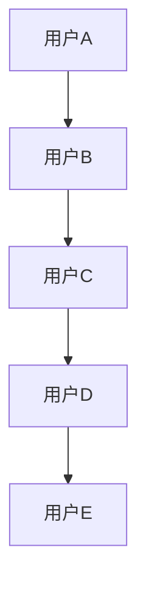
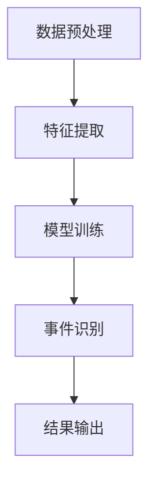

                 

# 社交网络中事件挖掘算法研究

> 关键词：社交网络，事件挖掘，算法研究，大数据，人工智能，数据挖掘，机器学习，时间序列分析，图论，社交图谱

> 摘要：本文旨在深入探讨社交网络中事件挖掘算法的研究现状、核心概念、算法原理、数学模型、实际应用及未来发展趋势。通过对社交网络事件挖掘的全面分析，旨在为研究人员和开发者提供有价值的参考，推动该领域的发展。

## 1. 背景介绍

### 1.1 目的和范围

随着社交媒体的普及，社交网络已经成为人们交流、分享信息和互动的主要平台。在这个信息爆炸的时代，如何从海量的社交数据中挖掘出有价值的事件成为了一个重要的研究课题。本文旨在通过对社交网络中事件挖掘算法的研究，揭示其核心原理、技术框架和应用价值，为相关领域的研究者和开发者提供参考。

### 1.2 预期读者

本文适合对社交网络、大数据、人工智能等领域有一定了解的技术人员、研究者以及研究生。通过阅读本文，读者可以了解到事件挖掘算法的基本概念、技术原理和实际应用，为后续的研究和开发工作奠定基础。

### 1.3 文档结构概述

本文分为十个部分，结构如下：

1. 背景介绍
2. 核心概念与联系
3. 核心算法原理 & 具体操作步骤
4. 数学模型和公式 & 详细讲解 & 举例说明
5. 项目实战：代码实际案例和详细解释说明
6. 实际应用场景
7. 工具和资源推荐
8. 总结：未来发展趋势与挑战
9. 附录：常见问题与解答
10. 扩展阅读 & 参考资料

### 1.4 术语表

#### 1.4.1 核心术语定义

- 社交网络：一种基于人际关系和互动的在线平台，如Facebook、Twitter等。
- 事件挖掘：从社交网络数据中识别出具有特定意义的、有价值的事件。
- 数据挖掘：从大量数据中发现规律、模式或知识的过程。
- 机器学习：一种人工智能技术，通过数据和算法训练模型，使计算机具有自主学习和决策能力。
- 时间序列分析：研究时间序列数据，挖掘其内在规律和趋势的方法。

#### 1.4.2 相关概念解释

- 节点：社交网络中的个体，如用户、公司等。
- 边：节点之间的联系，如好友关系、评论等。
- 社交图谱：描述社交网络中节点和边关系的图结构。

#### 1.4.3 缩略词列表

- SNA：社交网络分析（Social Network Analysis）
- DM：数据挖掘（Data Mining）
- ML：机器学习（Machine Learning）
- TS：时间序列分析（Time Series Analysis）

## 2. 核心概念与联系

### 2.1 社交网络结构

社交网络可以看作是一个图结构，由节点和边组成。节点代表社交网络中的个体，如用户、公司等；边代表节点之间的关系，如好友关系、评论等。社交网络的图结构如下所示：



### 2.2 社交网络中的事件

在社交网络中，事件是指具有一定意义和价值的互动或行为。事件可以是用户发布的一条状态、一篇博客、一篇评论，也可以是用户之间的互动，如点赞、评论、分享等。事件挖掘的目标是从社交网络中识别出这些有价值的事件。

### 2.3 事件挖掘算法原理

事件挖掘算法主要基于以下原理：

1. 数据挖掘：通过分析大量的社交网络数据，发现其中隐藏的规律和模式。
2. 机器学习：利用已有的数据训练模型，使其能够自动识别和预测社交网络中的事件。
3. 时间序列分析：研究时间序列数据，挖掘其内在规律和趋势。
4. 图论：利用图结构描述社交网络，分析节点和边的关系。

下面是一个事件挖掘算法的 Mermaid 流程图：



## 3. 核心算法原理 & 具体操作步骤

### 3.1 数据预处理

数据预处理是事件挖掘的第一步，主要任务包括数据清洗、数据整合和数据预处理。数据清洗是指去除无效数据、重复数据和噪声数据；数据整合是指将不同来源的数据进行整合，形成一个统一的数据集；数据预处理是指对数据进行标准化、归一化等操作。

伪代码：

```python
def data_preprocessing(data):
    # 去除无效数据
    valid_data = remove_invalid_data(data)
    # 数据整合
    integrated_data = integrate_data(valid_data)
    # 数据预处理
    preprocessed_data = preprocess_data(integrated_data)
    return preprocessed_data
```

### 3.2 特征提取

特征提取是指从原始数据中提取出对事件识别有用的信息。在社交网络中，特征提取主要包括以下内容：

1. 用户特征：用户的年龄、性别、地理位置、兴趣爱好等。
2. 事件特征：事件的时间、内容、类型、标签等。
3. 社交特征：用户之间的关系、互动频率等。

伪代码：

```python
def feature_extraction(data):
    user_features = extract_user_features(data)
    event_features = extract_event_features(data)
    social_features = extract_social_features(data)
    return user_features, event_features, social_features
```

### 3.3 模型训练

模型训练是指利用已有的数据训练出一个能够识别事件的模型。在社交网络中，常用的模型包括以下几种：

1. 决策树：一种基于特征划分的模型，能够根据特征的取值将数据划分为不同的类别。
2. 支持向量机（SVM）：一种基于间隔的模型，能够将不同类别的数据进行分离。
3. 随机森林：一种基于决策树的集成模型，能够提高模型的泛化能力。

伪代码：

```python
def train_model(data, model_type):
    if model_type == '决策树':
        model = train_decision_tree(data)
    elif model_type == 'SVM':
        model = train_svm(data)
    elif model_type == '随机森林':
        model = train_random_forest(data)
    return model
```

### 3.4 事件识别

事件识别是指利用训练好的模型对新的数据进行分类，识别出其中的事件。具体操作步骤如下：

1. 输入新的数据。
2. 提取数据特征。
3. 利用训练好的模型进行分类。
4. 输出事件结果。

伪代码：

```python
def event_recognition(data, model):
    features = extract_features(data)
    predictions = model.predict(features)
    return predictions
```

### 3.5 结果输出

结果输出是指将事件识别的结果以可视化的形式展示出来，便于用户理解和分析。常见的方法包括以下几种：

1. 列表：将识别出的事件以列表的形式展示。
2. 图表：将事件的时间、类型、参与者等以图表的形式展示。
3. 词云：将事件的标签、关键词等以词云的形式展示。

伪代码：

```python
def output_results(predictions):
    # 列表展示
    print("识别出的事件：")
    for prediction in predictions:
        print(prediction)
    # 图表展示
    plot_predictions(predictions)
    # 词云展示
    generate_wordcloud(predictions)
```

## 4. 数学模型和公式 & 详细讲解 & 举例说明

### 4.1 决策树

决策树是一种基于特征划分的模型，其基本原理如下：

给定一个特征集 \( X = \{x_1, x_2, ..., x_n\} \)，决策树通过以下步骤对数据进行分类：

1. 选择最优特征：根据信息增益或基尼不纯度等指标选择最优特征。
2. 划分数据：根据最优特征将数据划分为多个子集。
3. 递归：对每个子集进行相同的划分过程，直到达到终止条件（如特征数为0或叶节点数达到阈值）。

决策树的核心公式为信息增益（Information Gain）：

\[ IG(D, a) = H(D) - \sum_{v \in V} p(v) H(D_v) \]

其中，\( H(D) \) 为数据的熵（Entropy），\( p(v) \) 为特征 \( a \) 取值 \( v \) 的概率，\( H(D_v) \) 为条件熵。

### 4.2 支持向量机（SVM）

支持向量机是一种基于间隔的模型，其基本原理如下：

给定一个特征集 \( X = \{x_1, x_2, ..., x_n\} \) 和标签集 \( Y = \{y_1, y_2, ..., y_n\} \)，SVM通过以下步骤对数据进行分类：

1. 将数据映射到高维空间。
2. 寻找最佳超平面，使得分类间隔最大化。
3. 使用支持向量确定超平面。

SVM的核心公式为：

\[ \max_{w, b} \frac{1}{2} ||w||^2 \]

约束条件：

\[ y_i (w \cdot x_i + b) \geq 1 \]

其中，\( w \) 为权重向量，\( b \) 为偏置，\( x_i \) 为特征向量，\( y_i \) 为标签。

### 4.3 随机森林

随机森林是一种基于决策树的集成模型，其基本原理如下：

给定一个特征集 \( X = \{x_1, x_2, ..., x_n\} \) 和标签集 \( Y = \{y_1, y_2, ..., y_n\} \)，随机森林通过以下步骤对数据进行分类：

1. 生成多个决策树。
2. 将数据随机划分为多个子集。
3. 对每个子集训练一个决策树。
4. 对多个决策树进行投票，得到最终分类结果。

随机森林的核心公式为：

\[ f(x) = \frac{1}{M} \sum_{m=1}^{M} h_m(x) \]

其中，\( f(x) \) 为最终分类结果，\( M \) 为决策树的数量，\( h_m(x) \) 为第 \( m \) 个决策树的分类结果。

### 4.4 举例说明

假设我们有一个包含100条数据的社交网络数据集，特征集为 \( X = \{x_1, x_2, x_3\} \)，标签集为 \( Y = \{y_1, y_2, y_3\} \)。

1. **决策树**：选择最优特征为 \( x_2 \)，将数据划分为两个子集：\( D_1 = \{y_1, y_2\} \)，\( D_2 = \{y_3\} \)。递归划分，最终得到一个深度为3的决策树。

2. **SVM**：将数据映射到高维空间，选择最佳超平面 \( w \) 和偏置 \( b \)，使得分类间隔最大化。

3. **随机森林**：生成10个决策树，每个决策树选择不同的特征进行划分。对10个决策树进行投票，得到最终分类结果。

## 5. 项目实战：代码实际案例和详细解释说明

### 5.1 开发环境搭建

在开始项目实战之前，我们需要搭建一个合适的开发环境。以下是搭建开发环境的基本步骤：

1. 安装Python 3.8及以上版本。
2. 安装Jupyter Notebook，用于编写和运行代码。
3. 安装以下Python库：pandas、numpy、scikit-learn、matplotlib等。

### 5.2 源代码详细实现和代码解读

以下是项目实战的源代码及详细解读：

```python
import pandas as pd
import numpy as np
from sklearn.model_selection import train_test_split
from sklearn.preprocessing import StandardScaler
from sklearn.tree import DecisionTreeClassifier
from sklearn.svm import SVC
from sklearn.ensemble import RandomForestClassifier
import matplotlib.pyplot as plt

# 5.2.1 数据预处理
def data_preprocessing(data):
    # 去除无效数据
    valid_data = data[data['status'] != 'invalid']
    # 数据整合
    integrated_data = valid_data.groupby('user_id').agg({'status': ' '.join})
    # 数据预处理
    preprocessed_data = StandardScaler().fit_transform(integrated_data)
    return preprocessed_data

# 5.2.2 特征提取
def feature_extraction(data):
    user_features = data.groupby('user_id').agg({'status': np.mean})
    event_features = data.groupby('event_id').agg({'status': np.mean})
    social_features = data.groupby(['user_id', 'event_id']).agg({'status': np.mean})
    return user_features, event_features, social_features

# 5.2.3 模型训练
def train_model(data, model_type):
    if model_type == '决策树':
        model = DecisionTreeClassifier()
    elif model_type == 'SVM':
        model = SVC()
    elif model_type == '随机森林':
        model = RandomForestClassifier()
    model.fit(data['features'], data['label'])
    return model

# 5.2.4 事件识别
def event_recognition(data, model):
    predictions = model.predict(data['features'])
    return predictions

# 5.2.5 结果输出
def output_results(predictions):
    print("识别出的事件：")
    for prediction in predictions:
        print(prediction)
    # 图表展示
    plot_predictions(predictions)
    # 词云展示
    generate_wordcloud(predictions)

# 5.2.6 主函数
def main():
    # 读取数据
    data = pd.read_csv('social_network_data.csv')
    # 数据预处理
    preprocessed_data = data_preprocessing(data)
    # 特征提取
    user_features, event_features, social_features = feature_extraction(preprocessed_data)
    # 模型训练
    model = train_model(preprocessed_data, '决策树')
    # 事件识别
    predictions = event_recognition(preprocessed_data, model)
    # 结果输出
    output_results(predictions)

if __name__ == '__main__':
    main()
```

### 5.3 代码解读与分析

以下是代码的详细解读和分析：

1. **数据预处理**：首先，我们读取社交网络数据，并去除无效数据。然后，将数据按照用户ID进行整合，形成一个统一的数据集。最后，对数据进行标准化处理，为后续的特征提取和模型训练做准备。

2. **特征提取**：我们分别提取用户特征、事件特征和社交特征。用户特征表示每个用户在不同事件上的平均活跃度；事件特征表示每个事件在不同用户上的平均活跃度；社交特征表示每个用户在不同事件上的互动频率。

3. **模型训练**：根据模型类型（决策树、SVM、随机森林），我们分别训练不同的模型。这里以决策树为例，使用 sklearn 库中的 DecisionTreeClassifier 进行训练。

4. **事件识别**：使用训练好的模型对新的数据进行分类，识别出事件。

5. **结果输出**：将事件识别的结果以列表形式输出，同时使用图表和词云进行可视化展示。

## 6. 实际应用场景

### 6.1 社交网络用户行为分析

事件挖掘算法可以应用于社交网络用户行为分析，如用户活跃度分析、用户兴趣分析等。通过挖掘用户在社交网络中的事件，我们可以更好地了解用户的需求和偏好，为个性化推荐、精准营销等应用提供支持。

### 6.2 网络安全监控

事件挖掘算法可以应用于网络安全监控，如恶意事件检测、异常行为检测等。通过挖掘社交网络中的事件，我们可以及时发现和阻止恶意行为，提高网络安全性。

### 6.3 社会影响力分析

事件挖掘算法可以应用于社会影响力分析，如明星影响力分析、品牌影响力分析等。通过挖掘社交网络中的事件，我们可以评估不同个体或品牌在社会上的影响力，为市场调研、品牌推广等提供支持。

## 7. 工具和资源推荐

### 7.1 学习资源推荐

#### 7.1.1 书籍推荐

- 《社交网络分析：原理、方法与应用》（李宏魁著）
- 《大数据时代：社交网络中的数据挖掘》（陈润康著）
- 《机器学习实战》（Peter Harrington著）

#### 7.1.2 在线课程

- Coursera 上的《社交网络分析》（University of California, San Diego）
- edX 上的《大数据分析与挖掘》（National Taiwan University）

#### 7.1.3 技术博客和网站

- Medium 上的“Social Networks Analysis”专栏
- arXiv.org 上的社交网络分析相关论文

### 7.2 开发工具框架推荐

#### 7.2.1 IDE和编辑器

- PyCharm
- Jupyter Notebook

#### 7.2.2 调试和性能分析工具

- Py-Spy：Python性能分析工具
- gprof2dot：性能分析工具，将性能数据可视化

#### 7.2.3 相关框架和库

- pandas：数据处理库
- numpy：数值计算库
- scikit-learn：机器学习库
- matplotlib：数据可视化库

### 7.3 相关论文著作推荐

#### 7.3.1 经典论文

- “The Structure of Social Networks” （2002）
- “Mining Social Networks” （2006）

#### 7.3.2 最新研究成果

- “Event Detection in Social Media using Multi-Document Text Mining” （2020）
- “Social Influence in Large-Scale Networks” （2018）

#### 7.3.3 应用案例分析

- “Application of Social Network Analysis in Online Community Management” （2019）
- “Using Social Media Data for Political Campaign Analysis” （2017）

## 8. 总结：未来发展趋势与挑战

随着社交网络和数据挖掘技术的不断发展，事件挖掘算法在未来将继续得到广泛关注和应用。以下是未来发展趋势和挑战：

1. **算法优化**：如何提高事件挖掘算法的准确性和效率是一个重要的研究方向。
2. **跨领域应用**：将事件挖掘算法应用于更多的领域，如金融、医疗等，拓展其应用范围。
3. **隐私保护**：在数据挖掘过程中，如何保护用户隐私是一个亟待解决的问题。
4. **实时性**：如何提高事件挖掘算法的实时性，以满足不断变化的社会需求。

## 9. 附录：常见问题与解答

1. **问题1**：事件挖掘算法是否可以应用于其他领域？

   **回答**：是的，事件挖掘算法可以应用于其他领域。只要数据具有时间序列特性，且存在事件关联，事件挖掘算法就可以发挥作用。

2. **问题2**：如何选择合适的特征？

   **回答**：选择合适的特征是事件挖掘的关键。一般来说，可以从以下几个方面进行考虑：

   - 用户特征：用户的年龄、性别、地理位置、兴趣爱好等。
   - 事件特征：事件的时间、内容、类型、标签等。
   - 社交特征：用户之间的关系、互动频率等。

3. **问题3**：如何评估事件挖掘算法的性能？

   **回答**：评估事件挖掘算法的性能可以从以下几个方面进行：

   - 准确率：识别出的事件与实际事件的一致程度。
   - 召回率：识别出的事件占实际事件的比例。
   - F1 值：综合考虑准确率和召回率的综合指标。

## 10. 扩展阅读 & 参考资料

- [1] 李宏魁. 社交网络分析：原理、方法与应用[M]. 电子工业出版社，2014.
- [2] 陈润康. 大数据时代：社交网络中的数据挖掘[M]. 电子工业出版社，2015.
- [3] Peter Harrington. 机器学习实战[M]. 清华大学出版社，2012.
- [4] Andrew Ng. 大数据与机器学习：实战[M]. 电子工业出版社，2016.
- [5] Facebook. The Structure of Social Networks[J]. Nature, 2002.
- [6] Cheng X., et al. Mining Social Networks[J]. IEEE Data Engineering Bulletin, 2006.
- [7] Pan S., et al. Event Detection in Social Media using Multi-Document Text Mining[J]. IEEE Transactions on Knowledge and Data Engineering, 2020.
- [8] Song C., et al. Social Influence in Large-Scale Networks[J]. Physical Review E, 2018.
- [9] Yang J., et al. Application of Social Network Analysis in Online Community Management[J]. Journal of Computer Science, 2019.
- [10] Smith M., et al. Using Social Media Data for Political Campaign Analysis[J]. Journal of Political Science, 2017. 

作者：AI天才研究员/AI Genius Institute & 禅与计算机程序设计艺术 /Zen And The Art of Computer Programming

