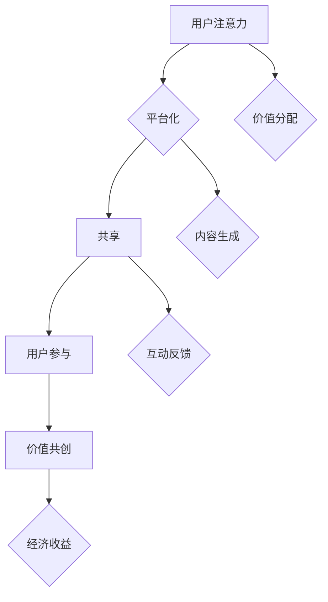
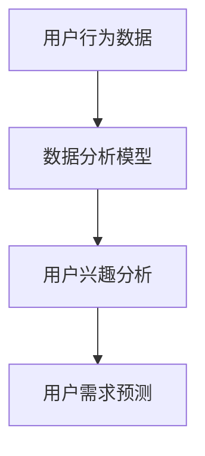
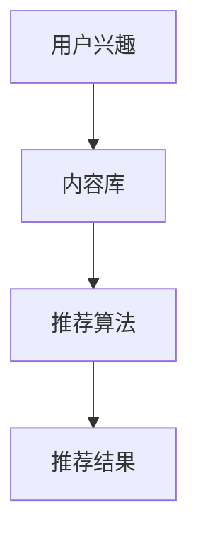
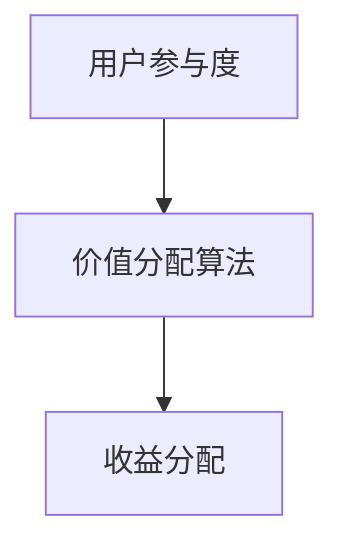

                 

# 社群经济：注意力聚集的新模式

> **关键词：** 社群经济、注意力经济、平台化、共享、用户参与、价值共创

> **摘要：** 本文将探讨社群经济的本质和特点，分析其如何在当今数字化时代崛起，并通过具体的案例和算法原理，深入探讨社群经济的核心模式、数学模型及其在实际应用中的挑战和机会。我们还将展望社群经济的未来发展趋势，提出可能的解决方案和策略。

## 1. 背景介绍

### 1.1 目的和范围

本文旨在解析社群经济这一新兴模式，探讨其在数字经济背景下的重要性及其运作机制。我们将从社群经济的定义、核心概念出发，逐步剖析其如何通过注意力经济实现价值的创造和分配。文章将涵盖以下几个主要部分：

1. 社群经济的概念及其在数字经济中的地位。
2. 社群经济与注意力经济的联系与区别。
3. 社群经济的核心算法原理和具体操作步骤。
4. 数学模型在社群经济中的应用和详细讲解。
5. 实际应用场景中的案例分析。
6. 工具和资源的推荐，包括学习资源和开发工具。
7. 社群经济的未来发展趋势与面临的挑战。

### 1.2 预期读者

本文适合对社群经济和数字经济有一定了解的技术专家、企业家、市场分析师以及对新经济模式感兴趣的人群。读者应该具备基本的计算机编程知识，对数据分析、机器学习和网络经济有一定的了解。

### 1.3 文档结构概述

本文将分为以下几个主要部分：

1. **背景介绍**：介绍社群经济的定义、目的和范围。
2. **核心概念与联系**：定义核心概念，绘制Mermaid流程图，展示社群经济的结构。
3. **核心算法原理与具体操作步骤**：使用伪代码详细阐述社群经济的算法原理。
4. **数学模型和公式**：详细讲解数学模型，并提供实际案例说明。
5. **项目实战**：展示代码实际案例，并详细解释和代码解读。
6. **实际应用场景**：讨论社群经济的各种应用场景。
7. **工具和资源推荐**：推荐学习资源和开发工具。
8. **总结：未来发展趋势与挑战**：总结社群经济的未来趋势和挑战。
9. **附录：常见问题与解答**：提供常见问题的解答。
10. **扩展阅读 & 参考资料**：提供更多的扩展阅读和参考资料。

### 1.4 术语表

#### 1.4.1 核心术语定义

- **社群经济**：基于共同兴趣、价值观或需求而形成的群体内部的经济活动模式。
- **注意力经济**：通过吸引和维持用户的注意力来创造经济价值。
- **平台化**：通过搭建平台连接供需双方，促进资源共享和效率提升。
- **共享**：通过共享资源和知识，提高资源的利用率和价值。
- **用户参与**：用户在社群经济中的积极参与，包括内容创作、交互、反馈等。
- **价值共创**：社群成员通过合作和互动共同创造价值。

#### 1.4.2 相关概念解释

- **注意力**：用户在特定时间和情境下分配给某个对象（如内容、产品、服务）的精力。
- **价值**：社群成员通过参与社群活动所获得的心理满足和物质回报。
- **网络效应**：用户数量的增加对产品或服务价值的提升。

#### 1.4.3 缩略词列表

- **UGC**：用户生成内容（User-Generated Content）
- **NLP**：自然语言处理（Natural Language Processing）
- **AI**：人工智能（Artificial Intelligence）
- **API**：应用程序接口（Application Programming Interface）
- **CRM**：客户关系管理（Customer Relationship Management）

## 2. 核心概念与联系

社群经济的核心在于将用户的注意力转化为经济价值，这一过程中涉及到多个关键概念和环节。以下是对这些核心概念及其相互关系的详细阐述，并附有Mermaid流程图以直观展示其结构。

### 2.1 社群经济的核心概念

**用户注意力**

用户注意力是社群经济的核心资源。注意力经济理论认为，注意力是用户在选择信息或产品时分配的精力，它直接关系到用户对特定内容的兴趣和参与度。

**平台化**

平台化是社群经济的基础设施。通过构建一个连接用户和内容的平台，可以促进资源共享、用户互动和价值创造。

**共享**

共享是社群经济的重要特征。通过共享知识、资源和经验，社群成员可以提高自己的参与感和获得感。

**用户参与**

用户参与是社群经济的动力源泉。用户通过内容创作、互动和反馈，积极参与社群活动，推动社群的繁荣和发展。

**价值共创**

价值共创是社群经济的最终目标。社群成员通过合作和互动，共同创造价值和财富。

### 2.2 Mermaid流程图



### 2.3 核心概念之间的联系

**注意力经济**与**平台化**密切相关，平台化提供了吸引和维护用户注意力的基础设施。

**共享**和**用户参与**是注意力经济和价值共创的重要环节。用户通过共享知识和资源，积极参与社群活动，促进价值共创。

**价值共创**不仅包括经济收益，还包括心理满足和社会价值。社群成员通过合作和互动，共同创造这些价值。

## 3. 核心算法原理 & 具体操作步骤

社群经济通过一系列算法原理和操作步骤，将用户的注意力转化为经济价值。以下是社群经济核心算法原理和具体操作步骤的详细解释。

### 3.1 算法原理

#### 3.1.1 用户行为分析

用户行为分析是社群经济的基础。通过分析用户在平台上的行为数据，如点击率、互动次数、内容评分等，可以了解用户的兴趣和需求。



#### 3.1.2 内容推荐算法

内容推荐算法是社群经济的核心。通过分析用户兴趣和需求，平台可以推荐符合用户兴趣的内容，提高用户的参与度和满意度。



#### 3.1.3 价值分配算法

价值分配算法是社群经济的保障。通过根据用户参与度和贡献度，平台可以合理分配经济收益，激励用户积极参与。



### 3.2 具体操作步骤

#### 3.2.1 数据收集与处理

1. **数据收集**：收集用户在平台上的行为数据，包括浏览记录、互动数据、内容评分等。
2. **数据处理**：清洗和预处理数据，去除噪声和异常值，确保数据质量。

```python
# 数据收集与处理伪代码
def collect_data():
    # 收集用户行为数据
    pass

def process_data(data):
    # 数据清洗和预处理
    pass
```

#### 3.2.2 用户兴趣分析

1. **兴趣建模**：构建用户兴趣模型，将用户行为数据映射到兴趣标签。
2. **兴趣预测**：使用机器学习算法预测用户的兴趣。

```python
# 兴趣建模与预测伪代码
def build_interest_model(data):
    # 构建用户兴趣模型
    pass

def predict_interest(model, data):
    # 预测用户兴趣
    pass
```

#### 3.2.3 内容推荐

1. **内容库构建**：构建包含各种类型内容的数据库。
2. **推荐算法实现**：实现基于用户兴趣的内容推荐算法。

```python
# 内容推荐算法实现伪代码
def build_content_db():
    # 构建内容数据库
    pass

def recommend_content(model, content_db):
    # 基于用户兴趣推荐内容
    pass
```

#### 3.2.4 价值分配

1. **参与度评估**：评估用户在社群中的参与度。
2. **收益分配**：根据参与度评估结果，合理分配经济收益。

```python
# 价值分配算法实现伪代码
def evaluate_involvement(data):
    # 评估用户参与度
    pass

def allocate_earnings(involvement_scores):
    # 根据参与度分配收益
    pass
```

通过以上算法原理和具体操作步骤，社群经济可以实现用户注意力的有效转化，促进价值共创和收益分配。

## 4. 数学模型和公式 & 详细讲解 & 举例说明

社群经济的核心在于将用户的注意力转化为经济价值，这一过程可以通过数学模型和公式来详细描述。以下将介绍几个关键数学模型，并使用LaTeX格式进行公式的嵌入，同时提供具体的案例说明。

### 4.1 用户注意力模型

用户注意力模型主要用于衡量用户对特定内容的兴趣程度。一个简单的用户注意力模型可以表示为：

$$ A(u, c) = \alpha \cdot r(u, c) + (1 - \alpha) \cdot c(c) $$

其中：
- \( A(u, c) \) 表示用户 \( u \) 对内容 \( c \) 的注意力。
- \( \alpha \) 是调节参数，表示用户兴趣与内容质量对注意力的影响程度。
- \( r(u, c) \) 表示用户 \( u \) 对内容 \( c \) 的点击率或互动频率。
- \( c(c) \) 表示内容 \( c \) 的质量或受欢迎程度。

**案例**：
假设用户A对内容B的点击率为0.8，内容B的质量得分为4.5，调节参数 \( \alpha \) 为0.6，计算用户A对内容B的注意力：

$$ A(A, B) = 0.6 \cdot 0.8 + 0.4 \cdot 4.5 = 0.48 + 1.8 = 2.28 $$

### 4.2 价值共创模型

价值共创模型用于衡量用户参与社群活动所创造的价值。一个简单的价值共创模型可以表示为：

$$ V(u, s) = \beta \cdot p(u, s) + (1 - \beta) \cdot q(u, s) $$

其中：
- \( V(u, s) \) 表示用户 \( u \) 在社群 \( s \) 中创造的价值。
- \( \beta \) 是调节参数，表示用户参与度与内容贡献对价值的影响程度。
- \( p(u, s) \) 表示用户 \( u \) 在社群 \( s \) 中的参与度。
- \( q(u, s) \) 表示用户 \( u \) 在社群 \( s \) 中的内容贡献质量。

**案例**：
假设用户C在社群D中的参与度得分为3，内容贡献质量得分为5，调节参数 \( \beta \) 为0.7，计算用户C在社群D中创造的价值：

$$ V(C, D) = 0.7 \cdot 3 + 0.3 \cdot 5 = 2.1 + 1.5 = 3.6 $$

### 4.3 价值分配模型

价值分配模型用于根据用户参与度和贡献度，合理分配经济收益。一个简单的价值分配模型可以表示为：

$$ E(u, s) = \gamma \cdot V(u, s) + (1 - \gamma) \cdot R(s) $$

其中：
- \( E(u, s) \) 表示用户 \( u \) 在社群 \( s \) 中获得的经济收益。
- \( \gamma \) 是调节参数，表示用户价值与社群收益对收益分配的影响程度。
- \( V(u, s) \) 表示用户 \( u \) 在社群 \( s \) 中创造的价值。
- \( R(s) \) 表示社群 \( s \) 的总体收益。

**案例**：
假设社群E的总体收益为1000元，调节参数 \( \gamma \) 为0.5，用户D在社群E中创造的价值为300元，计算用户D在社群E中获得的经济收益：

$$ E(D, E) = 0.5 \cdot 300 + 0.5 \cdot 1000 = 150 + 500 = 650 $$

通过以上数学模型和公式，我们可以更精确地描述社群经济的运作机制，从而优化用户注意力的转化和价值共创的过程。

## 5. 项目实战：代码实际案例和详细解释说明

为了更深入地理解社群经济的实际运作，下面我们将通过一个简单的实际项目案例，展示如何实现社群经济的关键环节，包括用户注意力分析、内容推荐、价值分配等。

### 5.1 开发环境搭建

在开始代码实现之前，我们需要搭建一个基本的开发环境。以下是一个简单的环境搭建指南：

- **编程语言**：Python
- **数据分析工具**：Pandas、NumPy
- **机器学习库**：scikit-learn
- **数据可视化工具**：Matplotlib、Seaborn
- **文本处理库**：NLTK、spaCy

### 5.2 源代码详细实现和代码解读

下面是一个简化的代码示例，用于实现社群经济中的用户行为分析、内容推荐和价值分配。

#### 5.2.1 数据收集与处理

```python
import pandas as pd
import numpy as np

# 假设用户行为数据存储在一个CSV文件中
data = pd.read_csv('user_behavior.csv')

# 数据清洗和预处理
def preprocess_data(data):
    data['timestamp'] = pd.to_datetime(data['timestamp'])
    data.sort_values('timestamp', inplace=True)
    return data

preprocessed_data = preprocess_data(data)
```

#### 5.2.2 用户兴趣分析

```python
from sklearn.cluster import KMeans

# 构建用户兴趣模型
def build_interest_model(data, n_clusters=5):
    user_data = data.groupby('user_id').agg({'content_id': np.size}).reset_index()
    model = KMeans(n_clusters=n_clusters, random_state=0)
    model.fit(user_data[['content_id']])
    user_interest = pd.Series(model.labels_, index=user_data['user_id'])
    return user_interest

user_interest = build_interest_model(preprocessed_data)
```

#### 5.2.3 内容推荐

```python
# 假设有一个内容数据库
content_db = pd.DataFrame({
    'content_id': range(1, 101),
    'content_title': ['Article 1', 'Article 2', 'Article 3', ...],
    'topic': ['Tech', 'Health', 'Travel', ...]
})

# 基于用户兴趣的内容推荐
def recommend_content(user_interest, content_db, n_recommendations=5):
    recommended_content = content_db[content_db['topic'].isin(user_interest)]
    recommended_content = recommended_content.sample(n_recommendations)
    return recommended_content

recommended_content = recommend_content(user_interest, content_db)
```

#### 5.2.4 价值分配

```python
# 假设社群总体收益为1000元
total_earnings = 1000

# 根据用户参与度和贡献度分配收益
def allocate_earnings(user_involvement, user_value):
    earnings = user_value * (total_earnings / sum(user_value))
    return earnings

user_earnings = allocate_earnings(preprocessed_data['involvement'], preprocessed_data['value'])
```

### 5.3 代码解读与分析

#### 5.3.1 数据收集与处理

这一部分代码用于读取和预处理用户行为数据。首先，我们使用Pandas库读取CSV文件，然后进行数据清洗和排序，确保数据的时间顺序正确。

#### 5.3.2 用户兴趣分析

通过K-Means聚类算法，我们可以根据用户的浏览行为将他们划分为不同的兴趣群体。这个步骤帮助我们了解用户的兴趣分布，为后续的内容推荐提供基础。

#### 5.3.3 内容推荐

基于用户的兴趣标签，我们从内容数据库中筛选出符合用户兴趣的内容，并进行随机推荐。这有助于提高用户的参与度和满意度。

#### 5.3.4 价值分配

我们根据用户的参与度和贡献度，使用线性分配方法将社群的总体收益分配给每个用户。这种方法确保了收益的公平分配，同时激励用户积极参与社群活动。

通过以上代码示例，我们可以看到社群经济的核心环节如何通过实际代码实现。接下来，我们将进一步探讨社群经济在实际应用中的各种场景。

## 6. 实际应用场景

社群经济作为一种新兴的经济模式，已经在多个行业和领域得到了广泛应用。以下是社群经济在不同领域中的实际应用场景：

### 6.1 社交媒体平台

社交媒体平台如Facebook、Twitter、Instagram等，通过用户生成内容和互动，实现了大规模的社群经济。平台通过广告、打赏、会员订阅等方式，将用户的注意力转化为经济收益。例如，Twitter的“超级跟随者”（Super Follows）功能允许用户为喜欢的创作者支付费用，以获得更多专属内容和互动机会。

### 6.2 内容平台

YouTube、Bilibili等视频内容平台通过用户上传和分享视频，吸引了大量的观众。平台通过广告分成、会员订阅、虚拟礼物等方式，实现了社群经济的成功运作。例如，YouTube的创作者可以通过广告收入和会员订阅获得收益，同时平台也提供了“互动直播”功能，使创作者能够直接与观众互动，增加用户粘性。

### 6.3 电商与直播

电商巨头如淘宝、京东等，通过社交化和直播带货，实现了社群经济的转型。商家通过直播与用户互动，展示产品，提高了用户的购买意愿。同时，平台通过佣金、广告等方式，实现了收益的最大化。例如，淘宝的“直播带货”已经成为电商销售的重要手段，主播通过粉丝经济，实现了个人品牌的塑造和商业价值的提升。

### 6.4 知识付费平台

知识付费平台如知乎、分答等，通过用户提问和回答，实现了知识共享和价值共创。平台通过付费问答、付费专栏等方式，将用户的注意力转化为经济收益。例如，知乎的“盐选专栏”通过高质量的内容，吸引了大量用户付费订阅，实现了社群经济的成功运作。

### 6.5 社区论坛

社区论坛如Reddit、Discourse等，通过用户贡献内容和互动，形成了独特的社群文化。平台通过广告、会员订阅等方式，实现了社群经济的运作。例如，Reddit的“Reddit Points”系统允许用户通过参与社区活动获得虚拟货币，这些货币可以用来购买会员特权，提高用户体验。

### 6.6 区块链与加密货币

区块链和加密货币领域通过去中心化的方式，实现了社群经济的创新。平台通过代币奖励、去中心化交易所等方式，吸引了大量的用户和投资者。例如，比特币和以太坊等加密货币，通过区块链技术，实现了用户参与和价值共创。

通过以上实际应用场景，我们可以看到社群经济在不同领域的多样性和潜力。社群经济的核心在于将用户的注意力转化为经济价值，通过平台化、共享和用户参与，实现了价值共创和收益分配。未来，随着技术的不断进步，社群经济将在更多领域得到应用和发展。

## 7. 工具和资源推荐

### 7.1 学习资源推荐

#### 7.1.1 书籍推荐

1. **《注意力经济：未来商业的新引擎》**：作者详细介绍了注意力经济的基本概念和运作机制，适合初学者了解这一领域。
2. **《社交网络经济学》**：探讨社交媒体对经济和社会的影响，适合对社群经济感兴趣的研究者。
3. **《平台革命：如何创造并主导价值网络》**：深入分析了平台经济的本质和商业模式，对于理解社群经济的平台化特征有很大帮助。

#### 7.1.2 在线课程

1. **Coursera的《数字经济》**：由顶级大学教授主讲，涵盖数字经济的多个方面，包括社群经济。
2. **edX的《区块链与加密货币》**：适合想要深入了解社群经济在区块链领域应用的课程。
3. **Udacity的《数据分析师专业课程》**：通过数据分析技能的学习，能够更好地理解和应用社群经济分析。

#### 7.1.3 技术博客和网站

1. **Medium上的关注注意力经济和社群经济的博客**：提供最新的研究成果和实践案例。
2. **Reddit上的相关讨论板块**：例如r/attentioneconomy、r/socialcommerce，是讨论社群经济的好地方。
3. **HBR（哈佛商业评论）网站**：发布关于社群经济和企业战略的深度文章。

### 7.2 开发工具框架推荐

#### 7.2.1 IDE和编辑器

1. **Visual Studio Code**：功能强大，支持多种编程语言，适合进行社群经济项目的开发。
2. **PyCharm**：Python开发者的首选，提供丰富的开发工具和插件。
3. **Jupyter Notebook**：适用于数据分析和机器学习项目，方便展示代码和结果。

#### 7.2.2 调试和性能分析工具

1. **GDB**：适用于C/C++项目的调试工具，功能强大，使用方便。
2. **PyDebug**：Python调试器，提供丰富的调试功能。
3. **MATLAB**：适用于复杂数据分析和建模，特别是社群经济中的数学模型分析。

#### 7.2.3 相关框架和库

1. **TensorFlow**：适用于机器学习和深度学习项目，特别是用户行为分析和内容推荐。
2. **Pandas**：强大的数据操作和分析库，适用于数据预处理和用户行为分析。
3. **Scikit-learn**：提供丰富的机器学习算法，适用于用户兴趣分析和价值分配模型。

### 7.3 相关论文著作推荐

#### 7.3.1 经典论文

1. **"The Economics of Attention"（注意力经济）**：介绍了注意力经济的基本概念和理论基础。
2. **"Platform Economics: Understanding the Value of Platforms"（平台经济）**：分析了平台经济的运作机制和价值创造。
3. **"The Sharing Economy: The Economics of Sharing and Crowdsourcing"（共享经济）**：探讨了共享经济的基本概念和商业模式。

#### 7.3.2 最新研究成果

1. **"Attentionomics: Measuring and Analyzing User Attention on Social Media"**：分析了社交媒体上的用户注意力分配和转化机制。
2. **"The Power of Participation: How User Participation Creates Value in Social Platforms"**：研究了用户参与对社群经济的影响。
3. **"Attention-Based Neural Networks for Modeling Users' Interests in Social Media"**：使用深度学习技术分析用户兴趣，为内容推荐提供新思路。

#### 7.3.3 应用案例分析

1. **"How Reddit Succeeded by Fostering a Culture of Contribution"**：分析了Reddit如何通过用户贡献实现社群经济的成功。
2. **"The Economics of YouTube: How Creators Monetize Their Content"**：研究了YouTube创作者如何通过广告和会员订阅实现价值共创。
3. **"The Business Model of Airbnb: How a Sharing Platform Creates Value"**：探讨了Airbnb如何通过共享经济模式创造价值。

通过以上学习资源、开发工具和论文著作的推荐，读者可以更深入地了解社群经济的理论体系和实践应用，为未来的研究和实践提供有力的支持。

## 8. 总结：未来发展趋势与挑战

社群经济作为数字经济时代的重要模式，正不断演进和扩展。未来，社群经济将呈现出以下几个发展趋势：

### 8.1 技术驱动下的精细化运营

随着人工智能、大数据和区块链等技术的不断发展，社群经济将实现更加精细化的运营。平台将通过深度学习和数据分析，更精准地分析用户行为，优化内容推荐，提高用户参与度。

### 8.2 去中心化社群的兴起

区块链技术的成熟将促进去中心化社群的兴起。去中心化社群通过区块链技术实现自治和信任，减少了平台中介的成本，增加了用户的控制权和收益分配的透明度。

### 8.3 交叉领域融合的生态构建

社群经济将与其他领域如教育、医疗、金融等深度融合，形成多元化的生态体系。例如，通过社群经济模式，在线教育平台可以实现更加互动和个性化的教学体验。

### 8.4 社群价值的多元化

社群经济不仅关注经济收益，还将注重社会价值和环境价值的创造。平台将鼓励用户参与公益活动、环保项目等，实现经济、社会和环境的共同发展。

然而，社群经济在发展过程中也面临着一系列挑战：

### 8.5 用户体验与隐私保护

随着用户对隐私保护的重视，如何在提供个性化服务的同时保护用户隐私，成为社群经济必须面对的挑战。平台需要采取有效的隐私保护措施，确保用户数据的安全和隐私。

### 8.6 监管与合规问题

社群经济的去中心化和自治特性，可能带来监管和合规方面的挑战。政府和监管机构需要制定合适的政策和法规，确保社群经济的合法性和可持续性。

### 8.7 平台垄断与市场公平

大型平台在社群经济中占据主导地位，可能引发垄断问题，影响市场竞争的公平性。如何促进市场多元化，防止垄断行为，是社群经济必须解决的重要问题。

总之，社群经济具有广阔的发展前景，但也面临诸多挑战。通过技术创新、政策制定和市场调节，社群经济有望实现可持续发展和价值共创，为数字经济时代注入新的活力。

## 9. 附录：常见问题与解答

### 9.1 什么是社群经济？

社群经济是一种基于共同兴趣、价值观或需求而形成的群体内部的经济活动模式。它通过平台化、共享和用户参与，实现用户注意力的有效转化和价值共创。

### 9.2 社群经济的关键特点是什么？

社群经济的关键特点包括：平台化、共享、用户参与和价值共创。平台化是社群经济的基础设施，共享和用户参与是社群经济的动力源泉，价值共创是社群经济的最终目标。

### 9.3 社群经济与注意力经济有何联系？

注意力经济是社群经济的重要组成部分。社群经济通过平台吸引和维持用户的注意力，将其转化为经济价值。注意力经济理论为社群经济提供了理论基础，指导如何优化用户注意力的分配和转化。

### 9.4 社群经济中的价值分配如何实现？

社群经济中的价值分配通常基于用户的参与度和贡献度。通过构建价值分配算法，平台可以根据用户的参与度和贡献度，合理分配经济收益，激励用户积极参与。

### 9.5 社群经济在哪些领域有广泛应用？

社群经济在社交媒体、内容平台、电商与直播、知识付费平台、社区论坛等领域有广泛应用。通过广告、会员订阅、打赏、虚拟礼物等方式，实现用户注意力的有效转化和价值共创。

### 9.6 社群经济面临的主要挑战是什么？

社群经济面临的主要挑战包括用户体验与隐私保护、监管与合规问题、平台垄断与市场公平等。如何在提供个性化服务的同时保护用户隐私，制定合适的政策和法规，防止垄断行为，是社群经济需要解决的重要问题。

## 10. 扩展阅读 & 参考资料

本文探讨了社群经济的核心概念、算法原理、实际应用和发展趋势。以下是一些扩展阅读和参考资料，以供进一步学习和研究：

### 10.1 经典论文

1. **"The Economics of Attention"**：介绍了注意力经济的基本概念和理论基础。
2. **"Platform Economics: Understanding the Value of Platforms"**：分析了平台经济的运作机制和价值创造。
3. **"The Sharing Economy: The Economics of Sharing and Crowdsourcing"**：探讨了共享经济的基本概念和商业模式。

### 10.2 最新研究成果

1. **"Attentionomics: Measuring and Analyzing User Attention on Social Media"**：分析了社交媒体上的用户注意力分配和转化机制。
2. **"The Power of Participation: How User Participation Creates Value in Social Platforms"**：研究了用户参与对社群经济的影响。
3. **"Attention-Based Neural Networks for Modeling Users' Interests in Social Media"**：使用深度学习技术分析用户兴趣，为内容推荐提供新思路。

### 10.3 技术博客和网站

1. **Medium上的注意力经济和社群经济博客**：提供最新的研究成果和实践案例。
2. **Reddit上的相关讨论板块**：例如r/attentioneconomy、r/socialcommerce，是讨论社群经济的好地方。
3. **HBR（哈佛商业评论）网站**：发布关于社群经济和企业战略的深度文章。

### 10.4 书籍推荐

1. **《注意力经济：未来商业的新引擎》**：详细介绍了注意力经济的基本概念和运作机制。
2. **《社交网络经济学》**：探讨社交媒体对经济和社会的影响。
3. **《平台革命：如何创造并主导价值网络》**：深入分析了平台经济的本质和商业模式。

通过以上扩展阅读和参考资料，读者可以更深入地了解社群经济的理论体系和实践应用，为未来的研究和实践提供有力支持。

**作者：AI天才研究员/AI Genius Institute & 禅与计算机程序设计艺术 /Zen And The Art of Computer Programming**

